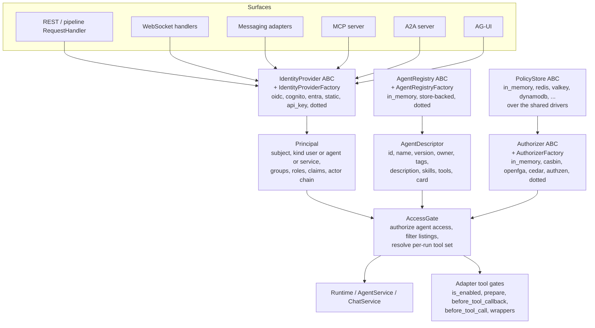

# Design options: identity layer, authorization and agent registry for Agent Kernel

Synthesis note, 2026-09-28. This is not `design.md`; it is the candidate architecture the design
would distil, with the trade-offs and the questions a reviewer must settle first. It draws on
`ak-current-state.md` (verified code), `identity-and-delegation.md`, `authorization-engines.md`
and `agent-registries-and-prior-art.md` (external surveys, with their own verification marks).

## 1. Problem statement in AK terms

The brief asks for four things, and the code shows a fifth precondition:

| Ask | What exists today (`ak-current-state.md`) | Gap |
|---|---|---|
| Identity providers in adapter architecture (#441, #521) | `AuthValidator` / `Authoriser` ABCs, no built-in provider, subject discarded on REST, client-controlled acting user on WebSocket | A `Principal` model, an `IdentityProvider` ABC with a factory, built-in OIDC/JWKS, Cognito, Entra, static and API-key providers, and every surface establishing the acting user from the credential |
| Authorize which agents a user may access, at a level | `select` / `ensure_agent_available` check only registration; MCP, A2A and AG-UI filter by static agent lists that ignore the caller | An `Authorizer` ABC, an access-level scale, enforcement before selection on every surface, and list filtering for catalog routes |
| Authorize which tools an agent may access (on behalf of whom) | Tool sets fixed at load time by per-capability `agents:` lists and OKF roles; no per-run or per-user filtering; no call-time gate AK wires | A tool grant model, a per-run tool-set resolver, and a call-time deny wired through each adapter's native gate |
| Agent registry / catalog with agent identity (#658) | `Runtime._agents` dict keyed by name; `Agent` has no id, version, owner or tags; the A2A card is the only catalog record | An `AgentDescriptor` entity, an `AgentRegistry` ABC with in-memory and store-backed backends, catalog routes, and agent-as-principal |
| Precondition: the acting user is trustworthy | `from_payload` makes the client envelope authoritative; the schedule tools are the only reader of `ACTING_USER_CACHE_KEY` | Fix the identity propagation first; RBAC over a forgeable subject is theatre |

## 2. Candidate architecture

One new package, `agentkernel/identity/`, with three subpackages `provider/`, `authz/` and
`registry/` (decided, Q1: the `schedule/` shape of one capability package holding its axes), and
`core/` owning only the `Principal`, `AgentDescriptor` and `AccessLevel` models. Core consumes the
package only through its ABCs, following the house patterns in `ak-dev-architecture` (pluggable by
default, config reuse, classes not scripts).



### 2.1 Identity layer

- **`Principal`** (Pydantic, in `core/`): `subject: str`, `kind: Literal["user", "agent", "service"]`,
  `provider: str`, `groups: list[str]`, `roles: list[str]`, `claims: dict`, `actor: Optional[Principal]`
  (the RFC 8693 `act` chain: who is acting for whom), `credential_ref: Optional[str]` (a handle for
  outbound token exchange, never the raw token). This generalises `SandboxPrincipal`
  (`sandbox/model.py:114-120`), which could become a projection of it, and replaces the bare
  `Optional[str]` acting user with a typed object while keeping `ACTING_USER_CACHE_KEY` as the
  string view for existing readers.
- **`IdentityProvider` ABC**: `async authenticate(credential: str, context: AuthContext) -> Principal`
  raising a typed `AuthenticationError`, plus optional `exchange(principal, audience) ->
  Credential` for providers that support OBO or ID-JAG (Entra, Okta, Auth0). Built-ins, each behind
  the existing `auth` extra (PyJWT already covers JWKS via `PyJWKClient`; see
  `identity-and-delegation.md` A.1):
  - `oidc`: issuer discovery, JWKS with caching, `aud` / `iss` / `exp` validation, configurable
    claim paths for subject, groups and roles (defaults per the table in
    `identity-and-delegation.md` A.2). This single provider covers Keycloak, Auth0, Okta and Google.
  - `cognito`: `oidc` with `cognito:groups`, `token_use` and the access-vs-id key difference
    pre-configured (issue #521 names it explicitly).
  - `entra`: `oidc` with `oid` as subject, `roles` / `groups` / `wids`, `tid` validation and the
    `groups` overage case surfaced as a typed error.
  - `firebase`: `oidc` against `securetoken.google.com/<project>` with custom claims mapped to
    roles (issue #521 names it; claim shape marked [U] in the survey and must be verified).
  - `static`: a config-listed map of tokens or API keys to principals, for tests, examples and
    the CLI, replacing the hand-rolled `alice-token` maps in `examples/api/thread-openai/app.py:16-41`.
  - dotted path: bring your own.
- **Compatibility**: `AuthValidator` and `Authoriser` stay as the legacy seam. An
  `AuthValidatorIdentityProvider` adapter turns a `ValidationResult` into a `Principal`
  (`subject`, `claims`), exactly as `AuthValidatorAuthoriser` does today (`auth/authoriser.py:35-56`),
  so every existing example keeps working. The default subject `"user"`
  (`auth/handler.py:15`) should be treated as "no subject" by the adapter rather than as a user id.
- **Role mapping**: a small `RoleMapper` (config: `identity.role_mapping: {<group or claim value>:
  [<ak role>]}`) between provider claims and AK roles, applied inside the provider factory so the
  `Authorizer` only ever sees AK roles. This is the "built-in integrations with RBAC configurations
  of auth providers" of #521 without coupling the authorizer to any provider.
- **Agent identity**: an `AgentDescriptor` (below) carries an optional `identity` block naming how
  the agent authenticates outbound (a client-credentials client id, a workload identity reference,
  or "inherit the acting user via exchange"). The runtime constructs an agent `Principal`
  (`kind="agent"`, `subject=agent id`) per run and sets `actor` on the user principal when the run
  is delegated. This is the shape Entra Agent ID, AgentCore and the WIMSE AIMS draft all converge
  on (`identity-and-delegation.md` B, D). Outbound credential exchange and a token vault are a
  later phase; the descriptor field is what makes them possible without a second entity.

### 2.2 Establishing the acting user on every surface

The single most important behavioural change, and a prerequisite for everything else:

- REST: the `add_auth_handlers` dependency's `ValidationResult` (`api/http.py:193`) becomes a
  `Principal` stored on `request.state`; `AgentRESTRequestHandler.run` and the pipeline
  `RequestHandler.run_chat` take `user_id` from it and **reject with 400** a body `user_id` that
  differs from the principal's subject (decided, Q3); an unauthenticated request keeps accepting
  the body field, since the default posture is unchanged (Q2). `AuthorisedRESTRequestHandler._resolve_user` collapses into the same
  path.
- WebSocket: the connection's validated principal, not the frame envelope, is the acting user; the
  `from_payload` rule that the envelope is authoritative (`core/model.py:325-328`) inverts, and the
  `ATTR_USER_ID` attribute becomes the source of `body.user_id` on the runner side
  (`pipeline/agent_runner.py`, `deployment/aws/containerized/akagentrunner.py:86-91`).
- Messaging: the platform sender id is already the body `user_id`
  (`integration/adapter/producer.py:79`); an optional `IdentityResolver` maps `(platform, sender)`
  to a canonical subject, which is precisely issue #243's proposal and slots in as another
  `IdentityProvider` whose credential is the platform sender id.
- MCP and A2A: both run `AgentService.run(prompt)` with no user (`api/mcp/akmcp.py:43`,
  `api/a2a/a2a.py:60-63`) and MCP is mounted outside the auth dependencies (`api/http.py:161`).
  The MCP server must validate a bearer token and serve RFC 9728 metadata to be spec-compliant
  (`identity-and-delegation.md` C.1); A2A cards must publish `securitySchemes`
  (`core/builder.py:38-48` has none). Both then thread the principal through `run_multi(...,
  acting_user_id=...)`.
- Runtime: `Runtime.run` / `stream` accept a `Principal` (keeping `acting_user_id` as a
  backward-compatible string parameter that wraps into a `static` principal), publish it in the
  volatile cache next to `ACTING_USER_CACHE_KEY`, and inject it into the framework context so
  native gates can read it (OpenAI `RunContextWrapper.context`, Pydantic `ctx.deps`, ADK state).

### 2.3 Agent registry and the agent entity (#658)

- **`AgentDescriptor`** (Pydantic, `core/`): `id` (stable, defaults to `name`), `name`, `version`
  (semver, defaults to `"0.0.0"` or the library version as today), `description` (catalog text,
  **never** `get_description()`, which is the system prompt on OpenAI), `owner`, `tags`,
  `visibility` (`private` | `internal` | `public`, compiled into a synthesized catalog grant;
  decided Q5, see 4.2), `surfaces` (the protocol surfaces the agent is reachable on: `rest`,
  `a2a`, `mcp`, `agui`; default every mounted surface; decided Q6, see 4.3), `skills` (the A2A
  `AgentSkill` list), `tools` (names the adapter knows), `identity` (2.1), `runner` name,
  `supports_streaming`, and the
  protocol descriptors (A2A card, MCP tool schema) derived from it. Modelled on the AWS Agent
  Registry record and the A2A discussion's Publication Record
  (`agent-registries-and-prior-art.md` A.5, A.1): protocol descriptor, registry metadata and
  authorization overlay are three layers, and only the first two live on the descriptor.
- **`AgentRegistry` ABC**: `register(descriptor, agent)`, `deregister(id)`, `get(id)`, `list(filter)
  -> page`, `descriptors()`. `Runtime.register` / `agents()` delegate to it, so `Runtime._agents`
  becomes the `in_memory` backend rather than a second registry. Selection is a `registry` config
  block with its own `type` selector (decided, Q9: the `thread` / `schedule` shape, via an
  `AgentRegistryFactory` in the `core/util/factory.py` mould): `in_memory` (today's dict,
  process-local, the CLI and single-process default), `redis`, `valkey`, `dynamodb` over the
  shared drivers reusing `_RedisConfig` / `_DynamoDBConfig` subclasses, and a dotted path. A
  multi-process pipeline deployment points every process at the same store. Remote A2A discovery
  (well-known cards, curated registries) is a later backend, not a first one.
- **Descriptor source**: declared in code on `Module.load` (a `descriptor=` keyword or a fluent
  `Module.describe(agent, ...)` next to `pre_hook` / `run_options`), overlaid by an optional
  `registry.agents` config block keyed by agent id for deployment-owned fields (owner, tags,
  visibility), and, on a store-backed registry, by the persisted record that the management
  routes edit.
  Duplicate `(id, version)` is the uniqueness key, replacing the bare `Exception` on duplicate name
  (`core/runtime.py:209`).
- **Catalog routes**: `GET /api/v1/agents` returns descriptors filtered by the caller's principal
  (today it returns bare names with no filtering, `api/handler.py:102-103`); the same filtered list
  feeds AG-UI's `/agents`, the MCP tool list and `/a2a/catalog`, each narrowed further by the
  descriptor's `surfaces`. The three static allow-lists (`mcp.agents`, `a2a.agents`,
  `agui.agents`) are deprecated over one release: while present they are read as a fallback source
  of `surfaces` with a warning and ANDed with it, so no upgrade widens exposure (decided Q6, see
  4.3).

### 2.4 Authorization

- **Vocabulary** (`core/`): resource types `agent`, `tool`, `thread`, `schedule`, `sandbox`,
  `knowledge` (the last four already have owner or agent-scoped checks that a generic layer can
  absorb over time). A principal's grant on an agent carries an ordered `AccessLevel`, `read <
  write < admin`, meaning the **capability tier the principal may drive through the agent**, not
  what the principal may do to the agent's record (decided Q4, see 4.1): any level implies the
  principal may chat with the agent; each tool grant carries a `tier` (`read` by default) and a
  tool is enabled for a run only when its tier is at or below the principal's level on that agent.
  Editing the agent's record and managing its grants is ownership (the descriptor's `owner` plus a
  platform `registry_admin` role), not a level. Catalog visibility is the descriptor's
  `visibility`, compiled into a synthesized grant (Q5).
- **`Authorizer` ABC**: `async check(principal, action, resource) -> Decision` (allow, deny with
  reason); optional capabilities declared the `KnowledgeCapabilities` way: `list_resources(principal,
  action, resource_type)` and `list_subjects(resource, action)`. The core always has the fallback
  of candidate set plus bulk `check` because the registry is the candidate set
  (`authorization-engines.md` section 3).
- **Grants model for the built-in**: `(subject | group | role) -> agent id | "*" -> level` and
  `(agent id | role) -> tool name | "*" -> invoke`, with a user-to-tool overlay for on-behalf-of
  calls (the WorkOS "intersection of agent and user permissions" rule), stored in a `PolicyStore`
  over the shared drivers (schedule-store key schema shape) or declared inline in config for small
  deployments. Role hierarchy by level ordering, not by nested role sets, keeps the config readable.
- **Built-in backends** per `authorization-engines.md` section 6: `in_memory` / `static` (AK's own
  evaluator, no dependency; the default), `casbin` (same shape, embeddable, `casbin` extra),
  `openfga` (ReBAC with native listing, `openfga` extra), `cedar` (in-process policy-as-code,
  `cedarpy`, not AWS-supported), `authzen` (one HTTP adapter for any AuthZEN 1.0 PDP), and dotted
  path. One `AuthorizerContract` test suite next to the ABC, the `QueueTransportContract` pattern.
- **Relation to OKF roles**: OKF's `consumer` / `producer` / `curator` stay OKF's vocabulary
  (`docs/specs/553-okf-knowledge-bases/design.md:645-648`); the generic layer does not replace them
  in the first iteration. Later, `OKFRoleRegistry.may_write` can be re-expressed as a `knowledge`
  resource grant so one policy store answers both, but that is an explicit migration, not an
  implicit one (Q8).

### 2.5 Enforcement points

| Decision | Where it fires | Mechanism | Notes |
|---|---|---|---|
| May principal use agent A (holds any level on it) | Before selection, on every surface | `AccessGate.authorize_agent(principal, agent)`, returning the principal's level, called from `AgentService.ensure_agent_available` (which every surface already calls, `core/service.py:49-70`) with the principal supplied; `PermissionError` maps to 403 the way `schedule/handler.py:160-172` does | Fires before the session loads, before the thread is written and before the queue is touched, matching the "no phantom thread" rule (`integration/thread/thread_chat.py:209-217`). A `PreHook` is the wrong layer: it runs after all three (`ak-current-state.md` section 6) |
| Which agents may principal `read` | Catalog routes | `AccessGate.visible_agents(principal)` = registry list, then `list_resources` when the backend has it, else bulk `check` | Feeds REST `/agents`, AG-UI `/agents`, MCP `tools/list`, `/a2a/catalog` |
| Which tools agent A may offer in this run, for this principal | Per run, at tool-list time | `AccessGate.tool_set(agent, principal)`, the agent's tool grants whose `tier` is at or below the principal's level, resolved once per `run` / `stream` next to `resolve_run_options`, then applied natively: OpenAI `is_enabled`, Pydantic `prepare` / `filtered`, ADK a `before_tool_callback`, CrewAI `@before_tool_call`, LangGraph filtering in `LangGraphToolBuilder.bind` or wrapping the `StructuredTool`, smolagents wrapping `Tool.forward` | Visibility only; the survey is unanimous that hidden tools are not a boundary (`agent-registries-and-prior-art.md` C.2) |
| May agent A invoke tool T now, with these arguments, for this principal | Call time | The grant-and-tier check re-evaluated at the call (a hidden tool is not a boundary), through the same native gates plus a wrapper installed by `ToolBuilder.bind` for adapters without a gate; a deny returns an `isError`-style result naming the reason, never an exception into the framework (the OKF `write_kb` behaviour) | Fail closed when the authorizer itself errors (the MAF rule); cannot cover hosted tools (OpenAI hosted tools, ADK built-ins) |
| Threads, schedules, sandbox principal | Existing checks | Unchanged in iteration one; `PrincipalResolver` gains a default that reads the run principal so `sandbox.identity.mode: user` works with no custom resolver (today AK never hands it a user, `sandbox/manager.py:306-320`) | Absorbing ownership checks into the generic layer is a later step |

### 2.6 Configuration sketch

Reuses existing models; every new field has a stated reader. Nothing here adds an `enabled` flag:
an `identity` block with a provider enables identity, an `authorization` block enables
enforcement, a `registry` block selects the registry backend, and their absence keeps today's
behaviour unchanged on every surface (decided, Q2: open where open today, refused where AG-UI and
the WebSocket handlers already refuse).

```yaml
identity:
  provider:
    type: oidc                      # oidc | cognito | entra | firebase | static | dotted path
    issuer: https://login.example.com/realms/ak
    audience: agent-kernel
    claims:                         # defaults per provider; overridable
      subject: sub
      groups: realm_access.roles
  role_mapping:                     # provider group or claim value -> AK roles
    ak-admins: [admin]
    ak-users: [user]

authorization:
  type: in_memory                   # in_memory | casbin | openfga | cedar | authzen | dotted path
  store:                            # optional; absent = grants come from this block
    type: redis                     # reuses _RedisConfig / _DynamoDBConfig subclasses
  grants:
    agents:
      - subject: role:admin
        agent: "*"
        level: admin
      - subject: group:support
        agent: support-triage
        level: write
    tools:
      - agent: support-triage
        tools:
          - lookup_ticket                       # tier defaults to read
          - {name: create_ticket, tier: write}  # needs level write or admin on the agent
      - agent: "*"
        tools: [get_agui_state]

registry:
  type: in_memory                   # in_memory | redis | valkey | dynamodb | dotted path (Q9)
  redis:                            # _RegistryRedisConfig(_RedisConfig), prefix ak:registry:
    url: redis://localhost:6379
  agents:                           # overlay, keyed by agent id
    support-triage:
      version: 1.2.0
      owner: cx-platform
      tags: [support, tier-1]
      visibility: internal            # synthesized catalog grant to `authenticated` (Q5)
      surfaces: [rest, agui]          # default: every mounted surface (Q6)
```

The three `agents:` allow-lists on `mcp`, `a2a` and `agui` keep working for one release as a
fallback source of `surfaces` (with a deprecation warning) and are ANDed with it, then removed (Q6).

## 3. Phasing that keeps every step shippable

1. **Identity propagation fix** (small, high value, no new package): `Principal` model,
   `AuthValidatorIdentityProvider`, REST and WebSocket surfaces establish the acting user from the
   validated credential, `Runtime` publishes the principal, MCP gets bearer validation. Closes the
   forgeable-subject gap that every later phase depends on.
2. **Identity providers**: `IdentityProvider` ABC, factory, `oidc` / `cognito` / `entra` /
   `firebase` / `static`, `RoleMapper`, the `identity` config block, contract tests. Delivers #441
   and the provider half of #521.
3. **Agent entity and registry**: `AgentDescriptor`, `AgentRegistry` with `in_memory`, `redis`,
   `valkey` and `dynamodb` backends behind `registry.type`, `Module.describe`, filtered catalog
   routes, A2A `securitySchemes` and 1.0 card fields. Delivers the #658 requirements now merged
   into #603.
4. **Authorization**: `Authorizer` ABC and `in_memory` backend, `AccessLevel`, agent-access
   enforcement in `ensure_agent_available`, list filtering, the `authorization` block. Delivers the
   user-to-agent half of #603.
5. **Tool grants and tiers**: per-run tool set (grant held and tier at or below the principal's
   level) and call-time deny through the six adapters' native gates,
   agent principal and the `actor` chain, sandbox default resolver reading the run principal.
   Delivers the agent-to-tool half of #603.
6. **Engine adapters**: `casbin`, `openfga`, `cedar`, `authzen`. Round 2 designs (decided, Q7 and
   Q8): outbound credential exchange and a token vault; migrating OKF roles and the capability
   `agents:` scopes onto tool grants.

## 4. Decision log

Review round 1, 2026-09-28 (Amitha), in two passes: seven questions settled in the first, and
Q4, Q5 and Q6 settled in the second by taking the recommendations in 4.1 to 4.3. All ten are
closed; the analyses stay as the record of why.

| Q | Decision | Where it landed |
|---|---|---|
| Q1 Package layout | One package, `agentkernel/identity/`, subpackages `provider/`, `authz/`, `registry/`; `core/` owns only the `Principal`, `AgentDescriptor` and `AccessLevel` models | Section 2 lead |
| Q2 Default posture | Unchanged: with no `identity` block every surface behaves as today | 2.6 |
| Q3 Body `user_id` on authenticated requests | Rejected with 400 when it differs from the principal's subject; no `impersonate` grant in round 1 | 2.2 |
| Q4 Access levels | `read < write < admin` is the capability tier a principal may drive through the agent; tool grants carry a `tier`; record management is ownership, not a level (4.1) | 2.4, 2.5, 2.6 |
| Q5 Visibility versus grants | `visibility` stays on the descriptor and is compiled into a synthesized catalog grant to `*` or `authenticated`; the authorizer evaluates one axis (4.2) | 2.3, 2.4 |
| Q6 `mcp.agents`, `a2a.agents`, `agui.agents` | Replaced by a descriptor `surfaces` field; the lists are read as a fallback and ANDed with it for one release, then removed (4.3) | 2.3, 2.6 |
| Q7 Agent identity scope | Descriptor field only in round 1; outbound exchange and token vault are a round-2 design | 2.1, section 3 |
| Q8 OKF and capability scopes | Untouched in round 1; migration onto tool grants is a separate round | 2.4, section 3 |
| Q9 Registry persistence | Own `registry` block with a `type` selector (`in_memory`, `redis`, `valkey`, `dynamodb`, dotted path) | 2.3, 2.6 |
| Q10 Issue anchoring | #603 is the single ticket; the requirements of #441, #521 and #658 were merged into it and those issues closed | GitHub |

### 4.1 Q4: `execute` versus `write`, and which meaning of "level" the brief intends

In the scale of 2.4, `execute` means the principal may send the agent messages: chat and stream,
open sessions and threads with it, schedule tasks against it. `write` means the principal may
change the agent's registry record: its descriptor overlay (description, tags, visibility,
version), its tool grants, publishing and deprecating it. Every product surveyed keeps the two
apart because the population that chats is large and must never edit: Copilot Studio User versus
Editor, Snowflake `USAGE` versus `MODIFY`, `bedrock:InvokeAgent` versus `UpdateAgent`
(`agent-registries-and-prior-art.md` D).

The brief, though, says "read, write, admin capabilities of an accessible agent", which is a
different axis: not what the principal may do *to* the agent but what the principal may do
*through* it. Under that reading:

- each of the agent's tools carries a tier (`read`, `write`, `admin`);
- the principal's level on the agent bounds which tools are offered and allowed in a run;
- every level implies chatting, so `execute` is not a level.

A Kubernetes troubleshooter is the canonical case: `read` gets `kubectl get` and `describe`,
`write` adds `apply` and `scale`, `admin` adds cluster-scoped operations. ServiceNow's dynamic-user
run-as and Snowflake's per-tool privileges do the same thing at the data layer.

**Recommendation: adopt the capability-tier reading.** It is what the brief says, and it gives the
user-to-agent-to-tool intersection in 2.5 a concrete mechanism: a tool is enabled for a run when
the agent holds a grant for it **and** its tier is at or below the principal's level on the agent.
Consequences:

- `AccessLevel` is `read < write < admin`, three steps as the brief said.
- Tool tier is declared once per tool grant (`tools: [{name: apply_manifest, tier: write}]`),
  defaulting to `read`. System tools ship with a tier: sandbox execution tools and the schedule
  tools `write`, knowledge read tools `read`, `write_kb` `write`.
- "See it in the catalog but cannot chat" is not a level; it is the visibility axis (4.2).
- Editing the agent's record and managing its grants is not a level either; it is ownership: the
  descriptor's `owner` and a platform `registry_admin` role may do it. Folding that into `admin`
  would let a cluster admin *using* the troubleshooter reconfigure the troubleshooter, which is a
  different trust.

**Decided (second pass): the capability-tier reading, as recommended.** Section 2.4 and the 2.5
table were rewritten accordingly.

### 4.2 Q5: visibility versus grants, compared with the surveyed products

| Product | Mechanism | Axes |
|---|---|---|
| AWS Agent Registry | approval state (`DRAFT` to `APPROVED`) makes a record discoverable to every registry consumer; no per-record ACL | one axis: lifecycle state, no grants |
| Google Gemini Enterprise | share with users, groups, workforce pools or "all", one role per share | grants only; "all" is a wildcard subject |
| Copilot Studio | share as User with users, groups or everyone; org-wide "End user access" | grants only; wildcard subject |
| Microsoft Agent 365 | publish to users or groups; block | grants only |
| Databricks Unity Catalog | privileges `READ METADATA`, `EXECUTE`, `MANAGE` | grants only; catalog visibility is itself a grant |
| LangGraph Platform | owner metadata filter on search | grants only (owner) |
| A2A registry discussion #741 | `visibility` on the Publication Record plus a separate entitlements overlay | two axes |

Options:

- **(a) Grants only.** An agent is listed for a principal that holds any level on it, or a
  catalog-only grant. Simplest; wildcard subjects (`*`, `authenticated`) express "everyone".
  Cannot express "listed, request access" without a catalog-only grant row per agent.
- **(b) Two independent axes.** `visibility` (`private`, `internal`, `public`) on the descriptor
  decides listing; grants decide use. Most expressive (the #741 shape); two places to look when
  an agent is missing.
- **(c) Visibility as sugar over grants.** `visibility` stays on the descriptor because owners
  think in those terms, but the registry compiles it into a synthesized catalog grant to `*`
  (`public`) or `authenticated` (`internal`); the authorizer evaluates one axis. Listing means
  "holds a catalog grant or any level"; chatting means "holds a level".

**Recommendation: (c).** With the Q4 tier reading it composes without new fields: `internal` lists
the agent for every authenticated principal; a wildcard grant `subject: authenticated, level: read`
makes it chat-able read-only for everyone; explicit grants raise levels for named groups. `public`
additionally serves the A2A well-known card and the MCP tool listing to unauthenticated callers,
which is the only place the Q2 open posture and the registry meet. No `default_level` field is
needed.

**Decided (second pass): option (c), as recommended.**

### 4.3 Q6: the three protocol allow-lists, with pros and cons per option

- **Option 1: keep `mcp.agents`, `a2a.agents`, `agui.agents` as protocol exposure lists**, ANDed
  with visibility and grants (an agent must be exposed on the protocol and visible or granted to
  the caller).
  - Pros: zero config change; covers a real case (an agent visible in the catalog but not callable
    by other agents over A2A); protocol exposure is a deployment decision, visibility an ownership
    one; consistent with the per-capability `sandbox.agents` style.
  - Cons: two places explain why an agent is missing over MCP; three lists carrying two semantics
    (`["*"]` sentinel on A2A and MCP, `None`-means-all on AG-UI, `ak-current-state.md` section 8);
    exposure is invisible to the catalog, which cannot show "reachable over REST and A2A".
- **Option 2: replace the three with one descriptor field `surfaces`** (`[rest, a2a, mcp, agui]`,
  default all mounted surfaces), deprecating the lists over one release: read as a fallback
  source of `surfaces` with a warning, then removed.
  - Pros: one place, shown in the catalog; the A2A card's `supportedInterfaces` and the MCP tool
    list derive from it; ends the sentinel inconsistency; three fields become one.
  - Cons: a migration window to run; `agui.default_agent` validation moves to the registry; a
    field on the overlay describes something that is partly deployment topology.
- **Option 3: remove the lists with no replacement**; visibility and grants decide everything and
  every mounted surface exposes the same set.
  - Pros: fewest fields.
  - Cons: loses the protocol-restriction case entirely; a deployment that must keep an agent off
    A2A has to fake it with visibility.

**Recommendation: Option 2, with Option 1's AND semantics as the deprecation-window behaviour**:
until the lists are removed, both the old list and the new field must admit the agent, so no
existing deployment widens its exposure by upgrading.

**Decided (second pass): Option 2 with the Option 1 window, as recommended.**
