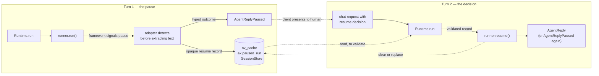

# #606: Human-in-the-loop — durable pause, decision, and resume across framework adapters

Make "the agent is waiting for a human" a first-class outcome of a run instead of an error or a
misleading answer. A runner that detects a framework pause returns a typed **paused reply**,
writes an opaque per-framework resume record into the existing durable session store, and a later
request carrying a **decision** resumes the same run through `Runtime.run`. Four adapters
implement it (OpenAI, LangGraph, Pydantic AI, Google ADK); CrewAI and smolagents declare it
unsupported, for reasons recorded in `research/adapter-strategies.md`.

Supporting research: [`research/framework-hitl-survey.md`](research/framework-hitl-survey.md)
(native capability per framework), [`research/adapter-strategies.md`](research/adapter-strategies.md)
(per-adapter mapping and blockers).

## Motivation

- **Today every pause is lost, and the two loss modes differ in severity.**
  - *Silently wrong*: LangGraph's `ainvoke` returns normally with `__interrupt__` in the result;
    the adapter reads `result["messages"][-1]` (`langgraph.py:427`) and returns that text. The
    caller gets a plausible answer, the graph stays parked in the checkpointer, and nothing looks
    broken.
  - *Silently empty*: ADK's `get_response` keeps only `is_final_response()` text
    (`adk.py:220-229`) and never inspects `event.long_running_tool_ids`, so a pending
    long-running call yields an empty or partial reply.
  - *Ignored*: OpenAI reads `.final_output` and never `.interruptions` (`openai.py:211`).
  - *Stringified*: Pydantic AI reads `result.output` (`pydanticai.py:178`, `:182`; `:171` is the
    `run()` call itself). `DeferredToolRequests`
    is a **dataclass, not a `BaseModel`** (verified — `research/verification.md`), so
    `AgentReplyAny.from_output` returns `None` for it (`model.py:157-161`) and the adapter falls
    through to `str(result.output)` (`pydanticai.py:182`). The user receives an
    `AgentReplyText` containing a dataclass repr.
- **A raised pause would be swallowed too.** All six runners end in
  `except Exception as e: return AgentReplyText(response=user_facing_error_message(e), ...)` —
  `openai.py:221`, `langgraph.py:429`, `pydanticai.py:184`, `adk.py:266`, `crewai.py:405`,
  `smolagents.py:181`.
- **The durable store the issue asks for already exists.** `Runtime.run` calls
  `SessionStore.store(session)` after post-hooks (`runtime.py:228`), and every non-volatile
  top-level key is persisted (`base.py:143-152`) via `pickle` (`core/session/serde.py:2,24,36`).
- **Two patterns for durable per-session state already exist, and this change reuses the lighter
  one.** #526's `framework_context` took a reserved `Session.Keys` entry with three accessors
  (`base.py:41-48,187-214`); AG-UI's shared state took a module-level key in the non-volatile
  cache (`integration/agui/state.py:11,34,56`). Both are persisted by `SessionStore.store()`. The
  paused-run record follows the **AG-UI** shape — see the record section for the decision and the
  risk it accepts.
- **The fail-fast picklability check is reusable either way.** #526's base-`Runner` helper
  (`base.py:279-348`) names the offending entry when a value cannot be pickled; the paused-run
  payload gets the same treatment rather than a second implementation.
- **LangGraph is already checkpointed by AK.** `_prepare_session_and_messages` assigns AK's own
  pickle-serializable checkpointer onto the user's compiled graph and uses `session.id` as
  `thread_id` (`langgraph.py:368-370`, checkpointer at `langgraph.py:53-55`, held on the
  framework-keyed session object at `langgraph.py:341`). Durable LangGraph interrupts therefore
  need no new persistence at all.
- **`supports_streaming` is the precedent for honest per-adapter capability.** A `Runner`
  property (`base.py:376-383`) that CrewAI (`crewai.py:412`) and smolagents
  (`smolagents.py:187`) set to `False`, with `stream()` left raising. Pause capability should
  follow it exactly rather than probing adapters at runtime.
- **The response layer currently cannot express a third outcome.** `ResponseBuilder.build_response`
  produces `{"result": str(result)}` or `{"error": ...}` (`chat_service.py:313-318`), and the
  success status is derived from the *request* (`_success_status`: `202 if req.schedule is not
  None else 200`, `chat_service.py:547-554`). A pause is knowable only from the *reply*.
- **The default session store is process-local.** `session.type` defaults to `in_memory`
  (`config.py:93-97`), so on any multi-replica deployment a pause written by one replica is
  invisible to the replica that receives the decision. This is the "memory-store/multi-replica
  limits" item in the issue's Definition of Done.

## Design idea

## Requirements

### Core — the paused outcome

- Add **`AgentReplyPaused` as a subclass of `AgentReplyAny`** (`model.py:129`), *not* as a new
  member of the `AgentReply` union. *(Decision: open question 1, resolved.)*
  - **The union is therefore unchanged** (`model.py:126`), and so is every `isinstance` tuple over
    it: `runtime.py:174`, `:212`, `:224`, `:260`, `chat_service.py:317`,
    `slack_chat.py:172`, `teams_chat.py:530`. A subclass satisfies `isinstance(reply,
    AgentReplyAny)`, so all seven keep working untouched and the public type alias gains no member.
  - This is safe because **`AgentReply` is never re-validated from JSON** — no `model_validate`
    or `TypeAdapter` over it anywhere in `src/`; `ResponseBuilder` stringifies replies and nothing
    parses them back. Were that not true, a subclass could not survive a serialisation round trip.
  - Adds typed fields on top of the inherited `content`: `session_id: str`, `agent: str`,
    `interruptions: list[PausedInterruption]`.
  - *(Noted, not changed: `session_id` also appears in the response dict `ResponseBuilder`
    builds (`chat_service.py:320-321`), so on the REST path it is carried twice. Kept on the
    model because non-HTTP surfaces — the CLI, A2A, MCP — consume the reply object directly and
    have no response dict. `spec.md` may revisit if that proves noise.)*
  - **`runner` is deliberately *not* on the reply**, though it is on the record. The record is
    internal and needs it to reject a cross-runner resume; the reply is public and crosses the
    queue transport. A client never sends `runner` back and cannot act on it, and publishing which
    framework backs an agent would make a later framework swap a breaking API change. `session_id`
    and `agent` earn their place because the client returns them with its decision.
  - **Overrides `type` from `"other"` to `"paused"`**, giving REST clients a top-level
    discriminator. Safe: nothing in `src/` dispatches on a reply's `type` (verified — only a
    comment at `walledai.py:212`).
  - **Case is deliberate and the two fields differ.** The model `type` stays **lowercase**,
    matching every other discriminator in `model.py` (`"text"`, `"image"`, `"file"`, `"other"`,
    `"resume"`). The response body's `status` is **uppercase `"PAUSED"`**, matching the
    scheduling acknowledgement's `"SCHEDULED"` (`chat_service.py:494`). Do not align them.
  - **`content` is derived from the typed fields, never set independently.** It is populated by a
    `model_validator` at construction, so `__str__` (`model.py:142-143`) still yields readable
    JSON and any surface that only knows `AgentReplyAny` degrades gracefully rather than printing
    a repr. **The typed fields are the single source of truth**; `content` is a view of them.
    Without this rule the same facts sit twice on one model with no precedence, free to drift.
  - `PausedInterruption` carries what a human needs to decide and what the client echoes back:
    `id: str`, `kind: Literal["tool_call", "input_required", "confirmation"]`,
    `tool_name: str | None`, `arguments: str | None` (JSON-encoded), `message: str | None`,
    `payload: dict | None`.
    - **`kind` is AK's own vocabulary, named after what the four frameworks actually produce.**
      *(Decision.)* `tool_call` — the agent wants to invoke a tool and needs approval first
      (OpenAI's `needs_approval`, Pydantic AI's `requires_approval`, ADK's long-running call).
      `input_required` — the agent needs the human to supply a value (LangGraph's `interrupt()`).
      `confirmation` — the agent wants a yes/no on an action it has already decided on (ADK's
      `require_confirmation`).
    - **AK may add kinds as frameworks need them.** The set is AK's to extend; nothing external
      constrains it. *(These three happen to coincide with the routing hints the AG-UI protocol
      uses, which is convenient for that surface — but the coincidence is not a contract, and a
      kind with no counterpart there carries through unchanged, since the field it lands in is a
      free-form string.)*
  - **The opaque framework resume blob is never on this model** — it goes to the session only.
    A reply crosses the queue transport and reaches clients; a `RunState` JSON or an ADK
    `FunctionCall` must not.
- **Six places already branch on `isinstance(..., AgentReplyAny)`** and will now also receive
  pauses: `guardrail/guardrail.py:113`, `guardrail/walledai.py:203`, `core/service.py:155`, plus
  the three stringify sites above (`chat_service.py:317`, `slack_chat.py:172`,
  `teams_chat.py:530`). This is acceptable and partly desirable — an output guardrail
  *should* see what is being asked of a human — and it **cannot break a resume**, because the
  resume state lives in the session, not in the reply. Each of the three non-stringify sites is
  reviewed in `spec.md` and taught to skip the pause only where the existing behaviour would be
  wrong.
- **A post-hook must not be required to handle a paused reply.** Post-hooks run on it (an output
  guardrail should see what is being asked of the human), and the existing type check
  (`runtime.py:224`) accepts it, but no hook is obliged to change.

### Core — the paused-run record

- Store the record in the **non-volatile cache** under a module-level key constant, following the
  AG-UI precedent exactly (`integration/agui/state.py:11,34,56`): `AK_PAUSED_RUN_KEY =
  "ak.paused_run"`, read and written through `session.get_non_volatile_cache()`. *(Decision.)*
  - **No `Session.Keys` entry and no new `Session` accessors.** The reserved-key-plus-accessors
    pattern (`framework_context`, `base.py:41-48,187-214`) is deliberately *not* used here: it
    costs an enum entry and three methods, and `nv_cache` is already the durable bucket that
    `SessionStore.store()` persists.
  - **All access goes through one standalone helper, `PausedRunState`**, living in `core/` and
    shaped like `AGUIState` (`state.py:27-56`) — a small class of static methods, **not** a
    `Runner` method. Three operations, not two:
    - `get(session) -> PausedRun | None` — reads and validates the shape (the value comes back as
      `Any`, so it is checked rather than trusted).
    - `set(session, record)` — writes. Owns the picklability check and the `in_memory` warn-once
      (see Durability guardrails), so both have exactly one implementation.
    - `clear(session)` — deletes.
    - **It cannot be a `Runner` method**, because `Runtime` must read the record to validate a
      resume (see the dispatch rules) and `Runtime` is not a `Runner`. The helper has to be
      reachable by `Runtime` *and* by all four adapters, which is what rules out the
      `_store_framework_context` shape here even though the record is otherwise its twin.
    - The key name is therefore spelled once, and no caller writes
      `get_non_volatile_cache().get(...)` directly.
    - **Named `…State`, not `…Store`, deliberately.** Every `*Store` in AK is a pluggable
      backend with an ABC, a factory and a config block — `SessionStore`, `ThreadStore`,
      `ScheduleStore`, `AttachmentStore`, `ResponseStore`. This is none of those: it is three
      one-line accessors over a dict that already exists, with nothing to configure or
      provision. `AGUIState` is the accurate precedent and the name follows it. Persistence
      is entirely `SessionStore`'s, which pickles the whole session at `runtime.py:228`.
  - **Accepted risk, stated plainly because it is real.** `nv_cache` is documented as application
    space — "These caches can be used by application code to store data that is not part of the
    agent context" (`base.py:35-38`) — and `KeyValueCache.clear()` (`core/util/key_value_cache.py:68`)
    is reachable by any application holding `session.get_non_volatile_cache()`. An app clearing
    its own bucket therefore **destroys a pending human decision**, silently. Two mitigations,
    both required:
    - the `ak.` key prefix marks it as framework-owned and makes a collision with an application
      key implausible;
    - the user-facing docs must state that clearing the non-volatile cache discards a pending
      pause, alongside the existing "answer it soon or lose it" guidance.
  - Consequence for typing: the record comes back as `Any` and must be validated on read rather
    than trusted, since no typed accessor guards the write.
- The record is a **framework-agnostic envelope around an opaque payload**:
  - `runner: str` — the runner name that produced it; a resume against a different runner is an
    error, not a best-effort attempt.
  - `agent: str` — the agent name, required because OpenAI's `RunState.from_json(initial_agent=…, state_json=…)`
    needs the original starting agent and AK resolves agents by name.
  - `created_at: str` — ISO-8601 UTC, for diagnostics and operator triage only. It is **not** the
    staleness mechanism; staleness uses the run counter below, because wall-clock time cannot
    tell whether an ordinary run has advanced the framework state.
  - `interruptions: list[PausedInterruption]` — the same list carried on the reply, so a resume
    can be validated without deserialising the opaque payload.
  - `payload: Any` — per-framework, opaque to core. **Must be picklable**; reuse the existing
    fail-fast check (`base.py:329-348`) rather than writing a second one.
- **Many interruptions per pause; at most one paused run per session.** These are different
  things and the distinction is load-bearing:
  - **Multiple interruptions are fully supported** and are the normal case, which is why
    `interruptions` is a list. Every framework produces them that way: OpenAI's
    `RunResult.interruptions` is a list, Pydantic AI's `DeferredToolRequests.approvals` is a
    list, LangGraph resumes multiple interrupts by an `{id: value}` map, and ADK can have several
    long-running calls outstanding. One pause can ask a human several questions at once.
  - **One paused *run* per session is a framework constraint, not AK bookkeeping.** Three of the
    four adapters keep a single conversation thread per AK session: LangGraph has one checkpointer
    thread keyed on `session.id` (`langgraph.py:368-370`), Pydantic AI stores one message history
    on the session (`pydanticai.py:173-174`), and ADK has one event history (`adk.py:59-70`).
    They cannot hold two independently resumable runs at once. OpenAI may tolerate it, since
    `RunState` is a self-contained snapshot — **unverified, and `spec.md` must test it rather than
    assume it**, because AK also appends to one shared item list (`openai.py:51-77`).
- **Staleness: a pause can be invalidated by a later ordinary run.** This follows directly from
  the decision that a new prompt runs and keeps the pause (see the decision/resume path): that run
  advances the very framework state the pending pause would resume from.
  - The record carries a **staleness marker**, backed by a per-session run counter. **No such
    counter exists in `core/` today** (verified), so this change introduces it:
    - It lives at **`ak.run_seq` in the non-volatile cache**, beside `ak.paused_run` — same
      bucket, same durability, same lifetime, so neither can outlive the other.
    - **`Runtime` owns incrementing it**, once per `run()` / `stream()`. No adapter touches it.
    - **It counts runner invocations, and the increment point is load-bearing, not detail:**
      incremented **after the hook chain, immediately before `runner.run()` / `stream()`** — so
      it tracks *framework-state advances*, not request arrivals.
      - Incrementing earlier would make the same pause stale on one backend and live on another.
        `InMemorySessionStore.load()` returns the **live** `Session` object
        (`core/session/in_memory.py:87`), while Redis/DynamoDB only ever see what `store()`
        pickled. A pre-hook halt returns at `runtime.py:214` without reaching `store()` at
        `:228`, so a pre-chain increment would persist on `in_memory` and vanish everywhere
        else. Counting invocations makes Rule 2 hold identically on every backend.
      - **An adapter-caught error reply counts as an advance.** Each adapter's `except` returns
        text and `Runtime` then stores the session, and the framework may have moved before it
        failed. Treating it as an advance is the conservative reading, consistent with the
        design's "fail honestly" stance: a resume after a failed turn reports staleness rather
        than resuming from state that may have shifted.
    - The record stores the value current when it was written.
    - At resume, `Runtime` compares **before** incrementing for the current turn: any advance
      means an ordinary run intervened, so the pause is stale.
    - `nv_cache.clear()` drops the counter along with the record. That is consistent rather than a
      hole — both vanish together, and a missing record already fails the resume.
    - `spec.md` pins the exact comparison and the increment point; the design's job is to say the
      counter exists, where it lives, and who owns it.
  - **Resuming a stale pause fails with a clear error** naming what happened, rather than
    resuming against moved-on state and producing a plausible wrong result — the same failure
    class this whole change exists to eliminate.
  - **If a later run itself pauses, its record replaces the pending one.** Not a policy
    preference: the framework can only hold one resumable run, so the earlier pause was already
    unresumable the moment the later run advanced the state. Keeping it would preserve a record
    that cannot be acted on.
- The record is written **inside the adapter's successful path**, before the reply is returned —
  never in a `finally` — so a crashed run leaves no phantom pause. Same placement rule #526 set
  for `framework_context` write-back.
- Expiry rides the session store's own TTL (`session.redis.ttl` default 604800,
  `config.py:27`). No separate pause TTL.

### Core — the decision / resume path

- Add **`AgentRequestResume`** to the `AgentRequest` union (`model.py:125`):
  `type: Literal["resume"]`, `decisions: list[ResumeDecision]`.
  - `ResumeDecision`: `id: str` (matching a `PausedInterruption.id`),
    `status: Literal["approved", "denied", "cancelled"]`, `message: str | None` (the human's
    reason or free-text answer), `payload: dict | None` (overridden arguments, ADK confirmation
    payload).
  - **`status` is three-valued, not a bool.** *(Decision.)* There are three things a human can
    do, and the third is a button, not a timeout — nothing waits on a pause, so every outcome
    arrives as its own request:
    - `approved` — do it.
    - `denied` — **don't** do it. A decision was made.
    - `cancelled` — the human dismissed the request without deciding. **Not the same as denied**,
      and the agent should not tell a user their request was refused when nobody refused it.
    - **The counter-argument, and why it loses.** Three of the four frameworks are binary
      (OpenAI's `approve`/`reject`, Pydantic AI's `ToolApproved`/`ToolDenied`, ADK's `confirmed`),
      so `cancelled` has no distinct framework call and degrades to *deny* at the adapter. But the
      framework call is not the only thing AK does with it: AK synthesises the rejection message
      the model sees, records the turn in a thread, and reports it. Flattening AK's model down to
      what the poorest framework can express is the opposite of the pattern this design follows
      everywhere else (`supports_pause`, `supports_streaming`, #526's per-adapter fidelity table)
      — **model the union honestly, degrade per adapter, document the degradation.**
    - It also stops AK discarding a distinction that arrives already structured: AG-UI's
      `ResumeStatus` is `Literal["resolved", "cancelled"]` (verified closed —
      `research/verification.md`), so a bool would flatten `cancelled` at the door.
    - The `Literal` gives `ResumeSpec`'s validator the check for free; no extra code.
  - **Why a union member here, when the paused reply is a subclass.** The asymmetry is
    deliberate; the two unions differ in both cost and in what a subclass would inherit. The
    principle is *match the shape to what you need to inherit*, not "always subclass":

    | | Inherit existing handling? | Cost of a union member | Choice |
    |---|---|---|---|
    | `AgentReplyPaused` | **Yes** — guardrails, `AgentService.run` and the stringify sites should all see a pause | **7** `isinstance` sites | subclass `AgentReplyAny` |
    | `AgentRequestResume` | **No** — the existing handling is *skip* | **1** `isinstance` site (`runtime.py:180`) | own union member |

    - **The cost is one line.** Adding to `AgentRequest` touches only the hook-return validation
      tuple at `runtime.py:180`. `AgentRequestAttachmentRef` set the precedent: added to this
      union for thread support, it touches that same single site plus its own intended consumers.
      Against that, a subclass buys nothing worth a conceptual compromise.
    - **A subclass would inherit being ignored.** All six adapters do
      `isinstance(req, AgentRequestAny): continue` — `openai.py:128`, `langgraph.py:352`,
      `adk.py:140`, `pydanticai.py:116`, `crewai.py:340`, `smolagents.py:141` — and CrewAI's
      spells out the contract: "AgentRequestAny is handled only by pre-hooks, not by the agent
      itself". On the reply side inheriting existing behaviour was the *point*; here there is no
      handling to inherit.
    - **It would work against Rule 1.** `AgentRequestAny` is the type pre-hooks are expected to
      consume and strip — the contract CrewAI's comment spells out at `crewai.py:340`.
      *(`MultimodalPreHook` is not an example of this: it strips `AgentRequestImage` /
      `AgentRequestFile` / `AgentRequestAttachmentRef`, `core/multimodal/hooks.py:155`, and never
      touches `AgentRequestAny`.)* Dressing the control signal as
      that type makes it more likely a hook eats the resume marker — the precise hazard Rule 1
      exists to prevent. Rule 1 still protects us, but the shape should not fight it.
    - **The semantics are opposite.** `AgentRequestAny` is documented as extra context for
      pre-hooks (`model.py:59-70`); `AgentRequestResume` is a control signal `Runtime` dispatches
      on *before* any hook runs.
- Add `resume: Optional[ResumeSpec]` to `BaseChatRequest` (`model.py:243-261`), sitting beside
  `schedule` and built into an `AgentRequestResume` by `RequestBuilder`.
  - **`ResumeSpec` is the public request shape**, and follows `ScheduleSpec`'s precedent exactly
    (`model.py:214-240`): a pydantic model with a per-field docstring and a `model_validator`
    doing **structural validation only**.
    - Field: `decisions: list[ResumeDecision]`.
    - Structural checks, in the validator: the list is non-empty, and `ResumeDecision.id` values
      are unique.
    - **Semantic checks stay in `Runtime`** — that the ids match real `PausedInterruption`s, that
      a record exists, that it is not stale. This is the same split `ScheduleSpec` makes by
      deferring cron/timezone semantics to `ScheduleManager`, and it is required by the
      validation-in-`Runtime` rule below: a `ValidationError` raised inside the model would not
      carry the actionable message those failure modes owe the caller.
    - **"Address every open interruption" is a `Runtime` check, not a model one** — `ResumeSpec`
      cannot see the pending record, so it cannot know what "every" is. It is an **AK-wide** rule
      (see the failure modes), not an AG-UI one; AG-UI happens to require the same thing.
  - **A request carrying both `prompt` and `resume` is rejected** with a `ValueError` → 400.
    *(Decision.)* The frameworks disagree on whether a resume can carry new content — Pydantic
    AI's `run(content, …, deferred_tool_results=…)` accepts it, OpenAI's
    `Runner.run(agent, state)` and LangGraph's `Command(resume=…)` do not — so forwarding it
    would work on one adapter and be silently dropped on two others. Ignoring it would
    discard something the user typed. Rejecting is the only option that behaves the same
    everywhere and tells the caller what happened.
  - **`schedule` + `resume` on one request is rejected the same way** — but **not from
    `_validate`, which runs too late.** `_maybe_schedule` is the first statement of all four
    execution-core entry points (`chat_service.py:390`, `:407`, `:428`, `:455`) and returns the
    202 acknowledgement immediately; `_validate` is only reached later, inside `_prepare_async`
    (`chat_service.py:564`). A rejection placed in `_validate` would therefore never fire — the
    request would already have been deferred, with the resume block silently discarded.
  - **Both rejections belong in one guard, called first in each of those four entry points** —
    the same shape `_maybe_schedule` itself uses, and for the same reason: it has to run before
    anything else consumes the request. `spec.md` names the helper; the requirement here is the
    ordering, because getting it wrong makes the `schedule` + `resume` rule unreachable code.
  - `prompt` must become optional-in-effect for a resume-only request. `BaseChatRequest.prompt`
    is a required field (`model.py:255`), but `ChatService._validate` already waives the
    prompt check when a prebuilt request list is supplied (`chat_service.py:684-686`) — so the
    seam exists. `spec.md` must state which of the two it uses: relax the model field, or route
    resumes through the prebuilt-list path.
- `Runtime.run` dispatches on the request list: an `AgentRequestResume` present ⇒ call
  `agent.runner.resume(agent, session, requests, decisions, record)` instead of `agent.runner.run(...)`
  (`runtime.py:219`). `Runtime.stream` does the same around `runner.stream` (`runtime.py:270`),
  dispatching to `resume_stream`. **Three numbered rules govern the dispatch**; the pre-hook
  bullet below refers to them by number rather than restating them:
  - **Rule 1 — extract the decisions before the hook chain; take the branch after it.** Two
    separate lines, not one `if` at the call site — `_prepare_requests` reassigns
    `requests = reply` (`runtime.py:186`), so a hook that filters the list could drop the marker,
    and a check made at the call site would then dispatch to `run()`, turning a resume silently
    into a fresh turn.
  - **Rule 2 — a halt on the resume path must not consume the decision.** Any pre-hook may end a
    run by returning an `AgentReply` (`runtime.py:174-175`), and `Runtime.run` then returns
    without reaching the runner (`runtime.py:212-214`). On an ordinary turn that costs a turn; on
    a resume it would commit the human's decision, return a reply the client reads as completion,
    and leave `paused_run` still pending — the decision lost with nothing reporting it. So a halt
    on this path leaves the record **intact**, and the client may answer again.
  - **Rule 3 — `Runtime` never clears the paused-run record.** Clearing after `resume()` returns looks
    right and is wrong: **a resume can pause again**, the adapter writes the new record inside its
    success path, and a clear afterwards would delete it. Clear-or-replace belongs to the adapter,
    via `PausedRunState`, at the same **point in the code path** `_store_framework_context` sits
    today (`openai.py:213`) — inside the `try`, after a successful native call. The comparison is
    about *placement*, not about where the helper lives; the store is standalone, not a `Runner`
    method. Rule 2 holds partly *because* of this rule — a halt leaves the record alone only if
    nothing cleared it earlier.
  - **Validation happens in `Runtime`, before the branch — never inside the adapter.** Every
    adapter ends in `except Exception: return AgentReplyText(user_facing_error_message(e))`
    (`openai.py:221`, `langgraph.py:429`, `pydanticai.py:184`, `adk.py:266`), and `resume()` will
    be written the same way. The seven resume failure modes raised there would be swallowed into
    *"Sorry, something went wrong"* — precisely what this design forbids. They are also generic,
    needing no framework knowledge, so adapter-side checks would be written four times.
    `supports_pause` is checked here too, so an unsupported runner names itself in the error.
    **`Runtime` then passes the record it just validated into `resume()` / `resume_stream()`**,
    rather than letting the adapter re-read it — one read, and no chance of `Runtime` validating
    one record while the adapter resumes from another.
  - **The hook-processed `requests` list is passed too, not just the decisions.** Every adapter
    opens with `ToolContext(Runtime.current(), agent, session, requests)` — nine sites, e.g.
    `openai.py:200`, `langgraph.py:392`, `pydanticai.py:159`, `adk.py:194` — and tools read it
    via `ToolContext.get().requests`. Post-hooks take `requests` as well (`runtime.py:223`).
    Without it a resuming adapter has nothing to put in the tool context.
    - **On a resume, `ToolContext.requests` holds the hook-processed list containing the
      `AgentRequestResume`** — the list as the hook chain left it, not as it arrived, so a
      guardrail's edit to the human's message is what tools and post-hooks see.
  - **Pre-hooks do run on a resume**, under **Rules 1 and 2** above, which exist only on this
    path. *(Decision: open question 3, resolved.)* They must run because a human's free-text
    answer (`ResumeDecision.message`) reaches the model, and skipping the chain would create a
    route to the model that no input guardrail ever inspects. Rule 1 stops a hook turning the
    resume into a fresh turn; Rule 2 stops a halt destroying the decision. Rule 3 is not a hook rule, but it is what makes Rule 2 hold — a halt leaves the record intact only because nothing cleared it earlier.
    - **Input guardrails must be taught to read a resume, or the justification above is false.**
      `BaseGuardrailUtil._extract_text_from_requests` collects text from `AgentRequestText`
      only (`guardrail/guardrail.py:100-102`), so as the code stands today the human's
      `ResumeDecision.message` would reach the model **without any guardrail seeing it** — the
      exact hole running the chain was meant to close. *(Decision.)* The extraction is
      extended to pull `message` and string `payload` values out of `AgentRequestResume`.
      - This is a change under `guardrail/`, and it belongs in **PR 2's scope** alongside the
        `Runtime` dispatch — not deferred to an adapter PR, since without it PRs 1–2 ship a
        stated security property they do not deliver.
    - The other two system pre-hooks stay harmless on a decision-only request:
      `MultimodalPreHookFactory` and `SandboxPreHookFactory` (`runtime.py:55`) no-op. The
      rules exist for the halt and rewrite hazards, not for them.
    - Note that "the hooks would no-op anyway" is **not** an argument for skipping the chain — it
      says they are pointless here, not that running them is unsafe. The hazard is the halt, and
      it is present whether or not the hooks do any work.
  - **Post-hooks do run on the resumed reply**, unchanged (`runtime.py:221-226`).
  - Session store and volatile-cache clearing are unchanged (`runtime.py:228-231`).
- Failure modes are errors with actionable messages, not silent fallbacks:
  - resume with no paused run in the session;
  - resume whose `runner` does not match the current agent's runner;
  - a `ResumeDecision.id` matching no `PausedInterruption.id`;
  - a paused run whose opaque payload no longer deserialises (SDK upgrade — OpenAI's `RunState`
    carries a `_schema_version`);
  - **a stale paused run** — one an ordinary run has since advanced past (see Staleness above);
  - **an agent mismatch** — the resume names a different agent than `record.agent`. `Runtime`
    **resolves the agent from the record**, and a conflicting explicit `req.agent` is an
    error rather than an override. Two agents can share a runner, so a `runner` match alone
    does not protect: resuming the wrong one would rebuild OpenAI's state with the wrong
    `initial_agent`, and on ADK/Pydantic AI would resume another agent's conversation;
  - **a partial resume** — decisions that do not address **every** open interruption. Enforced
    in `Runtime` for **all** surfaces, not only AG-UI: the frameworks themselves cannot take a
    partial answer (LangGraph re-raises the unaddressed interrupts, Pydantic AI expects a
    result for every deferred call), so this is a property of resuming, not an AG-UI quirk.
- **A new prompt arriving while a pause is pending runs normally, and the pause is kept.**
  *(Decision.)* The user changed the subject; AK does not own that choice and must not silently
  discard work on their behalf. Concretely:
  - The new prompt takes the ordinary path — pre-hooks, `runner.run()`, post-hooks — exactly as
    if no pause existed.
  - `paused_run` is **not** cleared, so the human can still answer the pending decision on a
    later turn.
  - Only `runner.resume()` (on success) and an explicit new pause clear or replace the record;
    an ordinary turn leaves it untouched. This is the one case where the "clear on a non-paused
    reply" rule does **not** apply, and `spec.md` must make that conditional explicit or an
    ordinary turn will delete the pending pause.
  - **Accepted consequence — keeping the pause is best-effort, not a guarantee.** The new run
    advances the framework state the pending pause would have resumed from, and on LangGraph,
    Pydantic AI and ADK there is only one such thread per session (see the paused-run record).
    So the kept pause is often **no longer resumable**, and AK must say so rather than imply
    otherwise:
    - The record is marked stale, and a resume against it fails with a clear error instead of
      resuming against moved-on state.
    - If the new run itself pauses, its record replaces the stale one.
    - The client should therefore treat a paused reply as **answer it soon or lose it**, and the
      user-facing docs must say that plainly.
    - This does not change the decision — the user changed the subject and AK does not own that
      choice — but it does mean AK's obligation is to fail honestly, not to preserve something it
      cannot honour.

### Core — the `Runner` surface

- Add `supports_pause -> bool` to `Runner`, **defaulting to `False`**; the four implementing
  adapters opt in. This differs from `supports_streaming`, which defaults to `True`
  (`base.py:376-383`), and the difference is the point: `stream()` is `@abstractmethod`
  (`base.py:385`) so every runner implements it and `True` is honest by default, whereas
  `resume()`/`resume_stream()` are non-abstract raising defaults — a default of `True` would have
  a bring-your-own `Runner` advertise a capability it does not have and then raise outside its
  own `try/except`. Defaulting to `False` is the same honesty argument this design makes for
  `supports_streaming`, applied to a differently-shaped method.
- Add **two** methods to `Runner`, both defaulting to raise `NotImplementedError` naming the
  runner, so an adapter that has not implemented them fails loudly rather than appearing to work:
  - `resume(agent, session, requests, decisions, record) -> AgentReply`
  - `resume_stream(agent, session, requests, decisions, record) -> AsyncGenerator[StreamEvent, None]` — the
    streaming counterpart. Separate entry points mean the contract grows to four methods, not
    two; that is the accepted cost below.
- **CrewAI and smolagents need no code at all** — they simply do not opt in, and inherit
  `supports_pause = False` plus the raising defaults. Note this inverts their streaming
  situation, where they must *actively* set `supports_streaming = False` (`crewai.py:412-423`,
  `smolagents.py:187-199`) because that property defaults to `True`. Since `Runtime` checks
  `supports_pause` before dispatching, the raise is a **backstop** for a direct caller rather
  than the primary mechanism; both are kept deliberately.
- **Accepted: separate entry points duplicate the adapter envelope.** *(Decision, taken with the
  numbers in front of us.)* Every framework resumes through its **normal native call** with
  different input — `Runner.run(agent, state)`, `ainvoke(Command(resume=…), config)`,
  `agent.run(…, deferred_tool_results=…)`, `run_async(new_message=FunctionResponse, …)` — so
  `resume()` repeats most of `run()`:

  | Adapter | Lines that differ | Lines copied verbatim |
  |---|---|---|
  | OpenAI (`196-222`) | ~4 | ~21 |
  | Pydantic AI (`156-188`) | ~3 | ~21 |
  | ADK (`240-267`) | ~4 | ~18 |
  | LangGraph (`389-433`) | ~12 | ~21 |

  About **80 duplicated lines for `run()`, and the same again for streaming**. Roughly 14 lines
  per adapter are pure envelope (`ToolContext`, `_load_/_store_framework_context`, the
  `except`/`finally`); the rest is structured-output handling and the new pause-detection block.
  - **Why accept it:** a separate `resume()` keeps the capability visible in the type, keeps each
    method single-purpose, and keeps this change's blast radius small. Reusing `run()` would
    avoid the copies but hand the adapter its resume input implicitly and put two paths in one
    method.
  - **Known follow-up, deliberately out of scope:** the duplicated envelope is not caused by
    having two methods — every adapter's `run()` already repeats it today. Extracting a shared
    base-`Runner` template method would remove both the new duplication and the existing kind.
    That refactors four adapters including the non-pausing path, so it is its own issue, taken
    later if the duplication proves painful.
  - **The one piece worth watching:** pause detection is the newest and most framework-version-
    sensitive code, a resumed run can pause again, so it exists in both methods — eight copies
    across the four adapters. If any part of the envelope is shared first, it should be this.
- **The record's read/write/clear is *not* on `Runner`.** It lives on the standalone
  `PausedRunState` (see the paused-run record), because `Runtime` needs it too. Adapters call
  `PausedRunState.set` / `.clear` inside their success path; they never need a read helper,
  since `Runtime` hands them the already-validated `record`.
- **No enable flag anywhere.** Per the issue's Definition of Done, HITL is active whenever a
  framework pauses. No config block, no `AKConfig` section, no per-agent opt-in.

### Streaming

- Add a **`RunPaused`** member to the `StreamEvent` union (`event.py:131-147`).
  - **The union's invariant is reworded, not quietly departed from.** `event.py:16-17` currently
    reads "Every field is a `str`, `int` or `bool`", and `test_stream_events.py` pins it — a
    `list[PausedInterruption]` carrying a `dict | None` payload breaks that letter even though
    it stays JSON- and pickle-safe. *(Decision.)* Relax the wording to **"every field is
    composed of JSON primitives; no field carries a framework-native object"**, and update the
    `event.py` docstring and that test to match.
    - The alternative — carrying the interruptions as a JSON string — was rejected: it pushes
      parsing onto every consumer to preserve a wording that the invariant's actual purpose
      (picklable, JSON-serialisable, framework-agnostic) does not require.
    - The docstring and test change belong to **PR 1**, with `RunPaused` itself.
  - The opaque payload stays in the session and never rides the event.
  - `Runtime.stream` yields it as a normal `StreamChunk(event=...)` and then terminates the
    stream with the existing `StreamChunk(done=True)` (`runtime.py:286`) — a pause is not an
    error, so it must **not** be reported through `StreamChunk.error`.
- Per-adapter streaming pause support:
  - **OpenAI** — supported. Drain `stream_events()`, then read `RunResultStreaming.interruptions`
    at the point the adapter already writes framework context (`openai.py:268-272`).
  - **Pydantic AI** — supported. `DeferredToolRequestsEvent` arrives on `run_stream_events()`,
    which the adapter already consumes (`pydanticai.py:190+`).
  - **LangGraph** — supported. The adapter uses `astream_events(version="v2")`
    (`langgraph.py:469-473`), which has no `.interrupts`; detection reads graph state after the
    stream drains, where the adapter already calls `aget_state(config)` (`langgraph.py:481`).
  - **ADK** — **unverified; decided by test in PR 4, not assumed.** *(Corrected: an earlier draft
    of this design said ADK streaming pause was "documented as unsupported". That was wrong —
    **there is no such upstream documentation**. The ADK resume guide never mentions streaming,
    and the two issues originally cited are both **closed** and both against ADK 1.x, not the
    pinned 2.8.0. See `research/verification.md`.)*
    - The design does not prevent ADK streaming pause. If it works at 2.8.0, support it.
    - Two things in 2.8.0's source keep it an open risk rather than a safe assumption: the pause
      check carries ADK's own comment that its two-event window is "a known limitation"
      (`base_llm_flow.py:966-978`), and the partial/non-partial id mechanism is intact —
      `populate_client_function_call_id` assigns an id only when absent (`functions.py:245-246`)
      and runs for both, while only non-partial events are persisted
      (`base_llm_flow.py:1130-1133`), so an id a client reads off a streamed partial event may
      never have been stored.
    - **If the test shows it broken**, the streamed run yields a clear error and the limitation
      is documented as **AK's own finding against 2.8.0, with a reproducible case** — never
      attributed to an upstream position that does not exist.
- Resume in stream mode goes through `Runtime.stream` with the same `AgentRequestResume`, which
  dispatches to `resume_stream` under the same three rules.

### Adapters

Detection must always be placed **before** the existing text extraction, never as a fallback —
that ordering is what distinguishes this from the current silent-loss behaviour.

| Adapter | Detect | Persist as `payload` | Resume call |
|---|---|---|---|
| **OpenAI** | `result.interruptions` non-empty, checked before `.final_output` (`openai.py:211`) | `result.to_state().to_json()` | `RunState.from_json(initial_agent=agent.agent, state_json=payload)`, apply `approve`/`reject`, `Runner.run(agent.agent, state)` |
| **LangGraph** | `"__interrupt__" in result`, checked before `result["messages"][-1]` (`langgraph.py:427`) | interrupt ids + `.value`s only — the checkpointer already holds the state | `ainvoke(Command(resume=...), config)` on the same `thread_id` (= `session.id`) |
| **Pydantic AI** | `isinstance(result.output, DeferredToolRequests)`, checked before `AgentReplyAny.from_output` (`pydanticai.py:178`) | `to_jsonable_python(result.all_messages())` (already written at `pydanticai.py:173-174`) + the requests | `run(content, message_history=..., deferred_tool_results=DeferredToolResults(...))` |
| **Google ADK** | per-event: `event.long_running_tool_ids` ∩ part `function_call.id`, **or** a `function_call` named `adk_request_confirmation` — in `get_response` (`adk.py:204-230`) | pending `FunctionCall` id + name, confirmation hint/payload, `invocation_id` | `run_async(new_message=Content(parts=[Part(function_response=...)]))`, plus `invocation_id=` when the app is resumable |
| **CrewAI** | — | — | inherits `supports_pause = False` |
| **smolagents** | — | — | inherits `supports_pause = False` |

**How each adapter renders `ResumeDecision.status`.** Only LangGraph can carry all three
natively; the other three degrade to their binary call, and **AK supplies the message that keeps
the two negative cases distinguishable to the model**:

| Adapter | `approved` | `denied` | `cancelled` |
|---|---|---|---|
| **OpenAI** | `state.approve(item)` | `state.reject(item, rejection_message=message)` | `state.reject(item, rejection_message=`AK's dismissal text`)` |
| **Pydantic AI** | `ToolApproved(override_args=payload)` | `ToolDenied(message=message)` | `ToolDenied(message=`AK's dismissal text`)` |
| **Google ADK** | `{"confirmed": true, "payload": payload}` | `{"confirmed": false}` | `{"confirmed": false}`, with AK's text where the response body allows |
| **LangGraph** | `Command(resume=…)` | `Command(resume=…)` | `Command(resume=…)` — **carries the status faithfully**, since `resume` takes an arbitrary value and the user's node decides what to do with it |

- **The dismissal text is AK's, not the client's.** On a `cancelled` decision the human gave no
  reason, so `message` is typically empty. AK generates wording that reads as *an absence of a
  decision* rather than a refusal — the difference between an agent saying "your refund was
  declined" and "we could not get this approved". A bool plus a client-supplied message could not
  guarantee this, because a client that sent nothing would leave the model to infer a refusal.
- `spec.md` fixes the exact wording once, in shared code, so the four adapters do not each invent
  their own.

- **LangGraph needs no new persistence.** AK already assigns its own pickle-serializable
  checkpointer and derives `thread_id` from `session.id` (`langgraph.py:368-370`), so interrupts
  are durable on any configured session backend. The design must document that AK **overwrites**
  a user-supplied checkpointer — pre-existing behaviour that HITL makes load-bearing.
- **ADK requires a construction change to be durable**, and the break analysis is done.
  `ResumabilityConfig(is_resumable=True)` lives on an `App`, while the adapter builds
  `Runner(agent=..., app_name=..., session_service=...)` from a bare agent (`adk.py:201`).
  Verified against `google-adk` 2.8.0 — full break analysis, with the source citations, is in
  [`research/verification.md`](research/verification.md) ("Follow-up: ADK `App` break analysis").
  It is near-free structurally: ADK already wraps AK's agent in an `App` internally, and the
  `app_name` override preserves AK's session key. Two costs are real:
  - **Sub-agent routing changes.** With resumability on, a turn whose previous event was a
    function response is routed back to the agent that made the call; with it off that routing
    is deliberately skipped. **For an existing AK user running ADK sub-agents, which agent
    handles the next turn can change** — a trade-off ADK made on purpose, not a bug being fixed.
  - **ADK sessions grow**, because `is_resumable` also gates agent-state event emission, and
    those events accumulate in the session AK pickles.
  - **Decision: enable it unconditionally, and document both effects.** *(Open question 5,
    resolved.)* Not gated per-agent — a gate would reintroduce exactly the enable flag the issue
    forbids, and would make whether a pause survives depend on config a user may not have set.
    The two costs are accepted on their own terms:
    - **The routing change is the application's concern, not AK's.** Which agent handles a turn,
      and whether a sub-agent can transfer back to its root, is agent design — owned by whoever
      builds the agent graph. AK's job is to state clearly that resumability is on so that
      choice can be made informedly, not to second-guess it.
    - **The session growth is inherent to ADK**, not something AK introduces or can avoid while
      supporting ADK pauses at all.
  - **Documentation requirement:** both effects must reach users, not just this spec — the
    routing change is a behavioural change for existing multi-agent ADK apps and belongs in
    release notes and the ADK adapter docs, alongside ADK's own "tools may run more than once
    when resuming" warning.
- **ADK durability is confirmed.** The ADK conversation lives in `InMemorySessionService` inside
  `GoogleADKSession` (`adk.py:59-70`), which is pickled with the AK session. That service was
  import-checked and pickles cleanly both empty and while holding a live session
  (`research/verification.md`), so ADK pause state is durable through AK's existing session store
  on any configured backend.
- **Resume paths must preserve `framework_context`.** Every adapter's `run()` loads and writes
  back the #526 context (`openai.py:206-210`, `langgraph.py:408-422`, `pydanticai.py:169-176`,
  `adk.py:184-199`); `resume()` must do the same, or a resumed turn silently drops the caller's
  context.
- **OpenAI multimodal runs carry the SDK session**, so a paused multimodal run resumes on the
  same path as a text one and needs no special case. PR #679 (merged, `ad189723`) made
  `_get_run_input` return only the input shape and both `run()`/`stream()` pass `session=`
  unconditionally (`openai.py:173-187`, `:211`, `:257`).

### Presentation and transport

- `ResponseBuilder.build_response` (`chat_service.py:302-335`) must express a third outcome that
  a client can branch on **without parsing the `result` string** — the issue's stated
  requirement.
  - Body: `{"status": "PAUSED", "session_id": ..., "interruptions": [...]}` alongside the existing
    `result`, so the discriminator is a top-level key.
  - **HTTP status is `202`.** *(Decision.)* Semantically right — the request was accepted but the
    work is not finished — and it reuses a path the queue pipeline has already proven: the
    deferred-schedule 202 established that a non-200 success survives the round trip
    (`ATTR_STATUS_CODE` on the output message, and `RestHandler._build_sync_response`'s
    `200 < status < 400` → `JSONResponse` branch). A `200` would have travelled as the default and
    exercised none of that.
  - **`202` now carries two meanings**, and the body is what separates them: `status: "SCHEDULED"`
    for a deferred request, `status: "PAUSED"` for one waiting on a human. Clients branch on the
    body key, never on the code alone — which is why the top-level `status` field is required
    rather than optional. `spec.md` must state this explicitly so a client author does not treat
    202 as unambiguous.
- `_success_status` (`chat_service.py:547-554`) currently derives the status from the *request*
  (`202 if req.schedule is not None else 200`). A pause is knowable only from the *reply*, so this
  gains a second source: the reply is inspected for `AgentReplyPaused` and also yields `202`. Both
  branches converge on the same code, but for different reasons and from different inputs —
  `spec.md` must not collapse them into one condition.
- **Queue pipeline**: a paused reply travels as an ordinary output message; the Agent Runner
  already forwards whatever status `process_chat_request` returns as `ATTR_STATUS_CODE`
  (`pipeline/agent_runner.py`). No transport change is expected — `spec.md` must confirm rather
  than assume.
- **Thread recording is out of scope** — see Non-goals. `AgentThreadRequestHandler` and
  `ThreadRecorder` are unchanged by this issue.
- **AG-UI has native interrupt support, and AK must use it.** *(Decision — supersedes the earlier
  "map it or document the gap" framing.)* Verified present at AK's **pinned** `ag-ui-protocol`
  0.1.22, so no dependency bump: `RunFinishedEvent.outcome`, `RunFinishedInterruptOutcome(type,
  interrupts)`, `Interrupt(id, reason, message, tool_call_id, response_schema, expires_at,
  metadata)`, and on the way back `RunAgentInput.resume` with `ResumeEntry` / `ResumeStatus`.
  - A pause is **not** an ordinary mapped event. AG-UI models it as a *terminal* outcome: the run
    ends with `RunFinishedEvent(outcome=RunFinishedInterruptOutcome(interrupts=[...]))`. So
    `AGUIRequestHandler._events` — which today always ends with exactly one of
    `RunFinishedEvent`/`RunErrorEvent` — grows a third terminal shape rather than
    `AGUIMapper.to_agui` gaining a case.
  - `PausedInterruption` maps onto `Interrupt` almost field-for-field. `kind` passes through as
    `reason` unchanged: `reason` is a free-form `str` (verified, not a closed enum), so **no
    translation table is needed and none should be written** — including for any AK kind added
    later that has no counterpart among AG-UI's documented routing hints.
  - **The protocol requires state to be emitted first**: any `StateSnapshot` / `MessagesSnapshot`
    needed for resume must be sent *before* the `RunFinished` that carries the interrupt.
  - Resume arrives as `RunAgentInput.resume` and is translated into `AgentRequestResume`, the
    same type every other surface uses. AG-UI also requires **every** open interrupt to be
    addressed in one resume — but AK enforces that in `Runtime` for every surface (see the
    failure modes), because the frameworks cannot take a partial answer either. Nothing
    AG-UI-specific is needed here.
  - `ResumeEntry.status` maps onto `ResumeDecision.status` **without flattening**: `cancelled`
    stays `cancelled`, and `resolved` becomes `approved` or `denied` according to the entry's
    `payload`. This is the reason `status` is three-valued — a bool would discard AG-UI's
    distinction at the boundary, and it cannot be recovered downstream.
  - `AGUIMapper.to_agui` keeps returning `None` for `RunPaused` (`mapping.py:64-66`); the
    terminal outcome carries the pause instead, so nothing is dropped.

### Durability guardrails

- **Warn, do not fail, when a pause is produced against a process-local session store.** Emit a
  one-time `WARNING` naming `session.type` when a paused run is written while
  `session.type == "in_memory"` (`config.py:93-97`).
  - **Owner: `PausedRunState.set`** (see the paused-run record) — the single place every write
    goes through, so one implementation rather than four or none. It is not a `Runner` helper,
    because `Runtime` reads through the same store.
  - Warn-once via a **class-level** flag — `PausedRunState` is static methods only, so there is no
    instance to hang one on. Follow `BookkeepingStoreFactory._fallback_warned`
    (`pipeline/transport/bookkeeping.py:128,151-152`), which is the class-level form of the same
    pattern; `CrewAIRunner._context_warned` is the instance form and does not apply here.
  - Not an `AKConfigError`: a single-process dev app pausing on the in-memory store is
    legitimate, and HITL has no enable flag, so there is no construction point at which a hard
    fail-fast could be scoped to apps that actually use it.
  - This is deliberately weaker than `ScheduleManager`'s hard `_validate_store_topology`
    fail-fast, and the asymmetry is the reason above.
- Documentation must state plainly: a durable pause requires a shared session backend
  (`redis`, `valkey`, `dynamodb`, `cosmosdb`, `firestore`) on any multi-replica deployment.
- **And that clearing the non-volatile cache discards a pending pause.** The record lives in
  application-writable space (see the paused-run record), so `get_non_volatile_cache().clear()`
  destroys it. This is the accepted cost of not taking a reserved key, and it is only acceptable
  if it is documented rather than discovered.
- **LangGraph's documented resume caveats must reach AK's users verbatim**: the interrupting node
  re-runs from the top on resume, so side effects before `interrupt()` must be idempotent.
- **ADK's equivalent warning too**: "tools in an agent are run at least once, and may run more
  than once when resuming."

### Testing and examples

- Per adapter: pause detected and not swallowed; record written and picklable; resume returns a
  real reply; resume clears the record; resume-after-restart works against a non-in-memory store;
  **multiple interruptions in one pause** resolve together (the list case, not the single-item
  one).
- Core: the new types round-trip through pydantic; the **seven** resume failure modes each raise
  their own error; a pause never reaches `StreamChunk.error`.
- **The guardrail actually sees the resume text** — the test that proves the justification for
  running pre-hooks on a resume. Send a `ResumeDecision.message` that an input guardrail is
  configured to block, and assert it is blocked. Without the `guardrail/` extraction change
  this test fails, which is the point of having it.
- **Rejected combinations:** `prompt` + `resume` and `schedule` + `resume` each raise
  `ValueError` → 400 before any agent runs. **The `schedule` + `resume` case must be asserted
  specifically**, because it is the one that catches a guard placed too late: if the check sits
  in `_validate`, `_maybe_schedule` has already returned 202 and the test sees a scheduled
  acknowledgement instead of a 400.
- **Partial resume is refused** on a plain REST request, not only through AG-UI — decisions
  addressing some but not all open interruptions raise, and the paused record survives.
- **Agent mismatch:** a resume naming an agent other than `record.agent` raises, including
  the case where both agents share a runner (a `runner` check alone would let it through).
- **`ToolContext.requests` on a resume** holds the hook-processed list containing the
  `AgentRequestResume` — assert a tool can read it, since nothing else proves the list was
  threaded through `resume()`.
- **The three-way decision, per adapter:** `approved` runs the tool, `denied` and `cancelled`
  both stop it — and the two are **distinguishable in what the model receives**, since AK
  supplies the dismissal wording for `cancelled`. Assert the message differs; asserting only
  that both were refused would pass under a bool and prove nothing. On LangGraph, additionally
  assert the status reaches the node intact rather than being reduced to two states.
- **`ResumeSpec` structural validation:** an empty `decisions` list and duplicate
  `ResumeDecision.id`s are each rejected by the model's own validator, before `Runtime` is
  reached — and, conversely, that ids which merely fail to match a pending interruption are
  *not* rejected there, since that is a `Runtime` check with a different error.
- **The `ak.run_seq` counter:** it advances once per `run()`/`stream()`, a pause records the
  value current at write time, and a resume attempted after an intervening ordinary run is
  detected as stale. Assert the counter is `Runtime`-owned by checking no adapter path moves it.
- **Storage, given the record sits in application-writable space:** it survives a real
  session-store round trip (not just an in-process set/get), a non-picklable payload is rejected
  at the write with the offending entry named, and — pinned deliberately — an application calling
  `get_non_volatile_cache().clear()` **discards the pause**. That last one is a test of accepted
  behaviour, not of a bug: it must be known and documented rather than discovered in production.
- **Status code:** a paused reply produces **202** carrying `status: "PAUSED"`, and is
  distinguishable from the deferred-schedule **202** carrying `status: "SCHEDULED"` — asserted on
  both, since the whole point of the body key is that the code alone is ambiguous. Both must also
  survive the queue round trip via `ATTR_STATUS_CODE` and `_build_sync_response`.
- **Staleness, per adapter — the test that pins behaviour nobody should have to guess at.** Pause,
  then run an ordinary prompt on the same session, then attempt the resume. Assert it fails with
  the stale error rather than resuming against moved-on state. On LangGraph this is the sharpest
  case, because the checkpointer thread has genuinely advanced past the interrupt.
- **OpenAI concurrent-pause tolerance** (`spec.md` open item): whether a `RunState` captured
  before a later ordinary run is still resumable afterwards. Test it; do not assume it, and if it
  is not, OpenAI simply follows the same staleness rule as the other three.
- **ADK streaming pause — the test that decides the requirement**, not one that confirms a
  decision already made. Run a streamed ADK agent that pauses, then resume it. If it works, ADK
  streaming is supported like the other three. If it fails, capture the repro, make the streamed
  run yield a clear error, and document the limitation as AK's own finding against `google-adk`
  2.8.0.
- Negative: CrewAI and smolagents report `supports_pause = False` **without declaring it**, and
  raise on `resume` / `resume_stream` if called directly.
- At least one runnable example under `examples/` showing pause → decision → resume over REST.

## Delivery — five stacked PRs

The change ships as a GitHub stack: each PR branches from the one before it and targets it as its
base, so reviewers see only that PR's diff. The stack merges bottom-up into `develop`. This is a
delivery shape, not implementation detail — `plan.md` (Stage 3) still owns the per-step ordering
inside each PR.

The cut points are chosen so **every PR leaves `develop` working and testable on its own**, and so
that no PR needs a later one to be correct.

| # | Branch | Scope | Proves it works |
|---|---|---|---|
| 1 | `feature/606-hitl-1-core` | The contract, purely additive. `core/model.py` types, `core/event.py`'s `RunPaused` **plus the reworded union invariant** (docstring + `test_stream_events.py`), `PausedRunState` (the `ak.paused_run` nv_cache record and its get/set/clear), `Runner.supports_pause` plus the `resume()` / `resume_stream()` raising defaults, generalised picklability helper. CrewAI + smolagents need no change — they inherit the `False` default. | New types round-trip; the record survives a session-store round trip; `resume()` and `resume_stream()` raise by default; **no existing test changes** |
| 2 | `feature/606-hitl-2-runtime` | The wiring, still with nothing that pauses. `Runtime.run`/`stream` dispatch, Rules 1–3, the `Runtime`-owned `ak.run_seq` counter that backs staleness, `RequestBuilder` (`known_fields` += `resume`), `ChatService` validation, the ambiguous-combination guard run **before** `_maybe_schedule` (`prompt`+`resume`, `schedule`+`resume`), **the `guardrail/` text-extraction change so a resume's free text is actually guarded**, `ResponseBuilder`'s `status: PAUSED`, new-prompt-keeps-pause, the `in_memory` warning. | Driven end-to-end by a `DummyRunner` that pauses — the existing test-double pattern |
| 3 | `feature/606-hitl-3-openai-langgraph` | First two adapters, non-streaming and streaming. Chosen together because they exercise the **two different persistence models**: OpenAI writes an opaque `RunState` blob, LangGraph writes almost nothing because AK's checkpointer already holds the state. | Pause → record → resume on both, including resume after a session-store round trip |
| 4 | `feature/606-hitl-4-pydanticai-adk` | Remaining two adapters. Carries the **ADK `App` + `ResumabilityConfig` change** and its documented routing/session-size effects, which is why it is last among the adapters and not bundled with a lighter one. | Same per-adapter matrix; plus an explicit test that ADK session state survives pickling |
| 5 | `feature/606-hitl-5-agui-docs` | The AG-UI terminal-outcome surface (`AGUIRequestHandler._events`, `RunAgentInput.resume`), the runnable example, docs, and the skills/docs sync. | Example runs pause → decision → resume; `ak-dev-sync-docs-from-branch` / `ak-dev-sync-skills-from-branch` clean |

Rules for the stack:

- **The spec set merges on its own first, as PR #696** (`feature/606-human-in-the-loop` →
  `develop`). *(Decision.)* That is the staged flow `ak-dev-write-spec` describes: the design
  is reviewed and merged, `spec.md` follows in its own PR, and only then do the five
  implementation PRs stack. So the five below branch from a `develop` that already contains
  the design, and `spec.md` is reviewed against something that has landed rather than against
  a branch in flight.
- **PRs 1 and 2 are behaviour-neutral.** Nothing in the shipped product pauses until PR 3. That is
  deliberate: it lets the contract and the wiring be reviewed without any framework specifics in
  the diff, and it means a problem found in PR 3 does not block merging 1 and 2.
- **PR 3's dependency on #679 is satisfied** — it merged as `ad189723` and `develop` is already
  merged into this branch, so multimodal OpenAI runs carry their session (see Adapters). No
  multimodal special case is needed and no follow-up is pending.
- **Each PR carries its own tests.** Only the docs/skills sync is deferred to PR 5, because it
  describes the finished capability.
- Titles follow the repo's Conventional Commits rule: `feat:` for 1–5, with the spec commit inside
  PR 1 as `docs:`.

## Non-goals

- **A framework-agnostic way to declare a tool as requiring approval.** OpenAI
  (`needs_approval`), Pydantic AI (`requires_approval`) and ADK (`require_confirmation`) all
  declare the gate at tool-definition time, which is `ToolBuilder`'s territory
  (`core/tool.py`). Until that exists, HITL works for users who hand AK framework-native gated
  tools, and for LangGraph users whose nodes call `interrupt()`. Worth its own issue.
- CrewAI Flow support (the only route to CrewAI HITL — see `research/adapter-strategies.md`).
- Any AK-invented pause for smolagents.
- A HITL UI, an approval inbox, notification delivery, or approver identity/authorisation.
- Timeouts or auto-decisions on an unanswered pause.
- Pausing more than once per session concurrently.
- **Recording pauses and decisions in conversation threads.** *(Decision.)*
  `AgentThreadRequestHandler` and `ThreadRecorder` are untouched, so on a thread-enabled app a
  paused reply is appended by `ThreadRecorder.post_run` like any other assistant message
  (`integration/thread/recorder.py:59-65`) and a resume-only request records an **empty user
  turn**, since `pre_run` writes `req.prompt` (`recorder.py:56`). Doing better needs a
  distinguishable shape for both messages — `ThreadMessage` carries only a role and string
  content — which is a thread-package change and its own issue.
- **Resuming from any surface except REST and AG-UI.** *(Decision.)* Slack, Teams, WhatsApp,
  Telegram, Messenger, Instagram and Gmail have no way to send a decision back, and the CLI,
  A2A and MCP consume the reply object directly with no resume path. On those surfaces a
  paused reply renders as the `__str__` JSON of the interruption list via the stringify sites
  (`slack_chat.py:172`, `teams_chat.py:530`) — readable, but not actionable. A user pausing an
  agent reachable from one of them should expect the pause to be answerable only over REST or
  AG-UI, and the docs must say so.

## Open questions

**All seven are resolved.** They are kept below with their reasoning, because the alternatives
considered are what a reviewer needs in order to disagree with a conclusion.

1. ~~**How is a paused reply typed?**~~ **Decided: a subclass, `AgentReplyPaused(AgentReplyAny)`.**
   Weighed against a magic key on plain `AgentReplyAny` (nothing downstream could tell a pause
   from a genuine structured reply) and a new union member (seven `isinstance` sites, and a public
   type alias gaining a member). Full reasoning, including why the scheduling precedent does not
   transfer, is under **Core — the paused outcome**.
2. ~~**What HTTP status does a paused response carry?**~~ **Decided: `202`**, with the body's
   `status` key as the discriminator. Recorded under Presentation and transport.
3. ~~**Do pre-hooks run on a resume?**~~ **Decided: yes, under Rules 1 and 2.** Skipping would
   leave the human's free text unread by any guardrail; running the chain unchanged would let a
   halt consume the decision or a rewrite drop the marker. Full reasoning — and the requirement
   that guardrails be extended to actually read a resume — is under **Core — the decision /
   resume path**.
4. ~~**What happens when a new prompt arrives while a pause is pending?**~~ **Decided: run the new
   prompt normally and keep the pause.** The user changed the subject; AK does not own that choice
   and must not discard their pending decision for them. Recorded under the decision/resume path,
   including the accepted consequence that the framework's conversation advances underneath an
   outstanding pause.

5. ~~**May the ADK adapter wrap agents in an `App` with `ResumabilityConfig(is_resumable=True)`?**~~
   **Decided: yes, unconditionally, with both effects documented** — the sub-agent routing change
   and the session growth. Reasoning: routing between agents is application logic the client owns,
   and the growth comes from ADK itself. Break analysis under **Adapters**, evidence in
   `research/verification.md`.

6. ~~**What should a paused *multimodal* OpenAI run do?**~~ **Withdrawn** — PR #679 already
   restores session memory on multimodal OpenAI runs, so there will be a session to resume
   against. This change lands after it; `spec.md` re-reads `_get_run_input` against the merged
   result.

7. ~~**Should `RunPaused` be mapped into AG-UI?**~~ **Withdrawn — the premise was wrong.** AG-UI
   has native interrupt support, verified present at AK's pinned `ag-ui-protocol` 0.1.22. A pause
   is a *terminal* outcome (`RunFinishedEvent.outcome`), not a mapped mid-stream event, so the
   work lands in `AGUIRequestHandler._events` rather than `AGUIMapper.to_agui`. Recorded under
   Presentation and transport.
