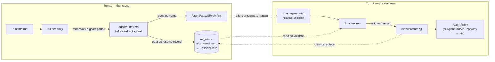

# #606: Human-in-the-loop — durable pause, decision, and resume across framework adapters

Make "the agent is waiting for a human" a first-class outcome of a run instead of an error or a
misleading answer. A runner that detects a framework pause returns a typed **paused reply**,
writes an opaque per-framework resume record into the existing durable session store, and a later
request carrying a **decision** resumes the same run through `Runtime.run`. Four adapters
implement it (OpenAI, LangGraph, Pydantic AI, Google ADK); CrewAI and smolagents declare it
unsupported, for reasons recorded in `research/adapter-strategies.md`.

Supporting research: [`research/framework-hitl-survey.md`](research/framework-hitl-survey.md)
(native capability per framework), [`research/adapter-strategies.md`](research/adapter-strategies.md)
(per-adapter mapping and blockers).

## For the reviewer: where AK deliberately does not decide

This design ended up with **no limits of AK's own invention**. Every constraint an earlier draft
carried — a staleness counter, one pause per session, refusing a partial resume, refusing a
prompt beside a decision — was removed once the frameworks were measured rather than read about.
What is left is: AK carries what the framework can carry, and fails loudly where it cannot.

The two places that leaves worth a reviewer's attention, both accepted on purpose:

1. **Nothing detects a pause that is no longer resumable.** On OpenAI a stale resume returns a
   confident wrong answer; and where an adapter appends a second pause its framework cannot hold,
   the older one silently stops working. See *Core — the paused-run record*.
2. **Three rejections still happen, at three different depths**, and the depth is load-bearing —
   a framework-specific check one line too low is swallowed by the adapter's `except`. See
   *Core — the decision / resume path*.

## Motivation

- **Today every pause is lost, and the loss modes differ in severity.**
  - *Silently wrong* — LangGraph's `ainvoke` returns normally with `__interrupt__` in the result;
    the adapter reads `result["messages"][-1]` (`langgraph.py:427`) and returns that text. The
    caller gets a plausible answer, the graph stays parked in the checkpointer, and nothing looks
    broken.
  - *Silently empty* — ADK's `get_response` keeps only `is_final_response()` text
    (`adk.py:220-229`) and never inspects `event.long_running_tool_ids`.
  - *Ignored* — OpenAI reads `.final_output` and never `.interruptions` (`openai.py:211`).
  - *Stringified* — Pydantic AI reads `result.output` (`pydanticai.py:178`, `:182`).
    `DeferredToolRequests` is a **dataclass, not a `BaseModel`** (verified —
    `research/verification.md`), so `AgentReplyAny.from_output` returns `None` (`model.py:157-161`)
    and the user receives an `AgentReplyText` containing a dataclass repr.
- **A raised pause would be swallowed too.** All six runners end in
  `except Exception as e: return AgentReplyText(response=user_facing_error_message(e), ...)` —
  `openai.py:221`, `langgraph.py:429`, `pydanticai.py:184`, `adk.py:266`, `crewai.py:405`,
  `smolagents.py:181`.
- **The durable store the issue asks for already exists.** `Runtime.run` calls
  `SessionStore.store(session)` after post-hooks (`runtime.py:295`), and every non-volatile
  top-level key is persisted (`base.py:143-152`) via `pickle` (`core/session/serde.py:2,24,36`).
  Two patterns for durable per-session state exist — #526's reserved `Session.Keys` entry with
  three accessors (`base.py:41-48,187-214`), and AG-UI's module-level key in the non-volatile
  cache (`integration/agui/state.py:11,34,56`). This change takes the lighter, AG-UI one; see the
  record section for the risk that accepts. The fail-fast picklability check
  (`base.py:279-348`) is reusable either way.
- **LangGraph is already checkpointed by AK.** `_prepare_session_and_messages` assigns AK's own
  pickle-serializable checkpointer onto the user's compiled graph and uses `session.id` as
  `thread_id` (`langgraph.py:368-370`), so durable LangGraph interrupts need no new persistence.
- **`supports_streaming` is the precedent for honest per-adapter capability** — a `Runner`
  property (`base.py:376-383`) that CrewAI (`crewai.py:412`) and smolagents (`smolagents.py:187`)
  set to `False`, with `stream()` left raising. Pause capability follows it exactly rather than
  probing adapters at runtime.
- **The response layer currently cannot express a third outcome.**
  `ResponseBuilder.build_response` produces `{"result": str(result)}` or `{"error": ...}`
  (`chat_service.py:313-318`), and the success status is derived from the *request*
  (`chat_service.py:547-554`). A pause is knowable only from the *reply*.
- **The default session store is process-local.** `session.type` defaults to `in_memory`
  (`config.py:93-97`), so on any multi-replica deployment a pause written by one replica is
  invisible to the replica that receives the decision — the "memory-store/multi-replica limits"
  item in the issue's Definition of Done.

## Design idea

## At a glance

| | |
|---|---|
| **New outcome** | `AgentPausedReplyAny` — a subclass of `AgentReplyAny`, so the reply union and all seven `isinstance` sites are untouched. Carries a `run_id` |
| **New request** | `AgentResumeRequestAny` — a union member naming a `run_id` and carrying `ResumeDecision`s: the human's text, a structured answer, and `approved` / `denied` / `cancelled` where there is something to approve |
| **Where the framework state goes** | one new session key, `ak.paused_runs` — a list of `PausedRun` records in the existing non-volatile cache, already pickled and persisted by `SessionStore` |
| **New `Runner` contract** | `supports_pause` (defaults **off**), `resume()`, `resume_stream()` |
| **Who implements it** | OpenAI, LangGraph, Pydantic AI, Google ADK. CrewAI and smolagents need **no code** — they inherit the off default |
| **How a client sees it** | HTTP **202** with `status: "PAUSED"`; over AG-UI, a terminal `RunFinishedEvent` interrupt outcome |
| **Configuration** | none. Per the issue, HITL is active whenever a framework pauses |

Almost everything else is reuse: the request path, the hook chain, the session store, the queue
transports and the `Runner` interface are all unchanged.

## Requirements

### Core — the paused outcome

- Add **`AgentPausedReplyAny` as a subclass of `AgentReplyAny`** (`model.py:129`), *not* as a new
  member of the `AgentReply` union. *(Decision: open question 1.)*
  - **The union is therefore unchanged** (`model.py:126`), and so is every `isinstance` tuple over
    it: `runtime.py:241`, `:279`, `:291`, `:329`, `chat_service.py:317`, `slack_chat.py:172`,
    `teams_chat.py:530`. A subclass satisfies `isinstance(reply, AgentReplyAny)`, so all seven
    keep working untouched and the public type alias gains no member.
  - Safe **only because `AgentReply` is never re-validated from JSON** — no `model_validate` or
    `TypeAdapter` over it anywhere in `src/`; `ResponseBuilder` stringifies replies and nothing
    parses them back. Were that not true, a subclass could not survive a serialisation round trip.
    Verified, not assumed.
  - Typed fields on top of the inherited `content`: `run_id: str` (which pause this is — the
    client echoes it back), `session_id: str`, `agent: str`,
    `interruptions: list[PausedInterruption]`. *(Noted, not changed: `session_id` is also in the
    response dict `ResponseBuilder` builds, so on the REST path it is carried twice. It stays on
    the model because non-HTTP surfaces consume the reply object directly.)*
  - **Which framework produced the pause is not published anywhere.** A client never sends it
    back and cannot act on it, and naming the framework in a public reply would make a later
    framework swap a breaking API change.
  - **Overrides `type` from `"other"` to `"paused"`**, giving REST clients a top-level
    discriminator. Safe: nothing in `src/` dispatches on a reply's `type` (verified).
  - **Case is deliberate and the two fields differ.** The model `type` stays **lowercase**, like
    every other discriminator in `model.py`; the response body's `status` is **uppercase
    `"PAUSED"`**, matching the scheduling acknowledgement's `"SCHEDULED"` (`chat_service.py:494`).
    Do not align them.
  - **`content` is derived from the typed fields by a `model_validator`, never set
    independently** — so `__str__` (`model.py:142-143`) still yields readable JSON and a surface
    that only knows `AgentReplyAny` degrades gracefully rather than printing a repr. The typed
    fields are the single source of truth; `content` is a view of them.
  - **The opaque framework resume blob is never on this model** — it goes to the session only. A
    reply crosses the queue transport and reaches clients; a `RunState` JSON or an ADK
    `FunctionCall` must not.
- `PausedInterruption` carries what a human needs in order to decide, and what the client echoes
  back: `id: str`, `kind: Literal["tool_call", "input_required", "confirmation"]`,
  `tool_name: str | None`, `arguments: str | None` (JSON-encoded), `message: str | None`,
  `payload: dict | None`.
  - **`id` must be unique across every paused run a session holds**, not just within one record.
    This is load-bearing rather than tidy: it is what lets `Runtime` resolve which run a decision
    belongs to when no `run_id` is given, which is the only thing AG-UI can do. Frameworks supply
    their own ids (tool-call ids, interrupt ids) and those are already unique per run; `spec.md`
    states what the adapter does if one ever collides across runs.
  - **`kind` is AK's own vocabulary, named after what the four frameworks actually produce.**
    *(Decision.)* `tool_call` — the agent wants to invoke a tool and needs approval first (OpenAI's
    `needs_approval`, Pydantic AI's `requires_approval`, ADK's long-running call).
    `input_required` — the agent needs the human to supply a value (LangGraph's `interrupt()`,
    and Pydantic AI's `CallDeferred`, whose answer is the tool's return value rather than a
    yes/no).
    `confirmation` — a yes/no on an action already decided (ADK's `require_confirmation`).
  - **AK may add kinds as frameworks need them.** The set is AK's to extend. *(These three happen
    to coincide with the routing hints the AG-UI protocol uses, which is convenient for that
    surface — but the coincidence is not a contract, and the field they land in there is a
    free-form string.)*
  - **`payload` is where the question's own shape lives** — the options for a choice, a schema, a
    confirmation body — passed through exactly as the framework produced it. See *the answer
    channel* under the resume path.
- **Six places already branch on `isinstance(..., AgentReplyAny)`** and will now also receive
  pauses: `guardrail/guardrail.py:113`, `guardrail/walledai.py:203`, `core/service.py:155`, plus
  the three stringify sites above. Acceptable and partly desirable — an output guardrail *should*
  see what is being asked of a human — and it **cannot break a resume**, because the resume state
  lives in the session, not the reply. `spec.md` reviews each non-stringify site and teaches it to
  skip the pause only where the existing behaviour would be wrong.
- **A post-hook must not be required to handle a paused reply.** Post-hooks run on it and the
  existing type check (`runtime.py:291`) accepts it, but no hook is obliged to change.

### Core — the paused-run record

- Store it in the **non-volatile cache** under a module-level key constant, following the AG-UI
  precedent exactly (`integration/agui/state.py:11,34,56`): `AK_PAUSED_RUNS_KEY = "ak.paused_runs"`,
  holding a **list** of records, read and written through `session.get_non_volatile_cache()`.
  *(Decision.)*
  - **No `Session.Keys` entry and no new `Session` accessors.** The reserved-key-plus-accessors
    pattern (`framework_context`, `base.py:41-48,187-214`) costs an enum entry and three methods,
    and `nv_cache` is already the durable bucket `SessionStore.store()` persists.
  - **All access goes through one standalone helper, `PausedRunState`**, in `core/` and shaped
    like `AGUIState` (`state.py:27-56`) — static methods, **not** a `Runner` method, because
    `Runtime` must read the record to validate a resume and `Runtime` is not a `Runner`. Three
    operations: `list(session)` and `get(session, run_id)`, which validate the shape rather than
    trusting it (the value comes back as `Any`); `add(session, record)`, which **assigns the run
    id** and owns the picklability check and the `in_memory` warn-once, so all three have exactly
    one implementation; and `clear(session, run_id)`. The key name is therefore spelled once and
    no caller touches `get_non_volatile_cache()` directly.
  - **Named `…State`, not `…Store`, deliberately.** Every `*Store` in AK is a pluggable backend
    with an ABC, a factory and a config block — `SessionStore`, `ThreadStore`, `ScheduleStore`,
    `AttachmentStore`, `ResponseStore`. This is three one-line accessors over a dict that already
    exists, with nothing to configure. Persistence is entirely `SessionStore`'s, which pickles the
    whole session at `runtime.py:295`.
  - **Accepted risk, stated plainly because it is real.** `nv_cache` is documented as application
    space (`base.py:35-38`) and `KeyValueCache.clear()` (`core/util/key_value_cache.py:68`) is
    reachable by any application holding the bucket, so an app clearing its own cache **destroys a
    pending human decision**, silently. Two mitigations, both required: the `ak.` prefix marks the
    key as framework-owned, and the user-facing docs must state that clearing the non-volatile
    cache discards a pending pause.
- Each record — call the type **`PausedRun`** — is a **framework-agnostic envelope around an
  opaque payload**:
  - `id: str` — **the run identifier**, assigned by `PausedRunState.add`. New to `core/`, which
    has no notion of an individual run today (its only identifiers are `Session.id`,
    `base.py:60,66`, and `attachment_id`, `model.py:88`). It exists so a client can say *which*
    pause it is answering, and it is carried on the paused reply and echoed back on the decision.
  - `agent: str` — the agent name. Required because OpenAI's
    `RunState.from_json(initial_agent=..., state_json=...)` needs the original starting agent, and
    AK resolves agents by name. **This is also what identifies the framework**, since the agent
    resolves to its runner — no separate `runner` field. *(Decision.)* The one case a stored
    runner name would have caught, and no longer does, is an agent whose framework is changed
    while a pause is outstanding; that now surfaces as a deserialisation failure from the adapter
    rather than a named error, which is accepted as the price of not duplicating state that is
    already derivable.
  - `created_at: str` — ISO-8601 UTC, for diagnostics and operator triage only.
  - `interruptions: list[PausedInterruption]` — the same list carried on the reply, so a resume
    can be validated **without deserialising the opaque payload**.
  - `payload: Any` — per-framework, opaque to core. **Must be picklable**; reuse the existing
    fail-fast check (`base.py:329-348`) rather than writing a second one.
- **Many interruptions per pause, and more than one paused run per session where a framework
  allows it.** These are different things and the distinction is load-bearing.
  - **Multiple interruptions are fully supported and are the normal case**, which is why
    `interruptions` is a list. Every framework produces them that way: OpenAI's
    `RunResult.interruptions`, Pydantic AI's `DeferredToolRequests.approvals`, LangGraph's
    `{id: value}` resume map, and several outstanding ADK long-running calls. One pause can ask a
    human several questions at once.
  - **AK does not limit how many paused runs a session holds.** *(Decision — reversed. An
    earlier draft stored one record and let a second pause replace it.)* The key holds a list, so
    whether a session ever has more than one outstanding is **the framework's business, not
    AK's**.
  - **In practice only OpenAI will ever produce more than one.** LangGraph has a single
    checkpointer thread keyed on `session.id` (`langgraph.py:368-370`), Pydantic AI one message
    history (`pydanticai.py:173-174`), ADK one event history (`adk.py:59-70`); on those a second
    concurrent run cannot even start (Pydantic AI refuses, LangGraph re-enters the paused node).
    OpenAI's `RunState` is a self-contained snapshot and **two were resumed independently**
    (`research/verification.md`), so there the list can genuinely grow.
  - **Whether a new pause appends or replaces is the adapter's call**, because only the adapter
    knows whether its framework can still resume the earlier one. `spec.md` fixes it per adapter.
    The honest consequence on the single-thread frameworks: if an adapter appends where its
    framework cannot hold two, the older entry is no longer resumable and **AK will not detect
    that** — the same trade as dropping the staleness counter.
- **AK does not track whether a pause has been overtaken.** *(Decision.)* An earlier draft
  carried a `Runtime`-owned run counter at `ak.run_seq` and refused a resume once an ordinary run
  had advanced past the pause. That is removed: no framework has such a counter, and inventing one
  means AK maintaining a model of framework progress that every SDK release can invalidate.
- **Measured, not assumed: two of the four frameworks make a pause impossible to overtake, and
  one of those says so out loud.** Each case was produced by running the framework, not by reading
  docs — tabled in [`research/verification.md`](research/verification.md) ("does a framework
  report a stale pause?"). In short: **Pydantic AI refuses** a new question while a decision is outstanding, **LangGraph's interrupt
  is sticky** so a new input re-enters the paused node and pauses again, **OpenAI allows it and
  reports nothing**, and **ADK has no validation** in its resume path (source read, not executed).

  - **This is why the counter was the wrong shape.** It was a generic mechanism for a problem that
    only exists on one and a half of the four adapters, and two adapters already solve it better
    than AK could — Pydantic AI with a precise error, LangGraph by making it unreachable.
  - **The residual risk is OpenAI, and it is real:** a stale resume there produces a confident
    answer computed as though the intervening turns never happened. AK does not detect it. The
    docs must say so under the OpenAI adapter specifically, rather than as a general caveat.
  - **A later pause does not evict an earlier one by policy.** The list simply grows; see the
    adapter's append-or-replace call above.
- The record is written **inside the adapter's successful path**, before the reply is returned —
  never in a `finally` — so a crashed run leaves no phantom pause. Same placement rule #526 set
  for `framework_context` write-back.
- Expiry rides the session store's own TTL (`session.redis.ttl` default 604800, `config.py:27`).
  No separate pause TTL.

### Core — the decision / resume path

- Add **`AgentResumeRequestAny`** to the `AgentRequest` union (`model.py:125`):
  `type: Literal["resume"]`, `run_id: str`, `decisions: list[ResumeDecision]`.
  - **`run_id` names which paused run is being answered**, since a session may hold more than
    one. It comes straight off the paused reply.
  - **It is optional, because it must be.** `PausedInterruption.id`s are unique across a
    session's records, so `Runtime` can resolve the run from the decisions alone. That is not a
    convenience: **AG-UI has no field for it** — `ResumeEntry` is `{interrupt_id, status,
    payload}` — so a resume arriving over that surface can only ever identify its run by
    interruption id. When `run_id` *is* given it must agree with the run those decisions belong
    to; a disagreement is a failure, not an override.
- `ResumeDecision` is `id: str` (matching a `PausedInterruption.id`) plus **one verb and two
  answer fields**:

  | field | job |
  |---|---|
  | `status: Literal["approved", "denied", "cancelled"] \| None` | the verb, for an interruption that is an approval |
  | `message: str \| None` | the human's words — a free-text answer, or the reason for a refusal |
  | `payload: dict \| None` | the structured answer — the option(s) chosen, overridden arguments, a confirmation body |

  - **`status` is three-valued, not a bool.** *(Decision.)* Approve, deny and cancel are three
    different things a human can do, and collapsing the last two lets an agent report a refusal
    that never happened. See *Adapters* for how each framework renders them.
  - **`status` is optional, because not every pause is an approval.** *(Decision.)* A LangGraph
    `interrupt()` asking "which of these three?" has nothing to approve, and requiring a verb
    there would force clients to send a meaningless `approved`. `Runtime` requires `status` when
    the matching interruption's `kind` is `tool_call` or `confirmation`, and ignores it for
    `input_required`.
- Add `resume: Optional[ResumeSpec]` to `BaseChatRequest` (`model.py:243-261`), following
  `ScheduleSpec`'s precedent exactly. `ResumeSpec` carries the optional `run_id` and the
  `decisions`; `RequestBuilder` turns it into the `AgentResumeRequestAny` the union carries.
  - **Why a union member here, when the paused reply is a subclass.** The asymmetry is
    deliberate. A paused reply *should* inherit existing `AgentReplyAny` handling — guardrails,
    `AgentService.run`, the stringify sites — and joining the reply union would cost **seven**
    `isinstance` sites. For a resume request the existing handling is *skip*, so inheriting it
    would be wrong, and a union member costs **one** site (`runtime.py:247`).

#### The answer channel — free text, single choice, multiple choice

**AK does not define a form schema.** A question's own shape travels in
`PausedInterruption.payload` exactly as the framework produced it — a LangGraph
`interrupt({"question": ..., "options": [...]})` value arrives verbatim — and the answer travels
back in `ResumeDecision.payload`. Inventing an AK-level `options` / `choices` vocabulary would
mean deciding what a question looks like on behalf of four frameworks that disagree — one of
which cannot carry a structured answer at all.

Per-adapter capability is measured and tabled in
[`research/verification.md`](research/verification.md) ("the answer channel, with a
multiple-choice example").

- So **multiple choice and multi-select work on LangGraph, ADK and Pydantic AI** — the first two
  through their native resume value, Pydantic AI through a deferred tool's result — and are
  **not expressible on OpenAI at all**. *(Corrected: an earlier draft called Pydantic AI partial,
  having looked only at its approval axis.)*
- **A `payload` the framework cannot carry is rejected, not dropped.** *(Decision.)* On OpenAI a
  decision carrying `payload` raises rather than approving and discarding the human's answer —
  the same fail-honestly rule as the rest of this design. `spec.md` pins the error.
  - **The limit is on pausing, not on asking.** `RunResult.interruptions` is
    `list[ToolApprovalItem]` and nothing else (verified), so the SDK's only mid-run stop is a
    yes/no on a call the model already composed. A choice cannot ride on that.
  - **An OpenAI agent asks by finishing instead.** It puts the question in its own reply — plain
    text, or a structured output carrying the options — the run **ends normally**, no paused
    record is written, and the human's pick comes back as the next ordinary prompt on the same
    session. That path is already how the adapter behaves and needs nothing from this design.
  - **So, for users:** on OpenAI model "I need permission" as a gated tool, and "I need a value"
    as a question the agent asks.
- Signatures above were read from the repo venv at `openai-agents` 0.19.0, `pydantic-ai-slim`
  2.13.0, `langgraph` 1.0.10 and `google-adk` 2.5.0; **`spec.md` re-confirms at the locked pins**,
  which are ahead of that venv for three of the four.

#### Dispatch

`Runtime.run` dispatches on the request list: an `AgentResumeRequestAny` present ⇒
`agent.runner.resume(agent, session, requests, decisions, record)` instead of `run(...)`
(`runtime.py:286`), and `Runtime.stream` does the same around `runner.stream` (`runtime.py:341`),
dispatching to `resume_stream`.

**The design does not constrain how the hook chain and the dispatch interact.** *(Decision.)* A
pre-hook may rewrite the request list or end the run on a resume exactly as it may on an ordinary
turn, and a resume takes whatever falls out of that. Constraining it would mean AK deciding, on
the application's behalf, that a guardrail is allowed to stop a first prompt but not a decision —
a call AK is not in a position to make.

What the design does require is that each case is **visible**. All of them are silent today and
close to undiagnosable from a log, which is the actual cost of leaving the behaviour open. Two
belong to the dispatch and are tabled here; the third is on the streaming path.

**How `Runtime` knows — it is the caller, not a participant.** None of these warnings is a hook,
so none depends on where AK's own hooks sit in the chain. `Runtime` owns every call site: it holds
the request list, calls `_prepare_requests` (`runtime.py:278`, and `:328` for the stream), and receives either a new list or a
halting reply. So it can record one boolean beforehand — *did the incoming list carry an
`AgentResumeRequestAny`?* — and compare with what comes back. Same for the stream: the post-hook loop
is `Runtime`'s own (`runtime.py:342-345`), so it sees an event go in and `None` come out.

This is an observation, not the old extract-before-hooks rule — the dispatch still acts on the
**post-hook** list, so a hook that removes the marker really does turn the resume into an ordinary
turn. The boolean exists only so the loss is said out loud.

- **For the record, the chain order is not what one would guess**, and the design should not leave
  it ambiguous: pre-hooks run **user first, system last**
  (`pre_hooks = agent.pre_hooks + self._get_system_pre_hooks()`, `runtime.py:238`), while
  post-hooks run **system first, user last**
  (`post_hooks = self._get_system_post_hooks() + agent.post_hooks`, `runtime.py:288`, and `:337`
  for the stream).
- **A consequence worth stating:** because the input guardrail is a *system* pre-hook, it runs
  after any user pre-hook. If a user hook strips the `AgentResumeRequestAny`, the guardrail never
  sees the human's text — but the text never reaches the model either, so this is a lost decision,
  not an unguarded one. The warning is what makes it visible.
- **The stream warning can name the offending hook**, since `hook.name()` is in scope where the
  drop is detected. The two pre-chain warnings cannot yet: `_prepare_requests` returns only the
  reply, so `Runtime` knows the chain halted but not which hook did it. `spec.md` decides whether
  that is worth a small change to its return shape — the warning is useful either way.

| Situation | How it is detected | What is logged |
|---|---|---|
| a pre-hook removes the `AgentResumeRequestAny` | the before-flag is set, the post-hook list has no marker | `WARNING`: a resume decision was dropped by the pre-hook chain and this run is proceeding as a new turn; the pause is still open. Names the session and agent |
| a pre-hook halts on a resume | the before-flag is set and `Runtime.run` returns a hook reply at `runtime.py:241-242`, never reaching the runner | `WARNING`: a decision was accepted but never delivered, and the pause is still open. **This is the only halt with a durable consequence** — every other one costs a turn and leaves nothing behind, whereas this leaves a record in the store while the client receives a reply that reads like completion |

Both are per-occurrence `WARNING`s on the existing `ak.runtime` logger (`runtime.py:139`),
carrying the session id and agent name. Not warn-once: each occurrence is a distinct lost
decision, unlike the `in_memory` topology warning, which is a property of the deployment. The
halt case is already logged at `DEBUG` (`runtime.py:280`); what the level change buys is that the
open pause is *named*, in a log an operator actually reads.
**A third warning of the same family lives on the streaming path** — a post-hook filtering
`RunPaused` out of a stream; see Streaming.

- **Clear-or-replace belongs to the adapter's success path**, at the same point in the code path
  `_store_framework_context` sits today (`openai.py:213`), because a resume can pause again and
  the adapter is what writes the new record.
- **But `Runtime` clears a leftover record after a resume that did not pause, rather than warning
  about it.** *(Decision — an earlier draft made this a fourth warning. An adapter forgetting to
  clear is an AK bug, which is a test's job, not an operator's.)* The narrowing that makes this
  safe: "a resume can pause again" only puts a *new* record in play when the reply **is** an
  `AgentPausedReplyAny`. When it is not, no new pause was created, so a record still present can
  only be the stale one and clearing it is unambiguous. Scoped that tightly, `Runtime` removes the
  failure mode instead of reporting it — and the next turn cannot inherit a phantom pause.
  - It stays out of the ordinary-run path: a non-resume turn leaving a pending pause in place is
    intended behaviour (see the record section), not something to clean up.
`spec.md` fixes each warning's exact wording and level; the design's requirement is only that all
three fire.

Around that dispatch:

- **Generic validation happens in `Runtime`, before the branch.** Every adapter
  ends in `except Exception: return AgentReplyText(user_facing_error_message(e))`
  (`openai.py:221`, `langgraph.py:429`, `pydanticai.py:184`, `adk.py:266`), so the failures below
  would be swallowed into *"Sorry, something went wrong"*. They are also generic, needing no
  framework knowledge, so adapter-side checks would be written four times. `supports_pause` is
  checked here too, so an unsupported runner names itself in the error. **`Runtime` then passes
  the record it just validated into `resume()`**, rather than letting the adapter re-read it.
  - **Framework-specific rejections are the exception, and belong to the adapter — above its
    `try`.** *(Decision.)* `Runtime` cannot know that OpenAI has no channel for a structured
    answer, or that Pydantic AI needs every deferred call resolved, without framework knowledge
    moving into `core/`, which is what the adapter pattern exists to prevent. So the rule splits:
    - **Generic checks live in `Runtime`** — the four failure modes. They need no framework
      knowledge and would otherwise be written four times.
    - **Framework-specific checks live in the adapter, before the `try` opens.** Every adapter's
      body sits inside one `try` whose `except Exception` returns
      `AgentReplyText(user_facing_error_message(e))` (`openai.py:199-221`), so a check placed
      *inside* it is swallowed into *"Sorry, something went wrong"* — the exact outcome this
      design exists to remove. Placement is the whole requirement.
    - This covers both existing edge rejections: `payload` on OpenAI, and a partial resume on
      Pydantic AI. `spec.md` must state the placement explicitly and test that each error reaches
      the caller, because the failure is invisible otherwise — the adapter still returns a reply,
      just the wrong one.
    - **A capability flag was considered and rejected for these two.** `supports_pause` earns its
      place because `Runtime` must branch on it before dispatching at all; a flag per answer-shape
      would grow the public `Runner` contract for facts only the adapter ever acts on.
- **The hook-processed `requests` list is passed too, not just the decisions.** Every adapter
  opens with `ToolContext(Runtime.current(), agent, session, requests)` — nine sites, e.g.
  `openai.py:200`, `adk.py:194` — and post-hooks take `requests` as well (`runtime.py:290`).
  Without it a resuming adapter has nothing to put in the tool context. On a resume,
  `ToolContext.requests` holds the list **as the hook chain left it**, so a guardrail's edit to
  the human's message is what tools and post-hooks see.
- **Pre-hooks do run on a resume.** *(Decision: open question 3.)* A human's free-text answer
  reaches the model, so skipping the chain would create a route to the model that no input
  guardrail ever inspects. The other two system pre-hooks no-op on a decision-only request
  (`runtime.py:122`); note that "they would no-op anyway" is **not** an argument for skipping —
  the hazard is the halt, and it is present whether or not the hooks do any work.
  - **Input guardrails must be taught to read a resume, or that justification is false.**
    `BaseGuardrailUtil._extract_text_from_requests` collects text from `AgentRequestText` only
    (`guardrail/guardrail.py:100-102`), so as the code stands today the human's `message` would
    reach the model **without any guardrail seeing it** — the exact hole running the chain was
    meant to close. *(Decision.)* Extend the extraction to pull `message` and string `payload`
    values out of `AgentResumeRequestAny`. This is a `guardrail/` change belonging to **PR 2**, not
    an adapter PR: without it, PRs 1–2 ship a stated security property they do not deliver.
- **Post-hooks, session store and volatile-cache clearing are unchanged** (`runtime.py:288-298`).
- **`schedule` + `resume` is rejected with `ValueError` → 400.** A decision cannot be deferred to
  a cron slot and still be a decision.
- **`prompt` + `resume` is not blocked by AK.** *(Decision — reversed. An earlier draft returned
  `400` from `ChatService` for the combination, justified first as a framework limit and then as
  uniformity. Neither held: measured, three of the four accept new content beside a decision.)*
  - **Forward it wherever the framework takes it, and reject only where it cannot** — the same
    shape already used for a structured `payload`.
  - **Pydantic AI is native**: `run(prompt, message_history=..., deferred_tool_results=...)`
    returns a normal answer, and the guard that otherwise blocks a new prompt is lifted precisely
    by supplying the results.
  - **LangGraph works, but through a mapping AK defines**: `Command(resume=..., update={...})`.
    `update` means *update the graph state*, not *here is a prompt*, so AK writes the prompt into
    the `messages` channel its adapter already feeds (`langgraph.py:412`). `spec.md` states that
    this is AK's encoding, not a LangGraph feature.
  - **ADK is unverified** — a `Content` can carry a text part beside the `function_response`, so
    it is structurally possible. Established by test in PR 4, not assumed.
  - **OpenAI rejects it in the adapter, above the `try`.** `Runner.run`'s `input` is
    `str | list[TResponseInputItem] | RunState`, mutually exclusive, so there is nowhere for the
    prompt to go. Failing is the only honest option; silently dropping it is what this design
    exists to prevent.
  - Per-framework evidence is in [`research/verification.md`](research/verification.md) ("two
    more claims that asserted a framework limit"), including — per framework — whether it
    *intends* this or whether AK is inventing the mapping.

**Failure modes** — errors with actionable messages, never silent fallbacks:

1. no paused run matching the request — the given `run_id` is unknown, or the decisions resolve
   to no record. A `run_id` disagreeing with the run its decisions belong to, and decisions that
   resolve to **two different runs**, are the same failure: one resume addresses one run;
2. a `ResumeDecision.id` matching no `PausedInterruption.id`;
3. an opaque payload that no longer deserialises — an SDK upgrade (OpenAI's `RunState` carries a
   `_schema_version`), or an agent whose framework changed while the pause was outstanding;
4. **agent mismatch** — `Runtime` resolves the agent **from the record**, and a conflicting
   explicit `req.agent` is an error rather than an override. Resuming the wrong agent would
   rebuild OpenAI's state with the wrong `initial_agent`, and on ADK or Pydantic AI would resume
   another agent's conversation.

**Answering one interruption at a time is allowed.** *(Decision — corrected. An earlier draft
refused any resume that did not address every open interruption, on the stated grounds that "the
frameworks cannot take a partial answer". Measurement showed that is false for three of the
four.)*

Measured in [`research/verification.md`](research/verification.md) ("can interruptions be answered
one at a time?"): **LangGraph, OpenAI and ADK all allow it**, returning the unanswered
interruptions as a fresh pause; **Pydantic AI requires all of them at once** and names the
missing ids.

- **A partial resume that leaves interruptions open simply pauses again.** The adapter writes a
  new record holding the remainder, which is the existing "a resume can pause again" path — no
  extra machinery.
- **Pydantic AI is the one exception, and AK refuses up front rather than letting it fail deep.**
  A partial resume on that adapter raises before the framework is called, naming the ids still
  missing. Otherwise the framework's own clear error would be swallowed by the adapter's
  `except Exception` into *"Sorry, something went wrong"*. Same rule as the OpenAI `payload` case.

**A new prompt arriving while a pause is pending takes the ordinary path, and the pause is kept.**
*(Decision: open question 4.)* The user changed the subject; AK does not own that choice and must
not silently discard work on their behalf. The new prompt goes through pre-hooks, `runner.run()`
and post-hooks as usual, and `paused_run` is **not** cleared. Only a successful `resume()` or an
explicit new pause clears or replaces the record, which `spec.md` must make conditional and
explicit, or an ordinary turn will delete the pending pause.

- **What the user actually gets differs per framework, and AK does not paper over it.**
  *(Corrected — an earlier draft said the new prompt "runs normally", which measurement showed is
  true only on OpenAI.)*
  - **Pydantic AI raises.** `Agent.run` refuses a new user prompt while the message history holds
    unprocessed tool calls, so the turn fails. The adapter's `except` would turn that into
    *"Sorry, something went wrong"* — it must instead surface as a clear error saying a decision
    is outstanding.
  - **LangGraph pauses again.** The new input merges into graph state but the interrupted node
    re-interrupts, so the caller receives another `AgentPausedReplyAny` rather than an answer to
    their question. Correct behaviour, but surprising, and the docs must say it.
  - **OpenAI answers normally**, and the pending pause stays resumable — with the staleness risk
    recorded above.
  - **ADK is unverified**; `spec.md` establishes it by test.
- This does not change the decision — AK still does not discard the user's pending decision — but
  it means the per-adapter docs, not a single general sentence, are where this belongs.

### Core — the `Runner` surface

- Add `supports_pause -> bool` to `Runner`, **defaulting to `False`**; the four implementing
  adapters opt in. This differs from `supports_streaming`, which defaults to `True`
  (`base.py:376-383`), and the difference is the point: `stream()` is `@abstractmethod`
  (`base.py:385`) so every runner implements it and `True` is honest by default, whereas
  `resume()` / `resume_stream()` are non-abstract raising defaults — a `True` default would have a
  bring-your-own `Runner` advertise a capability it does not have and then raise outside its own
  `try/except`.
- Add **two** methods, both defaulting to raise `NotImplementedError` naming the runner, so an
  adapter that has not implemented them fails loudly rather than appearing to work:
  - `resume(agent, session, requests, decisions, record) -> AgentReply`
  - `resume_stream(agent, session, requests, decisions, record) -> AsyncGenerator[StreamEvent, None]`
- **CrewAI and smolagents need no code at all** — they inherit `supports_pause = False` and the
  raising defaults. This inverts their streaming situation, where they must *actively* set
  `supports_streaming = False` (`crewai.py:412-423`, `smolagents.py:187-199`). Since `Runtime`
  checks `supports_pause` before dispatching, the raise is a **backstop** for a direct caller
  rather than the primary mechanism; both are kept deliberately.
- **Accepted: separate entry points duplicate the adapter envelope.** *(Decision, taken with the
  numbers in front of us.)* Every framework resumes through its **normal native call** with
  different input, so `resume()` repeats most of `run()`: about **80 duplicated lines, and the
  same again for streaming**, of which roughly 14 per adapter are pure envelope. Accepted because
  a separate `resume()` keeps the capability visible in the type and each method single-purpose;
  reusing `run()` would hand the adapter its resume input implicitly and put two paths in one
  method. The envelope duplication is **pre-existing** — every adapter's `run()` already repeats
  it — so extracting a shared base-`Runner` template is its own issue, not this one. **The piece
  worth watching:** pause detection is the newest and most version-sensitive code and exists in
  both methods, eight copies across four adapters. If any part of the envelope is shared first, it
  should be that.
- **The record's read/write/clear is *not* on `Runner`** — it lives on the standalone
  `PausedRunState`, because `Runtime` needs it too. Adapters call `.set` / `.clear` inside their
  success path; they never need a read helper, since `Runtime` hands them the validated record.
- **No enable flag anywhere.** Per the issue's Definition of Done, HITL is active whenever a
  framework pauses. No config block, no `AKConfig` section, no per-agent opt-in.

### Streaming

- Add a **`RunPaused`** member to the `StreamEvent` union (`event.py:131-147`), carrying the same
  `run_id` and `interruptions` the paused reply does — a streaming client needs to know *which*
  run stopped, not only that one did.
  - **The union's invariant is reworded, not quietly departed from.** `event.py:16-17` reads
    "Every field is a `str`, `int` or `bool`", and `test_stream_events.py` pins it — a
    `list[PausedInterruption]` breaks that letter even though it stays JSON- and pickle-safe.
    *(Decision.)* Relax it to **"every field is composed of JSON primitives; no field carries a
    framework-native object"**, updating the docstring and that test in **PR 1**. Carrying the
    interruptions as a JSON string was rejected: it pushes parsing onto every consumer to preserve
    a wording whose actual purpose the list already satisfies.
  - The opaque payload stays in the session and never rides the event.
- **A pause is not an error.** `Runtime.stream` yields `RunPaused` as a normal
  `StreamChunk(event=...)` and terminates with the existing `StreamChunk(done=True)`
  (`runtime.py:365`) — never through `StreamChunk.error`, which now has a legitimate owner in a
  post-hook raising `StreamHalt` (`core/hooks.py`), whose `reason` reaches the client there. A
  pause ended in a valid outcome the client can act on; a halt produced an invalidated partial the
  client must discard.
- **A paused stream must drain open boundaries before ending, exactly as the halt path does.**
  `StreamBoundaryTracker` (`runtime.py:39-102`) exists because ending part-way through a
  `MessageStart`/`ToolCallStart` pair leaves an AG-UI frontend rendering the tool call as work
  still in progress; the halt path drains it at `runtime.py:368-369`. **The pause path is the same
  situation and is arguably the common case** — an agent pauses precisely because a tool call
  needs approval, so a `ToolCallStart` is very likely open. The terminal sequence is therefore
  `RunPaused` → the closing events the tracker still owes → `done=True`. `spec.md` decides whether
  that reuses the halt path's drain; the requirement is that it happens.
- **A post-hook can drop `RunPaused`, and AK warns rather than preventing it.** Since the merge,
  `on_stream_event` (`runtime.py:342-343`) sees **every** event, not only text deltas, and
  returning `None` drops it — so a hook filtering unknown event types would swallow the pause.
  *(Decision — an earlier draft required the chain to be unable to drop it. That contradicts the
  rule taken for pre-hooks on the resume path: AK does not decide which events a hook may filter.)*
  - So this becomes a **third diagnostic warning**, consistent with the other two: if a
    `RunPaused` was yielded and the chain returns nothing for it, log at `WARNING` that a pause
    was dropped by a post-hook and the client will not learn a decision is owed.
  - **The record is untouched either way**, so the pause is still answerable — the caller just has
    not been told. That is the same shape as a pre-hook halt on the resume path.
  - **This is a consequence of the merged streaming contract, not a pre-existing gap.**
- Per-adapter streaming pause support:

  | Adapter | Streaming pause | Where it is detected |
  |---|---|---|
  | **OpenAI** | Supported | drain `stream_events()`, then read `RunResultStreaming.interruptions` where the adapter already writes framework context (`openai.py:268-272`) |
  | **Pydantic AI** | Supported | `DeferredToolRequestsEvent` on `run_stream_events()`, already consumed (`pydanticai.py:190+`) |
  | **LangGraph** | Supported | `astream_events(version="v2")` has no `.interrupts` (`langgraph.py:469-473`), so read graph state after the stream drains, where the adapter already calls `aget_state` (`langgraph.py:481`) |
  | **ADK** | **Unverified — decided by test in PR 4** | as non-streaming, if it works at all |

  - The design does not prevent ADK streaming pause; if it works at 2.8.0, support it. Two things
    keep it an open risk: ADK's own "known limitation" comment on its two-event pause window
    (`base_llm_flow.py:966-978`), and the partial/non-partial id split, where an id a client reads
    off a streamed partial event may never have been persisted (`functions.py:245-246`,
    `base_llm_flow.py:1130-1133`). *(An earlier draft said ADK streaming pause was "documented as
    unsupported". That was wrong — no such upstream documentation exists; see
    `research/verification.md`.)*

### Adapters

Detection must always be placed **before** the existing text extraction, never as a fallback —
that ordering is what distinguishes this from the current silent-loss behaviour.

| Adapter | Detect | Persist as `payload` | Resume call |
|---|---|---|---|
| **OpenAI** | `result.interruptions` non-empty, checked before `.final_output` (`openai.py:211`) | `result.to_state().to_json()` | `RunState.from_json(initial_agent=agent.agent, state_json=payload)`, apply `approve`/`reject`, `Runner.run(agent.agent, state)` |
| **LangGraph** | `"__interrupt__" in result`, checked before `result["messages"][-1]` (`langgraph.py:427`) | interrupt ids + `.value`s only — the checkpointer already holds the state | `ainvoke(Command(resume=...), config)` on the same `thread_id` (= `session.id`) |
| **Pydantic AI** | `isinstance(result.output, DeferredToolRequests)`, checked before `AgentReplyAny.from_output` (`pydanticai.py:178`) | `to_jsonable_python(result.all_messages())` (already written at `pydanticai.py:173-174`) + the requests | `run(content, message_history=..., deferred_tool_results=DeferredToolResults(...))` |
| **Google ADK** | per-event: `event.long_running_tool_ids` ∩ part `function_call.id`, **or** a `function_call` named `adk_request_confirmation` — in `get_response` (`adk.py:204-230`) | pending `FunctionCall` id + name, confirmation hint/payload, `invocation_id` | `run_async(new_message=Content(parts=[Part(function_response=...)]))`, plus `invocation_id=` when the app is resumable |
| **CrewAI** | — | — | inherits `supports_pause = False` |
| **smolagents** | — | — | inherits `supports_pause = False` |

**How each adapter renders `ResumeDecision.status`.** Only LangGraph carries all three natively;
the others degrade to their binary call, and **AK supplies the message that keeps the two negative
cases distinguishable to the model**:

| Adapter | `approved` | `denied` | `cancelled` |
|---|---|---|---|
| **OpenAI** | `state.approve(item)` | `state.reject(item, rejection_message=message)` | `state.reject(item, rejection_message=`AK's dismissal text`)` |
| **Pydantic AI** | `ToolApproved(override_args=payload)` | `ToolDenied(message=message)` | `ToolDenied(message=`AK's dismissal text`)` |
| **Google ADK** | `{"confirmed": true, "payload": payload}` | `{"confirmed": false}` | `{"confirmed": false}`, with AK's text where the response body allows |
| **LangGraph** | `Command(resume=…)` | `Command(resume=…)` | `Command(resume=…)` — **carries the status faithfully**, since `resume` takes an arbitrary value and the user's node decides what to do with it |

- **The dismissal text is AK's, not the client's.** On a `cancelled` decision the human gave no
  reason, so `message` is typically empty. AK generates wording that reads as *an absence of a
  decision* rather than a refusal — "we could not get this approved", not "your refund was
  declined". A bool plus a client-supplied message could not guarantee that, because a client
  sending nothing would leave the model to infer a refusal. `spec.md` fixes the wording once, in
  shared code.
- **LangGraph needs no new persistence** — AK already assigns its own pickle-serializable
  checkpointer with `thread_id = session.id` (`langgraph.py:368-370`). The design must document
  that AK **overwrites** a user-supplied checkpointer: pre-existing behaviour that HITL makes
  load-bearing.
- **ADK requires a construction change to be durable.** `ResumabilityConfig(is_resumable=True)`
  lives on an `App`, while the adapter builds `Runner(agent=...)` from a bare agent
  (`adk.py:201`). Structurally near-free — ADK already wraps AK's agent in an `App` internally and
  the `app_name` override preserves AK's session key. Full break analysis and citations are in
  [`research/verification.md`](research/verification.md). **Decision: enable it unconditionally**
  *(open question 5)* — a per-agent gate would reintroduce the enable flag the issue forbids, and
  would make whether a pause survives depend on config a user may not have set. Two real costs,
  both documented rather than hidden:
  - **Sub-agent routing changes.** With resumability on, a turn whose previous event was a
    function response is routed back to the agent that made the call. For an existing AK user
    running ADK sub-agents, **which agent handles the next turn can change** — a trade-off ADK
    made on purpose. Which agent handles a turn is application logic the client owns; AK's job is
    to state it clearly, not second-guess it.
  - **ADK sessions grow**, because `is_resumable` also gates agent-state event emission and those
    events accumulate in the session AK pickles. Inherent to ADK, not introduced by AK.
  - Both must reach **release notes and the ADK adapter docs**, alongside ADK's own "tools may run
    more than once when resuming" warning.
- **ADK durability is confirmed** — the conversation lives in `InMemorySessionService` inside
  `GoogleADKSession` (`adk.py:59-70`), which was import-checked and pickles cleanly both empty and
  holding a live session (`research/verification.md`).
- **Resume paths must preserve `framework_context`.** Every adapter's `run()` loads and writes back
  the #526 context (`openai.py:206-210`, `langgraph.py:408-422`, `pydanticai.py:169-176`,
  `adk.py:184-199`); `resume()` must do the same, or a resumed turn silently drops the caller's
  context.
- **OpenAI multimodal runs carry the SDK session** after #679 (merged, `ad189723`), so a paused
  multimodal run resumes on the same path as a text one and needs no special case.

### Presentation and transport

- `ResponseBuilder.build_response` (`chat_service.py:302-335`) must express a third outcome a
  client can branch on **without parsing the `result` string** — the issue's stated requirement.
  Body: `{"status": "PAUSED", "session_id": ..., "interruptions": [...]}` alongside the existing
  `result`, so the discriminator is a top-level key.
- **HTTP status is `202`.** *(Decision.)* Semantically right — accepted, not finished — and it
  reuses a path the queue pipeline has already proven: the deferred-schedule 202 established that
  a non-200 success survives the round trip (`ATTR_STATUS_CODE` on the output message, and
  `RestHandler._build_sync_response`'s `200 < status < 400` branch). A `200` would have exercised
  none of it.
  - **`202` now carries two meanings**, and the body separates them: `"SCHEDULED"` for a deferred
    request, `"PAUSED"` for one waiting on a human. Clients branch on the body key, never the code
    alone — which is why the top-level `status` field is required rather than optional.
- `_success_status` (`chat_service.py:547-554`) currently derives the status from the *request*. A
  pause is knowable only from the *reply*, so it gains a second source. Both branches reach the
  same code from different inputs; `spec.md` must not collapse them into one condition.
- **Queue pipeline**: a paused reply travels as an ordinary output message and the Agent Runner
  already forwards the status as `ATTR_STATUS_CODE`. No transport change is expected — `spec.md`
  confirms rather than assumes.
- **AG-UI has native interrupt support, and AK must use it.** *(Decision — supersedes the earlier
  "map it or document the gap" framing.)* Verified present at AK's **pinned** `ag-ui-protocol`
  0.1.22, so no dependency bump: `RunFinishedEvent.outcome`, `RunFinishedInterruptOutcome`,
  `Interrupt`, and on the way back `RunAgentInput.resume` with `ResumeEntry` / `ResumeStatus`.
  - A pause is a **terminal outcome**, not a mapped mid-stream event: the run ends with
    `RunFinishedEvent(outcome=RunFinishedInterruptOutcome(...))`. So `AGUIRequestHandler._events`
    grows a third terminal shape rather than `AGUIMapper.to_agui` gaining a case, and
    `to_agui` keeps returning `None` for `RunPaused` (`mapping.py:64-66`) with nothing dropped.
  - `PausedInterruption` maps onto `Interrupt` almost field-for-field, and `kind` passes through as
    `reason` unchanged — `reason` is a free-form `str` (verified, not a closed enum), so **no
    translation table is needed and none should be written**, including for any AK kind added
    later.
  - **The protocol requires state to be emitted first**: any `StateSnapshot` / `MessagesSnapshot`
    needed for resume must precede the `RunFinished` carrying the interrupt.
  - Resume arrives as `RunAgentInput.resume` and becomes an ordinary `AgentResumeRequestAny`
    **with no `run_id`** — the protocol has no field for one, so the run is resolved from the
    `interrupt_id`s, which is exactly why that field is optional.
    `ResumeEntry.status` maps onto `ResumeDecision.status` **without flattening**: `cancelled`
    stays `cancelled`, `resolved` becomes `approved` or `denied` by the entry's payload.
    *(Corrected: an earlier draft said AG-UI requires every open interrupt to be addressed in one
    resume. `RunAgentInput.resume` is a plain `Optional[List[ResumeEntry]]` — nothing in the
    protocol types requires that, and AK no longer enforces it on any surface.)*
- **Thread recording is out of scope** — see Non-goals.

### Durability guardrails

- **Warn, do not fail, when a pause is produced against a process-local session store.** A
  one-time `WARNING` naming `session.type` when a paused run is written while
  `session.type == "in_memory"` (`config.py:93-97`).
  - **Owner: `PausedRunState.set`** — the single place every write goes through, so one
    implementation rather than four or none.
  - Warn-once via a **class-level** flag, since `PausedRunState` is static methods only — follow
    `BookkeepingStoreFactory._fallback_warned` (`pipeline/transport/bookkeeping.py:128,151-152`).
  - **Not an `AKConfigError`.** A single-process dev app pausing on the in-memory store is
    legitimate, and HITL has no enable flag, so there is no construction point at which a hard
    fail-fast could be scoped to apps that actually use it. This is deliberately weaker than
    `ScheduleManager`'s hard `_validate_store_topology`, for that reason.
- Documentation must state plainly that a durable pause requires a shared session backend
  (`redis`, `valkey`, `dynamodb`, `cosmosdb`, `firestore`) on any multi-replica deployment — and
  that **clearing the non-volatile cache discards a pending pause**, which is the accepted cost of
  not taking a reserved key.
- **And that a pending decision should be answered before the conversation continues.** AK does
  not detect an overtaken pause (see the record section), so this is the only place the
  expectation is set: a paused reply means **answer it soon or lose it**.
- **LangGraph's documented resume caveat must reach AK's users verbatim**: the interrupting node
  re-runs from the top, so side effects before `interrupt()` must be idempotent. **And ADK's**:
  tools run at least once, and may run more than once when resuming.

### Testing and examples

`spec.md` enumerates the cases; the design's job is to name the ones that **pin a decision**, so
that removing the decision breaks a test rather than passing silently.

Per adapter: pause detected and not swallowed; record written and picklable; resume returns a real
reply and clears the record; resume works after a session-store round trip; **multiple
interruptions in one pause** resolve together — the list case, not the single-item one.

Tests that exist to defend a specific decision:

- **The three diagnostic warnings fire.** A pre-hook that drops the `AgentResumeRequestAny`, one
  that halts on a resume, and a post-hook dropping `RunPaused` from a stream. These are the only
  signal the behaviour is deliberately unconstrained.
- **A leftover record is cleared, not warned about.** Drive a `resume()` that returns an ordinary
  reply without clearing, and assert the record is gone afterwards — and that an ordinary
  non-resume turn with a pause pending leaves it alone.
- **A guardrail actually sees the resume text.** Send a `ResumeDecision.message` an input
  guardrail is configured to block, and assert it is blocked. Without the `guardrail/` extraction
  change this fails — which is the whole point of running pre-hooks on a resume.
- **A paused stream closes what it opened.** Pause with a `ToolCallStart` open; assert the
  terminal sequence is `RunPaused` → `ToolCallEnd` → `done=True`.
- **A post-hook dropping `RunPaused` warns.** A hook returning `None` for event types it does
  not recognise is allowed to drop the pause; assert the warning fires and the record survives, so
  the decision is still answerable.
- **`denied` and `cancelled` are distinguishable in what the model receives**, per adapter.
  Asserting only that both refused would pass under a bool and prove nothing. On LangGraph,
  assert the status reaches the node intact.
- **The answer channel, per adapter.** A structured `payload` reaches the framework natively on
  LangGraph and ADK, and on Pydantic AI as a deferred tool's result; on OpenAI it is **rejected up
  front** rather than silently dropped. On Pydantic AI, assert the value the human chose is what
  the model receives as the tool return — not merely that the run completed.
- **`schedule` + `resume` is rejected**, specifically — a guard placed in `_validate` runs after
  `_maybe_schedule` has already returned a scheduled 202, so only this assertion catches a guard
  placed too late.
- **`prompt` + `resume` is carried, not blocked.** The prompt reaches the model on Pydantic AI and
  LangGraph, ADK's behaviour is established by test rather than predicted, and on OpenAI it
  **raises from above the adapter's `try`** so the error reaches the caller rather than the
  generic one.
- **More than one paused run in a session** — on OpenAI, pause twice, resume each by its `run_id`,
  and assert both complete independently and each clears only its own record. On the
  single-thread adapters, assert whatever append-or-replace `spec.md` settles on, since that is
  the behaviour a user will hit.
- **A resume with no `run_id` resolves by interruption id** — the AG-UI path. With two runs
  outstanding, assert it reaches the right one, and that decisions spanning both are refused.
- **Agent mismatch raises**, including where both agents share a runner — which a `runner` check
  alone would let through.
- **An ordinary turn while a pause is pending, per adapter** — the record survives in every case
  and the record-still-present warning does **not** fire, but the reply differs and each is
  pinned: Pydantic AI surfaces a clear "a decision is outstanding" error rather than the adapter's
  generic one, LangGraph returns a second `AgentPausedReplyAny`, OpenAI returns an ordinary answer.
  ADK establishes the behaviour rather than asserting a predicted one.
- **A stale resume on OpenAI is the one case AK does not catch.** Pin it as accepted behaviour:
  pause, run an ordinary turn, resume the old snapshot, and assert it returns an answer with no
  error — so the gap is recorded in the suite rather than discovered in production.
- **`get_non_volatile_cache().clear()` discards the pause.** A test of accepted behaviour, so it
  is known rather than discovered in production — alongside a real session-store round trip and a
  non-picklable payload rejected at the write with the offending entry named.
- **202 + `"PAUSED"` is distinguishable from 202 + `"SCHEDULED"`**, both surviving the queue round
  trip via `ATTR_STATUS_CODE`.
- **Answering one interruption at a time**, per adapter — the remaining ones come back as a
  second `AgentPausedReplyAny` with a fresh record, and answering those completes the run. On
  Pydantic AI, assert instead that AK refuses **before** the framework is called, naming the
  missing ids, rather than surfacing the adapter's generic error.
- Plus the routine core cases: the new types round-trip; the **four** resume failure modes each
  raise their own error;
  `ToolContext.requests` on a resume holds the hook-processed list; `ResumeSpec` rejects an empty
  `decisions` list and duplicate ids; a pause never reaches `StreamChunk.error`; and CrewAI and
  smolagents report `supports_pause = False` without declaring it.

One thing `spec.md` must settle **by test, not assumption**: whether ADK streaming can pause and
resume at 2.8.0. If ADK
streaming fails, the streamed run yields a clear error and the limitation is documented as **AK's
own finding with a reproducible case** — never attributed to an upstream position that does not
exist.

At least one runnable example under `examples/` showing pause → decision → resume over REST.

## Delivery — five stacked PRs

The change ships as a GitHub stack: each PR branches from the one before it and targets it as its
base, so reviewers see only that PR's diff. The stack merges bottom-up into `develop`. This is a
delivery shape, not implementation detail — `plan.md` (Stage 3) still owns the per-step ordering
inside each PR.

The cut points are chosen so **every PR leaves `develop` working and testable on its own**, and so
that no PR needs a later one to be correct.

| # | Branch | Scope | Proves it works |
|---|---|---|---|
| 1 | `feature/606-hitl-1-core` | The contract, purely additive. `core/model.py` types, `core/event.py`'s `RunPaused` **plus the reworded union invariant** (docstring + `test_stream_events.py`), `PausedRunState` (the `ak.paused_runs` list, the `PausedRun` record with its generated `id`, and list/get/add/clear), `Runner.supports_pause` plus the `resume()` / `resume_stream()` raising defaults, generalised picklability helper. CrewAI + smolagents need no change — they inherit the `False` default. | New types round-trip; the record survives a session-store round trip; `resume()` and `resume_stream()` raise by default; **no existing test changes** |
| 2 | `feature/606-hitl-2-runtime` | The wiring, still with nothing that pauses. `Runtime.run`/`stream` dispatch **plus its three diagnostic warnings and the leftover-record cleanup**, the `status`-required-for-approval-kinds validation, **the paused-stream terminal sequence (boundary drain, and the warning when a post-hook drops `RunPaused`)**, `RequestBuilder` (`known_fields` += `resume`), `ChatService` validation, the `schedule`+`resume` guard run **before** `_maybe_schedule` at **all four** entry points, **the `guardrail/` text-extraction change so a resume's free text is actually guarded**, `ResponseBuilder`'s `status: PAUSED`, new-prompt-keeps-pause, the `in_memory` warning. | Driven end-to-end by a `DummyRunner` that pauses — the existing test-double pattern |
| 3 | `feature/606-hitl-3-openai-langgraph` | First two adapters, non-streaming and streaming. Chosen together because they exercise the **two different persistence models**: OpenAI writes an opaque `RunState` blob, LangGraph writes almost nothing because AK's checkpointer already holds the state. Carries the **first framework-specific rejections — a `payload`, and a `prompt` beside a decision, on OpenAI — placed above the adapter's `try`**, since OpenAI has a channel for neither. LangGraph gains the opposite: AK's encoding of a prompt into `Command(update=...)`. | Pause → record → resume on both, including resume after a session-store round trip; the OpenAI `payload` rejection **reaches the caller** rather than being swallowed by the adapter's `except` |
| 4 | `feature/606-hitl-4-pydanticai-adk` | Remaining two adapters. Carries the **ADK `App` + `ResumabilityConfig` change** and its documented routing/session-size effects, which is why it is last among the adapters and not bundled with a lighter one. Also the **partial-resume rejection on Pydantic AI, above the adapter's `try`**, the mapping of its `CallDeferred` requests to `kind: "input_required"` — the path the answer channel depends on there — and **ADK's prompt-beside-a-decision behaviour, established by test rather than assumed**. | Same per-adapter matrix; plus an explicit test that ADK session state survives pickling, and that the Pydantic AI partial-resume error names the missing ids rather than surfacing as the generic one |
| 5 | `feature/606-hitl-5-agui-docs` | The AG-UI terminal-outcome surface (`AGUIRequestHandler._events`, `RunAgentInput.resume`), the runnable example, docs, and the skills/docs sync. The docs carry the per-adapter caveats this design accumulated: **on OpenAI a stale resume is undetected**, and **"I need a value" must be modelled as a question rather than a gated tool**; on ADK the **sub-agent routing change**; plus "answer it soon or lose it", and that clearing the non-volatile cache discards a pending pause. | Example runs pause → decision → resume; `ak-dev-sync-docs-from-branch` / `ak-dev-sync-skills-from-branch` clean |

Rules for the stack:

- **The spec set merges on its own first, as PR #696** (`feature/606-human-in-the-loop` →
  `develop`). *(Decision.)* That is the staged flow `ak-dev-write-spec` describes: the design is
  reviewed and merged, `spec.md` follows in its own PR, and only then do the five implementation
  PRs stack from a `develop` that already contains the design.
- **PRs 1 and 2 are behaviour-neutral.** Nothing pauses until PR 3, so the contract and the wiring
  can be reviewed without framework specifics in the diff, and a problem found in PR 3 does not
  block merging 1 and 2.
- **PR 3's dependency on #679 is satisfied** — merged as `ad189723`, already in this branch.
- **Each PR carries its own tests.** Only the docs/skills sync is deferred to PR 5, because it
  describes the finished capability. Titles follow Conventional Commits: `feat:` for 1–5, with the
  spec commit inside PR 1 as `docs:`.

## Non-goals

- **A framework-agnostic way to declare a tool as requiring approval.** OpenAI (`needs_approval`),
  Pydantic AI (`requires_approval`) and ADK (`require_confirmation`) all declare the gate at
  tool-definition time, which is `ToolBuilder`'s territory (`core/tool.py`). Until that exists,
  HITL works for users who hand AK framework-native gated tools, and for LangGraph users whose
  nodes call `interrupt()`. Worth its own issue.
- CrewAI Flow support (the only route to CrewAI HITL — see `research/adapter-strategies.md`), and
  any AK-invented pause for smolagents.
- A HITL UI, an approval inbox, notification delivery, or approver identity/authorisation.
- Timeouts or auto-decisions on an unanswered pause.
- **Recording pauses and decisions in conversation threads.** *(Decision.)* `ThreadRecorder` is
  untouched, so a paused reply is appended like any other assistant message
  (`integration/thread/recorder.py:59-65`) and a resume-only request records an **empty user
  turn**, since `pre_run` writes `req.prompt` (`recorder.py:56`). Doing better needs a
  distinguishable `ThreadMessage` shape — a thread-package change, and its own issue.
- **Resuming from any surface except REST and AG-UI.** *(Decision.)* Slack, Teams, WhatsApp,
  Telegram, Messenger, Instagram and Gmail have no way to send a decision back; the CLI, A2A and
  MCP consume the reply object directly with no resume path. There a paused reply renders as the
  `__str__` JSON of the interruption list (`slack_chat.py:172`, `teams_chat.py:530`) — readable,
  but not actionable. The docs must say so.

## Open questions

**All seven are resolved.** Each is kept as one line with a pointer, so the conclusion is visible
here and the reasoning stays where it is used.

1. ~~How is a paused reply typed?~~ **A subclass, `AgentPausedReplyAny(AgentReplyAny)`** — *Core — the
   paused outcome*. Weighed against a magic key on plain `AgentReplyAny` (nothing downstream could
   tell a pause from a genuine structured reply) and a new union member (seven `isinstance` sites).
2. ~~What HTTP status does a paused response carry?~~ **`202`**, with the body's `status` key as the
   discriminator — *Presentation and transport*.
3. ~~Do pre-hooks run on a resume?~~ **Yes, and they are not constrained on that path** — the
   hazards are warned about rather than prevented. *Core — the decision / resume path*, which
   also requires guardrails to be extended to read a resume.
4. ~~What happens when a new prompt arrives while a pause is pending?~~ **Run it normally and keep
   the pause**, best-effort — *Core — the decision / resume path*.
5. ~~May the ADK adapter wrap agents in an `App` with `ResumabilityConfig(is_resumable=True)`?~~
   **Yes, unconditionally, with both effects documented** — *Adapters*.
6. ~~What should a paused *multimodal* OpenAI run do?~~ **Withdrawn** — #679 (merged) restores
   session memory on multimodal OpenAI runs, so there is a session to resume against.
7. ~~Should `RunPaused` be mapped into AG-UI?~~ **Withdrawn — the premise was wrong.** AG-UI models
   a pause as a *terminal outcome*, not a mid-stream event — *Presentation and transport*.
