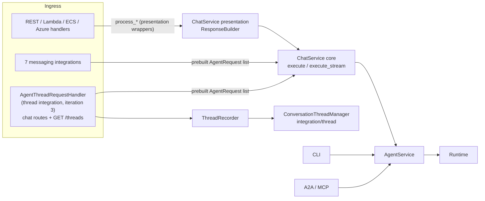

# #612: Decouple thread support from ChatService and route messaging integrations through it

ChatService currently mixes chat orchestration, conversation-thread recording, and HTTP-shaped response
formatting in one class, which is why all seven messaging integrations bypass it and call AgentService
directly. This change splits ChatService into a transport-neutral execution core and a presentation
layer, removes the thread linkage from it permanently, routes the messaging integrations through the
core, and rebuilds thread support as a self-contained integration-style handler that wraps the core
the way Slack's handler does. Thread support is positioned as a first-party chat channel with history
for clients that connect directly (an alternative to the messaging integrations, not a cross-channel
transcript), which is why it is packaged and mounted like an integration. Delivered in three
iterations, all landing in one release.

## Motivation

- ChatService is the only place conversation-thread recording happens, via `_validate_thread` /
  `_thread_pre_run` / `_thread_post_run` (`ak-py/src/agentkernel/core/chat_service.py:494`, `:507`,
  `:544`), invoked on all four execution paths (`chat_service.py:341-346`, `:370-375`, `:405-424`,
  `:454-473`).
- That linkage makes every ChatService consumer depend on thread code it does not use: ChatService
  unconditionally imports `ConversationThreadManager` (`chat_service.py:22`), which eagerly loads the
  full `core.thread` package: models, naming strategy, store builder (`core/thread/__init__.py:12-16`).
  Keeping the recorder inside ChatService would make this coupling permanent for the messaging
  integrations being routed through it.
- Thread support's REST surface sits in the API package (`api/thread.py:14`, exported at
  `api/__init__.py:16`) instead of being packaged with the capability, unlike the messaging
  integration pattern where a handler owns its routes and its platform logic together (e.g.
  `integration/slack/slack_chat.py:16-57`). `RESTAPI.run` additionally auto-mounts the thread read
  routes on a config check (`api/http.py:105-112`), an enablement semantic no other integration has.
- All seven messaging integrations construct `AgentService` directly and never pass through
  ChatService, so each hand-rolls validation and request plumbing and silently misses any future
  ChatService-layer feature:
  - Slack `integration/slack/slack_chat.py:84`, WhatsApp `whatsapp/whatsapp_chat.py:286` (via
    `session_id = from_number`, `:277`), Messenger `messenger/messenger_chat.py:202`, Instagram
    `instagram/instagram_chat.py:221`, Telegram `telegram/telegram_chat.py:190`, Teams
    `teams/teams_chat.py:141`, Gmail `gmail/gmail_chat.py:421`.
- ChatService's outputs are HTTP-shaped, which makes it unusable by integrations as-is:
  - Replies are stringified into `{"result": ...}` dicts and non-text replies collapse to
    `"Non textual result received"` (`chat_service.py:292`).
  - Errors are swallowed into status-coded dicts or `HTTPException` (`chat_service.py:298-303`),
    while integrations need exceptions for platform-specific error UX (e.g.
    `slack_chat.py:179-184`).
  - Stream methods yield pre-formatted JSON/SSE strings, not raw `StreamChunk`s
    (`chat_service.py:306-317`).
- Thread support hard-requires `user_id` on every ChatService caller once a `thread` config block
  exists (`chat_service.py:502-505`), coupling an optional feature to the shared execution path.
- ChatService cannot accept a caller-built `AgentRequest` list: `RequestBuilder` always constructs it
  from the pydantic request (`chat_service.py:342`, `:371`), yet integrations must build their own
  lists (platform-authenticated downloads, e.g. `slack_chat.py:217-276`; Slack also injects the raw
  event as extra context, `slack_chat.py:151`).
- ChatService validation hard-requires a prompt (`chat_service.py:488-491`), but integrations accept
  attachment-only messages (Slack runs whenever the request list is non-empty, `slack_chat.py:150`).
- The mounting pattern the thread handler needs already exists: applications pass handlers to
  `RESTAPI.run(handlers=[...])` explicitly (e.g. `examples/api/thread-openai/app.py:38`), and
  deployment's `RestHandler` already subclasses `AgentRESTRequestHandler` to change chat-route
  behavior while keeping the same paths (`deployment/common/rest_handler.py`).
- The messaging integration handlers have no unit tests today (no test module under `ak-py/tests`
  references any `*_chat.py` handler).

## Target state

ChatService has no thread dependency in the target state; thread recording exists only inside the
thread handler package, mirroring how Slack's handler owns everything Slack-specific.

## Requirements

### Iteration 1: ChatService thread decoupling and core/presentation split

- Remove the thread linkage from ChatService permanently, not as a staging step
  - Delete `_validate_thread`, `_thread_pre_run`, `_thread_post_run` and the
    `ConversationThreadManager` import (`chat_service.py:22`), plus their call sites on all four
    execution paths.
  - After this change no `core.thread` import remains anywhere in `chat_service.py`, and iteration 3
    does not reintroduce one.
  - The thread domain module (stores, `ConversationThreadManager`, naming, models) is not touched by
    this iteration; iteration 3 relocates it wholesale into the thread integration package.
- Add a transport-neutral execution core to ChatService
  - `execute(req: BaseChatRequest, requests: list[AgentRequest] | None = None) -> tuple[AgentReply, str]`
    (async): returns the typed reply and the response session id; exceptions propagate (no
    ResponseBuilder involvement).
  - `execute_stream(req, requests=None) -> AsyncGenerator[StreamChunk, None]`: yields raw
    `StreamChunk`s, no JSON/SSE framing.
  - A sync counterpart for the existing sync path (reusing `AgentHandler._run_async_sync`,
    `chat_service.py:207-221`).
  - When `requests` is supplied: `RequestBuilder` is skipped; validation requires `session_id` and a
    non-empty request list; `prompt` is optional (attachment-only messages are valid).
  - When `requests` is omitted: current behavior is preserved (prompt required, `RequestBuilder`
    builds the list).
- Reimplement `process_chat_request`, `process_async_chat_request`, `process_stream_chat_async`,
  `process_stream_chat_sync` as thin wrappers over the core plus ResponseBuilder
  - Response shapes, status codes, `rest_api_mode` semantics, and SSE framing are byte-identical to
    today; the only behavioral delta is that thread recording no longer happens.
  - Existing callers are untouched: REST handler (`api/handler.py:60`), Lambda routers
    (`deployment/aws/serverless/core/router/rest_lambda.py:24`, `ws_lambda.py:251`), agent runners
    (serverless `akagentrunner.py:31-33`, `:175-177`; containerized `akagentrunner.py:42-44`), ECS
    WebSocket direct mode (`containerized/core/api/websocket_api.py:242-245`), Azure
    (`deployment/azure/akfunction.py:21-23`).
- Request model
  - `user_id`, `group_id`, `thread_name` stay on `BaseChatRequest` (`core/model.py:201`) for wire
    compatibility and stay excluded from additional-context mapping (`chat_service.py:125`); they are
    consumed only by the thread handler from iteration 3 on.
- Tests
  - `ak-py/tests/test_thread_chat_service.py` is removed (revived in iteration 3 against the thread
    handler).
  - New tests for the core: typed reply return, prebuilt-list path, attachment-only validation,
    exception propagation, raw stream chunks.
  - All other existing ChatService-dependent suites pass unchanged (`test_api_http.py`,
    `test_chat_service_streaming.py`, deployment runner/stream tests).

### Iteration 2: Messaging integrations via the ChatService core

- Each of the seven handlers replaces its direct `AgentService` usage with `ChatService.execute`,
  passing its self-built `AgentRequest` list.
- Unchanged per handler (behavior parity requirement):
  - Webhook parsing, platform-authenticated attachment download and base64 conversion.
  - Session-id derivation: Slack `thread_ts` (`slack_chat.py:71`), WhatsApp `from_number`
    (`whatsapp_chat.py:277`), Messenger/Instagram `sender_id` (`messenger_chat.py:193`,
    `instagram_chat.py:211`), Telegram `chat_id` (`telegram_chat.py:183`), Teams conversation id
    (`teams_chat.py:141`), Gmail `thread_id or sender` (`gmail_chat.py:264-265`).
  - Acknowledgement/typing flows, reply stringification and splitting, platform error UX.
  - Slack's raw-event extra context continues to ride in the request list as
    `AgentRequestAny(name="body", ...)` (`slack_chat.py:151`).
- Changed per handler:
  - Build a `BaseChatRequest` (prompt, agent name from config, session id) and call `execute`; catch
    exceptions for the platform error path.
  - The "no agent available" check moves from `service.agent` inspection to catching the
    `ValueError("No agent available")` raised by the core (`chat_service.py:204`), mapped to the same
    platform message as today.
  - Gmail's `run` vs `run_multi` branch (`gmail_chat.py:435-441`) collapses onto `execute`.
- Identity fields: integrations populate `user_id`/`group_id` on the request best-effort where the
  platform identity is trivially at hand (e.g. Slack event `user`, WhatsApp `from_number`). No
  feature consumes them (thread recording is deliberately not extended to messaging integrations;
  threads are the alternative channel, see iteration 3), so this is informational plumbing only,
  never a validation requirement.
- Rollout in three PRs: Slack pilot (exercises ack flow, files, extra context, attachment-only) →
  WhatsApp/Messenger/Instagram/Telegram/Teams fan-out → Gmail last (most divergent).
- Tests: handler-level unit tests with a faked ChatService core for Slack plus at least one
  fan-out handler, establishing the pattern (integrations currently have none).

### Iteration 3: Thread support as an integration

- Product framing: conversation threads are the history mechanism for clients that connect to the
  agent directly (first-party chat UIs), an alternative to connecting via Slack/WhatsApp/etc., which
  keep their own native history. Thread support is therefore packaged, mounted, and enabled exactly
  like a messaging integration.
- New thread integration package at `integration/thread/`:
  - The entire former `core/thread/` module (manager, models, naming, authoriser, store backends)
    relocates into this package, unchanged in behavior and data layout, so thread support leaves no
    residue under `core/`; `core/` and `api/` import nothing thread-related afterwards.
  - `ThreadRecorder`: recording logic as a reusable class over `ConversationThreadManager`:
    pre-run (enforce `user_id`, store attachment bytes and rewrite to `AgentRequestAttachmentRef`,
    get-or-create thread, append user message, preserving the no-phantom-thread ordering of current
    `_thread_pre_run`, `chat_service.py:530-541`) and post-run (append assistant message). Kept
    separate from the routes for testability and potential reuse.
  - `AgentThreadRequestHandler` (naming follows `AgentSlackRequestHandler`): extends
    `AgentRESTRequestHandler`, overriding the chat routes (sync, multipart, and streaming) to:
    build the request list via `RequestBuilder` → `ThreadRecorder` pre-run → core
    `execute`/`execute_stream` with the prebuilt list → `ThreadRecorder` post-run → format via
    `ResponseBuilder` so wire shapes stay identical to the default handler's.
    - Streaming parity: accumulate deltas and skip recording on an error chunk or an empty stream,
      matching current behavior (`chat_service.py:411-428`).
    - `user_id` enforcement lives here (same hard `ValueError` semantics as today's
      `chat_service.py:502-505`); no thread policy knob lands in the core.
  - The read routes (GET `/api/v1/threads`, GET `/api/v1/threads/{session_id}`) move from
    `api/thread.py` into this package; `api/thread.py` and the `agentkernel.api` export
    (`api/__init__.py:16`) are removed. Breaking import-path change, called out in release notes;
    in-repo consumers are updated (`examples/api/thread-openai/app.py:3`,
    `examples/api/multimodal/thread-openai/app.py`, `docs/docs/advanced/threads.md`).
- Enablement follows the integration pattern: import the handler and mount it directly
  - Applications enable threads with `RESTAPI.run(handlers=[AgentThreadRequestHandler(...)])`,
    mounting it instead of the default handler. No route duplication and no new endpoint: it inherits
    the same `CHAT_PATH` routes from `AgentRESTRequestHandler`, so clients see an unchanged API
    (precedent: deployment's `RestHandler`).
  - The config-based auto-mount in `RESTAPI.run` (`api/http.py:105-112`) is removed entirely; no
    thread import remains in `api/http.py`, and no api → integration dependency is introduced.
  - Config semantics change with it: presence of a `thread` block in config no longer enables
    anything. The block only parameterizes the feature (store backend, naming); the thread handler
    owns `ConversationThreadManager` initialization when it is constructed. No config fields are
    added or removed by this change.
- Coverage scoping (explicit behavioral change vs current `develop`):
  - Thread recording applies only where `AgentThreadRequestHandler` is mounted: the self-hosted REST
    API surface.
  - Deployment adapters lose thread recording, because today they record via ChatService: Lambda REST
    (`rest_lambda.py:24`), Lambda WS (`ws_lambda.py:251`), both queue-mode agent runners (serverless
    `akagentrunner.py:31-33`, containerized `akagentrunner.py:42-44`), ECS direct-mode WS
    (`websocket_api.py:242-245`), Azure (`akfunction.py:21-23`). Accepted per the product framing;
    thread-aware deployment variants reusing `ThreadRecorder` are possible follow-ups if ever needed.
  - Messaging integrations do not record, by design, permanently (Gmail explicitly never records;
    threads are the alternative to it, not a layer on it).
  - All three iterations land in one release, so no released version carries the intermediate state
    (recording removed from ChatService but the thread handler not yet available).
- Tests: revive the iteration-1-removed thread suite against `AgentThreadRequestHandler` /
  `ThreadRecorder`; add one end-to-end-shaped test (chat via the thread handler with `user_id` →
  thread recorded and readable via the read routes).

### Documentation and skills

- The architecture documentation gains a chat execution layering diagram (the target-state diagram
  above, without iteration labels) showing which layer each entry surface calls, plus a short
  "which layer does new code call" rubric, so future surfaces route correctly by design.
  - Today both architecture pages blur the layering into a single node
    ("AgentService / ChatService", `docs/docs/architecture/overview.md:26`, `:113`;
    lumped box in `docs/docs/architecture/execution-flow.md`'s Request Lifecycle diagram).
- The dev skills reflect the same layering: `ak-dev-architecture` gains the diagram and rubric;
  `ak-dev-new-messaging-integration` switches its recipe to the ChatService core.
- Terminology sweep: no docs or skills surface may present "AgentService / ChatService" as one
  interchangeable thing; every mention names the specific layer (presentation wrappers, execution
  core, or AgentService) and its role.

## Non-goals

- Migrating A2A (`api/a2a/a2a.py:60-63`), MCP (`api/mcp/akmcp.py:39-45`), or the CLI
  (`cli/cli.py:22`) off AgentService. The CLI stays on AgentService permanently (it is the intended
  consumer of that abstraction); A2A/MCP thread participation is deferred until they have an identity
  story.
- Reply-type changes in integrations: replies remain stringified for platform delivery; rich replies
  (e.g. sending `AgentReplyImage` as media) are a separate future change enabled by, but not part of,
  this refactor.
- Thread recording for messaging integrations (permanently, by product framing), queue-mode runners,
  Lambda/Azure adapters, or ECS direct-mode WebSocket (see coverage scoping in iteration 3).
- Hook-based thread recording in `Runtime` (system PreHook/PostHook pair). Not foreclosed:
  `ThreadRecorder` would become the hook body if a universal transcript is ever pursued.
- Any behavioral change to thread stores, thread naming, `ConversationThreadManager`, or thread data
  layouts (the module relocates verbatim to `integration/thread/`; data written before the change
  reads back identically).

## Decisions from design review

- Package location: `integration/thread/`: approved.
- Auto-mount: removed from `RESTAPI.run`; enablement is explicit handler mounting like every other
  integration. No enable-style config; the `thread` block only parameterizes backends/naming.
- Release strategy: all three iterations land in one release; the dormant-recording window never
  ships.
- Iteration 2 identity fields: best-effort population, no consumer, no validation.
- Group-chat thread ownership: moot; threads are a direct-connection channel with one user per
  thread; multi-participant ownership does not arise.
- Gmail: never records threads; the thread channel is the alternative to email history, not a layer
  on it.
- Documentation: the architecture docs and skills carry the layering diagram and call rubric
  (added during review) so developers pick the right layer for future surfaces.
- Thread domain relocation (decided during implementation review): the whole former `core/thread/`
  module moves into `integration/thread/` so no thread code remains under `core/`. The config audit
  found no removable fields; only the stale "presence of this block enables the feature" wording was
  removed from the config class and field descriptions.

## Open questions

- None outstanding.
