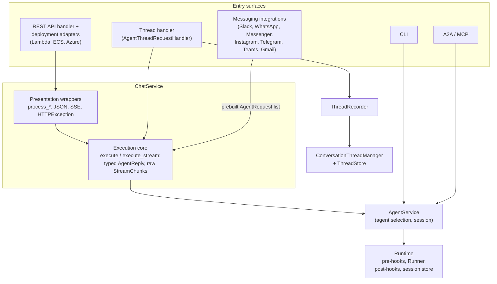

# #612 Implementation Spec: Decouple thread support from ChatService and route messaging integrations through it

This spec details how the approved [design.md](design.md) is built: ChatService gains a transport-neutral
execution core and loses its thread linkage (iteration 1), the seven messaging integrations call that core
instead of AgentService (iteration 2), and thread support is rebuilt as a self-contained integration
package that wraps the core (iteration 3). design.md is the requirements source; every requirement there
traces to a section below. All file references are relative to `ak-py/src/agentkernel/` unless prefixed.

## Design

### ChatService execution core (iteration 1)

`core/chat_service.py` keeps its four classes (`RequestBuilder`, `AgentHandler`, `ResponseBuilder`,
`ChatService`) and gains four core methods on `ChatService`. The thread methods (`_validate_thread`,
`_thread_pre_run`, `_thread_post_run`, currently `chat_service.py:494`, `:507`, `:543`) and the
`ConversationThreadManager` import (`chat_service.py:22`) are deleted.

```python
class ChatService:
    async def execute(
        self, req: BaseChatRequest, requests: Optional[List[AgentRequest]] = None
    ) -> tuple[AgentReply, Optional[str]]:
        """Validate, build (unless prebuilt), select agent, run. Returns (typed reply,
        response session id). Exceptions propagate."""

    def execute_sync(
        self, req: BaseRunRequest, requests: Optional[List[AgentRequest]] = None
    ) -> tuple[AgentReply, Optional[str]]:
        """Sync counterpart; drives the coroutine via AgentHandler._run_async_sync."""

    async def execute_stream(
        self, req: BaseChatRequest, requests: Optional[List[AgentRequest]] = None
    ) -> AsyncGenerator[StreamChunk, None]:
        """Validates and selects eagerly (raises at call time), then returns a generator
        of raw StreamChunk objects. No JSON/SSE framing."""

    def execute_stream_sync(
        self, req: BaseRunRequest, requests: Optional[List[AgentRequest]] = None
    ) -> Generator[StreamChunk, None, None]:
        """Sync counterpart. Preserves today's buffering semantics (AgentHandler.run_stream_sync
        collects all chunks before the generator yields, chat_service.py:239-254)."""
```

Rules:

1. **Validation.** `session_id` is always required. When `requests is None`: `prompt` is required and
   `RequestBuilder` builds the list (`from_base_request_sync` on the sync path,
   `from_base_request_async` on the async paths, exactly as today, `chat_service.py:342`, `:371`,
   `:406`, `:455`). When `requests` is supplied: the list must be non-empty; `prompt` is not required
   (attachment-only messages are valid); `RequestBuilder` is not invoked, so extra-field mapping does
   not run (callers own their `AgentRequestAny` entries). Validation failures raise `ValueError` with
   the existing message strings.
2. **Agent selection.** Each call constructs a fresh `AgentHandler` and calls
   `initialize(session_id, req.agent)` (raises `ValueError("No agent available")`,
   `chat_service.py:204`). The returned session id is `handler.get_response_session_id(req.session_id)`.
3. **Error propagation.** `execute`/`execute_sync` catch nothing. `execute_stream`/`execute_stream_sync`
   raise before the generator is returned (validation, agent selection) and convert exceptions raised
   *inside* the generator into a terminal `StreamChunk(error=str(e), done=True)`, matching today's
   in-stream behavior (`chat_service.py:425-427`). No thread bookkeeping remains in the stream loops.
4. **No thread knowledge.** After this change `chat_service.py` contains no `core.thread` import, and
   iteration 3 does not add one back.

The four public wrappers are reimplemented over the core and keep their exact signatures and wire
behavior:

- `process_chat_request` (sync): `execute_sync` inside try/except; `ValueError` maps to
  `ResponseBuilder.build_response(400, ...)`, `Exception` to `build_response(500, ...)`, success to
  `build_response(200, sid, ...)`. Same for `process_async_chat_request` with `execute`.
- `process_stream_chat_async` / `process_stream_chat_sync`: call the stream core, then wrap each raw
  chunk with `ResponseBuilder.stream_chunk(chunk, session_id, sse_format=...)`
  (`chat_service.py:306-317`, unchanged). Eager validation still raises `ValueError` at call time so
  `AgentRESTRequestHandler.run` keeps returning 400 before streaming starts (`api/handler.py:70-71`).
- `rest_api_mode` semantics of `ResponseBuilder.build_response` are untouched
  (`chat_service.py:277-303`).

One deliberate simplification: on error the wrappers report `req.session_id` as the response session id.
Today that is already the value returned in every case except one (see Behavioural changes, item 5),
because both wrappers validate `session_id` presence up front and `AgentService` loads sessions by that
same id (`core/service.py:80-86`, `:170-180`).

### Messaging integrations on the ChatService core (iteration 2)

Common recipe, applied to all seven handlers:

```python
# __init__ (all handlers):
self._chat_service = ChatService()          # same pattern as AgentRESTRequestHandler, api/handler.py:60

# message path, replacing AgentService select/run_multi:
req = BaseChatRequest(prompt=<text or "">, agent=self._<platform>_agent,
                      session_id=<derivation unchanged>, user_id=<best effort>, group_id=<best effort>)
reply, _ = await self._chat_service.execute(req, requests=requests)
```

- `ChatService` is imported from `...core` (exported at `core/__init__.py:34`).
- The request list is built by the handler exactly as today (platform downloads, base64, ordering).
- "No agent available": handlers catch `ValueError` from `execute` and send the same platform message
  they send today after the `service.agent` check; all other exceptions keep flowing to each handler's
  existing generic error branch. The `AgentService` import is removed from every handler.
- `user_id`/`group_id` are populated best-effort (design decision: informational only, no consumer,
  no validation).

Per-handler specifics (each names its AgentService block to delete and its identity mapping):

| Handler | Replace at | session_id (unchanged) | user_id | group_id | Notes |
|---|---|---|---|---|---|
| Slack (`integration/slack/slack_chat.py`) | `:84`, `:125-128`, `:152` | `thread_ts` (`:71`) | event `user` (`:65`) | `channel` (`:67`) | `AgentRequestAny(name="body", content=body)` stays in the prebuilt list (`:151`); ack flow, `_split_reply`, reply `isinstance` formatting (`:157`) unchanged; `prompt=question` may be empty with files (`:150`) |
| WhatsApp (`whatsapp/whatsapp_chat.py`) | `:279`, `:286-292` | `from_number` (`:277`) | `from_number` | none | unconditional `str(result)` (`:294`) unchanged |
| Messenger (`messenger/messenger_chat.py`) | `:192`, `:202-227` | `sender_id` (`:193`) | `sender_id` | none | collapse the `run`/`run_multi` branch (`:224-227`) onto one `execute` call; keep the `requests`-empty early return with "Sorry, I could not process your message." (`:228-237`); delete the dead `result.raw` branch (`:232-233`) |
| Instagram (`instagram/instagram_chat.py`) | `:210`, `:221-246` | `sender_id` (`:211`) | `sender_id` | none | same three changes as Messenger (`:243-246`, `:251-252`) |
| Telegram (`telegram/telegram_chat.py`) | `:182`, `:190-216` | `str(chat_id)` (`:183`) | `str(message["from"]["id"])` when the update carries it, else None | none | `_process_agent_message` gains the sender id (threaded through from `_handle_message`; None on the callback-query path); delete the dead `result.raw` branch (`:218-219`); keep the empty-message reply (`:210-213`) |
| Teams (`teams/teams_chat.py`) | `:134`, `:141-161` | `conversation_id` (`:121`) | `activity.from_property.id` when present | none | `_send_reply(turn_context, reply, user_name)` keeps receiving the typed reply (`:290-301`), unchanged |
| Gmail (`gmail/gmail_chat.py`) | `:410`, `:421-447` | `thread_id or sender` (`:264-265`, `:411`) | `sender` | none | collapse `run`/`run_multi` (`:434-441`) onto one `execute` with the full request list; return `str(reply)`; delete the dead `result.raw` branch (`:444-445`); on `ValueError` (no agent) log and return None exactly as the `service.agent` check does today (`:422-424`) |

The dead `result.raw` branches are safe to delete: no `AgentReply` type defines a `raw` attribute
(`core/model.py:90-160`), so `hasattr(result, "raw")` is always False today.

Rollout is three PRs (Slack pilot; the five webhook handlers; Gmail), per design.md.

### Thread integration package (iteration 3)

New package, following the messaging-integration layout (`ak-dev-new-messaging-integration` checklist):

```
integration/thread/
├── __init__.py        # exports the full thread surface (handlers, recorder, manager, models, stores)
├── recorder.py        # ThreadRecorder
├── thread_chat.py     # AgentThreadRequestHandler; ThreadRESTRequestHandler moved verbatim from api/thread.py
├── authoriser.py      # moved verbatim from core/thread/
├── manager.py         # ConversationThreadManager, moved verbatim from core/thread/
├── model.py           # Thread/ThreadMessage/... models, moved verbatim from core/thread/
├── naming.py          # ThreadNamingStrategy, moved verbatim from core/thread/
└── store/             # ThreadStore ABC + builder + backends, moved verbatim from core/thread/store/
ak-py/src/agentkernel/thread.py   # top-level alias: wildcard import, same shape as slack.py
```

The whole former `core/thread/` module relocates here (decided during implementation review): thread
support leaves no residue under `core/`, and `core/`/`api/` import nothing thread-related afterwards.
Only import paths change inside the moved files (`..config` becomes `...core.config`, `..model`
becomes `...core.model`, `...util.*` becomes `....core.util.*`, and the lazy multimodal import in
`manager.py` becomes `...core.multimodal.storage`); behavior, key schemas, and data layouts are
untouched.

The top-level name `agentkernel/thread.py` is currently unused (no collision; `agentkernel.core.thread`
is a different module path). Loggers use the existing hierarchy: `ak.integration.thread.*` for the new
code; the moved `ThreadRESTRequestHandler` keeps its `ak.api.thread` logger name so log filtering
configured on it keeps working.

**ThreadRecorder** (`recorder.py`): the relocated `_thread_pre_run`/`_thread_post_run` logic as an
instance class over the unchanged `ConversationThreadManager`:

```python
class ThreadRecorder:
    def __init__(self, manager: ConversationThreadManager): ...

    def pre_run(self, req: BaseChatRequest, requests: List[AgentRequest])
            -> tuple[List[AgentRequest], List[ThreadAttachment]]:
        # 1. enforce user_id: raise ValueError with the exact current message
        #    ("No user_id is provided in the request — user_id is required when thread support
        #    is enabled", chat_service.py:504) when req.user_id is falsy
        # 2. manager.store_attachments(session_id, requests) runs first, so its config-validation
        #    ValueError fires before any thread state exists (no-phantom-thread ordering,
        #    chat_service.py:530-541)
        # 3. manager.get_or_create_thread(session_id, user_id, group_id, req.thread_name, req.prompt)
        # 4. manager.append_message(session_id, "user", req.prompt, attachments)
        # returns the rebuilt request list (attachments replaced by AgentRequestAttachmentRef)

    def post_run(self, req: BaseChatRequest, result: Any) -> None:
        # manager.append_message(session_id, "assistant", str(result))
```

**AgentThreadRequestHandler** (`thread_chat.py`): extends `AgentRESTRequestHandler`
(`api/handler.py:36`), the same base-reuse pattern as deployment's `RestHandler`.

```python
class AgentThreadRequestHandler(AgentRESTRequestHandler):
    def __init__(self, authoriser: Optional[Authoriser] = None):
        super().__init__()
        manager = ConversationThreadManager.get()
        if manager is None:
            raise ValueError("Conversation Thread Support is not configured. Add a 'thread' block to config.yaml")
        self._recorder = ThreadRecorder(manager)
        self._read_handler = ThreadRESTRequestHandler(authoriser=authoriser)

    def get_router(self) -> APIRouter:
        # super().get_router() routes (AGENTS_PATH, CHAT_PATH, CHAT_MULTIPART_PATH; same paths,
        # api/handler.py:112-114) plus the read routes from self._read_handler.get_router()

    async def run(self, body): ...           # override, recording wrapped (below)
    async def run_multipart(self, ...): ...  # override, same shape as the base signature (api/handler.py:76-86)
```

Failing fast in `__init__` when the `thread` block is absent follows the existing integration
precedent (WhatsApp/Telegram/Teams raise `ValueError` on incomplete config in `__init__`,
`whatsapp_chat.py:41-43`).

Chat-route behavior (both `run` and `run_multipart`):

1. **Agent-availability precheck** before any thread write: replicate `AgentHandler.initialize`'s rule
   (named agent must be registered, otherwise at least one agent must exist,
   `core/service.py:49-78`) and raise the same `ValueError("No agent available")` mapped to 400. This
   unifies the two paths that today disagree (see Behavioural changes, item 6).
2. Non-stream mode: `requests = await RequestBuilder.from_base_request_async(body)` (this is where
   prompt-required and extra-field mapping run for the thread channel) →
   `requests, attachments = self._recorder.pre_run(body, requests)` →
   `reply, sid = await self.chat_service.execute(body, requests=requests)` →
   `self._recorder.post_run(body, reply)` →
   `ResponseBuilder.build_response(200, sid, rest_api_mode=True, result=reply)`. `ValueError` maps to
   `build_response(400, ..., error=...)` and `Exception` to `build_response(500, ...)`, both of which
   raise `HTTPException` in `rest_api_mode` exactly like the default handler's wire shapes today.
3. Stream mode (`execution.mode == stream`, dispatch identical to `api/handler.py:66`): build and
   `pre_run` eagerly, get the raw generator from `execute_stream`, and return a `StreamingResponse`
   over a wrapping generator that accumulates `chunk.delta`, tracks `chunk.error`, formats each chunk
   with `ResponseBuilder.stream_chunk(chunk, session_id, sse_format=True)`, and calls
   `post_run(body, "".join(deltas))` after the loop only when no error chunk was seen and at least one
   delta arrived, replicating `chat_service.py:411-424`.

**Removals**:

- `api/thread.py` is deleted; the class moves verbatim (imports adjusted to
  `...core.thread`) into `integration/thread/thread_chat.py`.
- `api/__init__.py:16` (`from .thread import ThreadRESTRequestHandler`) is deleted.
- The auto-mount block in `RESTAPI.run` (`api/http.py:105-112`: the `AKConfig.get().thread is not None`
  check, the lazy `from .thread import ThreadRESTRequestHandler`, and the conditional append) is
  deleted. No thread import remains anywhere under `api/`. The a2a/mcp conditional wiring in `run()`
  is untouched.

### Documentation: chat execution layering diagram

The architecture documentation and the dev skills gain one canonical diagram of the end-state
layering, plus a call rubric. This is the source of truth the docs-sync iteration copies; both
current architecture pages blur the layering into a single "AgentService / ChatService" node
(`docs/docs/architecture/overview.md:26`, `:113`; the Request Lifecycle diagram in
`docs/docs/architecture/execution-flow.md`), which is the ambiguity that let integrations bypass
ChatService in the first place.



The accompanying rubric, "which layer does new code call":

- A new HTTP-shaped surface that returns JSON/SSE with the standard error shapes calls the
  presentation wrappers (`process_*`).
- A new channel or integration that owns its own transport, reply formatting, and error UX calls the
  core (`execute`/`execute_stream`), passing a prebuilt request list when it builds its own
  attachments.
- An interactive or stateful client that manages agent and session lifecycle itself (REPL-like)
  uses `AgentService`.
- Cross-cutting behavior that must apply to every run regardless of surface goes in a `Runtime`
  pre/post hook, not in a service layer.
- Entry surfaces never call `Runtime` directly.

Placement (executed in the docs-sync iteration): the Request Lifecycle section of
`docs/docs/architecture/execution-flow.md` (replace the lumped node with the layered flow), the
component diagram and layer table of `docs/docs/architecture/overview.md` (`:13-26`, `:113`),
`.agents/skills/ak-dev-architecture/SKILL.md` (ChatService section), and the recipe of
`.agents/skills/ak-dev-new-messaging-integration/SKILL.md`. Additionally (requested during review), a
"ChatService vs AgentService" comparison section (stateful conversation object vs stateless request
processor, comparison table, when to use which, layers-not-alternatives note) goes in
`docs/docs/architecture/overview.md` and the `ak-dev-architecture` skill, cross-linked from the
execution-flow rubric. The docs site renders mermaid natively
(`docs/docusaurus.config.js:294`).

**Terminology sweep.** Beyond the two diagrams, every docs/skills mention that treats the two
services as one interchangeable thing is rewritten to name the specific layer. Canonical
one-liners to use: *ChatService presentation wrappers* (HTTP-shaped `process_*` responses),
*ChatService execution core* (`execute`/`execute_stream`, typed replies), *AgentService*
(agent/session lifecycle for stateful clients). Enumerated conflation sites, verified on the
current tree:

- `docs/docs/architecture/execution-flow.md:11`: prose "`ChatService`/`AgentService` →
  `Runtime.run()`" names the layers per surface instead.
- `docs/docs/architecture/execution-flow.md:24`: the lumped diagram node (covered by the diagram
  replacement).
- `docs/docs/architecture/execution-flow.md:61`: verify the request-building prose against the
  post-change flow (core building requests, selecting via `AgentHandler`/`AgentService`); correct
  wording only if stale.
- `docs/docs/architecture/overview.md:26` and `:113`: component-diagram node and layer-table row
  (covered by the diagram replacement; the table row splits into per-layer entries).
- `docs/docs/core-concepts/overview.md:180`: the merged "**AgentService / ChatService**" bullet
  splits into two entries with distinct roles and callers.
- `docs/docs/api/a2a-server.md:76`: "the same `AgentService` pipeline as REST requests" becomes
  "the same `Runtime` pipeline" (REST goes through ChatService after this change; what A2A and
  REST actually share is the Runtime hook/guardrail/session pipeline).

Solo `ChatService` mentions in `docs/docs/advanced/queue-mode-guide.md`,
`docs/docs/advanced/threads.md`, `docs/docs/architecture/sandbox-internals.md`,
`docs/docs/deployment/overview.md`, and `docs/docs/deployment/aws-containerized.md` are verified
against the new layering during the sweep and updated only where they state behavior this change
moves (thread recording, `user_id` enforcement); the queue-mode "validation/execution happen in the
Agent Runner" description remains true and stays.

### Consumer changes

- **`api/handler.py` (`AgentRESTRequestHandler`)**: unchanged. It calls only the wrapper methods
  (`:68`, `:74`, `:99`, `:105`), which keep their signatures and behavior.
- **Deployment adapters**: unchanged code; verified they call only wrappers:
  `process_chat_request` (azure `akfunction.py:50`, serverless `akagentrunner.py:130`,
  `ws_lambda.py:318`, `rest_lambda.py:258`, containerized `akagentrunner.py:110`),
  `process_stream_chat_sync` (serverless `akagentrunner.py:267`, `ws_lambda.py:349`, containerized
  `akagentrunner.py:213`), `process_async_chat_request` and `process_stream_chat_async`
  (containerized `websocket_api.py:359`, `:376`). Their thread recording stops (Behavioural changes,
  item 1).
- **Messaging integrations**: changed per the iteration-2 table.
- **Examples**: `examples/api/thread-openai/app.py:3,38` and
  `examples/api/multimodal/thread-openai/app.py:3,38` change from mounting
  `[AgentRESTRequestHandler(), ThreadRESTRequestHandler(authoriser=...)]` (imported from
  `agentkernel.api`) to mounting `[AgentThreadRequestHandler(authoriser=...)]` imported from
  `agentkernel.thread`. The in-file comment about the automatic mount is deleted with the behavior.
- **CLI, A2A, MCP**: untouched (design non-goal); they keep using `AgentService`
  (`cli/cli.py:22`, `api/a2a/a2a.py:61`, `api/mcp/akmcp.py:40`).
- **`core/__init__.py`**: unchanged (`ChatService` stays exported, `:34`).

### Config changes

- No config classes, fields, types, or defaults change. `AKConfig.thread` remains
  `Optional[_ThreadStoreConfig] = None` (`core/config.py:615-618`).
- The field **description** changes from "Conversation Thread Support configurations. Feature is
  enabled only when this block is present." to wording that reflects the new semantics, e.g.
  "Conversation Thread Support configurations (store backend, naming). The feature is served by
  mounting AgentThreadRequestHandler; this block only parameterizes it." (Descriptions surface in
  generated docs.) The `_ThreadStoreConfig` class docstring loses the same stale "presence enables"
  claim.
- Config redundancy audit (requested during implementation review): every field of the thread config
  classes (`type`, `naming.model`/`max_length`, and the per-backend `redis`/`valkey`/`dynamodb`/
  `firestore`/`cosmosdb` blocks) is consumed by `ThreadStoreBuilder`, the store backends, or the
  naming strategy. No fields are added or removed.
- Existing YAML files and `AK_THREAD__*` env vars keep parsing identically. Behavior of "block present
  but handler not mounted" changes from "read routes auto-mounted + recording on every ChatService
  path + user_id enforced everywhere" to "inert". The known footgun where any stray `AK_THREAD__*`
  var silently enabled the feature on the in-memory backend is thereby reduced to "materializes an
  unused config object".
- Data compatibility: thread store layouts, key schemas, and `ConversationThreadManager` are
  untouched; threads written before this change read back identically through the relocated read
  routes.

### Behavioural changes

All intentional; each with its justification:

1. **Thread recording only happens via `AgentThreadRequestHandler`.** The plain REST handler and all
   deployment adapters (Lambda REST `rest_lambda.py:258`, Lambda WS `ws_lambda.py:318`, both
   queue-mode runners `akagentrunner.py:130`/`:110`, streaming runners `:267`/`:213`, ECS direct WS
   `websocket_api.py:359`, Azure `akfunction.py:50`) stop recording when a `thread` block is present.
   Product framing: threads are the direct-connection channel's history, served by its own handler.
2. **`user_id` is no longer required on non-thread paths.** Today every ChatService caller fails with
   400/`ValueError` when a `thread` block exists and `user_id` is missing (`chat_service.py:502-505`);
   after the change those requests succeed without recording. Decoupling is the point of the design.
3. **No auto-mount.** With a `thread` block and default handlers, `GET /api/v1/threads*` no longer
   appears automatically (`api/http.py:105-112` deleted); apps mount `AgentThreadRequestHandler`
   explicitly. Breaking for config-only setups; called out in release notes and updated examples/docs.
4. **Import path moves.** `agentkernel.api.ThreadRESTRequestHandler` no longer exists; the class is
   importable from `agentkernel.thread` (and `agentkernel.integration.thread`). Breaking; release
   notes.
5. **Sync wrapper error payloads now carry `session_id` when the request had one.** Today
   `process_chat_request`'s generic-exception branch reports `get_response_session_id(None)`
   (`chat_service.py:353`), omitting the id if failure occurred before agent selection, while the
   async branch reports it (`chat_service.py:382`). The rebuilt wrappers report `req.session_id` in
   both, removing an undocumented sync/async asymmetry.
6. **No thread writes when no agent is available, on every path.** Today the non-stream async path
   selects the agent before `_thread_pre_run` (`chat_service.py:372-373`) but both stream paths run
   `_thread_pre_run` first (`:405-409`, `:454-458`), so a missing agent leaves a phantom thread with
   an unanswered user message. The precheck in `AgentThreadRequestHandler` unifies on
   "validate agent first".
7. **Integrations detect "no agent" after attachment downloads.** Selection moves inside `execute`, so
   handlers that selected before downloading (Slack `slack_chat.py:125`, Telegram
   `telegram_chat.py:190`, Teams `teams_chat.py:141`, Messenger `messenger_chat.py:202`, Instagram
   `instagram_chat.py:221`) now download first. Same user-visible message; wasted downloads only in
   the misconfigured-agent case.
8. **Messenger/Instagram/Gmail single-text requests now run through `run_multi` semantics.** The
   `service.run(text)` branch (`messenger_chat.py:227`, `instagram_chat.py:246`,
   `gmail_chat.py:441`) collapses onto `execute`. For `AgentReplyText` and `AgentReplyAny` the
   delivered string is identical (`str()` returns `.response` / JSON, `core/model.py:103-104`,
   `:143-144`); for an `AgentReplyImage` the text changes from `"Non-text reply given"`
   (`core/service.py:135`) to `"<response>. Image <name> is attached."` (`core/model.py:119-120`),
   which is what these handlers' own multi-request path already delivers today.
9. **Dead `result.raw` branches removed** (Telegram, Messenger, Instagram, Gmail). No observable
   change: no `AgentReply` type has a `raw` attribute (`core/model.py:90-160`).
10. **Empty-string `session_id` is rejected on the sync path.** The old sync `_validate` checked
    `session_id is None` while the async paths checked falsiness (`chat_service.py:488` vs `:366`
    pre-change), so `session_id=""` ran on the sync path and 400'd on the async path. The unified
    core validates falsiness on both; the degenerate `""` now gets a 400 everywhere.
11. **`agentkernel.core.thread` no longer exists.** The whole module relocates to
    `integration/thread/`; every public name (`ConversationThreadManager`, `Authoriser`,
    `ThreadNamingStrategy`, `ThreadStore`, `ThreadStoreBuilder`, the models, the store backends) is
    importable from `agentkernel.thread` (and `agentkernel.integration.thread`). Breaking
    import-path change, release-noted alongside item 4.

**Non-changes** (verified fixed points):

- Wire shapes: `/api/v1/chat` success/error JSON, `HTTPException` details, SSE frame format
  (`data: {...}\n\n`), `StreamChunk` payload fields, and the `(status, dict)` tuples of
  `rest_api_mode=False`.
- `RequestBuilder` behavior including extra-field `AgentRequestAny` mapping and its `known_fields`
  set (`chat_service.py:125`); `user_id`/`group_id`/`thread_name` remain excluded and remain on
  `BaseChatRequest` (`core/model.py:201-215`).
- `AgentHandler`, `ResponseBuilder`, `AgentService`, `Runtime` hook pipeline (guardrails,
  multimodal), session persistence.
- All platform-facing behavior of the integrations except items 7-9: webhook verification, ack/typing
  flows, size checks, chunking limits (3000/4096/2000), error messages, Gmail signature handling.
- Thread read-route semantics (401/403/404 behavior, pagination, `Authoriser` contract) and the
  thread domain (manager, stores, naming, models) in behavior and data layout; the module itself
  relocates (see Behavioural changes, item 11).
- Public exports other than `agentkernel.api.ThreadRESTRequestHandler`; `agentkernel.core` exports
  are untouched.

## Error handling

- **Core (`execute`/`execute_sync`)**: raises `ValueError` for missing `session_id`, missing `prompt`
  (built path), empty prebuilt list, and no-agent; propagates everything else (runner errors,
  guardrail halts are replies not exceptions). No logging is removed: the wrappers keep the existing
  `self._log.error(...)` lines on their catch branches.
- **Core streams**: pre-generator failures raise (callers translate to 400/500); in-generator failures
  yield a final `StreamChunk(error=..., done=True)` and end the stream, as today.
- **Wrappers**: `ValueError` → 400, `Exception` → 500, via `ResponseBuilder.build_response`
  (dict-tuple or `HTTPException` per `rest_api_mode`), unchanged.
- **Integrations**: `ValueError` from `execute` → the platform's existing no-agent message; all other
  exceptions → the platform's existing generic error branch (each handler's current
  `except Exception` block). Exception scope note: handlers today catch broad `Exception` around the
  agent call; that stays. Slack's `SlackApiError` branch stays first.
- **Thread handler**: construction with no `thread` block raises `ValueError` at startup (fail-fast,
  matching integration precedent). `recorder.pre_run` `ValueError`s (missing `user_id`,
  attachments-without-multimodal from `store_attachments`, `core/thread/manager.py:175`) → 400.
  Store/back-end failures (e.g. Redis errors) propagate → 500, same surfacing as today where
  `_thread_pre_run` errors hit the generic branch.
- **Missing optional dependencies**: unchanged. The thread extra covers naming (`litellm` import stays
  lazy inside `ThreadNamingStrategy`); store backends keep their factory-time `require_extra`
  behavior via `ThreadStoreBuilder`. The new package imports only in-repo modules plus FastAPI, which
  the `api` extra already provides.
- **Concurrency**: `ChatService` instances remain stateless apart from `rest_api_mode`; each request
  gets a fresh `AgentHandler`, so per-handler `ChatService` reuse across concurrent requests stays
  safe. `ThreadRecorder` holds only the process-wide `ConversationThreadManager` (internally
  `RLock`-guarded singleton, `core/thread/manager.py:57-90`); no new shared mutable state is
  introduced.
- **Per-operation cost**: no new work on any hot path. Iteration 3 adds the same thread-store writes
  that exist today, relocated; the agent-availability precheck is a dict lookup.

## Testing

Run with `cd ak-py && uv run pytest`.

**Iteration 1**

- Delete `ak-py/tests/test_thread_chat_service.py` (pins the removed ChatService thread flow; its
  scenarios are revived in iteration 3 against the new seam).
- New `ak-py/tests/test_chat_service_core.py`:
  - `execute` returns the typed reply and session id (mock `AgentHandler` at
    `agentkernel.core.chat_service.AgentHandler`, the existing patch target).
  - Prebuilt path skips `RequestBuilder` (patch
    `agentkernel.core.chat_service.RequestBuilder.from_base_request_async` to raise if called).
  - Attachment-only prebuilt list with `prompt=""` is accepted; empty prebuilt list raises
    `ValueError`; missing `session_id` raises `ValueError`; built path still requires `prompt`.
  - Exceptions from the handler propagate out of `execute` unmodified.
  - `execute_stream` yields raw `StreamChunk`s, raises `ValueError` at call time for invalid input,
    and converts an in-generator exception into a terminal error chunk.
- Existing suites that must pass unchanged (their patch targets
  `agentkernel.core.chat_service.AgentHandler` and
  `agentkernel.core.chat_service.RequestBuilder.from_base_request_*` remain valid):
  `test_chat_service_streaming.py`, `test_api_http.py` (no thread references, verified),
  `test_akagentrunner_stream.py`, `test_ecs_akagentrunner_stream.py`, `test_ws_lambda_stream.py`,
  `test_ecs_websocket_routes.py`, `test_api_multipart_fields.py`. `test_thread_multimodal_hook.py`
  is unaffected (tests `MultimodalPreHook` with pre-stored refs; mentions ChatService only in a
  comment).

**Iteration 2**

- New `ak-py/tests/test_slack_integration.py` (pilot, establishes the pattern; the handlers'
  `self._chat_service` instance attribute is replaced with a fake exposing `execute`):
  - Message event builds the expected request list (text + `AgentRequestAny("body")`), passes
    `BaseChatRequest(session_id=thread_ts, user_id=user, group_id=channel, agent=<config>)`.
  - Attachment-only message (empty `question`) still calls `execute`.
  - `ValueError` from `execute` sends the no-agent message; generic exception sends the error
    message; reply formatting/chunking unchanged (`_split_reply` cases).
- New `ak-py/tests/test_whatsapp_integration.py` (fan-out representative): text and media paths call
  `execute` once with `session_id=user_id=from_number`; error paths.
- The riskiest consumer rule: Gmail's PR adds equivalent handler-level tests for
  `_process_with_agent` (single-text and text+attachments both hit `execute`; `ValueError` returns
  None), since Gmail's control flow changes the most and has no existing tests.

**Iteration 3**

- New `ak-py/tests/test_thread_integration.py`:
  - `ThreadRecorder.pre_run`: missing `user_id` raises with the exact current message;
    `store_attachments` rejection fires before `get_or_create_thread` (no phantom thread, assert via
    mock call order); attachment requests are replaced by `AgentRequestAttachmentRef`; user message
    appended with attachments.
  - `ThreadRecorder.post_run` appends the assistant message.
  - `AgentThreadRequestHandler`: constructing without a `thread` block raises `ValueError`
    (`ConversationThreadManager.reset()` + config monkeypatch, the fixture pattern from the deleted
    suite); router exposes the three inherited paths plus both read routes; non-stream chat records
    user+assistant around a mocked `chat_service.execute`; stream chat accumulates deltas and skips
    `post_run` on an error chunk or empty stream; the no-agent precheck returns 400 and leaves the
    thread store untouched.
  - Read routes: reuse/adapt the route assertions currently exercised through the examples and
    `api/thread.py` behavior (404 when disabled, 403 on foreign thread, forced user scoping) against
    the moved class.
- End-to-end shaped test: chat through `AgentThreadRequestHandler` with a real
  `InMemoryThreadStore` + `DummyAgent`, then read the thread back through the read routes.
- `RESTAPI.run` tests in `test_api_http.py` continue to pass with the auto-mount block deleted
  (no test asserts thread mounting, verified by grep).
