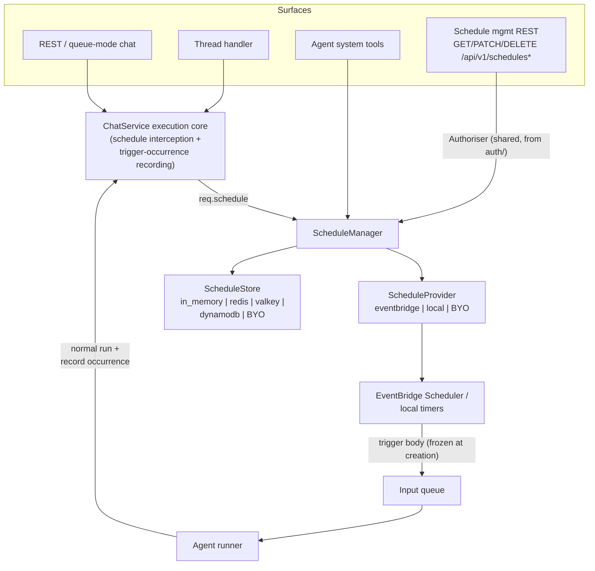

# #629: Scheduling capability for deferred and recurring chat execution

A chat request gains an optional `schedule` block that defers its execution to a later time (one-time) or a recurring cadence (cron) instead of running immediately. The capability is built on two pluggable abstractions, a `ScheduleProvider` (registers the trigger with an external scheduler; built-ins: AWS EventBridge Scheduler and a local in-process provider) and a `ScheduleStore` (tracks created and executed tasks), orchestrated by a `ScheduleManager` singleton, with a management REST handler, agent system tools, and AWS Terraform provisioning. Supporting research: `research/aws-eventbridge-scheduler.md`, `research/provider-alternatives.md`.

## Motivation

- No scheduling concept exists anywhere today: no schedule code in `ak-py/src`, no `AK_SCHEDUL*` env var, no `aws_scheduler_*` Terraform resource (the only EventBridge use is an autoscaling metric rule, `ak-deployment/ak-aws/containerized/modules/agent-runner/main.tf:445-451`).
- Every chat surface executes immediately through one funnel: the ChatService execution core (`ak-py/src/agentkernel/core/chat_service.py:334-413`), reached by direct REST, the thread handler, the queue-mode agent runners, ECS WebSocket, Lambda, and all seven messaging integrations. This funnel is the only single point where a deferral decision can be uniform.
- An unknown `schedule` key on a JSON chat request is today silently converted to `AgentRequestAny` and handed to pre-hooks (`chat_service.py:118-131`), and silently dropped on the multipart path (`chat_service.py:63-70`): accidental behavior that must become first-class.
- External producers injecting into the input queue are already anticipated (`deployment/aws/core/sqs_handler.py:16-21` documents non-AK producers), but the current message contract blocks an external scheduler:
  - Consumers hard-require `request_id` as an SQS **message attribute** (`deployment/aws/containerized/akagentrunner.py:62-64`, `pipeline/agent_runner.py:89-94`), and EventBridge Scheduler's SQS target cannot set message attributes (only body + `MessageGroupId`; see `research/aws-eventbridge-scheduler.md`).
  - The provisioned input queue is FIFO with `content_based_deduplication = false` (`ak-deployment/ak-aws/containerized/modules/queues/main.tf:16-19`), and Scheduler cannot set `MessageDeduplicationId`, so its sends would be rejected outright.
- Ownership ("users manage only their own resources") exists only inside the thread integration: `Authoriser` (`integration/thread/authoriser.py`) is a pure `token -> Optional[user_id]` ABC with nothing thread-specific, the bearer-parsing logic is a private method (`integration/thread/thread_chat.py:218-237`), and it is unrelated to the global `AuthValidator` (`auth/handler.py`). Schedules need the same mechanism, shared rather than duplicated.
- Tools have no user identity today: `ToolContext` carries only runtime/agent/session/requests (`core/tool.py:34-47`), and `user_id` is dropped at the ChatService boundary (`chat_service.py:126-131` excludes it from passthrough). Tool-created schedules need an owner.

## Requirements

### Capability layout and enablement

- New top-level package `ak-py/src/agentkernel/schedule/` (sibling of `sandbox/`), containing `model.py`, `manager.py`, `provider/` (base + factory, `eventbridge.py`, `local.py`), `store/` (base + builder, backends), `handler.py` (management REST), `tools.py` (system tools).
  - Core reaches it only via lazy imports inside enabled-checks, following the sandbox precedent (`core/tool.py:190,196`); nothing in `schedule/` is imported at core import time.
  - `schedule/handler.py` may import `api/` (integration-style handler); core never imports `schedule/handler.py`.
- Enablement mirrors threads: `AKConfig.schedule: Optional[_ScheduleConfig] = None`; block present = capability on, absent = fully inert.
- `ScheduleManager.get() -> Optional[ScheduleManager]` singleton, `None` when unconfigured (the `ConversationThreadManager.get()` / `ExecutionManager.get()` shape, `integration/thread/manager.py:77-90`, `sandbox/manager.py:53-63`), with a `reset()` for tests.

### Schedule block on the chat payload (issue req 1, 5, 6)

- `BaseChatRequest` gains `schedule: Optional[ScheduleSpec] = None` (`core/model.py:201-214`).
- `ScheduleSpec` fields (all JSON-primitive types; no `datetime` objects, because both queue paths `json.dumps` a python-mode `model_dump()`: `pipeline/request_handler.py:86,200`, `deployment/aws/core/sqs_handler.py:91-107`):
  - `at: Optional[str]`: ISO-8601 local wall-clock timestamp, one-time occurrence.
  - `cron: Optional[str]`: standard 5-field cron expression, recurring occurrence.
  - Exactly one of `at` / `cron` must be set (validation error otherwise).
  - `timezone: str = "UTC"`: IANA timezone the expression is evaluated in.
  - `session_mode: Literal["reuse", "new"] = "reuse"`: run on the originating `session_id`, or on a fresh session per occurrence.
- `schedule` is added to `RequestBuilder`'s `known_fields` (`chat_service.py:126`) so it never leaks to the agent as `AgentRequestAny`.
- A request carrying `schedule` when the capability is unconfigured is rejected with `ValueError` -> 400 ("scheduling is not configured"), replacing today's silent leak.
- Creation requires `user_id` on the request (the schedule owner); missing -> `ValueError` -> 400. Same trust model as threads: without an `Authoriser`, the caller-supplied `user_id` is accepted unverified.
- Multipart routes do not gain a `schedule` form field: a multipart/attachment request cannot be scheduled in this scope (attachments would need durable storage until trigger time). The three multipart signatures (`api/handler.py:76-105`, `pipeline/request_handler.py:343-380`, `integration/thread/thread_chat.py:79-108`) stay unchanged.

### Interception in the ChatService execution core (issue req 1)

- The four core entry points (`execute`, `execute_sync`, `execute_stream`, `execute_stream_sync`, `chat_service.py:334-413`) check `req.schedule` before agent/session selection:
  - Lazy-import `ScheduleManager`; create the task (store record + provider registration); return a scheduled acknowledgement instead of running the agent.
  - Acknowledgement is an `AgentReplyAny` containing `{"status": "SCHEDULED", "scheduled_task_id": ..., "session_id": ...}`, delivered with HTTP status **202**:
    - Direct REST: the presentation wrappers return the body with a 202 status (`ResponseBuilder` success paths imply 200 today; they gain a status-carrying success path).
    - Pipeline queue mode: the runner already forwards a `status_code` attribute and the response store records it (`pipeline/agent_runner.py:98-99`, `pipeline/response_handler.py:120-134`); the REST_SYNC waiter and poller surface the 202.
    - ECS queue mode: the output path drops status codes today (`akagentrunner.py:110`, `akoutputconsumer.py:144-166`); the spec adds `status_code` to the stored record (defaulting to 200 when absent, matching the pipeline default) so 202 surfaces there too.
  - Streaming surfaces deliver the acknowledgement as a single terminal `StreamChunk` (not an error chunk).
- Queue mode consequence, accepted deliberately: the message is enqueued normally and the deferral happens worker-side in the agent runner's ChatService call (`pipeline/agent_runner.py:41`, `akagentrunner.py:110`). One interception point; the REST_SYNC waiter receives the acknowledgement through the response store. The agent-runner role therefore needs scheduler permissions (consistent with issue req 9).
- Thread handler: checks `req.schedule` and returns the acknowledgement **before** `ThreadRecorder.pre_run` (`thread_chat.py:117-120,143-146`), so a deferred request creates no thread or message records.
- CLI/A2A/MCP use `AgentService` directly with no request envelope (`cli/cli.py:22`, `api/a2a/a2a.py:59-63`, `api/mcp/akmcp.py:40-45`); they do not see payload-level scheduling. Agents on those surfaces can still schedule via the system tools.
- Messaging integrations construct their own `BaseChatRequest` without `schedule`; they are unaffected.

### Trigger message contract (issue req 7)

- A firing schedule submits a chat message directly to the **input queue**; Agent Kernel's responsibility ends at correct registration (issue req 3). No API authentication is involved in this scope.
- Trigger body: a `BaseRunRequest`-compatible JSON document frozen at creation/amendment time:
  - `prompt`, `agent`, `user_id` from the original request.
  - `session_id`: the originating id (`session_mode: reuse`) or a per-occurrence templated id `ak-sched-{task_id}-{occurrence-time}` (`session_mode: new`; EventBridge interpolates `<aws.scheduler.scheduled-time>` into the static body, the local provider formats the same template at fire time).
  - `scheduled_task_id`: new typed optional field on `BaseRunRequest`, marking the message as a schedule occurrence (loop prevention: trigger bodies carry no `schedule` block, so they execute normally).
  - `request_id`: embedded **in the body** (EventBridge interpolates `<aws.scheduler.execution-id>`; the local provider mints a UUID), because Scheduler cannot set message attributes.
  - `scheduled_time`: occurrence timestamp in the body, for tracking and to make each occurrence's body unique under content-based deduplication.
- Consumer change (the one runner-side edit): `request_id` resolution falls back to the body field when the message attribute is absent, in both `ECSAgentRunner._get_record_attributes` (`akagentrunner.py:62-64`) and pipeline `AgentRunner._require_request_id` (`agent_runner.py:89-94`). Attribute-carried ids keep precedence; existing behavior is unchanged. (The serverless runner's strict `attributes["MessageGroupId"]` indexing, `serverless/akagentrunner.py:57`, is reviewed in the spec stage.)
- `MessageGroupId`: the target `session_id` (reuse mode) or the `task_id` (new mode), preserving per-session FIFO ordering against live traffic.
- Execution tracking: when the ChatService core processes a request carrying `scheduled_task_id`, it records the occurrence in the `ScheduleStore` (last-triggered time, occurrence count, and the occurrence's `request_id`; one-time tasks move to `completed`). Store failures here log and never fail the run.
- Replies to scheduled runs need no consumer: unclaimed response-store records are TTL-aged by design (`pipeline/response_store/dynamodb.py:13-15`, `core/util/driver/dynamodb.py:93-95`).

### ScheduleProvider abstraction (issue req 3)

- `ScheduleProvider` ABC: `create(task) -> provider_ref`, `update(task)`, `delete(task_id/provider_ref)`, `get(provider_ref)`; provider-native errors mapped to a small `ScheduleError` hierarchy.
- `ScheduleProviderFactory` follows the house pattern (`core/util/factory.py`): built-ins `eventbridge` and `local` behind `if/elif` real imports + `require_extra`, dotted-path bring-your-own via `resolve_dotted`, unknown short name -> `AKConfigError`.
- **EventBridge provider** (`aws` extra): one EventBridge Scheduler schedule per task, in a configured schedule group, SQS templated target on the input queue with the frozen trigger body as `Input`; `at()`/`cron()` expression + `ScheduleExpressionTimezone`; `ActionAfterCompletion: DELETE` for one-time tasks (provider-side cleanup; the store record is what survives); `State: DISABLED` for paused tasks.
  - AK accepts standard 5-field cron; the provider translates to the 6-field AWS flavor (append year `*`, apply the `?` day-field rule). The local provider consumes the 5-field form directly.
- **Local provider** (default, dev/testing): in-process timers computing next-fire from the cron/at spec; fires by sending the same trigger body through the configured `QueueTransport` (in the single-process topology, the `in_memory` transport). Not durable across restarts (documented; same trade as every other in-memory backend). See `research/provider-alternatives.md` for why this is the second built-in.
- **Provider/transport compatibility** (declared honestly, enforced fail-fast):
  - `ScheduleProvider` declares `supported_transports: Optional[frozenset[str]]` as a class attribute; `None` means transport-agnostic.
  - `EventBridgeScheduleProvider.supported_transports = {"sqs"}`: its delivery target is baked into the schedule registration and can only be an SQS queue.
  - `LocalScheduleProvider.supported_transports = None`: **delivery** is transport-agnostic, since it sends through the `QueueTransport` abstraction itself. Manageability is not — see the single-process constraint below.
  - `ScheduleManager` validates once at construction (first `get()`): when the declared set is not `None` it must contain `QueueTransportFactory.resolve_type()` (`pipeline/transport/base.py:72-87`, the declared or implied transport, independent of whether the pipeline transport class has shipped); mismatch raises `AKConfigError` naming both sides (e.g. "schedule provider 'eventbridge' delivers to SQS, but the configured queue transport is 'in_memory'"). A misconfigured deployment fails at startup or first scheduling use, never at fire time.
  - Same shape as the sandbox's honest capability declarations enforced fail-closed by its manager, and the `IOHandler` startup fail-fasts.
  - Dotted-path BYO providers may declare their own set; the `None` default imposes no constraint.
- **Local-provider single-process constraint** (a second fail-fast at the same construction point):
  - The local provider's timers are a min-heap in one process's scheduler thread, and the `in_memory` store keeps its records the same way: only threads of *that* process can reach either.
  - The `in_memory` transport is what makes a deployment single-process — `IOHandler` runs the agent runner as a thread only then, and `AgentRunner.run` refuses that transport outright. On a broker transport the management routes (IOHandler process) and the scheduler thread (agent-runner process) are therefore in different processes, and every creation path lands in the runner (chat interception and the `create_schedule` tool both run there) while every management path lands in IOHandler.
  - Unguarded consequence: `PUT`/`DELETE /api/v1/schedules/{id}` would update the routes' own store and call `update`/`delete` on the routes' own empty provider — reporting success while the runner's timer kept firing — and a listing would not see runner-created tasks at all.
  - So `ScheduleManager` also raises `AKConfigError` when `schedule.provider.type` is `local` and either the resolved transport or `schedule.store.type` is not `in_memory`. Kept separate from `supported_transports` because delivery is unaffected: `local` + `sqs` fires correctly and is only unmanageable.
  - Anchored on the `local` short name rather than a declared capability, because `local` is the only built-in provider today, so it covers every reachable configuration. When the eventbridge provider and the distributed stores land, the analogous `in_memory` store + broker transport pairing (records split across processes under a provider that manages fine) needs its own guard.
- Trigger firing reliability, retries, and DLQs are the scheduling platform's concern, outside AK's scope once registration succeeds.

### ScheduleStore abstraction (issue req 3)

- `ScheduledTask` model: `task_id` (AK-minted UUID), `user_id` (owner), `agent`, `prompt`, `session_id`, `spec: ScheduleSpec`, `status` (`active | paused | completed | cancelled`), `provider_ref`, `created_at`, `updated_at`, `last_triggered_at`, `trigger_count`, `last_request_id` (the `request_id` of the most recent occurrence, so an invocation can be traced through logs and the response store).
- `ScheduleStore` ABC + `ScheduleStoreBuilder` mirroring `ThreadStoreBuilder` (`integration/thread/store/base.py:130-189`): create/get/update/delete-status/list (`list` filterable by `user_id`, offset-paginated at the store, opaque cursor at the manager, exactly like threads).
- Backends in this scope: `in_memory`, `redis`, `valkey` (shared redis-like body, the `store/redis_like.py` pattern), `dynamodb`. Dotted-path bring-your-own supported. Firestore/Cosmos parity is a follow-up.
- Deletion is a soft transition to `cancelled` (the store is the audit trail of created and executed tasks); the provider registration is hard-deleted.

### ScheduleManager

- Composes provider + store; owns task-id minting, spec validation (cron syntax, timezone, `at` in the future), trigger-body construction, ownership checks (raises `PermissionError`, mapped to 403 at handlers, the thread convention `integration/thread/manager.py:251-252` + `thread_chat.py:276-277`).
- Creation order: validate -> store record -> provider registration; on provider failure the record is removed/marked failed and the error propagates. Amendment updates the store then the provider. No partially-live tasks from the caller's perspective.

### Management REST API (issue req 2)

- `ScheduleRESTRequestHandler` (in `schedule/handler.py`), a `RESTRequestHandler` mirroring `ThreadRESTRequestHandler` (`thread_chat.py:196-289`):
  - `GET /api/v1/schedules` : list (metadata), filterable by `user_id`, cursor-paginated (limit default 50, clamp 200).
  - `GET /api/v1/schedules/{task_id}` : single task.
  - `PUT /api/v1/schedules/{task_id}` : amend the task; the request carries the full amendable representation (`at`/`cron`/`timezone`/`session_mode`/`prompt`, pause/resume via `status`). A prompt amendment re-freezes the trigger body via a provider update.
  - `DELETE /api/v1/schedules/{task_id}` : cancel (soft status + provider delete).
  - No POST: creation only via the chat API and system tools.
- Enabled by mounting the handler at the user level (thread precedent). Surfaces:
  - Direct REST / ECS: mounted explicitly alongside the chat handler (e.g. `AWSRestAPI.run(handlers=[ECSQueueRequestHandler(), ScheduleRESTRequestHandler(...)])`).
  - Single-process pipeline topology: `IOHandler.run(handlers=[ScheduleRESTRequestHandler(...)])`, mounted alongside the pipeline's own `RequestHandler` (the queue producer, which is not a replaceable default). `RESTAPI.run()`'s delegation rule is untouched (it delegates only when no explicit handlers are passed, `api/http.py`), so an app wanting the routes in this topology calls `IOHandler.run` directly.
  - **Amended after review (2026-08-21):** the pipeline originally composed the routes itself from the presence of the `schedule` block, with an `authoriser` parameter on `IOHandler.run`. Config-driven auto-mounting is inconsistent with every other optional REST surface (Slack, threads: mounting is the application's, and #612 removed the last config-driven auto-mount from `RESTAPI.run` for exactly this reason), and it made a config block silently grow HTTP routes. Mounting is now uniformly the application's on every surface, and `IOHandler.run` takes `handlers` instead of `authoriser` — the app passes its own `Authoriser` straight to the handler it constructs. The startup fail-fast below is kept, moved off the mounting path so it still applies to an agent-tools-only app.
- 404 when the capability is unconfigured (request-time, like `ThreadRESTRequestHandler`); 403 on ownership violation; 401 semantics identical to threads.
- Fail-fast at mount: `ScheduleRESTRequestHandler.get_router()` calls `ScheduleManager.validate_configuration()`, so an unusable provider/transport pairing or an incomplete provider config fails the app build rather than the first request that schedules anything. It lives with the capability's own surface rather than in a process entry point, which keeps every layer outside the capability free of scheduling knowledge; an agent-tools-only app, mounting no routes, builds its backends on first use instead.

### Ownership and shared authorization (issue req 8)

- Refactor, preserving thread runtime behavior exactly:
  - Move `Authoriser` from `integration/thread/authoriser.py` to the `auth/` package, with `agentkernel.auth` as its single import path — the same place `AuthValidator` already lives, which is where users already look for auth primitives. No re-exports are left behind on the thread paths: `Authoriser` is shared auth infrastructure, not part of the thread package's surface. The trade-off is a one-line breaking import change for apps that subclass it; the in-repo consumers (two examples, the threads doc, the `ak-add-capabilities` skill, one test) migrate with the move.
  - Extract the bearer-token parsing + 401 mapping of `ThreadRESTRequestHandler._resolve_user` (`thread_chat.py:218-237`) into a shared base (e.g. `AuthorisedRESTRequestHandler(RESTRequestHandler)` beside `api/handler.py:15`); thread and schedule handlers both inherit it. The tested 401 detail strings move verbatim.
  - Provide an `AuthValidator -> Authoriser` adapter in `auth/` (`authorise(token) = result.subject if validate(token).is_valid else None`), so one user-supplied validator can serve global REST auth, WS `$connect`, threads, and schedules instead of adding a third identity path.
- Enforcement (same trust model as threads):
  - With an `Authoriser`: listings are forced to the resolved user; get/amend/delete require `task.user_id == resolved user_id` (403 otherwise).
  - Without one: routes are open, caller-supplied `user_id` filters are honored unverified; deploy behind network-level controls.
- User identity propagation for tools: the ChatService core stores the request's `user_id` in the session volatile cache under a reserved key for the duration of the run (volatile cache is already cleared per run by `Runtime`); schedule tools read it via `Session.current()`. This closes the "tools have no user" gap without new plumbing surfaces.

### Agent system tools (issue req 4)

- Five tools in `schedule/tools.py`, sandbox conventions throughout (`sandbox/tools.py:1-10`): async, JSON-string returns, `{"error": ...}` on failure, never raise; guidance rides the first tool's `description`, the rest empty:
  - `create_schedule(prompt, cron | at, timezone, session_mode, agent)`
  - `list_schedules()`, `get_schedule(task_id)`, `update_schedule(task_id, ...)`, `delete_schedule(task_id)`
- Registered via one new gated block in `SystemToolFactory.get_all()` (`core/tool.py:186-200`): config present + `_agent_allowed(cfg, agent_name)` + lazy import. Per-agent scoping comes free from the `agents` config field.
- Owner of tool-created schedules: the propagated `user_id` (above); when no user identity is present in the session, creation tools return an error result instructing that scheduling requires a user identity.
- Tools reach the capability via `ScheduleManager.get()`, `None` -> disabled result (the `ExecutionManager.get()` first-line pattern).

### Configuration

```yaml
schedule:
  provider:
    type: local            # local | eventbridge | dotted.path.Provider
    eventbridge:
      group_name: "..."    # schedule group (Terraform-provisioned)
      role_arn: "..."      # Scheduler execution role (Terraform-provisioned)
      queue_arn: "..."     # input queue target
  store:
    type: in_memory        # in_memory | redis | valkey | dynamodb | dotted.path.Store
    redis: { url: ..., ttl: ..., prefix: "ak:schedule:" }
    valkey: { ... }
    dynamodb: { table_name: "ak-agent-schedules", ttl: 0 }
  agents: [...]            # optional: which agents get the system tools (omitted = all)
```

- Defaults make the block self-sufficient for local dev (`local` + `in_memory`).
- Terraform injects connection details only (`AK_SCHEDULE__PROVIDER__EVENTBRIDGE__*`, `AK_SCHEDULE__STORE__DYNAMODB__TABLE_NAME`), never `type` fields (thread deployment precedent).
- New optional dependency extra `schedule` for the cron library (e.g. `croniter`); the EventBridge provider rides the existing `aws` extra.

### Terraform: AWS EventBridge provisioning (issue req 9)

- New flag `enable_scheduling` (bool, default `false`) on the containerized and serverless AWS stacks, following the `create_dynamodb_thread_table` pattern (`ak-deployment/ak-aws/containerized/variables.tf:130-134`, conditional module, null-or-value locals, guarded env injection): requires `queue_mode` (validation block).
- Resources (containerized in a new root `eventbridge.tf`, serverless in `state.tf` per house layout):
  - `aws_scheduler_schedule_group` named from `local.prefix`.
  - Scheduler execution role: trust `scheduler.amazonaws.com`, policy `sqs:SendMessage` scoped to the input queue ARN.
- Input queue change: `content_based_deduplication = true` when scheduling is enabled (`containerized/modules/queues/main.tf:17`; serverless via `queue_config`). Backward compatible: explicit `MessageDeduplicationId` from app senders always takes precedence; trigger bodies stay unique via the interpolated occurrence time.
- IAM for the app roles (both create/amend/delete schedules: chat-created ones worker-side, tool-created ones in the runner, management-API ones in the REST service):
  - Containerized: policy + attachment pairs in `containerized/iam.tf` for the REST service task role and in `modules/agent-runner/main.tf` for the runner task role: `scheduler:CreateSchedule/UpdateSchedule/DeleteSchedule/GetSchedule` scoped to the schedule-group ARN, plus `iam:PassRole` scoped to the execution role ARN.
  - Serverless: the same pair in `modules/request-handler/main.tf` and `modules/agent-runner/main.tf`.
- Env injection via the existing conditional-merge mechanism into both compute modules: `AK_SCHEDULE__PROVIDER__EVENTBRIDGE__GROUP_NAME`, `__ROLE_ARN`, `__QUEUE_ARN`.
- Optional store table: `create_dynamodb_schedule_table` flag -> DynamoDB table + `AK_SCHEDULE__STORE__DYNAMODB__TABLE_NAME`, exactly parallel to the thread table.
- GCP/Azure stacks are untouched (no queue mode / agent runner exists there; scheduling is AWS-only in deployment for now, matching the queue-mode precedent).

## Component diagram



## Non-goals

- Trigger-time delivery guarantees beyond the queue's own redelivery (retry policies, Scheduler DLQs: available per-target later, not in this scope).
- Scheduling multipart/attachment requests.
- Thread recording of scheduled occurrences (queue-mode runs never record threads today; unchanged).
- Re-arming local-provider schedules after a process restart.
- Payload-level scheduling for CLI/A2A/MCP and the messaging integrations (tools cover agents there).
- GCP/Azure schedule providers and Terraform (no queue pipeline exists on those stacks).
- Firestore/Cosmos schedule-store backends (follow-up parity with thread stores).
- Building the pipeline SQS transport (separate #495 iteration); on AWS the consumers are the existing ECS/serverless runners.
- Verifying `user_id` claims at schedule creation on unauthenticated deployments (same open trust model as threads).

## Open questions

- None currently. The initial review resolved:
  - Deferred-creation HTTP status: **202** (with `status_code` propagation added to the ECS output path).
  - Streaming: single terminal acknowledgement chunk.
  - Amendment: **PUT** carrying the full amendable representation, `prompt` included.
  - Occurrence tracking: `last_triggered_at` + `trigger_count` + `last_request_id`.
  - Store backends for iteration 1: `in_memory`, `redis`, `valkey`, `dynamodb`.
  - No per-user quota (provider quota errors surface as-is).
  - Provider/transport dependency: declared `supported_transports` + startup fail-fast (see the ScheduleProvider section).
  - Local-provider manageability across a split pipeline: a second startup fail-fast pinning `local` to the `in_memory` transport and store (PR #638 review).
