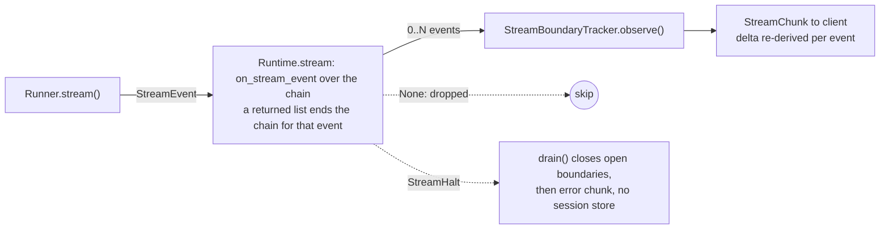

# #670: Streaming post-hooks never see tool-call events

`Runtime.stream` filters typed stream events before the post-hook chain, so only `TextDelta` and
`ReasoningDelta` reach `PostHook.on_stream_chunk` and the other ten event types — every tool call,
every message boundary — reach clients uninspected. This change adds one event-level callback that
every event passes through — able to return zero, one, or several events in place of the one it was
given — plus a `StreamHalt` exception a hook can raise to end a run, and moves the per-event work out
of `Runtime.stream`'s loop body into two small classes. Agent Kernel itself accumulates nothing: the
many-out return is what lets an application hold fragments and release a rewritten whole from its own
buffer (see Non-goals).

## Motivation

- `Runtime.stream`'s loop gates the hook chain on one `isinstance` test, `core/runtime.py:271`:
  `text = ev.content if isinstance(ev, (TextDelta, ReasoningDelta)) else None`.
  - The chain at `core/runtime.py:274-277` sits inside `if text is not None:` (`:273`), so for any
    other event type the hook loop is not entered at all.
  - `MessageEnd` also has no `content` field to pass — it is `type` + `message_id` only,
    `core/event.py:51-55`. The same holds for `MessageStart`, `ToolCallStart`, `ToolCallEnd`,
    `StepStart`, `StepEnd`, `ReasoningStart`, `ReasoningEnd`.
  - Net effect: 10 of the 12 members of the `StreamEvent` union (`core/event.py:131-148`) never reach
    any hook.
- The two payload-carrying events among those ten are the exposure the issue reports:
  - `ToolCallArgs.delta` — a raw JSON fragment, `core/event.py:69-72`.
  - `ToolCallResult.content` — a tool's return value, `core/event.py:81-86`.
  - `ToolCallResult` has a `content: str` field and is excluded by the tuple, not by its shape.
- **Those payloads arrive whole on the shipped adapters**, so event-level inspection is sufficient to
  redact them — no accumulation needed:
  - **Arguments, whole on three of four.** `framework/openai/openai.py:331-335` reads a complete
    `arguments` string off the finished call item and emits `ToolCallStart` + one `ToolCallArgs` +
    `ToolCallEnd` together; `framework/langgraph/langgraph.py:547-551` and
    `framework/adk/adk.py:394-398` do the same. Only `framework/pydanticai/pydanticai.py:353` emits
    incremental `args_delta` fragments.
  - **Results, whole on all four.** Exactly one `ToolCallResult` construction site per adapter, each
    fed by a framework completion event: `openai/openai.py:342` (a `tool_output` run item),
    `langgraph/langgraph.py:554` (`kind == "on_tool_end"`), `adk/adk.py:405` (one per entry of
    `event.get_function_responses()`, each with its own `call_id`), and
    `pydanticai/pydanticai.py:395` (a `function_tool_result` run event).
  - The `StreamEvent` union (`core/event.py:131-148`) has **no** partial-result member —
    `ToolCallArgs` exists because arguments can stream, but there is no `ToolCallResultDelta` — so the
    contract cannot express a partial result.
- The issue's own expected behaviour is event-level, not unit-level: post-hooks should be able to
  "see, modify, or drop events — matching text delta handling".
- The gap was a recorded deferral, not an oversight: `docs/specs/523-ag-ui-support/design.md:311`
  keeps the `str` signature so "a text-redaction hook must not begin receiving tool-call objects",
  and `:333-340` files closing it as "a contract wider than `(str) -> str | None` ... gets its own
  issue". This is that issue.
- There is no way for an application to close the gap itself:
  - A hook can accumulate text in `session.get_volatile_cache()`, but never learns when a message
    ended — `on_stream_chunk` (`core/hooks.py:73-85`) is never called for `MessageEnd`.
  - `on_stream_chunk` returns one `str` for the one `str` it was given, so text it drops cannot be
    released later.
  - Tool payloads are never passed to it in any form.
- There is also no way to stop a run in flight. Dropping a chunk does not stop generation; the model
  continues and the client receives a holed response.
- `Runtime.stream` at `core/runtime.py:270` is the **only** production caller of `Runner.stream`;
  every other call site is a test. One change therefore covers every streaming surface.

## Requirements

### Hook contract — `PostHook` (`core/hooks.py`)

- Add `PostHook.on_stream_event(session, requests, agent, event) -> StreamEvent | list[StreamEvent] | None`.
  - Default implementation returns `event` unchanged, so every existing hook is unaffected.
  - Called for **every** event yielded by `Runner.stream`, boundaries included. This is what gives a
    hook a completion signal: `MessageEnd`, `ToolCallEnd` and `ReasoningEnd` now reach it, so it can
    tell a finished unit from a fragment.
  - Return the same event to pass it, a modified event to rewrite it, `None` to drop it, or a **list**
    to emit several events in its place.
- The many-out return is the release half of hold-and-release, and it is why Agent Kernel needs no
  accumulation of its own.
  - A hook holds fragments by returning `None` and appending to `session.get_volatile_cache()`, then
    at the closing boundary returns `[<rewritten payload event>, <the boundary event>]`.
  - The volatile cache is the correct buffer home: per session, and cleared by the existing `finally`
    at `core/runtime.py:287-288`, so a buffer cannot outlive its run or leak across concurrent
    requests. A hook must not buffer on `self` — hook instances are process-wide
    (`core/runtime.py:59-64`).
  - This is the only route to rewriting text that spans fragments, and to rewriting Pydantic AI's
    incremental `args_delta`. The application owns the buffer, its size, and its policy.
- **A returned list ends the chain for that event.** A hook returning a single event hands it to the
  next hook, so rewriting hooks compose; a hook returning a list is emitting a final sequence, and the
  remaining hooks are skipped for that event.
  - This is what keeps dispatch a single pass. The alternative — every hook seeing every event an
    earlier hook produced — needs a nested loop, and buys composition of hold-and-release hooks that
    nothing needs today (the only system post-hook is the output guardrail, which does not implement
    this callback in this change).
  - It follows that `return event` and `return [event]` are **not** equivalent: the second skips the
    hooks after it. This is a real gotcha and must be stated in the callback's docstring and in
    `hooks.md`, not left for a reader to discover.
  - A hook returning a list owns the protocol correctness of what it emits; AK does not reorder or
    validate the sequence.
- **Only one thing is validated: a single returned event must keep the incoming `type`.**
  - Violation raises `TypeError` naming the hook, mirroring the post-hook return check `run()`
    already performs at `core/runtime.py:224-225`.
  - Why this check is needed: **accident detection on the rewrite path.** A single return means
    "the same event, rewritten in place", so a changed `type` is almost certainly a mistake in the
    hook; a deliberate type change is what the list form is for. Pydantic cannot catch it, because a
    `MessageEnd` returned for a `TextDelta` is still a valid `StreamEvent`.
  - It is **not** a transport-safety check. `StreamChunk.event` is a discriminated union
    (`core/event.py:131-148`), so it serialises and deserialises by its `type` tag: an event of the
    wrong type round-trips faithfully as that type. Nor could this check protect a broker topology
    anyway, since a returned list is deliberately unvalidated and may emit any type sequence.
  - Why nothing else is validated: a return that is not a `StreamEvent` at all is rejected by pydantic
    when `StreamChunk` is constructed. That is the established mechanism here —
    `docs/specs/523-ag-ui-support/spec.md:244-248` relies on it for a bare `str`, and
    `ak-py/tests/test_runtime_stream_events.py:177` is its test. Re-checking membership by hand would
    only relabel the error.
- **`on_stream_chunk` is deleted** from `PostHook` (`core/hooks.py:73-85`). `on_stream_event`
  replaces it outright; there is one streaming callback, not two.
  - The write-back the Runtime performs today (`core/runtime.py:280-281`, `model_copy` of the edited
    text back into the event) disappears with it: a hook rewriting text now returns the rewritten
    event directly, and `delta` is derived from that. The "`delta` and `event` never disagree" rule is
    then structural rather than something `Runtime` maintains.
  - Accepted consequence: a downstream hook that overrides `on_stream_chunk` keeps importing and
    constructing, and its method is simply never called — its filtering **silently stops working**.
    No `__init_subclass__` guard or deprecation warning is added; the removal is announced in the
    release notes and the migration is a rename plus a signature change.
  - Nothing in this repo overrides it outside `ak-py/tests/test_runtime_stream_events.py`.
- Add `StreamHalt(Exception)` carrying a `reason: str`.
  - Raising it from `on_stream_event` ends the run.
  - Lives in `core/hooks.py` beside `PostHook`, and is added to the existing hooks export at
    `core/__init__.py:47` so `from agentkernel import StreamHalt` resolves.

### Dispatch — inline in `Runtime.stream` (`core/runtime.py`)

- The hook chain runs **inline in `Runtime.stream`'s `async for` body**, not in a helper method and not
  in a class of its own.
  - It replaces the loop already inline there (`core/runtime.py:271-281`), so this is existing work
    widened rather than new machinery, and `Runtime.run` validates its post-hook returns inline in the
    same way (`core/runtime.py:221-226`).
  - No per-run state is needed: the hooks list, session, agent and requests are all fixed for the
    run. The only piece with mutable state is `StreamBoundaryTracker`, which stays a class.
  - The cost of inlining is added nesting inside an already-nested generator, accepted so the whole
    streaming flow reads in one place with one caller. `spec.md` states the resulting shape.
- **One pass per event**: `on_stream_event` over the chain, for every event. There is no second
  callback and no ordering question between two of them — the reason `on_stream_chunk` is deleted
  rather than kept alongside.
- A hook returning `None` drops the whole chunk, event included — unchanged from today's `continue`
  at `core/runtime.py:279`.
- When a hook returns a list, `Runtime.stream` yields one `StreamChunk` per event in order.
- A single returned event is carried into the next hook, so a hook re-emitting the event it was handed
  advances the loop rather than looping.
- Hook order stays `_get_system_post_hooks() + agent.post_hooks` (`core/runtime.py:268`).
- `StreamChunk.delta` is derived per emitted event, from the event the chain finally produced.
  - `delta` is populated only for `TextDelta`, unchanged. A hook that rewrites or releases a
    `TextDelta` therefore populates `delta` with the rewritten text, so plain-text consumers and
    `ThreadRecorder` record the redacted version.
  - Deriving it from the emitted event is what makes the "`delta` and `event` never disagree" rule of
    `docs/specs/523-ag-ui-support/spec.md:211` hold by construction: there is no separate text value
    that could drift from the event carrying it.
- Dropping a boundary event is **allowed**, and **not** logged.
  - Dropping a whole pair is a legitimate, ordinary use — hiding a reasoning block means returning
    `None` for `reasoning_start`, `reasoning_delta` and `reasoning_end` alike — so a warning would
    fire on every event of every run that uses such a hook.
  - The distinction that matters is balanced versus unbalanced, not payload versus boundary, and AK
    cannot tell one from the other without deciding what the application meant.
  - An unbalanced drop leaves the client with an unclosed pair. That is the application's problem;
    `Runtime` does not synthesise the missing close on the normal path. It does so only on the halt
    path, where the run is being cut short rather than shaped by a hook.

### Halt — `Runtime.stream` and `StreamBoundaryTracker` (`core/runtime.py`, not exported)

- `StreamHalt` propagates out of the hook loop to the enclosing `except`, which then, in order:
  1. emits a closing event for every boundary still open, innermost first;
  2. yields `StreamChunk(error=halt.reason, done=True)`;
  3. returns.
- The synthesised closing events **bypass the hook chain**.
  - A hook has already halted the run; re-entering the chain invites a second `StreamHalt` during
    teardown, and a hook dropping a synthesised close would defeat the reason for emitting it.
  - They are still observed by the tracker, so its state is empty when the error chunk is yielded.
- The session is **not** stored on a halt.
  - Matches the existing pre-hook halt, which yields an error chunk and returns at
    `core/runtime.py:262-263`, before the store at `core/runtime.py:285`.
- The volatile cache is still cleared by the existing `finally` at `core/runtime.py:287-288`.
- Nothing between the hook and the `except StreamHalt` may swallow it — no adapter, and no `try` inside
  the hook loop — or it never becomes a clean terminal chunk.
- `StreamBoundaryTracker` is the **only** new class, and the only piece holding mutable state.
  - `Runtime.stream` constructs it as a local, so it is per-run by construction and cannot be shared
    across concurrent requests. This matters because the hook instances themselves *are* shared —
    `Runtime._system_post_hooks` is a class-level cache built once per process
    (`core/runtime.py:59-64`).
  - Two methods: `observe(event)`, called for each event `Runtime.stream` actually emits, and
    `drain()`, called once on a halt, which returns the closes innermost-first and clears itself.
  - `Runtime.stream` has exactly one emission site, so calling `observe` there is not a footgun the
    design needs to engineer around.
  - It observes the events actually **emitted**, not the ones the runner yielded, so a hook that
    holds, drops or injects boundary events cannot desynchronise it.
  - Opens on `MessageStart`, `ReasoningStart`, `ToolCallStart`, `StepStart`; clears on the matching
    `MessageEnd`, `ReasoningEnd`, `ToolCallEnd`, `StepEnd`.
  - Steps are included even though **no shipped adapter emits them** — in `ak-py/src` there are zero
    `StepStart(`/`StepEnd(` construction sites outside `core/event.py`, though tests construct both
    (`tests/test_agui_mapping.py:57-58` and `:121-122`, `tests/test_stream_events.py:39-40`,
    `tests/test_runtime_stream_events.py:148`) — because `AGUIMapper` maps them to
    `StepStartedEvent`/`StepFinishedEvent` (`integration/agui/mapping.py:54-57`), so an unclosed step
    leaves an AG-UI client showing work in progress, and a bring-your-own runner may emit them.
  - Keyed on `(kind, id)`, where the id is `message_id`, `tool_call_id`, or a step's `name` — a single
    run can open several message ids, e.g.
    `framework/adk/adk.py:325-336` streams one partial message and can also emit one-shot
    start/delta/end triples, and `adk.py:345-348` closes with a post-loop safety net.
  - Holds ids only, never payload, so it needs no size bound.
- The reason string reaches the client verbatim; AK does not substitute its own refusal wording.
- **Only `StreamHalt` is caught. Every other exception propagates unchanged**, including the
  `TypeError` this design mandates and any ordinary bug in a hook.
  - No boundary drain, no terminal error chunk from `Runtime`; the existing `finally` still clears the
    volatile cache, and the session is not stored.
  - Each surface then handles it as it does today: `integration/agui/handler.py:272-275` catches
    `Exception` and emits `RunErrorEvent`, the thread SSE path emits an error frame
    (`integration/thread/thread_chat.py:170-172`), and queue mode retries to the configured
    `max_receive_count` before its permanent-failure path.
  - The asymmetry is deliberate: a halt is an orderly teardown a hook asked for, whereas an unexpected
    exception is a defect, and dressing it up as a clean end-of-stream would hide it.

### Runtime loop — `Runtime.stream` (`core/runtime.py`)

- The `async for` body becomes: run the chain over the event, then emit each surviving event —
  `observe` it on the tracker and yield its `StreamChunk`.
- The `async for` is wrapped in `try/except StreamHalt` inside the existing `with agent._activate()`
  block, so the existing `finally` still clears the volatile cache.
- The `text = ev.content if isinstance(...)` gate at `core/runtime.py:271`, the `on_stream_chunk` loop
  at `:273-279` and the `model_copy` write-back at `:280-281` are all deleted outright, not relocated.
- No new coupling and no new module: `StreamBoundaryTracker` sits in `core/runtime.py` beside its
  only consumer, and no module in `core/` gains a dependency outside `core/`.
- No change to the pre-hook path, `_prepare_requests`, or the non-streaming `run()`.

### Tests

- `ak-py/tests/test_runtime_stream_events.py` — `RecordingHook` (`:71-85`) overrides the removed
  `on_stream_chunk` and is rewritten against `on_stream_event`, along with the four tests that use it
  (`:114`, `:127`, `:142`, `:159`).
- New coverage this change needs: a hook returning a list produces N chunks in order and the hooks
  after it are skipped; a returned event of a different `type` raises `TypeError`; a return that is
  not an event at all fails as a pydantic `ValidationError` at `StreamChunk` construction (the
  mechanism `test_a_str_yielding_runner_now_fails_loudly` already relies on, not a hand-rolled check);
  `StreamHalt` closes open boundaries then yields one error chunk and stores no session; and the
  no-op case yields the same event sequence as today.

### Documented assumptions

- **One `ToolCallResult` per `tool_call_id` is an assumption, not an enforced invariant.**
  - True of all four shipped adapters and unrepresentable in the event union (see Motivation), but
    nothing in `Runtime.stream`, `StreamChunk` or the event model rejects a second `ToolCallResult`
    reusing a `tool_call_id`, and `Runner` is public — a bring-your-own runner could emit one.
  - The docs must state that a hook relying on a whole tool result relies on this, and that a hook
    which must be robust against a custom runner should accumulate by `tool_call_id` rather than
    assume one-shot.
  - This change does **not** add validation for it. Enforcing event-sequence well-formedness is a
    broader contract question than #670, and rejecting a runner's events mid-stream would turn a
    third-party adapter bug into a failed run.
- **Tool events are observations, not gates.** Adapters emit `ToolCall*` after the framework has
  already made the call, so a hook halting on one prevents disclosure of the result, never execution
  of the tool.

### Surfaces verified to need no change

- **AG-UI**: `integration/agui/handler.py:264-265` reads `chunk.error` and `:277-279` emits
  `RunErrorEvent` for it, so a halt already terminates an AG-UI run correctly.
- **AG-UI mapping**: `integration/agui/mapping.py:39-66` is a stateless one-to-one `match` on
  `event.type`, so a rewritten event of the same `type` maps identically.
- **Thread recording**: `integration/thread/thread_chat.py:160-168` sets `error_seen` on an error
  chunk and records only `if not error_seen and deltas`, so a halted run persists no assistant
  message.
- **Queue mode**: `pipeline/agent_runner.py`'s `StreamAgentRunner` fans out each chunk, error chunks
  included.

### Behavioural changes

- **Breaking: `PostHook.on_stream_chunk` is removed.** A downstream hook overriding it stops being
  called, without an import error or a warning. This is a 0.x breaking change, announced in the
  release notes; migration is a rename to `on_stream_event` plus taking a `StreamEvent` instead of a
  `str` and returning an event instead of a `str`.
- Ten event types now reach the post-hook chain. `ak-py/tests/test_runtime_stream_events.py:142-155`
  (`test_non_text_events_skip_the_hook_chain`) asserts the opposite and is reversed by this change.
- The Runtime-side write-back at `core/runtime.py:280-281` is deleted; a hook rewriting text returns
  the rewritten event instead.
- A run can now terminate before `MessageEnd`/`done=True` when a hook raises `StreamHalt`; clients
  must treat the partial response as invalid and discard it rather than render it as truncated.
- No change to `StreamChunk`'s fields (`core/model.py:186-189`), to `StreamEvent`, to any adapter, to
  pre-hooks, or to the non-streaming `run()` path.

### Documentation

- Retire the two claims that no hook can see tool payloads:
  - `docs/docs/integrations/hooks.md:236-243` — the "Tool-call payloads are not filtered" warning.
  - `docs/docs/integrations/agui.md:179-182` — the matching note.
- Rewrite, not reword, every example of the removed method — each currently shows an API that no
  longer exists:
  - `docs/docs/integrations/hooks.md:210-234` (the `TokenRedactionHook` example) and
    `ak-py/src/agentkernel/skills/ak-add-capabilities/SKILL.md:588-592`.
- Update the text-only descriptions of the streaming hook contract:
  - `docs/docs/core-concepts/runtime.md:56`, `docs/docs/core-concepts/runner.md:139`,
    `docs/docs/core-concepts/overview.md:181`.
  - `docs/docs/architecture/overview.md:240-266` and
    `docs/docs/architecture/execution-flow.md:174-182` — both contain sequence diagrams naming
    `PostHook.on_stream_chunk()`.
- Update the dev skills that would otherwise present the deleted API as current:
  - `.agents/skills/ak-dev-architecture/SKILL.md` at `:98`, `:240` and `:1000`.
  - `.agents/skills/ak-dev-new-framework-integration/SKILL.md:197` — states that `Runtime.stream()`
    runs each event through `PostHook.on_stream_chunk()`.
  - `.agents/skills/ak-dev-testing-conventions/SKILL.md:41` and `:188` — describe
    `test_runtime_stream_events.py`'s current contract, including that only `TextDelta`/`ReasoningDelta`
    reach the hooks, which this change reverses.
- Add a migration note for the removal: old signature, new signature, and that a stale override is
  silently inert.
- State the list-ends-the-chain rule and that `return event` and `return [event]` therefore differ,
  in `docs/docs/integrations/hooks.md` and in the callback's own docstring.
- Replace the removed method's example slot in `docs/docs/integrations/hooks.md` with **four**
  examples, ordered by cost so most readers stop at the first:
  1. **Redact a `ToolCallResult`** — three lines, no buffering, no `v_cache`. This is the case #670
     actually reports, and it needs no ceremony.
  2. **Hold and release** — return `None` per `TextDelta`, then `[TextDelta(redacted), MessageEnd]` at
     the close. Teaches the mechanism, and states plainly that incremental delivery is gone for held
     text.
  3. **Bounded lookahead** — hold only the last N-1 characters, emit the scrubbed prefix as it
     arrives, flush the tail at the close. The practical variant; must state that a pattern longer
     than the window slips through, so the window is sized to the caller's longest pattern.
  4. **`StreamHalt`** — refuse rather than redact, and the fact that it costs no latency because it
     acts on a fragment.
  - Examples 2 and 3 must show `session.get_volatile_cache()` as the buffer home and warn that
    hook instances are process-wide, so `self` is not.
- State in the docs that AK stream events are observations of what the framework already did: a hook
  halting on a tool call prevents its result being **disclosed**, not the tool being **executed**.
- State that the built-in guardrail providers do not implement the new callback, with a pointer to
  the follow-up issue, so the capability is not read as protection that is already wired.

## Delivery

Two PRs, stacked. They are **review units, not release units** — both ship in one AK release, and the
split exists so the API change is reviewable without an example app in the diff. `plan.md` carries the
step ordering inside each; this section only fixes the boundary.

- **PR 1 — `feat: event-level streaming post-hooks (#670)`**, on
  `bugfix/670-streaming-post-hooks-tool-events` off `develop`.
  - `core/hooks.py` (add `on_stream_event` and `StreamHalt`, delete `on_stream_chunk`),
    `core/runtime.py` (`StreamBoundaryTracker`, the inline hook loop, the halt path, deletion of the
    old gate and write-back), the `core/__init__.py:47` export.
  - Tests: `RecordingHook` and its four users rewritten, plus the new cases above.
  - The whole documentation and skills sweep, including the four `hooks.md` examples and the
    migration note.
- **PR 2 — `docs: streaming hook example (#670)`**, branched from PR 1's branch and targeting it, so
  GitHub retargets it to `develop` when PR 1 merges. Merge order is PR 1 then PR 2.
  - A new runnable example at `examples/api/hooks-streaming`, following the layout of
    `examples/api/hooks` (`app.py`, `hooks.py`, `app_test.py`, `build.sh`, `README.md`).
  - **It must be a new example, not an extension of `examples/api/hooks`.** That example runs
    non-streaming and its `DisclaimerHook` (`examples/api/hooks/hooks.py:159`) implements `on_run`,
    which `stream()` never calls — the separate follow-up issue. Switching it to
    `execution.mode: stream` would silently disable its own demonstration.

## Non-goals

- **Agent Kernel accumulates nothing.** No buffering stage in the Runtime, no `on_stream_unit`, no
  unit subscription, no buffer ceiling, no new config.
  - Applications that need to rewrite a whole unit implement hold-and-release themselves, using the
    many-out return and the volatile cache. AK supplies the mechanism, the application supplies the
    buffer and the policy.
  - Consequence, to be documented: holding fragments back removes incremental delivery for whatever
    is held, and the memory cost of the buffer is the application's to bound.
  - A Runtime-owned buffering stage — with unit subscription and a size ceiling — remains a possible
    follow-up if hand-rolling the pattern proves a repeated burden. It is not needed for capability,
    only for convenience.
- **`PostHook.on_run` on streamed runs.** `stream()` has never called it — the pre-AG-UI loop did not
  either (`63c46697`, PR #326) — so this is a separate, older gap and gets its own issue.
- **Streaming implementations for the three built-in guardrail providers.** Separate issue. When it
  is written, those providers must keep wrapping their external service and must not embed rule lists
  in AK.
- No change to pre-hooks, to `run()`, or to any framework adapter.

## Open questions

Settled during review:

- **`StreamHalt.reason` is a plain `str`.** It matches the existing pre-hook halt and
  `StreamChunk.error`, so no surface changes shape. Structured detail — Anthropic's
  `stop_details` carries a category and an explanation — would mean changing `StreamChunk`, and can be
  added later if a client needs to branch on the reason.
- **The callback is named `on_stream_event`, and `on_stream_chunk` is removed.** One streaming
  callback, no delegation shim, and no method that exists but is never called. `StreamChunk` is an
  existing class (`core/model.py:175-189`), so reusing that name for a method receiving a
  `StreamEvent` would misdescribe its own parameter permanently. The cost is accepted: a stale
  override goes silently inert rather than raising.
- **The return type stays a union** — a bare event, a list, or `None`. Forcing `return [event]` on the
  pass-through case, which is the overwhelming majority, buys uniformity that is not worth the noise.
- **`StreamBoundaryTracker` lives in `core/runtime.py`**, unexported, beside its only consumer.
  *Revised after the design was approved: an earlier decision put it in a new `core/stream.py`.* The
  deciding precedent is `core/chat_service.py`, which holds `ChatService`, `RequestBuilder`,
  `AgentHandler` and `ResponseBuilder` — this package groups collaborating classes by the flow they
  serve rather than splitting each into its own module, and `Runtime` plus its boundary bookkeeping is
  that same pattern. It also removes an import rather than adding one. `core/hooks.py` was rejected as
  the hook contract file, which the tracker is not part of; `core/event.py` was the runner-up on
  cohesion grounds but is currently pure models.
- **A hook may drop a boundary event, and AK neither warns nor compensates.** Dropping a balanced pair
  is an ordinary use — hiding a reasoning block drops its start and end too — so refusing it would
  force clients to render empty blocks, and warning on it would fire every run. An unbalanced drop
  leaves an unclosed pair on the client, and that is the application's problem.

Nothing outstanding — the design is settled and ready for `spec.md`.
