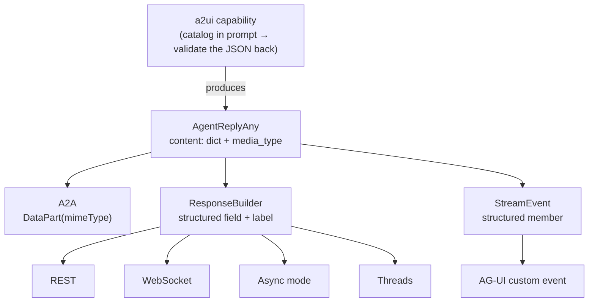

# #706: A2UI support — one payload capability, structured carriage on every surface

A2UI is a payload format, not a transport, so this is two things: a capability that teaches an agent
to produce validated A2UI JSON, and the ability for AK's existing surfaces to carry a *structured*
reply instead of `str()`-ing it. The carriage half contains no A2UI code and is useful to every
current `AgentReplyAny` user; A2UI is then one payload riding it, identified by a media type the
surfaces carry but never interpret.

Supporting research: [`research/README.md`](research/README.md) (payload/carriage framing, per-surface
gap analysis), [`research/changes.md`](research/changes.md) (file-by-file), and the protocol survey at
[`../523-ag-ui-support/research/a2ui.md`](../523-ag-ui-support/research/a2ui.md).

Every `path:line` below is verified against `develop` at `497973d0`. Paths are relative to
`ak-py/src/agentkernel/` unless stated otherwise. Two facts are marked **unverified** where they
appear, both third-party SDK symbol names.

## Motivation

- **An AK agent can only reply with text at the surfaces.** An application wanting a form, a table or
  a chart must build bespoke rendering per agent and parse prose to drive it.
- **Every mechanism the payload half needs already exists**, built for other reasons:
  - Per-capability config block with an `agents` filter — `core/config.py:758` (`_SandboxConfig`),
    `:845` (`_AGUIConfig`).
  - System-prompt injection — `SystemToolFactory.get_system_prompt_suffix` (`core/tool.py:224`),
    built from `get_all` (`:179`).
  - Reply post-processing — `PostHook.on_run` (`core/hooks.py:72`).
  - A structured reply type — `AgentReplyAny(content: dict)` (`core/model.py:129`).
  - Optional-dependency gating — the extras pattern (`ak-py/pyproject.toml:88`, `:167`).
- **Structured replies already reach all six adapters**, so A2UI needs no adapter work and no
  streaming: `framework/openai/openai.py:215`, `framework/langgraph/langgraph.py:424`,
  `framework/pydanticai/pydanticai.py:178`, `framework/smolagents/smolagents.py:176`,
  `framework/adk/adk.py:262`, `framework/crewai/crewai.py:388,390`. (Full paths deliberately: every
  one of those basenames also names an 8-line re-export shim at the package root.) AG-UI reaches
  four (only those four declare `supports_streaming`).
- **The surfaces are what is missing, and they fail differently:**
  - `ResponseBuilder.build_response` emits `{"result": str(result)}` for every reply type including
    `AgentReplyAny` (`core/chat_service.py:317`). It is the only such site across `api/`,
    `pipeline/` and `integration/agui/` — but **not** the only one in the codebase; see the next
    bullet.
  - **`AgentService.run(prompt) -> str` stringifies the reply itself** (`core/service.py:156`:
    `result = str(result)` for an `AgentReplyAny`). This is the second stringify site, it sits
    *below* the surfaces, and it is what the direct-execution surfaces consume: A2A
    (`api/a2a/a2a.py:63`), MCP (`api/mcp/akmcp.py:43`) and the CLI (`cli/cli.py:119`) all call
    `run`, not `run_multi`. So those three never receive a typed reply at all, which is a
    precondition for PR 3 rather than a detail of it.
  - It is also shared. REST (`chat_service.py:587,605`), conversation threads
    (`integration/thread/thread_chat.py:123,128`) and the queue pipeline
    (`pipeline/agent_runner.py:44` → the same `ChatService.process_chat_request`) all route through
    it, and the pipeline's dict leaves over WebSocket as a dict already
    (`pipeline/ws/base.py:108` takes `message: dict`). One change covers four surfaces.
  - A2A hardcodes `new_agent_text_message(str(response), ...)` (`api/a2a/a2a.py:49`). There is no
    `DataPart` path, so the wrapping A2UI actually specifies is unreachable. JSON-as-a-string does
    not substitute: an A2UI-aware A2A client does not recognise a text message.
  - The A2A agent card already advertises `default_output_modes=["json"]`
    (`core/builder.py:44`) while the executor sends only text — **the card is inaccurate today.**
  - No member of the `StreamEvent` union (`core/event.py:131`, twelve members) can carry a dict;
    every one carries text and ids.
- **`AgentReplyAny` cannot say what kind of payload it holds.** A transport cannot emit
  `application/json+a2ui` unless the reply names the format, so without this each surface must guess
  or import A2UI to sniff the dict — which is the opinion this design exists to avoid.

## Requirements

### Ordering and dependencies

- Delivered as **five PRs**, in this order. Each lands independently and is useful on its own.
- **PRs 1–3 contain no A2UI code.** They are structured-reply carriage. If a change in them only
  makes sense for A2UI, it belongs in PR 4 instead — this is the test that the split is real.
- **Which PRs A2UI actually motivates**, stated because it changes how the work can be filed:
  - **PR 3 is an A2A correctness fix, not A2UI work.** All four defects it addresses exist today
    with no A2UI anywhere: the agent card advertises `default_output_modes=["json"]`
    (`core/builder.py:44`) while the executor only ever sends text, so the card misleads any client
    that reads it; an agent configured for structured output — which
    `examples/api/openai_structured/` already does — delivers its JSON crammed into a text part when
    the A2A spec has `DataPart` for exactly that; `AgentService.run` stringifies the reply before
    A2A can see it (`core/service.py:156`); and A2A publishes no cards and no routes at all, in
    silence, when the serving process holds no agents. Exactly **one** line of PR 3 is A2UI-specific
    — adding the A2UI media type to the card's output modes — and the rest **must not** be gated
    behind `a2ui.enabled`.
  - **PR 2 also stands alone.** A REST caller using structured output today receives a JSON string
    it has to double-parse; that is a pre-existing wart, not an A2UI need.
  - **PR 1 is the only one A2UI motivates.** Without a payload format to name, `media_type` has no
    user. It is the enabling abstraction, not a standalone fix.
  - Consequence: **PRs 2 and 3 could each be filed as their own issue** and merge ahead of #706,
    unblocked by any of its open questions. Whether to split them is a maintainer decision — see
    Open questions.
- **#678 (streaming post-hooks) is merged** — `497973d0`, now the tip of `develop`. PR 5's
  dependency is satisfied and the API below is code, not a plan:
  - `PostHook.on_stream_chunk` is **gone**. `PostHook.on_stream_event(session, requests, agent,
    event) -> StreamEvent | list[StreamEvent] | None` (`core/hooks.py:94`) replaces it, called for
    every event including boundaries. Returning a list emits several events in place of one — the
    release half of hold-and-release. A returned list ends the hook chain for that event, so
    `return event` and `return [event]` are **not** equivalent.
  - `StreamHalt(reason)` (`core/hooks.py:20`) ends a streamed run; `Runtime.stream` closes any open
    boundary via `StreamBoundaryTracker` (`core/runtime.py:39`) and does not store the session.
  - `Runtime.stream` is now at `core/runtime.py:300`, its terminal chunk at `:365`.
  - **It did not touch `core/event.py`.** The `StreamEvent` union still has its original twelve
    members, so PR 5 still has to add the structured one — that gap is unchanged.
  - It records **`PostHook.on_run` on streamed runs as a non-goal** with its own issue, so PR 5 must
    not take that route.
- **#696 (HITL) is still open** — design only, `f0bd330f`, untouched since 2026-09-03. The
  requirements below assume its design; re-check this summary if that head moves:
  - `AgentReplyPaused` as a *subclass* of `AgentReplyAny` (the `AgentReply` union at
    `core/model.py:126` is unchanged), a `RunPaused` member added to the `StreamEvent` union, and
    `ResponseBuilder.build_response` reopened to express a third outcome.
- PRs 1–4 have no hard dependency on #696. **PR 5's blocker is cleared.**

### PR 1 — the reply carries its media type

- Add an optional media-type field to `AgentReplyAny` (`core/model.py:129`), typed `str | None`,
  defaulted `None`.
  - Naming decision: `media_type` (RFC 6838 term), matching the MIME parlance every consumer uses.
- `from_output` (`core/model.py:146`) accepts and passes it through, defaulted `None`.
- **`__str__` (`core/model.py:142`) is not touched.** It serialises `content` only, so every existing
  string consumer sees byte-identical output. This is testable and must have a regression test.
- **Semantics, stated so no surface invents its own:**
  - Written only by whoever produces the payload. Never inferred, never sniffed from the dict.
  - **AK never parses it.** Not validated against a registry, not a routing key.
  - It is **not** the discriminator for what kind of reply this is — that is `type`, which #696 uses
    for `"paused"`. The two are orthogonal axes: `type` says what outcome this is, `media_type` says
    what format `content` is in.
  - A surface that must emit something when it is unset falls back to `application/json`.
- All six adapter construction sites keep calling `from_output`/`AgentReplyAny(...)` unchanged and
  leave it `None`. `AgentReplyPaused` (#696) inherits it, defaulted, and nothing sets it there.

### PR 2 — the response builder carries structured content

- `ResponseBuilder.build_response` (`core/chat_service.py:317`) emits the structured content when the
  reply is an `AgentReplyAny`, plus the media type when set.
  - **Additive only.** `"result": str(result)` stays exactly as it is; existing clients keep reading
    it. A client that knows nothing of this change sees no difference.
  - The new field name is a permanent public REST contract — see Open questions.
- Rebase onto #696, which reopens the same function for the `PAUSED` outcome. By then it already
  branches on the reply rather than only stringifying, so this is one more branch.
  - A paused reply is an `AgentReplyAny` subclass, so it will also match this branch. State
    explicitly whether the structured field is emitted for it, or suppressed in favour of #696's
    `interruptions` — see Open questions.
- **No WebSocket-, async- or thread-specific change.** All three reach this function (Motivation),
  and the pipeline's dict is already a dict on the WebSocket frame.

### PR 3 — A2A data parts

**This PR fixes A2A; it is not A2UI work.** Every defect below is present today with no A2UI
involved, and the fixes are correct for A2A on their own terms — A2UI merely needs them to have
happened. Only the media-type entry on the agent card is A2UI-specific. See Ordering and
dependencies for why that matters to how this is filed.

- **First, the executor must actually receive a typed reply.** `A2A.Executor._execute_agent`
  (`api/a2a/a2a.py:63`) calls `AgentService.run(prompt=...)`, which returns a `str` — it has already
  stringified an `AgentReplyAny` at `core/service.py:156`. The `str(response)` at `a2a.py:49` is
  therefore a second no-op, and branching on reply type is impossible until this changes.
  - Switch it to `run_multi([AgentRequestText(prompt=prompt)])` (`core/service.py:162`), which
    returns the typed `AgentReply`.
  - **This stays inside `AgentService`** — one method over in the same class. A2A does *not* move to
    `ChatService`: the architecture rubric puts stateful, self-managing clients (CLI, A2A, MCP) on
    `AgentService`, A2A already owns its own request envelope and async task model, and routing it
    through `ChatService` would additionally subject A2A callers to the `schedule` interception and
    HTTP-shaped responses. Rerouting A2A's execution path is not in this issue.
  - `_execute_agent`'s return annotation tightens from `Any` to `AgentReply`.
- `A2A.Executor.execute` (`api/a2a/a2a.py:49`) then branches on the reply type instead of always
  calling `new_agent_text_message(str(response), ...)`:
  - `AgentReplyAny` → a message carrying a data part with `response.content`, labelled with
    `media_type` when set and `application/json` otherwise.
  - Every other reply type keeps the current text path, byte-for-byte.
  - The error path (`a2a.py:54`) stays text.
- `A2ACardBuilder.build` (`core/builder.py:38-48`) is the single place every agent card is built, so
  there is no per-adapter work. Add the A2UI media type to `default_output_modes` when the capability
  is enabled; the existing `"json"` entry (`:44`) becomes accurate rather than aspirational.
- **Behavioural change, to be stated in the PR, not discovered:** this changes A2A wire output for
  *all* structured replies, not only A2UI. That is the intended unopinionated outcome.
- **MCP and the CLI are deliberately left alone.** Both hit the same `AgentService.run` stringify
  (`akmcp.py:43`, `cli.py:119`), so both would need the identical one-line switch to `run_multi` to
  carry a structured reply. Out of scope here — recorded so the next person does not re-derive it.
  A text-only CLI is arguably correct anyway; MCP is a real gap and should get its own issue.
- **A2A serves nothing, silently, when the process holds no agents — warn instead of staying mute.**
  A2A executes in whichever process serves its routes, bypassing the queue pipeline entirely. In a
  split (broker) deployment the IO container registers no agents —
  `examples/k8s/openai-queue-mode/app_io_handler.py` is just `IOHandler.run()`, while
  `app_agent_runner.py` loads the module — so `A2A._build()` (`api/a2a/a2a.py:66`) iterates an empty
  registry and publishes no cards and no routes at all, with `a2a.enabled: true` and no error, no
  warning, and nothing in the log.
  - **This is the most severe of the four defects, and the reason it belongs here.** The other three
    send a client *wrong* data, which is at least visible; this one sends nothing while the config
    says the surface is on. Diagnosing it requires reading `_build()`.
  - Fix: when A2A is enabled and `Runtime.current().agents()` is empty, log a warning naming the
    cause. `_build()` is reached only through `get_cards`/`get_card`/`get_agent_names`
    (`a2a.py:90,95,100`), all of which pass the `_built` cache, so this is warn-once with no extra
    machinery, and the disabled path returns before it (`a2a.py:69-70`) so it cannot misfire.
  - **A warning, not a raise.** An `AKConfigError` would be a behavioural change that could break an
    app whose construction order differs, and the condition is not unrecoverable — only invisible.
    Turning a silent no-op into a diagnosable one is the whole requirement.
  - Still **out of scope**, deliberately: (a) rerouting A2A through the queue — that is the
    `ChatService` change argued against above; (b) the `_built` cache itself, which caches
    permanently so agents registered after the first `_build()` never appear. Fixing (b) properly
    needs `Runtime.register` to notify A2A, i.e. `core/` reaching into `api/` — the wrong coupling
    direction. The warning surfaces that sharp edge without inverting the dependency.
  - Also out of scope, because it is a deployment question rather than a code one: whether a split
    deployment's IO container *should* load the module. Doing so makes A2A work but runs those agents
    in-process, skipping the pipeline. Document the trade-off; do not choose it here.
- The exact `a2a-sdk` symbols (`DataPart`, `Part`, whether a `new_agent_parts_message` helper exists)
  are **unverified** — neither package was installed when this was written. Check against the pinned
  `a2a-sdk>=0.3.6` (`ak-py/pyproject.toml:167`) before `spec.md`.

### PR 4 — the `a2ui` capability

- New top-level package `ak-py/src/agentkernel/a2ui/`, shaped like `sandbox/` and `schedule/`:
  a capability, not an integration, because it mounts no surface of its own.
  - `catalog.py` — load component catalogs, build the prompt section.
  - `hooks.py` — `A2UIPostHook(PostHook)` plus `A2UIPostHookFactory.get()`, copying
    `SandboxPreHookFactory` (`sandbox/hooks.py:134-149`): the real hook when enabled, a no-op
    otherwise, and a no-op on any initialisation failure — the hook chain must never break the
    runtime.
- Coupling: `core/` reaches `a2ui/` **only lazily, inside enabled-checks** — the sandbox/schedule
  precedent already used at `core/tool.py:179` and `core/runtime.py:130`. Nothing in `a2ui/` imports
  `framework/`, `integration/`, `deployment/` or `api/`.
- Config: new `_A2UIConfig` beside `_SandboxConfig` (`core/config.py:758`), registered on `AKConfig`.
  - `enabled: bool = False` — inert when off: no tools, no prompt text, no imports.
  - `agents: Optional[list[str]] = None` — the standard per-capability filter, honoured through
    `SystemToolFactory._agent_allowed`.
  - Catalog settings — shape depends on Open questions.
- **Prompt injection needs one small core change.** `get_system_prompt_suffix` joins
  `SystemTool.description` strings (`core/tool.py:243`), so a prompt is only reachable by hanging it
  on a tool, and an A2UI catalog has no tool.
  - Add a prompt-contributor path alongside `get_all`, so the suffix is tool descriptions *plus*
    registered prompt-only contributions.
  - Rejected alternative: registering a description-only `SystemTool` whose `func` is never bound.
    There is precedent (the sandbox carries a whole prompt section on one tool), but the type says
    "tool" and it is not one — and `ToolBuilder.bind()` derives names from `func.__name__`, so a
    dummy function is a live footgun.
- `Runtime._get_system_post_hooks` (`core/runtime.py:126`) returns the literal
  `[OutputGuardrailFactory.get()]` (`:130`); add `A2UIPostHookFactory.get()`. The pre-hook line
  above (`:122`) already chains three factories, so this is the established shape.
- New `a2ui` extra in `ak-py/pyproject.toml`, near `agui` (`:88`).
- **Hook behaviour must be specified, not left to the implementation:**
  - Valid payload → an `AgentReplyAny` with `content` set to the parsed payload and `media_type` set.
  - Invalid payload → see Open questions. Whatever is chosen, the hook must never raise into the
    runtime.
  - Reply types other than the model's structured/text output pass through untouched.

### PR 5 — AG-UI

- Add a **structured member to the `StreamEvent` union** (`core/event.py:131`) able to carry a dict
  plus its media type.
  - It must honour the union's stated invariant that no field carries a framework-native object.
  - #696's `RunPaused` establishes that adding a member is a normal move, not a new pattern.
- Delivery uses `PostHook.on_stream_event` (`core/hooks.py:94`, merged in #678) with **no further
  Runtime change**: the A2UI hook returns `None` per `TextDelta` while accumulating in the session's
  volatile cache, then at the closing boundary returns `[<structured event>, <the boundary event>]`.
  - Because a returned list ends the chain for that event, the A2UI hook must be positioned aware
    that hooks after it will not see the released pair. It is a system post-hook, so it runs first
    (`core/runtime.py:337`) — state this in `spec.md` rather than leaving it to be discovered.
  - The buffer lives in the volatile cache, never on `self` — hook instances are process-wide
    (`core/runtime.py:126-131`).
- `AGUIMapper.to_agui` (`integration/agui/mapping.py`) gains one case above its `case _` fallback
  (`:64`), mapping the structured event onto AG-UI's custom event, whose `value` field is structured.
  - The `ag_ui.core` custom-event symbol is **unverified** — check against the pinned
    `ag-ui-protocol` before `spec.md`.
- **Not in scope here:** running `PostHook.on_run` on a streamed run. #678 files that as its own
  issue; PR 5 must not implement it as a side effect.

### Verification

- Unit tests per PR, in `ak-py/tests/`, following `ak-dev-testing-conventions`.
  - PR 1's load-bearing test is the **regression**: `str(AgentReplyAny(...))` unchanged.
  - PR 3 needs a new `test_a2a_*.py` — no A2A test file exists today. See **Why CI missed all four**
    below for what it must assert and why the existing example cannot.
  - PR 4 covers: valid parse, invalid payload, disabled → no-op hook, `agents` filter honoured,
    prompt suffix contains the catalog.
  - PR 5 extends `test_agui_mapping.py`, plus `test_runtime_stream_events.py` and `test_stream_boundaries.py` (both from #678).
- **One cross-surface parity test** (new): one structured reply, asserted to arrive with the same
  dict and label on REST, WebSocket, A2A and AG-UI. Nothing like it exists. This is what makes the
  unopinionated claim checkable rather than asserted, and it is what catches a future surface
  silently regressing to `str()`.
- Examples, reusing what exists rather than adding a frontend:
  - PRs 1–2 → extend `examples/api/openai_structured/`, which already returns a structured reply
    through a `PostHook` over REST.
  - PR 4 → new backend-only `examples/api/a2ui/`, no frontend. This is the example that demonstrates
    A2UI arriving over plain REST with no UI framework involved.
  - PR 5 → extend `examples/api/agui/`, whose React frontend already has an event reducer and
    `node --test` unit tests. Do not build a second frontend.

### Why CI missed all four A2A defects

`examples/api/a2a/multi` **is** in CI — `test-reusable.yaml` runs the `e2e` tier on every PR and
`.github/test-config.yaml:107-108` lists it. It runs, passes, and is structurally blind to every
defect PR 3 fixes. Each blindness is a specific, fixable omission, and the new tests should aim at
these rather than re-cover what `a2a_test.py` already does:

- **No structured output anywhere in the example.** `examples/api/a2a/multi/server.py` builds three
  plain agents (two OpenAI, one smolagents) with no `output_type`, so the reply is always
  `AgentReplyText` and the text path — the one that has always worked — is the only path exercised.
  This alone hides two defects: the missing `DataPart` branch, and `AgentService.run`'s stringify.
- **The client only ever reads text.** `examples/api/a2a/multi/client.py:53` returns
  `…parts[0].root.text` — hardcoded, not type-checked. A `DataPart` would raise `AttributeError`
  there rather than fail an assertion, so the client cannot express the difference it is supposed to
  detect.
- **Nothing reads the card's output modes.** `A2ACardResolver` fetches the card only to construct
  the client. No assertion compares `default_output_modes` against what actually arrives, which is
  the one-line test that would have caught the inaccurate card immediately.
- **Single-process, in the order that happens to work.**
  `examples/api/a2a/multi/server.py:28-29` load the modules at import, then `:32` calls
  `RESTAPI.run()`, so the registry is full before `A2A._build()` runs. The
  empty-registry defect needs a process serving A2A routes *without* agents, and **no example
  combines A2A with queue mode at all** — the queue-mode examples do not enable A2A, and the A2A
  example is not queue mode.

Three of the four are the same shape: the happy path with the one reply type that already worked.

#### Unit tests PR 3 must add (`ak-py/tests/test_a2a_executor.py`)

- **Reply branches**: an `AgentReplyAny` produces a data part carrying the dict, labelled from
  `media_type`, and `application/json` when it is unset; an `AgentReplyText` produces the current
  text part unchanged (regression); the error path stays text.
- **Card/executor parity** — the assertion nobody wrote: what the card advertises in
  `default_output_modes` is what the executor actually emits, asserted together in one test so the
  two cannot drift again.
- **The typed-reply precondition**: `_execute_agent` returns an `AgentReply`, not a `str`. Paired
  with a regression that `AgentService.run` itself still returns `str` — it is public API and other
  callers depend on that.
- **Empty registry**: `a2a.enabled` true with no agents registered logs exactly one warning
  (`caplog`), and `get_cards()`/`get_agent_names()` return empty rather than raising.
  - **Test hygiene requirement:** `A2A` caches on class attributes (`_built`, `_cards`,
    `_executors`), so cases must reset them in a fixture. Without it the first test to build poisons
    every later one — the same trap `ThreadRunner.shutdown_event` documents.

#### Example changes PR 3 should make

- Add one structured agent (`output_type`) to `examples/api/a2a/multi/server.py`, so the example
  exercises a reply type that is not text.
- Change `client.py` to branch on the part type instead of assuming `.text`. This is the important
  one: it turns the client from something that hides the defect into something that would catch it,
  and it doubles as the **migration example** for the declared behavioural change — any existing
  A2A client reading `parts[0].root.text` breaks when its agent uses structured output, and this is
  what the fix looks like.
- Do **not** add an A2A-plus-queue-mode example for the empty-registry case. The unit test covers it,
  and building that deployment would enshrine a combination the design explicitly does not endorse.

## Non-goals

- **Running `PostHook.on_run` on streamed runs.** #678's own non-goal, with its own issue.
- **Streaming *partial* A2UI.** The capability parses a whole payload at a boundary; A2UI's
  incremental parse-and-heal is not implemented, though #678's hold-and-release is the mechanism a
  later change would use.
- **A2UI for HITL pauses.** A pause is produced by the framework interrupting a tool call, not
  authored by the model, so this capability's prompt-and-parse loop does not apply. A deterministic
  interruption-to-form renderer would mean AK deciding what an approval card looks like — the exact
  opinion this design avoids — and #696 already maps interruptions onto AG-UI's native `Interrupt`.
  One narrow case survives (an agent that itself writes the form it is asking a human to fill in) and
  is raised in Open questions rather than built here.
- **A frontend, or an A2UI renderer of any kind.** The client owns its component catalog; that is the
  protocol's premise.
- **Changing `StreamChunk.delta`, `AgentReply` union membership, or any framework adapter.**
- **Guardrail inspection of A2UI payloads.** Output guardrails see the reply as they do today; no
  A2UI-aware guardrail behaviour is added.

## Open questions

1. **REST field name (PR 2).** The key carrying the structured content is a permanent public
   contract. `data`? `content`? `structured`? Decide deliberately, once.
2. **Structured field on a paused reply (PR 2 × #696).** `AgentReplyPaused` subclasses
   `AgentReplyAny`, so it matches the same branch. Emit the structured field for it, or suppress it
   in favour of #696's `interruptions`? Emitting duplicates the same facts in two shapes; suppressing
   means the branch is not purely type-driven.
3. **Catalog ownership (PR 4).** Does AK bundle a starter catalog, require the application to supply
   one, or only pass one through? This is the difference between a small capability and an ongoing
   maintenance surface.
4. **Invalid payload behaviour (PR 4).** When the model returns something that is not valid A2UI:
   fail loud (an error reply), or degrade to the text reply the model produced? Degrading is friendly
   and hides a broken agent; failing is honest and turns a model slip into a user-visible error.
5. **Render-only, or interactive (PR 4)?** A2UI defines actions and callbacks from the rendered UI
   back to the agent. Render-only is a defensible v1 but must be *stated* — a UI with dead buttons is
   worse than no UI.
6. **Version pin (PR 4).** A2UI was v0.9.1 with 1.0 a release candidate at the time of the #523
   survey. Pin, or wait for 1.0? Re-check what is current.
7. **A2A behaviour change (PR 3).** Confirm the maintainers accept that A2A output changes for all
   structured replies, not only A2UI.
8. **Coordination with #696 on `PausedInterruption.payload`.** That field is in #696's design with
   **no stated meaning**. If it is defined as an agent- or author-supplied payload describing the
   interruption (plus a label saying how to read it), the one surviving HITL case above is served
   with no new field — a LangGraph node calling `interrupt({...})` with an A2UI dict needs none of
   this capability. If it is instead defined as a framework hint blob, that use is closed off by
   convention. **The ask is to settle its meaning while #696 is still design-only**, not to reserve
   anything for this issue; the field itself could be added later cheaply either way.
9. **Split PRs 2 and 3 into their own issues?** Both fix pre-existing structured-output gaps and
   neither needs anything from #706 (see Ordering and dependencies). Filing them separately lets
   them merge without waiting on questions 1–6, and keeps this issue honestly scoped to the A2UI
   capability plus PR 1. Against: three issues to track instead of one, and the carriage work then
   has no single place stating why it is shaped the way it is. Maintainer's call.
