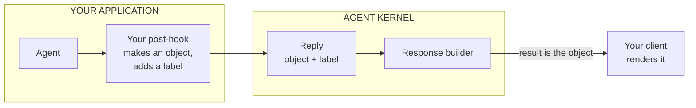

# #706: structured replies carry their format, end to end

An agent can already answer with a JSON object instead of a sentence. Today that object is turned
into text too early, so by the time it reaches a client it is a string that has to be parsed twice
and carries no clue what it is. This change lets a reply say *what format its content is in*, and
lets each exit point pass the object through as an object. A2UI then works without a single line of
A2UI code in Agent Kernel.

Supporting research: [`research/README.md`](research/README.md),
[`research/changes.md`](research/changes.md), and the protocol survey at
[`../523-ag-ui-support/research/a2ui.md`](../523-ag-ui-support/research/a2ui.md).

Code facts verified against `develop` at `80936df9` (v0.9.2); paths are relative to `ak-py/src/agentkernel/`.

**Two words used throughout.** A **surface** is a way a client reaches an agent — the REST route, the
WebSocket gateway, A2A, MCP, the CLI. A **payload** is a structured reply's `content`: a plain dict,
whatever it happens to mean.

---

## 1. What A2UI is, in one minute

A2UI is Google's open format for an agent that wants to answer with *an interface* rather than a
paragraph. The agent emits JSON describing components — a Card, a Text, a Button — and the client
draws them using its own pre-approved widgets. The agent never sends HTML or JavaScript, so a
confused model cannot execute anything on someone's device.

```json
{ "root": { "type": "Card", "children": [
    { "type": "Text",   "text": "Refund $250 for order 4471?" },
    { "type": "Button", "label": "Approve", "action": "approve" } ] } }
```

The important part for this design: **A2UI says nothing about how that JSON travels.** Its own docs
say over REST, WebSockets, A2A, AG-UI, whatever you want. So "supporting A2UI" is not a transport
problem. It is a question of whether a JSON object survives the journey out of Agent Kernel intact.

Today it does not.

## 2. The problem, in real bytes

Agents already produce these objects. All six framework adapters build an `AgentReplyAny`
(`core/model.py:134`) when the agent is configured for structured output — this is a shipped feature
with existing users, not something new.

Every exit point then encodes it **early**. Here is what a client actually receives from the REST
route today:

```json
{"result": "{\"root\": {\"type\": \"Card\", \"children\": [ ... ]}}"}
```

Look at the quoting. `result` is a **string**, and that string's contents happen to be JSON. The
payload has been encoded twice: `str()` on a structured reply runs `json.dumps(content)`
(`core/model.py:147`), and then the whole response dict is serialised again on its way out. A client
must call `json.loads` on the body, then `json.loads` again on `result`.

What it should receive:

```json
{"result": {"root": {"type": "Card", "children": [{"type": "Text", "text": "Refund $250 for order 4471?"}]}},
 "media_type": "application/json+a2ui"}
```

`result` is the object. One parse. And `media_type` says what the object is.

### Why this is a fix, not an addition

The tempting move is to leave `result` alone and add a second field beside it. That is the wrong
shape, for four reasons.

**1. `result` already means "the agent's reply".** For a text agent it *is* the reply. For a
structured agent it is the reply *re-encoded as text* — a different thing wearing the same name.
Fixing what the name means is the change; adding a second name preserves the confusion and asks every
client to choose between two fields holding the same value.

**2. The encoding loses type information for no gain.** Both ends already speak JSON. The framework
serialises a dict into a string, the surface serialises that string again, and the client undoes
both. Nothing is gained by the round trip, and `42`, `"42"` and a JSON document all arrive
indistinguishable inside a text field.

**3. Carrying both inflates every response by about 85%.** Measured on a realistic 200-row form
payload:

| Response shape | Body size |
|---|---|
| today — `result` as a string | 70.5 KB |
| duplicated — `result` + `data` | **130.4 KB** |
| object only — `result` as an object | **59.9 KB** |

Note the third row: dropping the escaping makes responses *smaller* than today. Duplication instead
spends roughly half the remaining headroom under the 256 KB SQS message ceiling — a ceiling the chat
pipeline never checks (verified: no size handling in `pipeline/` or `core/chat_service.py`; the only
limit in the repo is the sandbox broker's). Past it the send fails, the input message is retried to
exhaustion, and the caller is told `"Failed to process message after N retries"` — which names
neither the cause nor the fix.

**4. The two fields would not even agree.** `result` is built by `__str__`, i.e.
`json.dumps(content, default=str)`; `data` would be handed to the surface's own encoder. They treat
anything that is not a plain JSON type differently:

```text
content = {"submitted_at": datetime(2026, 9, 22, 14, 30), "amount": Decimal("250.00")}

result  ->  {"submitted_at": "2026-09-22 14:30:00", "amount": "250.00"}   # str(), so both strings
data    ->  {"submitted_at": "2026-09-22T14:30:00", "amount": 250.0}      # ISO 8601, and a number
```

Two fields, one value, two answers — and a client's behaviour then depends on which it read. That is
a correctness bug, not a tidiness argument.

It is a **breaking change** for clients of structured agents. Decision 3 states the terms.

> **This is not "don't send a string".** Of course the wire is text — an HTTP body is always a
> string. The problem is encoding the payload into a string *before* building the response, so it
> ends up nested inside another encoding as an opaque field.

Three surfaces lose it, and only the first is about encoding at all:

| Surface | What goes wrong | Where |
|---|---|---|
| REST · WebSocket · async · threads | **Double-encoded** — the object becomes a string field | `core/chat_service.py:317` |
| A2A | **Wrong wire type** — the protocol has a *data part* for structured content; AK always sends a *text part*. An A2A client library hands you a dict for one and a string for the other, so this is a protocol-level loss, not an encoding one | `api/a2a/a2a.py:49` |
| Streaming / AG-UI | **No representation exists** — no member of the stream-event union can hold a dict, in any encoding | `core/event.py:131` |

One layer below all of that, `AgentService.run` (`core/service.py:156`) also encodes to text, which
is why A2A, MCP and the CLI never even receive a typed reply to re-encode.

## 3. What we are doing

**The rule.** Agent Kernel moves the data. The application decides what the data means.

Anything that needs Agent Kernel to *understand* A2UI — a list of components, a schema, a validator —
is the application's job, not the framework's.

### In scope, and not

| Surface | Carries structure after this? | |
|---|---|---|
| REST | **yes** | one shared function |
| WebSocket | **yes** | same function |
| Async mode | **yes** | same function |
| Conversation threads | **yes** | same function |
| Streaming / AG-UI | **yes** | needs the new stream event |
| A2A | **yes** | needs its broken dependency pin fixed first — see piece 4 |
| MCP | **yes** | one-line fix, pending one unverified assumption — see piece 4 |

A2A and MCP lose structure one layer lower than the rest, in `AgentService.run`, so they need their
own small change; piece 4 covers it. The CLI is not listed: it is a local REPL for testing and first
steps, and printing text is what it is for.

### The four things we change

**1. The reply type gets one new field.** `media_type`, saying what format its content is in.
Optional, unset by default, and nothing is forced to use it.

**2. The REST response puts the object in `result`** instead of a string containing the object.
WebSocket, async mode and conversation threads come along for free — all four already go through the
same function.

**3. Streaming gets an event that can hold an object.** Today no stream event type can, so a payload
cannot travel mid-stream at all.

**4. A2A and MCP stop flattening one layer lower.** Both call `AgentService.run`, which turns the
reply into text before either of them sees it. A small change each — plus fixing A2A's dependency
pin, which is broken today for reasons of its own.

That is the whole framework change. Everything else in this document explains why, or what happens
around it.

### What we do not build

The A2UI part. No component list, no parser, no validation rules, no config flag, no dependency on
the A2UI SDK.

The application writes a short post-hook that turns its agent's reply into an object and labels it —
about ten lines, shown in §5. We ship one runnable example containing exactly that, so nobody starts
from a blank file.



### Two things that follow

**Pieces 1 and 2 stand on their own.** Anyone returning structured data over REST today is
double-parsing it, and this fixes that whether or not A2UI ever appears.

**How we will know the rule held.** After the work, search the framework for "a2ui". Every hit should
be in the example or its tests, and none in `core/`, `api/` or `pipeline/`. A hit inside the
framework means the format leaked into the plumbing, and the design failed on its own terms.

One more thing left out, which the table above does not cover: **buttons that call back into the
agent**. That is the same problem #696's resume path solves — reuse it when it lands rather than
inventing a second mechanism. See Non-goals.

## 4. A conversation, end to end

Prose and UI interleave freely. That is the behaviour to hold in mind, because it is what rules
several designs out.

**Turn 1 — nothing to draw.**

> **User:** hi

The model answers `Hello! How can I help?`. The hook sees text that is not a payload and returns it
untouched. The client receives:

```json
{"result": "Hello! How can I help?"}
```

`result` is a plain string, so the client renders an ordinary chat bubble. **Most turns look like this** — which
is why a reply with no UI in it must never be treated as a failure.

**Turn 2 — the agent answers with a form.**

> **User:** I need to file an expense

The model emits an A2UI payload. The hook labels it. The client receives:

```json
{"result": {"root": {"type": "Card", "children": [
    {"type": "Select",     "label": "Cost centre", "options": ["ENG-4", "OPS-1"]},
    {"type": "DatePicker", "label": "Date"},
    {"type": "Number",     "label": "Amount"},
    {"type": "Button",     "label": "Submit", "action": "submit"}]}},
 "media_type": "application/json+a2ui"}
```

`result` is an object this time. The client recognises the media type, reads `result`, and draws a
real form from its own components.

**Turn 3 — the user submits.**

The user fills the form and presses Submit. The client turns the values into **an ordinary next
message**:

```json
{"prompt": "Cost centre ENG-4, 20 September, $250", "session_id": "s-91"}
```

That is the entire round trip, and nothing in Agent Kernel is involved in it. This is why
render-only (Non-goals) is far less limiting than it sounds: a rendered form already round-trips
today, through the chat route that already exists.

What render-only does cost: the agent receives prose, not a typed submission bound to the form it
sent, so the client chooses the phrasing — and a button cannot invoke a tool directly.

**Turn 4 — back to prose.**

> **Agent:** Filed. Reference EXP-1182.

Passed through untouched. An ordinary bubble again.

## 5. How the agent knows, and what an application writes

This is the whole A2UI story on the application's side. Nothing here is an Agent Kernel feature —
agent instructions, `output_type` and post-hooks are all existing extension points.

### How the agent learns the format

There is no magic: the agent knows because the application told it. Two routes, and the choice
changes how much the hook has to do.

| Route | How the agent knows | If the model misbehaves | The hook does |
|---|---|---|---|
| **Prompt** | The catalog is rendered into the agent's instructions. This is what the reference A2UI SDK produces — its agent-side job is essentially generating that prompt text. | It can drift or emit malformed JSON | Parse, validate, decide the failure policy, label |
| **`output_type`** | The application hands the framework a schema and the model is constrained to fill it in | Cannot happen — the shape is enforced | Label only |

`output_type` is already supported on all six adapters and is where `AgentReplyAny` comes from
today. Constraining *every* reply to A2UI would force a greeting to come back as a Text component,
so the practical form is a union — text or UI — which keeps the interleaving in §4 while still
enforcing the shape:

```python
agent = Agent(name="expenses", instructions=..., output_type=TextReply | UIReply)
```

**Recommended: the union.** It removes malformed payloads as a category, which is the messiest thing
the prompt route leaves the application to handle. The trade-off to know about: upstream A2UI
tooling — its catalogs and few-shot examples — assumes prompt-shaped output, so the union route
diverges from it.

### The code

**Teach the model the format** — ordinary agent configuration:

```python
agent = Agent(
    name="expenses",
    instructions=f"{MY_INSTRUCTIONS}\n\n{my_catalog.prompt_section()}",
)
```

**Handle what comes back** — one post-hook. On the prompt route it parses; on the `output_type`
route the reply is already structured and the hook only labels it:

```python
class A2UIPostHook(PostHook):
    """Label the model's structured reply as A2UI. Entirely application code."""

    async def on_run(self, session, requests, agent, agent_reply):
        if not isinstance(agent_reply, AgentReplyAny):
            return agent_reply          # ordinary prose — leave it alone
        return agent_reply.model_copy(
            update={"media_type": "application/json+a2ui"}
        )

    def name(self) -> str:
        return "a2ui"


OpenAIModule([agent]).post_hook(agent, [A2UIPostHook()])
```

That last line is the whole wiring. It sits beside the module the application already builds, so no
framework config surface is needed to reach it.

**Why the catalog cannot live in Agent Kernel.** A catalog has to match the components the
application's frontend actually implements. One listing components the frontend cannot draw is worse
than useless — the model will emit them confidently and nothing will render. Agent Kernel does not
know what a given frontend can draw, so any catalog it shipped would be wrong. Once the catalog is
the application's, the prompt built from it and the hook checking against it follow.

Agent Kernel's contribution is the framework pieces below, plus **one runnable example** containing
exactly the code above, showing the payload arriving over plain REST with no UI framework involved.

## 6. What changes in the framework

### Piece 1 — a reply can say what format it is in

- `AgentReplyAny` gains one optional field, defaulted to unset, naming the media type of `content`.
- `__str__` (`core/model.py:147`) is **unchanged**, so every existing string consumer sees
  byte-identical output.
- Framework adapters are untouched; they keep constructing replies without it.

### Piece 2 — REST, WebSocket, async mode and threads

One change to the shared response builder, which all four already route through. For an
`AgentReplyAny`, `result` carries `content` as an object rather than `str(reply)`, and `media_type`
rides beside it when set. Text and image replies are untouched, and so is the
`"Non textual result received"` fallback.

- **This is the breaking change** (Decision 3). No second field, no duplication, no opt-in switch —
  the bug is fixed rather than shipped alongside its own workaround.
- `__str__` itself does not change. The builder simply stops calling it for structured replies.

### Piece 3 — streaming and AG-UI

The union has twelve members today and not one can hold a dict, so this is the only part of the
framework change that is not a handful of lines.

**The new class**, following the existing members' shape in `core/event.py`:

```python
class DataMessage(StreamEventBase):
    """A complete structured payload emitted inside the assistant's message.

    `content` is a plain JSON-compatible dict and `media_type` names its format, or is
    unset when the producer did not say. Agent Kernel never interprets either.
    """

    type: Literal["data_message"] = "data_message"
    message_id: str
    content: dict
    media_type: str | None = None
```

- **`message_id`** ties it to the surrounding message, exactly as `TextDelta` and `MessageEnd` do.
  It is emitted inside the message, immediately before `MessageEnd`.
- **`content` and `media_type` mirror the reply type** from piece 1, so the same pair travels whether
  a run streamed or not.
- **Named for `a2a.helpers.new_data_message`**, which is the same concept on the other surface
  carrying this payload. The alternative, `DataDelta`, was rejected: it is not a fragment, and the
  name would invite someone to stream partial payloads, which Non-goals rules out.

**This widens an invariant that `core/event.py` states out loud**, and the docstring must be updated
in the same change rather than left contradicting the code:

> No field carries a framework-native object. Every field is a `str`, `int` or `bool`, so an event
> stays picklable and JSON-serialisable no matter which framework produced it.

A plain dict of JSON-compatible values still satisfies the *reason* for that rule — picklable,
JSON-serialisable, no framework object — but not its current wording. Amend it to name dict as
allowed and keep the framework-native prohibition, which is the part that matters. (#696's
`RunPaused` needs the same widening for its interruption list, so this is coming either way.)

**Delivery needs no Runtime change.** `PostHook.on_stream_event` (`core/hooks.py:94`) already exists:
the application's hook returns `None` for each `TextDelta` while accumulating, then at the closing
boundary returns `[DataMessage(...), MessageEnd(...)]` — the list form that emits several events in
place of one.

**AG-UI mapping.** `AGUIMapper.to_agui` gains one `case "data_message"` above its `case _` fallback,
producing AG-UI's custom event with `media_type` as the name and `content` as the value. Unmapped
types already return `None`, so an AG-UI client on an older mapper degrades rather than breaks.

### Piece 4 — A2A and MCP

Both lose the reply lower down than the response builder: `AgentService.run` (`core/service.py:156`)
turns it into text before either surface sees it. The fixes are small. A2A has one blocker that has
to clear first.

**A2A is broken on a fresh install today, and this issue ports it forward rather than pinning it
back.** `ak-py/pyproject.toml` pins `a2a-sdk[http-server]>=0.3.6` with **no upper bound**. The
current release is 1.1.5, and against it three of Agent Kernel's imports do not resolve at all —
`new_agent_text_message`, `ServerError`, and `RESTAdapter`, whose module no longer exists. CI stays
green only because the example's lockfile pins 0.3.6, so nothing exercises what a new user installs.

Capping at `<0.4` was considered and rejected. The 0.x line is finished at 0.3.26, and — decisively —
**1.x already has the exact primitive this design needs**:

```python
a2a.helpers.new_data_message(data, media_type=None, context_id=None, task_id=None) -> Message
```

A dict, a media type, a context id, a task id. On 0.3.x the same thing means hand-assembling parts
against an API with no such helper, and then rewriting it at the eventual port. That is the work
done twice.

The rest of the migration is mapped, not guessed:

| Broken import | 1.x replacement |
|---|---|
| `a2a.utils.new_agent_text_message` | `a2a.helpers.new_message` |
| `a2a.server.apps.rest.rest_adapter.RESTAdapter` | `a2a.server.routes` — `add_a2a_routes_to_fastapi`, `create_rest_routes` |
| `a2a.utils.errors.ServerError` | moved; `request_handlers.build_error_response` is the 1.x shape |

`add_a2a_routes_to_fastapi` is also a better fit than what `A2ARESTRequestHandler` does today, which
is copy routes off a `RESTAdapter` into its own `APIRouter` by hand.

The new pin is **`>=1.1,<2`**. Bounded, because unbounded is what caused this.

**Ordering is a requirement here, not a preference: tests first.** A2A has **no test file at all**
today. Porting an untested integration across a major version *and* changing its wire behaviour in
one step is how silent breakage ships. So:

1. **Write `ak-py/tests/test_a2a_*.py` against the current 0.3.6 behaviour**, pinning what "working"
   means: a text reply produces a text message, the error path stays text, the card carries what it
   carries, the expected routes exist.
2. **Port to 1.x.** Those tests still pass — adapted to the new part model where the assertion must
   be, but with the same observable behaviour for text replies.
3. **Then add the structured branch**, below.

**A2A: sending the object, on top of the port — roughly ten lines.**

- `_execute_agent` (`api/a2a/a2a.py:63`) calls `run_multi([AgentRequestText(prompt=...)])` instead of
  `run(prompt)`, so the executor receives an `AgentReply` rather than a string. Its return annotation
  tightens from `Any`.
- `execute` (`api/a2a/a2a.py:49`) branches: an `AgentReplyAny` becomes
  `new_data_message(reply.content, media_type=reply.media_type, ...)`; every other reply type goes
  through `new_message` exactly as before, and the error path stays text.
- The agent card already advertises `default_output_modes: ["json"]` (`core/builder.py:44`) while the
  executor only ever sends text. This makes an existing claim true rather than adding a new one.
- Also fixed, since it is part of the same brokenness: with A2A enabled and **no agents registered in
  the serving process**, it publishes no cards and no routes, with no error and nothing in the log.
  Log a warning naming the cause. Reached only through the cached `_build()`, so it warns once.
- **Not verified:** the symbols and signatures above were read from an installed a2a-sdk 1.1.5, but
  Agent Kernel has not been run against it. The port is mapped, not proven, and step 1 above exists
  precisely because of that gap.
- **Behavioural change to declare, not discover:** A2A output changes for *all* structured replies,
  not only A2UI. A client reading `parts[0].root.text` breaks the day its agent returns structured
  output. Needs a changelog entry and a migration note.

**MCP: sending the object — two changed lines.** The executor (`api/mcp/akmcp.py:39-45`) makes the
same `run` → `run_multi` switch and returns the content dict for a structured reply:

```python
 async def execute(self, session_id: str, prompt: str, ctx: Context) -> Any:
     service = AgentService()
     await ctx.info(f"Executing agent '{self.agent_name}' ...")
     service.select(session_id, self.agent_name)
-    response = await service.run(prompt=prompt)
+    reply = await service.run_multi([AgentRequestText(prompt=prompt)])
+    response = reply.content if isinstance(reply, AgentReplyAny) else str(reply)
     await ctx.debug(f"Agent response '{response}'")
     return response
```

The `-> Any` annotation, the `ctx` logging and the return statement are all untouched; a text reply
still produces exactly the string it does today.

**Verified** against the pinned fastmcp (3.4.7, inside `>=3.2.0,<4.0.0`), by registering tools on a
real `FastMCP` instance and calling them through its in-memory client:

| Tool returns | `structuredContent` |
|---|---|
| a JSON **string** — today's behaviour | **absent** |
| a **dict**, annotated `-> Any` — the executor's current annotation | **the dict** |
| a **dict**, annotated `-> dict` | the dict |

Two things follow. The `-> Any` annotation is not an obstacle, so no signature change is needed. And
fastmcp emits a `TextContent` block **alongside** the structured content in every case, so a client
reading only text blocks keeps working — MCP carries both by protocol, which is why the duplication
argument from §2 does not apply here.

- The renderer caveat stands: an MCP caller is a *model*, so this only becomes **useful** once a host
  app renders A2UI. It is included anyway because the inconsistency — one surface preserving
  structure while its neighbour silently flattens it — is worse than the missing feature.

### And what Agent Kernel deliberately never does

These are requirements, not reassurance. Each one is checkable.

- **Never parses, validates or interprets a payload.** The media type is carried, not understood. No
  registry, no schema check, no format-specific branch in any surface.
- **Ships no component catalog, no format SDK dependency, and no format-specific config block.**
- **Does not decide what happens when a payload is malformed.** That is the application's post-hook,
  because it is the application's format.
- **An unset media type stays unset.** No surface invents a default; one that cannot express an
  absent label omits it rather than guessing.
- **The media type is not a routing key and not a reply discriminator.** `type` says what kind of
  outcome a reply is; the media type says what format its content is in. Two different questions.
- The payoff: an application shipping *its own* format — not A2UI at all — travels exactly the same
  way, with no change to Agent Kernel and no awareness in any surface.

## 7. Verification

- **One cross-surface parity test.** A single structured reply, asserted to arrive with the same dict
  and the same label on REST, WebSocket, A2A and AG-UI. Nothing like it exists today. This is what
  makes the claim in §3 checkable rather than asserted, and what catches a future surface quietly
  regressing to an early encode.
- **One regression test** proving `str(AgentReplyAny(...))` is byte-identical to today.
- Per-surface unit tests for pieces 2 to 4; the example's own test suite covers the A2UI hook.

## 8. What this lands next to

**Nothing blocks this work.** Listed so a reviewer knows what it shares a neighbourhood with.

- **#678 (streaming post-hooks) — merged.** `PostHook.on_stream_event` exists and is what the
  streaming change uses. It did **not** add a structured event member, so that gap is still this
  design's to close. A fact, not a dependency.
- **#696 (HITL) — open, design only.** A **file collision, not a dependency**: both it and this edit
  `build_response`. Whichever lands second rebases onto the first. Neither needs anything from the
  other. Its `AgentReplyPaused` subclasses `AgentReplyAny`, so if both land, a paused reply goes
  through the same branch — a consequence, covered by Decision 4.
- **a2a-sdk 1.x** — the port is *in* this issue (piece 4), not deferred. Listed here only because it
  is the one part whose size is estimated rather than known.

## 9. Non-goals

- **Shipping A2UI inside Agent Kernel.** No config block, no extra, no bundled catalog, no
  validation. See Decision 1 for the trade-off this accepts.
- **A frontend or renderer of any kind.** The client owns its components; that is the protocol's own
  premise.
  - This is also the test for whether a surface is worth teaching to carry a payload at all: **only
    when something at the far end can draw it, and Agent Kernel is never that thing.** REST,
    WebSocket and AG-UI pass — a real client sits there. A2A passes when the calling agent fronts a
    UI for a human, which is why the protocol names a data part as its canonical wrapping. MCP is
    borderline: the caller is a model, so it depends on the host app choosing to render. The CLI
    fails outright — Agent Kernel would have to be the renderer.
- **Streaming a partial payload.** The structured event carries a whole payload; incremental
  parse-and-heal is an application concern if anyone wants it.
- **A callback path from a rendered UI back to the agent.** Same problem as HITL's resume path;
  reuse that when it lands.
- **Changing `__str__`, the `AgentReply` union, or any framework adapter.**
- **Teaching the CLI to carry structured replies.** Out for good, not deferred: it is a local REPL
  for testing and first steps, and Agent Kernel would have to be the renderer.

## 10. Decisions

| # | Decision | Trade-off accepted |
|---|---|---|
| 1 | **Agent Kernel delivers payloads; it never opens them.** The framework gains a media type and surfaces that pass the object through; A2UI itself lives in an application post-hook plus an example. | Someone hoping to flip a config flag and have A2UI work does not get that. In exchange the framework does not own a pre-1.0 protocol's version churn, catalog semantics or validation policy — and any other payload format is supported from day one, free. |
| 2 | **The media type is carried, never interpreted.** | Agent Kernel cannot reject a mislabelled payload. That is the point; the alternative is the framework knowing formats. |
| 3 | **`result` carries the object for a structured reply — a breaking change, taken rather than worked around.** No second field beside it. | Clients of structured agents must stop calling `json.loads` on `result`. Accepted because: Agent Kernel is 0.9.2, pre-1.0; the route declares no `response_model`, so nothing regenerates or fails to compile; the affected clients are *already* parsing, so migration is deleting one line; and the alternative — carrying the payload twice — doubles every response against a 256 KB SQS ceiling the chat pipeline does not check. Needs a changelog entry and a migration note, and should land with a minor or 1.0 rather than quietly. |
| 4 | **A paused reply (#696) goes through the same branch**, since it subclasses `AgentReplyAny` — so its `result` becomes an object too. | A pause's typed fields then appear both in `result` and in `interruptions`. Accepted: the branch stays type-driven, with no subclass special case to rot, and #696's own rule makes a pause's `content` a faithful view of those fields rather than a drifting copy. |
| 5 | **Ask #696 to state what `PausedInterruption.payload` means** while it is still design-only. | None — it is a comment on another issue. If that field acquires a meaning by accident, an agent-authored payload on a pause is closed off by convention rather than by design. |

| 6 | **Port A2A to `a2a-sdk >=1.1,<2` in this issue, tests first — do not cap at `<0.4`.** | This issue absorbs an SDK migration, which is real scope and the one estimate here that is not firm. Taken because 0.3 is a finished line, and because 1.x ships `new_data_message(data, media_type, …)` — precisely this design's payload. Capping would mean writing the part assembly by hand against an API lacking that helper, then discarding it at the port. The mitigation is ordering: A2A's first-ever tests are written against 0.3.6 behaviour *before* anything moves. |

**Open for the reviewer.** Does this answer #706 as written? It answers "can an Agent Kernel agent
serve A2UI to a client" with yes, and "does Agent Kernel contain A2UI" with no. If the issue intends
the second, its title and scope need revisiting rather than this design quietly redefining them.
