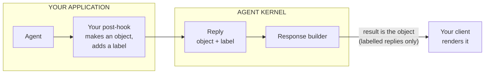

# #706: structured replies carry their format, end to end

An agent can already answer with a JSON object instead of a sentence. Today that object is turned
into text too early, so by the time it reaches a client it is a string that has to be parsed twice
and carries no clue what it is. This change lets a reply say *what format its content is in* — and
**when it says so, every exit point passes the object through as an object.** A reply that says
nothing is serialised exactly as it is today, so nothing an existing user relies on moves. A2UI then
works without a single line of A2UI code in Agent Kernel.

Supporting research: [`research/README.md`](research/README.md),
[`research/changes.md`](research/changes.md), and the protocol survey at
[`../523-ag-ui-support/research/a2ui.md`](../523-ag-ui-support/research/a2ui.md).

Code facts verified against `develop` at `80936df9` (v0.9.2); paths are relative to `ak-py/src/agentkernel/`.

*A note on length.* A Stage-1 design is normally point-form requirements, with worked detail held
back for `spec.md`. This one deliberately carries more — a conversation walkthrough, the application
code, a class definition, a per-surface consequence list — because that detail is what made the design
reviewable rather than merely assertable. It moves to `spec.md` when Stage 2 starts.

**Two words used throughout.** A **surface** is a way a client reaches an agent — the REST route, the
WebSocket gateway, A2A, MCP, the CLI. A **payload** is a structured reply's `content`: a plain dict,
whatever it happens to mean.

---

## 1. What A2UI is, in one minute

A2UI is Google's open format for an agent that wants to answer with *an interface* rather than a
paragraph. The agent emits JSON describing components — a Card, a Text, a Button — and the client
draws them using its own pre-approved widgets. The agent never sends HTML or JavaScript, so a
confused model cannot execute anything on someone's device.

```json
{ "root": { "type": "Card", "children": [
    { "type": "Text",   "text": "Refund $250 for order 4471?" },
    { "type": "Button", "label": "Approve", "action": "approve" } ] } }
```

The important part for this design: **A2UI says nothing about how that JSON travels.** Its own docs
say over REST, WebSockets, A2A, AG-UI, whatever you want. So "supporting A2UI" is not a transport
problem. It is a question of whether a JSON object survives the journey out of Agent Kernel intact.

Today it does not.

## 2. The problem, in real bytes

Agents already produce these objects. All six framework adapters build an `AgentReplyAny`
(`core/model.py:134`) when the agent is configured for structured output — this is a shipped feature
with existing users, not something new.

Every exit point then encodes it **early**. Here is what a client actually receives from the REST
route today:

```json
{"result": "{\"root\": {\"type\": \"Card\", \"children\": [ ... ]}}"}
```

Look at the quoting. `result` is a **string**, and that string's contents happen to be JSON. The
payload has been encoded twice: `str()` on a structured reply runs `json.dumps(content)`
(`core/model.py:147`), and then the whole response dict is serialised again on its way out. A client
must call `json.loads` on the body, then `json.loads` again on `result`.

What it should receive, **when the agent labelled its payload**:

```json
{"result": {"root": {"type": "Card", "children": [{"type": "Text", "text": "Refund $250 for order 4471?"}]}},
 "media_type": "application/json+a2ui"}
```

`result` is the object. One parse. And `media_type` says what the object is.

**The label is the switch, and that is the whole contract.** A reply with no `media_type` is
serialised exactly as it is today — string in `result`, byte for byte:

```json
{"result": "{\"name\": \"Ada\", \"email\": \"ada@example.com\"}"}
```

So `result` is `string | object`, discriminated by whether a media type is present. Nobody who has
not opted in sees any change: not a text agent, not an agent already using structured output, not
the deferred-schedule acknowledgement (`core/chat_service.py:496` builds an `AgentReplyAny` with no
media type, which is what keeps that contract stable).

### Why one field, switched by the label — and not a second field

The obvious alternative is to leave `result` alone and add a second field beside it, carrying the
object for everyone. That is the wrong shape, for four reasons — all of which are about the *second
field*, and none of which the gated single field runs into.

**1. `result` already means "the agent's reply".** For a text agent it *is* the reply. For a
structured agent it is the reply *re-encoded as text* — a different thing wearing the same name.
Fixing what the name means is the change; adding a second name preserves the confusion and asks every
client to choose between two fields holding the same value.

**2. The encoding loses type information for no gain.** Both ends already speak JSON. The framework
serialises a dict into a string, the surface serialises that string again, and the client undoes
both. Nothing is gained by the round trip, and `42`, `"42"` and a JSON document all arrive
indistinguishable inside a text field.

**3. Carrying both inflates every response by about 85%.** Measured on a realistic 200-row form
payload:

| Response shape | Body size |
|---|---|
| today — `result` as a string | 70.5 KB |
| duplicated — `result` + `data` | **130.4 KB** |
| object only — `result` as an object | **59.9 KB** |

Note the third row: dropping the escaping makes responses *smaller* than today. Duplication instead
spends roughly half the remaining headroom under the 256 KB SQS message ceiling — a ceiling the chat
pipeline never checks (verified: no size handling in `pipeline/` or `core/chat_service.py`; the only
limit in the repo is the sandbox broker's). Past it the send fails, the input message is retried to
exhaustion, and the caller is told `"Failed to process message after N retries"` — which names
neither the cause nor the fix.

**4. The two fields would not even agree.** `result` is built by `__str__`, i.e.
`json.dumps(content, default=str)`; `data` would be handed to the surface's own encoder. They treat
anything that is not a plain JSON type differently:

```text
content = {"submitted_at": datetime(2026, 9, 22, 14, 30), "amount": Decimal("250.00")}

result  ->  {"submitted_at": "2026-09-22 14:30:00", "amount": "250.00"}   # str(), so both strings
data    ->  {"submitted_at": "2026-09-22T14:30:00", "amount": 250.0}      # ISO 8601, and a number
```

Two fields, one value, two answers — and a client's behaviour then depends on which it read. That is
a correctness bug, not a tidiness argument.

None of those four objections applies to the design above, because there is no second field and
nothing changes for an unlabelled reply. Decision 3 records the contract.

> **This is not "don't send a string".** Of course the wire is text — an HTTP body is always a
> string. The problem is encoding the payload into a string *before* building the response, so it
> ends up nested inside another encoding as an opaque field.

Three surfaces lose it, and only the first is about encoding at all:

| Surface | What goes wrong | Where |
|---|---|---|
| REST · WebSocket · async · threads | **Double-encoded** — the object becomes a string field | `core/chat_service.py:317` |
| A2A | **Wrong wire type** — the protocol has a *data part* for structured content; AK always sends a *text part*. An A2A client library hands you a dict for one and a string for the other, so this is a protocol-level loss, not an encoding one | `api/a2a/a2a.py:49` |
| Streaming / AG-UI | **No representation exists** — no member of the stream-event union can hold a dict, in any encoding | `core/event.py:131` |

One layer below all of that, `AgentService.run` (`core/service.py:156`) also encodes to text, which
is why A2A, MCP and the CLI never even receive a typed reply to re-encode.

## 3. What we are doing

**The rule.** Agent Kernel moves the data. The application decides what the data means.

Anything that needs Agent Kernel to *understand* A2UI — a list of components, a schema, a validator —
is the application's job, not the framework's.

### In scope, and not

| Surface | Carries structure after this? | |
|---|---|---|
| REST | **yes** | one shared function |
| WebSocket | **yes** | same function |
| Async mode | **yes** | same function |
| Conversation threads | **the live reply, yes** | same function — but stored history is not labelled; see Non-goals |
| Streaming / AG-UI | **yes** | needs the new stream event — and a labelling agent gives up incremental delivery; see piece 3 |
| A2A | **yes** | depends on the `a2a-sdk` port, which is its own issue — see piece 4 |
| MCP | **yes** | two-line fix; carries the label in `_meta`, verified — see piece 4 |

A2A and MCP lose structure one layer lower than the rest, in `AgentService.run`, so they need their
own small change; piece 4 covers it. The CLI is not listed: it is a local REPL for testing and first
steps, and printing text is what it is for.

### The four things we change

**1. The reply type gets one new field.** `media_type`, saying what format its content is in.
Optional, unset by default, and nothing is forced to use it.

**2. The REST response puts the object in `result` — but only when the reply carries a media type.**
Without one, `result` is the string it is today. WebSocket, async mode and conversation threads come
along for free; all four already go through the same function.

**3. Streaming gets an event that can hold an object**, emitted under the same rule. Today no stream
event type can hold one at all, so a payload cannot travel mid-stream.

**4. A2A and MCP stop flattening one layer lower**, under the same rule again. Both call
`AgentService.run`, which turns the reply into text before either of them sees it. A small change
each. A2A also does not import today, for reasons entirely of its own — that fix is a separate
issue this one depends on.

The rule in items 2 to 4 is one rule: **a media type on the reply is the switch.** Without one, every
surface behaves exactly as it does now.

That is the whole framework change. Everything else in this document explains why, or what happens
around it.

### What we do not build

The A2UI part. No component list, no parser, no validation rules, no config flag, no dependency on
the A2UI SDK.

The application writes a short post-hook that decides which replies are UI and labels those — about
fifteen lines, shown in §5. We ship one runnable example containing exactly that, so nobody starts
from a blank file.



### Two things that follow

**Pieces 1 and 2 stand on their own.** Anyone returning structured data over REST today is
double-parsing it, and this fixes that whether or not A2UI ever appears.

**How we will know the rule held.** After the work, search the framework for "a2ui". Every hit should
be in the example or its tests, and none in `core/`, `api/` or `pipeline/`. A hit inside the
framework means the format leaked into the plumbing, and the design failed on its own terms.

One more thing left out, which the table above does not cover: **buttons that call back into the
agent**. That is the same problem #696's resume path solves — reuse it when it lands rather than
inventing a second mechanism. See Non-goals.

## 4. A conversation, end to end

Prose and UI interleave freely. That is the behaviour to hold in mind, because it is what rules
several designs out.

**Turn 1 — nothing to draw.**

> **User:** hi

The model answers `Hello! How can I help?`. The hook sees prose rather than a UI payload — on the
prompt route because nothing parsed, on the `output_type` route because the union's text member came
back — and leaves it unlabelled. The client receives:

```json
{"result": "Hello! How can I help?"}
```

No `media_type`, so `result` is a plain string and the client renders an ordinary chat bubble.
**Most turns look like this** — which is why a reply with no UI in it must never be treated as a
failure, and why the unlabelled path has to stay exactly as it is.

**Turn 2 — the agent answers with a form.**

> **User:** I need to file an expense

The model emits an A2UI payload. The hook labels it. The client receives:

```json
{"result": {"root": {"type": "Card", "children": [
    {"type": "Select",     "label": "Cost centre", "options": ["ENG-4", "OPS-1"]},
    {"type": "DatePicker", "label": "Date"},
    {"type": "Number",     "label": "Amount"},
    {"type": "Button",     "label": "Submit", "action": "submit"}]}},
 "media_type": "application/json+a2ui"}
```

`result` is an object this time — the media type is present, so the switch flipped. The client
recognises the label, reads `result`, and draws a real form from its own components. Same field as
turn 1, different shape, and the label is how the client knows which it has.

**Turn 3 — the user submits.**

The user fills the form and presses Submit. The client turns the values into **an ordinary next
message**:

```json
{"prompt": "Cost centre ENG-4, 20 September, $250", "session_id": "s-91"}
```

That is the entire round trip, and nothing in Agent Kernel is involved in it. This is why
render-only (Non-goals) is far less limiting than it sounds: a rendered form already round-trips
today, through the chat route that already exists.

What render-only does cost: the agent receives prose, not a typed submission bound to the form it
sent, so the client chooses the phrasing — and a button cannot invoke a tool directly.

**Turn 4 — back to prose.**

> **Agent:** Filed. Reference EXP-1182.

Passed through untouched. An ordinary bubble again.

## 5. How the agent knows, and what an application writes

This is the whole A2UI story on the application's side. Nothing here is an Agent Kernel feature —
agent instructions, `output_type` and post-hooks are all existing extension points.

### How the agent learns the format

There is no magic: the agent knows because the application told it. Two routes, and the choice
changes how much the hook has to do.

| Route | How the agent knows | If the model misbehaves | The hook does |
|---|---|---|---|
| **Prompt** | The catalog is rendered into the agent's instructions. This is what the reference A2UI SDK produces — its agent-side job is essentially generating that prompt text. | It can drift or emit malformed JSON | Parse, validate, decide the failure policy, label |
| **`output_type`** | The application hands the framework a schema and the model is constrained to fill it in | Cannot happen — the shape is enforced | Label only |

`output_type` is already supported on all six adapters and is where `AgentReplyAny` comes from
today. Constraining *every* reply to A2UI would force a greeting to come back as a Text component,
so the practical form is a union — text or UI — which keeps the interleaving in §4 while still
enforcing the shape:

```python
class TextReply(BaseModel):
    kind: Literal["text"] = "text"
    text: str

class UIReply(BaseModel):
    kind: Literal["ui"] = "ui"
    root: dict

agent = Agent(name="expenses", instructions=..., output_type=TextReply | UIReply)
```

**Recommended: the union.** It removes malformed payloads as a category, which is the messiest thing
the prompt route leaves the application to handle. The trade-off to know about: upstream A2UI
tooling — its catalogs and few-shot examples — assumes prompt-shaped output, so the union route
diverges from it.

### The code

**Teach the model the format** — ordinary agent configuration:

```python
agent = Agent(
    name="expenses",
    instructions=f"{MY_INSTRUCTIONS}\n\n{my_catalog.prompt_section()}",
)
```

**Handle what comes back** — one post-hook. On the prompt route it parses the model's text and labels
what parsed. On the `output_type` route the shape is already enforced, so the hook only has to tell
the two union members apart:

```python
class A2UIPostHook(PostHook):
    """Label a UI reply as A2UI; hand a prose reply back as ordinary text.

    Entirely application code. On the union route *every* reply arrives as an
    AgentReplyAny, so the discriminator — not the reply type — decides.
    """

    async def on_run(self, session, requests, agent, agent_reply):
        if not isinstance(agent_reply, AgentReplyAny):
            return agent_reply
        content = agent_reply.content
        if content.get("kind") != "ui":
            return AgentReplyText(                       # prose: unlabelled, as today
                response=content["text"], prompt=agent_reply.prompt
            )
        return AgentReplyAny(
            content={"root": content["root"]},           # the payload alone, no "kind"
            prompt=agent_reply.prompt,
            media_type="application/json+a2ui",
        )

    def name(self) -> str:
        return "a2ui"


OpenAIModule([agent]).post_hook(agent, [A2UIPostHook()])
```

**Why the prose branch is not optional.** `from_output` (`core/model.py:151`) turns **any** pydantic
output into an `AgentReplyAny`, so under the union a greeting comes back as `TextReply` and then as
`AgentReplyAny(content={"kind": "text", "text": "Hello! …"})`. A hook that tested
`isinstance(agent_reply, AgentReplyAny)` alone would be true on every turn and would label prose as
A2UI — §4's Turn 1 would arrive as an object with a media type instead of the plain string shown
there. Converting the text member back is what keeps the two sections agreeing, and it is why the
union's members need a discriminator field (`kind` above) the hook can read.

**And why the UI branch builds a new reply rather than copying.** Two reasons, both of which bite
whoever writes this hook. The discriminator is the application's scaffolding, not part of the
format — leaving it in would put `"kind": "ui"` on the wire inside a payload claiming to be A2UI, so
the hook forwards `content["root"]` alone (which is what §4's Turn 2 and the MCP example below both
show). And `model_copy(update={"content": ...})` **bypasses field validation**, so it would skip
piece 1's JSON-safe rule; constructing the reply runs it. Copying is fine when only `media_type`
changes — the prompt route does exactly that — but not when `content` does.

That last line is the whole wiring. It sits beside the module the application already builds, so no
framework config surface is needed to reach it.

**Why the catalog cannot live in Agent Kernel.** A catalog has to match the components the
application's frontend actually implements. One listing components the frontend cannot draw is worse
than useless — the model will emit them confidently and nothing will render. Agent Kernel does not
know what a given frontend can draw, so any catalog it shipped would be wrong. Once the catalog is
the application's, the prompt built from it and the hook checking against it follow.

Agent Kernel's contribution is the framework pieces below, plus **one runnable example** containing
exactly the code above, showing the payload arriving over plain REST with no UI framework involved.

## 6. What changes in the framework

### Piece 1 — a reply can say what format it is in, and its content is JSON-safe

- `AgentReplyAny` gains one optional field, defaulted to unset, naming the media type of `content`.
- **Framework adapters never set it.** They keep constructing replies exactly as they do now, so
  `from_output` needs no new parameter. The label is applied afterwards, by the application's
  post-hook (§5) — which is what makes it an opt-in rather than something an adapter can trigger.
- Only `AgentReplyAny` gains the field. `AgentReplyText` and `AgentReplyImage` do not: a text reply
  has no content whose format needs naming.

**`content` becomes JSON-safe by construction.** Once `result` can carry the object rather than a
string, *something* has to guarantee that object can be serialised — and today nothing does. This
rule is not gated: it applies to every structured reply, labelled or not, so there is one behaviour
to reason about rather than two.
`from_output` (`core/model.py:151`) converts a pydantic input with `model_dump(mode="json")`, which
is JSON-safe, but passes a plain `dict` through unvalidated. Four encoders then disagree about the
same value, and one of them crashes:

| value in `content` | `__str__` (`default=str`) | pydantic JSON | FastAPI encoder | bare `json.dumps` |
|---|---|---|---|---|
| `datetime(2026, 9, 22, 14, 30)` | `"2026-09-22 14:30:00"` | `"2026-09-22T14:30:00"` | `"2026-09-22T14:30:00"` | **TypeError** |
| `Decimal("250.00")` | `"250.00"` | `"250.00"` | `250.0` (a float) | **TypeError** |
| `float("nan")` | `NaN` — invalid JSON | `null` | `NaN` | `NaN` |
| an arbitrary object | `"<Foo object at 0x…>"` shipped as data | raises | `{}` — silent loss | **TypeError** |

The rule, applied once where the value is born:

> **`content` is replaced, on validation, by a single pydantic JSON round trip** — the same thing
> `from_output` already does for pydantic inputs. A value with a canonical JSON form (datetime,
> Decimal, UUID, Enum, set, bytes, a non-string key, NaN) coerces silently. A value with no JSON form
> raises at construction. Every surface then serialises an already-safe dict, so all of them emit the
> same bytes.

- It lives as a shared annotated type in a new `core/payload.py` — `AgentReplyAny` and the
  `DataMessage` of piece 3 both need it. No import cycle forces this: `core/model.py:8` imports
  `core/event.py` and `event.py` imports nothing back, so the type *could* sit in `event.py`. It goes
  in its own module because it belongs to neither one's subject — a payload rule is not a reply type
  and not a stream event — and a third module keeps both imports pointing one way.
- **Field-level, not model-level.** A parent `model_validator(mode="after")` is bypassed by a
  subclass that fills `content` in its own after-validator — which is exactly the shape
  `AgentReplyPaused` (#696) takes. See Decision 4.
- **Coerce silently, raise loudly, no warning tier.** Coercion is not new policy: it is what
  `from_output` already does to the pydantic half of the same method, applied to the other half so
  the two converge. Raising on an unserialisable object is *better* than today, where `default=str`
  ships `"<Row object at 0x…>"` to a client as data and FastAPI ships `{}`.
- **Two bypasses no validator can close**, to be documented rather than defended against:
  `reply.model_copy(update={"content": …})` and in-place mutation of the dict. As defence in depth
  the two serialisation gates in piece 2 use pydantic's encoder rather than bare `json.dumps`, so a
  value arriving through a bypass produces the same bytes as everywhere else instead of killing the
  message.
  - **§5's recommended post-hook uses `model_copy`, and is safe** — it updates only `media_type`,
    never `content`, so nothing skips validation. The rule for an application is therefore: labelling
    a reply with `model_copy` is fine; **replacing its `content` means constructing a new
    `AgentReplyAny`**, or the JSON-safe guarantee is lost for that payload. This has to be in the
    field's docstring, not just here.
- Cost: about 1.3 µs for a typical payload and 33 µs for a 60 KB one, once per reply rather than
  once per surface.

**This narrows a promise made earlier in this design.** `__str__`'s *code* is unchanged, and on the
validated path its `default=str` becomes unreachable. Its *output* is byte-identical only for content
that was already JSON-safe — which is every payload `from_output` produces today. Content carrying a
datetime, a Decimal, a set or a NaN now stringifies the way every other surface already stringifies
it. That is a deliberate convergence and a changelog line, not an accident. §7's regression test is
parameterised accordingly.


### Piece 2 — REST, WebSocket, async mode and threads

One change to the shared response builder (`core/chat_service.py:317`), which all four already route
through. For an `AgentReplyAny` **whose `media_type` is set**, `result` carries `content` as an
object and the media type rides beside it. Everything else — text replies, image replies, structured
replies with no media type, and the `"Non textual result received"` fallback — is byte-for-byte what
it is today.

- **Not a breaking change.** The media type is the opt-in switch, so a client that never asked for a
  labelled payload cannot observe this. Decision 3 records the contract.
- `__str__` itself does not change. The builder simply stops calling it for *labelled* replies.

#### `result` becomes polymorphic, and that has consequences worth naming

`str | dict` in one field is the price of not adding a second one. Everything below was traced
rather than assumed; each is a defect that only fires for a **labelled** reply, so none of it
affects an existing user, but all of it has to be fixed in the same change or the feature ships
broken.

**Breaks silently — the dangerous ones:**

- `pipeline/response_handler.py:192` builds `AgentReplyText(response=str(body.get("result", "")))`
  for the messaging integrations. On a dict, `str()` yields a **Python repr** — `{'root': ...}`,
  single quotes, `None` and `True` — and all seven outbound adapters render it verbatim
  (`slack/adapter.py:264`, `whatsapp/adapter.py:281`, `telegram/adapter.py:303`,
  `messenger/adapter.py:175`, `instagram/adapter.py:182`, `teams/adapter.py:504`,
  `gmail/adapter.py:443`). A user sees a Python repr in Slack and nothing logs an error.
- `pipeline/agent_runner.py:61` feeds the same value into thread recording, which stores
  `str(result)` into `ThreadMessage.content` (`integration/thread/recorder.py:66`). The **direct**
  thread handler stores proper JSON for the same reply. So the same agent, in the same thread store,
  is recorded one way in single-process mode and another way through the queue — **permanently**,
  and served back that way by the thread read routes. This is the hardest consequence to notice in
  the whole change. Note what fixing it does and does not buy: both paths then record the same valid
  JSON, but `ThreadMessage` has no media type, so history still replays unlabelled. That half is a
  Non-goal here.

**Breaks loudly:**

- `pipeline/agent_runner.py:198` does a bare `json.dumps(response_body)`. Anything piece 1's rule was
  bypassed on raises `TypeError`, the reply never reaches the output queue, and the caller is told
  `"Failed to process message after N retries"` — naming neither cause nor fix. Use pydantic's
  encoder. The ECS and Lambda twins need the same treatment
  (`deployment/aws/.../akagentrunner.py` → `pipeline/transport/sqs.py:52-67`,
  `deployment/aws/serverless/core/router/rest_lambda.py:288`, `deployment/azure/akfunction.py:53`).
- **The DynamoDB response store rejects floats outright.** `core/util/driver/dynamodb.py:84` does no
  float-to-`Decimal` conversion, so boto3 raises `Float types are not supported` — inside the output
  consumer, burning the retry budget. Any payload carrying a price, a score or a coordinate trips
  it. Note piece 1's JSON-safe rule does **not** fix this: JSON-safe means the float stays a float.
  This needs its own conversion on write — and the read side is half the fix, not an afterthought.
  **The rule: the DynamoDB response store converts `Decimal` back to `int`/`float` on read, in the
  same class that converts on write, so no consumer ever sees a `Decimal`.** Without it the failure
  just moves one hop: the pipeline `RestHandler` hands `record["body"]` straight to FastAPI
  (`pipeline/request_handler.py:117`), whose encoder copes, but the Lambda poll path does
  `json.dumps` on the polled record (`deployment/aws/serverless/core/router/rest_lambda.py:288`) and
  raises `TypeError` on a `Decimal` — the same class of break as the write side, one step later.
- `pipeline/request_handler.py:116` renders the 202 path through `JSONResponse`, a bare `json.dumps`
  with `allow_nan=False`. Direct REST survives the same payload because FastAPI's `jsonable_encoder`
  copes — so the two paths disagree, which is exactly the per-surface divergence §2 argues against.

**Unaffected, verified:** the Redis and Valkey response stores (they re-serialise a body that is
already JSON-native); the WebSocket push path, which passes the dict through as a JSON frame and so
gets the desired behaviour for free; A2A, MCP and the CLI, which go through `AgentService.run` and
are handled in piece 4; and every existing test fixture and example client, all of which are
unlabelled.

### Piece 3 — streaming and AG-UI

The union has twelve members today and not one can hold a dict, so this is the only part of the
framework change that is not a handful of lines.

**The new class**, following the existing members' shape in `core/event.py`:

```python
class DataMessage(StreamEventBase):
    """A complete structured payload emitted inside the assistant's message.

    `content` is a plain JSON-compatible dict and `media_type` names its format, or is
    unset when the producer did not say. Agent Kernel never interprets either.
    """

    type: Literal["data_message"] = "data_message"
    message_id: str
    content: dict
    media_type: str | None = None
```

- **`message_id`** ties it to the surrounding message, exactly as `TextDelta` and `MessageEnd` do.
  It is emitted inside the message, immediately before `MessageEnd` — and **only when the payload
  carries a media type**, matching piece 2's gate. An unlabelled run streams exactly as it does
  today.
- **`content` and `media_type` mirror the reply type** from piece 1, so the same pair travels whether
  a run streamed or not — including piece 1's JSON-safe rule, which `content` carries as the same
  shared annotated type. This is not optional here: `core/chat_service.py:346-348` calls
  `chunk.model_dump(exclude_none=True)` in **python mode** and then a bare `json.dumps`, so an
  unsafe value raises **mid-stream**, after the client has already rendered part of the message.
  Switching that call to `model_dump(mode="json", ...)` is byte-identical for today's events, every
  field of which is a `str`, `int` or `bool`.
- **Named for `a2a.helpers.new_data_message`**, which is the same concept on the other surface
  carrying this payload. The alternative, `DataDelta`, was rejected: it is not a fragment, and the
  name would invite someone to stream partial payloads, which Non-goals rules out.

**This widens an invariant that `core/event.py` states out loud**, and the docstring must be updated
in the same change rather than left contradicting the code:

> No field carries a framework-native object. Every field is a `str`, `int` or `bool`, so an event
> stays picklable and JSON-serialisable no matter which framework produced it.

A plain dict of JSON-compatible values still satisfies the *reason* for that rule — picklable,
JSON-serialisable, no framework object — but not its current wording. Amend it to name the
**enforced** constraint rather than merely permitting a dict: *a dict field carries a JSON-safe
payload, guaranteed by the shared annotated type from piece 1.* That preserves why the invariant
existed — `StreamChunk` crosses the queue transport in distributed topologies — instead of relaxing
it. (#696's `RunPaused` needs the same widening for its interruption list, so this is coming either
way.)

**Delivery needs no Runtime change.** `PostHook.on_stream_event` (`core/hooks.py:94`) already exists:
the application's hook returns `None` for each `TextDelta` while accumulating, then at the closing
boundary returns `[DataMessage(...), MessageEnd(...)]` — the list form that emits several events in
place of one.

**And that costs incremental delivery, which is worth saying out loud.** The hook cannot know whether
a message is UI or prose until the closing boundary, so it has to hold back *every* delta — and under
the recommended `output_type` union (§5) every message is JSON, so this applies to prose turns too.
Net effect for an agent with a labelling hook: **nothing arrives incrementally over SSE or AG-UI**,
and a prose turn is re-emitted as one delta at the end. That is a regression on the one surface whose
whole purpose is incremental delivery, and it is the price of not touching `Runtime.stream`.

The alternative is the research's option (a) — `Runtime.stream` assembling the finished reply and
running the post-hook chain's `on_run` before the terminal chunk, so prose keeps streaming and only
the payload waits. It is not taken here: it adds a contract to the streaming path, and it has to
avoid double-applying the output guardrail that already ran per event. Recorded as a Non-goal rather
than left to be discovered by whoever first streams a labelled agent.

**AG-UI mapping.** `AGUIMapper.to_agui` gains one `case "data_message"` above its `case _` fallback,
producing AG-UI's custom event with `media_type` as the name and `content` as the value. Unmapped
types already return `None`, so an AG-UI client on an older mapper degrades rather than breaks.

### Piece 4 — A2A and MCP

Both lose the reply lower down than the response builder: `AgentService.run` (`core/service.py:156`)
turns it into text before either surface sees it. The fixes are small. A2A has one blocker that has
to clear first, and **that blocker is its own issue, not work this design performs.**

**A2A does not import today.** `ak-py/pyproject.toml` pins `a2a-sdk[http-server]>=0.3.6` with **no
upper bound**. Against the current release three of Agent Kernel's imports do not resolve at all —
`new_agent_text_message`, `ServerError`, and `RESTAdapter`, whose module no longer exists. This is a
live dependency bug with nothing to do with payload carriage, so it is tracked and shipped
separately; **this design depends on it** and adds the structured branch on top. Decision 6 records
the split.

**Why no build ever went red.** Worth writing down, because the same trap is open on every other
unbounded pin in the repo. There are **two** independent reasons, not one, and they cover the two
environments CI runs:

- **The example environment never sees 1.x.** `examples/api/a2a/multi/build.sh` runs `uv sync`, which
  installs from the committed `uv.lock` rather than re-resolving. That lock pins `a2a-sdk 0.3.6`, so
  the example installs 0.3.6 on every PR and passes — permanently, regardless of what the constraint
  would resolve to today.
- **The unit-test environment is already on 1.x, and nothing imports A2A.** `ak-py/uv.lock` pins
  `a2a-sdk 1.1.2`, and CI's unit-test job installs from it
  (`.github/workflows/test-reusable.yaml:154`, `./build.sh && uv run pytest`). In that venv
  `import agentkernel.api.a2a.a2a` already raises
  `ImportError: cannot import name 'new_agent_text_message' from 'a2a.utils'`. It is green only
  because A2A has **no test file at all**, so nothing ever imports the module.
- The one job that *would* re-resolve the example is gated off:
  `update-lock-files: if: ${{ github.event.inputs.update_example_locks == 'true' }}`
  (`.github/workflows/test.yaml:30-31`). It runs only on a manual dispatch with that box ticked,
  never on a PR or a push to `develop`.

So CI tests the **locked graph** while a new user gets the **declared constraint**, and nothing
compares the two. The lockfile is doing its job correctly; the side effect is that an unbounded
constraint can rot for months without a single red build.

> A cheap standing guard would be a scheduled job — weekly, not per-PR — that resolves the extras
> with no lock and merely imports the package. It would have caught this within days of the 1.0
> release. That is its own small issue, not this design's.

**What the port issue settles, and why this design cares.** Capping at `<0.4` was considered and
rejected there: the 0.x line is finished at 0.3.26, and — decisively — **1.x already ships the exact
primitive this design needs**:

```python
a2a.helpers.new_data_message(data, media_type=None, context_id=None, task_id=None) -> Message
```

A dict, a media type, a context id, a task id. On 0.3.x the same thing means hand-assembling parts
against an API with no such helper and then rewriting it at the eventual port — the work done twice.
So the target pin is **`>=1.1,<2`** (bounded, because unbounded is what caused this), and the import
mapping, the route rework and the lockfiles live in the port issue rather than here.

**Its ordering, for reference, because the obvious one does not work.** A2A has no test file at all,
and the tempting sequence — characterise 0.3.6 behaviour in `ak-py/tests` first, then port — cannot
run: `ak-py/uv.lock` is already on 1.1.2, so the module under test does not import in the environment
those tests would run in. The workable order is:

1. **Characterise current behaviour from the example**, `examples/api/a2a/multi`, which does install
   0.3.6 — a text reply produces a text message, the error path stays text, the card carries what it
   carries, the expected routes exist.
2. **Port, and write `ak-py/tests/test_a2a_*.py` against 1.x**, asserting that same observable
   behaviour. A2A gets its first tests in the change that makes it importable, rather than a
   throwaway suite against a version the repo has already moved past.
3. **Regenerate both locks** — `ak-py/uv.lock` *and* `examples/api/a2a/multi/uv.lock`. Once they hold
   1.x, every subsequent PR runs the ported code against the SDK a real user would install.

One more defect goes with it, being part of the same brokenness: with A2A enabled and **no agents
registered in the serving process**, it publishes no cards and no routes, with no error and nothing
in the log. Log a warning naming the cause. Reached only through the cached `_build()`, so it warns
once.

**A2A: sending the object, on top of that port — roughly ten lines, and this is the part #706 owns.**

- `_execute_agent` (`api/a2a/a2a.py:63`) calls `run_multi([AgentRequestText(prompt=...)])` instead of
  `run(prompt)`, so the executor receives an `AgentReply` rather than a string. Its return annotation
  tightens from `Any`.
- `execute` (`api/a2a/a2a.py:49`) branches **on the media type, not the reply type**: a labelled
  `AgentReplyAny` becomes `new_data_message(reply.content, media_type=reply.media_type, ...)`.
  Everything else — including a structured reply with no label — goes through `new_message` exactly
  as before, and the error path stays text.
- The agent card already advertises `default_output_modes: ["json"]` (`core/builder.py:44`) while the
  executor only ever sends text. This makes an existing claim true rather than adding a new one.
- **Not verified:** the symbols and signatures above were read from an installed a2a-sdk 1.1.5, but
  Agent Kernel has not been run against it. The port is mapped, not proven — which is the port
  issue's problem to close before this branch is written against it.
- **No behavioural change to declare.** An earlier draft had A2A sending a data part for *every*
  structured reply, which would have broken any client reading `parts[0].root.text`. Gated on the
  label, A2A behaves exactly as it does today until an application opts in.

**MCP: sending the object — two changed lines.** The executor (`api/mcp/akmcp.py:39-45`) makes the
same `run` → `run_multi` switch and returns the content dict for a structured reply:

```python
 async def execute(self, session_id: str, prompt: str, ctx: Context) -> Any:
     service = AgentService()
     await ctx.info(f"Executing agent '{self.agent_name}' ...")
     service.select(session_id, self.agent_name)
-    response = await service.run(prompt=prompt)
-    await ctx.debug(f"Agent response '{response}'")
-    return response
+    reply = await service.run_multi([AgentRequestText(prompt=prompt)])
+    await ctx.debug(f"Agent response '{reply}'")
+    if isinstance(reply, AgentReplyAny) and reply.media_type:
+        return ToolResult(structured_content=reply.content,
+                          meta={"media_type": reply.media_type})
+    return str(reply)
```

The `-> Any` annotation and the `ctx` logging are untouched, and **any reply without a media type**
— text, image, or structured-but-unlabelled — still produces exactly the string it does today.

**The label travels too.** An earlier draft returned `reply.content` alone, which silently dropped
`media_type` and broke this design's central contract — the format label goes with the payload.
Verified against the pinned fastmcp (3.4.7) that a `ToolResult` carrying `meta` round-trips to a
client intact:

```
structured_content: {"root": {"type": "Card", ...}}
meta              : {'media_type': 'application/json+a2ui'}
content blocks    : ['TextContent']
```

`_meta` is MCP's own protocol slot for implementation metadata, so this is the protocol's answer
rather than an Agent Kernel invention. The rejected alternative was wrapping the payload
(`{"media_type": …, "content": …}`), which changes the shape a client receives and is exactly the
kind of opinion §6 refuses.

**Verified** against the pinned fastmcp (3.4.7, inside `>=3.2.0,<4.0.0`), by registering tools on a
real `FastMCP` instance and calling them through its in-memory client:

| Tool returns | `structuredContent` |
|---|---|
| a JSON **string** — today's behaviour | **absent** |
| a **dict**, annotated `-> Any` — the executor's current annotation | **the dict** |
| a **dict**, annotated `-> dict` | the dict |

Two things follow. The `-> Any` annotation is not an obstacle, so no signature change is needed. And
fastmcp emits a `TextContent` block **alongside** the structured content in every case, so a client
reading only text blocks keeps working — MCP carries both by protocol, which is why the duplication
argument from §2 does not apply here.

- The renderer caveat stands: an MCP caller is a *model*, so this only becomes **useful** once a host
  app renders A2UI. It is included anyway because the inconsistency — one surface preserving
  structure while its neighbour silently flattens it — is worse than the missing feature.

### And what Agent Kernel deliberately never does

These are requirements, not reassurance. Each one is checkable.

- **Never parses, validates or interprets a payload.** The media type is carried, not understood. No
  registry, no schema check, no format-specific branch in any surface.
- **Ships no component catalog, no format SDK dependency, and no format-specific config block.**
- **Does not decide what happens when a payload is malformed.** That is the application's post-hook,
  because it is the application's format.
- **An unset media type stays unset.** No surface invents a default; one that cannot express an
  absent label omits it rather than guessing.
- **The media type is not a routing key and not a reply discriminator.** `type` says what kind of
  outcome a reply is; the media type says what format its content is in. Two different questions.
- The payoff: an application shipping *its own* format — not A2UI at all — travels exactly the same
  way, with no change to Agent Kernel and no awareness in any surface.

## 7. Verification

- **One cross-surface parity test.** A single **labelled** structured reply, asserted to arrive with
  the same dict and the same label on REST, WebSocket, A2A, MCP and AG-UI — every surface piece 2 to
  4 touches. Nothing like it exists today. This is what makes the claim in §3 checkable rather than
  asserted, and what catches a future surface quietly regressing to an early encode. Its A2A leg
  lands with the A2A branch, i.e. after the `a2a-sdk` port; the other four do not wait.
  The fixture **must carry a datetime and a Decimal**, not plain strings — parity on a payload that
  was never at risk proves nothing, and those are the values the four encoders disagree about.
- **The back-compat guarantee, tested directly** — this is now the headline claim. An **unlabelled**
  structured reply produces a response dict byte-identical to today's. `test_api_http.py:400-421`
  already pins today's behaviour (`response["result"] == json.dumps(content)`); it becomes a matrix
  — labelled gives a dict, unlabelled keeps that exact assertion passing.
- **The two silent failures, pinned:** a labelled reply through the pipeline records valid JSON in
  the thread store (not a Python repr), and reaches the messaging adapters as JSON.
- **The DynamoDB float path, both directions:** a labelled payload carrying a float is stored without
  raising, **and reads back as a `float`, not a `Decimal`** — asserted by a `json.dumps` on the
  polled record, which is exactly what `rest_lambda.py:288` does and what would fail if only the
  write side were fixed. This fails today and no test covers it, because no body has ever held a
  number.
- **Regression tests on `__str__`, parameterised.** Byte-identity holds only for JSON-safe content;
  a second test pins the intended new output for a datetime, a Decimal, a set and a NaN.
- **The test that would have caught the gap Copilot found:** build a response through
  `ResponseBuilder.build_response` for a reply whose content carried a datetime, then assert
  `json.dumps(response_body)` succeeds — reproducing `agent_runner._send_to_output`'s exact call.
  Nothing exercises that line with a structured reply today.
- **Convergence test for piece 1:** a pydantic model with datetime/Decimal/UUID fields through
  `from_output`, and a plain dict of the same values through `AgentReplyAny(content=...)`, produce
  **equal** `content`. That is the whole rule in one assertion.
- **The bypasses, pinned as tested behaviour:** `model_copy(update={"content": ...})` does *not*
  normalise. Pin it so nobody builds on a guarantee that is not there.
- Per-surface unit tests for pieces 2 to 4; the example's own test suite covers the A2UI hook.

## 8. What this lands next to

**Nothing blocks pieces 1 to 3.** The A2A half of piece 4 has one dependency, below; everything else
here is a neighbour rather than a blocker.

- **#678 (streaming post-hooks) — merged.** `PostHook.on_stream_event` exists and is what the
  streaming change uses. It did **not** add a structured event member, so that gap is still this
  design's to close. A fact, not a dependency.
- **#696 (HITL) — open, design only.** A **file collision, not a dependency**: both it and this edit
  `build_response`. Whichever lands second rebases onto the first. Neither needs anything from the
  other. Its `AgentReplyPaused` subclasses `AgentReplyAny`, so if both land, a paused reply goes
  through the same branch — a consequence, covered by Decision 4.
- **a2a-sdk 1.x — a dependency, tracked separately.** A2A does not import against the current SDK,
  which is a live bug unrelated to payload carriage; it ships on its own issue and this design's A2A
  branch lands on top of it. The only item here whose size is estimated rather than known, which is
  part of why it is not in this issue's critical path: pieces 1 to 3 do not wait on it.

## 9. Non-goals

- **Shipping A2UI inside Agent Kernel.** No config block, no extra, no bundled catalog, no
  validation. See Decision 1 for the trade-off this accepts.
- **A frontend or renderer of any kind.** The client owns its components; that is the protocol's own
  premise.
  - This is also the test for whether a surface is worth teaching to carry a payload at all: **only
    when something at the far end can draw it, and Agent Kernel is never that thing.** REST,
    WebSocket and AG-UI pass — a real client sits there. A2A passes when the calling agent fronts a
    UI for a human, which is why the protocol names a data part as its canonical wrapping. MCP is
    borderline: the caller is a model, so it depends on the host app choosing to render. The CLI
    fails outright — Agent Kernel would have to be the renderer.
- **Streaming a partial payload.** The structured event carries a whole payload; incremental
  parse-and-heal is an application concern if anyone wants it.
- **Incremental delivery for an agent that labels its replies.** A labelling `on_stream_event` hook
  must hold every delta back until the closing boundary, so such an agent streams nothing
  incrementally and its prose turns arrive as one delta — see piece 3. Fixing it means the
  end-of-stream `on_run` the research proposed as option (a); deliberately not taken here.
- **Replaying a labelled payload out of thread history.** `ThreadMessage.content` is a `str`
  (`integration/thread/model.py:33`) and `ThreadRecorder.post_run` records `str(result)`
  (`integration/thread/recorder.py:66`), so the label is dropped on the way into the store. The live
  reply carries its media type; a conversation reloaded from history does not, and a client cannot
  tell an A2UI card from any other JSON. Piece 2 fixes the *encoding* on that path — the queue's
  Python repr — but not the label. A follow-up needs a `media_type` on `ThreadMessage`, a recorder
  that stops stringifying, and the thread read routes to replay both.
- **A callback path from a rendered UI back to the agent.** Same problem as HITL's resume path;
  reuse that when it lands.
- **Changing `__str__`'s code, the `AgentReply` union, or any framework adapter.** Note the
  qualification: `__str__` is not edited, but its *output* changes for content that was never
  JSON-safe — see piece 1.
- **Teaching the CLI to carry structured replies.** Out for good, not deferred: it is a local REPL
  for testing and first steps, and Agent Kernel would have to be the renderer.

## 10. Decisions

| # | Decision | Trade-off accepted |
|---|---|---|
| 1 | **Agent Kernel delivers payloads; it never opens them.** The framework gains a media type and surfaces that pass the object through; A2UI itself lives in an application post-hook plus an example. | Someone hoping to flip a config flag and have A2UI work does not get that. In exchange the framework does not own a pre-1.0 protocol's version churn, catalog semantics or validation policy — and any other payload format is supported from day one, free. |
| 2 | **The media type is carried, never interpreted.** | Agent Kernel cannot reject a mislabelled payload. That is the point; the alternative is the framework knowing formats. |
| 3 | **`result` carries the object when the reply is labelled with a media type, and the string it carries today when it is not.** One field, switched by the label; no second field beside it. | `result` becomes polymorphic — `string \| object` — so a client must read `media_type` to know which it has. Accepted because the alternative shapes are both worse: replacing `result` unconditionally breaks every existing structured-output client for a bug they may not care about, and adding a second field duplicates the payload (size, and two encoders that disagree — §2). The gate means **nothing changes for anyone who has not opted in**: not a text agent, not an existing structured agent, not the deferred-schedule acknowledgement, not one of the six `result` examples in the published docs, not one of the example test suites. No changelog entry needed for `result`; the only behavioural change in this design is `__str__`'s output for non-JSON-safe content (piece 1). |
| 4 | **A paused reply (#696) carries no media type, so its `result` stays a string** — this contract does not touch it. It still inherits piece 1's JSON-safe rule, since that is ungated. | So #696 is unaffected by the `result` contract and needs no coordination on it. It does still inherit the JSON-safe rule, and three constraints go to #696 so the inheritance actually holds: (a) do not redeclare `content` — a bare `content: dict` on the subclass silently drops the annotated type; (b) build `content` in a `before` validator or `__init__`, **not** an after-validator, which runs after the parent's and bypasses field validation; (c) "a faithful view of the typed fields" means faithful *in JSON form* — a deadline becomes ISO 8601. If `interruptions` carries a raw dict anywhere, it needs the same type or the divergence returns one field over. |
| 5 | **Ask #696 to state what `PausedInterruption.payload` means** while it is still design-only. | None — it is a comment on another issue. If that field acquires a meaning by accident, an agent-authored payload on a pause is closed off by convention rather than by design. |
| 6 | **The `a2a-sdk` 1.x port is its own issue; this design's A2A branch depends on it — and the target pin is `>=1.1,<2`, not a cap at `<0.4`.** | #706's A2A surface cannot be demonstrated until that lands, which is real scheduling cost. Taken because the port is a live dependency bug — A2A does not import against the current SDK — with nothing to do with payload carriage, and it should not queue behind a design review. Pieces 1 to 3 do not wait on it, so splitting costs this issue nothing it was relying on. The pin is `>=1.1,<2` rather than a cap because 0.3 is a finished line and 1.x ships `new_data_message(data, media_type, …)` — precisely this design's payload; capping would mean hand-assembling parts against an API lacking that helper and discarding the work at the eventual port. |
| 7 | **The payload layer #706 specified — an `a2ui` config block and extra, catalog prompt injection, a framework post-hook — is not built.** The framework carries payloads; the application owns formats. | A config flag is one line, but behind it sit a parser, a catalog concept, a definition of "valid", a failure policy, prompt-injection machinery in `core/`, and ownership of a pre-1.0 protocol's version churn — and they chain, since a parser needs a catalog, a catalog needs a config shape, that needs validation, which needs a failure policy. The deciding fact: **a catalog must match the components a given frontend implements**, which Agent Kernel cannot know, so any catalog it ships is wrong and the model will confidently emit things that render as nothing. Once the catalog is the application's, the prompt built from it and the parser checking it follow. **Cost:** nobody gets A2UI from a config flag; they write about fifteen lines. **Gain:** any other payload format — their own UI JSON, Adaptive Cards, a chart schema — works identically on day one with no framework change. |

This answers "can an Agent Kernel agent serve A2UI to a client" with yes, and "does Agent Kernel
contain A2UI" with no. Issue #706 asks for the second; Decision 7 is the deliberate answer to that,
not an oversight.

## 11. Open questions

Three calls this design makes but a reviewer may want to make differently. Each is a one-line change
to take the other branch, and none blocks starting Stage 2.

1. **`NaN` coerces to `null` rather than raising** (piece 1). The JSON-safe rule treats `NaN` and the
   infinities as values with a canonical JSON form — `null` — because that is what every surface
   already does downstream and it keeps `str()` and the object form agreeing. The alternative is to
   treat them like a framework object and raise at construction, on the grounds that a silent `null`
   where a number was expected is worse than a loud failure. Decided silently in the current draft;
   surfacing it because it is a data-loss choice.
2. **MCP carries the label in `_meta` rather than a wrapping envelope** (piece 4). `_meta` is the
   protocol's own slot and was verified to round-trip against the pinned fastmcp (3.4.7); the
   alternative — an Agent Kernel envelope around the payload — was rejected because it changes the
   shape the client receives. That is a protocol-shape call a maintainer may want to confirm.
3. **Thread history replay is out of scope** (see Non-goals). A conversation reloaded from the thread
   store replays a labelled payload as an unlabelled text bubble. The fix is small and known
   (`media_type` on `ThreadMessage`, a recorder that stops stringifying), so whether it belongs here
   or in a follow-up is a scope decision rather than a technical one.
