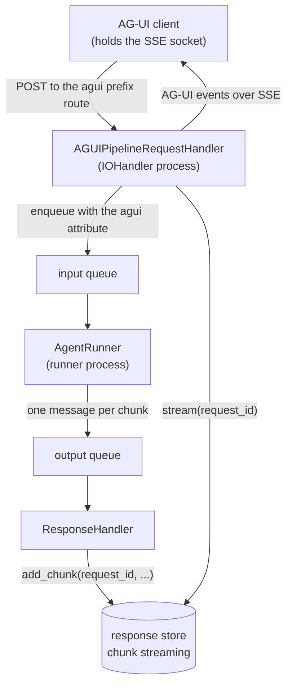

# #710: AG-UI on the queue pipeline

AG-UI runs the agent inside its own SSE request, so a slow model holds a web connection and the run
can be neither retried nor scaled apart from the web tier. This change adds a **queue-mode sibling**
handler that enqueues the run and drains the reply back through the response store, leaving the
existing direct handler as the documented default. The one new piece of machinery is chunk streaming
on the shared response stores — an optional capability the `ResponseStore` base class already
declares and no shared store implements.

Builds on #524, which moved the seven messaging platforms and conversation threads onto the same
pipeline (`docs/specs/524-pluggable-integration-adapter/`). AG-UI is the third consumer of those
pieces and the second caller-waits one.

## Motivation

- **The run happens inside the HTTP request.** `AGUIRequestHandler._run` returns
  `StreamingResponse(self._events(...))`, and `_events` drives `handler.run_stream_async(...)` — the
  agent, its tools and the model — while the response is still open
  (`integration/agui/handler.py:177-220`, `222-289`). Three consequences: a slow model occupies a web
  connection for the whole run; a failed run cannot be redelivered, because nothing was ever
  enqueued; and the web tier cannot be scaled apart from agent execution.
- **AG-UI is the only surface still in this position.** #524 moved the seven platforms and #524 §14
  moved conversation threads; `deployment/` runners inherit the seam separately. AG-UI touches no
  pipeline component today.
- **The #524 adapter seam does not fit.** Its contracts assume a reply pushed out-of-band to an
  address that fits in a string; see the comparison below.
- **No shared store can serve an event stream.** `ResponseStore` already declares
  `supports_chunk_streaming`/`add_chunk`/`stream`/`close_stream`, defaulting the check to `False`
  (`pipeline/response_store/base.py:54-73`). Exactly one store answers `True`
  (`response_store/in_memory.py:29`), and it is process-local; `ResponseStoreFactory` requires a
  **shared** store on a broker transport (`response_store/factory.py:50-63`). The two properties
  AG-UI needs therefore exist in different stores and in no single one.
- **The same gap already breaks an existing route.** `RequestHandler`'s STREAM SSE route answers
  HTTP 400 on every broker transport for exactly this reason (`request_handler.py:288-297`).

**Why not the #524 adapter seam.** It is for surfaces whose reply leaves out-of-band over a platform
API, and AG-UI is caller-waits:

| Seam contract | AG-UI |
|---|---|
| `OutboundAdapter.deliver(reply, reply_context)` pushes one finished `AgentReply` | the reply is *n* events (`RunStarted`, deltas, tool calls, `StateSnapshot`, `RunFinished`) down a socket the caller still holds |
| `reply_context` is flat `Dict[str, str]` under 8 KB (#524 §3) | the delivery address is a live socket in one process — not serialisable at any size |

This is the same conclusion #524 §14 reached for threads (Decision Q12), with one row different —
and that row is the work threads did not need. A thread's reply was a single record travelling the
response store's existing mailbox; AG-UI's is a stream.

The two delivery shapes side by side, and what each component change follows from, are in
`research/delivery-shapes.md`.

## Design shape

A messaging adapter *pushes* from the runner; AG-UI *pulls* into the process that never let go of
the socket. `request_id` is a string, so it fits a queue attribute where a socket does not.

## Requirements

### 1. The queue marker

- **`ATTR_AGUI`** (`agui`) in `pipeline/envelope.py`, stamped only by the queue-mode AG-UI handler —
  the shape of `ATTR_INTEGRATION` (#524 §3) and `ATTR_THREAD` (#524 §14.1).
- It carries two separable facts no existing marker carries: stream this run, and deliver its chunks
  to the response store.
- **It must survive the runner hop.** The second fact is read by the Response Handler off the
  *output* message (§3), so unlike `ATTR_THREAD` — which the runner consumes itself
  (`pipeline/agent_runner.py:137`) and deliberately does not forward — `ATTR_AGUI` has to be carried
  onto every chunk the runner emits. See §2.
- No other producer stamps it, so no other traffic changes behaviour.

### 2. Agent Runner

- **The runner streams on the marker, not on `execution.mode`.** `IOHandler` selects
  `StreamAgentRunner` only when `mode == stream` (`pipeline/io_handler.py:132`), so an app on the
  default `rest_sync` would otherwise run an AG-UI message through `process_chat_request` and produce
  one non-streamed reply. `AgentRunner.process` routes a marked message to the streaming
  implementation — the mirror of `StreamAgentRunner.process` already routing an `ATTR_INTEGRATION`
  message down to the non-streaming one (`pipeline/agent_runner.py:212-213`).
- **`ATTR_AGUI` joins `_FORWARDED_ATTRIBUTES`** (`pipeline/agent_runner.py:27`). That tuple is a
  strict allowlist applied in `_send_to_output` (`:184`), so an unlisted attribute is dropped on the
  hop and §3's dispatch would never fire — every AG-UI chunk would take the ordinary
  `execution.mode` path instead. #524 met the same wall and recorded it as a motivation
  (`524/design.md:33-35`), extending the same tuple for `ATTR_INTEGRATION` in its §5.
- **The `ATTR_USER_ID` requirement in the streaming path must not apply.** `agent_runner.py:218`
  requires it on broker transports because it is the WebSocket-entered marker; AG-UI chunks go to the
  store, never to a socket the gateway owns. AG-UI stamps no `ATTR_USER_ID`, for the same reason
  `IntegrationProducer` does not — `user_id` travels in the body.
- **The runner owns the AG-UI state comparison.** Forced, not chosen: a cached session store returns
  the **process-local copy** from `load` (`core/session/redis.py:39-42`, and the same in every cached
  backend), so an edge-side `state_after` would compare the edge's own cache against its own snapshot
  and always conclude nothing changed. The runner holds one session lifecycle in one process, takes
  its own before/after around the run, and emits one extra chunk carrying the snapshot only when they
  differ.
- **The runner applies the inbound AG-UI values onto the session it loads.** They arrive on the body
  (§5), not through the session store, and the runner writes them back into the caches AG-UI chose —
  `state` non-volatile, `forwardedProps` and `context` volatile — through the `AGUIState` accessors,
  which stay the only place that knows which cache each field lives in
  (`integration/agui/state.py:22-23`). Order is fixed and mirrors the direct handler
  (`integration/agui/handler.py:206-217`): resolve the handler, apply the values, snapshot
  `state_before`, then run — so inbound state is the baseline and a turn that changes nothing emits
  no snapshot.
  - **`forwardedProps` and `context` are never written non-volatile**, at either end. `Runtime`
    stores the session and then clears the volatile cache (`core/runtime.py:364`, `:372`), which is
    exactly what gives them their one-run lifetime; persisting them to survive the hop would leak
    the previous turn's client context into the next run.
- **The AG-UI branch runs through `prepare_agent_handler` + `run_stream_sync`**, not
  `process_stream_chat_sync`: it needs the session object between load and run, which is the
  documented reason `prepare_agent_handler` exists (`core/chat_service.py:362-370`, whose docstring
  names AG-UI).
- The AG-UI state helper is imported **lazily inside the runner method** — the rule
  `AgentRunner._record_thread_reply` and `ResponseHandler._outbound_adapter` already follow, so a
  runner process never pays for an `integration` extra it may not have.

### 3. Response Handler

- Dispatch on `ATTR_AGUI` **ahead of** the `execution.mode` branch (`pipeline/response_handler.py:54-69`),
  writing each chunk with `store.add_chunk`. A message without the attribute takes today's path
  unchanged.
- `on_permanent_failure` writes one terminal error chunk (`done=True`) so the edge can close the run
  with exactly one `RunError` — the protocol's terminal event, so no client hangs.
- **Chunk order holds on every built-in transport**, which matters more here than on today's STREAM
  path because AG-UI's events are typed and bracketed, so a reorder breaks the protocol rather than
  scrambling text. `_send_to_output` stamps the source message's `group_id`, falling back to
  `session_id` (`pipeline/agent_runner.py:192-194`), and all four transports serialise a group:
  `in_memory` holds one deque per group with at most one message in flight (`in_memory.py:21-23`),
  `sqs` sends FIFO with `MessageGroupId` (`sqs.py:45`), and `kafka` and `nats` hash sessions to
  partitions served one record at a time (`kafka.py:13-20`, `nats.py:17-19`). The output queue's two
  default consumer threads (`core/config.py:483`) therefore cannot hold two chunks of one run at
  once.

### 4. Response store chunk streaming

- **This implements an existing optional capability; it introduces no new interface.** Consumers
  already check `supports_chunk_streaming()` rather than a store type (`request_handler.py:288`), and
  the base class already declares all four — the capability check defaulting to `False`, the three
  operations raising `NotImplementedError` (`response_store/base.py:54-73`).
- `redis` and `valkey` implement `add_chunk`/`stream`/`close_stream` and return `True`.
- One blocking-pop method joins the shared driver (`core/util/driver/redis_like.py`, which already
  carries `rpush`/`lpop`/`llen` at `232-262`); both backends inherit it, since the `valkey` client is
  a `redis-py` fork with an identical API.
- `dynamodb` and any bring-your-own store keep the base default and are untouched (`dynamodb` has
  no blocking read — see Non-goals). **A store that implements the capability takes part in AG-UI
  queue mode with no further change** — which is why every precondition below names the capability,
  never a list of store names.
- **`ResponseStore.shared` joins the ABC**, because chunk streaming and cross-process visibility are
  two different facts and AG-UI needs both. `supports_chunk_streaming()` says the store *can* carry a
  stream; `shared` says a second process can *read* it. `InMemoryResponseStore` answers `True` to the
  first (`response_store/in_memory.py:29`) while holding `ClassVar` state (`:23-25`), and
  `ResponseStoreFactory` returns it on **any** transport when the type is explicitly `in_memory` —
  the `or` short-circuit at `response_store/factory.py:50-58` never consults the transport, which is
  deliberate and asserted (`tests/test_pipeline_factory_seams.py:102`). Without the second predicate
  the edge and the Response Handler can hold different stores and the run hangs to the per-chunk
  timeout.
  - Shape and polarity mirror `WSConnectionStore.shared` (`core/session/base.py:22`): default
    `True`, with `in_memory` overriding to `False` (`core/session/in_memory.py:23` is the model). So
    `redis`, `valkey` and `dynamodb` need no edit — one base method and one override.
  - A dotted-path store inherits `True`. Same accepted blind spot §6 records for session stores, and
    the factory already lets a bring-your-own store past every transport check
    (`factory.py:47-48`), so the topology already trusts the deployer there.
- Independently useful: this lifts `RequestHandler`'s existing STREAM SSE route onto broker
  transports, where it answers HTTP 400 today.

### 5. The queue-mode handler

- **`AGUIPipelineRequestHandler` is a sibling class, not a mode-aware handler.** It subclasses
  `AGUIRequestHandler`, reusing its routes, authoriser contract, 404/400 gates and body parse —
  mirroring `AgentThreadRequestHandler`/`ThreadRequestHandler` (#524 Q11).
- The edge half of `_run` is extracted so both handlers share it verbatim and cannot drift on the
  404/400 contract.
- **Authorisation happens once, at the edge**, and the resolved `user_id` travels in the body rather
  than in an attribute (§2); the runner does not re-authorise. This assumes the input queue is a
  trusted boundary — the same assumption `IntegrationProducer` already makes — which is worth
  stating explicitly for a surface that otherwise has no anonymous mode.
- It declares `requires_pipeline = True` (#524 §7/Q9), so a bare `RESTAPI.run([...])` app fails at
  boot rather than enqueueing into a queue no runner drains.
- It mounts through `IOHandler.run(handlers=[...])`, **not** `request_handler=`: AG-UI owns
  `agui.prefix` and collides with no pipeline route, so no `IOHandler` change is needed.
- **The client's inbound values ride the queue body, not the session store.** `state`,
  `forwardedProps` and `context` travel in a typed `agui` envelope on an
  `AGUIRunRequest(BaseRunRequest)` subclass, and the edge neither creates, writes nor stores a
  session. Two independent reasons, either sufficient:
  - **The session store cannot carry two of the three.** `forwardedProps` and `context` live in the
    **volatile** cache by design (`integration/agui/state.py:22-23`, `:83`, `:92`) because `Runtime`
    clears it after every run so a stale copy can never be read; every store persists
    `session.get_all(volatile=False)` (`core/session/redis.py:100`). A session hop therefore drops
    them by construction, silently — the readers fall back to `{}` / `[]` (`state.py:65`, `:74`)
    rather than raising, so the agent simply behaves as though the client sent nothing.
  - **It cannot reliably carry the third either.** With `session.cache` configured, the runner's
    `load` returns its own process-local copy and never reads what the edge wrote
    (`core/session/redis.py:39-42`) — the very fact §2 relies on for the state comparison. A design
    that depended on the hop would contradict §2.
  - The envelope is **typed, not an extra**, for the reason `BaseRunRequest` already gives
    (`core/model.py:275-289`): an extra reaches the agent as `AgentRequestAny` context. It lives in
    `integration/agui/` rather than on `BaseRunRequest`, so core grows no field for an optional
    extra, and `RequestBuilder.known_fields` (`core/chat_service.py`) gains the envelope's name so
    that guarantee does not rest on the AG-UI branch always passing a prebuilt `requests` list.
  - **The envelope is size-budgeted at the edge.** Once attachments are offloaded it is the only
    unbounded client-controlled payload left on the message, and the body must fit the smallest
    built-in transport (SQS, 256 KB). The edge rejects an oversized envelope with a status naming the
    field and the budget — the shape `IntegrationProducer._reply_attributes` uses for reply context
    (`integration/adapter/producer.py:94-101`), at a larger figure, since `forwardedProps`
    legitimately carries a selected record where a reply context carries a channel id.
  - `set_agui_session_keys` splits into an edge half (validate, keep the 400s and the type warnings
    where an HTTP status still exists, produce the envelope) and a runner half (apply it to a
    session, §2), so the direct and queue paths cannot drift on the cache choice.
- **The edge half of `_run` therefore stops before the session.** Authorise, resolve the agent,
  parse, `to_requests`, offload attachments, `_warn_if_unreadable` — and enqueue. It drops the
  `prepare_agent_handler` / `set_agui_session_keys` / `snapshot_state` block
  (`integration/agui/handler.py:206-217`); a runner-side selection failure surfaces as `RunError`,
  which is the only channel left once the stream is open.
- **Attachments are offloaded at the edge and never ride the queue.** `AGUIRunInput.to_requests`
  builds `AgentRequestImage`/`AgentRequestFile` carrying inline base64 (`run_input.py:144-145`),
  which a broker message cannot hold (SQS caps at 256 KB). The edge calls
  `AttachmentStorageManager.offload` (`core/multimodal/storage/storage_manager.py:155`) and the
  rebuilt `requests` list travels instead — the same shared helper the seven messaging adapters and
  `ConversationThreadManager` already use, so AG-UI adds no mechanism of its own. This is #524 §8's
  rule, and it carries #524 §8's consequence: an attachment-bearing run needs
  `multimodal.enabled: true` and rejects `storage_type: session_cache`.
- It keeps the socket, enqueues with `group_id = thread_id` — AG-UI's `threadId` *is* AK's
  `session_id`, so this is the per-conversation FIFO group §3 relies on — drains
  `store.stream(request_id)`, maps each chunk through `AGUIMapper`, and releases the stream state in
  a `finally` — the shape `RequestHandler._sse_stream` already uses (`request_handler.py:306-334`).
- The state chunk maps to `StateSnapshotEvent`; the edge needs no `state_before` on this path.

### 6. Preconditions — fail fast when the surface cannot work

- **Raise `AKConfigError` in `__init__`** when the resolved response store fails *either* predicate
  (§4), with a distinct message for each, both naming the configured store and the configured
  transport:
  - `supports_chunk_streaming()` is `False` — the store cannot carry a stream at all. This is the
    same fact `_reject_unroutable` already checks per request (#524 §7/Q2 fail-fast posture).
  - `shared` is `False` while the transport is not `in_memory` — the store can stream, but only
    within one process, so the edge would park on a queue the runner never writes to. Capability
    alone does not catch this: `in_memory` answers `True` to the first predicate.
- **Raise `AKConfigError` in `__init__`** when `session.type` is the literal `in_memory` on a broker
  transport. Not because the client's inbound values depend on it — after §5 those ride the body —
  but because the **conversation** does: a process-local session store means the runner cannot read
  the history of a thread another process served, so every turn starts blank and the AG-UI state a
  previous turn wrote is invisible. The message names the configured transport and the stores that
  work, the shape `ScheduleManager._validate_store_topology` uses (`schedule/manager.py:392-395`).
  - **The rule the codebase already follows is broken versus degraded, not provable versus not.**
    The schedule store and the WebSocket connection store raise, because the feature cannot work
    without a shared backend (`schedule/manager.py:392`, `pipeline/io_handler.py:83`,
    `pipeline/ws/gateway.py:52`). Kafka's retry bookkeeping only warns, because it still works and
    merely loses delivery counts across a restart (`pipeline/transport/bookkeeping.py:151`). AG-UI
    is on the first side: the conversation is simply not there.
  - **A dotted-path store is not classified, and that is accepted precedent.**
    `_validate_store_topology` compares against the literal `in_memory` too
    (`schedule/manager.py:387`), so a bring-your-own store falls through unchecked there as well.
    The check catches the accidental default — which is the case that actually happens, since
    `session.type` defaults to `in_memory` (`core/config.py:94`) — and leaves a deliberate choice
    to the deployer.
- **Not a precondition, recorded here because it is the other way a run can fail on configuration:**
  the per-chunk wait keeps the response store's existing `retry_count x delay` budget
  (`core/config.py:455-456`) rather than introducing an AG-UI-specific timeout. It is the one knob a
  deployer already tunes for how long a queue-backed reply may take, and it bounds the gap *between*
  chunks, not the whole run, so a long run never trips it.

### 7. Configuration

- **No new configuration.** The `agui` block keeps every field, name, type and default (`_AGUIConfig`,
  `core/config.py:873-882`); no new `enabled` flag, no new `type` selector.
- The handler reads `execution.response_store` and `session` through the existing factories.
- **Mounting the sibling is what selects the queue path**, exactly as mounting `AGUIRequestHandler` is
  what enables AG-UI at all. Existing YAML and `AK_*` variables keep working unchanged.

### 8. Compatibility

- **Additive.** `AGUIRequestHandler` and its direct SSE path are unchanged and stay the documented
  default; an app that mounts nothing new behaves exactly as before.
- `QueueMessage`'s shape is unchanged beyond one new attribute constant.
- The new store methods implement a capability the base class already declares, so a bring-your-own
  store is unaffected.
- The one visible change outside AG-UI is that the STREAM SSE route now serves redis/valkey instead
  of answering HTTP 400 — strictly more working than before. A CR that turns a route on owns the
  conditions under which it is on, so `RequestHandler._reject_unroutable`'s STREAM branch
  (`pipeline/request_handler.py:288-297`) gains the `shared` predicate alongside the capability
  check. Today that branch lets a broker plus an explicitly configured `in_memory` store through,
  and the request hangs for the full `retry_count x delay` budget before returning
  `{"error": "Stream timed out"}` — strictly worse than the 400 it gives on redis.
- **Duplicate events on redelivery, accepted.** The queue is at-least-once and nothing in the chunk
  path is idempotent: `add_chunk` is an unconditional append (`response_store/in_memory.py:65-69`)
  and `StreamChunk` carries no sequence or id (`core/model.py:180-194`). Three deliveries produce a
  duplicate — an ack that fails after a successful run (`ConsumerLoop` acks inside the same `try` as
  `_process`, `pipeline/consumer.py:144`), a runner that dies mid-run, and a visibility timeout that
  expires while a slow model is still running. An output redelivery appends one duplicate chunk; an
  input redelivery re-runs the turn and re-emits the whole sequence, which the dedup suffix
  deliberately lets through (`agent_runner.py:233`, so a legitimate retry is not swallowed). Under
  AG-UI a duplicate is protocol-breaking rather than cosmetic. **Not closed here:** the exposure is
  pre-existing on the STREAM/SSE route, and any fix repairs that route too, so it is a follow-up
  filed with this CR — the same reasoning the `dynamodb` implementation is deferred on. A reviewer
  who disagrees has a cheap lever: the runner already computes the attempt and chunk numbers
  (`agent_runner.py:233`) and currently discards them, so an edge-side filter is available without
  new state or configuration.
- **A loss window, accepted.** If the API replica dies mid-run its socket dies with it and the
  remaining chunks sit in the store until TTL; AG-UI has no resume token, so the client starts a new
  run. The direct handler loses the run on the same failure, so this is not a regression — but it is
  now a two-process surface.
- `_warn_if_unreadable` runs at the edge and still works; the tools it warns about run in the runner.
- **Events reach the client as the run produces them, not as an end-of-run burst.** Issue #710 lists
  the burst as a known limitation, on the basis that `AgentHandler.run_stream_sync` buffers the whole
  run. That is no longer true: #741 made the sync streaming path incremental
  (`core/chat_service.py:268-278`), so `StreamAgentRunner` already fans out chunk by chunk. Nothing
  is deferred to a follow-up on this account.

### 9. Testing

- **A reusable `ResponseStoreContract` suite ships next to the ABC** and every chunk-streaming
  backend subclasses it — `in_memory`, `redis` and `valkey`. This is the house pattern
  (`QueueTransportContract`, `SandboxProviderContract`, `IntegrationAdapterContract`), and response
  stores are the one pluggable surface still missing it; three implementations of semantics this
  fiddly will drift without one, and it is what makes a bring-your-own store's claim to
  `supports_chunk_streaming` checkable rather than asserted.
  - The semantics it pins: chunk order, the terminal `done` chunk ending the stream,
    `close_stream` unblocking a reader parked mid-wait, a reader that arrives after the writer
    finished, and the per-chunk timeout.
  - The redis and valkey runs are env-gated against a live broker, the shape
    `tests/test_transport_contract_live.py` already uses for transports.
- A round trip drives an AG-UI request through the `in_memory` topology end to end and asserts the
  protocol bracket holds: `RunStarted` first, exactly one of `RunFinished`/`RunError` last.
- The two dispatch changes get their own cases: a marked message streams under `rest_sync`, and an
  unmarked message is untouched by either the runner or the Response Handler change.
- A permanent failure yields exactly one `RunError` and closes the stream.
- An attachment-bearing run enqueues no inline bytes: the body's `requests` carry
  `AgentRequestAttachmentRef` and the original base64 is gone (§5).
- **The decisive precondition case:** a broker transport plus an explicit
  `execution.response_store.type: in_memory`. Assert in one test that the factory returns an
  `InMemoryResponseStore`, that `supports_chunk_streaming()` is `True`, that `shared` is `False`, and
  that construction raises. The third assertion is the point — it pins that the capability check
  alone would have let this through.
- The other preconditions raise at construction too (§6): a store that cannot stream chunks, and
  `session.type: in_memory` on a broker transport. A dotted-path store — session or response — is
  left alone by both checks, asserted so the accepted blind spot stays deliberate.
- **The marker survives the runner hop:** an AG-UI input message produces output messages still
  carrying `ATTR_AGUI`, mirroring the existing assertion for `ATTR_INTEGRATION`
  (`tests/test_pipeline_agent_runner.py:192`).
- **The AG-UI branch precedes the mode branch**, with and without `ATTR_USER_ID` present and in every
  execution mode — the shape `test_the_integration_branch_precedes_the_mode_branch` already uses
  (`tests/test_pipeline_response_handler.py:227`). This pins the routing invariant that currently
  holds only implicitly.
- **The inbound envelope reaches the tools:** a run carrying `forwardedProps` and `context` with a
  stubbed agent that reads both during the run asserts both are non-empty. Against a session-hop
  design this fails with `{}` / `[]`.
- **And keeps its lifetime:** after that run, the persisted session record carries neither key, and a
  second run on the same `threadId` sending no `forwardedProps` reads `{}`. Proves they crossed the
  queue without becoming non-volatile.
- **The envelope never becomes agent context:** building the enqueued body and running
  `RequestBuilder` over it produces no `AgentRequestAny` named for the envelope field.
- **State baseline ordering:** a run carrying inbound `state` whose agent never calls
  `update_agui_state` emits no `StateSnapshotEvent` — proving `state_before` is snapshotted after the
  envelope is applied (§2), not before.

## Non-goals

- **Migrating `AGUIRequestHandler`.** It stays the direct-execution handler and the documented
  default; this change adds a sibling. Considered and rejected for this CR:
  - **It would remove AG-UI from the ECS containerized deployment.** `AGUIRequestHandler` inherits
    `requires_pipeline = False` (`api/handler.py:17`), so it mounts today through
    `ECSIOHandler.run(handlers=[...])`. `AGUIPipelineRequestHandler` declares it `True`, and
    `ECSIOHandler` routes through `AWSRestAPI.run` to `RESTAPI.run`, which rejects such a handler
    (`api/http.py:109`, `:117-131`). ECS runs a queue, but not *this* pipeline — its runners are the
    `deployment/aws` classes, which do not dispatch `ATTR_AGUI` either. Deleting the direct handler
    would therefore cut a working surface with nothing to replace it.
  - **Direct and queue siblings are the house pattern**, not a transitional state: chat has
    `AgentRESTRequestHandler`/`RequestHandler`, threads have
    `AgentThreadRequestHandler`/`ThreadRequestHandler` (#524 §14), and neither pair has been
    collapsed.
  - **#524's deletion of seven handlers does not transfer.** Those were near-identical copies of one
    thing (two `split_reply` chunkers, seven inline `session_id` rules); these are two execution
    models. The duplication that does exist between them is removed by extracting the shared edge
    half (§5), not by deleting a handler.
  - **Cost:** every existing AG-UI app changes its mounting call, and a broker deployment would need
    a response store for what is currently a zero-infrastructure demo.
  - **Sequencing:** revisit once #495's recorded "ECS runtime classes become pipeline instantiations"
    follow-up lands (`docs/specs/495-onprem-kubernetes/plan.md:318`). Only then does queue mode reach
    everywhere the direct handler already does, making removal a migration rather than a capability
    cut.
- **A `dynamodb` chunk-streaming implementation.** Deferred on balance, not ruled out — this is a
  fidelity and scope choice rather than a technical wall.
  - **The difference is the wait.** A streaming reader has to wait for a chunk that has not been
    written yet. `BLPOP` parks that reader inside redis until one is pushed, costing nothing while
    idle, and `queue.Queue.get` does the same in-process. DynamoDB has no equivalent: it can only be
    asked again.
  - **Polling is implementable** on the existing driver, which already carries sort keys and
    partition queries (`core/util/driver/dynamodb.py:77`, `:130`) — one item per chunk, sequence
    number as the sort key. What it costs is a latency floor of one poll interval, read volume that
    scales with concurrent open runs rather than with tokens (an idle run still polls, where a
    blocked redis reader does not), and a sequencing, TTL and `close_stream` design that redis and
    valkey get from a single driver method.
  - **The deployment consequence, plainly:** an SQS plus DynamoDB application needs redis or valkey
    added for the response store before it can run AG-UI in queue mode. The **session** store is
    unaffected and can stay on DynamoDB.
  - **Adding it later is purely additive:** `dynamodb.py` implements those same four methods and nothing
    else in the pipeline or in AG-UI changes, because every check names the capability rather than
    the store (§4).
- **AG-UI thread recording.** It stays out by construction, because `ATTR_AGUI` is not `ATTR_THREAD`.
- **Resumable runs.** AG-UI has no resume token; the loss window above is accepted, not closed.
- **Touching `deployment/aws/*` runners.** This targets `agentkernel.pipeline` only.
- **Three adjacent repairs the `shared` predicate (§4) makes mechanical, all deferred to their own
  issues so this CR stays additive:**
  - `ResponseStoreFactory` consulting the transport for an explicitly configured `in_memory` store
    (`response_store/factory.py:50-58`). The short-circuit is documented and asserted
    (`tests/test_pipeline_factory_seams.py:102`), and its blast radius includes the sandbox broker's
    own `sandbox.broker.response_store` resolution.
  - `IOHandler._validate_topology`'s shared-store guard (`pipeline/io_handler.py:207-216`), which is
    a config-string compare and covers REST modes only, on the premise that "WebSocket modes never
    touch the response store" — false for STREAM, which routes to `_store_chunk` when no
    `ATTR_USER_ID` is present (`response_handler.py:60-68`).
  - `SessionStore.shared`, which would convert §6's second precondition from a literal comparison to
    a predicate and retire its recorded blind spot. Six backends plus a bring-your-own contract.
- **Idempotent chunk delivery.** See §8: the exposure is pre-existing on the STREAM/SSE route and any
  fix repairs that route too.

## Open questions

None outstanding.

- **Resolved — an unshared session store on a broker transport raises (§6).** Settled against the
  existing precedent rather than on judgement: the codebase raises when a capability cannot work
  without a shared backend and warns when it only degrades, and AG-UI loses the client's inbound
  state outright. The objection that a dotted-path store cannot be classified was weighed and is
  already accepted in `ScheduleManager._validate_store_topology`, which compares against the literal
  `in_memory` and raises regardless.
