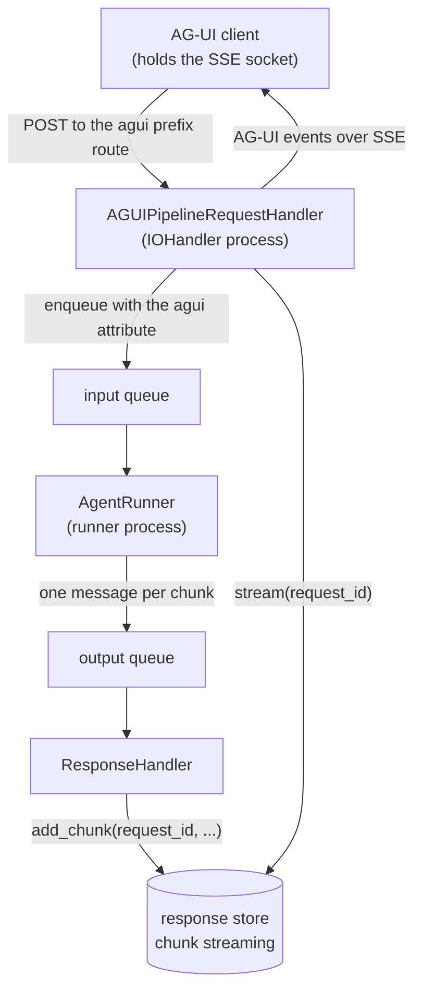

# #710: AG-UI on the queue pipeline

AG-UI runs the agent inside its own SSE request, so a slow model holds a web connection and the run
can be neither retried nor scaled apart from the web tier. This change adds a **queue-mode sibling**
handler that enqueues the run and drains the reply back through the response store, leaving the
existing direct handler as the documented default. The one new piece of machinery is chunk streaming
on the shared response stores — an optional capability the `ResponseStore` base class already
declares and no shared store implements.

Builds on #524, which moved the seven messaging platforms and conversation threads onto the same
pipeline (`docs/specs/524-pluggable-integration-adapter/`). AG-UI is the third consumer of those
pieces and the second caller-waits one.

## Motivation

- **The run happens inside the HTTP request.** `AGUIRequestHandler._run` returns
  `StreamingResponse(self._events(...))`, and `_events` drives `handler.run_stream_async(...)` — the
  agent, its tools and the model — while the response is still open
  (`integration/agui/handler.py:177-220`, `222-289`). Three consequences: a slow model occupies a web
  connection for the whole run; a failed run cannot be redelivered, because nothing was ever
  enqueued; and the web tier cannot be scaled apart from agent execution.
- **AG-UI is the only surface still in this position.** #524 moved the seven platforms and #524 §14
  moved conversation threads; `deployment/` runners inherit the seam separately. AG-UI touches no
  pipeline component today.
- **The #524 adapter seam does not fit.** It is for surfaces whose reply leaves out-of-band over a
  platform API; AG-UI is caller-waits, and its reply is *n* events down a socket the caller still
  holds. The table below compares the two contract by contract.
- **No shared store can serve an event stream.** `ResponseStore` already declares
  `supports_chunk_streaming`/`add_chunk`/`stream`/`close_stream`, defaulting the check to `False`
  (`pipeline/response_store/base.py:54-73`). Exactly one store answers `True`
  (`response_store/in_memory.py:29`), and it is process-local; `ResponseStoreFactory` requires a
  **shared** store on a broker transport (`response_store/factory.py:50-63`). The two properties
  AG-UI needs therefore exist in different stores and in no single one.
- **The same gap already breaks an existing route.** `RequestHandler`'s STREAM SSE route answers
  HTTP 400 on every broker transport for exactly this reason (`request_handler.py:288-297`).

**Why not the #524 adapter seam.** It is for surfaces whose reply leaves out-of-band over a platform
API, and AG-UI is caller-waits:

| Seam contract | AG-UI |
|---|---|
| `OutboundAdapter.deliver(reply, reply_context)` pushes one finished `AgentReply` | the reply is *n* events (`RunStarted`, deltas, tool calls, `StateSnapshot`, `RunFinished`) down a socket the caller still holds |
| `reply_context` is flat `Dict[str, str]` under 8 KB (#524 §3) | the delivery address is a live socket in one process — not serialisable at any size |

This is the same conclusion #524 §14 reached for threads (Decision Q12), with one row different —
and that row is the work threads did not need. A thread's reply was a single record travelling the
response store's existing mailbox; AG-UI's is a stream.

## Design shape

A messaging adapter *pushes* from the runner; AG-UI *pulls* into the process that never let go of
the socket. `request_id` is a string, so it fits a queue attribute where a socket does not.

## Requirements

### 1. The queue marker

- **`ATTR_AGUI`** (`agui`) in `pipeline/envelope.py`, stamped only by the queue-mode AG-UI handler —
  the shape of `ATTR_INTEGRATION` (#524 §3) and `ATTR_THREAD` (#524 §14.1).
- It carries two separable facts no existing marker carries: stream this run, and deliver its chunks
  to the response store.
- No other producer stamps it, so no other traffic changes behaviour.

### 2. Agent Runner

- **The runner streams on the marker, not on `execution.mode`.** `IOHandler` selects
  `StreamAgentRunner` only when `mode == stream` (`pipeline/io_handler.py:132`), so an app on the
  default `rest_sync` would otherwise run an AG-UI message through `process_chat_request` and produce
  one non-streamed reply. `AgentRunner.process` routes a marked message to the streaming
  implementation — the mirror of `StreamAgentRunner.process` already routing an `ATTR_INTEGRATION`
  message down to the non-streaming one (`pipeline/agent_runner.py:212-213`).
- **The `ATTR_USER_ID` requirement in the streaming path must not apply.** `agent_runner.py:218`
  requires it on broker transports because it is the WebSocket-entered marker; AG-UI chunks go to the
  store, never to a socket the gateway owns. AG-UI stamps no `ATTR_USER_ID`, for the same reason
  `IntegrationProducer` does not — `user_id` travels in the body.
- **The runner owns the AG-UI state comparison.** Forced, not chosen: a cached session store returns
  the **process-local copy** from `load` (`core/session/redis.py:39-42`, and the same in every cached
  backend), so an edge-side `state_after` would compare the edge's own cache against its own snapshot
  and always conclude nothing changed. The runner holds one session lifecycle in one process, takes
  its own before/after around the run, and emits one extra chunk carrying the snapshot only when they
  differ.
- The AG-UI state helper is imported **lazily inside the runner method** — the rule
  `AgentRunner._record_thread_reply` and `ResponseHandler._outbound_adapter` already follow, so a
  runner process never pays for an `integration` extra it may not have.

### 3. Response Handler

- Dispatch on `ATTR_AGUI` **ahead of** the `execution.mode` branch (`pipeline/response_handler.py:54-69`),
  writing each chunk with `store.add_chunk`. A message without the attribute takes today's path
  unchanged.
- `on_permanent_failure` writes one terminal error chunk (`done=True`) so the edge can close the run
  with exactly one `RunError` — the protocol's terminal event, so no client hangs.
- **Chunk order is the transport's per-group FIFO guarantee**, unchanged from today's STREAM path:
  the output queue defaults to two consumer threads (`core/config.py:483`), so ordering rests on
  every transport keeping one group's messages in order to `add_chunk`. AG-UI makes a reordering
  visible where plain text deltas did not — the events are typed and bracketed. Confirm the
  guarantee holds on kafka and nats partitioning before relying on it.

### 4. Response store chunk streaming

- **This implements an existing optional capability; it introduces no new interface.** Consumers
  already check `supports_chunk_streaming()` rather than a store type (`request_handler.py:288`), and
  the base class already defines the three methods as `NotImplementedError` defaults
  (`response_store/base.py:54-73`).
- `redis` and `valkey` implement `add_chunk`/`stream`/`close_stream` and return `True`.
- One blocking-pop method joins the shared driver (`core/util/driver/redis_like.py`, which already
  carries `rpush`/`lpop`/`llen` at `232-262`); both backends inherit it, since the `valkey` client is
  a `redis-py` fork with an identical API.
- `dynamodb` and any bring-your-own store keep the base default and are untouched (`dynamodb` has
  no blocking read — see Non-goals). **A store that implements the capability takes part in AG-UI
  queue mode with no further change** — which is why every precondition below names the capability,
  never a list of store names.
- Independently useful: this lifts `RequestHandler`'s existing STREAM SSE route onto broker
  transports, where it answers HTTP 400 today.

### 5. The queue-mode handler

- **`AGUIPipelineRequestHandler` is a sibling class, not a mode-aware handler.** It subclasses
  `AGUIRequestHandler`, reusing its routes, authoriser contract, 404/400 gates and body parse —
  mirroring `AgentThreadRequestHandler`/`ThreadRequestHandler` (#524 Q11).
- The edge half of `_run` is extracted so both handlers share it verbatim and cannot drift on the
  404/400 contract.
- **Authorisation happens once, at the edge**, and the resolved `user_id` travels in the body rather
  than in an attribute (§2); the runner does not re-authorise. This assumes the input queue is a
  trusted boundary — the same assumption `IntegrationProducer` already makes — which is worth
  stating explicitly for a surface that otherwise has no anonymous mode.
- It declares `requires_pipeline = True` (#524 §7/Q9), so a bare `RESTAPI.run([...])` app fails at
  boot rather than enqueueing into a queue no runner drains.
- It mounts through `IOHandler.run(handlers=[...])`, **not** `request_handler=`: AG-UI owns
  `agui.prefix` and collides with no pipeline route, so no `IOHandler` change is needed.
- **The edge persists the session before enqueueing.** `set_agui_session_keys` writes `state`,
  `forwardedProps` and `context` onto the session object (`integration/agui/run_input.py:61-76`);
  today the same object is used by the run, so nothing is stored. Over the queue the runner loads the
  session in another process, so the edge calls `sessions().store(session)` first — otherwise the
  client's inbound state silently never reaches the tools.
- It keeps the socket, enqueues with `group_id = thread_id` (per-conversation FIFO), drains
  `store.stream(request_id)`, maps each chunk through `AGUIMapper`, and releases the stream state in
  a `finally` — the shape `RequestHandler._sse_stream` already uses (`request_handler.py:306-334`).
- The state chunk maps to `StateSnapshotEvent`; the edge needs no `state_before` on this path.

### 6. Preconditions — fail fast when the surface cannot work

- **Raise `AKConfigError` in `__init__`** when the resolved response store returns `False` from
  `supports_chunk_streaming()`, naming the configured store. This is provable, and it is the same
  fact `_reject_unroutable` already checks per request (#524 §7/Q2 fail-fast posture).
- **Raise `AKConfigError` in `__init__`** when `session.type` is the literal `in_memory` on a broker
  transport. A shared session store is as necessary as a chunk-streaming response store: without one
  the client's inbound `state`/`forwardedProps` never reach the agent (§5), silently. The message
  names the configured transport and the stores that work, the shape
  `ScheduleManager._validate_store_topology` uses (`schedule/manager.py:392-395`).
  - **The rule the codebase already follows is broken versus degraded, not provable versus not.**
    The schedule store and the WebSocket connection store raise, because the feature cannot work
    without a shared backend (`schedule/manager.py:392`, `pipeline/io_handler.py:83`,
    `pipeline/ws/gateway.py:52`). Kafka's retry bookkeeping only warns, because it still works and
    merely loses delivery counts across a restart (`pipeline/transport/bookkeeping.py:151`). AG-UI
    is on the first side: the state simply does not arrive.
  - **A dotted-path store is not classified, and that is accepted precedent.**
    `_validate_store_topology` compares against the literal `in_memory` too
    (`schedule/manager.py:387`), so a bring-your-own store falls through unchecked there as well.
    The check catches the accidental default — which is the case that actually happens, since
    `session.type` defaults to `in_memory` (`core/config.py:94`) — and leaves a deliberate choice
    to the deployer.

### 7. Configuration

- **No new configuration.** The `agui` block keeps every field, name, type and default (`_AGUIConfig`,
  `core/config.py:873-882`); no new `enabled` flag, no new `type` selector.
- The handler reads `execution.response_store` and `session` through the existing factories.
- **Mounting the sibling is what selects the queue path**, exactly as mounting `AGUIRequestHandler` is
  what enables AG-UI at all. Existing YAML and `AK_*` variables keep working unchanged.

### 8. Compatibility

- **Additive.** `AGUIRequestHandler` and its direct SSE path are unchanged and stay the documented
  default; an app that mounts nothing new behaves exactly as before.
- `QueueMessage`'s shape is unchanged beyond one new attribute constant.
- The new store methods implement a capability the base class already declares, so a bring-your-own
  store is unaffected.
- The one visible change outside AG-UI is that the STREAM SSE route now serves redis/valkey instead
  of answering HTTP 400 — strictly more working than before.
- **A loss window, accepted.** If the API replica dies mid-run its socket dies with it and the
  remaining chunks sit in the store until TTL; AG-UI has no resume token, so the client starts a new
  run. The direct handler loses the run on the same failure, so this is not a regression — but it is
  now a two-process surface.
- `_warn_if_unreadable` runs at the edge and still works; the tools it warns about run in the runner.
- **Events reach the client as the run produces them, not as an end-of-run burst.** Issue #710 lists
  the burst as a known limitation, on the basis that `AgentHandler.run_stream_sync` buffers the whole
  run. That is no longer true: #741 made the sync streaming path incremental
  (`core/chat_service.py:268-278`), so `StreamAgentRunner` already fans out chunk by chunk. Nothing
  is deferred to a follow-up on this account.

### 9. Testing

- **A reusable `ResponseStoreContract` suite ships next to the ABC** and every chunk-streaming
  backend subclasses it — `in_memory`, `redis` and `valkey`. This is the house pattern
  (`QueueTransportContract`, `SandboxProviderContract`, `IntegrationAdapterContract`), and response
  stores are the one pluggable surface still missing it; three implementations of semantics this
  fiddly will drift without one, and it is what makes a bring-your-own store's claim to
  `supports_chunk_streaming` checkable rather than asserted.
  - The semantics it pins: chunk order, the terminal `done` chunk ending the stream,
    `close_stream` unblocking a reader parked mid-wait, a reader that arrives after the writer
    finished, and the per-chunk timeout.
  - The redis and valkey runs are env-gated against a live broker, the shape
    `tests/test_transport_contract_live.py` already uses for transports.
- A round trip drives an AG-UI request through the `in_memory` topology end to end and asserts the
  protocol bracket holds: `RunStarted` first, exactly one of `RunFinished`/`RunError` last.
- The two dispatch changes get their own cases: a marked message streams under `rest_sync`, and an
  unmarked message is untouched by either the runner or the Response Handler change.
- A permanent failure yields exactly one `RunError` and closes the stream.
- Both preconditions raise at construction (§6): a response store that cannot stream chunks, and
  `session.type: in_memory` on a broker transport. A dotted-path session store is left alone by the
  second check, which is asserted so the accepted blind spot stays deliberate.

## Non-goals

- **Migrating `AGUIRequestHandler`.** It stays the direct-execution handler and the documented
  default; this change adds a sibling.
- **A `dynamodb` chunk-streaming implementation.** Deferred on balance, not ruled out — this is a
  fidelity and scope choice rather than a technical wall.
  - **The difference is the wait.** A streaming reader has to wait for a chunk that has not been
    written yet. `BLPOP` parks that reader inside redis until one is pushed, costing nothing while
    idle, and `queue.Queue.get` does the same in-process. DynamoDB has no equivalent: it can only be
    asked again.
  - **Polling is implementable** on the existing driver, which already carries sort keys and
    partition queries (`core/util/driver/dynamodb.py:77`, `:130`) — one item per chunk, sequence
    number as the sort key. What it costs is a latency floor of one poll interval, read volume that
    scales with concurrent open runs rather than with tokens (an idle run still polls, where a
    blocked redis reader does not), and a sequencing, TTL and `close_stream` design that redis and
    valkey get from a single driver method.
  - **The deployment consequence, plainly:** an SQS plus DynamoDB application needs redis or valkey
    added for the response store before it can run AG-UI in queue mode. The **session** store is
    unaffected and can stay on DynamoDB.
  - **Adding it later is purely additive:** `dynamodb.py` implements the four methods and nothing
    else in the pipeline or in AG-UI changes, because every check names the capability rather than
    the store (§4).
- **AG-UI thread recording.** It stays out by construction, because `ATTR_AGUI` is not `ATTR_THREAD`.
- **Resumable runs.** AG-UI has no resume token; the loss window above is accepted, not closed.
- **Touching `deployment/aws/*` runners.** This targets `agentkernel.pipeline` only.

## Open questions

None outstanding.

- **Resolved — an unshared session store on a broker transport raises (§6).** Settled against the
  existing precedent rather than on judgement: the codebase raises when a capability cannot work
  without a shared backend and warns when it only degrades, and AG-UI loses the client's inbound
  state outright. The objection that a dotted-path store cannot be classified was weighed and is
  already accepted in `ScheduleManager._validate_store_topology`, which compares against the literal
  `in_memory` and raises regardless.
