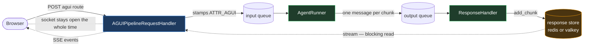

# Delivery shapes: why Slack fits the adapter seam and AG-UI does not

**Takeaway:** a messaging platform's reply leaves out-of-band to an address that fits in a string, so
the runner process can deliver it. AG-UI's caller is still holding a socket in the *web* process, and
a socket is not serialisable — so the reply has to be pulled, not pushed. Every component #710 touches
follows from that one inversion.

Supporting material for `../design.md` §§1-6. Not a requirements document.

## Slack, as #524 built it

```mermaid
graph LR
    S([Slack]) -->|"webhook POST"| W[WebhookRESTRequestHandler]
    W -->|"verify · parse"| IA[SlackInboundAdapter]
    IA --> P[IntegrationProducer]
    P -->|"stamps ATTR_INTEGRATION"| IQ[(input queue)]
    IQ --> AR[AgentRunner]
    AR --> OQ[(output queue)]
    OQ --> RH[ResponseHandler]
    RH -->|"dispatch on marker"| OA[SlackOutboundAdapter]
    OA -->|"deliver — Slack Web API"| S
    W -.->|"200 OK, immediately"| S

    classDef web fill:#1e3a5f,stroke:#4a9eff,color:#fff
    classDef run fill:#1f3d2b,stroke:#4ade80,color:#fff
    class W,IA,P web
    class AR,RH,OA run
```



Blue is the **IOHandler process**, green the **agent-runner process** — the two the `ak-k8s` chart
deploys as `deployment-io.yaml` and `deployment-agent-runner.yaml`. On the `in_memory` transport they
collapse into one process running both as threads.

The webhook answers `200 OK` and hangs up before the agent starts — that is the whole point of #524,
since a slow model used to become a platform delivery timeout and a redelivered event. When the reply
is ready, the **runner process** calls Slack's API itself. Slack's address is a channel id, a string,
so it rides the queue in `reply_context` (flat `Dict[str, str]`, 8 KB budget, #524 §3).

Nobody is waiting on a connection. The reply finds its own way home.

## AG-UI, as #710 proposes



The browser never hangs up; the IOHandler process holds its socket for the whole run.

There is no outbound adapter because there is nowhere for one to deliver: the runner cannot reach a
socket owned by another process. So the reply goes into the amber store, and the IOHandler process —
which still has the socket — pulls it out.

## The difference, in two lines

```
Slack:   agent-runner --push-->  Slack's API     (address = a string)
AG-UI:   IOHandler    --pull-->  the store       (address = a live socket)
```

## Why each component changes

| Component | Change | What breaks without it |
|---|---|---|
| `pipeline/envelope.py` | add `ATTR_AGUI` | Nothing downstream can tell AG-UI traffic from ordinary chat. The decision must be per **message**, not per app — one app serves both. |
| `pipeline/agent_runner.py` | stream on the marker | `IOHandler` picks `AgentRunner` vs `StreamAgentRunner` once, from global `execution.mode` (`pipeline/io_handler.py:132`). An app on the default `rest_sync` would run AG-UI through the non-streaming path and produce one lump reply. |
| `pipeline/agent_runner.py` | exempt from the `ATTR_USER_ID` guard | That guard (`pipeline/agent_runner.py:218`) means "a WebSocket is waiting". AG-UI chunks go to the store, not to a socket the gateway owns, so the guard would reject every AG-UI run on a broker. |
| `pipeline/agent_runner.py` | emit the state snapshot | The edge *cannot* compute it: a cached session store returns the process-local copy from `load` (`core/session/redis.py:39-42`), so an edge-side comparison measures its own cache against its own snapshot and always finds no change. |
| `pipeline/response_handler.py` | dispatch on the marker first | Otherwise chunks take the `execution.mode` path — stored as one finished record, or pushed at a WebSocket nobody holds. |
| `response_store/redis.py`, `valkey.py` | implement chunk streaming | The actual blocker. `in_memory` streams but is process-local (`response_store/in_memory.py:29`); redis and valkey are shared but cannot stream; `ResponseStoreFactory` requires a shared store on a broker (`response_store/factory.py:50-63`). No single store has both halves. |
| `core/util/driver/redis_like.py` | add a blocking pop | The reader must wait for a chunk that does not exist yet. Without a blocking primitive the only option is a polling loop. |
| `integration/agui/pipeline.py` | **new** — the queue-mode handler | Something must keep the socket, enqueue the run, and drain the store. The only genuinely new class. |
| `integration/agui/handler.py` | extract the shared edge half | Auth, 404, 400 and body parsing are identical in both handlers; copied, the two paths drift on the error contract. |

## What deliberately does not change

`AGUIRequestHandler` and its direct SSE path, the `agui` config block (`core/config.py:873-882`),
`response_store/dynamodb.py`, `response_store/in_memory.py`, and every queue message without the
marker. That is `../design.md` §8, and it is what makes the change additive.

## A note on threads

Conversation threads (#524 §14) are also caller-waits and also rejected the adapter seam, but needed
none of the store work above. A thread's reply was a single record travelling the response store's
existing mailbox; the queue hop only split *bookkeeping* — open the thread at the edge, append the
assistant message in the runner. AG-UI is the first surface that has to split the **reply itself**
across the queue, which is why it is the one that needed a new return path.
