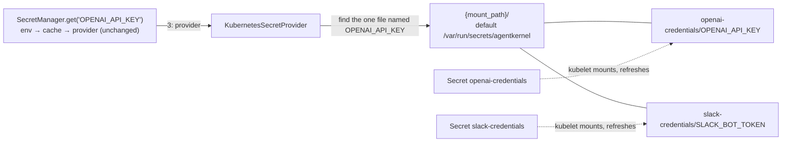

# #749 (phase 2): Resolve secrets from Kubernetes Secrets mounted into the pod

A built-in `kubernetes` secret provider for the `agentkernel.secret` capability from phase 1 (`docs/specs/749-secret-resolution/`), the Kubernetes counterpart of `aws_ssm`. Each Kubernetes Secret is mounted into the pod as its own read-only volume at `<mount_path>/<secret-name>/`, and the provider reads a key such as `OPENAI_API_KEY` from the one file of that name across them, never calling the API server. The Helm chart gains one opt-in value that mounts the listed Secrets into the tier that runs agents; resolution order, cache and key grammar are unchanged.

## Motivation

- On Kubernetes, model credentials reach pods only as per-key environment variables that the user wires into Helm values.
  - `ak-deployment/ak-k8s/chart/values.yaml:32-37`: `extraEnv` is "the natural place for model provider credentials", e.g. `OPENAI_API_KEY` via `secretKeyRef`.
  - `examples/k8s/openai-queue-mode/ak-values.yaml:17-22` does exactly that, and its `README.md:59` creates the Secret with `kubectl create secret generic openai --from-literal=api-key=…`.
  - Consequences:
    - Every new key is another Helm values edit plus a rollout.
    - Rotating a key needs a pod restart, because the kubelet resolves `secretKeyRef` env vars only when the container starts.
- Phase 1 gave AWS a managed store (`aws_ssm`), but Kubernetes has no equivalent.
  - `ak-py/src/agentkernel/secret/factory.py:9`: `_BUILTIN_SECRET_PROVIDERS = ["env", "aws_ssm"]`.
  - Today a Kubernetes user's only option is a bring-your-own dotted-path provider.
- No app tier mounts any volume today.
  - The io, agent-runner and ws-gateway Deployments declare no `volumes` or `volumeMounts` (e.g. `templates/deployment-agent-runner.yaml:34-66`). The only `volumes` in the chart's templates is the Kafka cluster's (`templates/kafka-cluster.yaml:25`).
  - Secrets reach containers only through `env` (`extraEnv`) and `envFrom` (`extraEnvFrom`, `values.yaml:38-39`).
- Why mounted volumes rather than reading Secrets from the API server:
  - The kubelet already delivers each Secret to the pod: no ServiceAccount, Role or RoleBinding, and no API-server round trip per `get`.
  - A missing Secret is caught by Kubernetes itself (the pod does not start), so a misconfiguration never reaches the application.
  - The provider is stdlib-only, so no new optional dependency lands in the runner image.
- Why one Secret per credential group rather than one Secret per deployment:
  - Separate ownership: RBAC `resourceNames` can give each team edit rights on only its own Secret (e.g. `openai-credentials` vs `slack-credentials`).
  - Independent lifecycles: a Secret synced by the External Secrets Operator from one source, or one that rotates often, changes without touching the others.
  - Each Secret stays within the 1 MiB Secret size limit on its own.
- Why not just keep `secretKeyRef`: it keeps working unchanged, because the environment is layer 1. Mounted volumes add two things that env vars cannot:
  - rotation without a pod restart: the kubelet refreshes a mounted Secret volume in place, so a `get` after `cache_ttl` expires, or after `invalidate`, sees the new value. A value handed to an SDK once at startup still needs a restart, the same caveat as phase 1;
  - new keys in an existing Secret with no Helm edit. A new *Secret* is still a Helm values edit and a rollout.

## Requirements

### Addressing and resolution

- **Resolution order is unchanged**: environment, then cache, then provider (phase 1's `SecretManager`). A set, non-empty environment variable always wins, so an existing `secretKeyRef` injection takes precedence over the mounted Secrets.
- **Multiple Secrets, each mounted whole as its own volume**, at **`<mount_path>/<secret-name>/`**, with `mount_path` defaulting to `/var/run/secrets/agentkernel`:

  ```
  /var/run/secrets/agentkernel/
  ├── openai-credentials/      ← Secret openai-credentials
  │   └── OPENAI_API_KEY
  └── slack-credentials/       ← Secret slack-credentials
      ├── SLACK_BOT_TOKEN
      └── SLACK_SIGNING_SECRET
  ```

  - Each data key appears as one file named after the key. The **file name is the AK key verbatim**; the value is returned verbatim (no strip, no base64).
  - The phase-1 key grammar (`^[A-Z][A-Z0-9_]*$`) is validated before the provider runs, so a key can never address a path outside `mount_path`.
- **Lookup: the key is looked up by name across the mounted Secrets.** The application asks for `OPENAI_API_KEY`, not `openai-credentials/OPENAI_API_KEY`; `SecretManager.get(key)` is unchanged.
  - Searched: `<mount_path>/<KEY>` and `<mount_path>/<secret-name>/<KEY>`; nothing deeper. The kubelet's own bookkeeping entries in a Secret volume are never read as Secrets.
  - Exactly one match: its value is returned.
  - No match: a miss.
  - **More than one match: `SecretError`.** The same key in two Secrets is ambiguous; the message names the conflicting paths, never the values.
- **Secret key compatibility.**
  - Only data keys that match the key grammar are reachable. A Secret whose data keys do not (e.g. `api-key`, `openai_api_key`) is mounted, but those keys can never be looked up; the lookup is a miss, not an error.
  - There is no key remapping (see *Non-goals*): the data key must already be the AK key.
  - The docs show how to create compatible keys: `kubectl create secret generic … --from-literal=OPENAI_API_KEY=…` or `--from-env-file`, and the External Secrets Operator's target template for Secrets synced from an external store.
- **The mount directory is configurable** through `secret.provider.kubernetes.mount_path` (see *Configuration*).
  - The chart always mounts under the default and does not set the field.
  - The override is for Secrets mounted outside the chart: a hand-written Deployment, a tool that writes one file per key (the Secrets Store CSI driver, Docker / Compose secrets), or local development.
- **`secret.prefix` is ignored by this provider.** The pod's mounts are the deployment scope.
- Rotation: the user updates a Secret; once the kubelet has refreshed that volume, the next `get` after `cache_ttl` expires, or after `invalidate(key)`, returns the new value, with no restart.
  - Each Secret's volume refreshes independently.
  - The worst-case pickup delay is the kubelet refresh delay plus `cache_ttl`.
  - Rotation and new-key pickup require whole-Secret mounts, so the chart mounts every Secret whole.
- The phase-1 rule still applies: resolve during startup, not on the request hot path. An uncached `get` costs only local filesystem calls.



### Provider

- `KubernetesSecretProvider(SecretProvider)` in `ak-py/src/agentkernel/secret/providers/kubernetes.py`, short name **`kubernetes`**, logger `ak.secret.provider.kubernetes`.
  - Built from `secret.provider.kubernetes.mount_path`; an empty or relative path is an `AKConfigError`.
  - Construction does no I/O, so a missing mount fails at the first `get`, not at `SecretManager.current()`.
  - Every `get_secret` re-discovers the Secrets, so a Secret added or removed by a rollout, or a key moved between Secrets, is picked up without stale state.
  - No mutable state and no cache (the manager caches), so concurrent calls are safe.
- Factory: a `kubernetes` branch in `SecretProviderFactory`, with **no `require_extra`** (stdlib only); `_BUILTIN_SECRET_PROVIDERS` gains `kubernetes`. The dotted-path bring-your-own branch is unchanged.
- Contract: the provider passes `SecretProviderContract` (`secret/testing.py`) with `reads_environment = False`, seeded across more than one Secret directory.

### Error handling

- **Miss** (returns `None`): no file named `key`, or the one matching file is empty (as `EnvSecretProvider` treats an empty value).
- **Failure** (`SecretError`, never masked by `get(key, default=…)`, `secret/manager.py:68`):
  - **`mount_path` does not exist or is not a directory.** The deployment is misconfigured; this is not a per-key miss, so a wrong mount fails loudly instead of every `get` silently returning its default. The message names the directory and how to fix it.
  - **The key exists in more than one place.**
  - Any other filesystem error listing or reading, e.g. a permission error.
  - A file that is not valid UTF-8.
- A listed Secret that does not exist never reaches the provider: Kubernetes keeps the pod from starting, because every volume is non-optional.
- No secret value appears in a log record, an exception message or a trace, as in phase 1.

### Configuration

- Reuses phase 1's `_SecretConfig` (`ak-py/src/agentkernel/core/config.py:911-924`):
  - `secret.provider.type: kubernetes` is the only opt-in; no `enabled` flag.
  - `secret.cache_ttl` is the rotation-pickup window on top of the kubelet's refresh, meaning unchanged.
  - `secret.prefix` is not read.
- **One new field: `secret.provider.kubernetes.mount_path`** (`AK_SECRET__PROVIDER__KUBERNETES__MOUNT_PATH`), default `/var/run/secrets/agentkernel`, never required.
  - A per-backend block under `_SecretProviderConfig` (`core/config.py:902-908`), the shape of `sandbox.kubernetes`.
  - Why it cannot be derived: no existing field names a filesystem location for secrets, and the mount location is decided by whoever writes the pod spec.
  - Read only by `KubernetesSecretProvider`.
- **No field lists the Secrets.** The provider discovers them under `mount_path`, so the list lives only in the chart's `secretStore.secrets`.
- It does not reuse `sandbox.kubernetes.*` (`core/config.py:737`), which configures where sandbox pods are created, a different concern.
- The `provider.type` and `prefix` field descriptions name the new provider. Existing YAML and `AK_*` environment variables are unaffected, and the default (`env`) is unchanged.

### Deployment (`ak-deployment/ak-k8s/chart`)

- **One opt-in value**, the analog of the `ssm_enabled` Terraform variable:

```yaml
secretStore:
  enabled: false        # mount each listed Secret read-only at /var/run/secrets/agentkernel/<name> in the agent-executing tier
  secrets: []           # required (at least one) when enabled; Secrets the user creates in the release namespace
  # - name: openai-credentials
  # - name: slack-credentials
```

- Each entry is an object with a required `name`, so a later per-Secret option can be added without breaking values. Names are used as given, not derived from the release name.
- Any existing Secret in the release namespace can be listed, including one created by the External Secrets Operator; its keys are reachable only if they follow *Secret key compatibility*.
- **Additive only.** Everything is gated on `secretStore.enabled`; with the defaults `helm template` renders identically to today.
- When enabled, the agent-executing Deployment mounts **each listed Secret whole, read-only and non-optional** at `/var/run/secrets/agentkernel/<name>`.
- **Least privilege: only the tier that executes agents mounts the Secrets**, the chart analog of the Terraform `ssm_enabled && !queue_mode` split:
  - `agentRunner.enabled: true` (the default, `values.yaml:145`): agent-runner. The io tier runs only the Request and Response Handlers.
  - `agentRunner.enabled: false` with `transport.type: in_memory` (the single-process profile, `values-dev.yaml:41-55`): io, because only on `in_memory` does the io pod run the whole pipeline (`templates/deployment-io.yaml:3-6`).
  - Any other combination has no agent-executing tier in the release (e.g. the runner runs outside the cluster), so `secretStore.enabled` fails the render rather than mounting Secrets into a tier that does not need them.
  - The ws-gateway and sandbox-worker tiers never mount them. Per-tier Secret selection is a non-goal.
- **Invalid `secretStore` values fail `helm template` / `helm install` with a clear message**, in every release, not only when an agent-executing Deployment renders:
  - enabled with an empty `secrets` list;
  - an entry that is not an object, or has no `name`;
  - a name listed twice;
  - no agent-executing tier (above).
- **No RBAC**: no ServiceAccount, Role, RoleBinding or `serviceAccountName`, because the kubelet, not the pod, reads the Secrets.
- The chart has no value for the base mount path and does not set `AK_SECRET__PROVIDER__*`; the application's `config.yaml` selects the provider ("app declares WHAT, chart injects WHERE", `templates/configmap-env.yaml:3`).
- The chart **does not create the Secrets**.

### Security

- Every key of every mounted Secret is readable by any code running in the agent-executing container, not only the keys the application fetches. That includes code run by the `local_subprocess` sandbox, which inherits the container's filesystem and environment (`sandbox/providers/local_subprocess.py:56`).
  - This is the same exposure as env vars injected with `extraEnv`, not a new one, but it covers every key in every listed Secret.
- The docs state this and recommend listing only the Secrets the agents need, keeping unrelated keys out of those Secrets, and running untrusted code in an isolated sandbox provider rather than `local_subprocess`.

### Examples and docs

- **`examples/k8s/openai-queue-mode` moves to the mounted-Secret path.**
  - Its config selects `secret.provider.type: kubernetes`; its `ak-values.yaml` enables `secretStore` with `openai-credentials` and drops the `OPENAI_API_KEY` `secretKeyRef`.
  - `app_agent_runner.py` hands `SecretManager.current().get("OPENAI_API_KEY")` to the SDK at startup, as `examples/aws-serverless/openai/lambda_agent_runner.py:8` does.
  - The README creates `openai-credentials` with an `OPENAI_API_KEY` data key, shows how a second Secret is added, and documents rotation.
  - Only the runner uses OpenAI, so dropping the top-level `extraEnv` from the io and ws-gateway tiers is safe.
- **CI exercises both paths.** The `kind-smoke` `dev` flavor resolves the key from the mounted Secret end to end; the `baremetal` and `eks` flavors keep `secretKeyRef`, covering the environment-first path. Chart renders cover both mount placements and every invalid-value failure.
- **Docs** (`docs/docs/advanced/secrets.md`, `ak-deployment/ak-k8s/README.md`) cover:
  - the provider, the layout, the lookup across Secrets and the duplicate-key error;
  - Secret key compatibility: the key grammar, no remapping, and how to create compatible keys (`--from-literal`, `--from-env-file`, ESO target template);
  - the `mount_path` override and other file-per-key mounts (Secrets Store CSI driver, Docker / Compose secrets);
  - the `secretStore` values, the tier placement rule, and the volumes and mounts they render;
  - creating, adding and rotating Secrets, including the kubelet refresh delay and the whole-Secret mount rule;
  - the *Security* exposure and recommendations;
  - **local development**: an image configured for `kubernetes` needs either every key in the environment (which wins), or `mount_path` pointed at a local directory laid out as `<dir>/<secret-name>/<KEY>` (or flat `<dir>/<KEY>`); a missing mount is an error even with a default;
  - that env (`secretKeyRef`) still wins.
- Every surface that lists the built-in providers gains `kubernetes`, per the `ak-dev-new-secret-provider` checklist (READMEs, dev skills, bundled user skills).

## Non-goals

- **Reading Secrets from the Kubernetes API.** The provider never calls the API server and the chart grants no `secrets` RBAC.
- **Merging Secrets into one volume** (a `projected` volume). Each Secret is its own volume.
- **Addressing a key by Secret** (e.g. `openai-credentials/OPENAI_API_KEY`). A key name must be unique across the mounted Secrets.
- **Key remapping** (`items`, aliases, case folding). A data key must already be the AK key; projecting only listed `items` would also hide new keys.
- **Precedence between Secrets.** A duplicated key is an error, not a "first Secret wins" rule.
- **Cross-namespace Secrets.** A pod can only mount a Secret from its own namespace.
- **Injecting secrets as environment variables** (`envFrom` on a Secret). `env` already reads those, without rotation or new-key pickup.
- **Per-tier Secret selection**, per-key filtering within a Secret, or mounting Secrets into tiers that do not execute agents.
- **Optional Secrets** (`optional: true`). Every listed Secret must exist.
- Watch- or inotify-driven push rotation. Rotation is pull-based through `cache_ttl` / `invalidate`.
- Creating, writing or rotating Secrets from the runtime or the chart.
- External Secrets Operator, the Secrets Store CSI driver, Vault, and cloud KMS envelope encryption. These operate below or beside a Kubernetes Secret and stay compatible with this provider.
- Migrating examples other than `examples/k8s/openai-queue-mode`.

## Open questions

- **The manual `ct install` gate** (`ak-deployment/ak-k8s/README.md:342-351`) installs the example images with no OpenAI key; once the runner resolves the key at startup, it would crash-loop. Proposed in `spec.md` (*Open decision*): leave `chart/ci/kind-smoke-values.yaml` unchanged and pass a placeholder `OPENAI_API_KEY` on the README's `ct install` command. No workflow runs `ct install`, so CI is unaffected.
