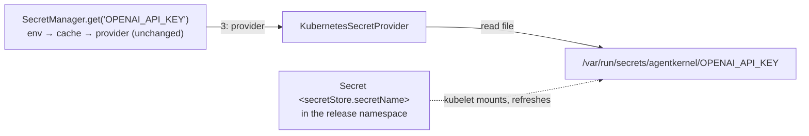

# #749 (phase 2): Resolve secrets from a Kubernetes Secret mounted into the pod

A built-in `kubernetes` secret provider for the `agentkernel.secret` capability that shipped in phase 1 (`docs/specs/749-secret-resolution/`). It plays the role on Kubernetes that `aws_ssm` plays on AWS. **The Kubernetes Secret is attached to the pod as a read-only volume**, and the provider reads a key such as `OPENAI_API_KEY` from the file of the same name in that volume. The provider never calls the API server, so it needs no ServiceAccount, no RBAC and no `kubernetes` package. The resolution order, the cache and the key grammar stay unchanged: an environment variable that is set still wins. The Helm chart gains one opt-in value that mounts one named Secret into the tier that runs agents.

## Motivation

- On Kubernetes, model credentials reach pods only as per-key environment variables that the user wires into Helm values.
  - `ak-deployment/ak-k8s/chart/values.yaml:32-37`: `extraEnv` is "the natural place for model provider credentials", e.g. `OPENAI_API_KEY` via `secretKeyRef`.
  - `examples/k8s/openai-queue-mode/ak-values.yaml:17-22` does exactly that, and its `README.md:59` creates the Secret with `kubectl create secret generic openai --from-literal=api-key=…`.
  - Consequences:
    - Every new key is another Helm values edit plus a rollout.
    - Rotating a key needs a pod restart, because the kubelet resolves `secretKeyRef` env vars only when the container starts.
- Phase 1 gave AWS a managed store (`aws_ssm`), but Kubernetes has no equivalent.
  - `ak-py/src/agentkernel/secret/factory.py:9`: `_BUILTIN_SECRET_PROVIDERS = ["env", "aws_ssm"]`.
  - Today a Kubernetes user's only option is a bring-your-own dotted-path provider.
- No app tier mounts any volume today.
  - The io, agent-runner and ws-gateway Deployments declare no `volumes` or `volumeMounts` (e.g. `templates/deployment-agent-runner.yaml:34-66`). The only `volumes` in the chart's templates is the Kafka cluster's (`templates/kafka-cluster.yaml:25`).
  - Secrets reach containers only through `env` (`extraEnv`) and `envFrom` (`extraEnvFrom`, `values.yaml:38-39`).
- Why a mounted volume rather than reading the Secret from the API server:
  - The kubelet already delivers the Secret to the pod. Reading it from a file needs no ServiceAccount, Role or RoleBinding, and no API-server round trip per `get`.
  - A missing Secret is caught by Kubernetes itself: a non-`optional` secret volume keeps the pod in `ContainerCreating` with a `FailedMount` event, so a misconfiguration never reaches the application.
  - The provider is stdlib-only, so no new optional dependency lands in the runner image.
- Why not just keep `secretKeyRef`: it keeps working unchanged, because the environment is layer 1. A mounted volume adds two things that env vars cannot:
  - rotation without a pod restart. The kubelet refreshes a mounted Secret volume in place after the Secret changes (Kubernetes docs: within the kubelet sync period plus its Secret-cache delay). Code that calls `get` again after `cache_ttl` expires, or after `invalidate`, sees the new value. A value handed to an SDK once at startup, such as `set_default_openai_key`, still needs a restart, the same caveat as phase 1;
  - new keys with no Helm edit: add a data key to the one Secret, and the kubelet projects it as a new file.

## Requirements

### Addressing and resolution

- **Resolution order is unchanged**: environment, then cache, then provider (phase 1's `SecretManager`). A set, non-empty environment variable always wins, so an existing `secretKeyRef` injection takes precedence over the mounted Secret.
- **One Secret per deployment, mounted whole** at the fixed directory **`/var/run/secrets/agentkernel`**.
  - Each data key of the Secret appears as one file named after the key. The **file name is the AK key verbatim**: `OPENAI_API_KEY` is read from `/var/run/secrets/agentkernel/OPENAI_API_KEY`.
    - No case folding is needed. Every key matching the phase-1 grammar `^[A-Z][A-Z0-9_]*$` is a valid Secret data key, since data keys allow `[-._a-zA-Z0-9]+`.
    - The grammar has no `/` or `.`, and `SecretManager.get` validates it before the provider is called, so a key can never address a path outside the mount directory.
  - The provider reads the file's bytes, decodes them as UTF-8, and returns them verbatim. Whitespace and newlines are preserved, matching the contract's round-trip test. The kubelet writes decoded values, so there is no base64 step.
- **The directory is a fixed convention, not a configuration field.** The chart mounts there and the provider reads there.
  - The constructor takes the directory as a parameter defaulting to that constant, so tests and bring-your-own subclasses can point it elsewhere; `create(config)` always uses the default.
- **`secret.prefix` is ignored by this provider.** The mount itself scopes the store to one deployment: the pod sees only the Secret its Deployment mounts.
- Rotation: the user updates the Secret (`kubectl apply`, or `kubectl create secret … --dry-run=client -o yaml | kubectl apply -f -`). Once the kubelet has refreshed the volume, the next `get` after `cache_ttl` expires, or after `invalidate(key)`, returns the new value, with no restart.
  - The worst-case pickup delay is the kubelet refresh delay plus `cache_ttl`.
  - Rotation requires the whole-Secret mount. A `subPath` mount, or a volume that projects only listed `items`, is never refreshed or never shows new keys, so the chart uses neither.
- The phase-1 rule still applies: resolve during startup, not on the request hot path. An uncached `get` is one local file read.



### Provider

- `KubernetesSecretProvider(SecretProvider)` in `ak-py/src/agentkernel/secret/providers/kubernetes.py`, short name **`kubernetes`**, logger `ak.secret.provider.kubernetes`. The name matches the sandbox provider of the same backend.
  - It inherits the default `create(config)` from `secret/base.py:13-19`, which takes no settings, as `EnvSecretProvider` does (`secret/providers/env.py`).
  - Construction does no I/O, so a missing mount fails at the first `get`, not at `SecretManager.current()`.
  - `get_secret(key)` reads one file. The provider holds no mutable state and does not cache (that is the manager's job), so concurrent calls need no lock.
- Factory: a `kubernetes` branch in `SecretProviderFactory` (`secret/factory.py`), next to the `env` branch.
  - It has **no `require_extra`**: the provider imports only the standard library.
  - `_BUILTIN_SECRET_PROVIDERS` becomes `["env", "aws_ssm", "kubernetes"]`.
- Contract: the provider passes `SecretProviderContract` (`secret/testing.py`) with `reads_environment = False`.
  - The `provider` fixture points the directory at a `tmp_path`, and seeding writes the value to `<tmp_path>/<key>`.

### Error handling

- **Miss** (returns `None`):
  - the mount directory exists but has no file named `key`;
  - the file is empty, matching `EnvSecretProvider`'s "an empty value is a miss" (`secret/providers/env.py`).
- **Failure** (`SecretError`, with the original exception chained):
  - **The mount directory does not exist.** The volume is not attached, so the deployment is misconfigured; this is not a per-key miss.
    - This is the analog of the earlier design's "Secret missing" failure. The Secret is the whole store, so its absence is not a miss.
    - A wrong mount fails loudly instead of letting every `get(key, default=…)` silently return its default. `SecretManager.get` never masks a `SecretError` with `default` (`secret/manager.py:68`), so this holds for callers that pass a default as well.
    - The message names the directory and says to set `secretStore.enabled` and `secretStore.secretName` in the chart, or mount a Secret there.
  - Any other `OSError` while reading the file, e.g. a permission error.
  - A file that is not valid UTF-8.
- No secret value appears in a log record, an exception message or a trace. Messages carry only the key and the path, as in phase 1.

### Configuration

- **No new configuration fields.** The provider reuses phase 1's `_SecretConfig` (`ak-py/src/agentkernel/core/config.py:911-924`) whole:
  - `secret.provider.type: kubernetes` is the only opt-in.
  - `secret.cache_ttl` is the rotation-pickup window on top of the kubelet's refresh, with its meaning unchanged.
  - `secret.prefix` is not read (see *Addressing and resolution*).
- No `secret.provider.kubernetes` block:
  - The mount directory is a fixed convention shared by the chart and the provider. A field would only let the two drift apart.
  - It does not reuse `sandbox.kubernetes.*` (`_SandboxKubernetesConfig`, `core/config.py:737`), which configures where sandbox pods are created, a different concern.
- Only field **descriptions** change:
  - `_SecretProviderConfig.type` (`core/config.py:902-908`) lists `kubernetes` and says it reads the Secret mounted at `/var/run/secrets/agentkernel`.
  - `_SecretConfig.prefix` (`:914-918`) says it is ignored by `kubernetes` as well as `env`.
- Existing YAML and `AK_*` environment variables are unaffected, and the default (`env`) is unchanged.

### Deployment (`ak-deployment/ak-k8s/chart`)

- **One opt-in value**, the analog of the `ssm_enabled` Terraform variable:

```yaml
secretStore:
  enabled: false        # mount Secret <secretName> read-only at /var/run/secrets/agentkernel in the agent-executing tier
  secretName: ""        # required when enabled; the Secret the user creates in the release namespace
```

- **`secretStore.secretName` is required when `secretStore.enabled`.** It has no default.
  - An empty value fails `helm template` / `helm install` with `required "secretStore.secretName is required when secretStore.enabled"`. This is the chart's existing pattern (`templates/configmap-env.yaml:48`, `templates/gateway.yaml:40`).
  - Why not default to a name derived from the fullname: the user has to create a Secret whose name they can read straight from their values, and a derived name silently changes with `fullnameOverride`, `nameOverride` or the release name.
  - Any existing Secret works, including one created by the External Secrets Operator.
- **Additive only.** Every new entry is gated on `secretStore.enabled`, so with the defaults `helm template` renders identically to today's output.
- When enabled, the agent-executing Deployment gets:
  - a pod `volume` of type `secret` with `secretName: <secretStore.secretName>` and **`optional: false`**, and no `items`;
  - a container `volumeMount` at `/var/run/secrets/agentkernel` with **`readOnly: true`** and no `subPath`.
  - `defaultMode` stays at the Kubernetes default (`0644`) so non-root images can read the files; access is limited by which pod mounts the volume.
- **Least privilege: only the tier that executes agents mounts the Secret.** This is the chart analog of the Terraform `ssm_enabled && !queue_mode` split.
  - When `agentRunner.enabled: true` (the default, `values.yaml:145`), that tier is agent-runner. The io tier runs only the Request and Response Handlers.
  - When `agentRunner.enabled: false` (the single-process profile, `values-dev.yaml:48-49`), the agents run inside the io pod, so the io Deployment mounts it instead.
  - The ws-gateway and sandbox-worker tiers never mount it.
- **No RBAC.** No ServiceAccount, Role or RoleBinding is created, and no `serviceAccountName` is set, because the kubelet, not the pod, reads the Secret.
- **No drift**: one `_helpers.tpl` helper owns the mount path and the volume name, and both the `volume` and the `volumeMount` use it.
- The chart **does not create the Secret** and does not set `AK_SECRET__PROVIDER__TYPE`. The application's `config.yaml` selects the provider, the same "app declares WHAT, chart injects WHERE" split that `templates/configmap-env.yaml:3` states.

### Examples and docs

- **`examples/k8s/openai-queue-mode` moves to the mounted-Secret path.**
  - Its `config.*.yaml` selects `secret.provider.type: kubernetes`, and its `ak-values.yaml` sets `secretStore.enabled: true` and `secretStore.secretName: ak-openai-queue-mode`, and drops the `OPENAI_API_KEY` `secretKeyRef` entry.
  - `app_agent_runner.py` calls `set_default_openai_key(SecretManager.current().get("OPENAI_API_KEY"))` at startup, as `examples/aws-serverless/openai/lambda_agent_runner.py:8` does.
  - The README replaces `kubectl create secret generic openai …` with `kubectl create secret generic ak-openai-queue-mode --from-literal=OPENAI_API_KEY="$OPENAI_API_KEY"`, and documents rotation.
  - The example's `pyproject.toml` needs no new extra, because the provider is stdlib-only.
  - Removing the top-level `extraEnv` takes the key away from every tier. That is safe: only `app_agent_runner.py` uses OpenAI, and `app_io_handler.py` and `app_ws_gateway.py` never read `OPENAI_API_KEY`.
- **CI exercises the mounted-Secret path on kind.** The `kind-smoke` job in `.github/workflows/chart-test.yaml` deploys this example for the `dev` flavor.
  - Its `Install chart` step (`:147-149`) also creates `ak-openai-queue-mode` with an `OPENAI_API_KEY` data key, so the existing "Chat request through NATS" check proves resolution end to end. In that flavor `agentRunner` is enabled, so the mount lands on the runner.
  - The `baremetal` and `eks` flavors keep `extraEnv` + `secretKeyRef` (`:165-167`), so CI keeps covering the environment-first path too. Those flavors still need the `openai` Secret, so the step creates both.
  - The `helm template` render loop (`:69-91`) gains `secretStore.enabled=true,secretStore.secretName=<n>` renders, with and without `agentRunner.enabled=false`, to cover both mount placements.
    - It also gains one expected-failure render with `secretStore.enabled=true` and no `secretName`, which asserts the `required` error.
- The other Kubernetes examples (`examples/sandbox/broker-*`) keep `secretKeyRef` unchanged.
- `ak-deployment/ak-k8s/README.md` and `docs/docs/advanced/secrets.md` document:
  - the provider, the mount directory and the file-per-key rule;
  - the `secretStore` values and the exact volume and mount they render;
  - creating and rotating the Secret, including the kubelet refresh delay and the no-`subPath` rule;
  - that env (`secretKeyRef`) still wins.
- The remaining surfaces that list the built-in providers (`env`, `aws_ssm`) gain `kubernetes`. Per the `ak-dev-new-secret-provider` checklist:
  - `ak-py/README.md`;
  - `.agents/skills/ak-dev-architecture/SKILL.md` (*Secret Resolution*);
  - `.agents/skills/ak-dev-new-secret-provider/SKILL.md` (*Existing Providers*), with a note that its step 6, deployment wiring, has a Helm analog (a volume mount, not an IAM grant);
  - the bundled `ak-cloud-deploy` and `ak-add-capabilities` skills under `ak-py/src/agentkernel/skills/`.

## Non-goals

- **Reading Secrets from the Kubernetes API.** The kubelet delivers the Secret; the provider never calls the API server and the chart grants no `secrets` RBAC.
- **More than one Secret per deployment**, or one Secret per key. A user who needs keys from several Secrets merges them into one (e.g. with a `projected` volume of their own), outside this change.
- **Cross-namespace Secrets.** A pod can only mount a Secret from its own namespace.
- **Injecting secrets as environment variables** (`envFrom` on the Secret). That needs no provider, since `env` already reads it, and it loses rotation and new-key pickup.
- Watch- or inotify-driven push rotation. Rotation is pull-based through `cache_ttl` / `invalidate`.
- Creating, writing or rotating Secrets from the runtime or the chart.
- External Secrets Operator, the Secrets Store CSI driver, Vault, and cloud KMS envelope encryption. These operate below or beside a Kubernetes Secret and stay compatible with this provider.
- Mounting the Secret into the io, ws-gateway or sandbox-worker tiers when they do not execute agents.
- Migrating examples other than `examples/k8s/openai-queue-mode`.

## Open questions

- Should the mount directory be overridable through a field (e.g. `secret.provider.kubernetes.mount_path`) for users who mount the Secret themselves outside the chart? This design keeps it fixed at `/var/run/secrets/agentkernel` to avoid chart/provider drift.
