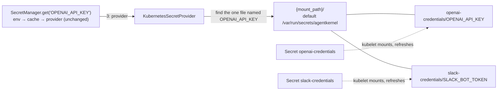

# #749 (phase 2): Resolve secrets from Kubernetes Secrets mounted into the pod

A built-in `kubernetes` secret provider for the `agentkernel.secret` capability that shipped in phase 1 (`docs/specs/749-secret-resolution/`). It plays the role on Kubernetes that `aws_ssm` plays on AWS. **Each Kubernetes Secret is created separately and attached to the pod as its own read-only volume**, at `<mount_path>/<secret-name>/`. The provider reads a key such as `OPENAI_API_KEY` from the one file of that name across the mounted Secrets. The provider never calls the API server, so it needs no ServiceAccount, no RBAC and no `kubernetes` package. `mount_path` defaults to `/var/run/secrets/agentkernel` and has one optional override. The resolution order, the cache and the key grammar stay unchanged: an environment variable that is set still wins. The Helm chart gains one opt-in value that lists the Secrets to mount into the tier that runs agents.

## Motivation

- On Kubernetes, model credentials reach pods only as per-key environment variables that the user wires into Helm values.
  - `ak-deployment/ak-k8s/chart/values.yaml:32-37`: `extraEnv` is "the natural place for model provider credentials", e.g. `OPENAI_API_KEY` via `secretKeyRef`.
  - `examples/k8s/openai-queue-mode/ak-values.yaml:17-22` does exactly that, and its `README.md:59` creates the Secret with `kubectl create secret generic openai --from-literal=api-key=…`.
  - Consequences:
    - Every new key is another Helm values edit plus a rollout.
    - Rotating a key needs a pod restart, because the kubelet resolves `secretKeyRef` env vars only when the container starts.
- Phase 1 gave AWS a managed store (`aws_ssm`), but Kubernetes has no equivalent.
  - `ak-py/src/agentkernel/secret/factory.py:9`: `_BUILTIN_SECRET_PROVIDERS = ["env", "aws_ssm"]`.
  - Today a Kubernetes user's only option is a bring-your-own dotted-path provider.
- No app tier mounts any volume today.
  - The io, agent-runner and ws-gateway Deployments declare no `volumes` or `volumeMounts` (e.g. `templates/deployment-agent-runner.yaml:34-66`). The only `volumes` in the chart's templates is the Kafka cluster's (`templates/kafka-cluster.yaml:25`).
  - Secrets reach containers only through `env` (`extraEnv`) and `envFrom` (`extraEnvFrom`, `values.yaml:38-39`).
- Why mounted volumes rather than reading Secrets from the API server:
  - The kubelet already delivers each Secret to the pod. Reading a file needs no ServiceAccount, Role or RoleBinding, and no API-server round trip per `get`.
  - A missing Secret is caught by Kubernetes itself: a non-`optional` secret volume keeps the pod in `ContainerCreating` with a `FailedMount` event, so a misconfiguration never reaches the application.
  - The provider is stdlib-only, so no new optional dependency lands in the runner image.
- Why one Secret per credential group rather than one Secret per deployment:
  - Separate ownership: RBAC `resourceNames` can give each team edit rights on only its own Secret (e.g. `openai-credentials` vs `slack-credentials`).
  - Independent lifecycles: a Secret synced by the External Secrets Operator from one source, or one that rotates often, changes without touching the others.
  - Each Secret stays within the 1 MiB Secret size limit on its own.
- Why not just keep `secretKeyRef`: it keeps working unchanged, because the environment is layer 1. Mounted volumes add two things that env vars cannot:
  - rotation without a pod restart. The kubelet refreshes a mounted Secret volume in place after the Secret changes (Kubernetes docs: within the kubelet sync period plus its Secret-cache delay). Code that calls `get` again after `cache_ttl` expires, or after `invalidate`, sees the new value. A value handed to an SDK once at startup, such as `set_default_openai_key`, still needs a restart, the same caveat as phase 1;
  - new keys in an existing Secret with no Helm edit: add a data key, and the kubelet projects it as a new file. A new *Secret* is a Helm values edit and a rollout, because it adds a volume.

## Requirements

### Addressing and resolution

- **Resolution order is unchanged**: environment, then cache, then provider (phase 1's `SecretManager`). A set, non-empty environment variable always wins, so an existing `secretKeyRef` injection takes precedence over the mounted Secrets.
- **Multiple Secrets, each mounted whole as its own volume**, at **`<mount_path>/<secret-name>/`**, with `mount_path` defaulting to `/var/run/secrets/agentkernel`:

  ```
  /var/run/secrets/agentkernel/
  ├── openai-credentials/      ← Secret openai-credentials
  │   └── OPENAI_API_KEY
  └── slack-credentials/       ← Secret slack-credentials
      ├── SLACK_BOT_TOKEN
      └── SLACK_SIGNING_SECRET
  ```

  - Each data key appears as one file named after the key. The **file name is the AK key verbatim**.
    - No case folding is needed. Every key matching the phase-1 grammar `^[A-Z][A-Z0-9_]*$` is a valid Secret data key, since data keys allow `[-._a-zA-Z0-9]+`.
    - The grammar has no `/` or `.`, and `SecretManager.get` validates it before the provider is called, so a key can never address a path outside `mount_path`.
  - The provider reads the file's bytes, decodes them as UTF-8, and returns them verbatim. Whitespace and newlines are preserved, matching the contract's round-trip test. The kubelet writes decoded values, so there is no base64 step.
- **Lookup: the key is looked up by name across the mounted Secrets.** The application asks for `OPENAI_API_KEY`, not `openai-credentials/OPENAI_API_KEY`; the phase-1 key grammar and `SecretManager.get(key)` are unchanged.
  - Candidates are `<mount_path>/<KEY>` and `<mount_path>/<dir>/<KEY>` for every immediate subdirectory `<dir>` of `mount_path`. No deeper levels are searched.
  - Entries whose names start with `.` are skipped. A Secret volume holds the kubelet's own `..data` and `..<timestamp>` entries next to the key files, and these must not be read as Secrets.
  - The top-level candidate keeps `mount_path` usable for tools that write one flat directory of files (see *Configuration*).
  - Exactly one candidate exists: its value is returned.
  - No candidate exists: a miss.
  - **More than one candidate exists: `SecretError`.** The same key in two Secrets is ambiguous, and picking one by directory order would make the value depend on Secret names. The message names the conflicting paths, never the values.
- **The mount directory is configurable** through `secret.provider.kubernetes.mount_path` (see *Configuration*).
  - The chart always mounts under the default and does not set the field, so a chart install needs no extra configuration and the two cannot drift.
  - The override is for Secrets mounted outside the chart: a hand-written Deployment, or a tool that writes one file per key, such as the Secrets Store CSI driver (Vault, AWS Secrets Manager, Azure Key Vault) or Docker / Compose secrets (`/run/secrets`).
- **`secret.prefix` is ignored by this provider.** The mounts scope the store to one deployment: the pod sees only the Secrets its Deployment mounts.
- Rotation: the user updates a Secret (`kubectl apply`, or `kubectl create secret … --dry-run=client -o yaml | kubectl apply -f -`). Once the kubelet has refreshed that volume, the next `get` after `cache_ttl` expires, or after `invalidate(key)`, returns the new value, with no restart.
  - Each Secret's volume refreshes independently.
  - The worst-case pickup delay is the kubelet refresh delay plus `cache_ttl`.
  - Rotation requires whole-Secret mounts. A `subPath` mount, or a volume that projects only listed `items`, is never refreshed or never shows new keys, so the chart uses neither.
- The phase-1 rule still applies: resolve during startup, not on the request hot path. An uncached `get` lists `mount_path` once and checks one path per mounted Secret; all local filesystem calls.



### Provider

- `KubernetesSecretProvider(SecretProvider)` in `ak-py/src/agentkernel/secret/providers/kubernetes.py`, short name **`kubernetes`**, logger `ak.secret.provider.kubernetes`. The name matches the sandbox provider of the same backend.
  - `create(config)` builds the provider from `config.provider.kubernetes.mount_path`, overriding the default in `secret/base.py:13-19`, as `aws_ssm` does with `config.prefix`.
  - **Mount-path validation**, at construction and without touching the filesystem: an empty or relative path raises `AKConfigError`. The path is used as given; it is not resolved or normalized.
  - Construction does no I/O, so a missing mount fails at the first `get`, not at `SecretManager.current()`.
  - `get_secret(key)` performs the lookup above on every call. It does not remember which Secret held a key, so a Secret added or removed by a rollout, or a key moved between Secrets, is picked up without stale state.
  - The provider holds no mutable state and does not cache (that is the manager's job), so concurrent calls need no lock.
- Factory: a `kubernetes` branch in `SecretProviderFactory` (`secret/factory.py`), next to the `env` branch.
  - It has **no `require_extra`**: the provider imports only the standard library.
  - `_BUILTIN_SECRET_PROVIDERS` becomes `["env", "aws_ssm", "kubernetes"]`.
- Contract: the provider passes `SecretProviderContract` (`secret/testing.py`) with `reads_environment = False`.
  - The `provider` fixture points `mount_path` at a `tmp_path`, and seeding writes the value to `<tmp_path>/<secret-dir>/<key>`, spreading keys over two Secret directories so the contract runs against the multi-Secret layout.
- Provider-specific tests, beyond the contract:
  - a key in the top-level directory resolves;
  - the same key in two Secret directories, or at the top level and in a Secret directory, raises `SecretError` naming both paths;
  - `..data` and other dot-entries are skipped, including a `..data/<KEY>` that duplicates a real key;
  - keys deeper than one subdirectory are not found.

### Error handling

- **Miss** (returns `None`):
  - no candidate file named `key` exists;
  - the one candidate file is empty, matching `EnvSecretProvider`'s "an empty value is a miss" (`secret/providers/env.py`).
- **Failure** (`SecretError`, with the original exception chained where there is one):
  - **`mount_path` does not exist, or is not a directory.** No Secret is attached or `mount_path` is wrong, so the deployment is misconfigured; this is not a per-key miss.
    - A wrong mount fails loudly instead of letting every `get(key, default=…)` silently return its default. `SecretManager.get` never masks a `SecretError` with `default` (`secret/manager.py:68`), so this holds for callers that pass a default as well.
    - The message names the directory and says to set `secretStore.enabled` and `secretStore.secrets` in the chart, mount Secrets there, or correct `secret.provider.kubernetes.mount_path`.
  - **The key exists in more than one place** (see *Lookup*).
  - Any other `OSError` while listing `mount_path` or reading a candidate, e.g. a permission error.
  - A file that is not valid UTF-8.
- A missing *Secret* never reaches the provider: Kubernetes keeps the pod from starting (`FailedMount`), because every volume is `optional: false`.
- No secret value appears in a log record, an exception message or a trace. Messages carry only the key and paths, as in phase 1.

### Configuration

- The provider reuses phase 1's `_SecretConfig` (`ak-py/src/agentkernel/core/config.py:911-924`) and adds **one optional field**:
  - `secret.provider.type: kubernetes` is the only opt-in.
  - `secret.cache_ttl` is the rotation-pickup window on top of the kubelet's refresh, with its meaning unchanged.
  - `secret.prefix` is not read (see *Addressing and resolution*).
- **New field: `secret.provider.kubernetes.mount_path`** (`AK_SECRET__PROVIDER__KUBERNETES__MOUNT_PATH`).
  - A new `_SecretKubernetesConfig` model with one field, `mount_path: str = "/var/run/secrets/agentkernel"`, attached to `_SecretProviderConfig` (`core/config.py:902-908`) as `kubernetes`, with a default factory. This is the per-backend block shape of `sandbox.kubernetes`.
  - Why it cannot be derived from existing config: no existing field names a filesystem location for secrets, and the mount location is decided by whoever writes the pod spec, not by the app.
  - Read only by `KubernetesSecretProvider.create`. Other providers ignore it.
  - Only the default is needed for chart installs; the field is never required.
- **No field lists the Secrets.** The provider discovers them from the subdirectories of `mount_path`, so the list of Secrets lives in one place, the chart's `secretStore.secrets`, and adding a Secret needs no application config change.
- It does not reuse `sandbox.kubernetes.*` (`_SandboxKubernetesConfig`, `core/config.py:737`), which configures where sandbox pods are created, a different concern.
- Field **descriptions** change:
  - `_SecretProviderConfig.type` lists `kubernetes` and says it reads one file per key from the Secrets mounted under `secret.provider.kubernetes.mount_path`.
  - `_SecretConfig.prefix` (`:914-918`) says it is ignored by `kubernetes` as well as `env`.
- Existing YAML and `AK_*` environment variables are unaffected, and the default (`env`) is unchanged.

### Deployment (`ak-deployment/ak-k8s/chart`)

- **One opt-in value**, the analog of the `ssm_enabled` Terraform variable:

```yaml
secretStore:
  enabled: false        # mount each listed Secret read-only at /var/run/secrets/agentkernel/<name> in the agent-executing tier
  secrets: []           # required (at least one) when enabled; Secrets the user creates in the release namespace
  # - name: openai-credentials
  # - name: slack-credentials
```

- **`secretStore.secrets` must list at least one Secret when `secretStore.enabled`.**
  - An empty list fails `helm template` / `helm install` with `fail "secretStore.secrets must list at least one Secret when secretStore.enabled"`.
  - Each entry needs a `name`; a missing one fails with `required "secretStore.secrets[].name is required"`. This is the chart's existing `required` pattern (`templates/configmap-env.yaml:48`, `templates/gateway.yaml:40`).
  - A name listed twice fails with `fail`, because two volumes cannot share a mount path.
  - With both `agentRunner.enabled` and `ioHandler.enabled` false (the standalone sandbox-worker install), no tier would mount the Secrets, so `secretStore.enabled` fails with `fail "secretStore.enabled needs an agent-executing tier: agentRunner.enabled or ioHandler.enabled"`.
  - The checks run in every release, not only when an agent-executing Deployment renders.
  - Entries are objects, not bare strings, so a later per-Secret option can be added without breaking existing values.
  - Names are not defaulted or derived from the fullname: the user creates each Secret and must be able to read its name straight from their values.
  - Any existing Secret works, including one created by the External Secrets Operator.
- **Additive only.** Every new entry is gated on `secretStore.enabled`, so with the defaults `helm template` renders identically to today's output.
- When enabled, the agent-executing Deployment gets, **for each listed Secret**:
  - a pod `volume` of type `secret` with `secretName: <name>` and **`optional: false`**, and no `items`;
  - a container `volumeMount` at `/var/run/secrets/agentkernel/<name>` with **`readOnly: true`** and no `subPath`.
  - The volume name is `ak-secret-<index>` (position in the list), not the Secret name: Secret names may contain `.` and run to 253 characters, which volume names (a DNS-1123 label, at most 63 characters) do not allow.
  - `defaultMode` stays at the Kubernetes default (`0644`) so non-root images can read the files; access is limited by which pod mounts the volumes.
- **Least privilege: only the tier that executes agents mounts the Secrets.** This is the chart analog of the Terraform `ssm_enabled && !queue_mode` split.
  - When `agentRunner.enabled: true` (the default, `values.yaml:145`), that tier is agent-runner. The io tier runs only the Request and Response Handlers.
  - When `agentRunner.enabled: false` (the single-process profile, `values-dev.yaml:48-49`), the agents run inside the io pod, so the io Deployment mounts them instead.
  - The ws-gateway and sandbox-worker tiers never mount them.
  - Every listed Secret goes to that one tier; per-tier Secret selection is a non-goal.
- **No RBAC.** No ServiceAccount, Role or RoleBinding is created, and no `serviceAccountName` is set, because the kubelet, not the pod, reads the Secrets.
- **No drift**: one `_helpers.tpl` helper owns the base mount path, the per-Secret path and the volume names, and both the `volumes` and the `volumeMounts` use it.
  - The chart has no value for the base mount path and does not inject `AK_SECRET__PROVIDER__KUBERNETES__MOUNT_PATH`; it mounts under the provider's default. A user who needs another location mounts the Secrets themselves and sets the field.
- The chart **does not create the Secrets** and does not set `AK_SECRET__PROVIDER__TYPE`. The application's `config.yaml` selects the provider, the same "app declares WHAT, chart injects WHERE" split that `templates/configmap-env.yaml:3` states.

### Examples and docs

- **`examples/k8s/openai-queue-mode` moves to the mounted-Secret path.**
  - Its `config.*.yaml` selects `secret.provider.type: kubernetes`, and its `ak-values.yaml` sets `secretStore.enabled: true` and `secretStore.secrets: [{name: openai-credentials}]`, and drops the `OPENAI_API_KEY` `secretKeyRef` entry.
  - `app_agent_runner.py` calls `set_default_openai_key(SecretManager.current().get("OPENAI_API_KEY"))` at startup, as `examples/aws-serverless/openai/lambda_agent_runner.py:8` does.
  - The README replaces `kubectl create secret generic openai …` with `kubectl create secret generic openai-credentials --from-literal=OPENAI_API_KEY="$OPENAI_API_KEY"`, shows how a second Secret is added to the list, and documents rotation.
  - The example's `pyproject.toml` needs no new extra, because the provider is stdlib-only.
  - Removing the top-level `extraEnv` takes the key away from every tier. That is safe: only `app_agent_runner.py` uses OpenAI, and `app_io_handler.py` and `app_ws_gateway.py` never read `OPENAI_API_KEY`.
- **CI exercises the mounted-Secret path on kind.** The `kind-smoke` job in `.github/workflows/chart-test.yaml` deploys this example for the `dev` flavor.
  - Its `Install chart` step (`:147-149`) also creates `openai-credentials` with an `OPENAI_API_KEY` data key, so the existing "Chat request through NATS" check proves resolution end to end. In that flavor `agentRunner` is enabled, so the mounts land on the runner.
  - The `baremetal` and `eks` flavors keep `extraEnv` + `secretKeyRef` (`:165-167`), so CI keeps covering the environment-first path too. Those flavors still need the `openai` Secret, so the step creates both.
  - The `helm template` render loop (`:69-91`) gains `secretStore` renders with **two** Secrets, with and without `agentRunner.enabled=false`, to cover both mount placements and the per-Secret volumes.
    - It also gains expected-failure renders, each asserting its error: `secretStore.enabled=true` with an empty `secrets` list; an entry without `name`; a duplicated name.
- The other Kubernetes examples (`examples/sandbox/broker-*`) keep `secretKeyRef` unchanged.
- `ak-deployment/ak-k8s/README.md` and `docs/docs/advanced/secrets.md` document:
  - the provider, the `<mount_path>/<secret-name>/<KEY>` layout, the lookup across Secrets and the duplicate-key error;
  - the `mount_path` override, and using it with other file-per-key mounts (Secrets Store CSI driver, Docker / Compose secrets);
  - the `secretStore` values and the exact volumes and mounts they render;
  - creating, adding and rotating Secrets, including the kubelet refresh delay and the no-`subPath` rule;
  - that env (`secretKeyRef`) still wins.
- The remaining surfaces that list the built-in providers (`env`, `aws_ssm`) gain `kubernetes`. Per the `ak-dev-new-secret-provider` checklist:
  - `ak-py/README.md`;
  - `.agents/skills/ak-dev-architecture/SKILL.md` (*Secret Resolution*);
  - `.agents/skills/ak-dev-new-secret-provider/SKILL.md` (*Existing Providers*), with a note that its step 6, deployment wiring, has a Helm analog (volume mounts, not an IAM grant);
  - the bundled `ak-cloud-deploy` and `ak-add-capabilities` skills under `ak-py/src/agentkernel/skills/`.

## Non-goals

- **Reading Secrets from the Kubernetes API.** The kubelet delivers the Secrets; the provider never calls the API server and the chart grants no `secrets` RBAC.
- **Merging Secrets into one volume** (a `projected` volume). Each Secret is its own volume, so each is visible and replaceable on its own.
- **Addressing a key by Secret** (e.g. `openai-credentials/OPENAI_API_KEY`). The phase-1 key grammar stays; a key name must be unique across the mounted Secrets.
- **Precedence between Secrets.** A duplicated key is an error, not a "first Secret wins" rule.
- **Cross-namespace Secrets.** A pod can only mount a Secret from its own namespace.
- **Injecting secrets as environment variables** (`envFrom` on a Secret). That needs no provider, since `env` already reads it, and it loses rotation and new-key pickup.
- **Per-tier Secret selection**, or mounting Secrets into the io, ws-gateway or sandbox-worker tiers when they do not execute agents.
- **Optional Secrets** (`optional: true`). Every listed Secret must exist.
- Watch- or inotify-driven push rotation. Rotation is pull-based through `cache_ttl` / `invalidate`.
- Creating, writing or rotating Secrets from the runtime or the chart.
- External Secrets Operator, the Secrets Store CSI driver, Vault, and cloud KMS envelope encryption. These operate below or beside a Kubernetes Secret and stay compatible with this provider.
- Migrating examples other than `examples/k8s/openai-queue-mode`.

## Open questions

- None.
