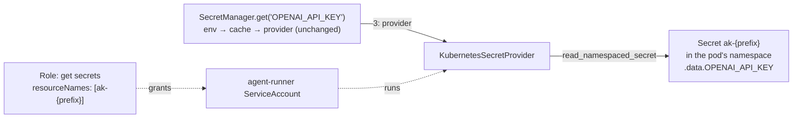

# #749 (phase 2): Resolve secrets from a Kubernetes Secret, the in-cluster managed store

A built-in `kubernetes` secret provider for the `agentkernel.secret` capability that shipped in phase 1 (`docs/specs/749-secret-resolution/`). It plays the role on Kubernetes that `aws_ssm` plays on AWS. The provider reads a key such as `OPENAI_API_KEY` from **one Kubernetes Secret per deployment**, named `ak-{prefix}` and living in the pod's own namespace, by calling the API server. The data key is the AK key itself, verbatim. The resolution order, the cache and the key grammar stay unchanged: an environment variable that is set still wins. The Helm chart gains one opt-in value. It gives the agent-runner tier a ServiceAccount, plus a Role that can `get` exactly that one Secret, and injects `AK_SECRET__PREFIX`.

## Motivation

- On Kubernetes, model credentials reach pods only as per-key environment variables that the user wires into Helm values.
  - `ak-deployment/ak-k8s/chart/values.yaml:32-37`: `extraEnv` is "the natural place for model provider credentials", e.g. `OPENAI_API_KEY` via `secretKeyRef`.
  - `examples/k8s/openai-queue-mode/ak-values.yaml:17-22` does exactly that, and its `README.md:59` creates the Secret with `kubectl create secret generic openai --from-literal=api-key=…`.
  - Consequences:
    - Every new key is another Helm values edit plus a rollout.
    - Rotating a key needs a pod restart, because the kubelet resolves `secretKeyRef` env vars only when the container starts.
- Phase 1 gave AWS a managed store (`aws_ssm`), but Kubernetes has no equivalent.
  - `ak-py/src/agentkernel/secret/factory.py:9`: `_BUILTIN_SECRET_PROVIDERS = ["env", "aws_ssm"]`.
  - Today a Kubernetes user's only option is a bring-your-own dotted-path provider.
- No app pod can read a Secret from the API today.
  - The io, agent-runner and ws-gateway Deployments set no `serviceAccountName`, so they run as the namespace's `default` ServiceAccount. The only `serviceAccountName` in the chart is `templates/deployment-sandbox-worker.yaml:35`.
  - The only chart RBAC is the sandbox worker's Role (`templates/rbac-sandbox.yaml:8-21`, rules at `:15-21`), which covers pods and `pods/exec` and nothing on `secrets`.
- The chart has no deployment prefix that could scope a secret name.
  - The resource-name stem is `agent-kernel.fullname` (`templates/_helpers.tpl:11`).
  - The only chart `prefix` values are store keyspaces (`responseStore.prefix`, `session.prefix`, injected at `templates/configmap-env.yaml:56,65`).
- The Python `kubernetes` client is already an optional extra (`ak-py/pyproject.toml:188-189`: `kubernetes = ["kubernetes>=29.0.0"]`), so the provider adds no new dependency.
  - The sandbox provider already establishes how to load in-cluster config: try in-cluster first, then fall back to kubeconfig (`ak-py/src/agentkernel/sandbox/providers/kubernetes.py:207-219`).
- Why not just keep `secretKeyRef`: it keeps working unchanged, because the environment is layer 1. The provider adds three things:
  - rotation without a pod restart, for code that calls `get` again after `cache_ttl` expires or after `invalidate`. A value handed to an SDK once at startup, such as `set_default_openai_key`, still needs a restart, the same caveat as phase 1;
  - new keys with no Helm edit: add a data key to the one Secret;
  - each read appears in the API-server audit log.

## Requirements

### Addressing and resolution

- **Resolution order is unchanged**: environment, then cache, then provider (phase 1's `SecretManager`). A set, non-empty environment variable always wins, so an existing `secretKeyRef` injection takes precedence over the Secret.
- **One Secret per deployment.** For every key, the provider reads the Secret named **`ak-{prefix}`**.
  - `prefix` is the existing top-level `secret.prefix` (`AK_SECRET__PREFIX`), the same deployment scope that `aws_ssm` uses.
  - The **data key is the AK key verbatim**: `OPENAI_API_KEY` is read from `.data["OPENAI_API_KEY"]`.
    - No case folding is needed. Every key matching the phase-1 grammar `^[A-Z][A-Z0-9_]*$` is a valid Secret data key, since data keys allow `[-._a-zA-Z0-9]+`.
    - Distinct keys never collapse onto one entry.
  - The provider base64-decodes the data value, decodes it as UTF-8, and returns it verbatim. Whitespace and newlines are preserved, matching the contract's round-trip test.
- **The namespace is the pod's own.** No configuration field sets it.
  - In-cluster, the namespace comes from `/var/run/secrets/kubernetes.io/serviceaccount/namespace`.
  - Outside a cluster, it is the active kubeconfig context's namespace, or `default` when the context sets none. This covers local runs against a cluster.
- **Prefix validation**, in the provider at construction:
  - An empty prefix raises `AKConfigError`, because it would address `ak-`. This matches `aws_ssm`.
  - `prefix` must match `^[a-z0-9]([-a-z0-9]*[a-z0-9])?$`, and `ak-{prefix}` must be at most 253 characters. Anything else raises `AKConfigError`.
    - This is stricter than `aws_ssm`'s single-path-segment rule, because the composed name must be a valid DNS-1123 Secret name.
    - The provider does not strip or rewrite the prefix. A value like `MyProduct` is rejected instead of being silently lowercased, so the name the Role grants and the name the provider reads cannot differ.
- Rotation: the user updates the Secret (`kubectl apply`, or `kubectl create secret … --dry-run=client -o yaml | kubectl apply -f -`). The next `get` after `cache_ttl` expires, or after `invalidate(key)`, returns the new value, with no restart.
- The phase-1 rule still applies: **resolve during startup, not on the request hot path.** Every uncached `get` is one `GET /api/v1/namespaces/{ns}/secrets/ak-{prefix}` request.



### Provider

- `KubernetesSecretProvider(SecretProvider)` in `ak-py/src/agentkernel/secret/providers/kubernetes.py`, short name **`kubernetes`**, logger `ak.secret.provider.kubernetes`. The name matches the sandbox provider of the same backend.
  - `create(config)` builds the provider from `config.prefix` and runs the prefix validation above. It inherits the whole-block `create` seam from `secret/base.py`.
  - The `CoreV1Api` client and the resolved namespace are created **lazily on first `get_secret`**, behind a lock with double-checked initialization, as `aws_ssm` does at `secret/providers/aws_ssm.py:44-50`.
    - Config loading is in-cluster first with a kubeconfig fallback, the same order as `sandbox/providers/kubernetes.py:207-219`.
    - Construction makes no network call and reads no files, so a misconfigured cluster fails at the first `get`, not at `SecretManager.current()`.
  - `get_secret(key)` makes one `read_namespaced_secret` call. The provider does not cache (that is the manager's job) and must tolerate concurrent calls.
- Factory: a `kubernetes` branch in `SecretProviderFactory` (`secret/factory.py`), wrapped in `require_extra("kubernetes", "secret.provider.type: kubernetes")`, following the `aws_ssm` branch.
  - `_BUILTIN_SECRET_PROVIDERS` becomes `["env", "aws_ssm", "kubernetes"]`.
  - A missing `kubernetes` package raises `ImportError` naming the `kubernetes` extra. This happens at factory time, before the prefix is checked, which is the phase-1 ordering.
- Contract: the provider passes `SecretProviderContract` (`secret/testing.py`) with `reads_environment = False`.
  - Seeding writes the base64-encoded value into a fake `CoreV1Api`'s Secret `ak-{prefix}`.

### Error handling

- **Miss** (returns `None`): the Secret exists but has no data key equal to `key`.
- **Failure** (`SecretError`, with the original exception chained):
  - **404 on the Secret `ak-{prefix}`.** The Role grants exactly that Secret, so if the object is missing the deployment is misconfigured; this is not a per-key miss.
    - The per-key analog of `aws_ssm`'s `ParameterNotFound` miss (`secret/providers/aws_ssm.py:65`) is the missing **data key**, not the missing Secret. The Secret is the whole store, like the IAM-scoped `/ak/{prefix}/*` path.
    - This matches native Kubernetes behavior: a non-`optional` `secretKeyRef` to a missing Secret stops the container from starting (`CreateContainerConfigError`).
    - A wrong or mistyped prefix therefore fails loudly instead of letting every `get(key, default=…)` silently return its default. `SecretManager.get` never masks a `SecretError` with `default` (`secret/manager.py:68`), so this holds for callers that pass a default as well.
    - Deploying before the Secret exists fails the first `get` at startup. Create the Secret before running `helm install`, or before the next rollout.
    - The message names the namespace and Secret name, and says to create it with `kubectl create secret generic ak-{prefix}`.
  - 403, which means the RBAC grant is missing or wrong. The message names the ServiceAccount-needs-`get`-on-`secrets/ak-{prefix}` requirement.
  - Any other `ApiException`, and any connection error.
  - A config-load failure: not in a cluster and no usable kubeconfig.
  - A value that is not valid base64 or not valid UTF-8.
- No secret value appears in a log record, an exception message or a trace. Messages carry only the key, namespace and Secret name, as in phase 1.

### Configuration

- **No new configuration fields.** The provider reuses phase 1's `_SecretConfig` (`ak-py/src/agentkernel/core/config.py:911-924`) whole:
  - `secret.prefix` names the Secret (`ak-{prefix}`). It is already top-level so that a later managed-store provider can reuse it.
  - `secret.provider.type: kubernetes` is the only opt-in.
  - `secret.cache_ttl` is the rotation-pickup window, with its meaning unchanged.
- No `secret.provider.kubernetes` block:
  - The namespace is the pod's own (see Non-goals).
  - The Secret name is derived from `prefix`.
  - The kubeconfig follows the client's standard `KUBECONFIG` discovery. It deliberately does not reuse `sandbox.kubernetes.*` (`_SandboxKubernetesConfig`, `core/config.py:736`, whose `namespace` defaults to `"default"` at `:737`), which configures where sandbox pods are created, a different concern.
- Only field **descriptions** change:
  - `_SecretProviderConfig.type` (`core/config.py:903-908`) lists `kubernetes`.
  - `_SecretConfig.prefix` (`:914-918`) documents the `ak-{prefix}` Secret name and the DNS-1123 constraint.
- Existing YAML and `AK_*` environment variables are unaffected, and the default (`env`) is unchanged.

### Deployment (`ak-deployment/ak-k8s/chart`)

- **One opt-in value**, the analog of the `ssm_enabled` Terraform variable:

```yaml
secretStore:
  enabled: false        # grant the agent-runner read access to Secret ak-<prefix> and inject AK_SECRET__PREFIX
  prefix: ""            # required when enabled; Secret name is ak-<prefix>
  serviceAccount:
    create: true
    name: ""            # use an existing ServiceAccount instead (e.g. one already bound to EKS Pod Identity)
```

- **`secretStore.prefix` is required when `secretStore.enabled`.** It has no default.
  - An empty value fails `helm template` / `helm install` with `required "secretStore.prefix is required when secretStore.enabled"`. This is the chart's existing pattern (`templates/configmap-env.yaml:48`, `templates/secret-push-token.yaml:15`).
  - A value that does not match the provider's DNS-1123 rule (`^[a-z0-9]([-a-z0-9]*[a-z0-9])?$`, with `ak-{prefix}` at most 253 characters) fails at template time with `fail`. A bad prefix therefore never renders a Role the provider would reject at runtime.
  - Why not default to the fullname:
    - The user has to create a Secret whose name they can read straight from their values. A fullname default turns release `ak` into the Secret `ak-ak-agent-kernel`, a name derived through `templates/_helpers.tpl:11-22`.
    - The fullname changes when `fullnameOverride`, `nameOverride` or the release name changes. That would silently re-point the Role and `AK_SECRET__PREFIX` at a Secret that does not exist.
    - The chart has no deployment prefix to reuse (see Motivation), and the Terraform analog takes an explicit `var.prefix` (`ak-deployment/ak-aws/serverless/modules/agent-runner/main.tf:357`).
- **Additive only.** Every new resource and env entry is gated on `secretStore.enabled`, so with the defaults `helm template` renders identically to today's output.
- When enabled:
  - A ServiceAccount `<fullname>-agent-runner` is created, unless `serviceAccount.create: false`, in which case `serviceAccount.name` is used.
  - A Role allows `get` on `secrets` with **`resourceNames: [ak-<prefix>]`** and nothing else: no `list`, no `watch`, no other Secret.
  - A RoleBinding binds that Role to the ServiceAccount.
  - The agent-runner Deployment gets `serviceAccountName` and the env entry `AK_SECRET__PREFIX: <prefix>`.
- **Least privilege: only the tier that executes agents gets the ServiceAccount, the grant and `AK_SECRET__PREFIX`.** This is the chart analog of the Terraform `ssm_enabled && !queue_mode` split.
  - When `agentRunner.enabled: true` (the default, `values.yaml:145`), that tier is agent-runner. The io tier runs only the Request and Response Handlers.
  - When `agentRunner.enabled: false` (the single-process profile, `values-dev.yaml:48-49`), the agents run inside the io pod, so the io Deployment gets them instead.
  - The ws-gateway and sandbox-worker tiers never get `secrets` access.
  - The ServiceAccount token must be mounted. The chart sets no `automountServiceAccountToken` today, so the Kubernetes default (`true`) applies, and the new ServiceAccount must not disable it, because `load_incluster_config` reads it.
- **No drift**: one `_helpers.tpl` helper validates `secretStore.prefix` and returns it, enforcing `required` and the DNS-1123 check. Both the Role's `resourceNames` and the injected `AK_SECRET__PREFIX` use it.
- The chart **does not create the Secret** and does not set `AK_SECRET__PROVIDER__TYPE`. The application's `config.yaml` selects the provider, the same "app declares WHAT, chart injects WHERE" split that `templates/configmap-env.yaml:3` states.
- EKS: `values-eks.yaml:8` already expects "Pod Identity associations for the app service account" when using SQS. When `secretStore.enabled`, that association targets the new agent-runner ServiceAccount, or an existing one passed through `serviceAccount.name`. The README states this.

### Examples and docs

- **`examples/k8s/openai-queue-mode` moves to the Secret path.**
  - Its `config.*.yaml` selects `secret.provider.type: kubernetes`, and its `ak-values.yaml` sets `secretStore.enabled: true` and an explicit `secretStore.prefix`, and drops the `OPENAI_API_KEY` `secretKeyRef` entry.
  - `app_agent_runner.py` calls `set_default_openai_key(SecretManager.current().get("OPENAI_API_KEY"))` at startup, as `examples/aws-serverless/openai/lambda_agent_runner.py:8` does.
  - The README replaces `kubectl create secret generic openai …` with `kubectl create secret generic ak-<prefix> --from-literal=OPENAI_API_KEY="$OPENAI_API_KEY"`, and documents rotation.
  - The example's `pyproject.toml:8` gains the `kubernetes` extra (`agentkernel[openai,api,nats,kafka,valkey,auth,kubernetes]`); otherwise the factory raises `ImportError` in the runner image.
  - Removing the top-level `extraEnv` takes the key away from every tier. That is safe: only `app_agent_runner.py` uses OpenAI, and `app_io_handler.py` and `app_ws_gateway.py` never read `OPENAI_API_KEY`.
- **CI exercises the Secret path on kind.** The `kind-smoke` job in `.github/workflows/chart-test.yaml` deploys this example for the `dev` flavor (`:155`).
  - Its `Install chart` step (`:149`) creates the `ak-<prefix>` Secret with an `OPENAI_API_KEY` data key, replacing `kubectl create secret generic openai`, so the existing "Chat request through NATS" check proves resolution end to end. In that flavor `agentRunner` is enabled, so the grant lands on the runner.
  - The `baremetal` and `eks` flavors keep `extraEnv` + `secretKeyRef` (`:165-167`, `extraEnv[0]` set via `--set`), so CI keeps covering the environment-first path too. Those flavors still need an `openai` Secret, so the step creates both.
  - The `helm template` render loop (`:69-86`) gains `secretStore.enabled=true,secretStore.prefix=<p>` renders, with and without `agentRunner.enabled=false`, to cover both grant placements.
    - It also gains one expected-failure render with `secretStore.enabled=true` and no prefix, which asserts the `required` error.
- The other Kubernetes examples (`examples/sandbox/broker-*`) keep `secretKeyRef` unchanged.
- `ak-deployment/ak-k8s/README.md` and `docs/docs/advanced/secrets.md` document:
  - the provider, the `ak-{prefix}` naming and the pod's-namespace rule;
  - the `secretStore` values and the exact RBAC they create;
  - creating and rotating the Secret;
  - that env (`secretKeyRef`) still wins.
- The remaining surfaces that list the built-in providers (`env`, `aws_ssm`) gain `kubernetes`. Per the `ak-dev-new-secret-provider` checklist:
  - `ak-py/README.md`;
  - `.agents/skills/ak-dev-architecture/SKILL.md` (*Secret Resolution*);
  - `.agents/skills/ak-dev-new-secret-provider/SKILL.md` (*Existing Providers*), with a note that its step 6, deployment wiring, has a Helm analog;
  - the bundled `ak-cloud-deploy` and `ak-add-capabilities` skills under `ak-py/src/agentkernel/skills/`.

## Non-goals

- **One Secret per key.** `resourceNames` cannot wildcard, so this would need namespace-wide `get secrets`. Confirmed with the requester.
- **Cross-namespace Secrets or a configurable namespace.** The Secret lives in the pod's namespace. Confirmed with the requester.
- Reading Secrets mounted as files or volumes. That is a separate provider, and it needs no API access.
- Watch- or informer-driven push rotation. Rotation is pull-based through `cache_ttl` / `invalidate`.
- Creating, writing or rotating Secrets from the runtime or the chart.
- External Secrets Operator, the Secrets Store CSI driver, Vault, and cloud KMS envelope encryption. These operate below or beside a Kubernetes Secret and stay compatible with this provider.
- `list` / `watch` permissions, or a sweep of all keys in the Secret.
- Granting `secrets` access to the io, ws-gateway or sandbox-worker tiers.
- Migrating examples other than `examples/k8s/openai-queue-mode`.

## Open questions

- None. Both earlier questions are resolved above: a 404 on the Secret is a failure (*Error handling*), and `secretStore.prefix` is required when the store is enabled (*Deployment*).
