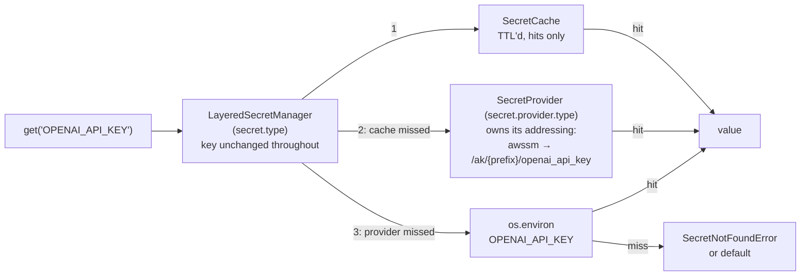

# #749: Resolve secrets from a managed store with environment-variable fallback

A pluggable secret-resolution capability (`agentkernel/secret/`) that resolves an environment-variable-style key — `OPENAI_API_KEY` — to a value through a fixed three-layer order: process cache, the configured provider, then the `os.environ` variable of that same name. The manager is a plain key → value mapping and transforms nothing; **each provider owns its own addressing**, so the AWS SSM provider (`awssm`) is what turns `OPENAI_API_KEY` into the parameter `/ak/{prefix}/openai_api_key`, where `prefix` is the deployment prefix the Terraform modules already own. Two entry points: `get(key)` returns the value, `inject(key)` publishes it into `os.environ` so every SDK that reads its own environment variable keeps working unchanged. Both the manager and the provider are selected by configuration and both accept a dotted path, so a deployment can replace the backend alone or the whole resolution strategy.

## Motivation

- Every secret reaches the runtime as a plaintext environment variable set by Terraform.
  - `examples/aws-serverless/openai/deploy/main.tf:53` — `"OPENAI_API_KEY" = var.openai_api_key`; 34 `main.tf` files under `examples/` and `e2e/` repeat the pattern.
  - Consequences: the value lands in Terraform state and in the Lambda/ECS console, rotation needs a `terraform apply`, and there is no read audit trail.
- The package has no secret abstraction — every consumer reads `os.environ` directly, each with its own name and its own default.
  - `ak-py/src/agentkernel/knowledgebase/neo4j.py:45` (`NEO4J_PASSWORD`, defaulting to the literal `"password"`), `knowledgebase/starburst.py:14` (`STARBURST_PASSWORD`), `guardrail/walledai.py:46` (`WALLED_API_KEY`), `integration/slack/adapter.py:285` (`SLACK_BOT_TOKEN`).
  - The sandbox providers indirect one level — `core/config.py:661` and `:666` configure an env var *name* (`api_key_env`), read at `sandbox/providers/e2b.py:107` and `providers/daytona.py:125` — which moves the name into config but still requires the value in the environment.
- The only existing indirection is file-based and unusable on Lambda: `AK_SECRETS_PATH` plus `<file:...>` placeholders substituted into `config.yaml` at load (`core/util/config_yaml_util.py:66`).
- The deployment prefix that would scope a secret path already exists and is mandatory — `ak-deployment/ak-aws/serverless/variables.tf:6`, "Prefix applied to every resource name (e.g. `myproduct-dev-agents`)" — but it is **not** injected into the runtime as an environment variable today, so the runtime cannot currently compose a scoped path.
- `boto3` is already an optional extra (`ak-py/pyproject.toml:60` — `"boto3>=1.41.4"`, inside the `aws` block opened at `:59`), so an SSM provider adds no new dependency, only a new `require_extra` branch.

## Requirements

### Naming and resolution

- **Keys are environment-variable names.** A caller passes `OPENAI_API_KEY` — the name the SDK itself already reads — and that one string is the cache key, the argument handed to the provider, and the variable the environment layer reads and `inject` writes. Nothing in the manager renames, prefixes or case-folds it, so the names third-party SDKs read are the names callers type.
  - `key` — **must match `^[A-Z][A-Z0-9_]*$`**: uppercase ASCII letters, digits and underscores, opening with a letter. One spelling per secret, so two keys can never address one cache entry, one provider record and two different variables.
    - This is a **validated grammar, not a convention**. A key that does not match is rejected with `ValueError` at the API boundary — *before* the provider is consulted and *before* `os.environ` is read or written.
    - What it guarantees is that the name is **well-formed**: `/` cannot match, leading, trailing or interior, and neither can the whitespace, `=` and NUL that make an environment-variable name malformed in the first place.
    - What it deliberately does **not** do is bound *which* variables `inject` can write. With no transformation between the key and the variable name, `inject("PATH")` and `inject("AWS_SECRET_ACCESS_KEY")` are well-formed calls that overwrite those variables. That is a caller responsibility, documented on `inject`: the caller names the exact variable it means, so clobbering one is an explicit act rather than a surprise produced by case folding. No denylist is added — any list of "dangerous" names would be arbitrary and incomplete, and injecting AWS credentials is a legitimate use.
- **Each provider owns its own addressing.** `get_secret(key)` receives the key and translates it to whatever its backend uses; the manager knows no paths, no prefixes and no naming conventions. This is what lets a second managed store (Secrets Manager, Vault, Key Vault) ship without touching the manager.
  - The **`awssm` provider's** convention is `/ak/{prefix}/{key.lower()}` — **leading slash included**: `OPENAI_API_KEY` → `/ak/myproduct-dev/openai_api_key`. SSM rejects a parameter name that contains `/` but does not begin with one (`ValidationException`), and the IAM resource ARN `…:parameter/ak/{prefix}/*` is the ARN of exactly this name.
  - `prefix` — the deployment identifier; scopes one deployment's secrets. Read from configuration, not typed by callers. It is a deployment-wide scope rather than an SSM setting, which is why it stays one top-level `secret.prefix` field that a later managed-store provider reuses instead of redeclaring.
  - `prefix` is normalized once by the `awssm` provider, before composing: leading and trailing `/` are stripped, so `myproduct-dev`, `/myproduct-dev` and `myproduct-dev/` compose identically. A `prefix` carrying an **interior** `/` is rejected with `AKConfigError` at construction, because a nested path would compose outside the `parameter/ak/{prefix}/*` grant the Terraform modules provision and would fail as an authorization error rather than as the configuration error it is.
  - `key.lower()` is applied only inside that provider. The grammar guarantees the key is already uppercase ASCII letters, digits and underscores, so the mapping is total and collision-free: two distinct keys can never produce one parameter name.
- Resolution order is fixed, first hit wins:
  1. **Cache** — process-local, TTL'd, keyed by the key itself.
  2. **Provider** — the configured backend, given the key.
  3. **Environment** — `os.environ[key]`.
- The environment layer is always the last fallback, for every provider; no provider can disable it. It is what keeps all 34 existing example deployments working unchanged.
- A value found in the provider or the environment is cached; a **miss is not cached**, so a secret created after process start resolves on the next call.
  - The cost of that choice is explicit and documented rather than mitigated: on a remote provider, every `get()`/`inject()` for a key that lives only in the environment — or nowhere — is a fresh provider round trip for the life of the process. SSM's standard `GetParameter` throughput is 40 TPS per account and region, and this capability does nothing to raise it. Nothing in the code constrains where the calls are made from, so the rule the docs and the updated example carry is: **resolve secrets during startup, never on the request hot path**. A deployment whose keys all come from the environment selects `provider.type: noop` and pays nothing.
- Values are flat strings, returned verbatim from the provider. No JSON parsing, no sub-key addressing (see Non-goals).



### Public API

- `SecretManager` (ABC) declares the four public methods below plus the `from_config` construction seam. `LayeredSecretManager` is the single built-in, implementing the cache → provider → environment order; providers know only their own backend.
- `SecretManager.current()` returns the configured instance — process-wide singleton, `RLock`-guarded, `reset()` for tests, the `ExecutionManager`/`ScheduleManager` precedent. The accessor is `current()`, not `get()`, because `get(key)` is the value accessor on the same class (the `Runtime.current()`/`Session.current()` precedent).
- `get(key: str, default: str | None = <unset>) -> str | None` — resolves through the order above. Called with no `default`, it raises `SecretNotFoundError` when no layer has the key; called with one, it returns `default` instead. The default is returned on a **miss** only, never on a provider failure.
  - "No default supplied" is distinguished from `default=None` by a private sentinel rather than by `None` itself, so `get(key, default=None)` is a legitimate request for `None` on a miss rather than a request to raise. That is also why the signature is `str | None` at both ends: the advertised contract and the declared types have to agree, or a supported call fails type checking. The two behaviors — raise when no default was supplied, return the default when one was — are the contract a bring-your-own manager preserves; how the sentinel is spelled is `spec.md`'s.
- `inject(key: str) -> None` — resolves through the same order and sets `os.environ[key]` — the key *is* the variable name, written verbatim; raises `SecretNotFoundError` on a miss. One key per call, caller-timed.
  - **`inject` writes the process environment and nothing else.** It never writes to SSM or any other backend — the capability is read-only against its provider (see Non-goals), so "inject" always means "publish into this process's `os.environ`". Injection overwrites an existing value of that variable, so a provider hit wins over a stale one; it logs at debug naming the variable, never the value.
  - **Every injection is an explicit call the application makes.** There is no automatic injection at startup, no sweep, and no AK-owned entrypoint that calls `inject` on the application's behalf — including the pipeline and gateway entrypoints (`AgentRunner.run()`, `WebSocketGateway.run()`, the ECS/Lambda handlers). A deployment that needs a secret in one of those processes calls `SecretManager.current().inject(...)` from its own module before handing off to the entrypoint, which is how every AK example already structures its `main`.
  - Existing consumers need no change **when they read their environment variable at call time**: `inject("NEO4J_PASSWORD")` before building the agents reaches `knowledgebase/neo4j.py:45`, `guardrail/walledai.py:46`, `integration/slack/adapter.py:285`, and the sandbox providers' `api_key_env` reads (`sandbox/providers/e2b.py:107`, `providers/daytona.py:125`). It does **not** reach a consumer that reads at *import* time — `knowledgebase/starburst.py:14` binds `STARBURST_PASSWORD` as a module-level constant consumed at `:65`, so an `inject` call made after that import has no effect. See Open questions.
  - **Consequence: an injected key makes the environment layer non-empty for that key, permanently.** Layer 3 reads exactly the variable `inject` writes, so once a key has been injected, a value later deleted from the provider still resolves — from what this process itself wrote.
- `invalidate(key: str) -> None` and `clear() -> None` — drop **cached entries only**, so the next read re-resolves from the provider. Neither writes to the provider, and neither unsets an injected environment variable. This is the rotation story for long-lived containers: update the parameter in SSM, then `invalidate` (or wait out `cache_ttl`), then call `inject` again if that secret is consumed through the environment.
- All four are synchronous: `boto3` is synchronous and secrets are resolved from startup paths, not from the request hot path.
- The manager is safe to call from multiple threads (ECS consumer threads, `ThreadRunner` tasks). The `RLock` is held across the **whole resolution** — cache check, provider call, cache write — not around the cache alone.
  - Guarding only the cache would leave the check→fetch→store sequence interleaved, so a cold key requested by *n* threads would cost *n* provider round trips. Holding the lock across the sequence makes it **single-flight**: the first caller fetches, the rest wait and read the cache entry it wrote.
  - Serializing provider access is affordable *because* resolution belongs to startup and not to the request hot path — the same reason the API is synchronous. A design that resolved on the hot path could not make this trade.
  - This makes the built-in safe **whatever provider it is given**, but the guarantee does not extend to a replacement. **A bring-your-own `SecretProvider` or `SecretManager` must tolerate concurrent calls**; it is part of both contracts. A BYO manager that does not take the lock owns single-flight itself.
- These four methods, their miss behavior, the environment-variable name being the key itself, the key grammar, and safety under concurrent calls are the contract a bring-your-own manager must preserve; everything else about the resolution is its own (see Pluggability).

### Pluggability

Two seams, answering two different questions. **The provider answers where a value lives**; most deployments need only this one. **The manager answers how a key becomes a value** — the resolution order, the path shape, the caching — for a deployment whose secrets are not named `/ak/{prefix}/{key}` or which needs a different order. Both are config-keyed with a dotted-path escape hatch.

#### Manager seam

- `SecretManager` (ABC, `secret/base.py`) — the four public methods plus `from_config(config: _SecretConfig) -> SecretManager`, the single construction seam.
- `SecretManagerFactory` (`secret/factory.py`) — same house shape: the built-in short name `layered` as an `if/elif` real-import branch, any other value resolved by `resolve_dotted` against `SecretManager`, `AKConfigError` otherwise. Selected by `secret.type`.
- `LayeredSecretManager` (`secret/manager.py`) — the built-in and the default: drives cache → provider → environment over one unchanged key, owns `SecretCache`, and resolves its provider through `SecretProviderFactory`. It composes no path and transforms no name, so it holds no `prefix`.
- A bring-your-own manager **owns the whole resolution**: it may ignore `secret.provider.type`, `secret.prefix`, and `secret.cache_ttl` entirely, or reuse `SecretProviderFactory` and `SecretCache` itself. The two seams are therefore not additive by default — a BYO manager that wants the provider seam must opt into it. This is deliberate, and it is why a BYO manager is the rarer of the two.
- `SecretManagerContract` (`secret/testing.py`) — asserts only the invariants a replacement must preserve, not the built-in's order: `get` raises `SecretNotFoundError` on a miss, `get(key, default)` returns the default on a miss and never on a failure, `inject` sets `os.environ[key]` under that exact name for a resolvable key, a key outside the grammar raises `ValueError`, and `invalidate`/`clear` are callable and non-raising.
  - A generic suite cannot know which keys a given manager can resolve, so the subclass supplies the instance under contract, one key it resolves, and one it does not — the `SandboxProviderContract` / `QueueTransportContract` pattern. A subclass that omits any of them must fail loudly rather than silently skip; the fixture names and that failure mechanism are `spec.md`'s.

#### Provider seam

- `SecretProvider` (ABC, `secret/base.py`) — one abstract method plus one construction seam:
  - `get_secret(key: str) -> Optional[str]` — return the value stored for the env-style key, or `None` when the backend does not have it. **The provider owns its own addressing** — it translates the key to whatever its backend uses — and it never caches, never falls back to another layer, and **must tolerate concurrent calls** — the built-in manager serializes them, but a bring-your-own manager need not.
  - `from_config(config: _SecretConfig) -> SecretProvider` — the single construction seam (the `ScheduleProvider.from_config` precedent). It takes the whole `secret` block, not just `secret.provider`, because `secret.prefix` is a deployment-wide scope a provider may need; a provider needing no settings inherits the default and ignores it.
- `SecretProviderFactory` (`secret/factory.py`) — the same `core/util/factory.py` house shape: built-in short names as `if/elif` real-import branches, `require_extra("aws", "secret.provider.type: awssm")` around the boto3 import, and `resolve_dotted` for any other value as a dotted-path bring-your-own. An unknown short name raises `AKConfigError`.
- Built-ins in v1 — one managed store plus three that need no dependency, so the seam is exercisable without a cloud account:
  - `noop` (**default**) — the null backend: `get_secret` returns `None` always, so resolution collapses to cache + environment. Zero cost, no credentials, no network. This is the local-development and unchanged-deployment path. It stays the default rather than `env`, because the environment layer is the manager's third layer and is on unconditionally for every provider; a default named `env` would read as though selecting it were what turns that layer on.
  - `in_memory` — a seedable dict, instance-scoped (not class-level: process-wide state would leak seeded secrets between tests). The test double of the provider seam and a local-development store.
  - `env` — `os.environ` as the backing store, read verbatim under the key. Under `LayeredSecretManager` it is **observably equivalent to `noop`**, because layer 3 already reads the same place; it earns its place for a bring-your-own manager that owns its whole resolution and has no environment layer, and as a real, dependency-free backend for the contract suite to run against. That overlap is stated rather than left to be discovered.
  - `awssm` — AWS SSM Parameter Store, `GetParameter(Name=/ak/{prefix}/{key.lower()}, WithDecryption=True)`. Region and credentials come from the boto3 environment default, matching `core/util/driver/dynamodb.py:38`. Requires `secret.prefix` and the `aws` extra.
- `SecretProviderContract` (`secret/testing.py`) — the reusable conformance suite every built-in subclasses (`QueueTransportContract`/`SandboxProviderContract` precedent). It asserts four invariants: a seeded value round-trips verbatim; an absent key returns `None` rather than raising; the key is used exactly as given, so two distinct keys never collapse onto one backend entry; and the environment is consulted only by a backend that declares it does.
  - Seeding a value is the subclass's, since `SecretProvider` has no write method by design and each backend seeds differently. The fixture and the per-backend seeding mechanics are `spec.md`'s.
  - Two **declared capability flags**, each *set by the subclass and read by the suite*, never an ad-hoc skip — so a bring-your-own provider gets the same treatment and none can quietly opt out of an assertion that does apply to it:
    - **`NoOpSecretProvider` declares no round-trip**: a backend that never holds a value cannot round-trip one, and asserting otherwise would make the null provider the one built-in that fails its own contract. It still runs, and must pass, the other assertions.
    - **`EnvSecretProvider` declares that it reads the environment**, since `os.environ` *is* its store. The suite then runs that assertion inverted — the same setup must **hit** — so the flag cannot be set carelessly just to silence the check.

### Error handling

- `SecretNotFoundError` (`secret/errors.py`, subclass of `SecretError`) — no layer had the key and no `default` was supplied. The message names the key, never a value; the manager has no address to name, so a provider that wants its own diagnosable (the `awssm` path) logs it at debug on the miss.
- A provider **miss** falls through to the environment layer. For `awssm` a miss is `ParameterNotFound` and nothing else — the parameter is genuinely absent at a path the role is allowed to read.
- A provider **failure** raises `SecretError` and does **not** fall through to the environment. Silent fallback would let a production deployment run on a stale or absent environment variable with no signal.
  - `AccessDeniedException` is a failure, not a miss: the IAM policy is provisioned from the same `prefix` the path is composed from, so a denial means the deployment is misconfigured, not that the key belongs to someone else. A design that tolerated it would make every IAM mistake look like a missing parameter and resolve silently from the environment.
  - Credentials, network, throttling, and any other `ClientError` are failures on the same reasoning.
- **The empty-`prefix` fail-fast belongs to the provider that needs a prefix, not to the manager.** `AWSSMSecretProvider` raises `AKConfigError` at construction when `secret.prefix` is empty, because it would otherwise compose the malformed path `/ak//openai_api_key` and every lookup would miss silently into the environment layer. It is **not** a rule about "any provider other than `noop`": `in_memory` and `env` are non-`noop` providers with no use for a prefix, and a bring-your-own provider may have none either. A bring-your-own provider that does need one reads `config.prefix` in its own `from_config` and validates it there.
  - The check is not on the Pydantic model, because an empty prefix is legal for every other provider.
  - This fires at first `SecretManager.current()`, which is the capability's only construction point (it has no mount step of its own, unlike the schedule handler's `get_router()`). An application wanting it at build time calls `current()` during startup, which is where `inject` is called anyway.
- A `prefix` or `key` carrying an interior `/` is rejected where it is supplied: `AKConfigError` from `AWSSMSecretProvider` for the prefix, `ValueError` from `get`/`inject` for the key (see Naming and resolution).
- A missing `boto3` with `provider.type: awssm` raises `ImportError` naming the `aws` extra, at factory time — and before the prefix check, so a missing dependency is never reported as a misconfiguration.
- No secret value ever appears in a log record, an exception message, a trace span, or a response body. Log lines carry the key name, or the provider's own composed address, only.

### Configuration

- Reuse audit: no existing `AKConfig` model expresses a secret backend, a path prefix, or a resolution cache; none of the `_Redis*`/`_DynamoDB*`/`_Queues*` connection models applies. A new `secret` block is required.
- New block `_SecretConfig` on `AKConfig` (`core/config.py`), non-`Optional` with a `default_factory`, alongside `sandbox` and `execution`:

```yaml
secret:
  type: layered           # layered | dotted path to a SecretManager subclass
  prefix: ""              # AK_SECRET__PREFIX; required by awssm, ignored by the others
  provider:
    type: noop            # noop | in_memory | env | awssm | dotted path to a SecretProvider subclass
  cache_ttl: 300          # seconds; 0 disables caching, negative is rejected
```

- **No `enabled` flag.** The capability is always available and costs nothing at its default (`noop` provider = cache + environment, no credentials, no network), so nothing has to be opted into — the house rule reserves `enabled` for features with a real cost. Selecting a provider is the only opt-in, and `provider.type` already expresses it.
- Every field justified:
  - `type` — the manager selector, read by `SecretManagerFactory`. Cannot be derived: it chooses the resolution strategy itself, which no other configured component implies. `layered` is the only built-in, so the field exists chiefly as the bring-your-own escape hatch.
  - `prefix` — the deployment scope; cannot be derived, because the Terraform `prefix` variable (`ak-deployment/ak-aws/serverless/variables.tf:6`) is not injected into the runtime today. Read by `AWSSMSecretProvider` when composing a parameter name. **Required by `awssm`**, ignored by `noop`, `in_memory` and `env`; it stays top-level rather than under a provider sub-block because it is a deployment-wide scope a later managed-store provider reuses, and because putting it under `awssm` would change the `AK_SECRET__PREFIX` variable Terraform injects. Leading and trailing `/` are stripped; an interior `/` is rejected (see Naming and resolution).
  - `provider.type` — the factory selector; nested to match `schedule.provider.type` and to leave room for a provider's own settings sub-block.
  - `cache_ttl` — seconds, default 300, constrained `ge=0` on the model. Read by `SecretCache`; it is the rotation-pickup window and differs per deployment, so it cannot be a constant. Flat rather than a `cache:` sub-block because there is exactly one cache setting. Its boundary values are part of the contract, not left to the implementation, because the rotation guarantee is only testable once they are fixed:
    - **`> 0`** — a hit is cached and served for that many seconds, then re-resolved. This is the default path.
    - **`0`** — caching is **off**: nothing is stored, and every `get`/`inject` re-resolves through the provider. This is the setting for a deployment that wants a rotation picked up on the next call and accepts the round trip for it. `invalidate()` and `clear()` stay callable and become no-ops, so a caller need not branch on the TTL.
    - **`< 0`** — rejected with `AKConfigError` at construction. There is no behavior a negative window could express that `0` does not already, so treating it as an alias would hide a typo in the one field whose whole purpose is bounding staleness.
- **No `secret.provider.awssm` block in v1.** Beyond the top-level `prefix` it reads, the SSM provider needs no settings: region/credentials come from the boto3 environment default, and decryption is AWS's (see Deployment) — there is no KMS key to name. A block with no field that earns its place would be a defect.
- Terraform supplies the value, never the type: the modules inject `AK_SECRET__PREFIX` from the existing `var.prefix`, and the application's own `config.yaml` selects `provider.type: awssm`. This matches the thread/schedule split (Terraform provisions and injects connection detail; the app declares the backend).
- Existing YAML and `AK_*` environment variables are unaffected: the block is new, every field has a default, and the default provider changes no behavior.

### Components

All classes, one responsibility each (`agentkernel/secret/`, a top-level capability package beside `sandbox/` and `schedule/`, since it depends on an optional cloud SDK and `core/` must not):

| Class | Module | Responsibility |
| --- | --- | --- |
| `SecretManager` | `base.py` | ABC: `get`/`inject`/`invalidate`/`clear`, `from_config`, and the `current()` singleton accessor |
| `LayeredSecretManager` | `manager.py` | The built-in manager: validates the key, then drives the three-layer order over that unchanged key under the resolution lock; owns the cache. Composes no path, holds no prefix |
| `SecretManagerFactory` | `factory.py` | Config-keyed manager selection; `layered` built-in plus dotted-path BYO |
| `SecretCache` | `cache.py` | TTL'd key→value store; caches hits only. The `RLock` is the manager's, held across the whole resolution |
| `SecretProvider` | `base.py` | ABC: `get_secret(key)`, `from_config(config)`. Each implementation owns its own addressing |
| `NoOpSecretProvider` | `providers/noop.py` | Built-in null backend — always returns `None`; the default |
| `InMemorySecretProvider` | `providers/in_memory.py` | Seedable dict, instance-scoped; the provider seam's test double and a local-dev store |
| `EnvSecretProvider` | `providers/env.py` | `os.environ` as the backing store, read verbatim under the key |
| `AWSSMSecretProvider` | `providers/awssm.py` | AWS SSM Parameter Store; composes `/ak/{prefix}/{key.lower()}`, `WithDecryption=True`; `aws` extra |
| `SecretProviderFactory` | `factory.py` | Config-keyed selection; built-ins, `require_extra`, dotted-path BYO |
| `SecretError`, `SecretNotFoundError` | `errors.py` | Typed failures |
| `SecretProviderContract`, `SecretManagerContract` | `testing.py` | Reusable conformance suites for built-in and BYO providers and managers |
| `_SecretConfig` | `core/config.py` | Pydantic config block |

- Coupling: `secret/` imports `core` only; nothing in `core/`, `pipeline/`, or `api/` imports `secret/`. No module-level functions — key validation is a `LayeredSecretManager` method, and path composition and prefix normalization are `AWSSMSecretProvider` methods.

### Deployment (`ak-deployment/ak-aws/`)

- Both root modules (`serverless`, `containerized`) gain the **same one variable**, with the same name, type and default — the `enable_scheduling` precedent (`serverless/variables.tf:181`, `containerized/variables.tf:137`):

```hcl
variable "ssm_enabled" {
  type        = bool
  default     = false
  description = "Grant the application roles read access to /ak/<prefix>/* in SSM Parameter Store and inject AK_SECRET__PREFIX, so the application's `secret.provider.type: awssm` can resolve secrets."
}
```

  - **The change is additive only.** Every resource it introduces — the IAM policy document, the policy, and one role attachment per role — is `count`-gated on `var.ssm_enabled`. No *existing* resource gains a `count`, changes an argument, or is otherwise modified, so `terraform plan` against a deployment that leaves the variable at its default is empty. "Every resource `count`-gated" means every resource this change adds, never an existing one.
  - `ssm_enabled` is propagated from each root module into the submodules that run application code, as a same-named `bool` variable on each: `request_handler`, `agent_runner`, `response_handler` and `ws_connection_handler` in `serverless` (`serverless/state.tf:544`, `:628`, `:694`, `:521`), and `rest_service` and `agent_runner` in `containerized` (`containerized/rest_service.tf:4`, `containerized/queue_mode.tf:23`). The two root modules have different submodule sets, so the wiring follows each one's own names, the way the `enable_scheduling` wiring does (`serverless/modules/request-handler/main.tf:372`, `containerized/modules/rest-service/main.tf:20`). Naming and defaulting it identically in both is what keeps the two deployment modes from drifting into incompatible behavior.
  - When `true`, each of those submodules injects `AK_SECRET__PREFIX` into its function or task environment. Its value is `var.prefix` — the module's existing resource-naming prefix, passed through unchanged, so the secret path and the provisioned resources cannot drift. **No new Terraform variable carries the prefix.**
  - When `true`, each of those submodules also attaches one least-privilege IAM policy to **its own** execution role: a single statement, `Action = ["ssm:GetParameter"]`, `Resource = "arn:aws:ssm:${region}:${account}:parameter/ak/${prefix}/*"`, and nothing else — it is the one call `AWSSMSecretProvider` makes. No `ssm:GetParameters`, no `ssm:DescribeParameters`, no write or delete action, and account-wide `ssm:*` is not acceptable. Every role that receives the environment variable receives the grant, because any of these processes may be the one whose startup calls `inject()`; scoping the grant to a subset would make the capability work in one entrypoint and fail with an authorization error in another.
  - **No KMS wiring.** `SecureString` parameters are expected to use the AWS-managed `alias/aws/ssm` key, whose key policy already permits decryption by principals in the account through the `ssm.<region>.amazonaws.com` service condition — so `WithDecryption=True` works with the `ssm:GetParameter` grant alone. There is no CMK variable and no `kms:Decrypt` statement, and since Terraform does not create the parameters it could not know which key they used anyway. A deployment that chooses a customer-managed key adds the `kms:Decrypt` grant itself (see Non-goals).
  - When `false` — the default — no policy document, policy or attachment is created, and no environment variable is injected: byte-for-byte no change for existing deployments, which is what makes the variable safe to add to both root modules at once.
- Terraform does **not** create the parameters and does not set `AK_SECRET__PROVIDER__TYPE` (see Non-goals).

### Examples and docs

- **Two examples are updated to the SSM path, one per deployment mode** — one AWS **serverless** and one AWS **containerized**. This is what #749 requires: its proposed solution asks for "at least one AWS serverless example and one containerized example", and its acceptance criteria include "Works for both `serverless` and `containerized` AWS deployments".
  - Each sets `ssm_enabled = true` in its `deploy/`, selects `provider.type: awssm` in its `config.yaml`, and calls `inject("OPENAI_API_KEY")` at startup before the agents are built — the key being the SDK's own variable name, resolved from the parameter `/ak/<prefix>/openai_api_key`.
  - Each is deployed and exercised on its own path, so the two root modules' wirings — which have different submodule sets — are both proven rather than one assumed to follow from the other.
- The remaining examples stay on environment variables, so both modes are demonstrated side by side and the unchanged default path keeps its coverage.
- The deployment READMEs and the docs site document the resolution order, the key convention (`OPENAI_API_KEY` → `/ak/{prefix}/openai_api_key`), the built-in providers, the caller responsibility on `inject`, the IAM permissions, the startup-not-hot-path rule and the uncached-miss cost behind it, and the rotation story (update the parameter, then `invalidate` or wait out `cache_ttl`, then re-`inject` if the secret is consumed through the environment).

## Non-goals

Each of the first three is a deliberate narrowing of the issue body, in favour of the single `/ak/{prefix}/{key}` convention. All three are **confirmed by the requester**; a reviewer comparing this design against #749 should expect them.

- **Per-key secret references.** The issue proposes configuring a parameter name or ARN per key; this design derives the path from the key instead, so no per-key configuration exists and none can drift from what Terraform provisions.
- **AWS Secrets Manager as a built-in.** The issue names it alongside SSM. It is reachable in v1 as a dotted-path BYO provider; shipping it as a second built-in is a follow-up.
- **JSON-blob secrets.** The issue proposes one secret carrying several keys (`{"OPENAI_API_KEY": ...}`). Values are flat strings here; a blob would need a second addressing scheme and would make `inject` ambiguous.
- Writing, creating, or rotating secrets from the runtime; Terraform creating the SSM parameters.
- Azure Key Vault and GCP Secret Manager built-ins.
- A shared or cross-process cache.
- Automatic injection at startup, and any sweep of `/ak/{prefix}/*` — every injection is an explicit call the application makes, in every process (see Public API).
- Customer-managed KMS keys for `SecureString` parameters: the modules grant no `kms:Decrypt` and expose no CMK variable (see Deployment).
- Per-agent, per-tenant, or per-session secret scoping.
- Migrating the existing consumers in Motivation to call `get()`; `inject()` serves the call-time readers among them unchanged, and `starburst.py`'s import-time read is an open question rather than a migration this change makes.
- ECS task-definition native `secrets` blocks.

## Open questions

- **How should `knowledgebase/starburst.py`'s import-time environment read be handled?** It binds `STARBURST_PASSWORD`/`STARBURST_HOST`/`STARBURST_USER`/`STARBURST_PORT` as module-level constants at `:12`–`:15` and consumes them at `:65`, so `inject()` — which can only ever write `os.environ` of a process that has already imported the module — cannot reach it. It is the one consumer in Motivation that `inject()` does not serve, and it is not covered by the "no migration" non-goal, because there is nothing for the caller to do differently. Three options, in the order they were considered:
  - **Move the reads into `StarburstManager.__init__`** (the `Neo4jManager` shape at `neo4j.py:45`), making it a call-time reader like every other consumer. Smallest change, brings the one outlier in line with its siblings, and is the only option that makes `inject()`'s stated contract true without qualification. Behavior change: a process that mutates `os.environ` between import and construction now sees the new value — which is exactly the point, but it is a behavior change on an existing class.
  - **Leave it and document the exception**, listing `starburst.py` as the site `inject()` does not reach and telling deployments to set `STARBURST_*` the old way. No code change; leaves a documented sharp edge that will be rediscovered.
  - **Migrate it to `SecretManager.current().get()`** — rejected on the coupling rule (`knowledgebase/` would import `secret/`, and `secret/` is a top-level capability that nothing in the package depends on) and on the standing non-goal of migrating consumers.
  - Recommendation: the first. It is a two-line change confined to one backend, and it is the only one that leaves the capability's headline claim intact.
- Everything else raised on the first draft is settled below.

## Resolved

- **The three narrowings** (no per-key secret references, no Secrets Manager built-in, no JSON blobs) are confirmed — see Non-goals.
- **`AK_SECRET__PREFIX` carries `var.prefix`**, injected by the Terraform modules; the application declares only `provider.type` in its own `config.yaml`.
- **`AccessDeniedException` is a real failure**, not a miss — see Error handling.
- **The Terraform and IAM work is part of this change**, not a follow-up.
- **The manager is a second bring-your-own seam**: `secret.type` is config-driven and accepts a dotted path replacing `LayeredSecretManager` outright — see Pluggability.
- **`secret.prefix` is required by the `awssm` provider**, enforced by a fail-fast in `AWSSMSecretProvider` at construction. It is not a rule about non-`noop` providers in general: `in_memory` and `env` need no prefix — see Error handling.
- **The SSM parameter name carries a leading slash** (`/ak/{prefix}/{key.lower()}`): SSM rejects a hierarchical name without one, and it is what the IAM resource ARN already implied. It is the `awssm` provider's convention, not the capability's — the manager composes nothing — see Naming and resolution.
- **The default provider is `noop`, not `env`**: it is a null backend and never reads the environment, which the manager's third layer does unconditionally for every provider. `env` ships as a non-default built-in, and under the built-in manager it is observably equivalent to `noop` — see Pluggability.
- **`inject()` is one-way and manual**: it writes `os.environ` only, never the backend; nothing in AK calls it automatically; and `invalidate()` clears cache entries only, leaving both the provider and any injected variable untouched — see Public API.
- **Uncached misses are a documented cost, not a bug**: on a remote provider a key that lives only in the environment costs a round trip per call, which is why secrets are resolved at startup — see Naming and resolution.
- **No KMS configuration**: decryption rides the AWS-managed `alias/aws/ssm` key policy, so the modules grant `ssm:GetParameter` and nothing else — see Deployment.
- **`get`'s two behaviors are separated by a sentinel**, so `default=None` means "return `None` on a miss" rather than "raise", and the signature is `str | None` at both ends so the types and the contract agree — see Public API.
- **Both contract suites seed through subclass fixtures**, and `NoOpSecretProvider` is a declared exemption from the round-trip assertion rather than a provider that fails its own contract — see Pluggability.
- **`key` is an environment-variable name with a validated grammar, `^[A-Z][A-Z0-9_]*$`**, enforced at the API boundary before the provider or `os.environ` is touched. It guarantees the name is well-formed and gives each secret one spelling; it deliberately does **not** bound which variables `inject()` can write, since there is no transformation between the key and the variable — see Naming and resolution.
- **The resolution lock spans cache check, provider call and cache write**, making a cold key single-flight; a bring-your-own provider or manager must tolerate concurrent calls — see Public API.
- **`cache_ttl` has defined boundaries**: `> 0` caches for the window, `0` disables caching, `< 0` is an `AKConfigError` — see Configuration.
- **The Terraform opt-in is `ssm_enabled`** (`bool`, `default = false`), identical in both root modules, gating only the resources this change adds — see Deployment.
- **Both an AWS serverless and an AWS containerized example are updated**, as #749's acceptance criteria require — see Examples and docs.
- **The manager is a plain key → value mapping and each provider owns its addressing**: `get_secret(key)` takes the key, not a composed path, and `from_config` takes the whole `secret` block so a provider can read `prefix`. Adding a second managed store needs no manager change — see Naming and resolution and Pluggability.
- **The managed-store provider's short name is `awssm`** (class `AWSSMSecretProvider`, `providers/awssm.py`), and two dependency-free built-ins ship beside it — `in_memory` (seedable, for tests and local development) and `env` (`os.environ` as the backing store) — so the provider seam is exercisable without a cloud account — see Pluggability.
