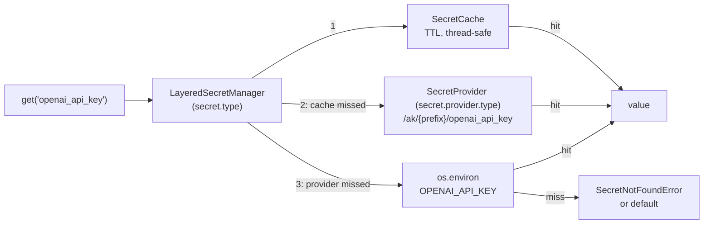

# #749: Resolve secrets from a managed store with environment-variable fallback

A pluggable secret-resolution capability (`agentkernel/secret/`) that resolves a short key — `openai_api_key` — to a value through a fixed three-layer order: process cache, the configured provider (AWS SSM Parameter Store in v1), then the `UPPERCASE(key)` environment variable. Secrets are addressed by one convention, `/ak/{prefix}/{key}`, where `prefix` is the deployment prefix the Terraform modules already own. Two entry points: `get(key)` returns the value, `inject(key)` publishes it into `os.environ` so every SDK that reads its own environment variable keeps working unchanged. Both the manager and the provider are selected by configuration and both accept a dotted path, so a deployment can replace the backend alone or the whole resolution strategy.

## Motivation

- Every secret reaches the runtime as a plaintext environment variable set by Terraform.
  - `examples/aws-serverless/openai/deploy/main.tf:53` — `"OPENAI_API_KEY" = var.openai_api_key`; 34 `main.tf` files under `examples/` and `e2e/` repeat the pattern.
  - Consequences: the value lands in Terraform state and in the Lambda/ECS console, rotation needs a `terraform apply`, and there is no read audit trail.
- The package has no secret abstraction — every consumer reads `os.environ` directly, each with its own name and its own default.
  - `ak-py/src/agentkernel/knowledgebase/neo4j.py:45` (`NEO4J_PASSWORD`, defaulting to the literal `"password"`), `knowledgebase/starburst.py:14` (`STARBURST_PASSWORD`), `guardrail/walledai.py:46` (`WALLED_API_KEY`), `integration/slack/adapter.py:285` (`SLACK_BOT_TOKEN`).
  - The sandbox providers indirect one level — `core/config.py:661` and `:666` configure an env var *name* (`api_key_env`), read at `sandbox/providers/e2b.py:107` and `providers/daytona.py:125` — which moves the name into config but still requires the value in the environment.
- The only existing indirection is file-based and unusable on Lambda: `AK_SECRETS_PATH` plus `<file:...>` placeholders substituted into `config.yaml` at load (`core/util/config_yaml_util.py:66`).
- The deployment prefix that would scope a secret path already exists and is mandatory — `ak-deployment/ak-aws/serverless/variables.tf:6`, "Prefix applied to every resource name (e.g. `myproduct-dev-agents`)" — but it is **not** injected into the runtime as an environment variable today, so the runtime cannot currently compose a scoped path.
- `boto3` is already an optional extra (`ak-py/pyproject.toml:60` — `"boto3>=1.41.4"`, inside the `aws` block opened at `:59`), so an SSM provider adds no new dependency, only a new `require_extra` branch.

## Requirements

### Naming and resolution

- Canonical secret name is `/ak/{prefix}/{key}` — **leading slash included**. SSM rejects a parameter name that contains `/` but does not begin with one (`ValidationException`), and the IAM resource ARN `…:parameter/ak/{prefix}/*` is the ARN of exactly this name.
  - `prefix` — the deployment identifier; scopes one deployment's secrets. Read from configuration, not typed by callers.
  - `key` — lowercase snake_case (`openai_api_key`). Callers pass the key alone; the capability composes the path.
  - Normalization is the manager's, applied once before composing: `prefix` is stripped of leading and trailing `/`, so `myproduct-dev`, `/myproduct-dev` and `myproduct-dev/` compose identically; the path is then `"/ak/" + prefix + "/" + key`. A `prefix` or a `key` carrying an **interior** `/` is rejected — `AKConfigError` for the prefix at construction, `ValueError` for the key at the call — because a nested path would compose outside the `parameter/ak/{prefix}/*` grant the Terraform modules provision and would fail as an authorization error rather than as the configuration error it is.
  - `key` is used verbatim in the path, not case-normalized: the lowercase snake_case convention is what makes `UPPERCASE(key)` the matching environment-variable name, and normalizing one end without the other would let two spellings address one parameter but two different variables.
- Resolution order is fixed, first hit wins:
  1. **Cache** — process-local, TTL'd.
  2. **Provider** — the configured backend, given the composed `/ak/{prefix}/{key}` path.
  3. **Environment** — `os.environ[UPPERCASE(key)]`.
- The environment layer is always the last fallback, for every provider; no provider can disable it. It is what keeps all 34 existing example deployments working unchanged.
- The environment variable name is `UPPERCASE(key)` with no prefix component — `openai_api_key` → `OPENAI_API_KEY` — so it matches the names third-party SDKs already read.
- A value found in the provider or the environment is cached; a **miss is not cached**, so a secret created after process start resolves on the next call.
  - The cost of that choice is explicit and documented rather than mitigated: on a remote provider, every `get()`/`inject()` for a key that lives only in the environment — or nowhere — is a fresh provider round trip for the life of the process. SSM's standard `GetParameter` throughput is 40 TPS per account and region, and this capability does nothing to raise it. Nothing in the code constrains where the calls are made from, so the rule the docs and the updated example carry is: **resolve secrets during startup, never on the request hot path**. A deployment whose keys all come from the environment selects `provider.type: noop` and pays nothing.
- Values are flat strings, returned verbatim from the provider. No JSON parsing, no sub-key addressing (see Non-goals).



### Public API

- `SecretManager` (ABC) declares the four public methods below plus the `from_config` construction seam. `LayeredSecretManager` is the single built-in, implementing the cache → provider → environment order; providers know only their own backend.
- `SecretManager.current()` returns the configured instance — process-wide singleton, `RLock`-guarded, `reset()` for tests, the `ExecutionManager`/`ScheduleManager` precedent. The accessor is `current()`, not `get()`, because `get(key)` is the value accessor on the same class (the `Runtime.current()`/`Session.current()` precedent).
- `get(key: str, default: str = <unset>) -> str` — resolves through the order above. Called with no `default`, it raises `SecretNotFoundError` when no layer has the key; called with one, it returns `default` instead. The default is returned on a **miss** only, never on a provider failure.
  - "No default supplied" is a module-private **sentinel object**, not `None`, so `get(key, default=None)` is a legitimate request for `None` on a miss rather than a request to raise. The sentinel's identity is an implementation detail; the two behaviors it distinguishes are part of the contract a bring-your-own manager preserves.
- `inject(key: str) -> None` — resolves through the same order and sets `os.environ[UPPERCASE(key)]`; raises `SecretNotFoundError` on a miss. One key per call, caller-timed.
  - **`inject` writes the process environment and nothing else.** It never writes to SSM or any other backend — the capability is read-only against its provider (see Non-goals), so "inject" always means "publish into this process's `os.environ`". Injection overwrites an existing value of that variable, so a provider hit wins over a stale one; it logs at debug naming the variable, never the value.
  - **Every injection is an explicit call the application makes.** There is no automatic injection at startup, no sweep, and no AK-owned entrypoint that calls `inject` on the application's behalf — including the pipeline and gateway entrypoints (`AgentRunner.run()`, `WebSocketGateway.run()`, the ECS/Lambda handlers). A deployment that needs a secret in one of those processes calls `SecretManager.current().inject(...)` from its own module before handing off to the entrypoint, which is how every AK example already structures its `main`.
  - Existing consumers need no change **when they read their environment variable at call time**: `inject("neo4j_password")` before building the agents reaches `knowledgebase/neo4j.py:45`, `guardrail/walledai.py:46`, `integration/slack/adapter.py:285`, and the sandbox providers' `api_key_env` reads (`sandbox/providers/e2b.py:107`, `providers/daytona.py:125`). It does **not** reach a consumer that reads at *import* time — `knowledgebase/starburst.py:14` binds `STARBURST_PASSWORD` as a module-level constant consumed at `:65`, so an `inject` call made after that import has no effect. See Open questions.
  - **Consequence: an injected key makes the environment layer non-empty for that key, permanently.** Layer 3 reads exactly the variable `inject` writes, so once a key has been injected, a value later deleted from the provider still resolves — from what this process itself wrote.
- `invalidate(key: str) -> None` and `clear() -> None` — drop **cached entries only**, so the next read re-resolves from the provider. Neither writes to the provider, and neither unsets an injected environment variable. This is the rotation story for long-lived containers: update the parameter in SSM, then `invalidate` (or wait out `cache_ttl`), then call `inject` again if that secret is consumed through the environment.
- All four are synchronous: `boto3` is synchronous and secrets are resolved from startup paths, not from the request hot path.
- The manager is safe to call from multiple threads (ECS consumer threads, `ThreadRunner` tasks): the cache is guarded by an `RLock`.
- These four methods, their miss behavior, and the `UPPERCASE(key)` environment-variable name are the contract a bring-your-own manager must preserve; everything else about the resolution is its own (see Pluggability).

### Pluggability

Two seams, answering two different questions. **The provider answers where a value lives**; most deployments need only this one. **The manager answers how a key becomes a value** — the resolution order, the path shape, the caching — for a deployment whose secrets are not named `/ak/{prefix}/{key}` or which needs a different order. Both are config-keyed with a dotted-path escape hatch.

#### Manager seam

- `SecretManager` (ABC, `secret/base.py`) — the four public methods plus `from_config(config: _SecretConfig) -> SecretManager`, the single construction seam.
- `SecretManagerFactory` (`secret/factory.py`) — same house shape: the built-in short name `layered` as an `if/elif` real-import branch, any other value resolved by `resolve_dotted` against `SecretManager`, `AKConfigError` otherwise. Selected by `secret.type`.
- `LayeredSecretManager` (`secret/manager.py`) — the built-in and the default: composes `/ak/{prefix}/{key}`, drives cache → provider → environment, owns `SecretCache`, and resolves its provider through `SecretProviderFactory`.
- A bring-your-own manager **owns the whole resolution**: it may ignore `secret.provider.type`, `secret.prefix`, and `secret.cache_ttl` entirely, or reuse `SecretProviderFactory` and `SecretCache` itself. The two seams are therefore not additive by default — a BYO manager that wants the provider seam must opt into it. This is deliberate, and it is why a BYO manager is the rarer of the two.
- `SecretManagerContract` (`secret/testing.py`) — asserts only the invariants a replacement must preserve, not the built-in's order: `get` raises `SecretNotFoundError` on a miss, `get(key, default)` returns the default on a miss and never on a failure, `inject` sets `os.environ[UPPERCASE(key)]` for a resolvable key, and `invalidate`/`clear` are callable and non-raising.
  - A generic suite cannot know which keys a given manager can resolve, so the subclass supplies them through overridable fixtures (the `SandboxProviderContract.provider` / `QueueTransportContract.make_transport` pattern): `manager` returns the instance under contract, `resolvable_key` returns a `(key, value)` pair that instance resolves, and `missing_key` returns a key it cannot. The base fixtures raise `NotImplementedError` so a subclass that forgets one fails loudly rather than silently skipping.

#### Provider seam

- `SecretProvider` (ABC, `secret/base.py`) — one abstract method plus one construction seam:
  - `get_secret(path: str) -> Optional[str]` — return the value at the fully composed path, or `None` when the backend does not have it. The provider never composes the path, never reads the environment, and never caches.
  - `from_config(provider_config) -> SecretProvider` — the single construction seam (the `ScheduleProvider.from_config` precedent); a provider needing no settings inherits the default.
- `SecretProviderFactory` (`secret/factory.py`) — the same `core/util/factory.py` house shape: built-in short names as `if/elif` real-import branches, `require_extra("aws", "secret.provider.type: ssm")` around the boto3 import, and `resolve_dotted` for any other value as a dotted-path bring-your-own. An unknown short name raises `AKConfigError`.
- Built-ins in v1:
  - `noop` (default) — the null backend: `get_secret` returns `None` always, so resolution collapses to cache + environment. Zero cost, no credentials, no network. This is the local-development and unchanged-deployment path. It is **not** named `env`, because it does not read the environment — the manager's third layer does that, unconditionally and for every provider, and a provider named `env` would read as though selecting it were what turns the environment layer on.
  - `ssm` — AWS SSM Parameter Store, `GetParameter(Name=path, WithDecryption=True)`. Region and credentials come from the boto3 environment default, matching `core/util/driver/dynamodb.py:38`.
- `SecretProviderContract` (`secret/testing.py`) — the reusable conformance suite every built-in subclasses (`QueueTransportContract`/`SandboxProviderContract` precedent). It asserts: a stored value round-trips verbatim; an absent path returns `None` rather than raising; the provider does not consult `os.environ` (checked by seeding `UPPERCASE(key)` with a sentinel and asserting it is not returned); and the path is used as given.
  - Seeding is the subclass's, through an overridable `seed(path, value)` fixture alongside the `provider` fixture, since `SecretProvider` has no write method by design and each backend seeds differently (a `moto`/stub table for `ssm`, a dict for a fake).
  - **`NoOpSecretProvider` is explicitly exempt from the round-trip assertion** and subclasses the suite with `seed` declining: a backend that never holds a value cannot round-trip one, and asserting otherwise would make the null provider the one built-in that fails its own contract. It still runs, and must pass, the other three assertions. The exemption is declared by the subclass (a `supports_storage = False` class attribute the suite reads), not by skipping tests ad hoc, so a bring-your-own null provider gets the same treatment and no other provider can quietly opt out.

### Error handling

- `SecretNotFoundError` (`secret/errors.py`, subclass of `SecretError`) — no layer had the key and no `default` was supplied. The message names the key and the composed path, never a value.
- A provider **miss** falls through to the environment layer. For `ssm` a miss is `ParameterNotFound` and nothing else — the parameter is genuinely absent at a path the role is allowed to read.
- A provider **failure** raises `SecretError` and does **not** fall through to the environment. Silent fallback would let a production deployment run on a stale or absent environment variable with no signal.
  - `AccessDeniedException` is a failure, not a miss: the IAM policy is provisioned from the same `prefix` the path is composed from, so a denial means the deployment is misconfigured, not that the key belongs to someone else. A design that tolerated it would make every IAM mistake look like a missing parameter and resolve silently from the environment.
  - Credentials, network, throttling, and any other `ClientError` are failures on the same reasoning.
- `LayeredSecretManager.from_config` fails fast with `AKConfigError` when `secret.prefix` is empty and `secret.provider.type` is anything but `noop` — including a dotted-path provider, since the manager would otherwise compose the malformed path `/ak//openai_api_key` and every lookup would miss silently into the environment layer. The check lives in the manager, not on the Pydantic model, because the prefix is the manager's to compose with: a bring-your-own manager may have no path at all and must not be constrained by a rule it does not follow.
  - This fires at first `SecretManager.current()`, which is the capability's only construction point (it has no mount step of its own, unlike the schedule handler's `get_router()`). An application wanting it at build time calls `current()` during startup, which is where `inject` is called anyway.
- A `prefix` or `key` carrying an interior `/` is rejected where it is supplied: `AKConfigError` from `from_config` for the prefix, `ValueError` from `get`/`inject` for the key (see Naming and resolution).
- A missing `boto3` with `provider.type: ssm` raises `ImportError` naming the `aws` extra, at factory time.
- No secret value ever appears in a log record, an exception message, a trace span, or a response body. Log lines carry the key name or the composed path only.

### Configuration

- Reuse audit: no existing `AKConfig` model expresses a secret backend, a path prefix, or a resolution cache; none of the `_Redis*`/`_DynamoDB*`/`_Queues*` connection models applies. A new `secret` block is required.
- New block `_SecretConfig` on `AKConfig` (`core/config.py`), non-`Optional` with a `default_factory`, alongside `sandbox` and `execution`:

```yaml
secret:
  type: layered           # layered | dotted path to a SecretManager subclass
  prefix: ""              # AK_SECRET__PREFIX
  provider:
    type: noop            # noop | ssm | dotted path to a SecretProvider subclass
  cache_ttl: 300
```

- **No `enabled` flag.** The capability is always available and costs nothing at its default (`noop` provider = cache + environment, no credentials, no network), so nothing has to be opted into — the house rule reserves `enabled` for features with a real cost. Selecting a provider is the only opt-in, and `provider.type` already expresses it.
- Every field justified:
  - `type` — the manager selector, read by `SecretManagerFactory`. Cannot be derived: it chooses the resolution strategy itself, which no other configured component implies. `layered` is the only built-in, so the field exists chiefly as the bring-your-own escape hatch.
  - `prefix` — the deployment scope; cannot be derived, because the Terraform `prefix` variable (`ak-deployment/ak-aws/serverless/variables.tf:6`) is not injected into the runtime today. Read by `LayeredSecretManager` when composing a path. **Required whenever a provider other than `noop` is selected**; the default empty string is legal only on the `noop` path, which never composes a path at all. Leading and trailing `/` are stripped; an interior `/` is rejected (see Naming and resolution).
  - `provider.type` — the factory selector; nested to match `schedule.provider.type` and to leave room for a provider's own settings sub-block.
  - `cache_ttl` — seconds, default 300. Read by `SecretCache`; it is the rotation-pickup window and differs per deployment, so it cannot be a constant. Flat rather than a `cache:` sub-block because there is exactly one cache setting.
- **No `secret.provider.ssm` block in v1.** The SSM provider needs no settings: the path is composed by the manager, region/credentials come from the boto3 environment default, and decryption is AWS's (see Deployment) — there is no KMS key to name. A block with no field that earns its place would be a defect.
- Terraform supplies the value, never the type: the modules inject `AK_SECRET__PREFIX` from the existing `var.prefix`, and the application's own `config.yaml` selects `provider.type: ssm`. This matches the thread/schedule split (Terraform provisions and injects connection detail; the app declares the backend).
- Existing YAML and `AK_*` environment variables are unaffected: the block is new, every field has a default, and the default provider changes no behavior.

### Components

All classes, one responsibility each (`agentkernel/secret/`, a top-level capability package beside `sandbox/` and `schedule/`, since it depends on an optional cloud SDK and `core/` must not):

| Class | Module | Responsibility |
| --- | --- | --- |
| `SecretManager` | `base.py` | ABC: `get`/`inject`/`invalidate`/`clear`, `from_config`, and the `current()` singleton accessor |
| `LayeredSecretManager` | `manager.py` | The built-in manager: composes the path, drives the three-layer order, owns the cache |
| `SecretManagerFactory` | `factory.py` | Config-keyed manager selection; `layered` built-in plus dotted-path BYO |
| `SecretCache` | `cache.py` | TTL'd, `RLock`-guarded key→value store; caches hits only |
| `SecretProvider` | `base.py` | ABC: `get_secret(path)`, `from_config(...)` |
| `NoOpSecretProvider` | `providers/noop.py` | Built-in null backend — always returns `None`; the default |
| `SSMSecretProvider` | `providers/ssm.py` | AWS SSM Parameter Store, `WithDecryption=True`; `aws` extra |
| `SecretProviderFactory` | `factory.py` | Config-keyed selection; built-ins, `require_extra`, dotted-path BYO |
| `SecretError`, `SecretNotFoundError` | `errors.py` | Typed failures |
| `SecretProviderContract`, `SecretManagerContract` | `testing.py` | Reusable conformance suites for built-in and BYO providers and managers |
| `_SecretConfig` | `core/config.py` | Pydantic config block |

- Coupling: `secret/` imports `core` only; nothing in `core/`, `pipeline/`, or `api/` imports `secret/`. No module-level functions — path composition and name uppercasing are `LayeredSecretManager` methods.

### Deployment (`ak-deployment/ak-aws/`)

- Both root modules (`serverless`, `containerized`) gain one optional variable, defaulting off, with every resource `count`-gated — the `enable_scheduling` precedent.
  - When set, the module injects `AK_SECRET__PREFIX` into every submodule that runs application code — `request_handler`, `agent_runner`, `response_handler` and `ws_connection_handler` in `serverless` (`serverless/state.tf:544`, `:628`, `:694`, `:521`), and `rest_service` and `agent_runner` in `containerized` (`containerized/rest_service.tf:4`, `containerized/queue_mode.tf:23`). The two root modules have different submodule sets; the injection follows each one's own names, the way the `enable_scheduling` wiring does (`serverless/modules/request-handler/main.tf:372`, `containerized/modules/rest-service/main.tf:20`). Its value is `var.prefix` — the module's existing resource-naming prefix, passed through unchanged, so the secret path and the provisioned resources cannot drift. No new Terraform variable carries the prefix.
  - When set, the module attaches a least-privilege IAM policy to those roles: `ssm:GetParameter` scoped to `arn:aws:ssm:${region}:${account}:parameter/ak/${prefix}/*`. Account-wide `ssm:*` is not acceptable.
  - **No KMS wiring.** `SecureString` parameters are expected to use the AWS-managed `alias/aws/ssm` key, whose key policy already permits decryption by principals in the account through the `ssm.<region>.amazonaws.com` service condition — so `WithDecryption=True` works with the `ssm:GetParameter` grant alone. There is no CMK variable and no `kms:Decrypt` statement, and since Terraform does not create the parameters it could not know which key they used anyway. A deployment that chooses a customer-managed key adds the `kms:Decrypt` grant itself (see Non-goals).
  - When unset, nothing is created and no environment variable is injected — byte-for-byte no change for existing deployments.
- Terraform does **not** create the parameters and does not set `AK_SECRET__PROVIDER__TYPE` (see Non-goals).

### Examples and docs

- One AWS serverless example is updated to the SSM path (prefix injected, `provider.type: ssm` in its `config.yaml`, `inject(...)` at startup); the remaining examples stay on environment variables so both modes are demonstrated.
- The deployment READMEs and the docs site document the resolution order, the `/ak/{prefix}/{key}` convention, the IAM permissions, the startup-not-hot-path rule and the uncached-miss cost behind it, and the rotation story (update the parameter, then `invalidate` or wait out `cache_ttl`, then re-`inject` if the secret is consumed through the environment).

## Non-goals

Each of the first three is a deliberate narrowing of the issue body, in favour of the single `/ak/{prefix}/{key}` convention. All three are **confirmed by the requester**; a reviewer comparing this design against #749 should expect them.

- **Per-key secret references.** The issue proposes configuring a parameter name or ARN per key; this design derives the path from the key instead, so no per-key configuration exists and none can drift from what Terraform provisions.
- **AWS Secrets Manager as a built-in.** The issue names it alongside SSM. It is reachable in v1 as a dotted-path BYO provider; shipping it as a second built-in is a follow-up.
- **JSON-blob secrets.** The issue proposes one secret carrying several keys (`{"OPENAI_API_KEY": ...}`). Values are flat strings here; a blob would need a second addressing scheme and would make `inject` ambiguous.
- Writing, creating, or rotating secrets from the runtime; Terraform creating the SSM parameters.
- Azure Key Vault and GCP Secret Manager built-ins.
- A shared or cross-process cache.
- Automatic injection at startup, and any sweep of `/ak/{prefix}/*` — every injection is an explicit call the application makes, in every process (see Public API).
- Customer-managed KMS keys for `SecureString` parameters: the modules grant no `kms:Decrypt` and expose no CMK variable (see Deployment).
- Per-agent, per-tenant, or per-session secret scoping.
- Migrating the existing consumers in Motivation to call `get()`; `inject()` serves the call-time readers among them unchanged, and `starburst.py`'s import-time read is an open question rather than a migration this change makes.
- ECS task-definition native `secrets` blocks.

## Open questions

- **How should `knowledgebase/starburst.py`'s import-time environment read be handled?** It binds `STARBURST_PASSWORD`/`STARBURST_HOST`/`STARBURST_USER`/`STARBURST_PORT` as module-level constants at `:12`–`:15` and consumes them at `:65`, so `inject()` — which can only ever write `os.environ` of a process that has already imported the module — cannot reach it. It is the one consumer in Motivation that `inject()` does not serve, and it is not covered by the "no migration" non-goal, because there is nothing for the caller to do differently. Three options, in the order they were considered:
  - **Move the reads into `StarburstManager.__init__`** (the `Neo4jManager` shape at `neo4j.py:45`), making it a call-time reader like every other consumer. Smallest change, brings the one outlier in line with its siblings, and is the only option that makes `inject()`'s stated contract true without qualification. Behavior change: a process that mutates `os.environ` between import and construction now sees the new value — which is exactly the point, but it is a behavior change on an existing class.
  - **Leave it and document the exception**, listing `starburst.py` as the site `inject()` does not reach and telling deployments to set `STARBURST_*` the old way. No code change; leaves a documented sharp edge that will be rediscovered.
  - **Migrate it to `SecretManager.current().get()`** — rejected on the coupling rule (`knowledgebase/` would import `secret/`, and `secret/` is a top-level capability that nothing in the package depends on) and on the standing non-goal of migrating consumers.
  - Recommendation: the first. It is a two-line change confined to one backend, and it is the only one that leaves the capability's headline claim intact.
- Everything else raised on the first draft is settled below.

## Resolved

- **The three narrowings** (no per-key secret references, no Secrets Manager built-in, no JSON blobs) are confirmed — see Non-goals.
- **`AK_SECRET__PREFIX` carries `var.prefix`**, injected by the Terraform modules; the application declares only `provider.type` in its own `config.yaml`.
- **`AccessDeniedException` is a real failure**, not a miss — see Error handling.
- **The Terraform and IAM work is part of this change**, not a follow-up.
- **The manager is a second bring-your-own seam**: `secret.type` is config-driven and accepts a dotted path replacing `LayeredSecretManager` outright — see Pluggability.
- **`secret.prefix` is required whenever a non-`noop` provider is selected**, enforced by a fail-fast in `LayeredSecretManager.from_config` — see Error handling.
- **The canonical name carries a leading slash** (`/ak/{prefix}/{key}`): SSM rejects a hierarchical name without one, and it is what the IAM resource ARN already implied — see Naming and resolution.
- **The default provider is `noop`, not `env`**: it is a null backend and never reads the environment, which the manager's third layer does unconditionally for every provider — see Pluggability.
- **`inject()` is one-way and manual**: it writes `os.environ` only, never the backend; nothing in AK calls it automatically; and `invalidate()` clears cache entries only, leaving both the provider and any injected variable untouched — see Public API.
- **Uncached misses are a documented cost, not a bug**: on a remote provider a key that lives only in the environment costs a round trip per call, which is why secrets are resolved at startup — see Naming and resolution.
- **No KMS configuration**: decryption rides the AWS-managed `alias/aws/ssm` key policy, so the modules grant `ssm:GetParameter` and nothing else — see Deployment.
- **`get`'s two behaviors are separated by a sentinel**, so `default=None` means "return `None` on a miss" rather than "raise" — see Public API.
- **Both contract suites seed through subclass fixtures**, and `NoOpSecretProvider` is a declared exemption from the round-trip assertion rather than a provider that fails its own contract — see Pluggability.
