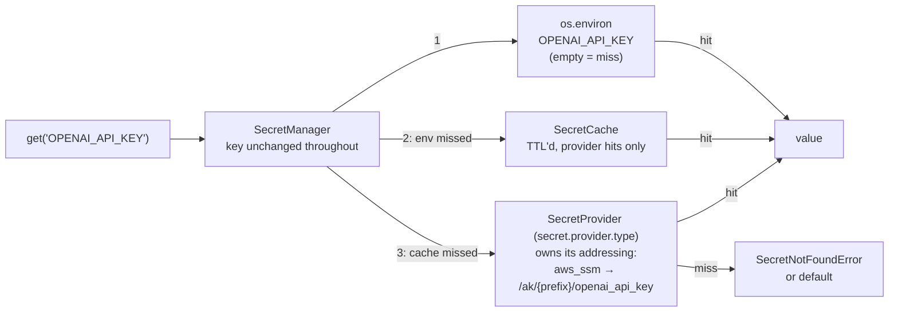

# #749: Resolve secrets from the environment, falling back to a managed store

A pluggable secret-resolution capability (`agentkernel/secret/`) that resolves an environment-variable-style key — `OPENAI_API_KEY` — to a value through a fixed three-layer order: the `os.environ` variable of that name, then the process cache, then the configured provider. **An environment variable that is already set always wins**; the provider only supplies keys the environment does not. The manager is a plain key → value mapping and transforms nothing; **each provider owns its own addressing**, so the AWS SSM provider (`aws_ssm`) is what turns `OPENAI_API_KEY` into the parameter `/ak/{prefix}/openai_api_key`, where `prefix` is the deployment prefix the Terraform modules already own. One value accessor, `get(key)`, returns the value to the caller; a resolved value is **never written to `os.environ`**. The manager is a single fixed class; configuration selects only the provider — `env`, `aws_ssm`, or a dotted path to a bring-your-own `SecretProvider`.

## Motivation

- Every secret reaches the runtime as a plaintext environment variable set by Terraform.
  - `examples/aws-serverless/openai/deploy/main.tf:53` — `"OPENAI_API_KEY" = var.openai_api_key`; 34 `main.tf` files under `examples/` and `e2e/` repeat the pattern.
  - Consequences: the value lands in Terraform state and in the Lambda/ECS console, rotation needs a `terraform apply`, and there is no read audit trail.
- The package has no secret abstraction — every consumer reads `os.environ` directly, each with its own name and its own default.
  - `ak-py/src/agentkernel/knowledgebase/neo4j.py:45` (`NEO4J_PASSWORD`, defaulting to the literal `"password"`), `knowledgebase/starburst.py:14` (`STARBURST_PASSWORD`), `guardrail/walledai.py:46` (`WALLED_API_KEY`), `integration/slack/adapter.py:285` (`SLACK_BOT_TOKEN`).
  - The sandbox providers indirect one level — `core/config.py:661` and `:666` configure an env var *name* (`api_key_env`), read at `sandbox/providers/e2b.py:107` and `providers/daytona.py:125` — which moves the name into config but still requires the value in the environment.
- The only existing indirection is file-based and unusable on Lambda: `AK_SECRETS_PATH` plus `<file:...>` placeholders substituted into `config.yaml` at load (`core/util/config_yaml_util.py:66`).
- The deployment prefix that would scope a secret path already exists and is mandatory — `ak-deployment/ak-aws/serverless/variables.tf:6`, "Prefix applied to every resource name" — but it is **not** injected into the runtime as an environment variable today, so the runtime cannot currently compose a scoped path.
- `boto3` is already an optional extra (`ak-py/pyproject.toml:60` — `"boto3>=1.41.4"`, inside the `aws` block opened at `:59`), so an SSM provider adds no new dependency, only a new `require_extra` branch.

## Requirements

### Naming and resolution

- **Keys are environment-variable names.** A caller passes `OPENAI_API_KEY` — the name the SDK itself already reads — and that one string is the variable the environment layer reads, the cache key, and the argument handed to the provider. Nothing in the manager renames, prefixes or case-folds it.
  - `key` **must match `^[A-Z][A-Z0-9_]*$`** — uppercase ASCII letters, digits and underscores, opening with a letter — so each secret has one spelling.
  - A key that does not match — including any key containing `/` — is invalid and rejected with `ValueError` before any layer is consulted.
- **Each provider owns its own addressing.** `get_secret(key)` receives the key and translates it to whatever its backend uses; the manager knows no paths, prefixes or naming conventions, so a second managed store (Secrets Manager, Vault, Key Vault) ships without touching the manager.
  - The **`aws_ssm` provider's** convention is `/ak/{prefix}/{key.lower()}`, leading slash included: `OPENAI_API_KEY` → `/ak/myproduct-dev/openai_api_key`. SSM requires the leading slash on a hierarchical name, and the IAM resource `…:parameter/ak/{prefix}/*` is the ARN of exactly this name.
  - `prefix` — the deployment identifier, read from the top-level `secret.prefix` (a deployment-wide scope a later managed-store provider reuses). The provider strips leading and trailing `/`; a `prefix` containing an interior `/` is rejected with `AKConfigError`, since it would compose outside the provisioned IAM grant.
  - `key.lower()` is collision-free under the key grammar: two distinct keys never produce one parameter name.
- Resolution order is fixed, first hit wins:
  1. **Environment** — `os.environ[key]`. A set, non-empty variable always wins, for every provider; no provider can override it.
  2. **Cache** — process-local, TTL'd, keyed by the key; holds provider hits only.
  3. **Provider** — the configured backend, given the key.
- **An environment variable set to `""` is a miss**: resolution continues to the cache and the provider. This is what lets a deployment keep an existing `"OPENAI_API_KEY" = var.openai_api_key` injection and still resolve from SSM by leaving the variable empty.
- Environment precedence is what keeps all 34 existing example deployments working unchanged: a key that the environment provides is never looked up in the provider.
- **The environment is read, never written.** Nothing in the capability sets, overwrites or unsets an `os.environ` variable; a provider-resolved value stays in the cache and is returned to the caller.
- Environment hits are not cached (the environment is re-read on every call and is always first). A provider hit is cached; a **miss is not cached**, so a parameter created after process start resolves on the next call.
  - Consequence: on a remote provider, every `get()` for a key that is in neither the environment nor the provider is a fresh provider round trip. SSM's standard `GetParameter` throughput is 40 TPS per account and region. The documented rule is therefore: **resolve secrets during startup, never on the request hot path**.
- Values are flat strings, returned verbatim from the provider. No JSON parsing, no sub-key addressing (see Non-goals).



### Public API

- `SecretManager` is a single concrete class — not an ABC, not selected by configuration — implementing the environment → cache → provider order; providers know only their own backend.
- `SecretManager.current()` returns the configured process-wide singleton, with `reset()` for tests — the `ExecutionManager`/`ScheduleManager` precedent. The accessor is `current()` because `get(key)` is the value accessor on the same class.
- `get(key: str, default: str | None = <unset>) -> str | None` — resolves through the order above. With no `default`, a miss in every layer raises `SecretNotFoundError`; with one (including `default=None`), it returns `default`. The default is returned on a **miss** only, never on a provider failure, and is not cached.
- **Values are returned to the caller, never exported.** There is no `inject`. An SDK that reads its own environment variable is either served by that variable directly (layer 1) or handed the resolved value explicitly — for the OpenAI Agents SDK, `set_default_openai_key(SecretManager.current().get("OPENAI_API_KEY"))`.
  - **Every resolution is an explicit call the application makes.** No automatic resolution at startup, no sweep, and no AK-owned entrypoint (`AgentRunner.run()`, `WebSocketGateway.run()`, the ECS/Lambda handlers) calls `get` on the application's behalf.
  - Existing AK consumers that read their own environment variable (`knowledgebase/neo4j.py:45`, `knowledgebase/starburst.py:14`, `guardrail/walledai.py:46`, `integration/slack/adapter.py:285`, the sandbox providers' `api_key_env` reads) are unchanged and keep reading `os.environ` (see Non-goals).
- `invalidate(key: str) -> None` and `clear() -> None` — drop **cached entries only**; neither writes to the provider or the environment. Rotation on long-lived containers: update the parameter, then `invalidate` (or wait out `cache_ttl`); the next `get` returns the new value, provided the environment does not set that key.
- All three are synchronous: `boto3` is synchronous and secrets are resolved from startup paths.
- **Concurrency** — the manager is safe to call from multiple threads (ECS consumer threads, `ThreadRunner` tasks). **Two separate locks**, each with one job:
  - **Singleton lock** — a class-level `RLock` guarding construction in `current()`/`reset()` only (the `ExecutionManager._lock` precedent).
  - **Cache write lock** — an instance lock owned by `SecretCache`, held only while writing, evicting or clearing entries. Cache reads take no lock, and the provider call is made **outside** any lock, so a slow provider call blocks only its own caller.
  - Consequence: concurrent `get`s for the same cold key may each call the provider; the last write wins, and all writes carry the same value. Acceptable because resolution belongs to startup.
  - **A `SecretProvider` must tolerate concurrent calls**; it is part of the provider contract.

### Pluggability

One seam: **the provider answers where a value lives**, selected by `secret.provider.type` with a dotted-path escape hatch. The resolution order, the cache and the key grammar are fixed in `SecretManager`.

- `SecretProvider` (ABC, `secret/base.py`):
  - `get_secret(key: str) -> Optional[str]` — the value stored for the key, or `None` when the backend does not have it. Owns its addressing; never caches, never falls back to another layer; must tolerate concurrent calls.
  - `from_config(config: _SecretConfig) -> SecretProvider` — the single construction seam. **A deviation from the `ScheduleProvider.from_config` precedent** (`schedule/provider/base.py:35`), which receives only the provider sub-block: this one receives the whole `secret` block, because `secret.prefix` is a deployment-wide scope a provider may need.
- `SecretProviderFactory` (`secret/factory.py`) — the `core/util/factory.py` house shape: built-in short names as `if/elif` real-import branches, `require_extra("aws", "secret.provider.type: aws_ssm")` around the boto3 import, `resolve_dotted` for any other value. An unknown short name raises `AKConfigError`.
- Provider types in v1:
  - `env` (**default**) — reads `os.environ`, `""` treated as absent. Since the environment is already layer 1, under `env` resolution is effectively environment-only; the default makes no network call and needs no credentials.
  - `aws_ssm` — AWS SSM Parameter Store, `GetParameter(Name=/ak/{prefix}/{key.lower()}, WithDecryption=True)`. Region and credentials from the boto3 environment default (`core/util/driver/dynamodb.py:38`). Requires `secret.prefix` and the `aws` extra.
  - **Dotted path** — any other value, resolved against `SecretProvider`, for a backend AK does not ship. Tests use a test-local subclass this way; no test-only provider ships.
- `SecretProviderContract` (`secret/testing.py`) — reusable conformance suite for built-in and bring-your-own providers (`QueueTransportContract`/`SandboxProviderContract` precedent): a seeded value round-trips verbatim; an absent key returns `None`; distinct keys never collapse onto one entry; the environment is consulted only by a provider that declares it does (`EnvSecretProvider`). Seeding and the capability flag are `spec.md`'s.

### Error handling

- `SecretNotFoundError` (`secret/errors.py`, subclass of `SecretError`) — no layer had the key and no `default` was supplied. The message names the key, never a value.
- A provider **miss** returns `None` to the manager. For `aws_ssm`, a miss is `ParameterNotFound` and nothing else.
- A provider **failure** raises `SecretError`.
  - `AccessDeniedException` is a failure, not a miss: the IAM grant is provisioned from the same `prefix` the path uses, so a denial means misconfiguration.
  - Credentials, network, throttling, and any other `ClientError` are failures too.
- `AWSSMSecretProvider` raises `AKConfigError` at construction when `secret.prefix` is empty (it would compose `/ak//openai_api_key`). The check lives in the provider, not the Pydantic model, because an empty prefix is legal for every other provider. It fires at first `SecretManager.current()`.
- A missing `boto3` with `provider.type: aws_ssm` raises `ImportError` naming the `aws` extra, at factory time — before the prefix check.
- No secret value ever appears in a log record, an exception message, a trace span, or a response body. Logs carry the key name or the provider's composed address only.

### Configuration

- Reuse audit: no existing `AKConfig` model expresses a secret backend, a path prefix, or a resolution cache. A new `secret` block is required.
- New block `_SecretConfig` on `AKConfig` (`core/config.py`), non-`Optional` with a `default_factory`, alongside `sandbox` and `execution`:

```yaml
secret:
  prefix: ""              # AK_SECRET__PREFIX; required by aws_ssm, ignored by env
  provider:
    type: env             # env | aws_ssm | dotted path to a SecretProvider subclass
  cache_ttl: 300          # seconds; 0 disables caching, negative is rejected
```

- **No manager `type` field** and **no `enabled` flag**: the manager is fixed, and the default provider costs nothing, so `provider.type` is the only opt-in.
- Every field justified:
  - `prefix` — the deployment scope; not derivable, because the Terraform `prefix` variable is not injected into the runtime today. Read by `AWSSMSecretProvider`. Top-level so a later managed-store provider reuses it and so the injected variable stays `AK_SECRET__PREFIX`.
  - `provider.type` — the factory selector; nested to match `schedule.provider.type`.
  - `cache_ttl` — seconds, default 300, `ge=0`. Read by `SecretCache`; the rotation-pickup window. `> 0` caches provider hits for that window; `0` disables caching (`invalidate`/`clear` become no-ops); `< 0` is rejected with `AKConfigError`.
- **No `secret.provider.aws_ssm` block in v1** — the provider needs no settings beyond `prefix`.
- Terraform supplies the prefix, never the type: the modules inject `AK_SECRET__PREFIX`, and the application's `config.yaml` selects `provider.type: aws_ssm` (the thread/schedule split).
- Existing YAML and `AK_*` environment variables are unaffected: the block is new, every field has a default, and the default provider changes no behavior.

### Components

All classes, one responsibility each, in `agentkernel/secret/` — a top-level capability package beside `sandbox/` and `schedule/`, since it depends on an optional cloud SDK and `core/` must not:

| Class | Module | Responsibility |
| --- | --- | --- |
| `SecretManager` | `manager.py` | `get`/`invalidate`/`clear` and the `current()` singleton; validates the key and drives the environment → cache → provider order |
| `SecretCache` | `cache.py` | TTL'd key → value store for provider hits; owns the cache write lock |
| `SecretProvider` | `base.py` | ABC: `get_secret(key)`, `from_config(config)` |
| `EnvSecretProvider` | `providers/env.py` | `os.environ` as the backing store; the default |
| `AWSSMSecretProvider` | `providers/aws_ssm.py` | SSM Parameter Store; composes `/ak/{prefix}/{key.lower()}`; `aws` extra |
| `SecretProviderFactory` | `factory.py` | Config-keyed selection; `env`/`aws_ssm` built-ins, `require_extra`, dotted-path BYO |
| `SecretError`, `SecretNotFoundError` | `errors.py` | Typed failures |
| `SecretProviderContract` | `testing.py` | Reusable conformance suite |
| `_SecretConfig` | `core/config.py` | Pydantic config block |

- Coupling: `secret/` imports `core` only; nothing in `core/`, `pipeline/`, or `api/` imports `secret/`.

### Deployment (`ak-deployment/ak-aws/`)

- Both root modules (`serverless`, `containerized`) gain the **same one variable** — the `enable_scheduling` precedent (`serverless/variables.tf:181`, `containerized/variables.tf:137`):

```hcl
variable "ssm_enabled" {
  type        = bool
  default     = false
  description = "Grant the application roles read access to /ak/<prefix>/* in SSM Parameter Store and inject AK_SECRET__PREFIX, so the application's `secret.provider.type: aws_ssm` can resolve secrets."
}
```

  - **Additive only.** Every resource this change adds is `count`-gated on `var.ssm_enabled`; no existing resource is modified, so `terraform plan` at the default is empty.
  - Propagated as a same-named `bool` into the submodules that run application code: `request_handler`, `agent_runner`, `response_handler`, `ws_connection_handler` in `serverless` (`serverless/state.tf:544`, `:628`, `:694`, `:521`); `rest_service`, `agent_runner` in `containerized` (`containerized/rest_service.tf:4`, `containerized/queue_mode.tf:23`).
  - When `true`, each submodule injects `AK_SECRET__PREFIX = var.prefix` (the existing resource-naming prefix, so path and grant cannot drift) and attaches to **its own** execution role one statement: `Action = ["ssm:GetParameter"]`, `Resource = "arn:aws:ssm:${region}:${account}:parameter/ak/${prefix}/*"`. Nothing broader.
  - **No KMS wiring.** `SecureString` parameters are expected to use the AWS-managed `alias/aws/ssm` key, whose key policy already permits decryption via SSM for account principals. A customer-managed key is the deployment's own `kms:Decrypt` grant (see Non-goals).
- Terraform does **not** create the parameters and does not set `AK_SECRET__PROVIDER__TYPE`.

### Examples and docs

- **Two examples move to the SSM path, one AWS serverless and one AWS containerized**, as #749's acceptance criteria require.
  - Each sets `ssm_enabled = true` and selects `provider.type: aws_ssm` in `config.yaml`, and calls `set_default_openai_key(SecretManager.current().get("OPENAI_API_KEY"))` at startup.
  - Each **drops** its `"OPENAI_API_KEY" = var.openai_api_key` injection and the `openai_api_key` variable, so on the deployed tiers the key always resolves from `/ak/<prefix>/openai_api_key` and no secret value is in Terraform state. The environment-first order still holds for local runs.
  - Each README documents creating the parameter (`aws ssm put-parameter`) as a prerequisite of deploying.
  - **CI seeds the parameter** before deploying, with a `seed-secrets` action in `.github/scripts/run_single_test.py` (a no-op for examples whose `config.yaml` does not select `aws_ssm`), so the SSM path is exercised in CI on both deployment modes. The dev-account CI role needs `ssm:PutParameter` on `arn:aws:ssm:<region>:<account>:parameter/ak/*` — a merge prerequisite, since the seed step precedes the base deployment.
- The remaining examples stay on environment variables unchanged.
- The deployment READMEs and the docs site document:
  - the resolution order (environment first, `""` is a miss) and the key convention (`OPENAI_API_KEY` → `/ak/{prefix}/openai_api_key`);
  - **creating the parameter manually** as a `SecureString` at `/ak/<prefix>/<key-lower>`, e.g. `aws ssm put-parameter --name /ak/myproduct-dev/openai_api_key --type SecureString --value <value>`;
  - the built-in providers, the IAM permissions, that resolved values must be passed to the SDK, the startup-not-hot-path rule, and rotation (update the parameter, then `invalidate` or wait out `cache_ttl`).

## Non-goals

The first four are deliberate deviations from the issue body, **confirmed by the requester**:

- **Store-first resolution.** The issue orders store → environment; this design puts the environment first, so an explicitly set variable is never overridden by the store.
- **Per-key secret references.** The path is derived from the key; no per-key configuration exists.
- **AWS Secrets Manager as a built-in.** Reachable in v1 as a dotted-path BYO provider; a built-in is a follow-up.
- **JSON-blob secrets.** Values are flat strings.
- Writing, creating, or rotating secrets from the runtime; Terraform creating the SSM parameters.
- Demonstrating the environment path in the two SSM examples; every other example already does.
- Azure Key Vault and GCP Secret Manager built-ins.
- A shared or cross-process cache.
- Writing resolved secrets into `os.environ`, automatic resolution at startup, and any sweep of `/ak/{prefix}/*`.
- Customer-managed KMS keys for `SecureString` parameters.
- Per-agent, per-tenant, or per-session secret scoping.
- Migrating the existing consumers in Motivation to call `get()`; they keep reading their environment variables.
- ECS task-definition native `secrets` blocks.

## Open questions

- None open.
