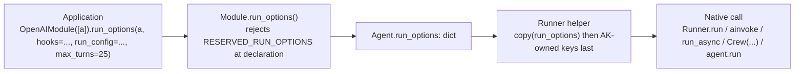

# #754: Per-agent native run options for framework adapters

Every framework adapter inlines its native run call with a fixed set of keyword arguments, so the
options each SDK offers at run time (OpenAI's `max_turns`, `hooks` and `RunConfig`; LangGraph's
`callbacks` and `recursion_limit`; ADK's `plugins` and `max_llm_calls`; Pydantic AI's
`usage_limits` and `event_stream_handler`; CrewAI's `step_callback`; smolagents' `max_steps`) are
unreachable without replacing the runner. This change adds one framework-agnostic slot on the AK
`Agent`, declared through the `Module` the way hooks are, whose contents are the framework's own
objects: each adapter merges it into its native call with the keys AK owns written last. No AK
abstraction over hooks, run configs or turn limits is introduced; the shape is the framework-context
seam (#526) applied to call options instead of state.

The supporting survey of each SDK's run signature, options object and hook mechanism is in
`research/native-run-options-survey.md`; this document cites it rather than restating it.

## Motivation

- **The native call is fixed in every adapter**, and the SDK options the user asked for sit on that
  call (see `research/native-run-options-survey.md` for the full signatures):
  - OpenAI: `Runner.run(agent.agent, input_data, session=..., context=...)` at
    `ak-py/src/agentkernel/framework/openai/openai.py:213`, `Runner.run_streamed(...)` at `:259`.
    `max_turns` (SDK default 10), `hooks`, `run_config` and `error_handlers` are all keyword
    arguments of those two calls and none is passed.
  - LangGraph: `ainvoke(input=..., config=config)` at `framework/langgraph/langgraph.py:414`,
    `astream_events(..., version="v2")` at `:469-472`; `config` is built at `:368` with only
    `configurable.thread_id`, so `callbacks`, `recursion_limit`, `tags` and `metadata` cannot be set.
  - ADK: the `Runner` is built per run at `framework/adk/adk.py:201` without `plugins`;
    `run_async` at `:220` passes no `run_config`; the stream path builds its own
    `RunConfig(streaming_mode=SSE)` at `:292`. `max_llm_calls` and plugins are unreachable.
  - Pydantic AI: `agent.agent.run(content, message_history=history, deps=produced)` at
    `framework/pydanticai/pydanticai.py:171`, `run_stream_events(...)` at `:223`; `usage_limits`,
    `model_settings`, `retries` and `event_stream_handler` are unreachable.
  - CrewAI: `Crew(agents=..., tasks=[task], verbose=False, memory=memory)` built per run at
    `framework/crewai/crewai.py:375-380`; `step_callback`, `task_callback` and `max_rpm` are
    unreachable.
  - smolagents: already builds `run_kwargs = {"reset": False}` at
    `framework/smolagents/smolagents.py:159-164`, but `max_steps` is not among them.
- **The only extension point today is a replacement runner**, and it is the wrong grain:
  - Each module picks exactly one of `runner=`, the trace runner, or the default:
    `openai.py:435-440`, `langgraph.py:649-652`, `adk.py:495-498`, `pydanticai.py:537-540`,
    `crewai.py:562-565`, `smolagents.py:321-324`. Passing a custom runner to add `hooks=` therefore
    silently drops Langfuse / Logfire / OpenLLMetry tracing for that module.
  - Changing one keyword argument means re-implementing the whole of `run` (request conversion,
    framework-context load and store, structured-output mapping, error mapping) and again for
    `stream`; the documented example at `docs/docs/advanced/traceability.md:477-500` shows this
    path, and its `run(agent, session, prompt)` signature is already stale against
    `Runner.run(agent, session, requests)` (`core/base.py:366`).
  - One runner serves every agent in a module, so options cannot differ per agent.
- **The concrete requests are static per deployment**, not per request: a
  `RunConfig(call_model_input_filter=...)` plus a higher `max_turns` to survive long tool loops, and a
  `RunHooks` instance that reports progress. Both are Python objects (callables, SDK dataclasses), so
  they cannot be YAML configuration.
- **AK's own progress path is real but partial.** `Runner.stream()` emits `ToolCallStart`,
  `StepStart` and the other `StreamEvent`s that `PostHook.on_stream_event` sees, but only in stream
  mode and only for what each adapter maps; there is no LLM-start or agent-start point, and nothing
  in `rest_sync` mode.
- **The precedent already exists.** The framework-context seam (`core/base.py:279-300`, #526) is a
  framework-agnostic slot whose contents are framework-native, injected by each adapter at the
  boundary with the rule that AK-internal keys are written last (`adk.py:198`, and `messages` in
  `langgraph.py:412`). This change reuses that shape for call options.
- **Trace runners compose for free with anything read off the `Agent`.** Every trace runner calls
  `super().run(agent, session, requests)` (`trace/langfuse/*.py`, `trace/logfire/*.py`,
  `trace/openllmetry/*.py`; e.g. `trace/langfuse/openai.py:38`), so options carried on the agent
  reach the native call through them unchanged.
- **Native hooks can already see the AK session.** `Runtime.run` enters `async with session` and
  `agent._activate()` before `agent.runner.run` (`core/runtime.py:273-286`), and `Runtime.stream`
  does the same around `agent.runner.stream` (`:323-341`). Hook callbacks awaited inside the native
  call, and tasks the SDK spawns from it (contextvars are copied into `create_task`), therefore
  resolve `Session.current()` and `Agent.current()`. A progress hook needs no per-request plumbing.

## Requirements

### Declaration surface: `Agent` and `Module` (`core/base.py`, `core/module.py`)

- `Agent` gains `run_options: dict[str, Any]`.
  - Initialised to `{}` in `Agent.__init__` beside `_pre_hooks` / `_post_hooks`
    (`core/base.py:431-432`); exposed as a property the same way `pre_hooks` is (`:455-460`).
  - Holds framework-native objects as-is. Nothing in `core/` inspects the values; only the owning
    adapter's runner reads them.
  - Not persisted and not part of the session: it is process-level configuration set at load time,
    like hooks.
- `Module` gains `run_options(agent, **options) -> Module`, chained like `pre_hook` / `post_hook`
  (`core/module.py:80-97`).
  - Abstract on `Module`, implemented in each adapter's module with the same one-line body shape as
    `pre_hook`, so each adapter's native-agent-to-name rule stays where it already is
    (`agent.name` in five modules, `agent.role` in `crewai.py:604`, a `name` argument in
    `smolagents.py:359`).
  - Repeated calls merge with `dict.update`: a later call wins per key. This lets an application set
    shared options once and override one key for one agent.
  - Options are read on every run, so a call after load but before the first request takes effect;
    mutation during a run is unsupported and undocumented (no lock, same as hooks).
  - The chained method is the **only** declaration surface. No module constructor gains a
    `run_options=` argument; `CrewAIModule`'s constructor maps (`output_pydantic`, `output_json`,
    `crewai.py:548-549`) are Task-level structured-output settings, not run options, and stay as
    they are.
  - `Agent.run_options` is a mutable dict, the same contract as the `pre_hooks` list. Direct
    mutation bypasses the declaration-time reservation check and is the caller's responsibility;
    the runner's AK-keys-written-last rule still holds, so a bypassed reserved key is overwritten,
    not honoured.
- **Reserved keys fail at declaration, never per request.**
  - Each adapter's `Agent` subclass declares `RESERVED_RUN_OPTIONS: ClassVar[frozenset[str]]`
    (base default `frozenset()`), listing the keys its runner populates itself or depends on for
    reply mapping (per-adapter lists below).
  - `Module.run_options` raises `ValueError` naming the adapter, the key, and the AK mechanism that
    owns it (e.g. "`context` is populated from the session's framework_context; seed it with
    `Session.set_framework_context()` instead").
  - Unknown keys are **not** validated. They are forwarded, and the SDK's own `TypeError` surfaces
    through the existing `user_facing_error_message` path on the first run. Rationale: the adapters
    wrap the SDK call as-is and do not duplicate its signature, and SDK versions add arguments faster
    than AK releases (see Resolved questions).

### Merge rule: `Runner` (`core/base.py`)

- The base `Runner` gains one helper the adapters call to build every native call's keyword
  arguments: start from a shallow copy of `agent.run_options`, then apply the AK-owned keys **last**.
  - Shallow copy, so an adapter that adjusts a value for one run (ADK forcing SSE in stream mode)
    never mutates the declared options or leaks a per-run value into the next run.
  - "AK-owned keys written last" is the invariant that keeps a declared option from displacing an
    AK mechanism; the declaration-time reservation above is the redundancy that makes the collision
    unreachable in practice. Both are required.
- No adapter inlines a fixed keyword set at its native call any more: `run` and `stream` in all six
  adapters build their arguments through the helper. smolagents' existing `run_kwargs` dict is the
  shape the others adopt.
- Merge depth is top-level only, with two documented exceptions where the caller and AK share one
  object rather than one key:
  - LangGraph `config`: deep-merged. AK's `configurable.thread_id` wins; every other
    `RunnableConfig` key (`callbacks`, `recursion_limit`, `tags`, `metadata`, `run_name`,
    `max_concurrency`, `run_id`) and every other `configurable` entry comes from the caller.
  - ADK `run_config` in **stream** mode: the caller's `RunConfig` is copied with
    `streaming_mode=StreamingMode.SSE`, because the AK stream mapping at `adk.py:294-348` depends on
    partial events. If the caller's value differed, a warning is logged once per runner. In **run**
    mode the caller's `RunConfig` is passed untouched (the SDK default `streaming_mode` is `NONE`).

### Per-adapter routing and reserved keys

Each adapter states where options go and which keys are reserved. The lists are the adapter's
`RESERVED_RUN_OPTIONS`; everything not listed is forwarded.

- **OpenAI** (`openai.py:213`, `:259`): options are keyword arguments of `Runner.run` and
  `Runner.run_streamed`, identical in both modes.
  - Reserved: `starting_agent`, `input`, `session`, `context`.
  - Forwarded examples: `max_turns`, `hooks`, `run_config`, `error_handlers`,
    `previous_response_id`, `auto_previous_response_id`, `conversation_id`.
- **LangGraph** (`langgraph.py:414`, `:469`): options are keyword arguments of `ainvoke` and
  `astream_events`; `config` follows the deep-merge rule above.
  - Reserved: `input`, `version` (the stream path fixes `v2`), and the result-shape arguments the
    reply mapping at `:424-427` depends on: `stream_mode`, `output_keys`, `print_mode`. The nested
    `config.configurable.thread_id` is also reserved and checked at declaration.
  - Forwarded examples: `config` (callbacks, recursion_limit, tags, metadata), `context`,
    `interrupt_before`, `interrupt_after`, `durability`.
- **Google ADK** (`adk.py:201`, `:220`, `:299-303`): two destinations, because AK constructs the
  ADK `Runner` per run.
  - To the `Runner(...)` constructor: `plugins`, `memory_service`, `artifact_service`,
    `credential_service`, `plugin_close_timeout`.
  - To `run_async`: `run_config` (stream-mode rule above).
  - Reserved: `agent`, `app`, `app_name`, `node`, `session_service`, `auto_create_session`,
    `user_id`, `session_id`, `new_message`, `state_delta` (state seeding belongs to the
    framework-context seam at `:196-199`), `invocation_id`, `yield_user_message`.
- **Pydantic AI** (`pydanticai.py:171`, `:223`): options are keyword arguments of `agent.run` and
  `agent.run_stream_events`.
  - Reserved: `user_prompt`, `message_history`, `deps`.
  - `event_stream_handler` is forwarded in run mode and **dropped with a warning logged once per
    runner in stream mode**, where `run_stream_events` does not accept it and AK's own
    `StreamEvent`s already carry the same information.
  - Forwarded examples: `usage_limits`, `model_settings`, `retries`, `metadata`, `toolsets`.
- **CrewAI** (`crewai.py:375-380`): options are keyword arguments of the per-run `Crew(...)`
  constructor.
  - Reserved: `agents`, `tasks`, `memory`.
  - `verbose=False` becomes a default the caller may override (it is a value AK chose, not one AK
    depends on).
  - Forwarded examples: `step_callback`, `task_callback`, `max_rpm`, `planning`.
  - Task-level options stay on the existing module constructor maps (`output_pydantic`,
    `output_json`, `crewai.py:548-549`); see Non-goals.
- **smolagents** (`smolagents.py:159-164`): options are merged into the existing `run_kwargs` and
  passed to `agent.run`.
  - Reserved: `task`, `reset`, `additional_args`, `stream`, `return_full_result` (the last two change
    the return type the adapter maps at `:176-180`).
  - Forwarded examples: `max_steps`, `images`.
  - Progress hooks need nothing here: `step_callbacks` is a constructor argument of the user-built
    `MultiStepAgent`. The documentation says so rather than inventing a route.

### Trace runners (`trace/langfuse/`, `trace/logfire/`, `trace/openllmetry/`)

- No change. Every trace runner delegates to `super().run(agent, session, requests)`, so options
  declared on the agent reach the native call through them. One test asserts the pass-through for a
  trace runner so the composition guarantee is checked, not assumed.
- The `runner=` argument and the custom-runner documentation remain for behaviour that is not a
  keyword argument (wrapping the call in a span, replacing the execution API); the documentation
  redirects keyword-argument needs to run options.

### Progress hooks and the AK session

- A native hook instance declared once at load time is sufficient for per-request behaviour: inside
  its callbacks `Session.current()`, `Agent.current()` and the volatile cache (including
  `ACTING_USER_CACHE_KEY`) resolve, in both run and stream mode.
  - Tested for OpenAI `RunHooks.on_tool_start` in both modes, since `run_streamed` drives the loop
    from spawned tasks.
- Documentation states the two progress paths side by side and when to use each: AK `StreamEvent`s
  through `PostHook.on_stream_event` (framework-agnostic, stream mode, what the adapter maps) versus
  native hooks through run options (any execution mode, the framework's full lifecycle, framework
  specific).

### Configuration

- **No new configuration.** Run options are Python objects declared in code at module load, exactly
  like hooks; nothing in `AKConfig` changes, no `enabled` flag is added (an agent with an empty
  `run_options` behaves exactly as today), and no YAML or `AK_*` environment variable is read.

### Documentation and skills

- `docs/docs/core-concepts/runner.md`: a "Per-agent native run options" section beside "Per-run
  framework context" (`:216`), covering the merge rule and the two exceptions.
- `docs/docs/core-concepts/module.md`: `run_options` in the module API beside `pre_hook`.
- `docs/docs/frameworks/{openai,langgraph,google-adk,pydantic-ai,crewai,smolagents}.md`: one table
  per framework of destination, reserved keys and the turn-limit / progress-hook example for that
  SDK.
- `docs/docs/advanced/traceability.md:477-500`: the custom-runner example gets its signature fixed
  and a sentence redirecting keyword-argument needs to run options.
- `.agents/skills/ak-dev-architecture/SKILL.md`: the Agent, Module and Runner entries.
- `.agents/skills/ak-dev-new-framework-integration/SKILL.md`: the adapter checklist gains four items:
  declare `RESERVED_RUN_OPTIONS`, implement `Module.run_options`, build native keyword arguments
  through the base helper, and the corresponding tests.

### Testing

- Per adapter, in the existing `ak-py/tests/test_<framework>_runner.py` files using their current
  patch targets (e.g. `agentkernel.framework.openai.openai.Runner`,
  `tests/test_openai_runner.py:66`): the native call receives the declared options; an AK-owned key
  wins when both are present; the declared dict is not mutated across two runs.
- Declaration, in `tests/test_module.py`: a reserved key raises `ValueError` naming the adapter and
  key; repeated calls merge last-wins; `run_options` chains with `pre_hook` / `post_hook` in either
  order.
- The adapter-specific rules: LangGraph `config` deep merge keeps caller callbacks and AK's
  `thread_id`; ADK stream forces SSE on a caller `RunConfig` and run passes it untouched; ADK
  `plugins` reach the `Runner` constructor; Pydantic AI `event_stream_handler` is forwarded in run
  and dropped with a warning in stream; smolagents `max_steps` merges with `reset=False`; CrewAI
  `step_callback` reaches `Crew` and `verbose` is overridable.
- Trace pass-through: one Langfuse runner test, following `tests/test_trace_langfuse_langgraph.py`.
- Session context inside a native hook, both modes, for OpenAI.

## Component diagram

## Non-goals

- **Per-request options** threaded through `Runtime.run`, `AgentService`, `ChatService` or the
  queue envelope. Hook instances and filter callables are not JSON-serialisable, and every service
  signature would change. Per-request data reaches a hook through `Session.current()` and the
  volatile cache, the `acting_user_id` precedent.
- **A callable form** `run_options(agent, factory)` where the factory receives `(agent, session,
  requests)` and returns the dict. It can be layered on this design later without changing the
  declaration or merge rule; nothing requested needs it.
- **Configuration-driven options** in `AKConfig`. The values are code.
- **A framework-agnostic hook or turn-limit abstraction.** AK's framework-agnostic progress surface
  is `StreamEvent` plus `PostHook.on_stream_event`; this change does not add a second one.
- **Validating unknown keys** against SDK signatures (see Resolved questions).
- **CrewAI `Task` options** beyond the existing `output_pydantic` / `output_json` module maps.
- **Changing what the trace runners span** (#193) or persisting usage metrics (#525). This seam lets
  an application attach an `on_agent_end` hook that reads usage, but adds no AK feature for it.
- **smolagents progress hooks**: `step_callbacks` is already on the user-owned agent.

## Resolved questions

Decisions taken with the requester on 2026-09-24; each alternative is recorded so a reviewer can see it
was considered.

- **Unknown-key handling: forward to the SDK.** Options not in `RESERVED_RUN_OPTIONS` are passed
  through unvalidated and the SDK's own `TypeError` surfaces on the first run. Rejected: introspecting
  the native call's signature at declaration. It cannot be done uniformly (LangGraph's `ainvoke` takes
  `**kwargs`, CrewAI's `Crew` is a Pydantic model) and would duplicate each SDK's own validation.
- **Declaration surface: the chained method only.** Rejected: a `run_options={agent_name: {...}}`
  constructor argument on every module for parity with `CrewAIModule(output_pydantic=...)`. One way to
  declare; the CrewAI maps are structured-output settings, not run options.
- **ADK stream `streaming_mode`: override to SSE with a one-time warning.** Rejected: raising at
  declaration when `execution.mode` is `stream` and the caller's `RunConfig` sets another mode. The
  override keeps a `RunConfig` declared for `max_llm_calls` working in both execution modes.
- **Pydantic AI `event_stream_handler` in stream mode: drop with a one-time warning.** Rejected:
  reserving the key outright, which would remove the only progress-hook route in run mode.
- **Mutability: a mutable dict, parity with `pre_hooks`.** Rejected: a read-only mapping with
  `Module.run_options` as the sole writer. The AK-keys-written-last rule in the runner already makes a
  bypassed reserved key harmless, so the stricter type buys nothing.
