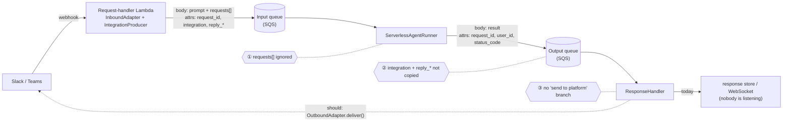

# #760: Deliver messaging-integration replies in AWS serverless queue mode

On AWS Lambda in queue mode, a Slack or Teams message gets through and the agent runs, but the
reply never reaches the platform. The two serverless queue consumers, `ServerlessAgentRunner`
and `ResponseHandler` (`deployment/aws/serverless/`), were never taught about integration
traffic when their pipeline twins were. This change teaches them. It does that by moving the
pipeline's integration-delivery logic into one shared class that both sides call, rather than
copying it a second time.

> Base: `develop` @ `35a8641`. Every `path:line` below was checked against that commit. Paths
> are relative to `ak-py/src/agentkernel/` unless they start with `docs/`, `ak-py/tests/`, or
> `ak-deployment/`.

---

## 1. What the user sees

- Someone mentions the bot in Slack.
- The acknowledgement ("thinking…") appears. It is posted at the edge, before the message is
  queued (`integration/adapter/webhook.py:73`), so it always works.
- After that, nothing arrives: no reply and no error message.
- Behind the scenes, the agent ran, but only on the prompt text, not on the attachments or
  context the Slack adapter prepared. Its answer went into the response store, which nobody
  reads for Slack traffic.

## 2. How a message is supposed to travel

A messaging platform is not a client that waits for an HTTP answer. So an integration message
carries its own **return address** ("post the answer to channel C123, thread 1712.44") through
both queues. At the end, the response handler uses that address to deliver the reply.



| Stage | Pipeline class (works) | Serverless class (broken) |
|---|---|---|
| Edge: parse the webhook, enqueue | `WebhookRESTRequestHandler` + `IntegrationProducer` | same classes |
| Agent runner | `pipeline.AgentRunner` / `StreamAgentRunner` | `ServerlessAgentRunner` / `ServerlessStreamAgentRunner` |
| Response handler | `pipeline.ResponseHandler` | serverless `ResponseHandler` |

The edge is shared and already correct. `IntegrationProducer.enqueue` stamps `integration` and
the `reply_*` context on the input message (`integration/adapter/producer.py:74`) and puts the
prebuilt request list in the body (`:81`). The bug is entirely in the two serverless consumers
downstream.

## 3. What goes wrong: three drops

### ① The runner ignores the prebuilt request list

- The inbound adapter builds the full request list at the edge: the prompt, an
  `AgentRequestAttachmentRef` per attachment (the bytes are already in the attachment store),
  and `AgentRequestAny` context such as the user, channel, thread, and trigger. The list travels
  in the body as `BaseRunRequest.requests` (`core/model.py:287`).
- The serverless runner never passes that list on:
  - sync: `process_chat_request(req=body)` (`deployment/aws/serverless/akagentrunner.py:172`)
  - stream: `process_stream_chat_sync(req=body)` (`akagentrunner.py:339`)
- When `requests` is `None`, `RequestBuilder` rebuilds the list from the prompt alone. Everything
  else the adapter composed is lost.
- The pipeline passes it: `requests=body.requests` (`pipeline/agent_runner.py:59`, `:226`).

### ② The runner forgets the return address

- `_get_record_attributes` builds a fixed dict: `message_group_id`, `message_deduplication_id`,
  `request_id`, `user_id`, plus `endpoint_url` in WebSocket modes (`akagentrunner.py:89-97`).
- `_send_to_output_queue` then sends only `endpoint_url` and `status_code` as custom attributes
  (`akagentrunner.py:127-135`). `request_id` and `user_id` are added by `SQSHandler`.
- `integration` and every `reply_*` attribute on the input message are dropped. The reply leaves
  the runner with no address.
- The pipeline forwards them through `_is_forwarded` (`pipeline/agent_runner.py:27-32`).

| Attribute | On the input (from `IntegrationProducer`) | On the output **today** | On the output **after** |
|---|---|---|---|
| `request_id` | yes | yes | yes |
| `user_id` | no, on purpose (`producer.py:64-66`) | yes, from the body fallback (`akagentrunner.py:80-84`) | yes, unchanged (Q2) |
| `status_code` | no | yes | yes |
| `endpoint_url` | no | no (only WebSocket-entered traffic has it) | no |
| `integration` | yes | **dropped** | yes |
| `reply_*` (e.g. `reply_channel`, `reply_thread_ts`) | yes | **dropped** | yes |

### ③ The response handler has no "send to platform" branch

- `process_message` branches only on `execution.mode`: ASYNC → WebSocket `CHAT_RESPONSE`, STREAM
  → WebSocket `STREAM_CHUNK`, everything else → response store (`akresponsehandler.py:129-136`).
- `on_permanent_failure` has the same three branches (`akresponsehandler.py:159-204`).
- Neither method looks at `integration`. The pipeline checks it **first**, before the mode
  branch, and delivers through `IntegrationAdapterFactory.create_outbound(...)`
  (`pipeline/response_handler.py:54-57`, `:80-85`, `:147-193`).

### What the three drops add up to, per execution mode

| `execution.mode` | Runner | Response handler | Net effect in Slack |
|---|---|---|---|
| `rest_sync`, `rest_async` | Agent runs on the prompt alone (①) | Writes a 200 record to the response store | Silence. The reply sits in the store. |
| `async` | Agent runs on the prompt alone (①) | `_broadcast_via_websocket` raises because there is no `endpoint_url` (`akresponsehandler.py:100-101`). After the retries it goes to `on_permanent_failure`, which crashes (see §5). | Silence |
| `stream` | `_get_record_attributes` raises **before the agent runs** because `endpoint_url` is required (`akagentrunner.py:269-270`). `on_permanent_failure` calls the same method (`:359`) and swallows the error (`:373-376`). | Never reached | Silence. The agent never ran. |

## 4. How it happened

| When | What | Effect on serverless |
|---|---|---|
| 2026-04-07, #257 | Serverless queue mode ships: `ServerlessAgentRunner` and `ResponseHandler` | Integrations (such as Slack, since 2025) ran the agent directly. No integration traffic went through the queues yet. |
| 2026-08-13, #621 (spec #495) | The `pipeline/` package ships. `AgentRunner` and `ResponseHandler` generalize the ECS classes | Serverless keeps its own parallel classes |
| 2026-09-18, #680 (spec #524) | The messaging-integration seam ships: `integration` + `reply_*` + `requests` handling is added to the **pipeline** classes | Serverless is explicitly left out |

- **The deferral that never landed.** The #524 design says the legacy runners
  (`ECSAgentRunner`, `ECSOutputConsumer`, `ServerlessAgentRunner`) "are untouched — they inherit
  the seam through #495's recorded 'ECS runtime classes become pipeline instantiations'
  follow-up" (`docs/specs/524-pluggable-integration-adapter/design.md:388-390`).
- **That follow-up names only the ECS classes.** It lists
  `ECSAgentRunner`/`ECSStreamAgentRunner`/`ECSOutputConsumer`/`ECSIOHandler`
  (`docs/specs/495-onprem-kubernetes/plan.md:318`). The serverless runner and response handler
  are on nobody's list. #524 pointed at a follow-up that doesn't cover them.
- **No guard fired.** #524's only fail-fast, `requires_pipeline` (`api/http.py:123`), catches a
  missing runner. On serverless the runner exists and accepts the message: `BaseRunRequest`
  parses `requests` fine. It just doesn't act on it.
- **No test crossed the gap.**
  - The only end-to-end integration test runs the pipeline classes over the `in_memory`
    transport (`ak-py/tests/test_integration_roundtrip.py:1`).
  - The serverless tests (`ak-py/tests/test_serverless_status_propagation.py`) use plain REST
    records.
- **REST modes fail quietly.** A well-formed 200 record lands in the store, so nothing errors
  and nothing alerts.
- **Root cause:** copy drift. The same pipeline stage has two parallel implementations, and a
  feature was added to only one of them.

## 5. Found along the way: serverless permanent failures are never delivered (in any mode)

- `ResponseHandler.on_permanent_failure` reads `message_attributes["message_group_id"]`
  (`akresponsehandler.py:153`) from the **custom** attributes. The group id is an SQS **system**
  attribute (`MessageGroupId`). The runner sends it as a FIFO send parameter, never as a custom
  attribute (`akagentrunner.py:139-144`).
- Reproduced on `develop`: a record shaped exactly like the runner's output raises
  `KeyError: 'message_group_id'`. The `except` at `:205-207` catches it, logs it, and delivers
  nothing.
- **Consequence today, with no integrations involved:**
  - A REST client polling for a permanently failed request waits until it times out.
  - A WebSocket client never receives its error frame.
- **Why nobody noticed:** `test_a_permanent_failure_is_stored_as_a_server_error` calls
  `_construct_message_for_store` directly and never exercises `on_permanent_failure`
  (`ak-py/tests/test_serverless_status_propagation.py:88-96`).
- **Why it matters here:** the new integration permanent-failure branch lives in the same
  method. It is fixed in scope as §7.5 (R5), per decision Q1.

## 6. The fix at a glance

| Where | Change |
|---|---|
| **New** `pipeline/integration_delivery.py` | `IntegrationDelivery` owns two things: the return-address rule (`integration` + `reply_*`), and "deliver this reply, or an error, to its platform". It is lifted out of the pipeline's `ResponseHandler`/`AgentRunner`. |
| `ServerlessAgentRunner` | Passes `requests=body.requests`. Copies the return address onto the output message, including on permanent failure. |
| `ServerlessStreamAgentRunner` | Hands integration messages to `ServerlessAgentRunner`, because a platform has no streaming consumer. Passes `requests=body.requests` for everything else. |
| Serverless `ResponseHandler` | Checks `integration` **first**: `deliver`, or `deliver_error` when status >= 400. On permanent failure, `deliver_error`. Fixes the `message_group_id` KeyError. |
| Pipeline `AgentRunner` / `ResponseHandler` | Call `IntegrationDelivery` instead of their private copies. No behaviour change: the existing tests pass unmodified. |

Guiding rule: **behave exactly like the pipeline, and get there by sharing its code, not by
copying it.** Copying is how this bug happened (§4).

---

## 7. Requirements

### 7.1 Shared component: `IntegrationDelivery` (`pipeline/integration_delivery.py`)

- **R1.1: one class owns integration delivery.** It holds the return-address rule and the
  platform-delivery step, both currently private to the pipeline
  (`pipeline/agent_runner.py:27-32`, `pipeline/response_handler.py:147-193`).
- **R1.2: it takes plain attribute dicts, not `QueueMessage`.** Lambda hands consumers raw SQS
  records: a lowercase `body`, and nested `messageAttributes` flattened by
  `SQSHandler.get_message_custom_attributes`. The existing envelope conversion reads the boto3
  `Body` key only (`pipeline/transport/sqs.py:208-217`), so the serverless side could not
  reuse a `QueueMessage` API without an extra conversion.
- **R1.3: interface.**

  ```python
  class IntegrationDelivery:
      """Integration traffic's return address, and delivery of a reply back to its platform (#524 §6)."""

      def __init__(self, logger: logging.Logger): ...
          # The caller's logger, so pipeline log lines keep their current logger name
          # (the ConsumerLoop precedent).

      # -- return address (static: pure functions of the attributes) --
      @staticmethod
      def integration_of(attributes: Mapping[str, str]) -> Optional[str]: ...
          # The adapter name, or None for non-integration traffic.
      @staticmethod
      def is_routing_attribute(name: str) -> bool: ...
          # True for "integration" and every "reply_*" name.
      @classmethod
      def routing_attributes(cls, attributes: Mapping[str, str]) -> Dict[str, str]: ...
          # The subset to copy from an input message onto its reply.
      @staticmethod
      def reply_context(attributes: Mapping[str, str]) -> Dict[str, str]: ...
          # reply_* with the prefix removed: what OutboundAdapter.deliver() reads.

      # -- delivery --
      def deliver(self, integration: str, attributes: Mapping[str, str], body: Any,
                  status_code: int, session_id: Optional[str] = None) -> None: ...
          # status < 400 -> adapter.deliver(AgentReplyText(response=str(body["result"])), ctx)
          # status >= 400 -> adapter.deliver_error(adapter.ERROR_MESSAGE, ctx)
          # A non-dict body is treated as {"result": body}. Raises on failure.
      def deliver_permanent_failure(self, integration: str, attributes: Mapping[str, str],
                                    session_id: Optional[str] = None) -> None: ...
          # adapter.deliver_error(adapter.ERROR_MESSAGE, ctx). Raises; callers catch.
  ```

- **R1.4: the delivery logic moves unchanged.** It is the same logic as
  `ResponseHandler._deliver_integration` today (`pipeline/response_handler.py:170-193`):
  - the reply is `AgentReplyText(response=str(body.get("result", "")))`
  - an error sends the adapter's generic `ERROR_MESSAGE`, never the internal error text (that is
    logged instead)
  - the coroutine runs through `run_async_sync`
- **R1.5: status parsing stays with the caller.** `deliver` takes an `int`, so each handler keeps
  its current parse rule:
  - pipeline: strict `int(...)` (`response_handler.py:183`)
  - serverless: tolerant `_resolve_status_code`, where absent or unparseable means 200
    (`akresponsehandler.py:71-85`)
- **R1.6: the coupling rule is kept.** At module scope the file imports only `core` and
  `pipeline.envelope`. `IntegrationAdapterFactory` is imported **inside** the adapter-resolving
  method, exactly as `ResponseHandler._outbound_adapter` does today
  (`pipeline/response_handler.py:147-163`). A Lambda that never sees integration traffic never
  imports `agentkernel.integration`.
- **R1.7: no per-message state on the instance.** Adapters are already factory-cached and
  shared (`integration/adapter/factory.py:23-40`). Every call opens its own event loop through
  `run_async_sync`, which matches the `OutboundAdapter` contract.

### 7.2 `ServerlessAgentRunner` (`deployment/aws/serverless/akagentrunner.py`)

- **R2.1: pass the prebuilt list.**
  `process_chat_request(req=body, requests=body.requests)` (today: `:172`). When `requests` is
  `None`, as for all plain REST traffic, behaviour is identical to today.
- **R2.2: capture the return address.** `_get_record_attributes` adds one key,
  `"routing_attributes": IntegrationDelivery.routing_attributes(message_attributes)`: a dict,
  empty for non-integration traffic. Existing keys and their order are unchanged.
- **R2.3: send the return address.** `_send_to_output_queue` appends one
  `SQSHandler.CustomAttribute` (string type) per entry in
  `record_attributes.get("routing_attributes", {})`, after the existing `endpoint_url` and
  `status_code` attributes. The `.get(..., {})` read keeps any caller-built `record_attributes`
  (for example the reporter's workaround subclass) working.
- **R2.4: permanent failure carries the address too.** `on_permanent_failure` already builds its
  attributes through `_get_record_attributes` (`:188`), so R2.2 and R2.3 make the 500 error
  reply carry `integration` + `reply_*` with no further change. The response handler then turns
  it into a platform error message (R4.3).
- **R2.5: signatures unchanged.** `process_message`, `on_permanent_failure`,
  `_get_record_attributes` and `_send_to_output_queue` keep their signatures. These are the four
  methods the reporter overrides, so their subclasses keep loading until they are deleted.

### 7.3 `ServerlessStreamAgentRunner` (`deployment/aws/serverless/akagentrunner.py`)

- **R3.1: integration messages take the non-streaming path.** At the top of `process_message`,
  when `IntegrationDelivery.integration_of(...)` finds an adapter name on the record's custom
  attributes, return `ServerlessAgentRunner.process_message(record)`.
  - Why: a messaging platform has no streaming consumer, so it gets one reply. This is pipeline
    parity (`pipeline/agent_runner.py:213-214`).
  - It also removes the pre-run `endpoint_url` crash (`:269-270`) for this traffic.
  - The call names the class explicitly, because `ServerlessStreamAgentRunner` is **not** a
    subclass of `ServerlessAgentRunner` (both extend `LambdaSQSConsumer`, `:13`, `:203`), so
    `super()` cannot reach it.
- **R3.2: same for permanent failure.** At the top of `on_permanent_failure`, delegate to
  `ServerlessAgentRunner.on_permanent_failure(record)` (parity with
  `pipeline/agent_runner.py:242-243`).
- **R3.3: pass the prebuilt list for WebSocket traffic too.**
  `process_stream_chat_sync(req=body, requests=body.requests)` (today: `:339`; parity with
  `pipeline/agent_runner.py:226`).
- **R3.4: nothing else changes.** Chunk fan-out, dedup suffixes, and the `endpoint_url`
  requirement stay as they are for non-integration STREAM traffic.

### 7.4 Serverless `ResponseHandler` (`deployment/aws/serverless/akresponsehandler.py`)

- **R4.1: integration first.** `process_message` checks `integration` **before** the mode branch
  (today `:129-136`):

  ```python
  message_attributes = SQSHandler.get_message_custom_attributes(record)
  integration = IntegrationDelivery.integration_of(message_attributes)
  if integration:
      cls._get_integration_delivery().deliver(
          integration, message_attributes, cls._decode_body(record.get("body")),
          status_code=cls._resolve_status_code(message_attributes),
          session_id=SQSHandler.get_message_system_attributes(record).get("MessageGroupId"),
      )
      return
  # ... existing ASYNC / STREAM / response-store branches, unchanged
  ```

  - `_decode_body(value)` is a new private staticmethod. It is the body parse
    `_construct_message_for_store` already does (`akresponsehandler.py:54-56`: `json.loads` a
    string body), lifted out so both methods share it with identical semantics. A non-JSON body
    raises, the record is retried, and it ends in `on_permanent_failure`, the same as in the
    pipeline.
- **R4.2: a failed delivery is retried.** `deliver` raises, `LambdaSQSConsumer.handle` reports
  the record in `batchItemFailures` (`serverless/core/sqs_consumer.py:58-62`), and SQS redelivers
  it up to `execution.queues.output.max_receive_count`. A briefly unreachable Slack API gets its
  retries. This matches `pipeline/response_handler.py:170-176`.
- **R4.3: permanent failure tells the platform user.** `on_permanent_failure` checks
  `integration` first inside its `try`. If it is present, it calls
  `deliver_permanent_failure(...)` and returns. This branch sits **before** the line that crashes
  today (`:153`). Any exception is caught by the existing `except` (`:205-207`) and never
  re-raised, per the `RawQueueConsumer` contract.
- **R4.4: status >= 400 becomes a platform error.** A 4xx/5xx status forwarded by the runner
  (validation errors, and the runner's permanent-failure 500 from R2.4) calls `deliver_error`
  with the adapter's generic message. Covered by R1.3; no separate code.
- **R4.5: integration replies never touch the response store or the WebSocket.** This holds in
  all four execution modes.
- **R4.6: the delivery instance is built lazily.** `_get_integration_delivery()` builds it on
  first use and caches it at class level, the same pattern as `_get_response_store()` and
  `_get_base_ws_handler()` (`:30-40`).

### 7.5 Adjacent fix: the permanent-failure `KeyError` (§5), in scope per Q1

- **R5.1: read the group id from the right place.** `on_permanent_failure` reads the session id
  from the **system** attributes:
  `SQSHandler.get_message_system_attributes(record).get("MessageGroupId")`, replacing
  `message_attributes["message_group_id"]` (`:153`).
- **R5.2: the three existing branches start working.** With R5.1, the ASYNC, STREAM, and
  response-store branches deliver as their code already intends:
  - an error frame over WebSocket, or
  - a 500 record the REST poll returns.
- **R5.3: no other change.** The error text, the message types, and the 500 status are
  unchanged.

### 7.6 Pipeline classes: refactor only, no behaviour change

- **R6.1: `pipeline.ResponseHandler` delegates.** It holds an
  `IntegrationDelivery(self._log)` and calls it from `process` and `on_permanent_failure`. Its
  private `_outbound_adapter`, `_reply_context` and `_deliver_integration` are removed. No test
  patches them (grep of `ak-py/tests/`). The `_record_thread_reply` docstring that cites
  `ResponseHandler._outbound_adapter` as the lazy-import precedent
  (`pipeline/agent_runner.py:127-128`) is updated to cite `IntegrationDelivery`.
- **R6.2: `pipeline.AgentRunner` uses the shared rule.** `_is_forwarded` becomes
  `key in (ATTR_REQUEST_ID, ATTR_USER_ID, ATTR_ENDPOINT_URL) or
  IntegrationDelivery.is_routing_attribute(key)`, which forwards exactly the same set as today.
- **R6.3: parity is proven by unmodified tests.** `ak-py/tests/test_pipeline_response_handler.py`,
  `test_pipeline_agent_runner.py` and `test_integration_roundtrip.py` pass **unmodified**.

### 7.7 Output attributes and the SQS 10-attribute limit

- SQS allows at most **10 message attributes** per message. With this change, the output message
  of integration traffic carries:
  - `request_id`, `user_id`, `status_code`, `integration` (4)
  - plus the adapter's `reply_*` keys
- Worst case per built-in adapter, counting keys added by `acknowledge()`
  (`integration/adapter/webhook.py:73`):

  | Adapter | `reply_*` keys (source) | Output attributes | Under 10? |
  |---|---|---|---|
  | Slack | 3 + 2 from the ack: `channel`, `thread_ts`, `user`, `ack_ts`, `ack_channel` (`slack/adapter.py:164`, `:246`) | 9 | yes |
  | Gmail | 5: `to`, `subject`, `thread_id`, `message_id`, `in_reply_to` (`gmail/adapter.py:281-287`) | 9 | yes |
  | Teams | 2 (`teams/adapter.py:257`) | 6 | yes |
  | WhatsApp | 2 (`whatsapp/adapter.py:206`) | 6 | yes |
  | Telegram, Messenger, Instagram | 1 each | 5 | yes |

- **R7.1: add nothing else to integration output messages.** Any additional attribute pushes
  Slack and Gmail to the limit. `user_id` stays (Q2), so the headroom is one slot.

### 7.8 Configuration and deployment

- **No new configuration.** No new `AKConfig` field, no `enabled` flag, no new block. The
  `integration` attribute on the message is the switch, exactly as in the pipeline.
- **No Terraform change.** What the application must provide already has a place:
  - **Response-handler Lambda:**
    - the platform extra installed in its package (for example `agentkernel[aws,slack]`), since
      the outbound adapter now runs there
    - the platform credentials, passed through the existing
      `response_handler.environment_variables` (`ak-deployment/ak-aws/serverless/variables.tf:418`)
  - **Agent-runner Lambda:** for attachment-bearing messages, `multimodal.enabled: true` with a
    shared store (`redis` or `dynamodb`). This is already enforced at the edge
    (`integration/adapter/producer.py:34-59`), and the runner needs the same block to resolve
    `AgentRequestAttachmentRef` ids.
- **R8.1: document these.** The requirements above go into the serverless deployment docs and the
  messaging-integration docs (§7.11).

### 7.9 Compatibility: what does not change

- The serverless consumers' public surface: class names, `handle()`, and the four overridable
  classmethods' signatures (R2.5).
- Non-integration traffic in every mode:
  - the same attributes on the output message
  - the same response-store records
  - the same WebSocket frames
  - the same chunk dedup ids

  The one exception is R5 (the permanent-failure fix).
- The wire format: the attribute names (`integration`, `reply_*`) are the ones the pipeline
  already uses (`pipeline/envelope.py:12-14`). A message produced for one topology is understood
  by the other.
- Lambda cold-start imports: `agentkernel.integration` is imported only when an integration
  message arrives (R1.6).

### 7.10 Tests

- **New file `ak-py/tests/test_serverless_integration_delivery.py`**, modelled on
  `test_serverless_status_propagation.py`. It uses Lambda-shaped records, patches
  `SQSHandler.send_message_to_output_queue` at the runner module, and uses a recording
  `OutboundAdapter` resolved by dotted path. Each point below is one test or a parametrized set:
  1. The sync runner calls `process_chat_request` with `requests=body.requests`.
  2. The stream runner calls `process_stream_chat_sync` with `requests=body.requests` for
     WebSocket traffic.
  3. The runner copies `integration` and every `reply_*` onto the output message. A
     non-integration record's output attributes are exactly what they are today.
  4. Runner permanent failure: the 500 reply carries `integration` + `reply_*`.
  5. The stream runner hands an integration record to `ServerlessAgentRunner`
     (`process_stream_chat_sync` is never called), for both `process_message` and
     `on_permanent_failure`, and with no `endpoint_url` on the record.
  6. Response handler, parametrized over all four execution modes: an integration record reaches
     `deliver` with `reply_*` stripped, and neither the response store nor the WebSocket handler
     is touched.
  7. Status handling: 4xx/5xx sends `deliver_error(ERROR_MESSAGE)`. An unparseable status takes
     the 200 path (serverless's tolerant parse).
  8. A raising `deliver` makes `ResponseHandler.handle()` return the record in
     `batchItemFailures`.
  9. Response-handler permanent failure with `integration` calls `deliver_error`. An exception
     from the adapter is swallowed.
  10. (R5) Permanent failure without `integration`, using a record whose group id is only in
      `attributes.MessageGroupId`:
      - REST modes store a 500 record with that session id
      - ASYNC broadcasts `SYSTEM_RESPONSE`
      - STREAM broadcasts an error `STREAM_CHUNK`
  11. **Round trip, the test that would have caught this bug.** An `InboundRequest` carrying
      Slack's full five-key reply context goes through `IntegrationProducer` (on a capturing fake
      transport), is turned into a Lambda input record, and runs through
      `ServerlessAgentRunner.process_message` (chat service faked).
      - The boto3 client returned by `SQSHandler.get_sqs_client()` is patched, not
        `send_message_to_output_queue`. That way the real attribute building runs, including
        the `request_id`/`user_id` stamping and the duplicate-name rejection.
      - The test asserts the output send has at most 10 `MessageAttributes` (§7.7).
      - The captured send is turned into a Lambda output record and runs through
        `ResponseHandler.process_message`. The recording adapter must receive the reply, with the
        original reply context.
  12. Import hygiene: importing the serverless runner and response handler, using the
      `sys.modules` isolation pattern of `test_aws_lazy_exports.py`, loads no
      `agentkernel.integration` module. This is true
      on `develop` today (checked), so the test guards against a regression.
- **New unit tests for `IntegrationDelivery`**, either in the same file or in
  `test_pipeline_integration_delivery.py`: the routing predicate, the reply-context stripping,
  non-dict bodies, and the lazy import.
- **Existing tests that must pass unmodified:** `test_pipeline_response_handler.py`,
  `test_pipeline_agent_runner.py`, `test_integration_roundtrip.py`,
  `test_serverless_status_propagation.py`, `test_serverless_agent_runner_schedule.py`,
  `test_akresponsehandler.py`, `test_thread_pipeline_recording.py`.
  None of them asserts the exact `process_chat_request` call or
  an exact `_get_record_attributes` dict for the non-streaming runner (checked by grep).
- **One fixture update, found during implementation:** `test_akagentrunner_stream.py`. Two of its
  fake `process_stream_chat_sync` functions predate the real `requests` keyword, so they gain
  `requests=None`. No assertion changes. See spec §Testing.

### 7.11 Docs and skills

- `.agents/skills/ak-dev-architecture/SKILL.md`:
  - the pipeline table row for `response_handler.py`/`agent_runner.py` and coupling rule 2
    (`:773`, `:800`), which name `ResponseHandler._outbound_adapter` as a lazy-import site, now
    point to `IntegrationDelivery`
  - the `ServerlessAgentRunner` row in the ECS class table gains the integration behaviour
- The serverless deployment docs and the messaging-integration docs get the deployment
  requirements from §7.8.
- Before merge, confirm through the `ak-dev-sync-docs-from-branch` and
  `ak-dev-sync-skills-from-branch` flows.

---

## 8. Behavioural changes

1. **Integration replies reach the platform on serverless.** In REST modes they stop landing in
   the response store. In ASYNC/STREAM they stop failing the WebSocket broadcast. This is the
   fix.
2. **STREAM mode runs integration messages as one reply.** Before, it crashed before the agent
   ran.
3. **A body's `requests` list is honoured on serverless, for every entry point.**
   - Both Lambda routers already forward the whole body, including a client-supplied
     `requests`: REST at `serverless/core/router/rest_lambda.py:143-148`, and WebSocket at
     `ws_lambda.py:397`. The runner used to ignore it and now uses it as-is.
   - The pipeline's queue mode already does this (`pipeline/request_handler.py:60-66` enqueues
     the body unchanged, and the runner passes `body.requests`). See Q4.
   - What a client gains:
     - it can set the order of the request list itself
     - it can reference a stored attachment by id (`AgentRequestAttachmentRef`). The ids are
       random UUIDs (`core/multimodal/storage/storage_manager.py:256`).
   - What it does not gain: skipping the prompt. Both Lambda routers enqueue through
     `SQSHandler.send_message_to_input_queue`, which validates the body against
     `QueueMessageBody` with a required `prompt: str` (`deployment/aws/core/sqs_handler.py:56`,
     validated at `:279`). Only the pipeline's REST route, through `RequestProducer`, accepts a
     body without a prompt.
   - What it does not gain: context injection. Unknown body fields already reach the agent as
     `AgentRequestAny` (`core/chat_service.py:143-148`).
4. **Serverless permanent failures are delivered** (R5, per Q1). REST pollers get the 500
   record instead of timing out. WebSocket clients get their error frame.
5. **Log lines:** the serverless response handler logs integration deliveries under its own
   logger (`ak.aws.responsehandler`). Pipeline log names and messages are unchanged.

## 9. Non-goals

- **ECS containerized: out of scope, to be tracked in a follow-up issue.**
  - **The code gaps are the same.**
    - ① `ECSAgentRunner` calls `process_chat_request(req=body)` and the stream runner calls
      `process_stream_chat_sync(req=body)` (`containerized/akagentrunner.py:142`, `:246`).
    - ② `_send_to_output_queue` forwards only `status_code` and `endpoint_url`
      (`containerized/akagentrunner.py:106-121`).
    - ③ `ECSOutputConsumer.process_message` branches on mode only (`akoutputconsumer.py:65-83`).
    - The permanent-failure `KeyError` (§5) is **not** present on ECS, which reads
      `MessageGroupId` from the system attributes (`akoutputconsumer.py:100`).
  - **The standard ECS setup fails loudly, not silently.**
    - Mounting `WebhookRESTRequestHandler` through `ECSIOHandler.run(handlers=...)` reaches
      `RESTAPI._reject_pipeline_only_handlers` (`api/http.py:109`) and raises `AKConfigError`.
    - The `rest-api` task is `stop_all_on_failure=True`, `graceful=True`
      (`ecs_io_handler.py:78-84`), so the container exits 1 with the reason logged.
    - #524 designed this on purpose (`docs/specs/524-pluggable-integration-adapter/design.md:253-254`).
  - **The supported ECS path works.** That is `pipeline.IOHandler` plus `pipeline.AgentRunner`.
    The e2e messaging harness runs this way on ECS (`e2e/app/app.py:104`; `e2e/app/deploy/main.tf:8-13`,
    `ak-containerized`, `container_type = "ecs"`).
  - **The one silent case is a mixed deployment:** a pipeline `IOHandler` edge on the SQS
    transport, with an `ECSAgentRunner` container consuming the input queue.
    - The wire formats interoperate, so the ECS runner consumes the Slack message, drops ① and ②,
      and the pipeline response handler stores the reply.
    - It is easy to fall into, because the ECS examples' `app_agent_runner.py` files use
      `ECSAgentRunner`.
  - **Why the follow-up is separate:** ECS is already on the #495 "become pipeline
    instantiations" list (`docs/specs/495-onprem-kubernetes/plan.md:318`), which removes these
    classes' drift at its root. The follow-up should at least close the mixed-deployment case,
    for example with a guard in `ECSAgentRunner` or by reusing `IntegrationDelivery`.
- **Turning the serverless classes into pipeline instantiations.** That is the bigger migration,
  with its own behaviour decisions (status mapping, API Gateway vs pod push). This change only
  shares the one piece that drifted.
- **Conversation-thread recording on serverless** (the `thread` marker,
  `pipeline/agent_runner.py:112-153`). Serverless nulls the thread wiring in queue mode, and it
  is a separate capability.
- **Hosting the inbound webhook on Lambda.** How the application runs
  `WebhookRESTRequestHandler` at the edge is unchanged. The edge already works (the
  acknowledgement posts).
- **Streaming replies to platforms, and structured (`AgentReplyAny`) formatting.** These keep
  pipeline behaviour: one text reply built from `str(result)`.
- **Exactly-once delivery.** If `deliver` fails after a partial post, the retry can post again.
  The pipeline has the same property.
- **Making direct mode and queue mode agree on a client-supplied `requests` list** (Q4). Direct
  REST ignores it and both queue modes honour it. Deciding whether client-built lists should be
  edge-only needs its own issue.
- **Enforcing the SQS 10-attribute limit at the producer.** `IntegrationProducer` budgets bytes
  (8 KB), not count. A bring-your-own adapter with 7 or more `reply_*` keys can pass the input
  queue and still overflow the output. The pipeline's SQS transport has the same exposure; that
  needs its own issue.

## 10. Decisions (open questions, resolved)

- **Q1: fix the permanent-failure `KeyError` (§5, R5) in this change?**
  - **Resolved: yes, fix it in #760.** It is a one-line fix in the method this change already
    rewrites, and without it every serverless permanent failure, in every mode, is silently lost.
    It is listed as behavioural change 4 and covered by test 10.
  - Rejected: a separate issue. The integration branch would still have worked, because it runs
    first.
- **Q2: drop `user_id` from integration output messages?**
  - The pipeline doesn't stamp it on integration traffic. `IntegrationProducer` omits it on
    purpose (`producer.py:64-66`), and the pipeline adds it back only on the body-fallback path
    (`pipeline/agent_runner.py:178-180`). Serverless always adds it from the body
    (`akagentrunner.py:80-84`).
  - Nothing on the serverless integration path reads it. Only WebSocket delivery reads the
    attribute (`akresponsehandler.py:98-103`, `:162`, `:180`), and the integration branch returns
    before reaching it. The user identity the run needs travels in the body (`req.user_id` →
    `acting_user_id`, `core/chat_service.py:396`), and the Slack user the reply mentions travels
    in `reply_user`.
  - **Resolved: keep it.** Serverless keeps stamping `user_id` as it does today. This is the
    smallest change, and every built-in adapter still fits: Slack and Gmail use 9 of the 10 SQS
    attributes (§7.7).
  - Rejected: dropping it for integration traffic. That would be stricter parity with the
    pipeline and would reclaim one attribute slot.
- **Q3: shared class, or a minimal copy?**
  - **Resolved: shared `IntegrationDelivery`** (§7.1). Copy drift is the root cause (§4), and the
    house patterns ask for shared logic to be lifted. The pipeline refactor (§7.6) is proven
    behaviour-neutral by its existing tests passing unmodified.
  - Rejected: copying the pipeline helpers into the two serverless files. That would be a smaller
    diff with no pipeline edits, but it keeps two copies of the same rule.
- **Q4: what happens to a client-supplied `requests` list on serverless** (behavioural change 3)?

  | Path | Client-sent `requests` today |
  |---|---|
  | Direct REST, no queue (`api/handler.py:114`, `requests` never passed) | ignored |
  | Pipeline queue mode | honoured |
  | Serverless queue mode | ignored today; honoured after this change |

  - **Resolved: honour it.** The runner always passes `body.requests`, matching the pipeline's
    queue mode and the issue's expected behaviour.
  - Rejected:
    - passing `requests` only when the message has an `integration` attribute, which would
      diverge from the pipeline
    - stripping `requests` at the Lambda REST router, which has the same effect enforced at the
      edge
  - Follow-up: direct mode ignores a client's `requests` while both queue modes honour it. That
    is a cross-topology inconsistency, and whether client-built lists should be edge-only belongs
    in its own issue (§9).
