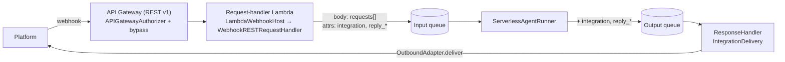

# #760: Messaging integrations on AWS Lambda: deliver replies and receive webhooks

Messaging integrations (Slack, Teams, WhatsApp, Messenger, Instagram, Telegram) do not work on AWS
Lambda today, at either end. Replies never reach the platform, because the serverless queue
consumers drop the integration's return address. And AK has no first-party way to receive a
platform webhook on Lambda, because `WebhookRESTRequestHandler` is a FastAPI handler and the Lambda
router is not FastAPI.

This change fixes both ends by reusing the pipeline's code rather than copying it:

- **Part 1:** the pipeline's integration-delivery logic moves into one shared class that the
  serverless consumers also call.
- **Part 2:** a thin Lambda host turns an API Gateway event into the Starlette `Request` every
  adapter already takes, calls the existing `WebhookRESTRequestHandler`, and turns its answer back
  into an API Gateway response.
- **Terraform:** the gaps that stop a webhook from reaching the request-handler Lambda, or from
  working once it arrives, are closed.

> Base: `develop` @ `71c2943b`. Every `path:line` below was checked against it. Paths are relative
> to `ak-py/src/agentkernel/` unless they start with `ak-py/`, `ak-deployment/`, `docs/` or
> `examples/`. Unqualified Terraform paths are under `ak-deployment/ak-aws/serverless/`.
>
> This design supersedes the reply-only design on `fix/760-serverless-integration-delivery`
> (draft PR #767). Both parts are implemented on `feature/760-serverless-integrations`.

---

## Motivation

### Part 1: replies never reach the platform

A messaging platform is not a client waiting on an HTTP answer. So an integration message carries
its own **return address** through both queues: the `integration` attribute plus `reply_*`
context, stamped by `IntegrationProducer` (`integration/adapter/producer.py:74`). The serverless
consumers drop it in three places.

- **① The runner ignores the prebuilt request list.**
  - The inbound adapter builds the full list at the edge: the prompt, an
    `AgentRequestAttachmentRef` per attachment, and `AgentRequestAny` context. It travels as
    `BaseRunRequest.requests` (`core/model.py:287`).
  - The serverless runner never passes it on:
    - sync: `process_chat_request(req=body)` (`deployment/aws/serverless/akagentrunner.py:172`)
    - stream: `process_stream_chat_sync(req=body)` (`:339`)
  - So `RequestBuilder` rebuilds the list from the prompt alone. The pipeline passes
    `requests=body.requests` (`pipeline/agent_runner.py:59`, `:226`).
- **② The runner forgets the return address.**
  - `_get_record_attributes` builds a fixed dict (`akagentrunner.py:89-97`), and
    `_send_to_output_queue` sends only `endpoint_url` and `status_code` as custom attributes
    (`:127-135`).
  - `integration` and `reply_*` are dropped. The pipeline forwards them through `_is_forwarded`
    (`pipeline/agent_runner.py:27-32`).
- **③ The response handler has no "send to platform" branch.**
  - `process_message` and `on_permanent_failure` branch on `execution.mode` only
    (`deployment/aws/serverless/akresponsehandler.py:129-136`, `:159-204`).
  - The pipeline checks `integration` **first** and delivers through the outbound adapter
    (`pipeline/response_handler.py:54-57`, `:80-85`, `:147-193`).
- **Net effect, in every mode:**
  - `rest_*`: the reply sits in the response store.
  - `async`: the WebSocket broadcast raises for want of an `endpoint_url` (`akresponsehandler.py:100-101`).
  - `stream`: `_get_record_attributes` raises before the agent even runs (`akagentrunner.py:269-270`).
  - Slack stays silent in all four.
- **Found along the way: serverless permanent failures are never delivered, integrations or not.**
  - `on_permanent_failure` reads `message_attributes["message_group_id"]` from the **custom**
    attributes (`akresponsehandler.py:153`). The group id is the SQS **system** attribute
    `MessageGroupId`: the runner sends it as a FIFO parameter (`akagentrunner.py:139-144`).
  - The result is a `KeyError`, caught and logged at `:205-207`. REST pollers time out, and
    WebSocket clients never get their error frame.
  - It went unnoticed because the only test calls `_construct_message_for_store` directly
    (`ak-py/tests/test_serverless_status_propagation.py:88-96`).
- **Root cause: copy drift.**
  - #524 added `integration`/`reply_*`/`requests` handling to the pipeline classes only. It
    deferred the legacy runners to #495's "ECS runtime classes become pipeline instantiations"
    follow-up (`docs/specs/524-pluggable-integration-adapter/design.md:388-390`).
  - That follow-up lists only the ECS classes (`docs/specs/495-onprem-kubernetes/plan.md:318`).
    The serverless runner and response handler were on nobody's list.
  - No guard or test crossed the gap. The only end-to-end integration test runs the pipeline on
    `in_memory` (`ak-py/tests/test_integration_roundtrip.py:1`).

### Part 2: no first-party way to receive a webhook on Lambda

- **Nowhere to mount the handler.**
  - `Lambda` dispatches through `RESTLambdaRouter`, a hand-rolled exact-match path/method table
    whose handlers are sync `(event, context)` callables
    (`deployment/aws/serverless/core/router/rest_lambda.py:380-412`). There is no FastAPI app and
    no ASGI adapter.
  - `WebhookRESTRequestHandler` exposes only a FastAPI `APIRouter` (`integration/adapter/webhook.py:45-51`).
  - The repo already says this about a sibling handler: "the serverless target's router is not
    FastAPI … so `ScheduleRESTRequestHandler` (a FastAPI APIRouter) cannot be mounted here"
    (`examples/aws-serverless/schedule-openai/lambda_request_handler.py:3-6`).
  - Every webhook adapter needs a real Starlette `Request`, so a dict shim cannot stand in:
    - Slack dispatches through Bolt's FastAPI handler (`integration/slack/adapter.py:17-18`)
    - Teams returns a `JSONResponse` (`integration/teams/adapter.py:26-27`, `:174`)
    - Telegram, WhatsApp, Messenger and Instagram import `fastapi.Request` (`telegram/adapter.py:13`,
      `whatsapp/adapter.py:8`, `messenger/adapter.py:6`, `instagram/adapter.py:10`)
  - The #760 report runs the edge through a bridge of its own. AK provides none.
- **The pipeline-only guard does not reach Lambda.**
  - `WebhookRESTRequestHandler.requires_pipeline = True` (`webhook.py:27`) is enforced only by
    `RESTAPI._reject_pipeline_only_handlers` (`api/http.py:109`, `:117-131`), and Lambda never
    calls it.
  - With no `execution.queues` block, `QueueTransportFactory.resolve_type()` returns `in_memory`
    (`pipeline/transport/base.py:117-120`). An enqueue would land in a process-local queue that
    nothing drains, and the platform would still get its 200.
- **Error statuses are lost.** `Lambda.handler` turns every exception into a 500
  (`deployment/aws/serverless/aklambda.py:84-91`). A rejected signature, such as
  `HTTPException(403)` (`telegram/adapter.py:124`), reaches the platform as a retryable 500.
- **Terraform blocks the edge in three places.**
  - **Authorizer:** when one is configured, every gateway endpoint gets `CUSTOM` authorization
    (`modules/api-gateway/main.tf:94`). Platforms send no bearer token.
    - `APIGatewayAuthorizer` Denies a request with no `Authorization` header, because
      `Headers.Authorization` is a required field (`deployment/aws/serverless/akauthorizer.py:10-11`).
    - With caching on, API Gateway does not even call the authorizer. It is a `REQUEST`
      authorizer with `method.request.header.Authorization` as an identity source
      (`modules/api-gateway/main.tf:234-235`), and its TTL defaults to 150 s (`variables.tf:300`).
    - AWS: "If a specified identity source is missing, null, or empty, API Gateway returns a
      `401 Unauthorized` HTTP response without calling the Lambda authorizer function" when
      caching is on. With caching off, it "directly passes the request to the Lambda function"
      ([Use API Gateway Lambda authorizers](https://docs.aws.amazon.com/apigateway/latest/developerguide/apigateway-use-lambda-authorizer.html)).
    - The authorizer's event carries headers, the query string, stage variables and context,
      but no body (same page). Platform signatures are computed over the body, so only the
      adapter can check them.
  - **Attachments:** under `queue_mode` the request handler gets no multimodal DynamoDB table
    (`state.tf:592`, `:597-598`), so it has neither `AK_MULTIMODAL__DYNAMODB__TABLE_NAME`
    (`modules/request-handler/main.tf:362-363`) nor the table's IAM policy (`:61-90`).
    - Adapters download and offload attachments at the edge, and the producer insists on a
      shared store (`integration/adapter/producer.py:35-59`). An attachment-bearing message
      therefore fails in that Lambda.
  - **WebSocket modes:** no REST API Gateway is created (`state.tf:39-41`), and
    `gateway_endpoints` is rejected (`variables.tf:286-289`).

### Both parts: packaging, and the docs

- **Packaging.** FastAPI is missing from the platform extras.
  - The six webhook adapter modules, `adapter/meta.py` and `adapter/webhook.py` import `fastapi`
    at module scope. Inbound and outbound share each module, so the response handler (part 1)
    and the request handler (part 2) both need it.
  - No platform extra ships it. The `slack` extra, for example, is `slack-bolt` + `httpx`
    (`ak-py/pyproject.toml:126-129`); FastAPI comes only from the `api` extra (`:120-125`), with
    uvicorn and gunicorn.
  - Verified in a clean `agentkernel[aws,slack]` environment:
    `IntegrationAdapterFactory.create_outbound("slack")` raises "integration 'slack' requires the
    'slack' extra", caused by `ModuleNotFoundError: No module named 'fastapi'`. `require_extra`
    blames the installed extra (`core/util/factory.py:61-64`).
  - The serverless import path is deliberately fastapi-free
    (`ak-py/tests/test_aws_lazy_exports.py:13-30`).
- **The docs overpromise.** The Telegram, Messenger and Instagram pages offer "Serverless (AWS
  Lambda)" and point at `examples/aws-serverless` (`docs/docs/integrations/telegram.md:287`,
  `messenger.md:505`, `instagram.md:530`). None of those examples contains an integration.

## Requirements: part 1, reply delivery

### Shared component: `IntegrationDelivery` (`pipeline/integration_delivery.py`)

- **One class owns integration delivery**: the return-address rule, and the platform-delivery step.
  Both are lifted out of the pipeline, where they are private today (`pipeline/agent_runner.py:27-32`,
  `pipeline/response_handler.py:147-193`).
- **It speaks plain attribute mappings, not `QueueMessage`.** Lambda hands consumers raw SQS
  records, and the envelope conversion reads the boto3 `Body` key only
  (`pipeline/transport/sqs.py:208-217`).
- **Interface:**
  - `IntegrationDelivery(logger)`: holds the caller's logger, so log lines keep their logger name
  - `integration_of(attributes) -> Optional[str]`
  - `is_routing_attribute(name) -> bool`: `integration` and every `reply_*`
  - `routing_attributes(attributes) -> dict`
  - `reply_context(attributes) -> dict`: `reply_*` with the prefix stripped
  - `deliver(integration, attributes, body, status_code, session_id=None)`:
    - status < 400 → `AgentReplyText(response=str(body["result"]))`
    - status >= 400 → `deliver_error(adapter.ERROR_MESSAGE)`
    - raises on failure, so the host retries
  - `deliver_permanent_failure(integration, attributes, session_id=None)`
- **Moved unchanged** from `ResponseHandler._deliver_integration` (`pipeline/response_handler.py:170-193`),
  including the generic `ERROR_MESSAGE` (never the internal error) and `run_async_sync`.
- **Status parsing stays with each caller.** The pipeline uses strict `int(...)` (`:183`); the
  serverless handler keeps its tolerant `_resolve_status_code`, where absent or unparseable means
  200 (`akresponsehandler.py:71-85`).
- **Coupling rule kept.** At module scope it imports only `core` and `pipeline.envelope`.
  `IntegrationAdapterFactory` is imported inside the adapter-resolving method, as today
  (`pipeline/response_handler.py:147-163`). A Lambda that never sees integration traffic never
  imports `agentkernel.integration`.
- **No per-message state on the instance.** Adapters are factory-cached and shared
  (`integration/adapter/factory.py:23-40`).

### `ServerlessAgentRunner` (`deployment/aws/serverless/akagentrunner.py`)

- **Passes the prebuilt list:** `process_chat_request(req=body, requests=body.requests)`
  (today `:172`). With `requests=None`, plain REST traffic behaves exactly as today.
- **Copies the return address.**
  - `_get_record_attributes` adds `"routing_attributes": IntegrationDelivery.routing_attributes(...)`.
  - `_send_to_output_queue` sends each of those entries as a custom string attribute, after
    `endpoint_url` and `status_code`. It reads them with `.get(..., {})`, so caller-built dicts
    still work.
- **Permanent failure carries the address too.** `on_permanent_failure` builds its attributes
  through `_get_record_attributes` (`:188`), so its 500 reply reaches the platform as an error
  notice.
- **Signatures unchanged** for `process_message`, `on_permanent_failure`, `_get_record_attributes`
  and `_send_to_output_queue`. These are the methods the #760 report's workaround subclasses
  override.

### `ServerlessStreamAgentRunner` (`deployment/aws/serverless/akagentrunner.py`)

- **An integration record takes the non-streaming path.** A message with `integration` goes to
  `ServerlessAgentRunner.process_message` / `.on_permanent_failure`.
  - A platform has no streaming consumer, so it gets one reply. This is pipeline parity
    (`pipeline/agent_runner.py:213-214`, `:242-243`), and it removes the pre-run `endpoint_url`
    crash (`:269-270`).
  - The call names the class explicitly, because `ServerlessStreamAgentRunner` is not a subclass
    of `ServerlessAgentRunner` (`:13`, `:203`).
- **Passes the prebuilt list for WebSocket traffic:** `process_stream_chat_sync(req=body, requests=body.requests)`
  (today `:339`).

### Serverless `ResponseHandler` (`deployment/aws/serverless/akresponsehandler.py`)

- **Integration first**, before the mode branch (today `:129-136`): `deliver(...)`, with the
  session id taken from the system attribute `MessageGroupId`.
  - A new private `_decode_body` shares the body parse `_construct_message_for_store` already does
    (`:54-56`).
- **A failed reply is retried.** A raising `deliver` lands the record in `batchItemFailures`
  (`serverless/core/sqs_consumer.py:58-62`), up to `execution.queues.output.max_receive_count`.
  - The built-in adapters' `deliver_error` is best effort. It logs and returns (for example
    `integration/slack/adapter.py:268-272`), as it does in the pipeline.
- **Permanent failure tells the platform user:** `deliver_permanent_failure(...)`, checked first
  inside the existing `try` (`:205-207`), and never re-raised.
- **Integration replies never touch the response store or the WebSocket**, in any mode.
- **Built lazily:** `_get_integration_delivery()`, the same pattern as `_get_response_store()`
  (`:31-34`).

### Adjacent fix: the permanent-failure `KeyError`

- `on_permanent_failure` reads the session id from the system attributes
  (`SQSHandler.get_message_system_attributes(record).get("MessageGroupId")`), replacing `:153`.
- The ASYNC, STREAM and response-store branches then deliver as their code intends: an error frame
  over WebSocket, or a 500 record for the REST poll.
- The error payload carries the session id once, before the branches. The pipeline
  (`pipeline/response_handler.py:119-122`) and ECS (`containerized/akoutputconsumer.py:100-106`)
  already do this. It replaces the ASYNC branch's own assignment (`:167`).
- The error text, the message types and the 500 status are unchanged.

### Pipeline classes: refactor only, no behaviour change

- `pipeline.ResponseHandler` delegates to `IntegrationDelivery`. Its private `_outbound_adapter`,
  `_reply_context` and `_deliver_integration` are removed; no test patches them.
- `pipeline.AgentRunner._is_forwarded` uses `IntegrationDelivery.is_routing_attribute`, which
  forwards the same set as today.
- The docstring citing `_outbound_adapter` as the lazy-import precedent (`pipeline/agent_runner.py:127-128`)
  now cites `IntegrationDelivery`.
- Parity is proven by `test_pipeline_response_handler.py`, `test_pipeline_agent_runner.py` and
  `test_integration_roundtrip.py` passing **unmodified**.

### The SQS 10-attribute limit

- An integration output message carries `request_id`, `user_id`, `status_code` and `integration`,
  plus the adapter's `reply_*` keys, including those `acknowledge()` adds (`webhook.py:73`).
- Worst cases:
  - Slack: `channel`, `thread_ts`, `user`, `ack_ts`, `ack_channel` (`slack/adapter.py:164`, `:246`),
    9 attributes in total
  - Gmail: `to`, `subject`, `thread_id`, `message_id`, `in_reply_to` (`gmail/adapter.py:281-287`),
    9 attributes in total
  - every other adapter: 6 or fewer
- **Add nothing else to integration output messages.** The headroom is one slot.

## Requirements: part 2, receiving webhooks

### Lambda webhook host (`deployment/aws/serverless/`)

- **`LambdaWebhookHost`**: a new class that hosts one `WebhookRESTRequestHandler` on the Lambda
  router.
  - It wraps the existing handler and copies nothing. `verify`, `parse`, `acknowledge` and
    `enqueue` keep one definition, shared with the pipeline `IOHandler`, which is also the
    supported ECS path.
  - It registers routes through the existing `RESTLambdaRouter.register`:
    - `POST <adapter.webhook_path>` → `handler.handle`
    - `GET <adapter.challenge_path>` → `handler.challenge`, only when that path is set (WhatsApp,
      Messenger, Instagram)
  - The routing logic is unchanged. The router's exact-match table and base-path stripping
    (`rest_lambda.py:394-401`) decide which route runs, and no built-in webhook path has path
    parameters.
    - That stripping needs `API_BASE_PATH`, `API_VERSION` and `AGENT_ENDPOINT`. Without them,
      `dispatch` sends every event to the default chat handler (`rest_lambda.py:402-404`), so a
      webhook would be silently parsed as a chat request. Terraform always sets them
      (`modules/request-handler/main.tf:348-351`), and a guard below covers other deployments.
- **`WebhookRESTRequestHandler.adapter`**: a new read-only property, so the host reads the paths
  without touching `_adapter`. `PollerRunner.adapter` is the precedent (`integration/adapter/poller.py:38-41`).
- **`LambdaEventTranslator`**: a new class with one job, API Gateway v1 proxy event ⇄ Starlette (Q3).
  - **Event → `Request`** (a real `starlette.requests.Request`):
    - Body: the exact bytes, base64-decoded when `isBase64Encoded`. Signature checks hash the raw
      body (Slack's signing secret, Meta's `X-Hub-Signature-256`).
    - Headers: taken from `multiValueHeaders`, falling back to `headers`; lookup is
      case-insensitive.
    - Query: taken from `multiValueQueryStringParameters`, falling back to
      `queryStringParameters`, the same rule as headers.
      - A valid proxy event can carry only the single-value map, and existing serverless handlers
        read that shape (`examples/aws-serverless/schedule-openai/lambda_request_handler.py:37`).
      - Meta's `hub.challenge` handshake reads `hub.mode`, `hub.verify_token` and `hub.challenge`
        from it (`integration/adapter/meta.py:53-55`). Without the fallback, those are missing and
        every handshake returns 403.
    - Method, path, and host/scheme: taken from the event.
  - **Result → proxy response**, producing the same status and bytes the FastAPI surfaces send:
    - A Starlette `Response` (Bolt's own, or Teams' `JSONResponse`) passes through with its
      status, headers and body.
    - Any other return value (the `success_response()` dict, `webhook.py:82`; Meta's `int`
      challenge, `meta.py:57`) goes through FastAPI's own `jsonable_encoder` and `JSONResponse`,
      with status 200. The serialization is reused, not re-implemented.
    - `HTTPException` returns its own status, its `headers`, and FastAPI's `{"detail": ...}` body,
      never a 500.
    - Any other exception returns a 500 and is logged, as `aklambda.py:84-91` does today.
- **Event loop**: one loop per Lambda execution environment, reused across warm invocations.
  - On every other surface the adapters run on uvicorn's single long-lived loop
    (`pipeline/io_handler.py:111`), and they are constructed once, at module import.
  - `run_async_sync` gives no such guarantee: it falls back to `asyncio.run`, a fresh loop per
    call, whenever the thread has no current loop (`core/util/async_bridge.py:34-40`). So the host
    owns its loop explicitly.
- **Public entry point**: `Lambda.mount(handlers=[WebhookRESTRequestHandler(SlackInboundAdapter())])`,
  called at module scope in the request-handler Lambda.
  - It takes the same handler objects an app passes to the pipeline's
    `IOHandler.run(handlers=...)`. `ECSIOHandler.run` refuses these handlers by design: its REST
    branch calls `AWSRestAPI.run` (`deployment/aws/containerized/ecs_io_handler.py:72`), which
    reaches `_reject_pipeline_only_handlers` (`api/http.py:109`).
  - In this change it accepts only `WebhookRESTRequestHandler`. Any other `RESTRequestHandler`
    raises `TypeError` naming the supported type (see Non-goals).

### Authorizer bypass for integration routes (`deployment/aws/serverless/akauthorizer.py`), Q1

- Integration routes stay on the same API Gateway, behind the same authorizer. The authorizer
  lets them through; it never validates their tokens.
- **`APIGatewayAuthorizer(validator, bypass=None)`**: a new optional `bypass` callable, taking
  the raw authorizer event and returning `bool`.
  - It is checked first, before `_build_request`. Otherwise the required `Headers.Authorization`
    (`akauthorizer.py:10-11`) turns a header-less webhook into a Deny.
  - `True` returns an Allow for the event's exact `methodArn`, with principal
    `integration:<name>` and no claims. The validator is never called, so Teams' Bot Framework
    JWT never reaches the app's `AuthValidator`.
  - `False`, or no callable at all, leaves today's path byte-for-byte unchanged.
- **`WebhookRouteMatcher`** (`integration/adapter/`): the callable the integrations provide.
  - It matches the event's method and path, after stripping `/<API_BASE_PATH>/<API_VERSION>` the
    way the router does (`rest_lambda.py:394-401`), against the declared webhook routes: `POST`
    on each `webhook_path`, and `GET` on each `challenge_path`.
  - **It matches on path and method only, never on headers.** The event has no body, so the
    callable cannot check a signature. A header test such as "has `X-Slack-Signature`" can be
    spoofed onto a chat request to skip auth. The adapter's `verify` in the request-handler Lambda
    stays the real check.
  - It is built from route strings, without importing any platform adapter. The adapter modules
    import FastAPI and platform SDKs at module scope (`slack/adapter.py:17-18`), and the
    authorizer package must not need them. How the built-in routes are named without drift (for
    example a contract test asserting they equal each adapter's `webhook_path` and
    `challenge_path`) is settled in `spec.md`.
  - Usage:
    `APIGatewayAuthorizer(validator=MyValidator(), bypass=WebhookRouteMatcher.for_integrations("slack")).handle`.
- **Authorizer caching must be off (`result_ttl_in_seconds = 0`) wherever a bypass is used.**
  With caching on, API Gateway returns 401 for a webhook with no `Authorization` header before
  the authorizer runs (see Motivation), so the bypass never gets a say.
  - The cost: every request on every route calls the authorizer Lambda. Chat routes lose policy
    caching, and each webhook pays an extra Lambda call, including its cold start (Q4).
  - Terraform cannot enforce this, because it does not know a callable is configured. The docs
    and the example state it.
  - The existing auth example already runs with TTL 0
    (`examples/aws-serverless/openai-auth/deploy/main.tf:55`).

### Retry-aware acknowledgement (`integration/adapter/`), Q4

- **`InboundAdapter.is_retry(raw) -> bool`**: a new overridable method, defaulting to `False`.
  - `SlackInboundAdapter` returns `True` when the `x-slack-retry-num` header is present. Slack
    sets it to `1`, `2` or `3` on every retry, along with `x-slack-retry-reason`
    ([Events API](https://docs.slack.dev/apis/events-api/)).
- **`WebhookRESTRequestHandler.handle`** skips `outbound.acknowledge()` for a retry, and still
  enqueues it.
  - Enqueueing stays safe because the dedup key does not change across retries: Slack's
    `request_id` is `f"{channel}:{ts}"` (`slack/adapter.py:158`), which makes the dedup ID
    `slack:{channel}:{ts}` (`producer.py:88`).
  - The fix: today a cold start past Slack's 3 s triggers a retry. That retry posts a second
    "thinking…" message (`slack/adapter.py:241-246`), whose `ack_ts` rides only on the
    deduplicated message. The reply then updates the first message (`slack/adapter.py:257-258`),
    and the second spinner spins forever.
- **Every surface, not only Lambda.** The pipeline and ECS hit Slack timeouts too. This is a
  behaviour change there, for Slack retries only: no second acknowledgement.
  - Edge case: if the first attempt failed before acknowledging, the retry enqueues without a
    spinner. The reply still arrives.
- Not used: `x-slack-no-retry: 1`. Slack honours it only on a non-200 response the app sends, and
  on a timeout Slack never received ours.

### Fail-fast guards (at `Lambda.mount`, so they fire on cold start)

- **Verification secrets**: mounting raises `AKConfigError` when a mounted adapter's signature
  secret is unset, naming the missing setting.
  - This matters because the authorizer no longer guards these routes, and several adapters skip
    verification when their secret is empty:
    - `whatsapp.app_secret`, `messenger.app_secret`, `instagram.app_secret`: no secret means no
      check (`integration/adapter/meta.py:23-31`; fields at `core/config.py:178`, `:191`, `:203`)
    - `telegram.webhook_secret`: no check when empty (`telegram/adapter.py:118-120`,
      `core/config.py:215`)
    - `teams.app_id` and `teams.app_password`: only logs an error when missing
      (`teams/adapter.py:62-63`)
    - Slack: Bolt verifies with `SLACK_SIGNING_SECRET`. Its behaviour when that is unset is
      confirmed in `spec.md`.
  - An open route lets anyone enqueue a forged message. The agent runs at the owner's cost, and
    the reply goes to a reply address the attacker supplied.
  - Pluggable: a new overridable `InboundAdapter.missing_verification_settings() -> list[str]`,
    defaulting to `[]` so bring-your-own adapters stay mountable. The six built-in webhook
    adapters override it.
  - Lambda only. The pipeline and ECS keep today's optional secrets; tightening those is a
    separate issue.
- **Transport**: mounting a handler with `requires_pipeline = True` raises `AKConfigError` unless
  `QueueTransportFactory.resolve_type() == "sqs"`.
  - It requires `sqs` rather than any broker because the serverless agent runner consumes the
    input queue through an SQS event source mapping. Nothing on Lambda drains Kafka or NATS.
  - The message names both halves of the fix: `queue_mode = true` in Terraform, and
    `execution.queues.type: sqs` in `config.yaml`.
  - Keying the check off `requires_pipeline`, rather than off the class, covers future
    pipeline-only handlers.
- **Execution mode**: webhooks are served in `rest_sync` and `rest_async` only, the modes that
  have a REST gateway. Mounting under `async`/`stream` raises `AKConfigError`, because Lambda
  would route REST events to `WSLambdaRouter` (`aklambda.py:31`). Decided in Q2.
- **Base-path environment**: mounting raises `AKConfigError` when any of `API_BASE_PATH`,
  `API_VERSION` or `AGENT_ENDPOINT` is unset, since without them every webhook would reach the
  chat handler (see above).
- **Response store: still required, unchanged.** In queue mode, building the router raises
  `ValueError` when `execution.response_store` is absent (`rest_lambda.py:54-57`). That already
  happens before any mount guard runs.
  - The requirement stays because the stack always exposes the chat route on this Lambda
    (`state.tf:75-79`), and that route needs the store.
  - Every `create_*_response_store` flag defaults to `false` (`variables.tf:118-147`). So the docs
    and the example must set one, even for a deployment that serves only platform traffic. The
    cheapest is `create_dynamodb_response_store = true` (decided in Q7).

## Requirements: shared

### Configuration

- **No new `AKConfig` field**, no `enabled` flag, no new block.
  - The `integration` attribute on a message is the switch for delivery, as in the pipeline.
  - Mounting a webhook handler is the switch for receiving.
  - `bypass=` is the switch for the authorizer.

### Imports and packaging

- **`fastapi` joins the six webhook platform extras** (`slack`, `teams`, `telegram`, `whatsapp`,
  `messenger`, `instagram`; not `gmail`, which does not import it). Decided in Q5.
  - Then `agentkernel[aws,<platform>]` works for both the request handler and the response
    handler, with no uvicorn or gunicorn. `ak-py/uv.lock` is regenerated.
- `from agentkernel.aws import Lambda` stays fastapi-free. `LambdaWebhookHost` and
  `LambdaEventTranslator` are imported inside `Lambda.mount`, never at module scope.
- `agentkernel.integration` is imported by the serverless consumers only when an integration
  message arrives.

### Terraform (`ak-deployment/ak-aws/serverless/`)

- **Routes**: webhook routes are declared through the existing `gateway_endpoints`
  (`variables.tf:262-290`), with no new variable.
  - Example: `{ path = "/slack/events", method = "POST" }`. WhatsApp, Messenger and Instagram need
    both `GET` and `POST` on the same path.
- **No per-endpoint auth field.** Integration routes keep `authorization = "CUSTOM"` like every
  other route (`modules/api-gateway/main.tf:94`), and the bypass lives in the authorizer (Q1).
- **Base path for the authorizer**: inject `API_BASE_PATH` and `API_VERSION` into the authorizer
  Lambda's environment, merged over `authorizer.environment_variables`.
  - Today it gets only the user's variables (`ak-deployment/ak-aws/common/modules/authorizer/main.tf:130`),
    so `WebhookRouteMatcher` could not strip the base path the way the router does.
- **Authorizer TTL**: no default change (`variables.tf:300` stays 150). The docs and the example
  set `result_ttl_in_seconds = 0` for deployments that serve integrations behind an authorizer.
- **Attachment store at the edge**: under `queue_mode`, stop withholding the multimodal DynamoDB
  table from the request handler (`state.tf:592`, `:597-598`). The existing
  `create_dynamodb_multimodal_memory_table` flag drives it, with no new flag, and the request
  handler then gets the table-name env var and the IAM policy.
  - Session and thread wiring stay nulled under `queue_mode`, as today (`state.tf:591`, `:593-596`,
    `:599-601`).
  - Redis and Valkey attachment stores need no Terraform change: their URL comes from the app's
    own `multimodal.*` config. The docs must say that the request handler needs network reach to
    that cluster.
- **Credentials** reach both Lambdas through the existing environment variables. The request
  handler uses `request_handler.environment_variables` (`variables.tf:345`) for verification and
  acknowledgement; the response handler uses `response_handler.environment_variables`
  (`variables.tf:418`) for delivery.
- Example module version pins are not hand-edited, because CI bumps them.

### Compatibility

- The serverless consumers' class names, `handle()`, and the four overridable classmethods'
  signatures are unchanged.
- **Non-integration traffic** gets the same attributes on the output message, the same
  response-store records, the same WebSocket frames and the same chunk dedup ids. The one
  exception is the permanent-failure fix.
- **The wire format** uses the attribute names the pipeline already uses (`pipeline/envelope.py:12-14`),
  so a message produced for one topology is understood by the other.
- **`APIGatewayAuthorizer` without `bypass`** is byte-for-byte unchanged.

### Example

- A new `examples/aws-serverless/slack-openai/`, the first serverless example with an integration:
  - a request-handler Lambda:
    `Lambda.mount(handlers=[WebhookRESTRequestHandler(SlackInboundAdapter())])`
  - an agent-runner Lambda
  - a response-handler Lambda, packaged with `agentkernel[aws,slack]`
  - an authorizer Lambda:
    `APIGatewayAuthorizer(validator=..., bypass=WebhookRouteMatcher.for_integrations("slack"))`
  - Terraform with:
    - `queue_mode = true`
    - `execution_mode = "rest_async"`
    - `create_dynamodb_response_store = true`
    - the Slack route in `gateway_endpoints`
    - `authorizer.result_ttl_in_seconds = 0`
- One platform is enough, because the host and the delivery are platform-agnostic. The parity and
  round-trip tests cover the rest.

### Tests

- **Part 1**, in a new `ak-py/tests/test_serverless_integration_delivery.py`. It uses Lambda-shaped
  records and a recording `OutboundAdapter` resolved by dotted path.
  - Runner:
    - the sync and stream runners pass `requests=body.requests`
    - `integration` and every `reply_*` are copied onto the output
    - a non-integration record's output attributes are exactly today's
  - Runner permanent failure: the 500 reply carries the return address.
  - The stream runner hands an integration record to `ServerlessAgentRunner`, for both entry
    points and with no `endpoint_url`.
  - Response handler, across all four modes: an integration record reaches `deliver` with
    `reply_*` stripped, and neither the store nor the WebSocket is touched.
  - Status handling:
    - 4xx/5xx → `deliver_error(ERROR_MESSAGE)`
    - an unparseable status → 200
    - a raising `deliver` → `batchItemFailures`
  - Response-handler permanent failure:
    - with `integration`: `deliver_error`, and adapter exceptions are swallowed
    - without it, using `MessageGroupId` only: a 500 record with the session id (REST), a
      `SYSTEM_RESPONSE` (ASYNC), or an error `STREAM_CHUNK` (STREAM)
  - Round trip: an `InboundRequest` with Slack's five-key reply context goes producer → input
    record → runner → output record → response handler → the recording adapter.
    - It patches the boto3 client, so the real attribute building runs.
    - It asserts at most 10 `MessageAttributes`.
  - Import hygiene: importing the serverless consumers loads no `agentkernel.integration` module.
  - A missing platform extra: `batchItemFailures`, and a log naming the extra.
  - `IntegrationDelivery` unit tests: the routing predicate, reply-context stripping, non-dict
    bodies, and the lazy import.
  - Unmodified: `test_pipeline_response_handler.py`, `test_pipeline_agent_runner.py`,
    `test_integration_roundtrip.py`, `test_serverless_status_propagation.py`,
    `test_serverless_agent_runner_schedule.py`, `test_akresponsehandler.py` and
    `test_thread_pipeline_recording.py`.
  - One fixture update: `test_akagentrunner_stream.py`'s fake `process_stream_chat_sync` functions
    gain `requests=None`.
- **Part 2**:
  - **Translator**:
    - base64 and plain bodies reach `await request.body()` byte-exact
    - multi-value headers and query strings survive
    - an event with only `headers` and `queryStringParameters` (no multi-value maps) still
      yields them, and a Meta `hub.challenge` handshake in that shape returns the challenge
    - response mapping for a Starlette `Response`, a dict, an `int` and an `HTTPException`
  - **Host**:
    - `POST` is registered, and `GET` only when `challenge_path` is set
    - two invocations run on the same event loop
    - an `in_memory` transport raises `AKConfigError`
    - a WebSocket mode raises `AKConfigError`
    - missing base-path env vars raise `AKConfigError`
    - a missing verification secret raises `AKConfigError`, naming the setting, for each built-in
    - a non-webhook handler raises `TypeError`
  - **Retry-aware acknowledgement** (in `ak-py/tests/test_integration_webhook_handler.py`, so it
    covers every surface):
    - a Slack delivery carrying `x-slack-retry-num` is enqueued without calling `acknowledge()`
    - a first delivery still acknowledges
    - an adapter that does not override `is_retry` behaves exactly as today
  - **Authorizer bypass**:
    - a header-less webhook event on a declared route gets an Allow for its exact `methodArn`,
      and the validator is not called
    - a chat route with a spoofed `X-Slack-Signature` and no token still gets a Deny
    - an undeclared method on a webhook path (for example `GET /slack/events`) goes to the
      validator
    - the base path is stripped as the router strips it
    - without `bypass`, every existing authorizer test passes unmodified
  - **Host mirrors FastAPI:** the routing, delivery and rejection cases in
    `ak-py/tests/test_integration_webhook_handler.py:103-189` are replayed through
    `LambdaWebhookHost`:
    - an SDK-owned response is returned verbatim
    - a verification failure is rejected before anything is enqueued
    - an enqueue failure surfaces as a 5xx
  - **Parity, per built-in webhook adapter**: the same delivery, sent as an API Gateway event and
    as an HTTP request through the FastAPI route, gives the same status, body and enqueued
    message.
    - The deliveries come from `IntegrationAdapterContract`'s hooks (`integration/adapter/testing.py:35-55`),
      which each built-in implements (`ak-py/tests/test_integration_adapter_contract.py:53-273`).
    - Handshake cases are added for WhatsApp, Messenger and Instagram.
    - Cases: valid delivery; unauthentic delivery (401/403, not 500); ignored delivery; handshake.
  - **End to end**: an API Gateway event → host → input queue → `ServerlessAgentRunner` →
    `ResponseHandler` → a recording outbound adapter.
- **Lazy import** (`test_aws_lazy_exports.py`):
  - importing `Lambda` loads neither the host modules nor `fastapi`
  - importing `APIGatewayAuthorizer` and `WebhookRouteMatcher` loads neither `fastapi` nor
    `slack_bolt`
    - This holds today: `integration/__init__.py` and `integration/adapter/__init__.py` load
      lazily, and in a clean `agentkernel[aws,slack]` environment importing
      `agentkernel.integration.adapter` and `APIGatewayAuthorizer` loads neither module.
- **Packaging**: in a clean `agentkernel[aws,slack]` environment, `create_outbound("slack")`
  succeeds.

### Docs and skills

- `docs/docs/deployment/aws-serverless.md`: a new "Messaging integrations" section covering both
  parts:
  - **Delivery:** the agent runner uses the prebuilt list and copies the return address; the
    response handler delivers whatever the mode; `stream` gives one reply.
  - **Packages:** `agentkernel[aws,<platform>]` in the request-handler and response-handler
    packages, and the platform credentials in both Lambdas' environment variables.
  - **Receiving:** `Lambda.mount`, and the webhook routes in `gateway_endpoints`.
  - **Behind an authorizer:** `bypass=WebhookRouteMatcher...`, `result_ttl_in_seconds = 0`, and why.
  - **The three places an integration is declared**, and what drift between them looks like:
    `WebhookRouteMatcher.for_integrations(...)`, `Lambda.mount(handlers=[...])`, and
    `gateway_endpoints`. Each mistake fails silently from AK's side:
    - declared in the authorizer and the gateway, but not mounted: a 500 from the router's
      no-match error
    - mounted and in the gateway, but not in the authorizer: a 401 or 403, with the token
      validator logging a failed or missing token
    - a nonzero authorizer TTL: a 401 that AK never logs, because API Gateway answers before the
      authorizer runs
  - **The verification secrets** `Lambda.mount` requires.
  - **Cold starts versus Slack's 3 s:**
    - keep the request-handler package slim, with no agent frameworks
    - the authorizer call adds to the budget
    - provisioned concurrency or a warm-up, configured outside the module for now
    - a timeout retry no longer posts a second "thinking…"
  - **Stores:** a response store is still required, and attachments need a shared store.
  - **REST modes only.**
- `docs/docs/advanced/queue-mode-guide.md` and `docs/docs/integrations/overview.md`: serverless
  support, linking that section.
- `telegram.md:287`, `messenger.md:505`, `instagram.md:530`: link that section instead of the
  bare examples folder.
- Skills:
  - `ak-dev-architecture`:
    - the pipeline table and coupling rule 2 (`IntegrationDelivery` as a lazy-import site)
    - the serverless class table
    - the messaging "Hosting" bullet
  - `ak-dev-testing-conventions`: the new test files
  - `ak-dev-new-messaging-integration`: its hosting section, `is_retry`, and
    `missing_verification_settings`
  - bundled `ak-add-integration` and `ak-cloud-deploy`: the Lambda wiring
- Before merge, confirm through the `ak-dev-sync-docs-from-branch` and
  `ak-dev-sync-skills-from-branch` flows.

## Behavioural changes

1. **Integration replies reach the platform on serverless.** In REST modes they stop landing in
   the response store; in ASYNC/STREAM they stop failing the WebSocket broadcast.
2. **STREAM mode runs an integration message as one reply.** Before, it crashed before the agent
   ran.
3. **A body's `requests` list is honoured on serverless**, for every entry point, as it already is
   in the pipeline's queue mode (D4).
   - The Lambda routers already forward a client-supplied `requests` (`rest_lambda.py:143-148`,
     `ws_lambda.py:397`), and the runner now uses it as-is.
   - A prompt is still required: `QueueMessageBody.prompt` (`deployment/aws/core/sqs_handler.py:56`).
4. **Serverless permanent failures are delivered.** REST pollers get the 500 record instead of
   timing out, and WebSocket clients get their error frame (D1).
5. **Webhooks can be served on Lambda**, through `Lambda.mount`, in `rest_sync`/`rest_async` with
   `sqs`.
6. **A Slack retry no longer posts a second "thinking…"**, on every surface (Q4).
7. **Installing a webhook platform extra now installs FastAPI** (Q5).
8. **Log lines:** the serverless response handler logs integration deliveries under
   `ak.aws.responsehandler`. Pipeline log names and messages are unchanged.

## Non-goals

- **ECS containerized.**
  - The same three drops exist in `ECSAgentRunner`/`ECSOutputConsumer`
    (`containerized/akagentrunner.py:106-121`, `:142`, `:246`; `akoutputconsumer.py:65-83`).
  - The standard ECS setup fails loudly: `ECSIOHandler` refuses webhook handlers, and the
    supported path is the pipeline `IOHandler`.
  - The one silent case is a mixed deployment: a pipeline edge with an `ECSAgentRunner`. It goes
    to a follow-up, alongside #495's "become pipeline instantiations" item.
- **Turning the serverless classes into pipeline instantiations.** That is the bigger migration.
  This change shares only the piece that drifted.
- **Conversation-thread recording on serverless** (the `thread` marker, `pipeline/agent_runner.py:112-153`).
- **Streaming replies to platforms, and structured (`AgentReplyAny`) formatting.** Both keep
  pipeline behaviour: one text reply built from `str(result)`.
- **Retrying a failed error notice**, and **exactly-once delivery**. The pipeline has the same
  properties.
- **Enforcing the SQS 10-attribute limit at the producer**, which budgets bytes (8 KB), not count.
- **Gmail (the poller) on Lambda.** It needs a durable handled ledger, and has its own issue (Q6).
- **WebSocket execution modes.** No REST gateway exists in them, and a follow-up covers them (Q2).
- **Other `RESTRequestHandler`s on Lambda** (schedule, thread, AG-UI). That needs generic ASGI
  mounting with path parameters, and the schedule example's workaround stays as it is.
- **API Gateway HTTP API (v2) and Lambda Function URL events.** The stack deploys REST API v1 only.
- **A provisioned-concurrency setting in Terraform** for the request-handler and authorizer
  Lambdas. The module has none. It needs a published version or alias, with the API Gateway
  integration and the authorizer URI invoking it. Follow-up issue (Q4).
- **Required verification secrets on the pipeline and ECS.** Lambda requires them; tightening
  the other surfaces is a separate issue.

## Decisions

### Part 1 (carried over from the #760 reply-delivery design)

- **D1: fix the permanent-failure `KeyError` here. Resolved: yes.** It is a one-line fix in a
  method this change rewrites, and without it every serverless permanent failure is silently
  lost. Rejected: a separate issue.
- **D2: drop `user_id` from integration output messages? Resolved: keep it.**
  - Serverless stamps it from the body (`akagentrunner.py:80-84`). Nothing on the integration
    path reads it, and the pipeline omits it (`producer.py:64-66`).
  - Keeping it is the smallest change and still fits every adapter (Slack and Gmail at 9 of 10).
  - Rejected: dropping it, for stricter parity and one more slot.
- **D3: a shared class, or a minimal copy? Resolved: the shared `IntegrationDelivery`.** Copy
  drift is the root cause. Rejected: copying the pipeline helpers into the serverless files.
- **D4: a client-supplied `requests` list on serverless? Resolved: honour it,** matching the
  pipeline's queue mode.
  - Rejected: honouring it only for integration messages, or stripping it at the router.
  - Follow-up: direct REST ignores a client's `requests` while both queue modes honour it, a
    cross-topology inconsistency for its own issue.

### Part 2

- **Q1: how integration routes get past the authorizer. Resolved: a `bypass` callable on
  `APIGatewayAuthorizer`, provided by the integrations** (`WebhookRouteMatcher`).
  - Integration routes stay on the same API Gateway, behind the same authorizer. The decision
    lives in Python, next to the adapters.
  - Accepted costs: authorizer caching off (TTL 0) wherever a bypass is used, and one authorizer
    call per webhook.
  - Paired with: path-and-method-only matching, and required verification secrets at
    `Lambda.mount`.
  - Rejected:
    - `public = optional(bool, false)` on `gateway_endpoints` (per-route `authorization = "NONE"`).
      Cheaper at runtime and keeps caching, but it puts the decision in Terraform and adds a new
      auth vocabulary. No Terraform stack has a per-route auth opt-out today: AWS
      (`modules/api-gateway/main.tf:94`) and GCP (`ak-gcp/serverless/api_gateway.tf:205`) are
      both all-or-nothing.
    - A separate `integration_endpoints` list that is always `NONE`. The same trade-off, plus a
      second route list.
    - Header-based detection inside the authorizer. It can be spoofed.
- **Q2: WebSocket modes. Resolved: REST modes only in this change.**
  - Why: in those modes Terraform creates no REST API (`state.tf:39-41`) and rejects
    `gateway_endpoints` (`variables.tf:286-289`). `Lambda.handler` picks the WebSocket router by
    mode (`aklambda.py:31`), and `RESTLambdaRouter` cannot even be built, because it needs a
    response store (`rest_lambda.py:54-57`, while `state.tf:48-51` creates none) and rejects
    `async` (`rest_lambda.py:76`).
  - Part 1 still works in those modes: replies are delivered whatever the mode.
  - Workaround until then: a second `ak-serverless` stack in `rest_async` for the integrations,
    or the pipeline on ECS.
  - Follow-up issue (rejected here): a REST API beside the WebSocket API when webhook routes are
    declared, `Lambda.handler` dispatching by event shape, and a webhook-only REST router with no
    chat routes and no response store. That overlaps Q7.
- **Q3: bridge implementation. Resolved: `LambdaEventTranslator` builds a Starlette `Request`,
  and the host calls `WebhookRESTRequestHandler.handle()` / `.challenge()` directly.**
  - It is webhook-only, adds no dependency, and adds no second routing layer.
  - The known risk is re-implementing FastAPI's result and exception handling. Two things
    mitigate it: the translator reuses FastAPI's `jsonable_encoder` and `JSONResponse`, and the
    per-adapter parity tests assert the same status, body and enqueued message as the FastAPI
    route.
  - Rejected:
    - Mangum (0.22.0, MIT, keeps one event loop). It gives parity by construction and handles
      v2 and ALB, but it is a new dependency and a second routing layer behind
      `RESTLambdaRouter`, and most of what it handles is unused.
    - An in-house ASGI driver over a bare FastAPI app. It gives parity by construction, but it
      runs a whole app where one handler call is enough.
  - Revisit if other handlers (schedule, thread, AG-UI) come to Lambda. Those need path
    parameters and FastAPI routing, which favours one of the two rejected options.
- **Q4: cold starts versus Slack's 3 s acknowledgement deadline. Resolved: a retry-aware
  acknowledgement, plus cold-start guidance in the docs.**
  - Why: the enqueue is already deduplicated across retries (`producer.py:88`), so the only
    symptom a user sees is the orphaned second spinner. `acknowledge()` runs before the enqueue
    (`webhook.py:73`). Behind an authorizer, the Q1 bypass adds one more Lambda call to the budget.
  - Rejected:
    - Docs only. That leaves the orphaned spinner.
    - A provisioned-concurrency setting in this change. It is the real fix for the cold start
      itself, but it needs published versions or aliases wired into API Gateway and the
      authorizer, so it goes to a follow-up issue.
    - `x-slack-no-retry`. It is ineffective on a timeout.
- **Q5: packaging. Resolved: add `fastapi` to the six webhook platform extras,** in this change.
  - With both parts on one branch, the response handler (part 1) and the request handler
    (part 2) both need it.
  - Rejected:
    - Documenting `agentkernel[aws,api,<platform>]`. It pulls a server stack into Lambdas that
      never run one.
    - Removing the module-scope FastAPI imports from the outbound half now. That refactors all
      six adapters, and the request handler needs FastAPI regardless. It is a possible later
      clean-up.
- **Q6: Gmail. Resolved: a separate issue.**
  - Why: the poll query is `is:unread label:<filter>` (`gmail/adapter.py:196`), and a message is
    marked read only after its reply is delivered (`:476`, `:490-497`). Only the per-process
    `_handled` ledger (`:183`) stops re-enqueueing in-flight mail.
  - On Lambda every cold start or concurrent run starts empty. SQS FIFO dedup on
    `gmail:<message_id>` (`:276`, `producer.py:88`) covers only 5 minutes, so a slow run or a
    failed delivery means duplicate runs and duplicate replies.
  - For the follow-up: use Gmail itself as the durable ledger.
    - Apply a label such as `ak/processing` when enqueuing, and exclude it from the query. The
      `gmail.modify` scope is already requested (`:42`).
    - This helps the ECS poller too.
    - The follow-up also needs a scheduled `poll_once` Lambda entry point (`poller.py:43-64`) and
      its Terraform (an EventBridge rule, concurrency 1).
  - Rejected: building the ledger, the scheduled Lambda and the Terraform in this change. That
    roughly doubles the scope.
- **Q7: a response store for platform-only deployments. Resolved: keep requiring it, and
  document that.**
  - Why: only the chat route uses the store. Integration replies bypass it, and the response
    handler builds its store lazily (`akresponsehandler.py:31-34`). But building
    `RESTLambdaRouter` in queue mode requires one (`rest_lambda.py:54-57`), and Terraform always
    exposes the chat route (`state.tf:75-79`).
  - The cheapest way to meet it: `create_dynamodb_response_store = true`, a pay-per-request table
    with no VPC. The docs and the example use it.
  - This keeps today's startup error for chat apps that forget a store, and a platform deployment
    keeps a working REST chat API.
  - Rejected: a webhook-only Lambda. It needs the router to skip chat routes without a store,
    gated by a new flag or mode so the chat startup error survives, and a Terraform variable to
    drop the chat endpoint. It belongs with the Q2 follow-up's webhook-only router.

## Open questions

None. D1–D4 and Q1–Q7 are resolved above.
