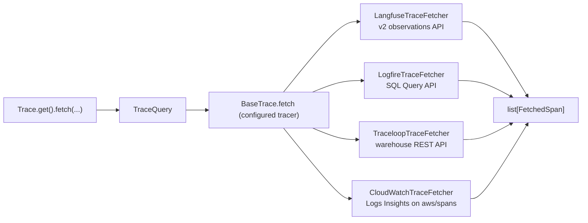

# #803: Fetch traces back from the tracing providers' clouds

Phase 1 of production agent evaluation (#803): **fetch traces → evaluate each trace → store the results**.
This change covers only the first step. It lets the configured tracer read its spans back from the
provider's cloud (Langfuse, Logfire, Traceloop, AWS CloudWatch) through one provider-neutral call,
`Trace.get().fetch(...)`. Each tracer translates one generic filter (time window, span kind, session,
trace ids, name, limit) into its provider's read API and returns the same `FetchedSpan` shape.

## Motivation

- #803's evaluation pipeline runs over traces that already exist in the user's tracing provider, so it
  needs a way to read them back. Today the trace subsystem is write-only:
  - `BaseTrace` declares only `init()` and one runner method per framework (`trace/base.py:6-54`).
  - The `Trace` facade forwards those methods and nothing else (`trace/trace.py:65-118`).
- All four built-in providers have a usable read API (`research/provider-read-apis.md`):
  - Langfuse: v2 observations API, already reachable through the client AK holds (`trace/langfuse/langfuse.py:24`).
  - Logfire: SQL Query API, which needs a separate **read** token.
  - Traceloop: the warehouse spans REST API; the SDK has no read client.
  - CloudWatch: Transaction Search stores every span sent to X-Ray as OTel JSON in the `aws/spans` log
    group, which CloudWatch Logs Insights can query (`research/provider-read-apis.md` §6).
- The providers don't share a vocabulary, so callers need one neutral span shape and one span kind:
  - Langfuse returns its own observation model with its own types (GENERATION, TOOL, AGENT, ...).
  - Logfire, Traceloop and CloudWatch return near-raw OTel spans in about 5 attribute conventions. One trace can mix
    several conventions (`research/span-formats.md` §2, §4).
- Each provider records AK's session id differently:
  - Langfuse sets `session_id` on every span through `propagate_attributes` (`trace/langfuse/openai.py:34` and 5 siblings).
  - Traceloop sets it as an association property on every span (`trace/openllmetry/openai.py:28`).
  - Logfire sets it only on the AK wrapper span (`trace/logfire/openai.py:30` and 5 siblings).
  - CloudWatch sets `session.id` on the run span and, through `SessionSpanProcessor`, on every span started
    during the run (`trace/cloudwatch/cloudwatch.py:35-44`, `:93`).
- **Logfire currently erases the session id.** `logfire.configure(...)` passes no scrubbing options
  (`trace/logfire/logfire.py:30`), so the default scrubber replaces the value of any attribute matching
  "session" (`research/span-formats.md` §5.1). Filtering Logfire traces by session is impossible until
  this is fixed.
- Langfuse removes its v1 trace/observation read endpoints from Langfuse Cloud on 16 Nov 2026, so only
  the v2 API can be relied on (`research/provider-read-apis.md` §1).

## Requirements

### Public API

- `Trace.fetch(query: TraceQuery | None = None, **filters) -> list[FetchedSpan]` on the `Trace` facade.
  - Keyword filters build a `TraceQuery`; an explicit `query` is passed through unchanged.
  - When tracing is disabled (`Trace._instance is None`), raise `AKConfigError` naming `trace.enabled`.
  - Delegates to the configured tracer's `fetch(query)`.
- `agentkernel.trace` exports `TraceQuery`, `FetchedSpan`, `SpanKind`.
- Synchronous only.

### Query model: `TraceQuery` (Pydantic)

- Fields and defaults:
  - `start: datetime | None = None`, `end: datetime | None = None`
  - `last: timedelta = 1 hour` (used only when `start` is not given)
  - `kinds: list[SpanKind] | None = None` (`None` = every kind)
  - `session_id: str | None`, `trace_ids: list[str] | None`, `name: str | None` (exact span name)
  - `limit: int = 1000`, must be `> 0`
- `window()` resolves the time window:
  - Naive datetimes are treated as UTC.
  - `end` defaults to now; `start` defaults to `end - last`.
  - `start >= end` raises `ValueError`.
  - Bounds apply to span **start** time: `start` inclusive, `end` exclusive.
- Result ordering and limit, the same for every tracer:
  - Spans are returned oldest first.
  - When more than `limit` spans match, the most recent `limit` are kept.

### Result model: `FetchedSpan` (Pydantic)

- Fields:
  - `provider`, `trace_id`, `span_id`, `parent_span_id`
  - `name`, `kind`, `start_time`, `end_time`, `session_id`
  - `input`, `output`, `attributes`, `raw`
- `input`/`output` are returned exactly as the provider stores them (often JSON strings). They are not
  parsed or normalised.
- `raw` holds the provider's full record, so later phases can re-normalise without fetching again.
- Each `span_id` appears at most once in a result.

### Span kinds

- `SpanKind` (str enum): `agent`, `llm`, `tool`, and `span` (everything else: AK wrapper, turn, chain, workflow).
- `OTelSpanClassifier` (class) classifies each raw OTel span by itself, never once per provider:
  - Precedence:
    1. `openinference.span.kind`
    2. `traceloop.span.kind`
    3. `gen_ai.operation.name`
    4. Logfire message template (`Function:` → tool, `Agent run:` → agent) or the `LLM` tag
    5. otherwise `span`
  - Must classify every span in the captured dumps the way `research/span-formats.md` §3–§4 labels it
    (AGENT / LLM / TOOL, everything else `span`).
  - Also extracts `input`/`output` and the session id from the known attribute keys of each convention.
- Langfuse maps its own observation types: `GENERATION` → llm, `TOOL` → tool, `AGENT` → agent, every
  other type → span.

### Tracer interface (`BaseTrace`)

- Add `fetch(self, query: TraceQuery) -> list[FetchedSpan]`.
  - **Not abstract.** The default raises `NotImplementedError` naming the tracer class. This is a
    deliberate departure from the all-abstract `BaseTrace` (`trace/base.py:7-54`): an abstract method
    would make every existing bring-your-own tracer impossible to instantiate.
- No new factory or config selector: the tracer that sends (`trace.type`, `Trace._build`,
  `trace/trace.py:38-63`) is the one that fetches. Bring-your-own tracers opt in by overriding `fetch`.
- Each built-in tracer delegates to one fetcher class in `trace/<provider>/fetch.py`, imported lazily
  inside `fetch`:
  - `LangfuseTraceFetcher`, `LogfireTraceFetcher`, `TraceloopTraceFetcher`, `CloudWatchTraceFetcher`.
- Fetcher modules import no provider SDK at module scope, so they can be unit-tested without the extras.

### Langfuse fetcher

- Reuses the authenticated client the tracer already holds. No new credentials.
- Calls `api.observations.get_many` (v2) only, following the cursor until it is exhausted.
  - Fields `core,basic,time,io,metadata,model,usage,metrics`; page size 100 (Langfuse caps a response at 5 MB).
  - Window → `from_start_time` / `to_start_time`; `session_id` and `name` are forwarded.
- Sends one paginated request per requested Langfuse type × requested trace id, because each direct
  parameter takes a single value.
  - If `kinds` includes `span`, no type filter is sent and the kinds are filtered locally.
- `attributes` = `metadata.attributes` when present, else `metadata`.

### Logfire fetcher

- Reads the read token from `LOGFIRE_READ_TOKEN`. The region comes from the token, as the SDK's
  `LogfireQueryClient` does.
- Queries the `records` table with SQL (`kind = 'span'`) through `LogfireQueryClient.query_json_rows`.
  - Window → `min_timestamp` / `max_timestamp`.
  - `kinds` → SQL equivalents of the classifier. `span` → the negation of the other three, made
    NULL-safe with `COALESCE`.
  - `name` matches `span_name` or `message`; `trace_ids` → `trace_id IN (...)`.
  - `session_id` → every span of the traces whose wrapper span carries that session id (a `trace_id`
    subquery). Each returned span gets `session_id` set to the queried value.
  - All string values are SQL-escaped by doubling single quotes.
- Pages past the 10,000-row limit by walking backwards on `start_timestamp`, deduplicating by span id.
- Spans are classified after merging `span_name` (the message template) and the `tags` column into the
  attributes.
- **Scrubbing fix:** `Logfire.init()` passes `logfire.ScrubbingOptions(callback=...)`, and the callback
  keeps exactly `("attributes", "session_id")`. Every other match is still redacted.

### Traceloop fetcher

- Reuses the SDK's own variables: `TRACELOOP_API_KEY`, and `TRACELOOP_BASE_URL` (default
  `https://api.traceloop.com`).
- Calls `GET /v2/warehouse/spans` over `httpx`, sorted newest first, following `next_cursor`.
  - Window → `from_timestamp_sec` / `to_timestamp_sec`; `name` → `span_name`.
  - `filters`:
    - `gen_ai.operation.name in [...]` for the requested kinds
    - `traceloop.association.properties.session_id equals` the session id
    - `trace_id in [...]` for the trace ids
- Server-side filters are best effort (they have not been tested against the live API), so kind and
  session are re-checked on every span locally.
- Accepts ISO timestamps or epoch values in s, ms, µs or ns; `end_time = start_time + duration_ms`.

### CloudWatch fetcher

- Credentials and region come from the standard AWS chain, as on the send side. No new credentials.
  - Region: `AWS_REGION`, then the botocore chain. The tracer's existing lookup
    (`trace/cloudwatch/cloudwatch.py:137`) moves into a shared `CloudWatch.region()` static method that both
    the exporter and the fetcher call.
  - The identity needs `logs:StartQuery`, `logs:GetQueryResults` and `logs:StopQuery` on `aws/spans`. The
    send-side `AWSXrayWriteOnlyAccess` policy does not grant them.
  - The constructor also accepts a ready botocore `logs` client, a region and a log group (default
    `aws/spans`), for callers that manage their own AWS sessions.
- Runs Logs Insights queries over `aws/spans` (`StartQuery`, then polls `GetQueryResults`) selecting
  `@timestamp` and `@message`, sorted by `@timestamp` newest first.
  - Each `@message` is the span's OTel JSON (`traceId`, `spanId`, `parentSpanId`, `name`,
    `startTimeUnixNano`, `endTimeUnixNano`, `attributes`). It becomes `raw`, and its attributes are
    classified with `OTelSpanClassifier`.
  - Attributes are flattened to dotted keys, so the classifier works whether the record stores them flat
    (`"session.id"`) or nested.
  - `kinds` → Logs Insights equivalents of the classifier for the conventions the CloudWatch runners emit
    (OpenInference, OTel GenAI). If `kinds` includes `span`, no kind filter is sent and kinds are filtered
    locally.
  - `name` → `name = ...`; `trace_ids` → `traceId in [...]`; `session_id` → `attributes.session.id = ...`.
  - String values are written as JSON string literals.
- The window is applied to the span start time locally. AWS does not document whether `@timestamp` is a
  span's start or end, so the query's time range runs 15 minutes past `end` (never past now) and spans
  that started outside the window are dropped.
- Pages past the 10,000-row limit by walking backwards on `@timestamp` (whole seconds), deduplicating by
  span id. If one second holds a full page, it logs a warning and stops.
- A query that does not complete within `timeout` (default 120 s) is stopped with `StopQuery`.

### Error handling

- Missing Logfire read token or Traceloop API key → `AKConfigError` naming the env var.
- No AWS region for CloudWatch → `AKConfigError` naming `AWS_REGION`.
- A CloudWatch Logs Insights query that ends `Failed`, `Cancelled`, `Timeout` or `Unknown` → `RuntimeError`
  naming the status; one still running at `timeout` → `TimeoutError`, after `StopQuery`.
- Provider SDK or HTTP errors propagate unchanged. No retries or rate-limit backoff.
- A tracer without `fetch` → `NotImplementedError`.

### Configuration

- **No new `AKConfig` fields.** Fetching reuses `trace.enabled` and `trace.type` (`core/config.py:468-473`).
- One new environment variable, `LOGFIRE_READ_TOKEN`. It can't be derived from the existing
  `LOGFIRE_TOKEN`, because Logfire write tokens cannot read.
- Optional extras: add `httpx>=0.27.0` to `openllmetry` and `logfire` (`ak-py/pyproject.toml:31-36`).
  Traceloop's fetcher and Logfire's query client import it, and neither SDK guarantees it.
- CloudWatch needs no new variable or extra: the `cloudwatch` extra already ships `botocore`
  (`ak-py/pyproject.toml:37-42`), which provides the CloudWatch Logs client.

### Testing

- New `ak-py/tests/test_trace_fetch.py`, which needs no provider SDK:
  - Langfuse uses a fake client; Logfire a fake `logfire.experimental.query_client` module; Traceloop an
    `httpx.MockTransport`; CloudWatch a fake botocore `logs` client.
- Covers:
  - query window resolution
  - the classifier on the captured attribute shapes
  - the facade (disabled tracing, kwargs, `NotImplementedError`)
  - per fetcher: request translation, pagination, local filtering, limit semantics
  - Logfire SQL escaping
  - Traceloop timestamp formats
  - CloudWatch: dropping spans that started outside the window, failed and timed-out queries
    (`StopQuery`), and Logs Insights literal escaping
- `ak-py/tests/test_trace_logfire.py`: the fake `logfire` module gains `ScrubbingOptions`, plus a test
  that the callback keeps `session_id` and redacts everything else.

### Docs

- A "Fetching Traces Back" section in `docs/docs/advanced/traceability.md` covering:
  - the filters
  - credentials per provider
  - provider limits (ingestion delay, Logfire row cap, Traceloop free-plan retention, CloudWatch's
    Transaction Search requirement, row cap and scan cost)
  - the extra IAM read permissions CloudWatch needs

## Non-goals

- Phase 2 (running user-defined evaluators over traces) and Phase 3 (storing evaluation results). Each
  gets its own spec. `FetchedSpan`, including `raw`, is the input contract Phase 2 builds on.
- Normalising spans into an AK trace model:
  - JSON-parsing `input`/`output`
  - deduplicating Traceloop + Pydantic AI LLM spans
  - rebuilding trace trees
- Async fetching, local caching of fetched spans, retries or rate-limit handling.
- Whole-trace fetch through Traceloop's undocumented endpoints.
- Other tracing gaps: the Traceloop runners' missing wrapper span, and missing inner spans for some
  provider × framework pairs (`research/span-formats.md` §5.2, §5.4).

## Open questions

- **Credential resolution:** read `LOGFIRE_READ_TOKEN` / `TRACELOOP_API_KEY` with `os.getenv`, or through
  `SecretManager.current().get(key, default=None)`?
  - SecretManager checks env first, so behaviour is identical when the env var is set, and it also
    enables `aws_ssm`.
  - No other core component resolves its credentials through SecretManager yet.
  - Recommendation: SecretManager.
- **Contract test suite:** ship a reusable `TraceFetchContract` in `trace/testing.py` for bring-your-own
  fetchers, or test each fetcher on its own for now?
  - The earlier recommendation was to defer until a fourth fetcher existed. CloudWatch is that fourth
    fetcher, and the four now share the window, ordering, limit and dedup rules a contract would check.
  - Recommendation: ship it as a follow-up to this change, so the four fetchers' tests are migrated together.
- **Traceloop support level:** document it as best effort, given the 24 h free-plan retention, the
  untested filter ids and the ServiceNow acquisition (`research/provider-read-apis.md` §3)?
- **Fetch-only processes:** an evaluation job calls `Trace.get()`, which runs `init()` (Langfuse
  `auth_check()` network call, Logfire `configure()`). Acceptable, or should fetching skip the
  send-side init?
  - Recommendation: keep it; it validates credentials early.
- **Limit semantics:** "most recent `limit` spans, returned oldest first". Confirm this rather than
  "oldest `limit` spans".
- **CloudWatch span classification:** the CloudWatch run span (`Agent Kernel <Framework>`) carries no
  kind attribute, so it is classified `span`, as the other providers' wrapper spans are. LangGraph and
  Smolagents emit only that span under CloudWatch, so `kinds=[agent|llm|tool]` returns nothing for them.
  Acceptable, or should the run span set `openinference.span.kind = AGENT`? That would be a send-side
  change, outside this spec.
- **CloudWatch spans outside `aws/spans`:** spans exported to a collector or the CloudWatch agent only
  reach `aws/spans` if those forward them to X-Ray with Transaction Search on. Is the documented
  `aws/spans` assumption plus the `log_group` constructor parameter enough?
- **Live verification:** `research/provider-read-apis.md` §5 and §6 list checks that need real accounts.
  Who runs them before merge?
