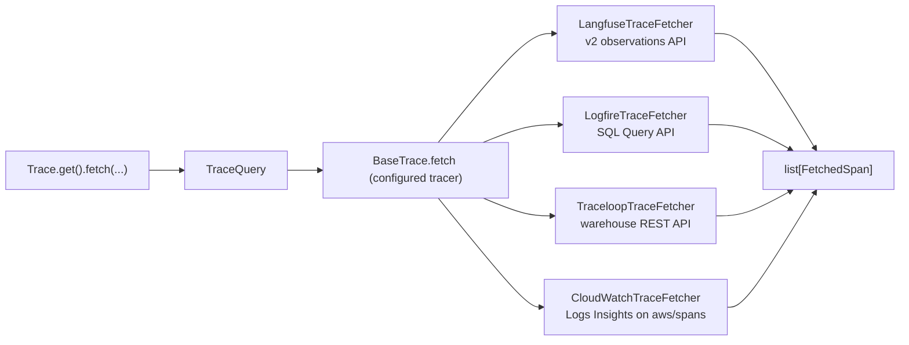

# #803: Agent evaluation on production traffic

Evaluates an agent on its real production traffic in three phases: **fetch traces → evaluate each trace →
store the results**. Phase 1 is an Agent Kernel core capability: the configured tracer reads its spans back
from the provider's cloud (Langfuse, Logfire, Traceloop, AWS CloudWatch) through one provider-neutral
call, `Trace.get().fetch(...)`. Phases 2 and 3 are **not** AK core: they are user code, shown in one AWS
example where a scheduled Lambda (every 30 minutes) fetches the last window's traces from Langfuse, scores
each one with an Opik-based `AKEvaluator` subclass, and writes the trace and its scores to DynamoDB.

| Phase | What | Where it lives |
|---|---|---|
| 1. Fetch | `Trace.get().fetch(...)`, `TraceQuery`, `FetchedSpan`, one fetcher per tracer | `ak-py/src/agentkernel/trace/` |
| 2. Evaluate | `TraceCase` built from a trace's spans; `OpikTraceEvaluator(AKEvaluator)` | example `evaluator/` |
| 3. Store | `EvaluationStore` over one DynamoDB table | example `evaluator/` |
| 2–3 runtime | `TraceEvaluationJob` Lambda, EventBridge schedule, DynamoDB table, the AK agent it evaluates | example `deploy/main.tf` |

The example is `examples/aws-serverless/langfuse-trace-evaluation/`.

## Motivation

### Phase 1

- #803's evaluation pipeline runs over traces that already exist in the user's tracing provider, so it
  needs a way to read them back. Today the trace subsystem is write-only:
  - `BaseTrace` declares only `init()` and one runner method per framework (`trace/base.py:6-54`).
  - The `Trace` facade forwards those methods and nothing else (`trace/trace.py:65-118`).
- All four built-in providers have a usable read API (`research/provider-read-apis.md`):
  - Langfuse: v2 observations API, already reachable through the client AK holds (`trace/langfuse/langfuse.py:24`).
  - Logfire: SQL Query API, which needs a separate **read** token.
  - Traceloop: the warehouse spans REST API; the SDK has no read client.
  - CloudWatch: Transaction Search stores every span sent to X-Ray as OTel JSON in the `aws/spans` log
    group, which CloudWatch Logs Insights can query (`research/provider-read-apis.md` §6).
- The providers don't share a vocabulary, so callers need one neutral span shape and one span kind:
  - Langfuse returns its own observation model with its own types (GENERATION, TOOL, AGENT, ...).
  - Logfire, Traceloop and CloudWatch return near-raw OTel spans in about 5 attribute conventions. One trace can mix
    several conventions (`research/span-formats.md` §2, §4).
- Each provider records AK's session id differently:
  - Langfuse sets `session_id` on every span through `propagate_attributes` (`trace/langfuse/openai.py:34` and 5 siblings).
  - Traceloop sets it as an association property on every span (`trace/openllmetry/openai.py:28`).
  - Logfire sets it only on the AK wrapper span (`trace/logfire/openai.py:30` and 5 siblings).
  - CloudWatch sets `session.id` on the run span and, through `SessionSpanProcessor`, on every span started
    during the run (`trace/cloudwatch/cloudwatch.py:35-44`, `:93`).
- **Logfire currently erases the session id.** `logfire.configure(...)` passes no scrubbing options
  (`trace/logfire/logfire.py:30`), so the default scrubber replaces the value of any attribute matching
  "session" (`research/span-formats.md` §5.1). Filtering Logfire traces by session is impossible until
  this is fixed.
- Langfuse removes its v1 trace/observation read endpoints from Langfuse Cloud on 16 Nov 2026, so only
  the v2 API can be relied on (`research/provider-read-apis.md` §1).

### Phases 2 and 3

- Evaluation and storage logic is user-specific (which metrics, which thresholds, which database), so AK
  shows it in an example instead of shipping a fixed pipeline. A user copies the example and changes the
  metrics and the store.
- AK's evaluators can't score production traces as they are: every built-in `AKEvaluator` needs an
  expected answer and raises `AKMissingInput` without one (`test/core/evaluator/deepeval.py:44,55`,
  `opik.py:48,61`, `jev.py:62`). Production traffic has no expected answer. The `AKEvaluator` ABC itself
  (`test/core/evaluator/base.py:49-66`) is generic, so a reference-free subclass fits it.
- The AK Terraform modules can't run a custom job on a schedule: the serverless module's EventBridge
  Scheduler group exists only for AK's chat schedules (`ak-deployment/ak-aws/serverless/state.tf:403`).
  The example's own `main.tf` owns the schedule and the evaluator Lambda.
- The evaluator's dependencies don't fit a zip Lambda. Installing `agentkernel[langfuse,opik]` plus
  `boto3` for Lambda's Linux/Python 3.12 platform measured 283 MB unpacked (86 MB zipped); `litellm`,
  which `opik` depends on, is 117 MB of it. Lambda's zip limit is 250 MB unpacked, so the evaluator ships
  as a container image (10 GB limit), as the sibling `aws-serverless` examples already do.
- At `develop` HEAD the AK Langfuse runners never flush the Langfuse client (`trace/langfuse/openai.py:34-40` and 5 siblings),
  unlike the CloudWatch tracer, which flushes after each run on Lambda because "a frozen Lambda sandbox
  never runs the batch processor's background export" (`trace/cloudwatch/cloudwatch.py:59-60,98-99`).
  Without a flush, an agent on Lambda can hold its spans until its next invocation or lose them when the
  sandbox is recycled, so the evaluator would see no traces. Phase 1 fixes this in core.

## Phase 1: Fetch traces (Agent Kernel core)

### Public API

- `Trace.fetch(query: TraceQuery | None = None, **filters) -> list[FetchedSpan]` on the `Trace` facade.
  - Keyword filters build a `TraceQuery`; an explicit `query` is passed through unchanged.
  - Passing both `query` and keyword filters raises `ValueError`, so filters are never silently ignored.
  - When tracing is disabled (`Trace._instance is None`), raise `AKConfigError` naming `trace.enabled`.
  - Delegates to the configured tracer's `fetch(query)`.
- `agentkernel.trace` exports `TraceQuery`, `FetchedSpan`, `SpanUsage`, `SpanKind`.
- Synchronous only.

### Query model: `TraceQuery` (Pydantic)

- Fields and defaults:
  - `start: datetime | None = None`, `end: datetime | None = None`
  - `last: timedelta = 1 hour` (used only when `start` is not given)
  - `kinds: list[SpanKind] | None = None` (`None` = every kind)
  - `session_id: str | None`, `trace_ids: list[str] | None`, `name: str | None` (exact span name)
  - `limit: int = 1000`, must be `> 0`
- `window()` resolves the time window:
  - Naive datetimes are treated as UTC.
  - `end` defaults to now; `start` defaults to `end - last`.
  - `start >= end` raises `ValueError`.
  - Bounds apply to span **start** time: `start` inclusive, `end` exclusive.
- Result ordering and limit, the same for every tracer:
  - Spans are returned oldest first.
  - When more than `limit` spans match, the most recent `limit` are kept.

### Result model: `FetchedSpan` (Pydantic)

- Fields:
  - `provider`, `trace_id`, `span_id`, `parent_span_id`
  - `name`, `kind`, `start_time`, `end_time`, `session_id`
  - `input`, `output`, `usage`, `attributes`, `raw`
- `usage: SpanUsage | None` (Pydantic): `input_tokens`, `output_tokens`, `total_tokens`, `cost` (USD), each optional.
  - Covers only the span's own model call, never a roll-up of its children, so summing `usage` over a
    trace's spans gives the trace's total, including LLM calls made inside tools and sub-agents.
  - `None` when the span records no model call (tool, agent and wrapper spans usually).
  - `total_tokens` falls back to `input_tokens + output_tokens` when the span reports no total.
  - Cost is never computed by AK: it is whatever the provider or instrumentation reports.
- `input`/`output` are returned exactly as the provider stores them (often JSON strings). They are not
  parsed or normalised.
- `raw` holds the provider's full record, so later phases can re-normalise without fetching again.
- Each `span_id` appears at most once in a result.

### Span kinds

- `SpanKind` (str enum): `agent`, `llm`, `tool`, and `span` (everything else: AK wrapper, turn, chain, workflow).
- `OTelSpanClassifier` (class) classifies each raw OTel span by itself, never once per provider:
  - Precedence:
    1. `openinference.span.kind`
    2. `traceloop.span.kind`
    3. `gen_ai.operation.name`
    4. Logfire message template (`Function:` → tool, `Agent run:` → agent) or the `LLM` tag
    5. otherwise `span`
  - Must classify every span in the captured dumps the way `research/span-formats.md` §3–§4 labels it
    (AGENT / LLM / TOOL, everything else `span`).
  - Also extracts `input`/`output`, the session id and `usage` from the known attribute keys of each convention.
  - `usage` reads only per-call keys (`gen_ai.usage.*`, `llm.token_count.*`, Pydantic AI's `operation.cost`).
    It deliberately ignores roll-ups: Pydantic AI's `gen_ai.aggregated_usage.*` on the agent-run span, and
    the OpenAI Agents `usage` JSON that Logfire puts on turn and workflow spans
    (`research/span-formats.md` §3–§4).
- Langfuse maps its own observation types: `GENERATION` → llm, `TOOL` → tool, `AGENT` → agent, every
  other type → span.

### Tracer interface (`BaseTrace`)

- Add `fetch(self, query: TraceQuery) -> list[FetchedSpan]`.
  - **Not abstract.** The default raises `NotImplementedError` naming the tracer class. This is a
    deliberate departure from the all-abstract `BaseTrace` (`trace/base.py:7-54`): an abstract method
    would make every existing bring-your-own tracer impossible to instantiate.
- No new factory or config selector: the tracer that sends (`trace.type`, `Trace._build`,
  `trace/trace.py:38-63`) is the one that fetches. Bring-your-own tracers opt in by overriding `fetch`.
  - Bring-your-own tracers already exist: a dotted `trace.type` resolves to any `BaseTrace` subclass
    (`trace/trace.py:64`), so fetching comes to them through the same override.
- **`TraceFetchContract`** (pytest class, `agentkernel.trace.testing`), the conformance suite every fetch
  implementation subclasses, built-in or bring-your-own, as `SecretProviderContract` is for secret
  providers (`secret/testing.py:15`).
  - The subclass supplies a `tracer` fixture and `seed(tracer, spans)`, which makes those spans exist in
    its backend.
  - It checks the shared result contract: oldest first, unique span ids, the window on span start
    (start inclusive, end exclusive), `limit` keeps the most recent, and the kind, session, trace-id and
    name filters.
  - Run against: a bring-your-own in-memory tracer (also the documentation example), and the Langfuse and
    Traceloop fetchers over fakes of their APIs.
  - Not run against Logfire or CloudWatch: a faithful fake would re-implement their query languages (SQL,
    Logs Insights). Their query translation stays covered by their own tests.
- `TraceQuery.matches(span)`: one local check of every filter (window, kinds, session, trace ids, name),
  for fetchers whose server-side filters are approximate. Langfuse and Traceloop apply it to every span,
  so their results honour the contract whatever the API's own boundary rules are.
- Each built-in tracer delegates to one fetcher class in `trace/<provider>/fetch.py`, imported lazily
  inside `fetch`:
  - `LangfuseTraceFetcher`, `LogfireTraceFetcher`, `TraceloopTraceFetcher`, `CloudWatchTraceFetcher`.
- Fetcher modules import no provider SDK at module scope, so they can be unit-tested without the extras.

### Langfuse fetcher

- Reuses the authenticated client the tracer already holds. No new credentials.
- Calls `api.observations.get_many` (v2) only, following the cursor until it is exhausted.
  - Fields `core,basic,time,io,metadata,model,usage,metrics`; page size 100 (Langfuse caps a response at 5 MB).
  - Window → `from_start_time` / `to_start_time`; `session_id` and `name` are forwarded.
  - `expand_metadata=attributes`: Langfuse cuts metadata values to 200 characters unless their key is
    listed (SDK `api/observations/client.py`, `expand_metadata` docstring), and the span's OTel attributes
    live under `metadata.attributes`.
  - Every observation is re-checked with `TraceQuery.matches`.
- Sends one paginated request per requested Langfuse type × requested trace id, because each direct
  parameter takes a single value.
  - If `kinds` includes `span`, no type filter is sent and the kinds are filtered locally.
- `attributes` = `metadata.attributes` when present, else `metadata`.
- `usage` from Langfuse's own `usageDetails` (`input`/`output`/`total`) and `totalCost` (else
  `costDetails.total`). Langfuse prices model calls server side, so cost is filled for every priced model.

### Logfire fetcher

- Reads the read token from `LOGFIRE_READ_TOKEN`. The region comes from the token, as the SDK's
  `LogfireQueryClient` does.
- Queries the `records` table with SQL (`kind = 'span'`) through `LogfireQueryClient.query_json_rows`.
  - Window → `min_timestamp` / `max_timestamp`.
  - `kinds` → SQL equivalents of the classifier. `span` → the negation of the other three, made
    NULL-safe with `COALESCE`.
  - `name` matches `span_name` or `message`; `trace_ids` → `trace_id IN (...)`.
  - `session_id` → every span of the traces whose wrapper span carries that session id (a `trace_id`
    subquery). Each returned span gets `session_id` set to the queried value.
  - All string values are SQL-escaped by doubling single quotes.
- Pages past the 10,000-row limit by walking backwards on `start_timestamp`, deduplicating by span id.
- Spans are classified after merging `span_name` (the message template) and the `tags` column into the
  attributes.
- **Scrubbing fix:** `Logfire.init()` passes `logfire.ScrubbingOptions(callback=...)`, and the callback
  keeps exactly `("attributes", "session_id")`. Every other match is still redacted.

### Traceloop fetcher

- Reuses the SDK's own variables: `TRACELOOP_API_KEY`, and `TRACELOOP_BASE_URL` (default
  `https://api.traceloop.com`).
- Calls `GET /v2/warehouse/spans` over `httpx`, sorted newest first, following `next_cursor`.
  - Window → `from_timestamp_sec` / `to_timestamp_sec` in whole seconds (`floor(start)`, `ceil(end)`), with
    the exact window applied locally by `TraceQuery.matches`; `name` → `span_name`.
  - `filters`:
    - `gen_ai.operation.name in [...]` for the requested kinds
    - `traceloop.association.properties.session_id equals` the session id
    - `trace_id in [...]` for the trace ids
- Server-side filters are best effort (they have not been tested against the live API), so every span is
  re-checked locally with `TraceQuery.matches`.
- **Documented as best effort**: the 24-hour free-plan retention, the untested filter ids, and the
  ServiceNow acquisition (`research/provider-read-apis.md` §3).
- Accepts ISO timestamps or epoch values in s, ms, µs or ns; `end_time = start_time + duration_ms`.

### CloudWatch fetcher

- Credentials and region come from the standard AWS chain, as on the send side. No new credentials.
  - Region: `AWS_REGION`, then the botocore chain. The tracer's existing lookup
    (`trace/cloudwatch/cloudwatch.py:137`) moves into a shared `CloudWatch.region()` static method that both
    the exporter and the fetcher call.
  - The identity needs `logs:StartQuery`, `logs:GetQueryResults` and `logs:StopQuery` on `aws/spans`. The
    send-side `AWSXrayWriteOnlyAccess` policy does not grant them.
  - The constructor also accepts a ready botocore `logs` client, a region and a log group (default
    `aws/spans`), for callers that manage their own AWS sessions.
- Runs Logs Insights queries over `aws/spans` (`StartQuery`, then polls `GetQueryResults`) selecting
  `@timestamp` and `@message`, sorted by `@timestamp` newest first.
  - Each `@message` is the span's OTel JSON (`traceId`, `spanId`, `parentSpanId`, `name`,
    `startTimeUnixNano`, `endTimeUnixNano`, `attributes`). It becomes `raw`, and its attributes are
    classified with `OTelSpanClassifier`.
  - Attributes are flattened to dotted keys, so the classifier works whether the record stores them flat
    (`"session.id"`) or nested.
  - `kinds` → Logs Insights equivalents of the classifier for the conventions the CloudWatch runners emit
    (OpenInference, OTel GenAI). If `kinds` includes `span`, no kind filter is sent and kinds are filtered
    locally.
  - `name` → `name = ...`; `trace_ids` → `traceId in [...]`; `session_id` → `attributes.session.id = ...`.
  - String values are written as JSON string literals.
- The window is applied to the span start time locally. AWS does not document whether `@timestamp` is a
  span's start or end, so the query's time range runs 15 minutes past `end` (never past now) and spans
  that started outside the window are dropped.
- Pages past the 10,000-row limit by walking backwards on `@timestamp` (whole seconds), deduplicating by
  span id. If one second holds a full page, it logs a warning and stops.
- A query that does not complete within `timeout` (default 120 s) is stopped with `StopQuery`.
- `aws/spans` is the only source. It exists only when Transaction Search is on and the spans reach X-Ray
  (the default export does; a collector must forward to X-Ray), which the docs state as a requirement.
  - A missing log group (`ResourceNotFoundException` from `StartQuery`) raises `AKConfigError` saying to
    enable Transaction Search; every other AWS error propagates unchanged.

### Langfuse flush on AWS Lambda (send side)

- Every Langfuse runner flushes the Langfuse client after each run, including failed ones, when
  `AWS_LAMBDA_FUNCTION_NAME` is set, as the CloudWatch tracer already does
  (`trace/cloudwatch/cloudwatch.py:59-60,98-99`).
  - One shared `LangFuse.flush_on_lambda(client)` static method, called from a `finally` in all six
    runners.
  - A failed flush is logged, never raised: tracing must not fail the agent's reply.
  - Cost: one export round trip per agent run on Lambda, the same trade the CloudWatch tracer makes.
- Required by Phases 2–3 (the evaluated agent runs on Lambda), but it fixes every Langfuse-on-Lambda user.

### Error handling

- Missing Logfire read token or Traceloop API key → `AKConfigError` naming the env var.
- No AWS region for CloudWatch → `AKConfigError` naming `AWS_REGION`.
- No `aws/spans` log group → `AKConfigError` saying to enable Transaction Search.
- A CloudWatch Logs Insights query that ends `Failed`, `Cancelled`, `Timeout` or `Unknown` → `RuntimeError`
  naming the status; one still running at `timeout` → `TimeoutError`, after `StopQuery`.
- Provider SDK or HTTP errors propagate unchanged. No retries or rate-limit backoff.
- A tracer without `fetch` → `NotImplementedError`.

### Configuration

- **No new `AKConfig` fields.** Fetching reuses `trace.enabled` and `trace.type` (`core/config.py:468-473`).
- Credentials are read from environment variables, exactly as on the send side: the provider SDKs read
  `LANGFUSE_*`, `TRACELOOP_API_KEY` and `LOGFIRE_TOKEN` from the environment themselves, and no tracer
  goes through `SecretManager`. The fetchers' two new reads (`LOGFIRE_READ_TOKEN`, `TRACELOOP_API_KEY`)
  use `os.getenv` the same way.
- One new environment variable, `LOGFIRE_READ_TOKEN`. It can't be derived from the existing
  `LOGFIRE_TOKEN`, because Logfire write tokens cannot read.
- Optional extras: add `httpx>=0.27.0` to `openllmetry` and `logfire` (`ak-py/pyproject.toml:31-36`).
  Traceloop's fetcher and Logfire's query client import it, and neither SDK guarantees it.
- CloudWatch needs no new variable or extra: the `cloudwatch` extra already ships `botocore`
  (`ak-py/pyproject.toml:37-42`), which provides the CloudWatch Logs client.

### Testing

- New `ak-py/tests/test_trace_fetch.py`, which needs no provider SDK:
  - Langfuse uses a fake client; Logfire a fake `logfire.experimental.query_client` module; Traceloop an
    `httpx.MockTransport`; CloudWatch a fake botocore `logs` client.
- Covers:
  - query window resolution
  - the classifier on the captured attribute shapes
  - the facade (disabled tracing, kwargs, `NotImplementedError`)
  - per fetcher: request translation, pagination, local filtering, limit semantics
  - Logfire SQL escaping
  - Traceloop timestamp formats
  - `usage` on the captured attribute shapes, including the roll-ups it must ignore, plus the Langfuse
    usage mapping
  - CloudWatch: dropping spans that started outside the window, failed and timed-out queries
    (`StopQuery`), and Logs Insights literal escaping
- `ak-py/tests/test_trace_logfire.py`: the fake `logfire` module gains `ScrubbingOptions`, plus a test
  that the callback keeps `session_id` and redacts everything else.
- New `ak-py/tests/test_trace_fetch_contract.py`: `TraceFetchContract` against the in-memory
  bring-your-own tracer, Langfuse (fake `observations.get_many`) and Traceloop (fake warehouse over
  `httpx.MockTransport`). The fakes treat both window bounds as inclusive, so the exclusive end has to
  come from the fetcher.
- `ak-py/tests/test_trace_langfuse_langgraph.py`: the runner flushes on Lambda after a successful and a
  failed run, doesn't flush off Lambda, and logs a failing flush.

### Docs

- A "Fetching Traces Back" section in `docs/docs/advanced/traceability.md` covering:
  - the filters
  - `usage`, how to total it over a trace, and which providers report cost
  - credentials per provider
  - provider limits (ingestion delay, Logfire row cap, Traceloop free-plan retention, CloudWatch's
    Transaction Search requirement, row cap and scan cost)
  - the extra IAM read permissions CloudWatch needs

## Phase 2: Evaluate (example)

### Trace case: `TraceCase` (Pydantic)

- **Why it exists:** `fetch` returns a flat list of spans, and the facts a judge needs are spread across
  them. For one question to the example agent, Langfuse holds about nine spans
  (`research/span-formats.md` §3): the AK wrapper span has the question and the final answer, the
  `get_order_status` tool span has the tool's arguments and result, the agent spans name the triage and
  support agents, and the two generation spans carry the token counts. `TraceCase` gathers them into
  one object per run, so the evaluator reads `case.user_input`, `case.tool_calls` and `case.output`
  instead of searching spans.
- Example: the spans of one run become
  `TraceCase(user_input="Where is order A-1001?", tool_calls=[ToolCall(name="get_order_status", input='{"order_id": "A-1001"}', output="Shipped, arriving Friday")], agents=["triage", "support"], output="Your order A-1001 has shipped and arrives Friday.", usage=SpanUsage(total_tokens=812), latency_ms=2350)`.
- The unit of evaluation is one **trace**: one agent run, i.e. one AK request.
- `TraceCase.from_spans(trace_id, spans)` builds the case from that trace's `FetchedSpan`s:
  - `root`: the span with no parent (the AK wrapper `Agent Kernel <Framework>`, which holds the run's
    input and output). No root → no case.
  - `user_input` / `output`: the root's `input` / `output`, as strings.
  - `session_id`: the root's.
  - `tool_calls`: every `tool` span, oldest first: name, input, output, and whether it failed (Langfuse
    observation `level == "ERROR"`, read from `raw`). A span Langfuse typed as a plain span still counts
    when its OpenInference attributes say `TOOL` (`OTelSpanClassifier.classify`), since whether Langfuse
    maps OpenInference kinds to its own types is still unverified (`research/provider-read-apis.md` §5).
  - `agents`: the names of the `agent` spans (the triage agent and any sub-agent it handed off to).
  - `usage`: the sum of every span's `usage` (input, output, total tokens; cost when Langfuse priced it).
  - `latency_ms`: root end − root start.
  - `complete`: the root has an `end_time` and an output. Incomplete cases are not evaluated (see
    §Job flow).
- `transcript()`: one text block with the request, each tool call (name, arguments, result) and the final
  answer. The agent judges read it.

### Evaluator: `OpikTraceEvaluator(AKEvaluator)`

- Subclasses AK's `AKEvaluator` (`test/core/evaluator/base.py:49-66`). One instance scores **one** metric,
  so each `evaluate_by_llm(case)` returns one `AKEvaluationResult`, as the ABC's contract expects.
  - `OpikTraceEvaluator.all(config)` returns one instance per metric below.
  - `evaluate_by_score` raises `AKMetricNotSupported`: all four metrics are LLM judges.
- Takes a `TraceEvaluationCase`, an `AKEvaluationCase` subclass that adds `transcript` and
  `tool_call_count`. `user_input` and `actual` come from the trace, `context` holds the tool results (the
  field the ABC carries but no built-in reads), and `expected` stays empty.
- Judge model: `AKTestConfig.llm` (`provider/model`), set to `openai/gpt-4.1-mini` by
  `AK_TEST__LLM__MODEL=gpt-4.1-mini` on the evaluator Lambda. `OPIK_TRACK_DISABLE` and `track=False`, as
  AK's own Opik evaluator does, so nothing is sent to Opik's cloud.
- Each judge call is tried twice; a second failure (exception, or Opik `scoring_failed`) becomes a result
  with `score=None`, `passed=None` and the error in `reason`. One bad metric never fails the trace or the
  run.

### Metrics

| Metric | Opik metric | Input | Runs when | Pass rule (threshold 0.5) |
|---|---|---|---|---|
| `task_completion` | `AgentTaskCompletionJudge` | transcript | always | score ≥ 0.5 |
| `tool_correctness` | `AgentToolCorrectnessJudge` | transcript | the trace has ≥ 1 tool call | score ≥ 0.5 |
| `answer_relevance` | `AnswerRelevance(require_context=False)` | input, output | always | score ≥ 0.5 |
| `hallucination` | `Hallucination` | input, output, tool results as context | always | score **<** 0.5 (1 means hallucinated) |

- Each result carries `higher_is_better` in `metadata`, so readers don't misread `hallucination`.
- Not judged, but computed from the spans and stored with the trace: tool-call count, failed tool calls,
  latency, tokens and cost.

## Phase 3: Store (example)

### Table

- One DynamoDB table, `<prefix>-trace-evaluations`, on-demand billing, created by the example's `main.tf`.
- Keys: partition key `trace_id` (S), sort key `sk` (S).
- Item types:
  - `sk = "TRACE"`: the trace summary. `session_id`, `started_at`, `latency_ms`, `input`, `output`,
    `tool_calls`, `agents`, `span_count`, token and cost totals, `tool_error_count`, `passed` (every
    scored metric passed), `evaluated_at`, `provider`.
  - `sk = "EVAL#<metric>#<evaluator>"`: one score. The `AKEvaluationResult` fields (`metric`,
    `evaluator`, `score`, `threshold`, `passed`, `reason`, `higher_is_better`), plus `session_id` and
    `evaluated_at`.
  - `trace_id = "#job"`, `sk = "WATERMARK"`: the job's progress marker (§Job flow).
- Size: an item is limited to 400 KB.
  - `input`, `output` and each tool call's input/output are cut to 4 KB each.
  - The trace's full spans (`FetchedSpan` dumps, including `raw`) are stored gzip-compressed in
    `spans_gz` when the compressed size is ≤ 300 KB; otherwise they're left out and `spans_truncated` is
    set.
- Indexes:
  - `session_id-index` (partition `session_id`, sort `sk`): every trace and score of a session.
  - `evaluated_date-index` (partition `evaluated_date` = `YYYY-MM-DD`, sort `evaluated_at`): everything
    evaluated on a day.
- Numbers are written as `Decimal` (boto3 rejects `float`).
- TTL attribute `expires_at`, set 90 days after `evaluated_at`.

### Writes: `EvaluationStore`

- `evaluated(trace_ids) -> set[str]`: which of these traces already have a `TRACE` item
  (`BatchGetItem`, 100 keys per call).
- `save(case, results)`: writes the `EVAL#…` items first, then the `TRACE` item **last**. The `TRACE`
  item is the commit marker: a run that dies half-way leaves no `TRACE` item, so the next run evaluates
  the trace again and overwrites the partial `EVAL#…` items with the same keys.
- Every write is a plain `PutItem` on a deterministic key, so re-running a window never creates duplicates.
- `watermark()` / `set_watermark(at)`: read and write the `#job` item.

## Phases 2–3: the evaluation job, deployment and tests (example)

### Example layout

- `examples/aws-serverless/langfuse-trace-evaluation/`, with two deployables in one `deploy/main.tf`
  and one script, `simulate_traffic.py` (§Simulated production traffic):
  - **The agent** (`lambda.py`, `config.yaml`): an AK agent on the AK serverless module, with
    `trace.enabled: true` and `trace.type: langfuse`. It is what produces the traces.
  - **The evaluator** (`evaluator/`): the user-written Lambda, deployed with
    `terraform-aws-modules/lambda/aws`. It imports AK only for `Trace.fetch` and the `AKEvaluator` ABC.
- Example code follows the house rule "classes, not scripts": `TraceEvaluationJob`, `TraceCase`,
  `OpikTraceEvaluator`, `EvaluationStore`. The only module-level function is the Lambda entry point
  `handler(event, context)`, which builds the job once per sandbox and calls `run`.

### Job flow: `TraceEvaluationJob.run(event)`

- Window:
  - `end = now − 5 minutes`, leaving time for Langfuse ingestion (~15–30 s,
    `research/provider-read-apis.md` §1).
  - `start = watermark − 5 minutes` of overlap. No watermark yet (first run) → `end − 30 minutes`.
  - A watermark older than 24 hours is clamped to `end − 24 hours`, with a warning, so a long-disabled
    schedule doesn't trigger one huge fetch.
  - A manual event `{"start": "<ISO>", "end": "<ISO>"}` overrides the window and never reads or moves the
    watermark (used by the integration test and for backfills).
- Fetch: **one** `Trace.get().fetch(start=start, end=now, limit=5000)`.
  - Spans are grouped by `trace_id`. A trace belongs to this window when its root started in
    `[start, end)`.
  - The fetch runs to `now`, not `end`, so the later spans of a trace that started before `end` are
    included without a second `fetch(trace_ids=...)` call. This replaces the two-step "agent spans, then
    `fetch(trace_ids=...)`" flow agreed earlier: it is one call instead of two and gives the same traces.
- Skip traces that already have a `TRACE` item.
- Evaluate oldest first, at most `MAX_TRACES_PER_RUN` (default 50) traces per run, then save each one
  (§Writes).
- Advance the watermark only to what is safe. The new watermark is the earliest of:
  - `end`;
  - the root start of the oldest trace left out by the per-run cap;
  - the root start of the oldest incomplete trace (no root end or output yet) that started less than one
    hour before `end`. An older one is treated as abandoned (the agent crashed mid-run): it is logged and
    skipped, so it can't pin the watermark;
  - the start of the oldest fetched span, when the fetch hit its `limit` (`fetch` keeps the most recent
    spans, so older traces may be missing).
- Returns a summary: the window, traces seen, evaluated, skipped as already done, incomplete, left for the
  next run, and metric errors. It is also logged.
- Failure handling:
  - A fetch or DynamoDB error fails the invocation before the watermark moves, so the next run covers the
    same window again.
  - A judge error is stored on its metric (§Evaluator) and doesn't stop the run.
  - Reserved concurrency 1: two runs never overlap, even if a manual invoke meets a scheduled one.

### Simulated production traffic: `TrafficSimulator`

- The example ships its own traffic, so a user can see the whole loop without real users:
  `simulate_traffic.py` sends **5 questions** to the deployed agent, then has the evaluator score those
  runs and prints the results.
- The 5 questions cover what the metrics look at:
  1. an order-status question the `support` agent answers with `get_order_status` (hand-off + tool call);
  2. a second order-status question for an order the tool doesn't know (the tool returns "not found");
  3. a general question the triage agent answers itself (no tool);
  4. a question needing two facts from the tool in one answer;
  5. an off-topic request the agent should decline.
- All 5 go out under one new session id, one request each, through the agent's `agent_invoke_url`.
- `--evaluate` (default on): after the 5 replies, it invokes the evaluator Lambda with a manual window
  around them, waits until the session's 5 `TRACE` items are in DynamoDB (polling up to 5 minutes, for
  Langfuse ingestion), then prints per trace: the question, the tool calls, tokens and cost, and each
  metric's score, pass/fail and reason.
- `--no-evaluate`: only sends the traffic and leaves it to the next scheduled run.
- Endpoint, function and table names come from `terraform output` in `deploy/`, overridable with flags.
- One class, `TrafficSimulator`, with `send()`, `evaluate(window)` and `report(session_id)`; the weekly
  integration test reuses it, so the script and the test exercise the same path.

### Agent under evaluation

- An OpenAI Agents SDK triage agent that hands off to one specialist sub-agent with one deterministic tool,
  so traces contain an agent hand-off, a tool call and LLM calls.
- Deployed with the AK serverless module like `aws-serverless/openai-auth` (one request-handler Lambda,
  container image, `rest_sync`).
- `OPENAI_API_KEY`, `LANGFUSE_PUBLIC_KEY`, `LANGFUSE_SECRET_KEY`, `LANGFUSE_BASE_URL` are Lambda
  environment variables.
- Its handler is plain `Lambda.handler`: the Langfuse runners now flush on Lambda themselves (Phase 1
  §Langfuse flush on AWS Lambda).

### Deployment (`deploy/main.tf`)

- `module "serverless_agents"`: the AK serverless module (`yaalalabs/ak-serverless/aws`, the version the
  sibling examples pin), for the agent.
- `module "evaluator_image"`: `terraform-aws-modules/lambda/aws//modules/docker-build`, building
  `../dist_evaluator` and pushing it to a new ECR repository.
- `module "evaluator"`: `terraform-aws-modules/lambda/aws`, version `8.9.0`. `package_type = "Image"`,
  timeout 900 s, 1024 MB, reserved concurrency 1, no VPC (it only calls Langfuse, OpenAI and DynamoDB).
  - Environment: `AK_TRACE__ENABLED=true`, `AK_TRACE__TYPE=langfuse`, the three `LANGFUSE_*` variables,
    `OPENAI_API_KEY`, `AK_TEST__LLM__PROVIDER=openai`, `AK_TEST__LLM__MODEL=gpt-4.1-mini`,
    `OPIK_TRACK_DISABLE=true`, `RESULTS_TABLE`, `MAX_TRACES_PER_RUN`.
  - IAM: `GetItem`, `PutItem`, `BatchGetItem`, `BatchWriteItem` and `Query` on the table and its indexes.
  - Plain environment variables, no secret store, as agreed: the evaluator is not built on the AK modules.
- `aws_dynamodb_table`: the results table (§Table).
- `aws_cloudwatch_event_rule` (`schedule_expression = var.evaluation_schedule`, default
  `"rate(30 minutes)"`) plus `aws_cloudwatch_event_target`, with the module's `allowed_triggers`
  granting EventBridge permission to invoke.
- Variables: `region`, `prefix`, `openai_api_key`, `langfuse_public_key`, `langfuse_secret_key`,
  `langfuse_base_url` (default `https://cloud.langfuse.com`), `evaluation_schedule`, plus the base-VPC
  variables the weekly pipeline injects (`vpc_id`, `private_subnet_ids`,
  `request_handler_security_group_id`).
- Outputs: `agent_invoke_url` (the weekly pipeline needs this name), `evaluator_function_name`,
  `results_table_name`.
- `deploy/deploy.sh [local]` builds both packages (from PyPI, or from `../../../ak-py/dist` with `local`)
  and runs `terraform apply`, like the siblings.

### Dependencies (`pyproject.toml`)

- `agent` extra: `agentkernel[aws,openai,langfuse]`.
- `evaluator` extra: `agentkernel[langfuse,opik]` (the Langfuse SDK the Phase 1 fetcher calls, plus Opik)
  and `boto3` for DynamoDB. `boto3` is pinned rather than relying on the Lambda runtime's copy, which
  container images don't include anyway.
- `dev` group: `agentkernel[test]`, `moto[dynamodb]` for the unit tests.

### Testing

- **Unit tests** (`tests/test_evaluator.py`, no cloud access):
  - `TraceCase.from_spans` on hand-built `FetchedSpan`s: root, tool calls, failed tools, usage totals,
    incomplete traces, no root.
  - `OpikTraceEvaluator` with the Opik metrics monkeypatched: case mapping, the tool-correctness skip,
    the hallucination pass rule, retry then error result.
  - `EvaluationStore` on `moto`: item shapes, the `TRACE`-last order, `evaluated()`, gzip and the size
    guard, `Decimal`s, the watermark.
  - `TraceEvaluationJob` with fetch, evaluator and store faked: window and clamp, ownership by root start,
    skipping evaluated traces, the per-run cap, every watermark rule, the manual window.
- **Weekly integration test** (`lambda_test.py`), added to the weekly tier of
  `.github/integration-test-config.yaml`:
  1. Run `TrafficSimulator.send()`: the 5 questions against `AK_TEST_ENDPOINT` under one new session id.
  2. Run `TrafficSimulator.evaluate(...)`: invoke the evaluator Lambda with a manual window around them,
     polling (up to 5 minutes) until the session's 5 `TRACE` items appear in `session_id-index`.
  3. Assert 5 `TRACE` items with their questions as input, a tool call on the order-status traces, token
     totals > 0, and every expected `EVAL#…` item with a score in [0, 1] and a reason.
  4. Invoke again with the same window and assert nothing new was written (same `evaluated_at`).
  - It reads the function and table names from `terraform output` in `deploy/`.
- Weekly pipeline wiring: `integration-test-weekly.yaml` passes `TF_VAR_langfuse_public_key`,
  `TF_VAR_langfuse_secret_key` and `TF_VAR_langfuse_base_url` (from new repository secrets) to the
  deploy, test and destroy steps of `run-tests`. Nothing else in the pipeline changes.

### Docs

- The example's `README.md`: architecture, the job flow and fault handling, the table schema, how to
  change metrics or the store, deploy, run `simulate_traffic.py`, and test.
- `docs/docs/examples/overview.md`: list the example.
- `docs/docs/advanced/traceability.md` §Fetching Traces Back: link to the example as the end-to-end use.

## Non-goals

- Phases 2 and 3 in AK core: no evaluation pipeline, results store, scheduler or Terraform module for
  them in AK. The example is the deliverable, and `FetchedSpan` (including `raw`) is its input contract.
- Making the built-in evaluators reference-free. The example subclasses `AKEvaluator` instead.
- Evaluating per span (each LLM or tool call) rather than per trace, conversation-level (session)
  metrics, dashboards over the results, and alerting.
- Normalising spans into an AK trace model:
  - JSON-parsing `input`/`output`
  - deduplicating Traceloop + Pydantic AI LLM spans (both carry `usage`, so a plain sum double-counts;
    documented, not corrected)
  - rebuilding trace trees
- Async fetching, local caching of fetched spans, retries or rate-limit handling.
- Whole-trace fetch through Traceloop's undocumented endpoints.
- Other tracing gaps: the Traceloop runners' missing wrapper span, and missing inner spans for some
  provider × framework pairs (`research/span-formats.md` §5.2, §5.4).

## Open questions

### Phase 1

Resolved (kept here so reviewers see the decisions):
- **Credential resolution:** environment variables, the same as the send side (§Configuration).
- **Contract test suite:** shipped now (§Tracer interface), because bring-your-own tracers can fetch.
- **Traceloop support level:** documented as best effort.
- **Fetch-only processes:** keep `Trace.get()` running the send-side `init()`; it validates credentials
  early.
- **Limit semantics:** when more spans match than `limit`, the **newest** `limit` are kept. "Oldest
  first" is only the order of the returned list.
- **CloudWatch span classification:** left as is; the run span stays `span`.
- **Langfuse metadata truncation:** fixed with `expand_metadata=attributes`.
- **Live verification:** run by the change's author against real accounts before merge.
- **CloudWatch spans outside `aws/spans`:** `aws/spans` stays the only source; the requirement is
  documented, and a missing log group raises an `AKConfigError` saying to enable Transaction Search
  (§CloudWatch fetcher).

### Phases 2 and 3

Resolved:
- **Langfuse flush in AK core:** yes, done in Phase 1.
- **Judge cost:** `MAX_TRACES_PER_RUN = 50`, no sampling.
- **Results retention:** 90-day TTL.

To do before the weekly test can pass (owners: the maintainers):
- **CI Langfuse project:** create a Langfuse Cloud project for CI, then add repository secrets
  `LANGFUSE_PUBLIC_KEY`, `LANGFUSE_SECRET_KEY` and variable `LANGFUSE_BASE_URL`.
- **CI role permissions:** the weekly job's AWS role (`vars.AWS_ROLE_NAME`, managed outside this repo)
  must be allowed to:
  - deploy: `ecr:CreateRepository` / `DeleteRepository` and image push, `lambda:CreateFunction` /
    `UpdateFunctionCode` / `PutFunctionConcurrency` / `AddPermission`, `iam:CreateRole` /
    `PutRolePolicy` / `PassRole`, `dynamodb:CreateTable` / `UpdateTimeToLive` / `DeleteTable`,
    `events:PutRule` / `PutTargets` / `DeleteRule`, `logs:CreateLogGroup` / `PutRetentionPolicy`;
  - test: `lambda:InvokeFunction` on the evaluator and `dynamodb:Query` on the results table.
  - The sibling examples already create Lambdas, ECR repositories, DynamoDB tables and IAM roles, so
    only EventBridge rules, `PutFunctionConcurrency` and the test-time invoke/query may be new.
