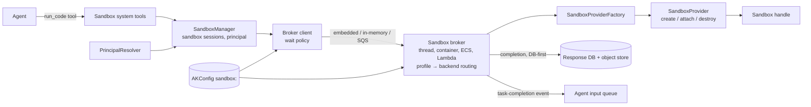

# AK-133: Sandbox capability — pluggable code execution, workspaces, and runtime attach

Add a framework-agnostic, pluggable sandbox capability: one interface through which agents execute
LLM-generated code, work in a persistent isolated workspace, or attach to an existing runtime —
with a first-class permission boundary (dual identity model + fail-closed policy) and an open
registration mechanism so switching or adding backends is a config change, never a code change.
In deployed modes a queue-decoupled **sandbox broker** separates the agentic system from sandbox
execution, so throughput, credentials, and workload routing scale independently of agent workers.

Research backing: [.agents/skills/ak-dev-sandbox-research/](../../../.agents/skills/ak-dev-sandbox-research/SKILL.md)
(provider landscape, prior-art framework abstractions, AK codebase patterns).

## Motivation

- AK has no sandbox/code-execution surface today — greenfield.
  - No `sandbox`/`code_executor`/`executor_type`/`allow_code_execution` hits anywhere in
    `ak-py/src/agentkernel` (only an unrelated string at `knowledgebase/knowledgebuilder.py:38`).
  - Framework adapters wrap pre-built native agents and pass through no executor options; the only
    code-execution surface in the repo is a user-constructed smolagents `CodeAgent` in
    `examples/cli/smolagents/demo_codeagent.py:27`, which AK neither wraps nor configures.
- Result: users who need code execution configure each framework's native executor themselves —
  exactly the per-framework lock-in AK exists to remove (swapping E2B for Docker or Bedrock means
  rewiring agents, not changing config).
- Prior art warns against half-measures: CrewAI's `allow_code_execution` boolean was deprecated and
  removed in favor of "integrate E2B/Modal yourself" — a sandbox bolted onto one tool as a flag is
  not viable; it must be a swappable capability like guardrails or session stores.
- Two of AK's requirements are modeled by none of the 9 frameworks surveyed — the permission
  boundary (agent-own vs user-assumed identity) and attach-to-existing-runtime — so this is
  original design, not adoption of an existing abstraction.
- AK already has the template patterns to build on:
  - Guardrail factory: config-keyed, lazy per-provider imports, no-op when disabled, raise on
    unknown type (`guardrail/guardrail.py:25-68`).
  - Multimodal storage: ABC + `_build_driver()` keyed on `storage_type`, `ValueError` when the
    selected backend's config sub-block is missing (`core/multimodal/storage/storage_manager.py:33-84`).
  - System-tool auto-registration on all agents (`core/tool.py:165-179`, `SystemToolFactory.get_all()`).
  - Per-capability optional-dependency extras (`ak-py/pyproject.toml:23` onward).

## Requirements

### Scope: three usage modes, one interface

- Mode 1 — **code-execution tool**: agents get tools to run LLM-generated Python/shell code safely.
- Mode 2 — **sandboxed workspace**: a persistent per-session environment where an agent
  reads/writes files, installs packages, and works across turns.
- Mode 3 — **attach to existing runtime**: connect to an already-running environment (v1: a
  Kubernetes cluster, or an EC2 instance via SSM) under a controlled permission boundary instead
  of provisioning compute.
- The mode is a function of configuration (scope + attach target), not separate interfaces.
  - A design that serves only mode 1 is insufficient; every interface decision is weighed against
    all three modes and both identity models.
- Cross-turn continuity is explicit: every sandbox is addressed as a **sandbox session** with a
  stable `sandbox_session_id` that agents carry across turns (see Sandbox sessions, lifecycle,
  and binding).

### Package placement and coupling

- New package `ak-py/src/agentkernel/sandbox/`, sibling to `guardrail/` and `knowledgebase/`.
- No imports from `framework/`, `integration/`, `deployment/`, or `api/` — backends talk to
  provider SDKs only.
- Core touches the capability only at the established wiring points (config section, factory call
  in system-tool registration), mirroring how `core/runtime.py:12` imports the guardrail factories
  and `core/tool.py:173-177` lazily imports the multimodal tool.
- Framework-specific logic: none. Agent exposure goes through the existing framework-agnostic
  tool layer.

### Core interface (public API)

- Two public ABCs, both exported (BYO providers subclass them):
  - `SandboxProvider` — long-lived, one per configured backend, constructed by the factory from
    its Pydantic config model. Operations: `create(principal, policy)`, optional
    `attach(sandbox_id, principal, policy)`, `destroy(sandbox_id)`.
  - `Sandbox` — a handle to one live sandbox, created by a provider (never constructed directly).
    Required: `execute_code(code, language, timeout)`, `close()`. Optional:
    `execute_command`, `upload_file`, `download_file`, `install_packages`.
- Async-first: all I/O-performing methods are `async` (AK core is async; prior art: AutoGen 0.4's
  async `CodeExecutor` redesign).
- Minimal required surface, satisfiable by the narrowest important backends:
  - `execute_code` with `language="python"` is the only execution method every provider must
    support — AWS Bedrock AgentCore and Azure dynamic sessions structurally cannot offer general
    shell, ports, or pause/resume ("POST code, get JSON back").
  - Every richer operation is optional; unsupported operations raise `SandboxCapabilityError`
    naming the missing capability.
- Capability declaration: each provider declares a typed `SandboxCapabilities` flags object
  (shell, languages, files, package_install, stateful, attach, principal_user, policy_network,
  policy_filesystem, policy_resources) plus a mandatory, non-defaulted `IsolationTier`.
  - `IsolationTier` makes "sandboxed is a spectrum" explicit: none / os_policy / container /
    syscall_filter / micro_vm / wasm. AK never implies backends are interchangeable on security
    grounds.
- Result semantics: a failing *program* (exception, non-zero exit) returns a `SandboxResult`
  (`stdout`, `stderr`, `exit_code`, `output_files`, `provider_data` escape hatch); exceptions are
  reserved for failures of the sandbox *machinery*.
- Concurrency contract: a `Sandbox` instance is not thread-safe or event-loop-portable — used only
  from the creating event loop, at most one in-flight execute call. AK guarantees this because
  `Runtime.run()` holds the session lock for the turn.

### Permission boundary (RBAC) — first-class for all modes

- `SandboxPrincipal` with two identity modes:
  - `agent` (default) — executions run under the agent's own identity (the credentials in the
    provider's config: API key, ServiceAccount, IAM role).
  - `user` — executions run under the invoking user's identity, resolved per invocation.
- Pluggable `PrincipalResolver` (public ABC): `resolve(session, agent) -> SandboxPrincipal`.
  - Default resolver returns the agent-mode principal.
  - Applications supply their own via dotted-path config to map their auth context (e.g. a token
    their API layer stored in `session.nv_cache`) into a principal.
- Fail closed, never fall back:
  - `mode: user` against a provider with `principal_user = False` raises before any execution.
  - `mode: user` with no resolvable user identity on the session fails, never silently degrades to
    a broader (agent) identity.
- `SandboxPolicy`, resolved once per sandbox creation and passed to `create()`/`attach()`:
  - Network egress: `allow` | `deny` | `allowlist` (+ domain/CIDR list). Default `allow` — matches
    every surveyed provider's default and keeps `pip install` working out of the box; the docs
    must show the locked-down configuration prominently. Egress control is security-relevant
    (public research demonstrated DNS-exfiltration against AgentCore's default network mode).
  - Filesystem read/write allowlists; CPU/memory limits; per-execution `timeout` (always enforced:
    natively where supported, else by framework-side cancellation).
  - `strict: true` (default): a policy dimension the provider's capabilities cannot enforce fails
    sandbox creation with a typed error. `strict: false`: proceed, log one warning per provider
    naming every unenforced dimension.
- In brokered deployments (see Sandbox broker) the principal is resolved agent-side — it needs
  `Session` context — and travels in the request message; policy and capability checks are
  enforced broker-side, where the backend credentials live. Queue access is IAM-restricted, making
  the queue the auditable choke point of the permission boundary.
- Each provider maps principal + policy to its native mechanism:
  - `kubernetes` — agent: kubeconfig/ServiceAccount; user: RBAC impersonation headers (the K8s API
    server then enforces the user's own RBAC).
  - `bedrock_agentcore` — agent: default boto3 chain; user: `sts:AssumeRole` from the principal.
  - `ec2_ssm` — agent: default boto3 chain invoking SSM; user: `sts:AssumeRole` from the
    principal, plus SSM Session Manager `RunAs` where an OS user is mapped.
  - `docker`, `e2b`, `daytona` — agent mode only in v1 (`principal_user = False`).

### Sandbox sessions, lifecycle, and binding

- Every sandbox is addressed through a **sandbox session**: a logical identity with a stable
  `sandbox_session_id`, decoupled from the provider's live handle (which may be reattached or
  recreated behind the same ID).
  - Public `SandboxSession` model: `sandbox_session_id`, provider type, provider
    sandbox id / reconnect handle, creation metadata.
  - Agents carry the ID across turns: sandbox tools accept an optional `sandbox_session_id`, and
    every result reports the ID it ran under. Omitted → the scope's default sandbox session
    (created on first use). Unknown ID → typed error — never a silently-created fresh environment
    under an ID the agent believes holds state.
  - Multiple sandbox sessions may coexist within one AK `Session` (e.g. two isolated workspaces
    side by side).
  - Isolation of the namespace: a `sandbox_session_id` is resolvable only within its owning AK
    `Session` — one conversation can never address another's sandbox (the `per_runtime` shared
    default is the deliberate exception).
- The registry (`sandbox_session_id` → handle) is persisted in `session.nv_cache`, so sandbox
  sessions survive process restarts wherever the session store does (externalized-state model,
  after Google ADK's `CodeExecutorContext`).
- `sandbox.scope` selects default creation and teardown binding:
  - `per_session` (default) — sandbox sessions are owned by the AK `Session`; first sandbox-tool
    invocation creates the default one. Subsequent turns `attach()`; providers without attach
    keep a live in-process handle and recreate transparently when it is gone.
  - `per_call` — created and destroyed around one execution; fits stateless mode-1 use (the
    result still reports an ID, but it is not reusable).
  - `per_runtime` — one shared sandbox session for the process lifetime, reused across AK
    sessions; for high-throughput stateless mode-1 use. Its registry entry lives in process
    memory, not `nv_cache`. Pooling/warm-start tuning is an implementation concern deferred to
    `spec.md`.
- Stale handles self-heal: the stored handle is cleared when `destroy` succeeds or attach reports
  the sandbox gone (a fresh one is then created transparently behind the same
  `sandbox_session_id`).
- Deterministic teardown — no orphaned containers/VMs (a recurring smolagents failure mode):
  `close()`/`destroy()` idempotent; `per_session` `close()` releases the live handle without
  destroying backend state needed for a later attach, and ending an AK session destroys all its
  sandbox sessions; `per_runtime` sandboxes (which have no session close path) register a
  process-exit fallback (`atexit`/signal).

### Sandbox broker — decoupled execution plane

- In deployed modes, agent processes never drive providers directly: a **sandbox broker** sits
  between the agentic system and the sandboxes, decoupled by an input queue and a completion path.
  - Callers (tools, `SandboxManager`) use one broker client interface everywhere; whether a call
    executes in-process (embedded), via in-memory queues to a broker thread, or via SQS to a
    remote broker is resolved from configuration (optionally per request). Callers cannot tell
    the difference — transport stays orthogonal to backend type.
  - The client interface and message contract are public (custom flavors register via the same
    dotted-path mechanism as providers).
- Trust boundary:
  - Backend credentials (Docker socket, SaaS API keys, IAM roles) are held only by the broker;
    agent processes never see them.
  - Every execution request is an auditable message: code, workload profile, principal, policy.
- Workload-profile routing:
  - The broker owns a routing table: **workload profile** → backend type + scope + policy +
    identity mode. Agents name a profile (or use the default); they never name providers directly.
  - A single-backend configuration is the degenerate one-profile case.
  - Capabilities are declared per profile, so the tool layer can advertise what each profile
    supports; fail-closed policy/capability checks run broker-side per profile.
- Completion contract — database-first:
  - Result payloads above an inline threshold go to an object store (S3 on AWS); queue messages
    carry references, never large payloads.
  - Every completion is written to the response DB (the source of truth, with TTL) **before** any
    notification is emitted; recovery and late lookup are always by `task_id` against the DB.
  - Completion events are transient notifications; queues self-clean via message retention. There
    is deliberately no housekeeping/migration job — SQS cannot be queried by id, the DB can.
  - Terminal-message guarantee: exactly one terminal completion (success, failure, or timeout)
    per task; the broker's DLQ path feeds a failure completion, never a silent black hole.
- Completion patterns — wait capability is a property of the runner flavor, not the broker:
  - **In-process await** (thread/embedded flavors): the tool awaits an asyncio future; no polling.
  - **Suspend/resume** (all queue-backed flavors; the only mode for Lambda runners): the tool
    returns a task handle and the turn ends, releasing the worker; the broker's completion event
    is posted to the **agent input queue** and re-invokes the session with a framework-agnostic
    task-completion `AgentRequest` — a new core request type, the one core touchpoint of this
    design. Pending tasks are registered in `session.nv_cache` (`task_id` → sandbox session,
    status, submitted-at); runners dedupe at-least-once completions by `task_id`.
  - **Bounded DB poll** (Lambda runners, optional): a short capped poll window for sub-second
    executions, then fall back to suspend/resume.
  - One client call with a wait policy: await up to a flavor-specific threshold, then promote to
    a task handle. Pure asynchronous tasks are first-class — an agent may submit, end its
    execution, and be re-invoked only when the completion message arrives.
- Broker flavors:

  | Flavor | Runs as | Deployment mode | Notes |
  |---|---|---|---|
  | `embedded` | direct in-process call | any (opt-in per profile) | no decoupling; credentials in the agent process — a deliberate operator trade |
  | `thread` | broker thread + in-memory queues | CLI, REST API | local default; near-zero overhead |
  | `container` | dedicated container | containerized | |
  | `ecs` | ECS service | AWS server-based | long workloads; may cache live handles |
  | `lambda` | Lambda function | AWS serverless | stateless, short workloads only (15-minute ceiling); pre-warming deferred |
  | `k8s_pod` | Kubernetes pod | on-premise (future) | deferred |

- Statelessness contract: every request message is self-sufficient (profile, principal, policy,
  `sandbox_session_id`, reconnect handle). Live-handle caching is an optimization permitted in
  server-based flavors; the Lambda flavor declares itself unsuitable for live-handle-dependent
  operation.
- Fail-fast timeout validation: a policy timeout exceeding the selected flavor's ceiling
  (Lambda: 15 minutes) is rejected at request time, not at execution death.
- Provisioning: a per-cloud terraform module provisions broker, queues, object store, and response
  DB, and **outputs the interface** (queue URLs/ARNs, bucket, table names) that application config
  consumes. v1 ships the AWS module only; the serverless-vs-server-based flavor choice is made
  inside the module.
- Coupling: the broker client interface and message contract live in `agentkernel/sandbox/`;
  cloud flavors are deployment adapters under `deployment/aws/` (loaded via the dotted-path
  mechanism) — the existing coupling rule holds.

### Configuration

- New `sandbox:` section on `AKConfig`, registered with the other capability sections on the root
  model (`core/config.py:375-405`); env-overridable via `AK_SANDBOX__...`.
- Keys: `enabled` (default `false` — capability fully inert when off), `default_profile`,
  `profiles` (the workload-profile routing table: name → backend `type`, `scope`, `policy`
  (network/filesystem/resources/timeout/strict), `identity`, backend sub-config),
  `principal_resolver` (dotted path), `broker` (flavor, wait policy, inline payload threshold,
  and the terraform-output interface: queue URLs/ARNs, object-store bucket, response DB table),
  `params` (free-form mapping for BYO providers, validated by the provider's own Pydantic config
  model).
  - A bare single-backend config (`type` + its sub-model at the top level) stays valid as sugar
    for a one-profile table.
- Secrets referenced by env-var name, never embedded in config.

### Factory and BYO registration (no vendor lock-in)

- `SandboxProviderFactory.get()`:
  - Returns `None`/inert when `sandbox.enabled` is false — no tools registered, no provider SDK
    imports.
  - `type` as **built-in short name** (`docker`, `e2b`, `daytona`, `bedrock_agentcore`,
    `kubernetes`, `ec2_ssm`, `local_subprocess`) → lazy import (guardrail pattern); missing
    optional dependency raises `ImportError` naming the exact `pip install "agentkernel[<extra>]"`
    remedy.
  - `type` as **dotted path** (`mypkg.MyProvider`) → import; class must subclass `SandboxProvider`.
    This is the open, zero-registry BYO mechanism (AutoGen `Component` pattern) — a third party
    ships a package and sets one config value; no change in AK.
  - Unknown short name / unimportable path / wrong base class → typed config error naming the value.
- Providers are constructed broker-side (where backend credentials live): one instance per
  profile backend, created lazily on first use.

### Agent exposure

- System tools auto-registered on all agents when enabled, via `SystemToolFactory.get_all()`
  (`core/tool.py:165-179`), mirroring multimodal's `AnalyzeAttachmentsTool`: run code, and file
  operations where the provider's capabilities allow.
- Tool contract carries the sandbox session: every sandbox tool takes an optional
  `sandbox_session_id` and every tool result includes the ID it ran under, so the agent can
  continue in the same environment on later turns or work in several environments side by side.
- Tools also take an optional **workload profile** (see Sandbox broker); when a call is promoted
  to an asynchronous task, the result carries a task handle instead of the execution output.
- Custom tool authors reach the session's sandboxes from `ToolContext` (workspace mode), by
  `sandbox_session_id` or the default, without touching provider APIs.

### First-party backends (v1)

| `type` | Deployment model | Isolation tier | Modes | Extra |
|---|---|---|---|---|
| `docker` | local/self-hosted | container | 1, 2 | docker SDK |
| `e2b` | cloud SaaS | micro_vm | 1, 2 | e2b SDK |
| `daytona` | cloud SaaS (self-hostable, AGPL) | container (VM variant in beta) | 1, 2 | daytona SDK |
| `bedrock_agentcore` | AWS-native | micro_vm (managed) | 1 | boto3 (`aws`) |
| `kubernetes` | self-hosted / attach | container | 3 (+1, 2 via Jobs) | kubernetes client |
| `ec2_ssm` | AWS-native / attach | none (existing host) | 3 | boto3 (`aws`) |
| `local_subprocess` | local dev/test only | none | 1 | — (stdlib only) |

- One optional-dependency extras group per backend in `ak-py/pyproject.toml`
  (`local_subprocess` needs none).
- Each backend declares its capabilities honestly; the narrow Bedrock contract validates that the
  required core surface stays minimal.
- `ec2_ssm` is the mode-3 attach backend for plain hosts (the EC2 analogue of `kubernetes`
  attach): `attach_to` names the instance ID, commands run through AWS Systems Manager
  (Run Command / Session Manager), and it never provisions compute. It declares tier `none`
  because executions share the existing host — the permission boundary is IAM/SSM, not isolation.
- `local_subprocess` is the honestly-labeled zero-dependency baseline (precedent: ADK's
  `UnsafeLocalCodeExecutor`, smolagents' `LocalPythonExecutor`): declares IsolationTier `none`,
  logs a prominent not-a-security-boundary warning on construction, and is never the default.

### Error handling

- Typed hierarchy: base `SandboxError`; `SandboxCapabilityError` (unsupported operation/capability),
  `SandboxPolicyError` (policy unenforceable or violated), `SandboxTimeoutError`,
  `SandboxProvisionError`, `SandboxSessionNotFoundError` (unknown `sandbox_session_id`),
  `SandboxBrokerError` (transport/delivery failure between client and broker),
  `SandboxConfigError` (also covers unknown workload profiles).
- No silent failures; resources released in `finally`; unenforceable policy fails closed (see RBAC).

### Testing

- Consolidated `ak-py/tests/test_sandbox.py`; no real network, no Docker daemon required
  (backend integration tests marked and skipped by default).
- A fake in-memory provider (analogous to the in-memory attachment store) exercises the full
  surface, and doubles as a reusable **provider contract test suite** for BYO backends.
- Coverage required: capability matrix (declared-unsupported ops raise), fail-closed policy and
  user-mode identity paths, factory resolution (short name, dotted path, missing extra, missing
  sub-block, disabled), `per_session` nv_cache round-trip + stale-handle recovery, sandbox-session
  addressing (create → reuse by `sandbox_session_id` across turns, several concurrent sessions
  isolated from each other, unknown ID raises, no cross-AK-session resolution), async correctness
  and deterministic teardown.
- Broker coverage (all with fakes — no real SQS/S3/DynamoDB): thread flavor end-to-end over
  in-memory queues; suspend/resume round trip including duplicate-completion dedup and DB-first
  recovery of a missed notification; workload-profile routing (unknown profile raises); fail-fast
  rejection of a policy timeout above the flavor ceiling; payload offload above the inline
  threshold.

### Documentation and contributor path

- User docs page under `docs/docs/advanced/` (capability, config keys, backends, RBAC model,
  locked-down policy example); config documented in `ak-py/README.md` and the docs site.
- At least one runnable example under `examples/cli/sandbox/` with no paid dependency (`docker`
  or `local_subprocess`).
- New dev skill `ak-dev-new-sandbox-provider` (cloning `ak-dev-new-guardrail-provider`'s
  structure) once the interface lands.

## Component diagram

## Non-goals (v1)

- Streaming execution output, port exposure / preview URLs, and public snapshot/pause/resume APIs
  (backends may use them internally for `per_session`; interface reserves room).
- Azure Container Apps dynamic sessions and Google Vertex AI providers — fast-follow candidates;
  the core interface is already validated against the Azure/Bedrock narrow contract so adding them
  needs no interface change. (Vertex AI remains unresearched.)
- GPU selection, computer-use/desktop sandboxes, browser automation.
- Running the *agent process itself* inside a sandbox (deployment concern, not a framework one).
- General VM/container orchestration; AK drives sandboxes, it does not schedule cluster capacity.
- A uniform security guarantee across backends — isolation tier is declared, not equalized.
- Per-runner reply-to response queues (a later optimization for synchronous waits at scale on
  server-based runner flavors; the DB-first contract makes them purely additive).
- Lambda broker pre-warming (deferred; mitigates cold starts later without interface change).
- GCP and Azure broker flavors and terraform modules (AWS only in v1).
- The `k8s_pod` broker flavor (future, tied to full on-premise support).

## Open questions

- None outstanding on the design.
  - Resolved 2026-07-15: ticket is AK-133; `local_subprocess` ships in v1; `per_runtime` scope is
    in v1; network egress default stays `allow`; the pre-staged draft specs
    (`specs/sandbox/SPEC.md`, `.agents/skills/ak-dev-sandbox-research/spec.md`) were deleted in
    favor of this document.
  - Resolved 2026-07-16 (broker discussion): queue-decoupled sandbox broker ("broker", not
    "emulator") with DB-first completions and no housekeeping job; receive-and-filter on a shared
    queue rejected (no selective receive on SQS, receive amplification, DLQ interference, no
    lookup-by-id); Lambda runners are suspend/resume only; per-runner reply-to queues deferred;
    workload-profile routing adopted; per-cloud terraform modules own provisioning.
- Implementation staging: to be agreed next and captured in `plan.md` (Stage 3), not here.
