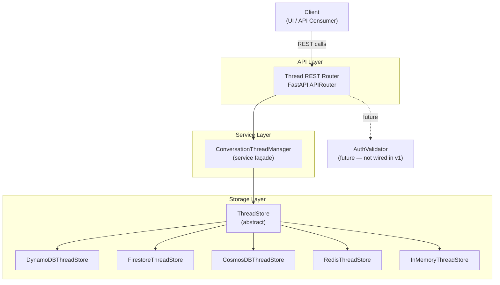
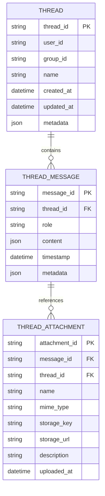
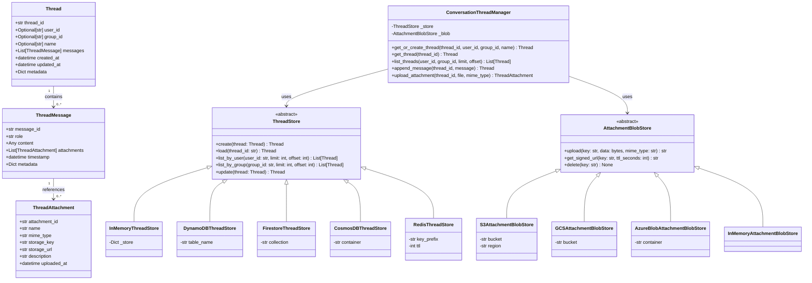
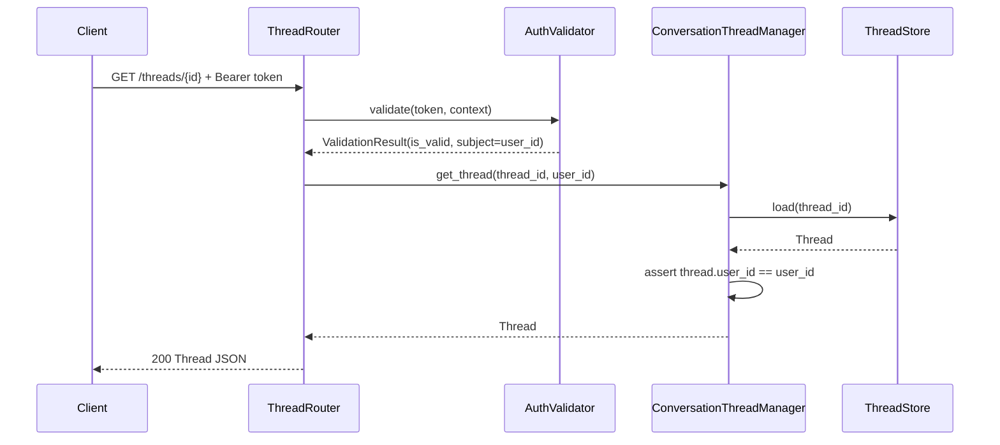
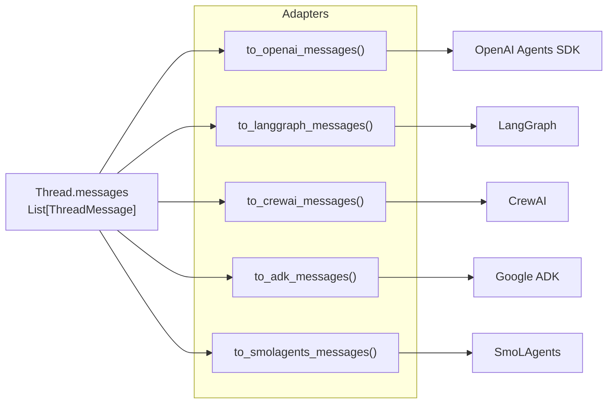
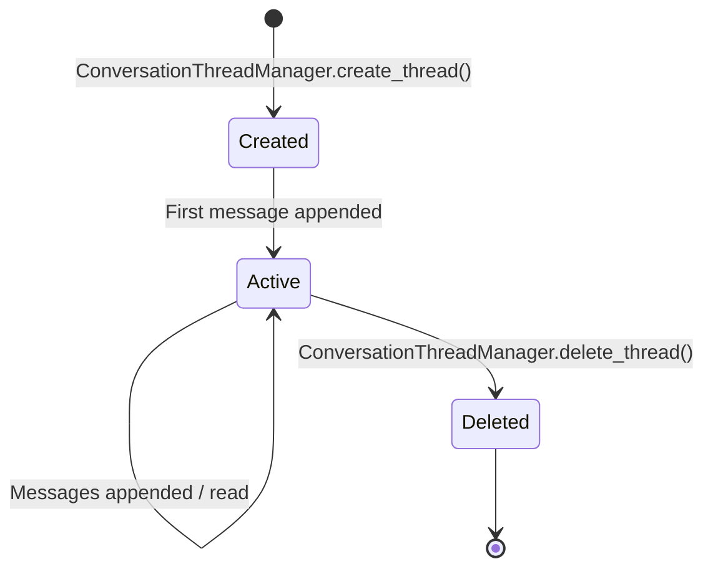
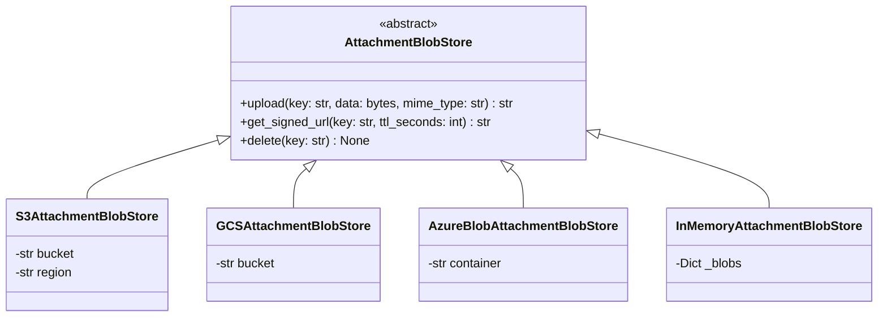
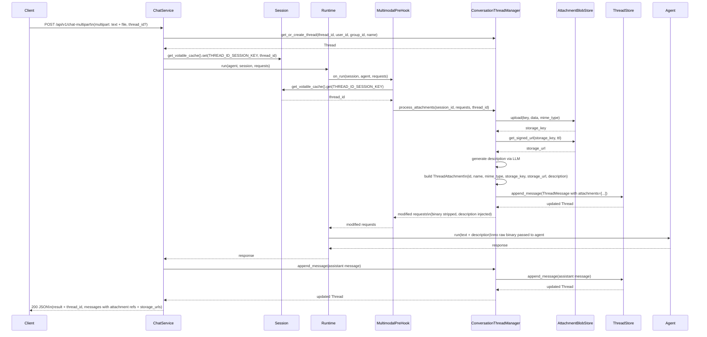

# Conversation Thread Support

## Overview

Conversation Thread Support adds named, persistent conversation contexts (threads) to Agent Kernel. A thread holds a user's full message history across multiple chat requests, scoped to a user or group, and exposes that history via REST so any UI or client can integrate with it.

Agent Kernel currently manages conversation state through `Session`, which is ephemeral and scoped to a single request cycle. There is no built-in way to persist a full conversation across multiple requests under a shared identity, group conversations by user or project, or expose conversation history to a UI. Conversation Thread Support closes this gap, building on the existing `SessionStore` infrastructure and `RESTAPI` patterns.

Conversation Thread Support is **opt-in** — enabled only when a `thread` block is present in `config.yaml`. Agents without this block behave exactly as they do today. Threads are auto-created on the first chat request when no `thread_id` is supplied; the generated `thread_id` is returned in the response so the client can pass it on subsequent turns.

`user_id` is an optional field accepted on every chat request. It tags the thread on creation and enables user-scoped listing via `GET /threads?user_id=...` — no separate authentication is required to use it. No identity verification is applied in v1: any caller-supplied value is accepted, and ownership is not enforced. Once AK authentication is available, `user_id` will be derived from the token and enforced in `ConversationThreadManager` without any data model changes.

> **Platform scope:** Do not enable Conversation Thread Support for agents deployed on platforms with native thread management (Slack, Microsoft Teams). Those platforms own conversation history; enabling AK threads alongside them creates duplicate, divergent state.

> **Access model:** "v1" refers to the feature iteration, not a separate unprotected URL path. AK has a single set of routes (`/api/v1/*`). When authentication is enabled via `RESTAPI.add_auth_handlers()`, it wraps **all** routes globally — there is no bypass path. Until authentication is configured, any caller who knows a `thread_id` can read or write it; deploy behind network-level access controls (VPC, API gateway) in the interim.

> **Deferred in v1:** No explicit `POST /threads` create endpoint (threads are created implicitly via `/chat`). No `DELETE /threads/{thread_id}` (deferred until authentication is available).

---

## Architecture Overview

The Conversation Thread Support subsystem sits between the client and the existing Agent Kernel runtime. `ConversationThreadManager` is the universal attachment and thread handler — it is instantiated whenever `multimodal.enabled = true` OR a `thread` block is present in `config.yaml`. Thread lifecycle (create/load/append/history) is driven from `ChatService`, which has access to `thread_id` and `user_id` from the request body. `MultimodalPreHook` **remains** the attachment entry point in `Runtime._system_pre_hooks` — it is made thread-aware by reading a `thread_id` that `ChatService` stashes into the session's volatile cache before `Runtime.run`, and delegates all attachment handling to `ConversationThreadManager.process_attachments`. `ThreadRouter` is only mounted when thread config is present. An `AuthValidator` node is shown as a future integration point — it is not wired until AK authentication is implemented.



---

## Configuration

Conversation Thread Support is activated by adding a `thread` block to `config.yaml`. If the block is absent, no `ThreadRouter` or `ConversationThreadManager` is initialised. When thread support is enabled, `thread.blob` must also be present — AK raises a clear `ConfigurationError` at startup if it is missing.

The `thread.type` key selects the storage backend. Each backend has its own sub-key with provider-specific settings, mirroring the existing `session` configuration convention.

#### DynamoDB

```yaml
thread:
  type: dynamodb
  dynamodb:
    table_name: "ak-agent-threads"
    region: "us-east-1"        # optional — falls back to AWS_DEFAULT_REGION
  blob:
    type: s3
    s3:
      bucket: "ak-agent-attachments"
      region: "us-east-1"
      signed_url_ttl: 900      # optional — seconds; defaults to 900 (15 min)
```

#### Firestore

```yaml
thread:
  type: firestore
  firestore:
    collection_name: "ak-agent-threads"
    ttl: 2592000               # optional — seconds; omit for no TTL
  blob:
    type: gcs
    gcs:
      bucket: "ak-agent-attachments"
      signed_url_ttl: 900
```

#### CosmosDB

```yaml
thread:
  type: cosmosdb
  cosmosdb:
    container: "ak-agent-threads"
    partition_key: "user_id"   # optional — defaults to user_id
  blob:
    type: azure_blob
    azure_blob:
      container: "ak-agent-attachments"
      signed_url_ttl: 900
```

#### Redis

```yaml
thread:
  type: redis
  redis:
    prefix: "ak:thread:"
    url: "redis://localhost:6379"
    ttl: 2592000               # optional — seconds; omit for no TTL
  blob:
    type: memory
```

#### InMemory (local development / testing only)

```yaml
thread:
  type: memory
  blob:
    type: memory
```

---

## Key Components

| Component | Location | Responsibility |
|---|---|---|
| `Thread` | `core/thread/base.py` | Pydantic model representing a thread and its messages |
| `ThreadMessage` | `core/thread/base.py` | Pydantic model for a single message in a thread |
| `ThreadAttachment` | `core/thread/base.py` | Pydantic model for an attachment reference stored in a message |
| `ThreadStore` | `core/thread/store/base.py` | Abstract base defining the storage interface |
| `*ThreadStore` impls | `core/thread/store/*.py` | `dynamodb.py`, `firestore.py`, `cosmosdb.py`, `redis.py`, `in_memory.py` implementations |
| `ConversationThreadManager` | `core/thread/manager.py` | Service façade used by the API layer; owns attachment upload, description generation, and user scoping |
| `AttachmentBlobStore` | `core/multimodal/storage/blob.py` | Abstract base for cloud object storage (S3, GCS, Azure Blob) |
| `*AttachmentBlobStore` impls | `core/multimodal/storage/blob_*.py` | S3, GCS, Azure Blob, InMemory implementations |
| `ThreadRouter` | `api/thread/router.py` | FastAPI `APIRouter` wiring HTTP endpoints to `ConversationThreadManager` |
| `MultimodalPreHook` | `core/multimodal/hooks.py` | Existing system pre-hook, kept and made thread-aware; delegates to `ConversationThreadManager.process_attachments` |
| `THREAD_ID_SESSION_KEY` | `core/thread/manager.py` | Session volatile-cache key `ChatService` uses to pass `thread_id` to `MultimodalPreHook` (no `PreHook` interface change needed) |

---

## Data Model

### Entity Relationship



### Class Diagram



---

## API Design

Conversation Thread Support integrates with the existing `/api/v1/chat` and `/api/v1/chat-multipart` endpoints. When thread config is enabled, a thread is automatically created on the first request if no `thread_id` is supplied. The returned `thread_id` is passed on subsequent calls to continue the thread.

`user_id` is accepted as an optional field in the request body. It tags the thread on creation and enables user-scoped listing via `GET /threads?user_id=...` without requiring authentication. No identity verification is applied in v1 — the value is accepted as supplied by the caller. When authentication is available, `user_id` will be derived from the token and the request body field will be dropped.

### Modified Chat Endpoints (existing, extended)

`POST /api/v1/chat` and `POST /api/v1/chat-multipart` accept these new optional fields when Conversation Thread Support is enabled:

| Field | Type | Description |
|---|---|---|
| `user_id` | `string \| null` | Tags the thread with a user identity. Enables `GET /threads?user_id=...` filtering. Not verified in v1. |
| `thread_id` | `string \| null` | ID of an existing thread to continue. Omit to auto-create a new thread. |
| `thread_name` | `string \| null` | Display name — applied only when auto-creating a new thread. If omitted, the thread is named from the first 80 characters of the prompt (trimmed to the last word boundary, suffixed with `…`). No LLM call is made for naming. |
| `group_id` | `string \| null` | Group or project scope — applied only when auto-creating a new thread. |

First turn — thread auto-created:

```json
POST /api/v1/chat

{
  "prompt": "What is the refund policy?",
  "session_id": "ses_abc",
  "user_id": "usr_xyz",
  "thread_name": "Support conversation",
  "group_id": "project-42"
}
```

```json
200 OK
{
  "result": "The refund policy is...",
  "session_id": "ses_abc",
  "thread_id": "thr_abc123"
}
```

Subsequent turn — pass `thread_id` to continue:

```json
POST /api/v1/chat

{
  "prompt": "What about international orders?",
  "session_id": "ses_abc",
  "thread_id": "thr_abc123"
}
```

### Thread Read Endpoints (new)

| Method | Path | Description |
|---|---|---|
| `GET` | `/threads` | List threads filtered by `user_id` or `group_id` query param |
| `GET` | `/threads/{thread_id}` | Get a thread with full message history |
| `GET` | `/threads/{thread_id}/attachments/{attachment_id}/url` | Refresh a signed URL for an attachment |

> `POST /threads` (explicit create) and `DELETE /threads/{thread_id}` are not exposed in v1. Creation is implicit via `/chat`; deletion is deferred until authentication is in place.

Get thread — response:

```json
200 OK
{
  "thread_id": "thr_abc123",
  "user_id": "usr_xyz",
  "group_id": "project-42",
  "name": "Support conversation",
  "messages": [
    { "message_id": "msg_1", "role": "user", "content": "What is the refund policy?", "timestamp": "2026-06-28T10:00:00Z", "attachments": [] },
    { "message_id": "msg_2", "role": "assistant", "content": "The refund policy is...", "timestamp": "2026-06-28T10:00:05Z", "attachments": [] }
  ],
  "created_at": "2026-06-28T10:00:00Z",
  "updated_at": "2026-06-28T10:00:05Z"
}
```

---

## Workflows

### Thread Auto-Creation and Message Flow

```mermaid
flowchart TD
    A([Client sends POST /api/v1/chat\nwith optional thread_id + user_id]) --> B{thread_id\nprovided?}
    B -->|No — first turn| C[ConversationThreadManager.create_thread\nauto-creates thread, stores user_id]
    B -->|Yes — continuing| D[ConversationThreadManager.get_thread\nloads existing thread]
    C --> S{Session newly created?\nSessionStore.new\(\) vs .load\(\)}
    D --> S
    S -->|Yes — new session_id,\nno native session memory yet| E[Inject thread history into agent context]
    S -->|No — continuing session_id| F
    E --> F[Agent generates response]
    F --> G[Append user + assistant messages to thread]
    G --> H[Return result + thread_id in response]
    H --> I([Client stores thread_id\nfor next turn])

    style C fill:#fff3cd,stroke:#aaa
```

### Ownership Check — Future State (Post-Authentication)

Not implemented in v1. Shown here so the implementation path is clear when authentication is added.



### Framework Integration — Loading Thread History

Each agentic framework gets a thin adapter that converts `Thread.messages` into its native message format.



### ThreadStore State Lifecycle



---

## Multimodal & Attachment Storage

`MultimodalPreHook` is **kept** as the single attachment entry point, registered in `Runtime._system_pre_hooks` exactly as it is today. `MultimodalPreHookFactory` now constructs it with a reference to the shared `ConversationThreadManager` instance (instantiated once at bootstrap whenever `multimodal.enabled = true` OR a `thread` block is present — see Task 4), instead of the hook building its own `AttachmentStorageManager` access path internally.

`MultimodalPreHook.on_run` reads `thread_id` from `session.get_volatile_cache()` (key `THREAD_ID_SESSION_KEY`, written by `ChatService` before `Runtime.run` — see Task 9) and calls `await self._manager.process_attachments(session_id=session.id, requests=requests, thread_id=thread_id)`, returning its result directly. The hook is a thin adapter; all description-generation, extraction, and storage logic lives in `ConversationThreadManager.process_attachments`, which operates in two modes based on whether `thread_id` is set and thread config is present:

| Mode | Condition | Attachment storage | Thread record |
|---|---|---|---|
| **Session-only** | `multimodal.enabled = true`, no `thread` config (or no `thread_id` in the session cache) | `AttachmentStorageManager(session_id)` — in-memory, Redis, or DynamoDB (existing backends) | None created |
| **Thread-enabled** | `thread` config present and `thread_id` found in the session cache | `AttachmentBlobStore` — S3, GCS, or Azure Blob | `ThreadAttachment` appended to thread |

In both modes: the LLM generates a brief description of the attachment, the binary is stripped from the request, and the description text is injected into the prompt before the agent runs. `AttachmentStorageManager` and its backends are kept unchanged — they continue to serve session-only mode. When thread config is disabled, `ChatService` never writes `THREAD_ID_SESSION_KEY`, so `MultimodalPreHook` always calls `process_attachments` with `thread_id=None` and behaves exactly as it does today — no regression to existing session-only behavior.

### Processing Flow

When a request with attachments arrives:

1. `Runtime.run` invokes `MultimodalPreHook.on_run`, which reads `thread_id` from the session's volatile cache (`None` if thread config is disabled or absent for this session) and calls `ConversationThreadManager.process_attachments(session_id, requests, thread_id)`.
2. `process_attachments` receives the raw binary from the request.
3. **Session-only** (`thread_id is None`): saves via `AttachmentStorageManager(session_id)`.  
   **Thread-enabled** (`thread_id` set): uploads to cloud object storage under `threads/{thread_id}/{message_id}/{attachment_id}/{filename}`, builds a `ThreadAttachment` record, and appends it to the thread.
4. Calls an LLM to generate a brief description of the attachment (both modes).
5. Returns a modified request list with binary stripped and description injected into the prompt text; `MultimodalPreHook` returns this list as-is.

### `AttachmentBlobStore` Abstraction



### Attachment Upload Flow



### UI Rendering of Thread History

Because `ThreadAttachment.storage_url` is a signed URL (or a stable public URL), the UI renders attachment thumbnails directly from the thread message payload without a separate API fetch. Signed URLs should be refreshed when they are close to expiry via `GET /threads/{id}/attachments/{att_id}/url`. This is only applicable in thread-enabled mode; session-only attachments are not UI-renderable (no URL is produced).

---

## Implementation Plan

### Task 1: Define `Thread`, `ThreadMessage`, `ThreadAttachment` Pydantic models

**File:** `ak-py/src/agentkernel/core/thread/base.py` (new)

1. Define `ThreadAttachment` with fields: `attachment_id`, `name`, `mime_type`, `storage_key`, `storage_url`, `description`, `uploaded_at`.
2. Define `ThreadMessage` with fields: `message_id`, `role`, `content: Any`, `attachments: List[ThreadAttachment]`, `timestamp`, `metadata: Dict`.
3. Define `Thread` with fields: `thread_id`, `user_id: Optional[str]`, `group_id: Optional[str]`, `name: Optional[str]`, `messages: List[ThreadMessage]`, `created_at`, `updated_at`, `metadata: Dict`.

---

### Task 2: Define `ThreadStore` abstract base and `InMemoryThreadStore`

**Files:** `ak-py/src/agentkernel/core/thread/store/base.py`, `store/in_memory.py` (new)

1. Define `ThreadStore` abstract base (in `store/base.py`) with methods: `create(thread) -> Thread`, `load(thread_id) -> Thread`, `list_by_user(user_id, limit, offset) -> List[Thread]`, `list_by_group(group_id, limit, offset) -> List[Thread]`, `update(thread) -> Thread`.
2. Implement `InMemoryThreadStore` (in `store/in_memory.py`) backed by a `Dict[str, Thread]` for local development and tests.
3. Mirrors the existing `core/multimodal/storage/` package layout (`base.py`, `in_memory.py`, `redis.py`, `dynamodb.py`, ...) — a `store/` package under `thread/` rather than flat `store_*.py` files at the `thread/` top level.

---

### Task 3: Implement `ConversationThreadManager`

**File:** `ak-py/src/agentkernel/core/thread/manager.py` (new)

1. Implement `process_attachments(session_id, requests, thread_id=None)` — the universal attachment handler, invoked by `MultimodalPreHook.on_run` (see Multimodal & Attachment Storage section; `thread_id` is read from the session's volatile cache, not passed by `ChatService` directly):
   - Extracts `AgentRequestImage` and `AgentRequestFile` items from the request list.
   - Calls the LLM to generate a brief description of each attachment.
   - **Session-only mode** (`thread_id` is `None` or thread config absent): saves via `AttachmentStorageManager(session_id)` — same behavior `MultimodalPreHook` already implements today.
   - **Thread-enabled mode** (`thread_id` is provided and thread config present): uploads to `_blob` under `threads/{thread_id}/{message_id}/{attachment_id}/{filename}`, builds a `ThreadAttachment`, calls `append_message`. On blob upload success but store failure, delete the blob as a compensating action.
   - Returns the modified request list with binary stripped and descriptions injected into the prompt text.
2. Implement `get_or_create_thread(thread_id, user_id, group_id, name)` — creates a new thread if `thread_id` is `None`, loads the existing thread otherwise. When `name` is `None`, auto-name from the first 80 characters of the first prompt in the request, trimmed to the last word boundary and suffixed with `…`. No LLM call is made for naming.
3. Implement `get_thread(thread_id)` — raises `ThreadNotFoundError` if the thread does not exist.
4. Implement `list_threads(user_id, group_id, limit, offset)` — delegates to `_store.list_by_user` or `_store.list_by_group`; no ownership check applied in v1.
5. Implement `append_message(thread_id, message)`.
6. Structure the class so enabling ownership enforcement post-auth (asserting `thread.user_id == caller_user_id`) is a single-file change with no data model migration.

---

### Task 4: Add `ThreadConfig` and wire bootstrap

**File:** `ak-py/src/agentkernel/core/config.py` (existing)

1. Add `ThreadConfig` Pydantic model (mirrors `SessionConfig`) that parses the `thread` block from `config.yaml`, including the `thread.blob` sub-key.
2. In the AK bootstrap, instantiate `ConversationThreadManager` when `multimodal.enabled = true` OR a `thread` block is present. `MultimodalPreHookFactory` stays registered in `Runtime._system_pre_hooks`; update it to construct `MultimodalPreHook` with the shared `ConversationThreadManager` instance instead of the hook building its own `AttachmentStorageManager` access path internally.
3. When thread config is present, also instantiate `ThreadStore` and `AttachmentBlobStore` and pass them to `ConversationThreadManager`. When only multimodal is enabled (no thread config), `ConversationThreadManager` is instantiated without `ThreadStore` or `AttachmentBlobStore` and operates in session-only mode.
4. Raise a clear `ConfigurationError` at startup if `thread` is enabled but `thread.blob` is missing.
5. Raise a clear `ConfigurationError` at startup on an unknown `thread.type` value.

---

### Task 5: Define `AttachmentBlobStore` abstract base and `InMemoryAttachmentBlobStore`

**File:** `ak-py/src/agentkernel/core/multimodal/storage/blob.py` (new)

1. Define `AttachmentBlobStore` abstract base with methods: `upload(key, data, mime_type) -> str`, `get_signed_url(key, ttl_seconds) -> str`, `delete(key) -> None`.
2. Implement `InMemoryAttachmentBlobStore` — stores bytes in a `Dict`; `get_signed_url` returns a `data:` URI. Used for tests and local development.
3. `AttachmentBlobStore` is a **separate** abstract base from the existing `AttachmentStore` (`core/multimodal/storage/base.py`) — deliberately not unified behind one interface:
   - **Data shape**: `AttachmentStore.save(attachment: dict, max_attachments: int)` takes a full metadata dict with base64 `data` embedded and enforces a count-based eviction policy. `AttachmentBlobStore.upload(key: str, data: bytes, mime_type: str)` takes raw bytes and a caller-built hierarchical key (`threads/{thread_id}/{message_id}/{attachment_id}/{filename}`), with no eviction concept — durability/TTL is the cloud provider's job.
   - **Retrieval contract**: `AttachmentStore.get(id) -> dict` returns the actual bytes, because `analyze_attachments` re-reads session-only attachments back into the agent. `AttachmentBlobStore` has no byte-retrieval method at all — only `get_signed_url`, since thread attachments are rendered client-side from a URL, not pulled back into the agent.
   - Forcing one interface would mean either a near-empty base class both sides override entirely, or squashing one shape into the other, for two call sites that are never polymorphically swapped at runtime (`ConversationThreadManager.process_attachments` picks one or the other by mode, never both). Revisit only if a future caller needs to treat both backends interchangeably.

---

### Task 6: Implement `S3AttachmentBlobStore`

**File:** `ak-py/src/agentkernel/core/multimodal/storage/blob_s3.py` (new)

1. Implement `upload` using `boto3` `put_object`.
2. Implement `get_signed_url` using `generate_presigned_url` with configurable TTL (default 900 seconds).
3. Implement `delete` using `delete_object`.
4. Accept `bucket` and optional `region` from config.

---

### Task 7: Implement `GCSAttachmentBlobStore` and `AzureBlobAttachmentBlobStore`

**Files:** `ak-py/src/agentkernel/core/multimodal/storage/blob_gcs.py`, `blob_azure.py` (new)

1. GCS variant: `upload_from_string`, `generate_signed_url`, `delete_blob` via `google-cloud-storage`.
2. Azure Blob variant: `upload_blob`, SAS URL generation, `delete_blob` via `azure-storage-blob`.
3. Both accept provider-specific settings (bucket / container, TTL) from config.

---

### Task 8: Implement cloud `ThreadStore` backends

**Files:** `ak-py/src/agentkernel/core/thread/store/dynamodb.py`, `store/firestore.py`, `store/cosmosdb.py`, `store/redis.py` (new)

1. `DynamoDBThreadStore` — single table with `PK=thread_id`; GSI on `user_id` and `group_id` for `list_by_user` / `list_by_group`.
2. `FirestoreThreadStore` — collection `threads`; Firestore query by `user_id` / `group_id` field with `limit` and `offset`.
3. `CosmosDBThreadStore` — container partitioned by `user_id`; cross-partition query for `list_by_group`.
4. `RedisThreadStore` — JSON hash per thread with optional TTL; secondary index sets for user and group listings.

---

### Task 9: Add thread fields to request models and integrate with `ChatService`

**File:** `ak-py/src/agentkernel/core/model.py` (existing)

1. Add `user_id: Optional[str] = None` to `BaseChatRequest` — makes `user_id` an explicit, documented field available across all request types.
2. Add `thread_id: Optional[str] = None`, `thread_name: Optional[str] = None`, and `group_id: Optional[str] = None` to `BaseRunRequest` — these are no-ops when thread config is disabled.

**File:** `ak-py/src/agentkernel/core/chat_service.py` (existing)

1. When thread config is enabled, call `ConversationThreadManager.get_or_create_thread(thread_id, user_id, group_id, thread_name)` to resolve or create the thread, then write the resulting `thread_id` into the current `Session`'s volatile cache (`session.get_volatile_cache().set(THREAD_ID_SESSION_KEY, thread_id)`) before calling `Runtime.run`, so `MultimodalPreHook` can read it and delegate to `ConversationThreadManager.process_attachments` (see Multimodal & Attachment Storage section). When thread config is disabled, this key is never set, so `MultimodalPreHook` defaults to `thread_id=None` and behaves exactly as it does today — no change to existing session-only behavior. *Implementation note:* confirm exactly where `ChatService`/`AgentService` holds the live `Session` object for a given `session_id` prior to `Runtime.run` (today's flow goes through `AgentService.initialize`/`service.select`), so the cache write lands on the same `Session` instance `Runtime.run` later uses.
2. When thread config is enabled **and** the current request resolved to a newly-created `Session` (`SessionStore.new()` was used, not `.load()` — see `ak-py/src/agentkernel/core/session/base.py`), also inject `Thread.messages` into the agent context as the initial message list. Skip this when the `Session` was loaded from an existing record (a continuing turn with the same `session_id`): every framework runner already persists its own native conversation memory inside `Session` (`OpenAISession`, `GoogleADKSession`, `SmolagentsSession`, `CrewAISession`, LangGraph's checkpointer — see `ak-py/src/agentkernel/framework/*/`), and `Runtime.run` persists/reloads the whole `Session` via `SessionStore` across requests (`ak-py/src/agentkernel/core/runtime.py:174, 198`), so re-injecting `Thread.messages` on an already-populated session would duplicate history already in context. Injection is only needed to reseed a brand-new `session_id` that's resuming an existing `thread_id` (e.g. expired session, new device).
3. After the agent run, when thread config is enabled, call `ConversationThreadManager.append_message` for both the user message and the assistant response.
4. Include `thread_id` in the chat response when thread config is enabled.

---

### Task 10: Implement `ThreadRouter`

**File:** `ak-py/src/agentkernel/api/thread/router.py` (new)

1. Implement `GET /threads` with optional `user_id` and `group_id` query params; delegate to `ConversationThreadManager.list_threads`; no caller identity check applied in v1.
2. Implement `GET /threads/{thread_id}` returning the full thread including message history and attachment references.
3. Implement `GET /threads/{thread_id}/attachments/{attachment_id}/url` to refresh a signed URL.
4. Register via `RESTAPI.add()` — no changes to core `RESTAPI`.
5. Return `404 ThreadNotFound` for an unknown `thread_id`; return `400` if both `user_id` and `group_id` are omitted on `GET /threads`.

---

### Task 11: Implement framework adapters

**Files:** `ak-py/src/agentkernel/framework/*/` (existing, extended)

1. Add `to_openai_messages()`, `to_langgraph_messages()`, `to_crewai_messages()`, `to_adk_messages()`, `to_smolagents_messages()` conversion helpers to `Thread` or per-framework adapter modules.
2. Update each framework runner to accept an optional `thread_id` and, only under the new-session condition described in Task 9 bullet 2 (fresh `session_id` resuming an existing thread — never on a continuing session), load history via `ConversationThreadManager` and pass the converted message list as the initial context before the agent runs.

---

### Task 12: Tests

**Files:** `ak-py/tests/thread/` (new)

1. **Unit:** `ConversationThreadManager` with mocked `ThreadStore` and `AttachmentBlobStore`; `user_id` stored on thread; `list_threads(user_id=...)` delegates to `list_by_user`; message serialisation round-trips.
2. **Integration:** each `ThreadStore` backend against a real provider (DynamoDB local, Firestore emulator, Azurite, Redis Docker).
3. **API:** FastAPI `TestClient` against `ThreadRouter`; 404 on unknown thread; `GET /threads?user_id=xxx` returns matching threads; `GET /threads` without `user_id` or `group_id` returns 400.
4. **Framework adapters:** for each framework, load a pre-populated thread and verify the agent receives the correct history.
5. **Multimodal:** multipart POST with an image → blob uploaded, `ThreadAttachment` stored with `storage_url`, raw binary absent from thread document; blob deleted on store failure (compensating action).
6. **Session-only mode:** multimodal request with no thread config → `ConversationThreadManager.process_attachments` saves to `AttachmentStorageManager(session_id)`, description injected into prompt, no thread record created, no blob store used.
7. **Config edge cases:** no `thread` key → `ThreadRouter` not registered, `/threads` paths return 404, thread fields in `/chat` silently ignored; `thread` present but `thread.blob` missing → startup error; unknown `thread.type` → startup error; chat with no `thread_id` → new thread auto-created; chat with unknown `thread_id` → 404.

---

### Task 13: Documentation and examples

**Files:** `examples/`, `DEVELOPER_GUIDE.md`

1. Add a thread-aware example under `examples/` demonstrating a multi-turn conversation with `user_id` scoping and thread listing.
2. Update `DEVELOPER_GUIDE.md` with thread configuration, `user_id` usage (scoping without enforcement), and the explicit note that ownership is not enforced until AK authentication is available.

---

## Testing Strategy

Unit tests mock `ThreadStore` and `AttachmentBlobStore` to isolate `ConversationThreadManager` logic. Integration tests run each backend against a real provider using Docker or cloud emulators. API tests use FastAPI `TestClient` with `InMemoryThreadStore` and `InMemoryAttachmentBlobStore`.

Edge cases to cover:

- `config.yaml` has no `thread` key → `ThreadRouter` not registered; `/threads` paths return 404; `thread_id`, `thread_name`, and `group_id` fields in `/chat` are silently ignored.
- `thread` key present but `thread.blob` missing → startup `ConfigurationError`.
- Chat with no `thread_id` → new thread auto-created; `thread_id` returned in response.
- Chat with unknown `thread_id` → 404.
- `GET /threads?user_id=unknown` → empty list, not 404.
- Empty thread (no messages) → valid state, not an error.
- Very large thread (>1000 messages) → pagination via `limit`/`offset` on `list_by_user` / `list_by_group`.
- Message with attachment but no text content → valid; agent receives description only.
- Blob upload succeeds but store `append_message` fails → blob deleted as compensating action.
- Signed URL near or past expiry → refresh endpoint returns a new valid URL.
- Same `session_id` continuing an existing thread across multiple turns → `Thread.messages` is NOT re-injected as initial context (assert no duplication of history already present in native per-framework session memory).
- New/different `session_id` resuming an existing, non-empty `thread_id` → `Thread.messages` IS injected as the initial context (native session memory is empty for this fresh session).
