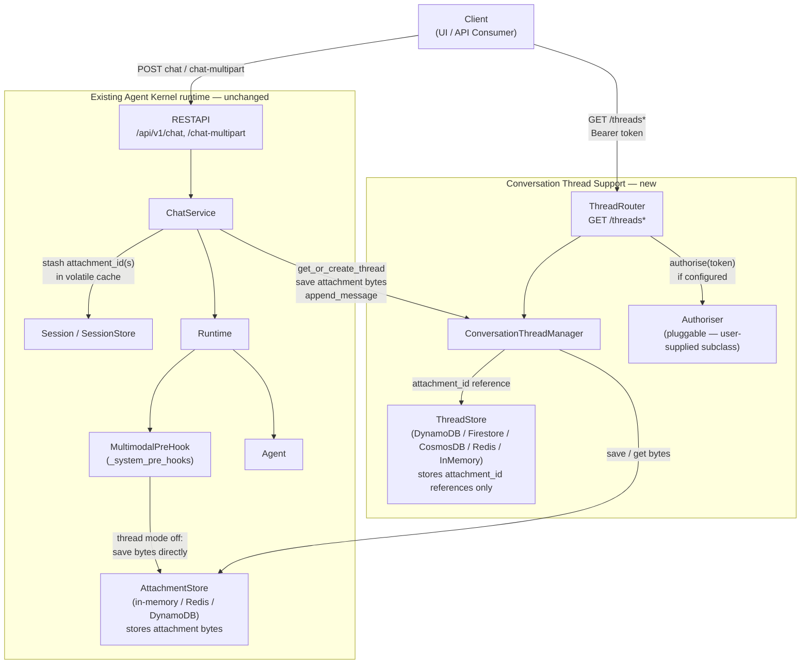
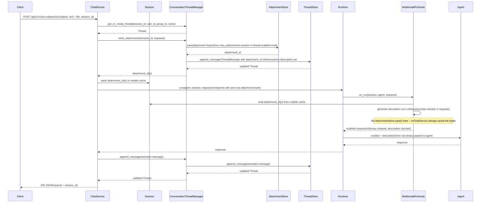
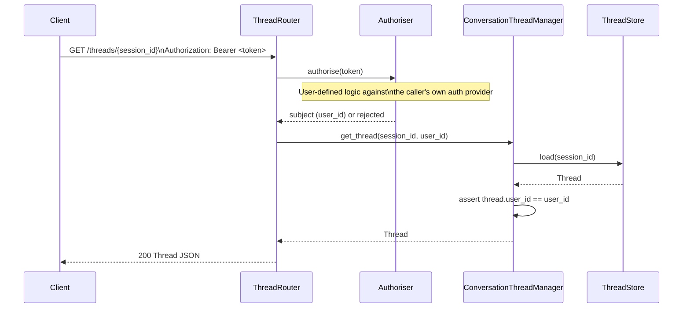

# Conversation Thread Support

## Overview

- **What it is**: named, persistent conversation contexts ("threads") for Agent Kernel.
  - A thread holds a user's full message history across multiple chat requests.
  - Scoped to a user or group.
  - History is exposed via REST so any UI or client can integrate with it.

- **Why it's needed**: Agent Kernel currently manages conversation state through `Session`, which is ephemeral and scoped to a single request cycle.
  - No built-in way to persist a full conversation across multiple requests under a shared identity.
  - No built-in way to group conversations by user or project.
  - No built-in way to expose conversation history to a UI.
  - Conversation Thread Support closes this gap.

- **Enablement and identification**:
  - **Opt-in** — enabled only when a `thread` block is present in `config.yaml`; agents without this block behave exactly as they do today.
  - A thread is identified by the request's `session_id`.
  - The thread for a given `session_id` is auto-created on that session's first chat request.
  - Every subsequent request carrying the same `session_id` appends to that same thread.

- **`user_id` requirement**: required on every chat request once Conversation Thread Support is enabled.
  - A request missing it is rejected.
  - It tags the thread on creation and enables user-scoped listing via `GET /threads?user_id=...` — no `Authoriser` is required to use it.
  - **Without an `Authoriser` configured**: no identity verification is applied — any caller-supplied `user_id` is accepted, and ownership is not enforced.
  - **With an `Authoriser` configured** (see Authorisation Flow below): `user_id` is instead resolved from the Bearer token and enforced in `ConversationThreadManager`.
  - When thread support is disabled, `user_id` is not required and has no effect.

- **`group_id`**: optional field on the chat request, applied only when a thread is auto-created (a session's first request).
  - Scopes a thread to a group or project rather than (or in addition to) a user — "group" here is any caller-defined grouping criterion, not a user group.
  - Enables group-scoped listing via `GET /threads?group_id=...`, mirroring the `user_id`-scoped listing above.
  - Not required — a thread with no `group_id` is simply unscoped by group and only listable by `user_id`.
  - Ignored on subsequent requests to the same `session_id`; a thread's `group_id` is fixed at creation.

- **Attachment support**:
  - Still decided by `multimodal.enabled`, not by the `thread` block itself — enabling `thread` does not automatically turn on attachments.
  - `thread` will not support attachments on its own: attachment bytes always live in the existing `AttachmentStore` (in-memory / Redis / DynamoDB) — there is no separate thread-specific attachment backend.
  - **Thread mode on**: `ChatService` calls `ConversationThreadManager` directly, *before* `Runtime.run`, to save each attachment's bytes to `AttachmentStore` and append the resulting `attachment_id` as a reference on `ThreadStore` — pure storage, no description generated yet. The `attachment_id`(s) are stashed in the session's volatile cache for `MultimodalPreHook` to pick up. The hook still generates the LLM description and strips/injects it as usual, but it does not call `AttachmentStore.save()` itself — `ChatService` already did that.
  - **Thread mode off**: unchanged from today — `ChatService` never calls `ConversationThreadManager`; `MultimodalPreHook` does the full job itself (describe, save to `AttachmentStore`, strip, inject).
  - When `thread` is configured, `ThreadStore` holds only an `attachment_id` reference on each `ThreadMessage`, not the encoded bytes — reading a thread's attachments means one `AttachmentStore` lookup per reference.
  - Thread-enabled attachments are exempt from `AttachmentStore`'s normal `max_attachments` eviction — a thread's history must not silently lose old attachments the way ephemeral session-only storage does.

> **Platform scope:** Do not enable Conversation Thread Support for agents deployed on platforms with native thread management (Slack, Microsoft Teams). Those platforms own conversation history; enabling AK threads alongside them creates duplicate, divergent state.

> **Access model:** AK has a single set of routes (`/api/v1/*`). Authorization is optional and pluggable — an end user can supply their own `Authoriser` (a base class provided by Agent Kernel) to protect thread routes; see the Authorisation Flow diagram below. Until an `Authoriser` is configured, any caller who knows a `session_id` can read or write its thread; deploy behind network-level access controls (VPC, API gateway) in the interim.

> **Deferred in v1:** No explicit `POST /threads` create endpoint (threads are created implicitly via `/chat`). No `DELETE /threads/{session_id}`.

---

## Architecture Overview

- The Conversation Thread Support subsystem sits between the client and the existing Agent Kernel runtime.

- **`ConversationThreadManager`**:
  - Instantiated whenever `multimodal.enabled = true` OR a `thread` block is present in `config.yaml`.
  - Only handles attachments when `multimodal.enabled = true` — the `thread` block by itself only turns on text history.
  - When both are true, `ChatService` calls it directly, *before* `Runtime.run`, to save each attachment's bytes to `AttachmentStore` and append the resulting `attachment_id` as a reference on `ThreadStore`.

- **Thread lifecycle** (create/load/append/history) is driven from `ChatService`, which already has `session_id` and `user_id` available on every request.

- **`MultimodalPreHook`**:
  - **Remains** the sole attachment entry point in `Runtime._system_pre_hooks`, gated by `multimodal.enabled` exactly as today.
  - **Thread mode on**: does not call `AttachmentStore.save()` itself — `ChatService`/`ConversationThreadManager` already saved the bytes and created the `attachment_id` before `Runtime.run`. The hook reads that `attachment_id` back from the session's volatile cache, and still generates the description via LLM, strips the binary, and injects the description — exactly as today, just without the save step.
  - **Thread mode off**: unchanged from today — does the full job itself (describe, save, strip, inject); `ConversationThreadManager` is never involved.

- **Attachment storage**: attachment bytes always live in `AttachmentStore` — the same backend used today — regardless of `thread` config. When `thread` is present, `ThreadStore` only holds an `attachment_id` reference per message; no bytes are ever duplicated into `ThreadStore`, and no separate blob store is involved.

- **`ThreadRouter`**:
  - Only mounted when thread config is present.
  - Optionally protected by a pluggable `Authoriser` supplied by the end user.


```mermaid
flowchart TD
    Client["Client\n(UI / API Consumer)"]

    subgraph Existing["Existing Agent Kernel runtime — unchanged"]
        RESTAPI["RESTAPI\n/api/v1/chat, /chat-multipart"]
        ChatService["ChatService"]
        SessionStore["Session / SessionStore"]
        Runtime["Runtime"]
        MMHook["MultimodalPreHook\n(_system_pre_hooks)"]
        Agent["Agent"]
        AS["AttachmentStore\n(in-memory / Redis / DynamoDB)\nstores attachment bytes"]
    end

    subgraph New["Conversation Thread Support — new"]
        ThreadRouter["ThreadRouter\nGET /threads*"]
        TSM["ConversationThreadManager"]
        TS["ThreadStore\n(DynamoDB / Firestore / CosmosDB / Redis / InMemory)\nstores attachment_id references only"]
        AUTH["Authoriser\n(pluggable — user-supplied subclass)"]
    end

    Client -->|"POST chat / chat-multipart"| RESTAPI --> ChatService
    ChatService -->|"stash attachment_id(s)\nin volatile cache"| SessionStore
    ChatService -->|"get_or_create_thread\nsave attachment bytes\nappend_message"| TSM
    ChatService --> Runtime --> MMHook
    Runtime --> Agent
    TSM -->|"save / get bytes"| AS
    TSM -->|"attachment_id reference"| TS
    MMHook -->|"thread mode off:\nsave bytes directly"| AS

    Client -->|"GET /threads*\nBearer token"| ThreadRouter --> TSM
    ThreadRouter -->|"authorise(token)\nif configured"| AUTH
```

---

## Configuration

- **Activation**: Conversation Thread Support is activated by adding a `thread` block to `config.yaml`.
  - **If absent**: no `ThreadRouter` or `ConversationThreadManager` is initialised, and `user_id` stays optional with no effect.
  - **Once present**: `user_id` becomes required on every chat request.

- **No dependency on `multimodal`**: `thread` can be enabled on its own, with no `multimodal` block present at all — this is a valid, supported configuration. No `ConfigurationError` is raised.
  - In that case, `ConversationThreadManager` only handles thread lifecycle (create/load/append/history) — text-only, exactly as described above. It never touches `AttachmentStore`, since that only happens when `multimodal.enabled = true`.

- **Storage backend selection**:
  - The `thread.type` key selects the storage backend.
  - Each backend has its own sub-key with provider-specific settings, mirroring the existing `session` configuration convention.

#### DynamoDB

```yaml
thread:
  type: dynamodb
  dynamodb:
    table_name: "ak-agent-threads"
    region: "us-east-1"        # optional — falls back to AWS_DEFAULT_REGION
```

#### Firestore

```yaml
thread:
  type: firestore
  firestore:
    collection_name: "ak-agent-threads"
    ttl: 2592000               # optional — seconds; omit for no TTL
```

#### CosmosDB

```yaml
thread:
  type: cosmosdb
  cosmosdb:
    container: "ak-agent-threads"
    partition_key: "user_id"   # optional — defaults to user_id
```

#### Redis

```yaml
thread:
  type: redis
  redis:
    prefix: "ak:thread:"
    url: "redis://localhost:6379"
    ttl: 2592000               # optional — seconds; omit for no TTL
```

#### InMemory (local development / testing only)

```yaml
thread:
  type: memory
```

---

## Workflows

### Attachment Flow

This diagram depicts thread-enabled mode. When `thread` is not configured, `ChatService` never calls `ConversationThreadManager`, `Session` is not used to pass an `attachment_id`, and `MultimodalPreHook` does the full job itself (describe, save, strip, inject) exactly as it does today.


```mermaid
sequenceDiagram
    participant Client
    participant ChatService
    participant Session
    participant ConversationThreadManager
    participant AttachmentStore
    participant ThreadStore
    participant Runtime
    participant MultimodalPreHook
    participant Agent

    Client->>ChatService: POST /api/v1/chat-multipart\n(multipart: text + file, session_id)
    ChatService->>ConversationThreadManager: get_or_create_thread(session_id, user_id, group_id, name)
    ConversationThreadManager-->>ChatService: Thread
    ChatService->>ConversationThreadManager: store_attachments(session_id, requests)
    ConversationThreadManager->>AttachmentStore: save(attachment bytes)\nno max_attachments eviction in thread-enabled mode
    AttachmentStore-->>ConversationThreadManager: attachment_id
    ConversationThreadManager->>ThreadStore: append_message(ThreadMessage with attachment_id reference)\nno description yet
    ThreadStore-->>ConversationThreadManager: updated Thread
    ConversationThreadManager-->>ChatService: attachment_id(s)
    ChatService->>Session: stash attachment_id(s) in volatile cache
    ChatService->>Runtime: run(agent, session, requests)\nrequests still carry raw attachment bytes
    Runtime->>MultimodalPreHook: on_run(session, agent, requests)
    MultimodalPreHook->>Session: read attachment_id(s) from volatile cache
    MultimodalPreHook->>MultimodalPreHook: generate description via LLM\n(using bytes already in requests)
    Note over MultimodalPreHook: No AttachmentStore.save() here —\nChatService already saved the bytes
    MultimodalPreHook-->>Runtime: modified requests\n(binary stripped, description injected)
    Runtime->>Agent: run(text + description)\nno raw binary passed to agent
    Agent-->>Runtime: response
    Runtime-->>ChatService: response
    ChatService->>ConversationThreadManager: append_message(assistant message)
    ConversationThreadManager->>ThreadStore: append_message(assistant message)
    ThreadStore-->>ConversationThreadManager: updated Thread
    ConversationThreadManager-->>ChatService: updated Thread
    ChatService-->>Client: 200 JSON\n(result + session_id)
```

### Authorisation Flow

- **`Authoriser`**: a pluggable base class provided by Agent Kernel.
  - Assumes the end user already has an authentication provider — Agent Kernel does not verify identity itself.
  - The end user supplies a subclass that:
    - Receives only the Bearer token.
    - Implements whatever custom logic is needed to validate it against their own provider and resolve a subject (`user_id`).
  - **If no `Authoriser` is configured**: `ThreadRouter` routes remain open, as described under **Access model** above.


```mermaid
sequenceDiagram
    participant Client
    participant ThreadRouter
    participant Authoriser
    participant ConversationThreadManager
    participant ThreadStore

    Client->>ThreadRouter: GET /threads/{session_id}\nAuthorization: Bearer <token>
    ThreadRouter->>Authoriser: authorise(token)
    Note over Authoriser: User-defined logic against\nthe caller's own auth provider
    Authoriser-->>ThreadRouter: subject (user_id) or rejected
    ThreadRouter->>ConversationThreadManager: get_thread(session_id, user_id)
    ConversationThreadManager->>ThreadStore: load(session_id)
    ThreadStore-->>ConversationThreadManager: Thread
    ConversationThreadManager->>ConversationThreadManager: assert thread.user_id == user_id
    ConversationThreadManager-->>ThreadRouter: Thread
    ThreadRouter-->>Client: 200 Thread JSON
```

