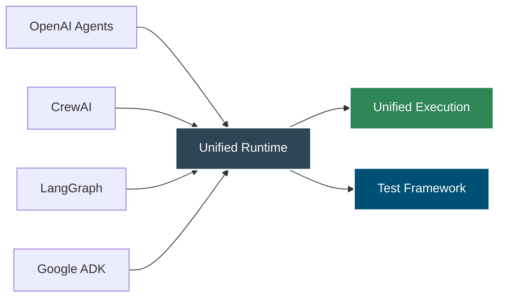
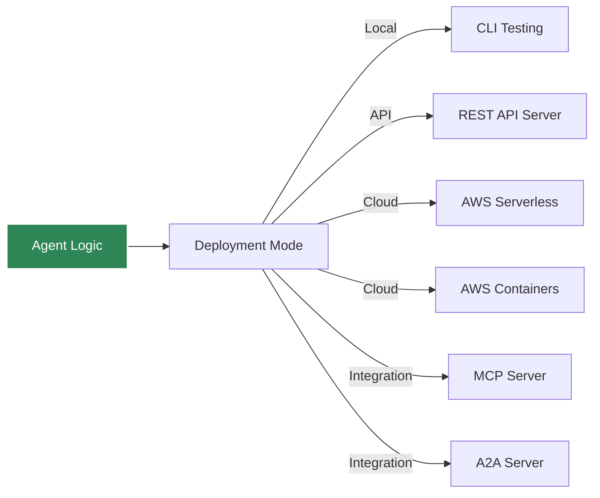

# Introduction to Agent Kernel

Welcome to **Agent Kernel** - a versatile, framework-agnostic runtime for building and deploying AI agents.

## What is Agent Kernel?

Agent Kernel is a lightweight runtime and adapter layer for building and running AI agents across multiple frameworks and running within a unified execution environment. It provides the low level scaffoldings to build, test and deploy your agents (and mcp tools and A2A) quickly in many deployment configurations. Migrate your existing agents to Agent Kernel and instantly utilize pre-built execution and testing capabilities. It eliminates the complexity of framework development allowing AI engineers to focus on Agent development and provides a consistent development experience regardless of the underlying AI agent framework.



## Why Agent Kernel?

### Effortless Migration

Build agents using any AI agentic framework and migrate them to Agent Kernel to benefit from its execution framework capabilities. No need to build a platform code from scratch to run your agents. You can focus on domain-specific Agent development and Agent Kernel takes care of testing, deployment and execution.

### Ready-to-Use Execution

Agent Kernel provides pre-built execution capabilities:
- **CLI Testing Environment** for local development
- **REST API Server** for web integration
- **AWS Serverless Deployment** for scalable production
- **AWS Containerized Deployment** for consistent loads
- **MCP Server** for Model Context Protocol tool publishing
- **A2A Server** for Agent-to-Agent communication

### Pluggable Architecture

Easily extend Agent Kernel with custom framework adapters, memory back-ends, and deployment profiles.

### Enterprise-Ready Features

- **Session Management**: Built-in conversational state tracking
- **Memory Management**: Pluggable memory (Redis, in-memory) storage
- **Traceability**: Track and audit all agent operations
- **Multi-Agent Collaboration**: Leverage multi-agent hierarchies of supported agentic frameworks
- **Agent Testing Capability**: Built in Agent test framework so that you can write automated tests easily

## Key Features

### Unified API

```python
from agentkernel.core import Agent, Runner, Session, Module, Runtime
```

All framework adapters expose the same core abstractions:
- **Agent**: Framework-specific agent wrapped by Agent Kernel
- **Runner**: Framework-specific execution strategy
- **Session**: Shared conversational state
- **Module**: Container for registering agents
- **Runtime**: Global orchestrator

### Multi-Framework Support

Agent Kernel currently supports:

- **OpenAI Agents SDK** - Official OpenAI agents framework
- **CrewAI** - Role-based multi-agent framework
- **LangGraph** - Graph-based agent orchestration
- **Google ADK** - Google's Agent Development Kit

### Flexible Deployment



## Quick Example

Here's a simple agent built with Agent Kernel using CrewAI:

```python
from crewai import Agent as CrewAgent
from agentkernel.cli import CLI
from agentkernel.crewai import CrewAIModule

# Define your agent
agent = CrewAgent(
    role="assistant",
    goal="Help users with their questions",
    backstory="You are a helpful AI assistant",
    verbose=False,
)

# Register with Agent Kernel
CrewAIModule([agent])

# Run with built-in CLI
if __name__ == "__main__":
    CLI.main()
```

You can:
- Test locally with the CLI
- Deploy to AWS Lambda with one line-change
- Expose as a REST API
- Integrate with MCP or A2A protocols

All without changing your agent code!

## Who Should Use Agent Kernel?

Agent Kernel is ideal for:

- **AI Engineers** who want framework flexibility without vendor lock-in
- **Teams** building production AI agent systems
- **Developers** who need to migrate between frameworks
- **Organizations** requiring enterprise-grade agent deployment
- **Researchers** exploring different agent frameworks

## Next Steps

Ready to get started? Here's what to do next:

1. [**Install Agent Kernel**](/docs/installation) - Get up and running in minutes
2. [**Quick Start Guide**](/docs/quick-start) - Build your first agent
3. [**Core Concepts**](/docs/core-concepts/overview) - Understand the architecture
4. [**Framework Integration**](/docs/frameworks/overview) - Choose your framework
5. [**Deployment Guide**](/docs/deployment/overview) - Deploy to production

## Community & Support

- **GitHub**: [yaalalabs/agent-kernel](https://github.com/yaalalabs/agent-kernel)
- **PyPI**: [agentkernel](https://pypi.org/project/agentkernel/)
- **Issues**: [Report bugs or request features](https://github.com/yaalalabs/agent-kernel/issues)
- **Discord**: [Community chat](https://discord.gg/k98XXq3N)

## License

Agent Kernel is released under the MIT License. See the [LICENSE](https://github.com/yaalalabs/agent-kernel/blob/develop/LICENSE) file for details.

---

**Built with ❤️ by [Yaala Labs](https://www.yaalalabs.com/)**
