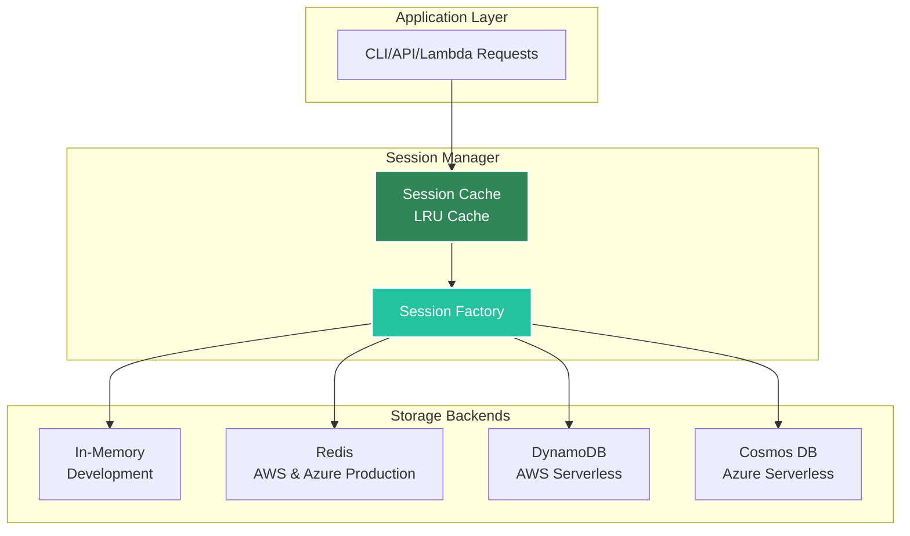
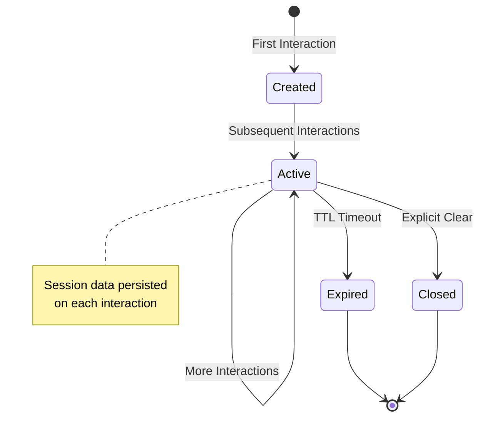

# Session

The **Session** is the core component that manages conversation state across multiple agent interactions, providing memory and context persistence. Sessions enable multi-turn conversations by tracking history and maintaining state between agent invocations.

## Overview



## What is a Session?

A Session:
- **Tracks** conversation history across interactions
- **Persists** state between agent invocations
- **Manages** thread context for multi-turn conversations
- **Supports** multiple storage backends with **multi-cloud support**:
  - In-memory (development)
  - Redis (AWS & Azure production)
  - DynamoDB (AWS serverless)
  - Cosmos DB (Azure serverless)
- **Stores** framework-specific state separately per agent
- **Enables** session-scoped caching and memory management

## Session Lifecycle



## Creating and Managing Sessions

### Automatic Session Management (CLI)

In CLI mode, sessions are automatically created and managed:

```python
from agentkernel.cli import CLI

# CLI automatically creates unique session per user
# Session ID is generated automatically
CLI.main()
```

The CLI creates a unique session ID for each interactive session, maintaining context throughout the conversation.

### API-Controlled Sessions

In API mode, you control session IDs to manage user conversations:

```bash
POST /api/v1/chat
{
  "agent": "assistant",
  "message": "Hello!",
  "session_id": "user-123-conversation-1"
}
```

**Best Practice**: Use descriptive session IDs that identify users and conversations:

```python
# Good - descriptive and unique
session_id = f"user-{user_id}-thread-{thread_id}"
session_id = f"{platform}-{user_id}-{timestamp}"

# Less useful - not descriptive
session_id = "session1"
```

### Programmatic Session Creation (Advanced)

For advanced use cases, create sessions programmatically:

```python
from agentkernel.core import Session

# Create a new session with custom ID
session = Session(id="custom-session-id")

# Use with runner
result = await runner.run(agent, session, prompt)
```

## Storage Backends

Agent Kernel supports three storage backends for session persistence, each optimized for different deployment scenarios.

### In-Memory Storage (Default)

Fast, ephemeral storage suitable for development and testing:

```bash
export AK_SESSION__TYPE=in_memory
```

**Characteristics:**
- ✅ Fastest performance (no I/O)
- ✅ No setup required
- ✅ Perfect for development and testing
- ❌ Sessions lost on restart
- ❌ Single-process only
- ❌ Not suitable for production

**Use When:**
- Local development
- Testing
- Non-critical data
- Single-instance deployments

### Redis Storage (AWS & Azure) {#redis-storage}

Persistent, high-performance storage for production deployments on both AWS and Azure:

```bash
export AK_SESSION__TYPE=redis
export AK_SESSION__REDIS__URL=redis://localhost:6379
export AK_SESSION__REDIS__PASSWORD=your-password
export AK_SESSION__REDIS__TTL=604800  # 7 days in seconds
export AK_SESSION__REDIS__PREFIX=ak:sessions:
```

**Characteristics:**
- ✅ Persistent across restarts
- ✅ High performance (sub-millisecond latency)
- ✅ Supports distributed/multi-process deployments
- ✅ Configurable TTL for automatic cleanup
- ✅ Redis Cluster for high availability
- ✅ **Multi-cloud support**: AWS ElastiCache & Azure Managed Redis
- ✅ Ideal for containerized deployments (ECS/Fargate, Azure Container Apps)

**Use When:**
- Production containerized deployments (AWS or Azure)
- Multi-instance applications
- High-throughput requirements
- Need for sub-millisecond session access

**High Availability Configuration:**
```bash
# Redis Cluster endpoint (AWS ElastiCache or Azure Cache for Redis)
export AK_SESSION__REDIS__URL=redis://cluster-endpoint:6379

# Enable SSL/TLS
export AK_SESSION__REDIS__URL=rediss://secure-endpoint:6380
```

### DynamoDB Storage

Serverless, fully-managed storage for AWS deployments:

```bash
export AK_SESSION__TYPE=dynamodb
export AK_SESSION__DYNAMODB__TABLE_NAME=agent-kernel-sessions
export AK_SESSION__DYNAMODB__TTL=604800  # 7 days (0 to disable)
```

**Characteristics:**
- ✅ Serverless, fully managed by AWS
- ✅ Auto-scaling capacity
- ✅ Multi-AZ replication by default
- ✅ 99.999% availability SLA
- ✅ No infrastructure management
- ✅ Pay-per-use pricing
- ✅ Ideal for Lambda deployments
- ⚠️ Higher latency than Redis (~10-20ms)

**Use When:**
- AWS serverless deployments (Lambda)
- Auto-scaling requirements
- AWS-native infrastructure
- Minimal operational overhead preferred

**Requirements:**
- DynamoDB table with partition key `session_id` (String)
- DynamoDB table with sort key `key` (String)
- Optional: TTL attribute `expiry_time` enabled
- Appropriate IAM permissions

**Note**: Agent Kernel's Terraform modules automatically create the required DynamoDB table with proper configuration.

### Cosmos DB Storage {#cosmosdb-storage}

Serverless, fully-managed storage for Azure deployments:

```bash
export AK_SESSION__TYPE=cosmosdb
export AK_SESSION__COSMOSDB__TABLE_NAME=sessions
export AK_SESSION__COSMOSDB__TABLE_ENDPOINT=https://your-account.documents.azure.com:443/
export AK_SESSION__COSMOSDB__CONNECTION_STRING=AccountEndpoint=https://...;AccountKey=...
export AK_SESSION__COSMOSDB__TTL=604800  # 7 days (0 to disable)
```

**Characteristics:**
- ✅ Serverless, fully managed by Azure
- ✅ Auto-scaling capacity
- ✅ Multi-region replication support
- ✅ 99.999% availability SLA
- ✅ No infrastructure management
- ✅ Pay-per-use pricing
- ✅ Ideal for Azure Functions deployments
- ⚠️ Higher latency than Redis (~10-20ms)

**Use When:**
- Azure serverless deployments (Azure Functions)
- Auto-scaling requirements
- Azure-native infrastructure
- Minimal operational overhead preferred

**Requirements:**
- Cosmos DB table with partition key `/session_id`
- Optional: TTL configured on the table
- Appropriate Azure permissions (connection string or managed identity)

**Note**: Agent Kernel's Terraform modules automatically create the required Cosmos DB resources with proper configuration.

### Session Caching (Redis, DynamoDB & Cosmos DB)

Redis, DynamoDB, and Cosmos DB backends all support optional in-memory session caching for improved performance:

```bash
# Enable in-memory session caching with LRU eviction
export AK_SESSION__CACHE__SIZE=256
```

**How It Works:**
- Sessions are cached in memory using LRU (Least Recently Used) eviction
- Subsequent accesses to cached sessions avoid backend I/O
- Session data is still persisted to backend after each interaction
- Cache is process-local (not shared across instances)

**Performance Benefits:**
- Eliminates backend round-trips for cached sessions
- Reduces latency for frequent session access
- Lowers backend costs (DynamoDB RCU/WCU)

**Important Limitation:**
When session caching is enabled, session data is **not reloaded from storage** while in cache. This means:
- ⚠️ All requests for the same session should route to the same runtime instance
- ⚠️ Not suitable for round-robin load balancing without sticky sessions
- ✅ Works well with consistent hashing or session-affinity load balancing

**Recommendation**: Enable session caching when using sticky sessions or single-instance deployments. Disable for true stateless, multi-instance deployments.

## How Sessions Work

### Session Data Storage

Sessions store framework-specific conversation state separately for each agent:

```python
# Framework adapters automatically manage session data
# You don't need to manually set these - shown for illustration

# OpenAI Swarm stores thread information
session.set("openai_assistant_session", openai_thread_obj)

# LangGraph stores graph state
session.set("langgraph_state", graph_checkpoint)

# CrewAI stores crew context
session.set("crewai_context", crew_state)

# Access session data (advanced usage)
openai_session = session.get("openai_assistant_session")
```

**Key Points:**
- Each framework adapter manages its own session data
- Session keys are framework-specific
- Multiple agents can share the same session
- Session data is automatically persisted to the configured backend

### Multi-Agent Sessions

Sessions can track multiple agents within the same conversation:

```python
# Same session, different agents
session = Session(id="user-123")

# Agent 1 execution
result1 = await agent1.runner.run(agent1, session, "First question")
# Stores: session.set("agent1_framework_session", ...)

# Agent 2 execution (same session)
result2 = await agent2.runner.run(agent2, session, "Second question")
# Stores: session.set("agent2_framework_session", ...)

# Both agents share the same session container
# But maintain separate framework-specific state
```

This enables complex multi-agent workflows where different agents can collaborate within a single user conversation.

### Thread Management

Sessions support multi-threaded conversations per user:

```python
# Each conversation thread gets a unique session
user_id = "user-123"
thread_id = "thread-456"
session_id = f"{user_id}-{thread_id}"

session = Session(id=session_id)

# Conversation history maintained per thread
# Different threads remain isolated
```

**Use Cases:**
- Multiple simultaneous conversations per user
- Topic-based conversation organization
- Isolated testing environments

### Execution Hooks and Sessions

[Execution hooks](/docs/integrations/hooks) have full access to session state:

```python
from agentkernel import PreHook

class RAGHook(PreHook):
    async def on_run(self, session, agent, requests):
        # Access session data
        user_prefs = session.get("user_preferences")
        
        # Use volatile cache for temporary data
        v_cache = session.get_volatile_cache()
        rag_context = v_cache.get("rag_context")
        
        # Modify requests based on session state
        return modified_requests
    
    def name(self):
        return "RAGHook"
```

Hooks can:
- Read and modify session state
- Access both volatile and non-volatile caches
- Store intermediate data for the request lifecycle

[Learn more about execution hooks →](/docs/integrations/hooks)

## Configuration Reference

Configure session behavior via environment variables or configuration files.

### Environment Variables

```bash
# ============================================
# Storage Type Selection (Multi-Cloud)
# ============================================
export AK_SESSION__TYPE=redis  # Options: 'in_memory', 'redis', 'dynamodb' (AWS), 'cosmosdb' (Azure)

# ============================================
# Redis Configuration (AWS & Azure)
# ============================================
export AK_SESSION__REDIS__URL=redis://localhost:6379
export AK_SESSION__REDIS__PASSWORD=your-password
export AK_SESSION__REDIS__TTL=604800  # 7 days in seconds
export AK_SESSION__REDIS__PREFIX=ak:sessions:

# ============================================
# DynamoDB Configuration (AWS)
# ============================================
export AK_SESSION__DYNAMODB__TABLE_NAME=agent-kernel-sessions
export AK_SESSION__DYNAMODB__TTL=604800  # 7 days (0 to disable)

# ============================================
# Cosmos DB Configuration (Azure)
# ============================================
export AK_SESSION__COSMOSDB__TABLE_NAME=sessions
export AK_SESSION__COSMOSDB__TABLE_ENDPOINT=https://your-account.documents.azure.com:443/
export AK_SESSION__COSMOSDB__CONNECTION_STRING=AccountEndpoint=https://...;AccountKey=...
export AK_SESSION__COSMOSDB__TTL=604800  # 7 days (0 to disable)

# ============================================
# Session Caching (Redis, DynamoDB & Cosmos DB)
# ============================================
export AK_SESSION__CACHE__SIZE=256  # Number of sessions to cache (0 to disable)
```

### Configuration File (config.yaml)

```yaml
session:
  type: redis  # or 'in_memory' or 'dynamodb'
  
  redis:
    url: redis://localhost:6379
    password: your-password
    ttl: 604800  # 7 days in seconds
    prefix: "ak:sessions:"
  
  dynamodb:
    table_name: agent-kernel-sessions
    ttl: 604800  # 7 days in seconds (0 to disable)
  
  cosmosdb:
    table_name: sessions
    table_endpoint: https://your-account.documents.azure.com:443/
    connection_string: AccountEndpoint=https://...;AccountKey=...
    ttl: 604800  # 7 days in seconds (0 to disable)
  
  cache:
    size: 256  # Enable caching (0 to disable)
```

### Deployment-Specific Recommendations (Multi-Cloud)

**Local Development:**
```bash
export AK_SESSION__TYPE=in_memory
```

**Containerized Production:**

*AWS (ECS/Fargate):*
```bash
export AK_SESSION__TYPE=redis
export AK_SESSION__REDIS__URL=redis://elasticache-endpoint:6379
export AK_SESSION__CACHE__SIZE=256  # Enable with sticky sessions
```

*Azure (Container Apps):*
```bash
export AK_SESSION__TYPE=redis
export AK_SESSION__REDIS__URL=redis://azure-redis-endpoint:6379
export AK_SESSION__CACHE__SIZE=256  # Enable with sticky sessions
```

**Serverless Deployments:**

*AWS Lambda:*
```bash
export AK_SESSION__TYPE=dynamodb
export AK_SESSION__DYNAMODB__TABLE_NAME=agent-kernel-sessions
export AK_SESSION__DYNAMODB__TTL=604800
# Caching not recommended for Lambda (stateless invocations)
```

*Azure Functions:*
```bash
export AK_SESSION__TYPE=cosmosdb
export AK_SESSION__COSMOSDB__TABLE_NAME=sessions
export AK_SESSION__COSMOSDB__TABLE_ENDPOINT=https://your-account.documents.azure.com:443/
export AK_SESSION__COSMOSDB__CONNECTION_STRING=AccountEndpoint=https://...;AccountKey=...
export AK_SESSION__COSMOSDB__TTL=604800
# Caching not recommended for Azure Functions (stateless invocations)
```

[See deployment guides for detailed configuration →](/docs/deployment/overview)

## Best Practices

### Use Descriptive Session IDs

Create meaningful, unique session identifiers:

```python
# ✅ Good - descriptive and unique
session_id = f"user-{user_id}-conversation-{conv_id}"
session_id = f"{platform}-{user_id}-{timestamp}"
session_id = f"test-{test_name}-{run_id}"

# ❌ Less useful - not descriptive
session_id = "session1"
session_id = "abc123"
```

### Configure Appropriate TTL

Set Time-To-Live based on your use case:

```python
# Short-lived sessions (interactive chat)
export AK_SESSION__REDIS__TTL=3600  # 1 hour

# Medium-lived sessions (customer support)
export AK_SESSION__REDIS__TTL=86400  # 24 hours

# Long-lived sessions (ongoing projects)
export AK_SESSION__REDIS__TTL=604800  # 7 days
```

**Note**: TTL is automatically refreshed on each interaction.

### Let Framework Adapters Handle Context

Don't manually manage conversation history - framework adapters handle this automatically:

```python
# ✅ Correct - let the runner handle context
result = await runner.run(agent, session, new_prompt)
# Runner automatically includes previous context from session

# ❌ Don't do this - manual context management
history = session.get("manual_history") or []
history.append(new_prompt)
session.set("manual_history", history)
```

### Session Cleanup

Sessions automatically expire based on TTL configuration. For manual cleanup:

```python
# Clear session data while preserving session ID
session.clear()

# For complete removal (advanced usage)
from agentkernel.core import Runtime
runtime = Runtime.get()
runtime.session_manager.delete_session(session_id)
```

### Production Recommendations

**For High Availability:**
- Use Redis Cluster or DynamoDB
- Enable multi-AZ deployment
- Configure appropriate TTL for automatic cleanup
- Monitor session storage size

**For Performance:**
- Enable session caching with sticky sessions
- Use Redis for low-latency requirements
- Use DynamoDB for serverless simplicity

**For Cost Optimization:**
- Set appropriate TTL to avoid stale session accumulation
- Use DynamoDB on-demand pricing for variable workloads
- Monitor and adjust cache size based on actual usage

## Advanced Usage

### Custom Session Data

Store application-specific metadata alongside framework state:

```python
# Store custom data
session.set("user_preferences", {"language": "en", "theme": "dark"})
session.set("conversation_topic", "mathematics")
session.set("user_context", {"role": "student", "level": "advanced"})

# Retrieve later
prefs = session.get("user_preferences")
topic = session.get("conversation_topic")
```

**Use Cases:**
- User preferences and settings
- Conversation metadata
- Application-specific state
- Custom analytics data

### Session Inspection and Debugging

Debug session contents during development:

```python
# List all keys in session
keys = session.get_all_keys()
for key in keys:
    value = session.get(key)
    print(f"{key}: {value}")

# Check if key exists
if session.has_key("user_preferences"):
    prefs = session.get("user_preferences")
```

### Session Clearing

Remove all session data while preserving the session ID:

```python
# Clear all data from session
session.clear()

# Session ID remains the same
# Next interaction starts fresh context
```

**When to Use:**
- User requests to start over
- Switching conversation topics
- Resetting agent state
- Testing and development

### Direct Session Manager Access (Advanced)

For advanced scenarios, access the session manager directly:

```python
from agentkernel.core import Runtime

runtime = Runtime.get()
session_manager = runtime.session_manager

# Get or create session
session = session_manager.get_or_create_session("custom-id")

# Delete session completely
session_manager.delete_session("custom-id")

# Check session existence
exists = session_manager.has_session("custom-id")
```

**Caution**: Direct session manager manipulation bypasses normal session lifecycle. Use only when necessary.

## Summary

Sessions are the foundation of conversational AI in Agent Kernel:

- **Automatic Management**: Sessions are created and managed automatically in CLI and API modes
- **Multi-Backend Support**: Choose between in-memory (dev), Redis (production), or DynamoDB (serverless)
- **Framework Agnostic**: Works seamlessly with OpenAI, CrewAI, LangGraph, ADK
- **State Persistence**: Conversation history and context maintained across interactions
- **Flexible Storage**: TTL-based expiration, caching, and high-availability options
- **Production Ready**: Designed for distributed, fault-tolerant deployments

**Quick Reference:**

| Feature | In-Memory | Redis | DynamoDB |
|---------|-----------|-------|----------|
| **Persistence** | ❌ Lost on restart | ✅ Persistent | ✅ Persistent |
| **Multi-Process** | ❌ Single process | ✅ Distributed | ✅ Distributed |
| **Performance** | ⚡ Fastest | ⚡ Sub-millisecond | 🔄 ~10-20ms |
| **Setup** | ✅ None required | 🔧 Redis server | 🔧 AWS account |
| **Best For** | Development | Containerized prod | Serverless |
| **Caching** | N/A | ✅ Optional | ✅ Optional |

## Related Documentation

- **[Memory Management](/docs/architecture/memory-management)** - Advanced caching and auxiliary memory features
- **[Execution Hooks](/docs/integrations/hooks)** - Access and modify session state in hooks
- **[Configuration](/docs/core-concepts/configuration)** - Complete configuration reference
- **[Fault Tolerance](/docs/core-concepts/fault-tolerance)** - Session resilience and recovery
- **[AWS Serverless Deployment](/docs/deployment/aws-serverless)** - DynamoDB session configuration
- **[AWS Containerized Deployment](/docs/deployment/aws-containerized)** - Redis session configuration

## Next Steps

- [Module Organization](./module)
- [Runtime Orchestration](./runtime)
- [Memory Management](../architecture/memory-management)
- [Deployment Configuration](./configuration)
