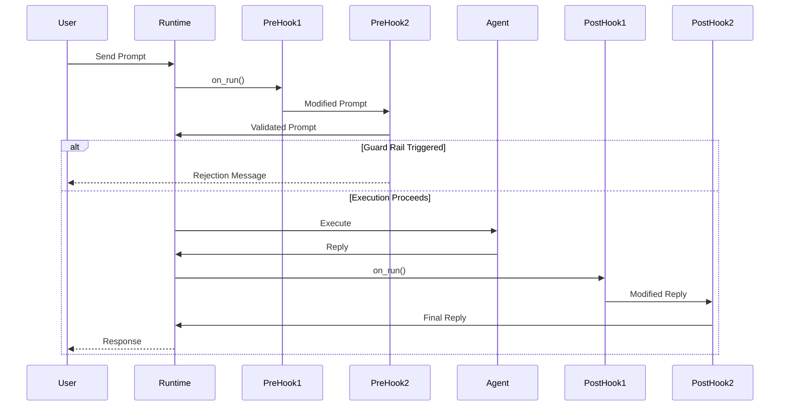

# Execution Hooks

Execution hooks provide powerful extension points to customize and enhance agent behavior at runtime. Agent Kernel supports **pre-execution hooks** and **post-execution hooks** that allow you to modify prompts, inject context, validate inputs, and transform responses.

## Overview

Hooks enable you to:

- **Inject Context**: Add RAG (Retrieval-Augmented Generation) context to prompts
- **Validate Input**: Implement guardrails to filter inappropriate content
- **Modify Responses**: Transform or enrich agent replies
- **Logging & Analytics**: Track execution patterns and user interactions
- **Content Moderation**: Apply safety filters to inputs and outputs



:::info Current Limitation
Hooks currently execute only for the **initial user prompt** to the first agent. Agent-to-agent handoffs within workflows are not yet instrumented. This limitation will be addressed in a future release.
:::

## Hook Types

### Pre-Execution Hooks (Prehook)

Pre-execution hooks run **before** an agent processes a prompt. They can:
- Modify the prompt
- Inject additional context
- Validate input
- **Halt execution** and return early with a custom message

**Use Cases:**
- RAG context injection
- Input guardrails and content filtering
- Prompt validation
- User authentication/authorization
- Request logging and analytics

:::info Passing additional context to PreHooks
The built in REST and Lambda servers automatically packs any properties in the request body, other than ["session_id", "prompt", "agent"] as AgentRequestAny objects (with the key name). 
These will be passed to PreHooks and will be ignored by the LLM agents

A complete example is provided [here](https://github.com/yaalalabs/agent-kernel/tree/develop/examples/api/openai)
:::

### Post-Execution Hooks (Posthook)

Post-execution hooks run **after** an agent generates a response. They can:
- Modify the agent's reply
- Add disclaimers or additional information
- Apply content moderation to outputs
- Log responses for analytics

**Use Cases:**
- Output guardrails and safety filters
- Adding disclaimers or compliance messages
- Response formatting
- Sentiment analysis
- Response logging and analytics

## Implementing Hooks

### Pre-Execution Hook

Create a class that inherits from `Prehook` and implements the required methods:

```python
from agentkernel import Prehook, Agent, Session
from agentkernel.core.model import AgentRequest, AgentReply, AgentRequestText, AgentReplyText

class MyPrehook(Prehook):
    async def on_run(
        self, 
        session: Session, 
        agent: Agent, 
        requests: list[AgentRequest]
    ) -> list[AgentRequest] | AgentReply:
        """
        Process the requests before agent execution.
        
        :param session: The current session instance
        :param agent: The agent that will execute the requests
        :param requests: List of requests to the agent (can include text, files, images, etc.)
        :return: AgentReply: If the hook decides to halt execution, return an AgentReply
                 list[AgentRequest]: The modified requests or original list. You can modify in place
                                     or add additional content (e.g., files, images, RAG context)
        """
        # Your logic here - example: pass through unchanged
        return requests
    
    def name(self) -> str:
        """Return the hook name for logging/debugging."""
        return "MyPrehook"
```

### Post-Execution Hook

Create a class that inherits from `Posthook`:

```python
from agentkernel import Posthook, Agent, Session
from agentkernel.core.model import AgentRequest, AgentReply, AgentReplyText

class MyPosthook(Posthook):
    async def on_run(
        self,
        session: Session,
        requests: list[AgentRequest],
        agent: Agent,
        agent_reply: AgentReply
    ) -> AgentReply:
        """
        Process the agent's reply after execution.
        
        :param session: The current session instance
        :param requests: The original requests provided to the agent after pre-hooks
        :param agent: The agent that executed the requests
        :param agent_reply: The reply from the agent. For the first posthook, this is 
                           the unmodified agent reply. For subsequent posthooks, this is 
                           the reply modified by previous posthooks in the chain.
        :return: AgentReply: The modified reply (or original if no changes)
        """
        # Your logic here
        return agent_reply  # Return original reply
    
    def name(self) -> str:
        """Return the hook name for logging/debugging."""
        return "MyPosthook"
```

## Registering Hooks

Hooks are registered per agent using the runtime instance:

```python
from agentkernel.core import GlobalRuntime

# Get the runtime instance
runtime = GlobalRuntime.instance()

# Register pre-execution hooks (executed in order)
runtime.register_pre_hooks("agent_name", [
    RAGHook(),
    GuardRailHook(),
])

# Register post-execution hooks (executed in order)
runtime.register_post_hooks("agent_name", [
    ModerationHook(),
    DisclaimerHook(),
])
```

### Hook Execution Order

Hooks execute in the order they are registered:

```python
runtime.register_pre_hooks("assistant", [Hook1(), Hook2(), Hook3()])
```

**Execution flow:** `Hook1 → Hook2 → Hook3 → Agent`

Each hook receives the prompt **modified by the previous hook**, creating a processing chain.

### Modifying Hook Order

To change the execution order, provide a new list:

```python
# Get existing hooks
existing_hooks = runtime.get_pre_hooks("agent_name")

# Rearrange or filter
new_order = [existing_hooks[2], existing_hooks[0]]

# Re-register with new order
runtime.register_pre_hooks("agent_name", new_order)
```

## Common Patterns

### Pattern 1: Guard Rail Hook

Validate input and block inappropriate content:

```python
from agentkernel import Prehook
from agentkernel.core.model import AgentRequest, AgentRequestText, AgentReplyText

class GuardRailHook(Prehook):
    BLOCKED_KEYWORDS = ["hack", "illegal", "malware"]
    
    async def on_run(self, session, agent, requests):
        # Extract text from first request (assuming single text request)
        if requests and isinstance(requests[0], AgentRequestText):
            prompt = requests[0].text
        else:
            return requests  # No text to validate
        
        prompt_lower = prompt.lower()
        
        # Check for blocked content
        for keyword in self.BLOCKED_KEYWORDS:
            if keyword in prompt_lower:
                # Halt execution and return rejection message
                return AgentReplyText(
                    text=f"I cannot assist with requests related to '{keyword}'. "
                         "Please ask a different question."
                )
        
        # Prompt is safe - continue with execution
        return requests
    
    def name(self):
        return "GuardRailHook"
```

### Pattern 2: RAG Context Injection

Enrich prompts with relevant context from a knowledge base:

```python
from agentkernel import Prehook
from agentkernel.core.model import AgentRequestText

class RAGHook(Prehook):
    def __init__(self, knowledge_base):
        self.knowledge_base = knowledge_base
    
    async def on_run(self, session, agent, requests):
        # Extract text from first request (assuming single text request)
        if requests and isinstance(requests[0], AgentRequestText):
            prompt = requests[0].text
        else:
            return requests  # No text to enrich
        
        # Search knowledge base for relevant context
        context = self.knowledge_base.search(prompt)
        
        if context:
            # Inject context into prompt
            enriched_prompt = f"""Context:
{context}

Question: {prompt}

Please answer the question using the provided context."""
            return [AgentRequestText(text=enriched_prompt)]
        
        # No relevant context found - return original
        return requests
    
    def name(self):
        return "RAGHook"
```

### Pattern 3: Response Moderation

Apply safety filters to agent responses:

```python
from agentkernel import Posthook
from agentkernel.core.model import AgentReplyText

class ModerationHook(Posthook):
    async def on_run(self, session, requests, agent, agent_reply):
        # Extract text from reply
        if isinstance(agent_reply, AgentReplyText):
            reply_text = agent_reply.text
        else:
            return agent_reply  # Can't moderate non-text replies
        
        # Check reply for inappropriate content
        if self._contains_sensitive_info(reply_text):
            return AgentReplyText(
                text="I apologize, but I cannot provide that information. "
                     "Please rephrase your question."
            )
        
        return agent_reply
    
    def _contains_sensitive_info(self, text):
        # Your moderation logic
        return False
    
    def name(self):
        return "ModerationHook"
```

### Pattern 4: Adding Disclaimers

Append legal or compliance disclaimers to responses:

```python
from agentkernel import Posthook
from agentkernel.core.model import AgentReplyText

class DisclaimerHook(Posthook):
    async def on_run(self, session, requests, agent, agent_reply):
        disclaimer = (
            "\n\n---\n"
            "*Disclaimer: This information is for general guidance only "
            "and should not be considered professional advice.*"
        )
        
        # Add disclaimer to text replies
        if isinstance(agent_reply, AgentReplyText):
            return AgentReplyText(text=agent_reply.text + disclaimer)
        
        return agent_reply
    
    def name(self):
        return "DisclaimerHook"
```

### Pattern 5: Logging and Analytics

Track user interactions and agent performance:

```python
from agentkernel import Prehook
from agentkernel.core.model import AgentRequestText
from datetime import datetime

class AnalyticsHook(Prehook):
    def __init__(self, logger):
        self.logger = logger
    
    async def on_run(self, session, agent, requests):
        # Extract text for logging (if available)
        prompt_text = None
        if requests and isinstance(requests[0], AgentRequestText):
            prompt_text = requests[0].text
        
        # Log the interaction
        self.logger.log({
            "session_id": session.id,
            "agent": agent.name,
            "prompt": prompt_text,
            "timestamp": datetime.now(),
        })
        
        # Pass through without modification
        return requests
    
    def name(self):
        return "AnalyticsHook"
```

## Best Practices

### 1. Keep Hooks Focused

Each hook should have a single, well-defined responsibility:

```python
# ✅ Good: Focused hooks
runtime.register_pre_hooks("agent", [
    RAGHook(),          # Only does context injection
    GuardRailHook(),    # Only does validation
    LoggingHook(),      # Only does logging
])

# ❌ Bad: Monolithic hook doing everything
runtime.register_pre_hooks("agent", [
    DoEverythingHook(),  # RAG + validation + logging
])
```

### 2. Order Matters

Place hooks in logical order based on dependencies:

```python
# ✅ Correct order: Enrich first, then validate
runtime.register_pre_hooks("agent", [
    RAGHook(),         # Add context first
    GuardRailHook(),   # Then validate enriched prompt
])

# ❌ Wrong order: Validation happens before enrichment
runtime.register_pre_hooks("agent", [
    GuardRailHook(),   # Validates before context added
    RAGHook(),         # Context added after validation
])
```

### 3. Handle Errors Gracefully

Hooks should not crash - handle errors and return sensible defaults:

```python
from agentkernel import Prehook
from agentkernel.core.model import AgentRequestText

class RobustRAGHook(Prehook):
    async def on_run(self, session, agent, requests):
        # Extract text from first request
        if requests and isinstance(requests[0], AgentRequestText):
            prompt = requests[0].text
        else:
            return requests
        
        try:
            context = self.knowledge_base.search(prompt)
            if context:
                enriched = self._enrich_prompt(prompt, context)
                return [AgentRequestText(text=enriched)]
        except Exception as e:
            # Log error but don't crash
            self.logger.error(f"RAG lookup failed: {e}")
        
        # Fallback to original requests
        return requests
    
    def name(self):
        return "RobustRAGHook"
```

### 4. Optimize Performance

Hooks execute on every request - keep them fast:

```python
from agentkernel import Prehook
from agentkernel.core.model import AgentRequestText
from functools import lru_cache

class OptimizedRAGHook(Prehook):
    def __init__(self, vector_store):
        self.vector_store = vector_store
        self.cache = {}  # Simple cache (consider LRU in production)
    
    async def on_run(self, session, agent, requests):
        # Extract text from first request
        if requests and isinstance(requests[0], AgentRequestText):
            prompt = requests[0].text
        else:
            return requests
        
        # Check cache first
        cache_key = hash(prompt)
        if cache_key in self.cache:
            return [AgentRequestText(text=self.cache[cache_key])]
        
        # Perform lookup
        enriched = self._do_rag(prompt)
        self.cache[cache_key] = enriched
        
        return [AgentRequestText(text=enriched)]
    
    def name(self):
        return "OptimizedRAGHook"
```

### 5. Make Hooks Configurable

Allow hooks to be customized without code changes:

```python
from agentkernel import Prehook
from agentkernel.core.model import AgentRequestText, AgentReplyText

class ConfigurableGuardRailHook(Prehook):
    def __init__(self, blocked_keywords=None, max_length=5000):
        self.blocked_keywords = blocked_keywords or []
        self.max_length = max_length
    
    async def on_run(self, session, agent, requests):
        # Extract text from first request
        if requests and isinstance(requests[0], AgentRequestText):
            prompt = requests[0].text
        else:
            return requests
        
        # Validate based on configuration
        if len(prompt) > self.max_length:
            return AgentReplyText(text=f"Input too long (max {self.max_length} chars)")
        
        for keyword in self.blocked_keywords:
            if keyword in prompt.lower():
                return AgentReplyText(text=f"Cannot process requests about '{keyword}'")
        
        return requests
    
    def name(self):
        return "ConfigurableGuardRailHook"
```

### 6. Leverage Async Operations

Hook methods are async, allowing you to perform I/O operations efficiently:

```python
from agentkernel import Prehook
from agentkernel.core.model import AgentRequestText

class AsyncRAGHook(Prehook):
    def __init__(self, vector_store, embeddings_api):
        self.vector_store = vector_store
        self.embeddings_api = embeddings_api
    
    async def on_run(self, session, agent, requests):
        # Extract text from first request
        if requests and isinstance(requests[0], AgentRequestText):
            prompt = requests[0].text
        else:
            return requests
        
        # Perform async operations
        embedding = await self.embeddings_api.embed(prompt)
        results = await self.vector_store.search(embedding, top_k=3)
        
        if results:
            context = "\n".join([r.text for r in results])
            enriched = f"Context:\n{context}\n\nQuestion: {prompt}"
            return [AgentRequestText(text=enriched)]
        
        return requests
    
    def name(self):
        return "AsyncRAGHook"
```

**Async Operations You Can Perform:**
- Vector database queries
- API calls to external services
- Database lookups
- File I/O operations
- HTTP requests for content moderation APIs

## Complete Example

Here's a full example combining multiple hooks:

```python
from agentkernel.api import RESTAPI
from agentkernel.openai import OpenAIModule
from agentkernel import GlobalRuntime
from agentkernel import Prehook, Posthook
from agents import Agent

# Define hooks
from agentkernel.core.model import AgentRequestText, AgentReplyText

class RAGHook(Prehook):
    async def on_run(self, session, agent, requests):
        # Extract text from first request
        if requests and isinstance(requests[0], AgentRequestText):
            prompt = requests[0].text
        else:
            return requests
        
        # Simulate knowledge base lookup
        context = self._search_knowledge_base(prompt)
        if context:
            enriched = f"Context: {context}\n\nQuestion: {prompt}"
            return [AgentRequestText(text=enriched)]
        return requests
    
    def _search_knowledge_base(self, query):
        # Your RAG implementation
        return None
    
    def name(self):
        return "RAGHook"

class GuardRailHook(Prehook):
    BLOCKED = ["hack", "illegal", "malware"]
    
    async def on_run(self, session, agent, requests):
        # Extract text from first request
        if requests and isinstance(requests[0], AgentRequestText):
            prompt = requests[0].text
        else:
            return requests
        
        for keyword in self.BLOCKED:
            if keyword in prompt.lower():
                return AgentReplyText(text=f"Cannot assist with '{keyword}'")
        return requests
    
    def name(self):
        return "GuardRailHook"

class DisclaimerHook(Posthook):   
    async def on_run(self, session, requests, agent, agent_reply):
        if isinstance(agent_reply, AgentReplyText):
            return AgentReplyText(text=agent_reply.text + "\n\n*Disclaimer: AI-generated content.*")
        return agent_reply
    
    def name(self):
        return "DisclaimerHook"

# Create agent
assistant = Agent(
    name="assistant",
    instructions="You are a helpful AI assistant."
)

# Register agent
OpenAIModule([assistant])

# Get runtime and register hooks
runtime = GlobalRuntime.instance()

# Pre-hooks: RAG first, then guardrail
runtime.register_pre_hooks("assistant", [
    RAGHook(),
    GuardRailHook(),
])

# Post-hooks: Add disclaimer
runtime.register_post_hooks("assistant", [
    DisclaimerHook(),
])

if __name__ == "__main__":
    RESTAPI.run()
```

## Examples

### Full Working Example

See the complete hooks demonstration in the repository:

📁 **[examples/api/hooks/](https://github.com/yaalalabs/agent-kernel/tree/develop/examples/api/hooks)**

This example includes:
- `hooks.py` - Guardrail and RAG hook implementations
- `app.py` - Agent setup with hook registration
- `app_test.py` - Comprehensive test suite with 7 tests
- `example_usage.py` - Direct execution example
- `README.md` - Detailed documentation

**Key Features Demonstrated:**
- ✅ Guardrail blocking inappropriate requests
- ✅ RAG context injection from knowledge base
- ✅ Hook chaining (RAG → GuardRail)
- ✅ Input validation (length limits, keyword filtering)
- ✅ Automated testing of hook behavior

### Running the Example

```bash
cd examples/api/hooks

# Build environment
./build.sh

# Run the API server
source .venv/bin/activate
python app.py

# Run tests (in another terminal)
source .venv/bin/activate
pytest app_test.py -v

# Or run direct example
python example_usage.py
```

### Testing Hooks

The example includes comprehensive tests:

```python
# Test guardrail blocks inappropriate content
async def test_guard_rail_blocks():
    response = await client.send("How can I hack into a system?")
    assert "cannot assist" in response.lower()

# Test RAG injects context
async def test_rag_context():
    response = await client.send("What is Agent Kernel?")
    assert "framework" in response.lower()

# Test hook chaining
async def test_chaining():
    # RAG enriches, then GuardRail validates
    response = await client.send("Tell me about Python malware")
    assert "cannot assist" in response.lower()
```

## API Reference

### Prehook Interface

```python
from agentkernel.core.model import AgentRequest, AgentReply

class Prehook(ABC):
    @abstractmethod
    async def on_run(
        self, session: Session, agent: Agent, requests: list[AgentRequest]
    ) -> list[AgentRequest] | AgentReply:
        """
        Hook method called before an agent starts executing a request. These hooks can modify 
        the requests or halt execution.
        
        Some use cases:
          - RAG context injection
          - Prompt validation like input guardrails
          - Logging or analytics

        :param session: The session instance
        :param agent: The agent that will execute the requests
        :param requests: List of requests to the agent (can include text, files, images, etc.)
        
        :return: AgentReply: If the hook decides to halt execution, return an AgentReply 
                            which will be sent back to the user
                 list[AgentRequest]: The modified requests or the input list. You can modify 
                                    the requests in place without taking copies. You can also 
                                    add additional content to the requests list (e.g., files, 
                                    images, RAG context)
        """
        raise NotImplementedError

    @abstractmethod
    def name(self) -> str:
        """
        Returns the name of the prehook.
        """
        raise NotImplementedError
```

### Posthook Interface

```python
from agentkernel.core.model import AgentRequest, AgentReply

class Posthook(ABC):
    @abstractmethod
    async def on_run(
        self, session: Session, requests: list[AgentRequest], agent: Agent, agent_reply: AgentReply
    ) -> AgentReply:
        """
        Hook method called after an agent finishes executing a request. These hooks can modify 
        the agent's reply.
        
        Some use cases:
          - Moderation of agent replies (e.g., output guardrails)
          - Adding disclaimers or additional information to the reply
          - Logging or analytics

        Note: If the hook changes the reply, the modified reply will be sent to the next hook 
              for processing.

        :param session: The session instance
        :param requests: The original requests provided to the agent after any pre-execution 
                        hooks have been applied
        :param agent: The agent that executed the requests
        :param agent_reply: The reply to process. For the first posthook, this is the unmodified
                           agent reply. For subsequent posthooks, this is the reply modified by
                           previous posthooks in the chain.

        :return: The modified reply. If not modified, return the current reply.
        """
        raise NotImplementedError

    @abstractmethod
    def name(self) -> str:
        """
        :return: the name of the posthook.
        """
        raise NotImplementedError
```

### Runtime Hook Methods

```python
# Register pre-execution hooks
runtime.register_pre_hooks(
    agent_name: str,
    hooks: list[Prehook]
) -> None

# Register post-execution hooks
runtime.register_post_hooks(
    agent_name: str,
    hooks: list[Posthook]
) -> None

# Get registered pre-execution hooks
runtime.get_pre_hooks(
    agent_name: str
) -> list[Prehook]

# Get registered post-execution hooks
runtime.get_post_hooks(
    agent_name: str
) -> list[Posthook]
```

## Troubleshooting

### Hook Not Executing

**Problem:** Hook is registered but not being called.

**Solutions:**
1. Verify agent name matches exactly: `runtime.register_pre_hooks("exact_agent_name", [...])`
2. Check that agent is registered before hooks: `runtime.agents()["agent_name"]`
3. Ensure you're using the correct runtime instance: `GlobalRuntime.instance()`

### Hook Halts All Execution

**Problem:** Pre-hook returns `False` but you want execution to continue.

**Solution:** Return `True` as the first element of the tuple:

```python
# ❌ Wrong: Halts execution
return AgentReplyText(text="Execution halted")

# ✅ Correct: Continues execution
return requests  # or modified requests list
```

### Modified Prompt Not Used

**Problem:** Hook modifies prompt but agent uses original.

**Solution:** Ensure you're returning the modified prompt:

```python
# ❌ Wrong: Returns original
async def on_run(self, session, agent, requests):
    if requests and isinstance(requests[0], AgentRequestText):
        prompt = requests[0].text
        enriched = f"Context: {context}\n{prompt}"
    return requests  # Returns original!

# ✅ Correct: Returns modified
async def on_run(self, session, agent, requests):
    if requests and isinstance(requests[0], AgentRequestText):
        prompt = requests[0].text
        enriched = f"Context: {context}\n{prompt}"
        return [AgentRequestText(text=enriched)]  # Returns modified
```

### Hooks Executing in Wrong Order

**Problem:** Hooks run in unexpected order.

**Solution:** Check registration order - hooks execute in list order:

```python
# This order: RAG → GuardRail
runtime.register_pre_hooks("agent", [RAGHook(), GuardRailHook()])

# This order: GuardRail → RAG (different!)
runtime.register_pre_hooks("agent", [GuardRailHook(), RAGHook()])
```

## Related Documentation

- [Core Concepts: Runtime](../core-concepts/runtime.md) - Runtime orchestration and agent management
- [Core Concepts: Session](../core-concepts/session.md) - Session management and state
- [Testing](../testing/overview.md) - Testing strategies for agents with hooks
- [Traceability and Observability](../advanced/traceability.md) - Monitoring hook execution

## Limitations

### Current Limitations

1. **Agent Handoffs**: Hooks only execute for the initial user prompt. Agent-to-agent handoffs within workflows are not instrumented.
   - **Workaround**: Implement workflow-level hooks in your agent orchestration logic
   - **Future**: Full workflow instrumentation planned for future release

2. **Hook State**: Hooks are stateless across executions (unless you implement state management)
   - **Workaround**: Use session storage for maintaining state across requests

### Async Support

**All hook methods are now async** (`async def`). This allows hooks to perform asynchronous operations like:
- Database queries
- API calls to external services
- Vector database searches for RAG
- Async logging operations

```python
class AsyncRAGHook(Prehook):
    async def on_run(self, session, agent, original_prompt, prompt, additional_context=None):
        # Can now use async operations
        context = await self.vector_db.search(prompt)
        return True, self._enrich(prompt, context)
```

### Planned Enhancements

- Agent-to-agent handoff instrumentation
- Hook middleware framework
- Built-in hook library (common patterns)
- Hook performance metrics

## Summary

Execution hooks provide powerful extension points for:
- ✅ Input validation and guardrails
- ✅ Context injection (RAG)
- ✅ Response moderation and transformation
- ✅ Logging and analytics
- ✅ Custom business logic

**Key Takeaways:**
- Pre-hooks run before execution and can halt processing
- Post-hooks run after execution and modify responses
- Hooks execute in registration order
- Each hook receives modifications from previous hooks
- Keep hooks focused, fast, and error-resistant

Get started with the [complete working example](https://github.com/yaalalabs/agent-kernel/tree/develop/examples/api/hooks) to see hooks in action!
