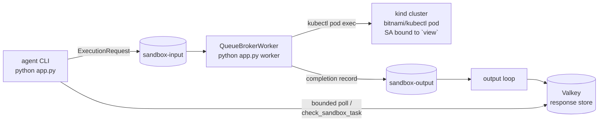

# Sandbox Queue Broker over Kafka

The #503 Kafka shape: an agent submits sandbox tasks over a Kafka queue to a
`QueueBrokerWorker` that executes them as **read-only kubectl pods** in a Kubernetes
cluster, with the pod ServiceAccount's RBAC as the security boundary. The agent side here is
a local CLI, but it is exactly the split a Lambda- or ECS-hosted deployment uses: the two
halves share only the sandbox topics and the response store.



Three things to observe:

1. **Bounded waits.** `broker.wait_timeout: 8` bounds every synchronous sandbox call; a
   longer execution promotes to a pending task, the turn ends, and `check_sandbox_task`
   returns the finished output on a later turn (the whole recovery contract).
2. **RBAC as the boundary.** `k8s/rbac.yaml` binds the sandbox pod ServiceAccount to the
   `view` ClusterRole. Read-only kubectl succeeds; any write comes back `Forbidden` from the
   API server, no matter what the command string says. Agent Kernel never parses command
   strings for safety (that is not a boundary).
3. **At-least-once execution.** Kafka redelivers on failure until `max_receive_count`, then
   the worker records a permanent-failure completion; side-effectful commands are not
   exactly-once.

## Prerequisites

Docker, [kind](https://kind.sigs.k8s.io/), kubectl, and an OpenAI API key.

## Run it

```bash
./build.sh                 # or: ./build.sh local  (installs agentkernel from ../../../ak-py/dist)
export OPENAI_API_KEY=sk-...

# 1. Kafka + Valkey
docker compose up -d --wait

# 2. The four sandbox topics (Agent Kernel never creates topics)
for t in sandbox-input sandbox-output sandbox-input.dlq sandbox-output.dlq; do
  docker exec ak-sandbox-kafka /opt/kafka/bin/kafka-topics.sh --bootstrap-server localhost:9092 \
    --create --if-not-exists --topic "$t" --partitions 4
done

# 3. The cluster, the RBAC boundary, and the worker's kubeconfig
kind create cluster --name ak-sandbox-demo --wait 120s
kind export kubeconfig --name ak-sandbox-demo --kubeconfig kind-kubeconfig
kubectl --kubeconfig kind-kubeconfig apply -f k8s/rbac.yaml
# optional but recommended: pre-load the sandbox image so the first pod starts fast
docker pull bitnami/kubectl:1.33 && kind load docker-image bitnami/kubectl:1.33 --name ak-sandbox-demo

# 4. The two processes (separate terminals)
uv run app.py worker
uv run app.py
```

Things to try in the CLI:

    Run kubectl get pods -A in the sandbox and summarize what is running.
    Try to delete a pod with kubectl. What happens?
    Run "sleep 30 && date" in the sandbox. Then, on the next turn, check the task.

The automated version of all of this is `uv run pytest -s` (it self-skips without docker,
kind, kubectl, or `OPENAI_API_KEY`, and tears down everything it created).

## The Lambda-mode variant (not automated)

To run the agent side in AWS Lambda (or ECS) against this same worker:

- Keep `sandbox.broker.queue` pointed at the shared Kafka cluster from both sides (the
  Lambda's config carries the same `input_topic`/`output_topic`).
- Swap the response store for a backend both sides reach, e.g. DynamoDB:
  `sandbox.broker.response_store.type: dynamodb` with its table config; completions land
  there via the worker's output loop and the Lambda's bounded poll (and later
  `check_sandbox_task` calls) read the same table.
- Set `sandbox.broker.worker_timeout_ceiling` on the agent side to the Lambda runtime limit
  so an over-long `policy.timeout` is rejected at submit instead of dying mid-wait.
- Deploy the worker itself with the ak-k8s Helm chart's standalone install
  (`sandboxWorker.enabled: true`, `ioHandler.enabled: false`, `agentRunner.enabled: false`);
  see the chart README's sandbox worker section.

## Files

| File | Role |
|---|---|
| `app.py` | Both roles: the CLI agent (default) and `python app.py worker` |
| `config.yaml` | One config for both halves: kubernetes profile, queue broker over Kafka, Valkey store |
| `docker-compose.yaml` | Local Kafka (KRaft) + Valkey |
| `k8s/rbac.yaml` | The sandbox pod ServiceAccount + `view` binding: the security boundary |
| `app_test.py` | The automated end-to-end run (infrastructure included) |
