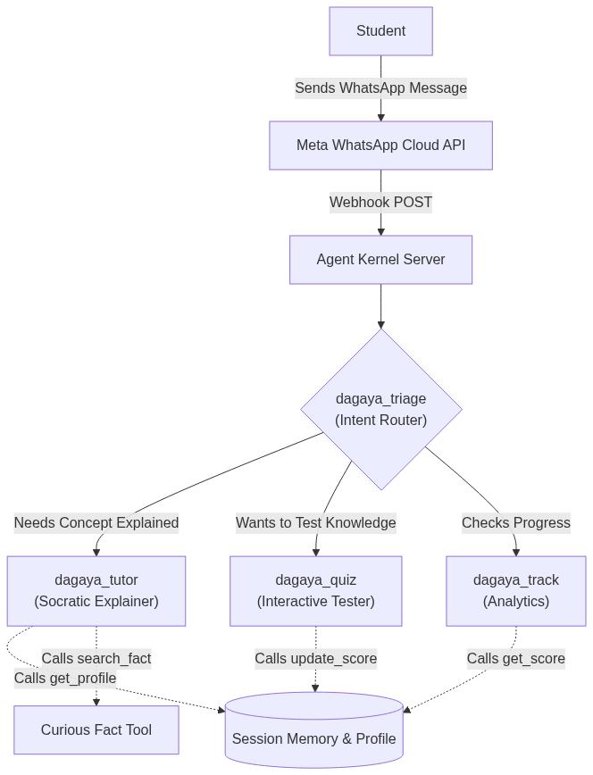

# Dagaya — The Curious AI Learning Companion

<div align="center">
  
  <br>
  <i>"Ado! Hi there! I'm Dagaya, your super fun study companion!"</i>
  <br><br>

  
  
  <h3>Built by Team EMBERWOLVES</h3>
  
  **Contributors**: [@Mavros-Lykos](https://github.com/Mavros-Lykos) &bull; [@malishadilanjana](https://github.com/malishadilanjana) &bull; [@Chvi2005](https://github.com/Chvi2005) &bull; [@Oska219](https://github.com/Oska219) &bull; [@shasha628](https://github.com/shasha628)
  
  <br>

  
  
  
  
  
  
  <br><br>

  <table>
    <tr>
      <td align="center">
        <b>Try it live instantly!</b><br><br>
        <br><br>
        <a href="https://ulfheonar.com/dagaya"><strong>👉 ulfheonar.com/dagaya</strong></a>
      </td>
    </tr>
  </table>

  <br>
  
  *Directly advancing **UN SDG 4 (Quality Education)** & **UN SDG 10 (Reduced Inequalities)***
</div>

---

## 1. Meet Dagaya!
*Your curious, slightly mischievous, and incredibly smart AI learning companion on WhatsApp.*

|  |  |  |
|:---:|:---:|:---:|
| **He speaks your language!**<br>Fluent in English, Sinhala, Tamil, and Hindi. | **No cheating allowed!**<br>Uses the Socratic method to make YOU think and learn. | **Always encouraging!**<br>Cheers you on and celebrates every little victory! |

---

## 2. Problem Statement: The Global Education & Language Gap

Access to high-quality, personalized education remains an unsolved global challenge. In developing nations and marginalized communities, students face insurmountable barriers: prohibitive costs for private tutoring, extreme student-to-teacher ratios in public schools, and a rigid, "one-size-fits-all" curriculum that leaves many behind.

While AI tools like ChatGPT exist, they are fundamentally flawed for this demographic:
1.  **Language Barriers**: The vast majority of cutting-edge AI is optimized for English, leaving behind students who speak regional languages like Sinhala, Tamil, or Hindi.
2.  **Lack of Context**: Standard AI tools lack awareness of the student's local education system. A student in Sri Lanka studying for their O/Levels needs vastly different examples than a student in India studying for CBSE.
3.  **Platform Accessibility**: Web-based AI apps require high-speed internet and computers. In many developing regions, the only ubiquitous digital platform is **WhatsApp**.

**Dagaya** solves this by delivering a highly accessible, context-aware AI tutoring system directly through WhatsApp. By optimizing every interaction to the student's specific country and target exam, and by breaking down language barriers with resilient multi-lingual LLM support, Dagaya democratizes premium tutoring for everyone.

---

## 2. Solution Overview & Technical Architecture

Dagaya is a sophisticated multi-agent system built entirely upon the open-source **Agent Kernel** framework. It acts not just as an answering machine, but as a proactive learning companion that employs the Socratic method to guide students to answers.

### Key Innovations
*   **Global & Contextual Grounding:** During onboarding, Dagaya captures the student's target exam (e.g., "Sri Lankan A/Levels") and country. Every subsequent explanation by the tutoring agent is grounded in this specific curriculum.
*   **Multi-Lingual Mastery:** Fully supports conversational learning in **English, Sinhala, Tamil, and Hindi**.
*   **Content Guardrail:** A zero-LLM-call regex guardrail in `tools.py` intercepts every message before the AI sees it, blocking violence, adult content, and hate speech to keep the platform safe for children.
*   **Real-Time Web Search:** Equipped with a live `search_online` web-browsing tool, Dagaya can independently fetch current events, up-to-date facts, and correct hallucinated data in real-time.
*   **Visual Web Search:** Dagaya can automatically search the internet for diagrams, photos, and educational illustrations using `search_images_online`, rendering them natively in WhatsApp for an immersive visual learning experience.
*   **Dynamic LLM Fallback (Resilience):** To ensure 100% uptime and cost-efficiency, Dagaya uses a dynamic routing layer. It defaults to Google's highly capable Gemini models (Flash/Lite). If rate limits are hit, it seamlessly fails over to lightning-fast Groq models.

### Multi-Agent Flow (Architecture Diagram)

The Hub-and-Spoke model ensures users never get stuck in infinite loops, and tools are strictly isolated to the agents that need them.



---

## 3. Setup Instructions

You can reproduce and run this solution locally in minutes by following these steps:

### Prerequisites
*   Python 3.12 or higher.
*   [`uv`](https://docs.astral.sh/uv/) installed globally (the fastest Python package manager).
*   Git for cloning.

### Step-by-Step Installation
1.  **Clone the Repository:**
    ```bash
    git clone https://github.com/Mavros-Lykos/agent-kernel.git
    cd agent-kernel/use-cases/dagaya
    ```

2.  **Install Dependencies:**
    Run the provided build script to instantly install all Agent Kernel and Litellm dependencies:
    ```bash
    chmod +x build.sh
    ./build.sh
    ```

3.  **Configure Environment Variables:**
    Copy the template file to create your local `.env`:
    ```bash
    cp .env.example .env
    ```
    Open `.env` in a text editor and add your API keys. *Note: You only need **one** API key (Groq or Gemini) for CLI mode to work, but both are recommended for the fallback feature to function.*

---

## 4. How to Run the Solution

Dagaya provides two execution paths. We highly recommend **Path A** for quick, frictionless testing.

### Path A: Local CLI Mode (Recommended for Fast Testing)
Experience the full multi-agent routing, tool calling, and LLM fallback logic directly in your terminal without needing to configure Meta Developer accounts.

```bash
uv run python demo.py
```
*When prompted, type `!help` to see commands. You can chat naturally, and the system will route your requests to the Tutor or Quiz agent automatically.*

### Path B: Production WhatsApp Webhook Server
To run the actual WhatsApp integration (as intended for production):

1. Start the Dagaya server:
   ```bash
   uv run python server.py
   ```
2. In a separate terminal, expose port 8000 to the internet securely:
   ```bash
   ngrok http 8000
   ```
3. Copy the generated `https` URL from ngrok and paste it into your Meta WhatsApp Developer Dashboard as the Webhook URL.

---

## 5. Agent Kernel Usage (Implementation Details)

This submission makes extensive, advanced use of the core Agent Kernel framework:
*   **`AgentService` & Session Memory**: We utilize `session.type: in_memory` (configurable to Redis via yaml) to persist the student's context, quiz scores, and language preferences across conversation turns.
*   **`OpenAIModule` Injection**: We leverage the module to seamlessly abstract our LLM fallback chain.
*   **ToolContext Injection**: Custom Python tools (`get_student_profile`, `update_student_progress`) explicitly accept the `ToolContext`, allowing agents to dynamically read and write to the Agent Kernel session state.
*   **Native WhatsApp Module**: Configuration is fully handled by `config-whatsapp.yaml`, routing all incoming messages directly to `dagaya_triage`.
*   **Content Guardrail**: Pre-LLM safety filter in `tools.py` (`check_guardrail`) blocks inappropriate content with zero latency and zero API cost.

---
*Built with ❤️ by Team EMBERWOLVES for IDEALIZE 2026*

🌐 **Live Demo:** https://ulfheonar.com/dagaya
