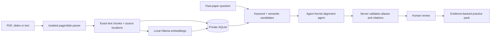

# ScopeWise

### Study what your module actually expects.

[](https://github.com/yaalalabs/agent-kernel)


**ScopeWise turns current course material and past papers into an evidence-backed practice plan.** It identifies which questions fit the module now, distinguishes syllabus relevance from assessment style, and builds a balanced practice pack without pretending to predict the next exam.

Built as an individual [IDEALIZE 2026](COMPETITION.md) mini-competition submission by [@chirana07](https://github.com/chirana07), using Agent Kernel and local Ollama models. No mandatory paid model API or hosted vector database is required.

> **Pilot safety boundary:** Every AI judgment is a reviewable draft with a verbatim source citation. Lecturer identity never proves assessment style, and generated practice is always labeled.

## Why ScopeWise

| Student problem | ScopeWise response |
| --- | --- |
| Search results are too broad, too basic, or too advanced | Compares each question with the approved current scope |
| Old papers may reflect a different lecturer or assessment style | Judges syllabus fit and current assessment fit independently |
| Generic AI study tools hide where conclusions came from | Shows the document, page or slide, and exact supporting quote |
| A fixed question bank leaves important outcomes uncovered | Fills missing pack slots at Easy, Medium, or Difficult depth |
| Course changes silently make earlier advice unreliable | Marks affected comparisons and packs stale with a visible reason |

## Key capabilities

- **Upload-first workflow:** provide the current scope and past paper; ScopeWise handles document roles, extraction, retrieval, comparison, and preparation.
- **Private local RAG:** exact-text chunks, metadata, and optional Ollama embeddings stay in SQLite.
- **Evidence-gated review:** unknown or invalid citations become uncertain instead of being silently accepted.
- **Grounded pack generation:** reviewed source questions come first; generated questions only fill missing slots and cite approved objectives.
- **Lecturer-change resilience:** changes invalidate dependent guidance and results without guessing what a new lecturer will ask.
- **Agent Kernel integration:** registered extraction, alignment, generation, and assistant agents run through `AgentService` and scoped tools.

## Project map

| Resource | Purpose |
| --- | --- |
| [Competition evidence](COMPETITION.md) | Rubric mapping and submission checklist |
| [Demo script](DEMO.md) | Product demonstration flow |
| [Video guide](VIDEO_GUIDE.md) | Recording and AI voiceover instructions |
| [Evaluation](EVALUATION.md) | Measured behavior, limitations, and release gates |
| [Deployment](DEPLOYMENT.md) | Docker, HTTPS, backup, and operating guidance |
| [Specification](SPEC.md) | Product scope and evidence invariants |

## Problem statement

A search result or an old paper does not know the boundaries of your module. Some questions are too advanced, others miss required skills. A change of lecturer adds another uncertainty: a question can remain relevant to the syllabus while asking for an answer format that no longer matches current guidance.

## Solution overview

1. Choose **Start from my material** and upload a current syllabus/module outline plus a past paper. Current assessment guidance is optional.
2. ScopeWise assigns those file roles, indexes them locally, extracts source-cited scope and questions, and prepares the comparison automatically.
3. Review **syllabus fit** and **current assessment fit** independently. Every prepared judgment remains unreviewed, and uncertain or incorrect evidence can be corrected.
4. Choose a pack size and optional Easy, Medium or Difficult generation. Reviewed uploaded questions come first; the local agent can fill missing slots with clearly labeled syllabus-grounded practice questions.

The advanced flow still allows documents, objectives and questions to be added or corrected individually. The fast path removes repeated setup forms; it does not let the model approve its own source-alignment judgments. Generated questions require an explicit pack opt-in, cite their grounding basis and remain labeled for inspection.

ScopeWise also keeps a server-authored **Change impact** history. When the lecturer, approved syllabus, current guidance, objective scope, or a human judgment changes, the Home screen explains what became stale and gives one safe next step. Lecturer identity is never treated as proof of assessment style.

New model comparisons include collapsed, evidence-safe provenance: the registered local agent, retrieval mode, candidate and exclusion counts, guidance excerpts, discarded aliases, and the human-review requirement. Prompts, vectors, session IDs, and account identifiers are never displayed.

Use **Start manual review** to work through the same evidence controls without model suggestions. Its origin is explicitly labeled; it is never presented as AI output.

Changing the lecturer invalidates old analyses and packs and withdraws approval from existing assessment guidance. It does **not** infer what the new lecturer will ask. Approving a replacement syllabus retires the previous syllabus and its objectives. Historical analyses remain visible as stale.

| Syllabus fit | Meaning |
| --- | --- |
| In scope | Evidence supports the selected objective and required action/depth |
| Partly in scope | Useful practice, but not full objective coverage |
| Explicitly excluded | A linked current objective explicitly excludes it |
| Needs evidence | There is insufficient evidence to decide; absence is not exclusion |

Assessment fit is separately **matches guidance**, **different format**, or **not established**. Historical papers alone cannot certify current assessment style.

## Setup instructions

Requirements: Python **3.12 or 3.13**, [uv](https://docs.astral.sh/uv/getting-started/installation/), [Ollama](https://ollama.com/download), and sufficient memory for a downloaded model. A 16 GB Apple Silicon machine was used during development; this is not a concurrency capacity guarantee.

From this directory:

```bash
cp .env.example .env
uv sync --frozen --python 3.12
ollama pull llama3.1:latest
ollama pull nomic-embed-text:latest
# If Ollama is not already running, start it in another terminal:
ollama serve
```

## How to run

Start the app in a separate terminal, from the same directory:

```bash
uv run uvicorn scopewise.app:create_app --factory --host 127.0.0.1 --port 8080 --workers 1 --no-access-log
```

Open **http://127.0.0.1:8080**. Choose **Create account**. For local development only, the invitation is `scopewise-local`; choose your own username and a password of at least 12 characters.

Click **Explore sample module** for a guided example. The sample consists entirely of original synthetic sources and **human-authored reviewed judgments**. Loading it does not call the model. Files in `sample_data/` let you demonstrate fresh uploads separately.

For a fresh model-backed review, choose **Start from my material**. Select a current-scope file and a past-paper file, plus current assessment guidance when available, then click **Upload and prepare my review**. ScopeWise creates the module from the scope filename when necessary and runs the local extraction/comparison pipeline. Keep the page open while the local model works. The resulting decisions are drafts marked for human review.

The local review, editing, sample and pack workflows do not require a running model. Fresh extraction, comparison and assistant responses require Ollama. Semantic source search uses the local `nomic-embed-text` model and falls back to keyword search if embeddings are unavailable. There is **no cloud fallback and no mandatory paid API**. Hardware, electricity, hosting, domain and network use can still cost money. Downloading model weights requires internet access; inference then runs locally. Only localhost and the documented private container hostnames are accepted as model endpoints.

## What happens to an uploaded file

ScopeWise does not send the document to a hosted vector service. It extracts text per PDF page or PowerPoint slide, splits each page into overlapping exact-text chunks, and stores those chunks in the same private SQLite database as the course. When local Ollama embeddings are available, vectors are stored as compact binary values beside the chunks and ranked with vector similarity plus keyword overlap. If embedding fails, upload still succeeds and search uses keyword overlap.

In the guided setup, the upload slots establish the source roles: current scope, past questions and optional current assessment guidance. The local preparation job validates every extracted quote against its source, makes the extracted items available to the comparison, and saves only unreviewed judgments. A user must confirm suitable source judgments before they enter a pack. If generation is enabled, `scopewise_generate` fills only the missing slots from confirmed required objectives, avoids explicit exclusions and existing questions, follows cited guidance when available, and labels every result as AI-generated practice rather than a prediction.

This is a small-course RAG design, so it does not need a separate vector database. Search retrieves a few relevant current-guidance chunks for question comparison and always preserves the original document ID, page/slide and verbatim text. Scope/objective extraction is deliberately different: it scans every chunk in bounded groups, because retrieving only the most similar passages could miss an explicit exclusion. Model references are resolved against server-supplied aliases; an unknown alias is discarded and that judgment becomes uncertain instead of aborting the whole comparison.



## How Agent Kernel is used

`scopewise/agents.py` registers three Pydantic AI agents through `PydanticAIModule`:

- `scopewise_extract`: proposes source-grounded draft objectives or questions.
- `scopewise_align`: compares one question at a time using a small structured decision. The application resolves its short references to the approved objective citations, verifies guidance quotes and keeps the result unreviewed.
- `scopewise_generate`: fills a requested pack with Easy, Medium or Difficult questions grounded in confirmed objectives and current guidance. Generated questions never masquerade as past-paper content.
- `scopewise_assistant`: calls `get_course_overview`, `read_source_page`, `get_coverage_review`, `get_change_impact`, and `prepare_practice_pack`.

All model work runs through **AgentService**. Tools get owner/course identity from **ToolContext** populated by the server, never from model arguments or document instructions. Course context is isolated by account/course, cleared on revision changes, and bounded to eight conversation turns before reset. Sessions are in memory; courses, documents, jobs and judgments are in SQLite.

The assistant overview and page-reader tools expose only human-approved sources and objectives backed by approved sources. They may report how many drafts await review, but draft text never enters assistant context.

The Telegram adapter subclasses Agent Kernel's **AgentTelegramRequestHandler**, uses its command/message dispatch and message delivery, and routes authenticated messages into the same assistant. It adds private-chat linking, a required secret, rate limits and duplicate-update protection. It does not mount the framework's unauthenticated generic agent routes.

## Telegram setup

1. Create a bot with Telegram's **@BotFather**. Do not put the token in chat, screenshots or Git.
2. Configure `.env` with `AK_TELEGRAM__BOT_TOKEN`, a random `AK_TELEGRAM__WEBHOOK_SECRET` of at least 24 characters, and your real HTTPS `SCOPEWISE_PUBLIC_URL`.
3. Restart the app. Register the webhook explicitly:

```bash
uv run python -m scripts.setup_telegram
```

4. In the web workspace select **Connect Telegram**. Send the displayed `/link CODE` to your bot in a **private chat** within ten minutes.
5. Send `/courses`, then `/use 1`. Ask about gaps or request a pack from reviewed questions. `/unlink` disconnects the account.

Codes are single-use and stored hashed. Group messages, edits and media are not accepted. Documents and approvals stay in the web workspace. Telegram can see messages sent through its platform. Linking a workspace does not make its source files publicly downloadable.

Webhook registration changes your bot configuration; it is never performed automatically. A live bot and HTTPS deployment are still required to demonstrate the competition's messaging requirement. See [Telegram's webhook documentation](https://core.telegram.org/bots/api#setwebhook).

## Verification

```bash
uv run pytest -q
uv run ruff check .
uv run ruff format --check .
node --check static/app.js
# Requires the local model; uses only original synthetic material:
uv run python -m scripts.smoke_model
uv run python -m scripts.evaluate_model
# One-command rubric/readiness check:
uv run python -m scripts.judge_check --full
```

The smoke script verifies structured extraction, **actual Agent Kernel tool calls**, and structured comparison. The evaluation script compares eight development examples with hand-authored expected judgments and writes `output/local-evaluation.json`. These examples were used while tuning the prompt: they are **not an independent accuracy benchmark**. A quote validator checks evidence provenance, not whether a semantic judgment is correct.

See [EVALUATION.md](EVALUATION.md) for measured limitations and remaining release gates. Model suggestions may miss exclusions or over-link related concepts. Human review is mandatory; validate with your real course materials before relying on the output.

## Deployment and operation

[DEPLOYMENT.md](DEPLOYMENT.md) covers the non-root Docker container, private Ollama connection, HTTPS configuration, backup/restore and launch checklist. [DEMO.md](DEMO.md) contains the competition demo sequence. [SPEC.md](SPEC.md) records the product scope; [PLAN.md](PLAN.md) tracks implementation.

Pilot limits: 10 modules/account, 12 documents/module, 8 MB/file, 60 pages or slides/file, 100,000 extracted characters/file, bounded model context per call, 30 objectives and 50 questions/module, one active model task/process, three queued jobs, and a 15-minute job timeout. Start with **one topic and a few questions**. Scanned/handwritten PDFs, complex diagram understanding, old binary PPT files, video search and generated answers are deferred.

Data is private to each account, but SQLite is not encrypted at rest by this application. Use encrypted storage and private backups. Delete a module from settings to remove its active database records; backups and already exported packs require separate retention/deletion. This pilot has no password recovery, billing, public registration, team sharing or multi-replica support.

All changes belong to `use-cases/scopewise/`; no Agent Kernel core files are changed. Before submission, confirm the registered team requirements, upstream stars and submission instructions in the supplied competition guidelines. Do not present synthetic reviewed results as live AI results.
